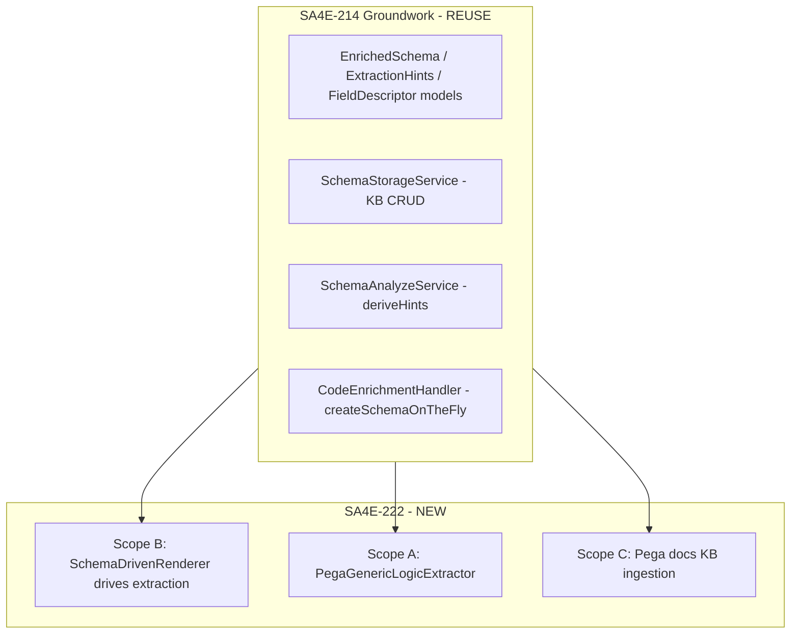
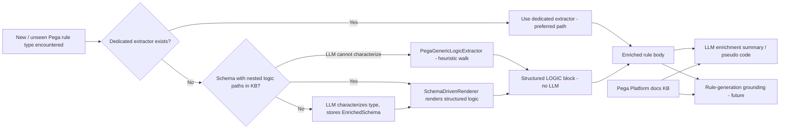

# Business Requirements Document — SA4E-222

**Title:** Generic self-learning Pega rule understanding for LLM enrichment + rule generation
**Project:** SA4E (SDLC Agents 4 Enterprise)
**Ticket:** SA4E-222
**Type:** Story | **Priority:** Medium | **Status:** In Progress
**Reporter / Owner:** Duc Nguyen Minh
**Document version:** v1.0

---

## 1. Business Problem / Background

Today, Pega rule content extraction for LLM enrichment (summary + pseudo code) is **hand-written per rule type** inside `PegaContentExtractor.buildLogic` (a `switch (pxObjClass)`). Each new or complex rule type (Activity, Model/Data Transform, Decision Table, When, Declare-Expressions, Case Type, Flow, etc.) historically required an engineer to inspect a screenshot plus sample JSON and author a dedicated TypeScript extractor.

This approach **does not scale**: Pega exposes hundreds of rule types, each with a distinct nested JSON shape. Rule types without a dedicated extractor fall back to a shallow metadata dump (`buildLogicBlocks`), which produces generic / hallucinated summaries and pseudo code that carry no real analytical value.

In addition, the LLM has **no grounding in Pega platform semantics** — it does not "know Pega" beyond what a single rule instance reveals. We need the LLM to learn Pega concepts from official documentation so it can (1) understand rules more accurately during enrichment and (2) generate correct Pega rules during development.

## 2. Goal

Make Pega rule understanding **generic and self-learning** so that:

- New rule types need **NO hand-written TypeScript**, and
- The LLM gets **real Pega domain knowledge** usable for both enrichment and rule generation.

## 3. Success Metrics

| # | Metric | Target |
|---|--------|--------|
| SM-1 | Rule types lacking a dedicated extractor still produce a structured `LOGIC` block (not a flat `FIELDS` dump) | 100% of sampled unhandled types |
| SM-2 | Existing dedicated extractors (Flow, CaseType, When, Decision, Declare-Expression, Activity, Model) remain the preferred path — zero regression in their output | No behavior change for covered types |
| SM-3 | Generic extractor (Scope A) is deterministic (no LLM calls) and unit-tested against real sample JSON for **≥ 3 previously-unhandled rule types** | ≥ 3 types pass |
| SM-4 | First encounter of an unseen complex rule type auto-creates a schema with nested logic paths; subsequent instances render structured logic **without** new TypeScript | 100% of post-schema instances |
| SM-5 | Pega platform concepts summarized and stored in KB with consistent tags (`pega-doc`, `concept:{name}`, `ruletype:{x}`) | Coverage of core concept areas (rule types, case mgmt, flows, data model, decisioning, UI, integration) |
| SM-6 | Enrichment prompt can pull relevant Pega concept context; a rule-generation flow can retrieve authoritative Pega knowledge | Both pipelines demonstrably retrieve KB entries |
| SM-7 | No regression to existing dedicated extractors and their automated tests | All existing Pega tests green |

## 4. Scope

### 4.1 In Scope

- **Scope A — Generic deterministic extractor (no LLM, covers all rule types).** A `PegaGenericLogicExtractor` that walks rule JSON, skips internal `px*`/`pz*` fields and pure metadata, detects "logic-bearing" nested arrays/objects by structural heuristics, and renders them with structure (id, name, and key relationships like `from→to`, `when→result`, `target=expression`). It becomes the fallback branch in `buildLogic` for any rule type lacking a dedicated extractor, replacing the current shallow `buildLogicBlocks`.
- **Scope B — Schema-driven / LLM self-learning extractor (automatic per new type).** Wire the SA4E-214 schema into extraction so the system learns where logic lives per rule type. Extend `ExtractionHints` (or add a field) to carry **traversable nested logic paths**; upgrade `createSchemaOnTheFly` / `SchemaAnalyzeService.deriveHints` so the LLM emits nested paths; add a `SchemaDrivenRenderer` that resolves those paths and renders via a generic path-walker. `buildLogic` priority order: **dedicated → schema-driven → generic → metadata fallback**. Schemas are created once per rule type, stored in KB, and reused (progressive, self-improving).
- **Scope C — LLM learns Pega platform from official documentation.** Ingest and summarize Pega Platform documentation (`docs.pega.com/bundle/platform/...`) into the KB with structured tags so the LLM has domain grounding for both enrichment and rule generation. Provide a retrieval helper `mem_search("pega concept {ruleType|topic}")`.
- **Cross-cutting.** A scoped re-enrich path (`reenrich-pega-all.ts --kind`) to regenerate existing symbols' bodies; no regression to existing dedicated extractors/tests; code-standards compliance (files ≤ 200 lines, models separated from logic, unit tests per new module); backend runs on `tsx watch`.

### 4.2 Out of Scope

- **Live Pega re-crawl orchestration** (separate concern, covered by extension indexing).
- **The full rule-generation feature itself** — Scope C only provides the KB grounding that a future rule-generation feature will consume.

## 5. Stakeholders

| Role | Stakeholder | Interest |
|------|-------------|----------|
| Product owner / reporter | Duc Nguyen Minh | Drives the requirement; accepts acceptance criteria |
| Enrichment pipeline consumers | LLM enrichment service | Better, non-hallucinated rule summaries/pseudo code |
| Rule-generation (dev stage) consumers | Future dev-stage agent | Authoritative Pega knowledge grounding |
| Reuse dependency owner | SA4E-214 author | Ensures SA4E-214 groundwork is reused, not rebuilt |
| Engineering | DEV (implementation) | Builds extractors/renderers per code-standards |
| Quality | QA | STP/STC + manual checks |
| Delivery | DevOps | Deployment / CI-CD guidance |

## 6. Dependencies (SA4E-214)

SA4E-214 — *"[pega] Extension-driven Schema Creation for Pega Rule Types — On-the-fly LLM-enriched schemas"* (Status: **In Progress**, Priority: High) provides the groundwork that SA4E-222 **reuses, does not rebuild**:

- `EnrichedSchema` / `ExtractionHints` / `FieldDescriptor` models (`backend/src/models/pega-schema.models.ts`).
- `SchemaStorageService` — CRUD over `knowledge_entries` keyed by `source='pega-schema:{ruleType}'`, `type='PEGA_SCHEMA_ENRICHED'`.
- `SchemaAnalyzeService` — dual-strategy (rule-based + LLM fallback) field discovery + `deriveHints`.
- `CodeEnrichmentHandler.loadOrCreateSchemaContext` / `createSchemaOnTheFly` / `formatSchemaForPrompt`.

**Identified gap (to be closed by SA4E-222):** In SA4E-214 the schema is consumed **only** as LLM prompt context; it never drives the mechanical extraction in `PegaContentExtractor`. The hints are coarse (flat keys + an enum-style `logic_structure`), not traversable nested paths. SA4E-222 Scope B closes this gap by making the schema drive extraction.

## 7. Constraints

- **Code standards:** every new source file ≤ 200 lines; models separated from logic; unit tests per new module. (Note: `PegaContentExtractor.ts` is currently 243 lines — new extractors must be added as **separate** modules, not appended.)
- **No regression:** existing dedicated extractors (Flow, CaseType, When, Decision, Declare-Expression, Activity, Model) and their tests must continue to behave identically.
- **Determinism for Scope A:** the generic extractor must make **no LLM calls** (low latency, no external dependency, reproducible output).
- **Re-enrichment:** existing indexed symbols must be re-indexed (body regenerated) to benefit from the new extractors via the existing `reenrich-pega-all.ts --kind` path.
- **Runtime:** backend runs on `tsx watch`; viewer/extension changes require appropriate rebuild.
- **Licensing (Scope C):** respect `docs.pega.com` content licensing — store **summaries/paraphrases with source attribution**, not verbatim bulk copy.

## 8. High-Level Business Flow

## 9. Related Tickets

- **SA4E-214** (dependency, reuse) — Extension-driven Schema Creation for Pega Rule Types.
- Related prior fixes on the working branch: Pega kind derivation (`pega_` + `pxObjClass`), 5-part FQN identity (`type:class:name:ruleset:version`), `pyRuleSet` casing fix, Flow/CaseType/When/Declare-Expression extractors, graph node color/legend consistency, dashboard graph-count source-of-truth, extension token proactive-refresh.
