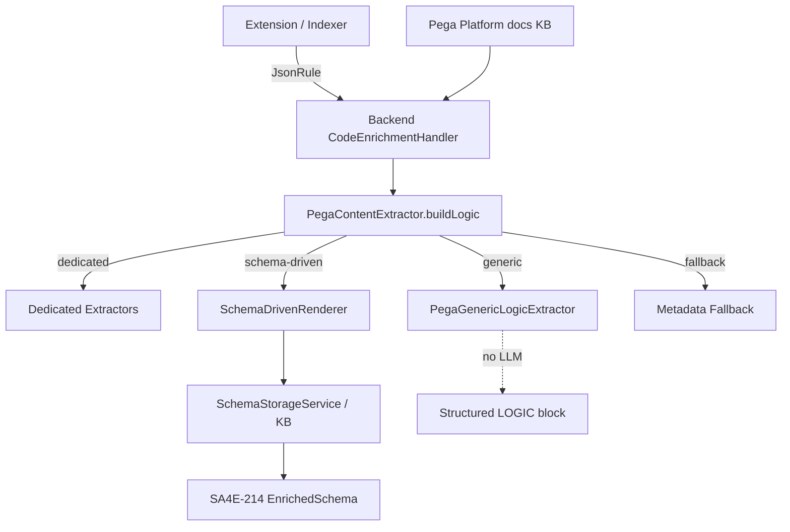
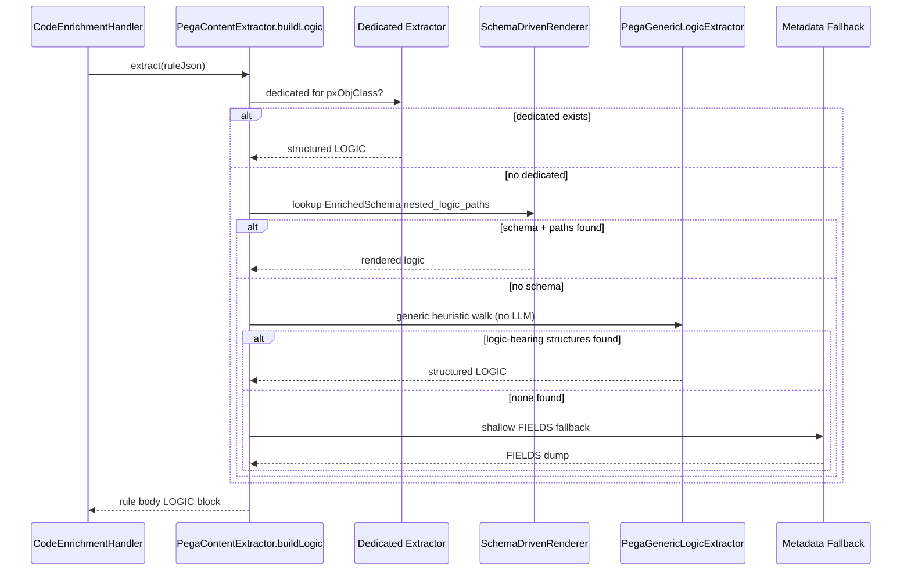

# Functional Specification Document — SA4E-222

**Title:** Generic self-learning Pega rule understanding for LLM enrichment + rule generation
**Project:** SA4E (SDLC Agents 4 Enterprise)
**Ticket:** SA4E-222
**Type:** Story | **Priority:** Medium
**Depends on:** SA4E-214 (reuse, do not rebuild)
**Document version:** v1.0

---

## 1. Introduction

This FSD specifies the functional behavior for SA4E-222, derived from the BRD (docs/SA4E-222-BRD.md). It covers three scopes (A: generic deterministic extractor, B: schema-driven self-learning extractor, C: Pega Platform docs KB ingestion) plus cross-cutting requirements. All new functional behavior must be implemented as **separate modules** (files ≤ 200 lines) per code-standards, reusing the SA4E-214 models and services rather than rebuilding them.

### 1.1 System context (extraction pipeline)



---

## 2. Functional Requirements

### 2.1 Scope A — `PegaGenericLogicExtractor` (deterministic, no LLM)

| ID | Requirement |
|----|-------------|
| FR-A-1 | The system SHALL provide a `PegaGenericLogicExtractor` that walks the rule JSON tree and renders logic-bearing structures **generically**, with no LLM invocation. |
| FR-A-2 | The extractor SHALL skip internal fields whose keys match `px*` / `pz*` and pure metadata fields (reuse existing `isInternalKey()` semantics). |
| FR-A-3 | The extractor SHALL detect "logic-bearing" nested arrays/objects by structural heuristics: arrays of objects whose members expose relationship-bearing keys such as `id`, `name`, `from`, `to`, `when`, `value`, `label`, `target`, `result`. |
| FR-A-4 | For each detected logic-bearing collection, the extractor SHALL render structure rather than flat scalars: emit `id`, `name`, and key relationships (`from→to`, `when→result`, `target=expression`, etc.). |
| FR-A-5 | The extractor SHALL become the **fallback branch** in `PegaContentExtractor.buildLogic` for any rule type lacking a dedicated extractor, **replacing** the current shallow `buildLogicBlocks` path. |
| FR-A-6 | The extractor SHALL be deterministic and idempotent: identical input JSON yields identical output text. |
| FR-A-7 | The module SHALL be a separate file ≤ 200 lines and include unit tests covering ≥ 3 previously-unhandled rule-type samples. |

### 2.2 Scope B — `SchemaDrivenRenderer` (self-learning, wired to SA4E-214)

| ID | Requirement |
|----|-------------|
| FR-B-1 | The system SHALL extend `ExtractionHints` (or add a new field) to carry **traversable nested logic paths** (e.g. `pyModelProcess.pyShapes`, `pyStages[].pyProcesses[]`), replacing the current coarse `primary_logic_field` + enum `logic_structure` representation. Backward compatibility with existing stored schemas MUST be maintained. |
| FR-B-2 | `createSchemaOnTheFly` / `SchemaAnalyzeService.deriveHints` SHALL be upgraded so that, for an unseen rule type, the LLM emits the nested path(s) where logic lives and how to render them (added to the `EnrichedSchema`). |
| FR-B-3 | The system SHALL provide a `SchemaDrivenRenderer` that, given an `EnrichedSchema` + `ruleJson`, resolves the configured nested logic paths and renders them via a generic path-walker. |
| FR-B-4 | `PegaContentExtractor.buildLogic` dispatch priority SHALL be: **(1) dedicated extractor → (2) schema-driven renderer (learned paths) → (3) generic extractor (Scope A) → (4) metadata fallback.** |
| FR-B-5 | A schema SHALL be created **once per rule type**, stored via the existing `SchemaStorageService` keying (`source='pega-schema:{ruleType}'`, `type='PEGA_SCHEMA_ENRICHED'`), and reused for all subsequent instances of that type (progressive, self-improving). |
| FR-B-6 | When the LLM cannot characterize a type (no usable paths), the system SHALL fall back safely to Scope A (generic extractor), and ultimately to the metadata fallback. |
| FR-B-7 | `SchemaDrivenRenderer` SHALL be a separate module ≤ 200 lines with unit tests (schema present, path resolves; schema absent, falls back). |

### 2.3 Scope C — Pega Platform docs KB ingestion

| ID | Requirement |
|----|-------------|
| FR-C-1 | The system SHALL crawl/fetch relevant Pega Platform documentation pages from `https://docs.pega.com/bundle/platform/...` (overview + linked pages within the Platform bundle). |
| FR-C-2 | For each concept area (rule types, case management, flows, data model, decisioning, UI, integration), the system SHALL produce a concise **summary/paraphrase** and store it in the KB with consistent tags: `pega-doc`, `concept:{name}`, `ruletype:{x}`. |
| FR-C-3 | Stored entries SHALL be retrievable by both pipelines: (a) enrichment (understanding a rule) and (b) rule generation (grounding generated rule JSON). |
| FR-C-4 | The system SHALL expose a retrieval helper `mem_search("pega concept {ruleType|topic}")` returning authoritative platform knowledge to both pipelines. |
| FR-C-5 | Ingestion SHALL respect `docs.pega.com` licensing: store summaries/paraphrases **with source attribution** (source URL), never verbatim bulk copy. |

---

## 3. Acceptance Criteria

### 3.1 Scope A

- **AC-A-1:** For a rule type with NO dedicated extractor, the generated body contains a structured `LOGIC` block (not just a flat `FIELDS` dump).
- **AC-A-2:** Existing dedicated extractors (Flow, Case Type, When, Decision, Declare-Expression, Activity, Model) remain the preferred path and produce unchanged output.
- **AC-A-3:** The generic extractor is deterministic (no LLM calls) and passes unit tests against real sample JSON for **≥ 3 previously-unhandled rule types**.

### 3.2 Scope B

- **AC-B-1:** The first encounter of an unseen complex rule type auto-creates a schema with nested logic paths; subsequent instances render structured logic **without** new TypeScript.
- **AC-B-2:** The schema is stored/retrieved via the existing `SchemaStorageService` keying.
- **AC-B-3:** The system falls back safely to Scope A when the LLM cannot characterize the type.

### 3.3 Scope C

- **AC-C-1:** Pega platform concepts are summarized and stored in the KB with consistent tags (`pega-doc`, `concept:{name}`, `ruletype:{x}`).
- **AC-C-2:** The enrichment prompt can pull relevant Pega concept context for the rule type being enriched.
- **AC-C-3:** A rule-generation flow (dev stage) can retrieve authoritative Pega knowledge to ground generated rule JSON.
- **AC-C-4:** Ingestion complies with `docs.pega.com` licensing (summaries/paraphrases with source attribution, not verbatim bulk copy).

---

## 4. Data / Model Notes

### 4.1 Existing model (SA4E-214, reused — `backend/src/models/pega-schema.models.ts`)

```typescript
// CURRENT (coarse) — to be extended in Scope B
ExtractionHints {
  primary_logic_field: string | null;
  logic_structure: string | null;       // enum-style, not traversable
  summary_focus: string | null;
}

EnrichedSchema {
  rule_type: string;
  schema_version: number;
  created_at: string; updated_at: string;
  identity_fields: Record<FieldDescriptor>;
  logic_fields: Record<FieldDescriptor>;
  connectivity_fields: Record<FieldDescriptor>;
  extraction_hints: ExtractionHints;
  known_fields: string[];
  coverage: number;            // 0..100
  discovered_sections: string[];
}

FieldDescriptor {
  path: string;                // e.g. "pyStages[].pyProcesses[]"
  category: 'identity'|'logic'|'connectivity'|'metadata'|'configuration';
  type: string;
  description: string;
  frequency: 'always'|'common'|'rare'|'optional';
}
```

### 4.2 Proposed extension (Scope B)

- Add to `ExtractionHints` a traversable field, e.g.:
  `nested_logic_paths: string[]` (e.g. `["pyModelProcess.pyShapes", "pyStages[].pyProcesses[]"]`) plus an optional `path_render_hint`.
- Keep `primary_logic_field` / `logic_structure` / `summary_focus` for **backward compatibility** with schemas already stored by SA4E-214.
- `SchemaDrivenRenderer` resolves each path against `ruleJson` (supporting bracket-index and dotted traversal) and delegates rendering to the generic path-walker shared with Scope A.

### 4.3 Extraction dispatch (buildLogic)

```
buildLogic(ruleJson):
  if dedicatedExtractor(pxObjClass) exists -> dedicated (preferred)
  else if EnrichedSchema has nested_logic_paths -> SchemaDrivenRenderer
  else if PegaGenericLogicExtractor finds logic-bearing structures -> generic
  else -> metadata fallback (shallow FIELDS dump)
```

### 4.4 KB keying (reused from SA4E-214)

- `SchemaStorageService` stores `EnrichedSchema` under `source='pega-schema:{ruleType}'`, `type='PEGA_SCHEMA_ENRICHED'`.
- Scope C doc entries stored with tags `pega-doc`, `concept:{name}`, `ruletype:{x}` and a `source` URL for attribution.

---

## 5. Non-Functional Requirements

| ID | Requirement |
|----|-------------|
| NFR-1 | **Determinism / Performance (Scope A):** no LLM calls; extraction must be fast and reproducible (suitable for bulk re-enrichment). |
| NFR-2 | **No regression:** all existing Pega dedicated-extractor unit tests remain green; output for covered types is unchanged. |
| NFR-3 | **Code standards:** each new source file ≤ 200 lines; models separated from logic; one unit-test module per new component. |
| NFR-4 | **Re-enrichment:** existing indexed symbols can be regenerated via `reenrich-pega-all.ts --kind` to benefit from new extractors. |
| NFR-5 | **Licensing (Scope C):** summaries/paraphrases only, with source attribution; no verbatim bulk copy of `docs.pega.com`. |
| NFR-6 | **Runtime:** backend on `tsx watch`; extension/viewer changes rebuilt as needed. |
| NFR-7 | **Extensibility:** adding support for a new rule type requires NO new TypeScript (Scope B self-learning) or, at worst, only the generic path (Scope A). |

---

## 6. Open Questions

| # | Question | Owner / Blocked by |
|---|----------|--------------------|
| OQ-1 | Which specific ≥ 3 previously-unhandled rule types will be used to validate Scope A? Need real sample JSON. | DEV / Product |
| OQ-2 | Exact shape of the `ExtractionHints` extension — new `nested_logic_paths` field vs. redefining `logic_structure`? | SA / DEV |
| OQ-3 | How deep should the `docs.pega.com` crawl go, and are there rate limits / auth constraints for the Platform bundle? | DEV / Infra |
| OQ-4 | How is `mem_search` exposed/namespaced so both the enrichment and (future) rule-generation pipelines can call it? | SA / DEV |
| OQ-5 | Should `SchemaDrivenRenderer` tolerate partial path resolution (some nested paths missing in an instance) gracefully? | SA / DEV |
| OQ-6 | Required attribution format for Scope C summaries to satisfy `docs.pega.com` licensing? | Legal / Product |

---

## 7. Interaction Sequence (buildLogic dispatch)



---

## 8. Traceability to BRD

| BRD Section | FSD Coverage |
|-------------|--------------|
| §3 SM-1 / SM-3 | FR-A-1..A-7, AC-A-1..A-3 |
| §3 SM-4 | FR-B-1..B-7, AC-B-1..B-3 |
| §3 SM-5 / SM-6 | FR-C-1..C-5, AC-C-1..C-4 |
| §4.1 In Scope (cross-cutting) | NFR-2, NFR-3, NFR-4, NFR-6 |
| §7 Constraints | NFR-3, NFR-5, FR-B-1 (backward compat) |
