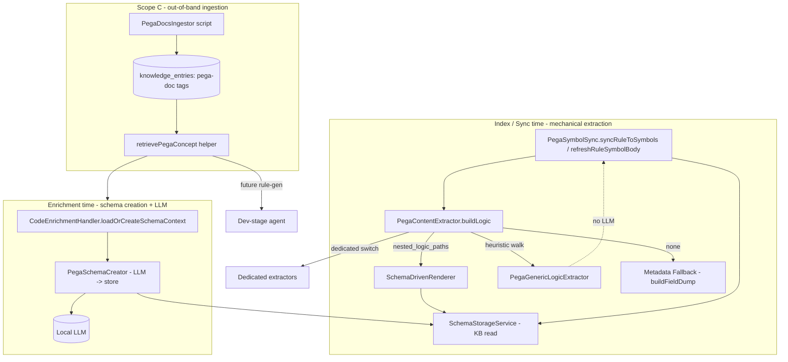
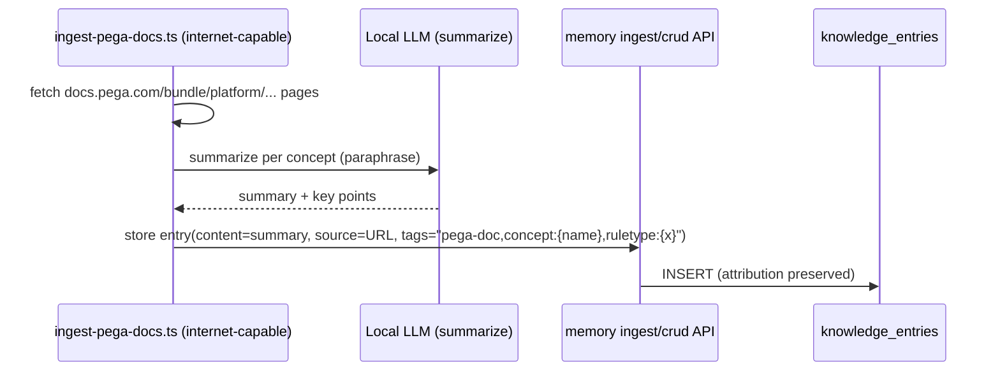

# Technical Design Document — SA4E-222

**Title:** Generic self-learning Pega rule understanding for LLM enrichment + rule generation
**Project:** SA4E (SDLC Agents 4 Enterprise)
**Ticket:** SA4E-222 | **Type:** Story | **Priority:** Medium
**Depends on:** SA4E-214 (reuse, do not rebuild) — *[pega] Extension-driven Schema Creation for Pega Rule Types*
**Document version:** v1.0 | **Status:** Draft for DEV
**Author:** Solution Architect (SA) | **Date:** 2026-08-26

**Source inputs:** `docs/SA4E-222-BRD.md`, `docs/SA4E-222-FSD.md`, Jira SA4E-222, Jira SA4E-214, and direct inspection of `backend/src` (real files/lines cited below).

---

## 1. Introduction

### 1.1 Purpose
This TDD specifies the technical design for SA4E-222, which makes Pega rule understanding **generic and self-learning** across three scopes:
- **Scope A** — `PegaGenericLogicExtractor`: deterministic, LLM-free extraction covering all rule types.
- **Scope B** — `SchemaDrivenRenderer`: schema-driven self-learning renderer wired to the SA4E-214 `EnrichedSchema`.
- **Scope C** — Ingest Pega Platform docs into the KB for LLM grounding (enrichment + future rule generation).

### 1.2 Design Principles (from code-standards)
- Every new source file **≤ 200 lines**; functions ≤ 20 lines (excluding signature).
- **Models separated from logic** (new `*.models.ts` / `types.ts`).
- **Reuse, do not rebuild** SA4E-214 services (`SchemaStorageService`, `SchemaAnalyzeService`, `CodeEnrichmentHandler` wiring).
- **Single Responsibility / Open-Closed**: extractors are Strategies; new rule types need no new TypeScript.
- **No regression**: existing dedicated extractors and their tests stay unchanged (AC-A-2, NFR-2).
- **Determinism (Scope A)**: no LLM calls; reproducible output (NFR-1).

### 1.3 Technology Stack (observed from codebase)
- TypeScript, Node (`tsx watch` runtime), Vitest (unit/integration/e2e).
- Storage: `knowledge_entries` table via `DatabaseAdapter` (`getAsync`/`runAsync`, Postgres + SQLite).
- LLM: local LM Studio/Ollama (`LLMService.complete`), 120s timeout (`CodeEnrichmentHandler.ts:18`).
- KB retrieval: `modules/memory/dispatchers/search.ts` (`mem_search`).

---

## 2. Architecture Overview

### 2.1 High-level (3 scopes)



### 2.2 Dispatch order (implements FSD §4.3, FR-B-4)
1. **Dedicated extractor** (existing `switch (pxObjClass)` in `buildLogic`) — preferred, unchanged.
2. **Schema-driven** (`SchemaDrivenRenderer`) if `EnrichedSchema.extraction_hints.nested_logic_paths` resolved for the rule type.
3. **Generic** (`PegaGenericLogicExtractor`) — deterministic heuristic walk.
4. **Metadata fallback** (`buildFieldDump` = `FIELDS` block).

---

## 3. Component / Module Design

### 3.1 Scope A — `PegaGenericLogicExtractor` (new module, logic only, ≤200 lines)
- **File:** `backend/src/modules/pega/extraction/PegaGenericLogicExtractor.ts`
- **Responsibility:** Walk rule JSON, skip `px*`/`pz*` (reuse exported `isInternalKey`), detect logic-bearing collections by structural heuristics, render with structure (id/name + relationships). No LLM.
- **Reuses** `isInternalKey` / `INTERNAL_PREFIXES` exported from `PegaContentExtractor.ts` (no duplication).
- **Shared path-walker** `renderPathNodes(nodes, label)` lives here and is imported by Scope B (single render algorithm, consistent output).

### 3.2 Scope B — `SchemaDrivenRenderer` (new module, logic only, ≤200 lines)
- **File:** `backend/src/modules/pega/extraction/SchemaDrivenRenderer.ts`
- **Responsibility:** Given `ruleJson` + `nested_logic_paths: string[]`, resolve each path (dotted + `[]` + `[].` notation) and delegate rendering to the shared `renderPathNodes`. Tolerates partial resolution (skip + WARN).
- **Reuses** the `[].` path-splitting precedent from `PegaGenericRule.extractDependencies` (`backend/src/modules/pega/domain/PegaGenericRule.ts:27-40`).

### 3.3 Scope B — `PegaSchemaCreator` (new module, ≤200 lines) — refactor of `CodeEnrichmentHandler`
- **File:** `backend/src/modules/pega/schema/PegaSchemaCreator.ts`
- **Responsibility:** Encapsulate on-the-fly schema creation (currently inline in `CodeEnrichmentHandler.createSchemaOnTheFly:181-201` + `storeEnrichedSchema:204-214`) so it (a) emits `nested_logic_paths` via updated LLM prompt, and (b) **stores via `SchemaStorageService`** (canonical key `pega-schema:{ruleType}`, pure JSON) instead of the legacy `pega-schema-enriched/{ruleType}` format. Resolves DISC-1.

### 3.4 Scope C — `PegaDocsIngestor` + `retrievePegaConcept` (new modules)
- **Ingestion file:** `backend/src/modules/pega/extraction/PegaDocsIngestor.ts` + CLI `backend/scripts/ingest-pega-docs.ts` (runs where internet is available — see Risk R-3).
- **Retrieval file:** `backend/src/modules/memory/pega-concept-retriever.ts` (thin wrapper over existing `mem_search`/`KbRepository` with tag filters `pega-doc`, `concept:{name}`, `ruletype:{x}`). Reused by enrichment (`CodeEnrichmentHandler`/`CodeEnrichmentPromptBuilder`) and future rule-generation.

### 3.5 Wiring point — `PegaSymbolSync` (existing, modified)
- `syncRuleToSymbols` (`PegaSymbolSync.ts:43-77`, call at :70) and `refreshRuleSymbolBody` (`:80-107`, call at :86) both call `extractRuleContent(ruleJson)`.
- **Change:** before calling `extractRuleContent`, resolve `ruleType = pxObjClass`, call `SchemaStorageService.find(ruleType)` → `nested_logic_paths`, and pass them via new `ExtractOptions`. No LLM at index time (keeps NFR-1; schema is consumed only if it already exists from a prior enrichment).

---

## 4. Data Model Changes (backward compatible)

### 4.1 Extend `ExtractionHints` — `backend/src/models/pega-schema.models.ts`
Current (lines 23-29): `primary_logic_field`, `logic_structure`, `summary_focus`.
Add (optional, defaulted → backward compatible with existing stored schemas):

```typescript
export const ExtractionHintsSchema = z.object({
  primary_logic_field: z.string().nullable(),
  logic_structure: z.string().nullable(),
  summary_focus: z.string().nullable(),
  // SA4E-222 Scope B — traversable nested logic paths (NEW)
  nested_logic_paths: z.array(z.string()).optional().default([]),
  path_render_hint: z.string().nullable().optional(),
});
```

- Existing KB rows (without these keys) still parse (`optional().default([])`); `SchemaStorageService.find` returns them as `nested_logic_paths: []`.
- `formatSchemaForPrompt` (`CodeEnrichmentHandler.ts:153-178`) extended to surface `nested_logic_paths` for the enrichment LLM.

### 4.2 New extraction models — `backend/src/modules/pega/extraction/types.ts` (models separated)
```typescript
export interface ExtractOptions {
  nestedLogicPaths?: string[];   // resolved by caller from EnrichedSchema
  genericEnabled?: boolean;      // default true
}
export interface LogicRenderResult { block: string | null; matchedPaths: string[]; }
export const RELATIONSHIP_KEYS = ['from','to','when','value','target','result','source',
  'expression','pyStepNum','pyAction','pyWhenName','pyResult','pySource','pyTarget',
  'label','name','id','pyLabel'];
```
KB keying unchanged: `source='pega-schema:{ruleType}'`, `type='PEGA_SCHEMA_ENRICHED'` (FSD §4.4).

---

## 5. Detailed Design

### 5.1 Scope A — `PegaGenericLogicExtractor`

**Algorithm (structural heuristics for logic-bearing detection):**
1. Skip `px*`/`pz*`/`__` keys (reuse `isInternalKey`).
2. Walk top-level + 1 nested level. For each value that is an **array of objects** (length ≥ 1):
   - Compute the union of child object keys (excluding internal). If ≥ 2 keys intersect `RELATIONSHIP_KEYS` → **logic-bearing collection**.
   - Also accept known container keys: `pySteps`, `steps`, `pyActions`, `pyShapes`, `pyStages`, `pyProcesses`, `pyRows`, `pyDecisionRules`, `pyNodes`, `pyFlowActions` (superset of existing `LOGIC_ARRAY_KEYS`, `PegaContentExtractor.ts:19-22`).
3. Cap rendered items per collection at `MAX_DUMP_ITEMS = 200` (existing const, `PegaContentExtractor.ts:13`).
4. For each item render via `renderPathNodes`:
   - `id`/`name` from `pyStepId`/`pyName`/`name`/`id`/`pyLabel`.
   - Key relationships: `from→to`, `when→result`, `target=expression`, `source→target`.

**Signature:**
```typescript
export function extractGenericLogic(ruleJson: Record<string, unknown>, opts?: ExtractOptions): string | null;
// returns "LOGIC (generic: <key>):\n  - ..." or null if no logic-bearing collection found
export function renderPathNodes(nodes: unknown[], label: string): string | null; // SHARED with Scope B
```
Deterministic, idempotent, **no LLM** (FR-A-1..A-6). Replaces `buildLogicBlocks` (`PegaContentExtractor.ts:156-170`) as the default fallback.

### 5.2 Scope B — `SchemaDrivenRenderer`

**Path resolution (`resolvePath`):**
- Split on `.`, but treat `[n]` (index) and `[]`/`[].` (array-wildcard) specially.
- `pyStages[].pyProcesses[]` → for each `pyStages` item, for each `pyProcesses` item, collect.
- `pyModelProcess.pyShapes` → direct nested access.
- `pyRows[0]` → first element only.

**Signature:**
```typescript
export function renderSchemaDrivenLogic(ruleJson: Record<string, unknown>, paths: string[]): string | null;
// resolves each path; delegates to renderPathNodes; skips unresolvable paths (WARN log) — OQ-5 tolerant
```

**Dispatch inside `buildLogic` (`PegaContentExtractor.ts:107-125`):**
```typescript
function buildLogic(ruleJson, opts?: ExtractOptions): string | null {
  const pxObjClass = String(ruleJson.pxObjClass || '');
  switch (pxObjClass) { /* ...DEDICATED CASES UNCHANGED... */ }
  // default branch (unhandled types):
  if (opts?.nestedLogicPaths?.length)
    return renderSchemaDrivenLogic(ruleJson, opts.nestedLogicPaths);
  const generic = extractGenericLogic(ruleJson, opts);
  if (generic) return generic;
  return null; // caller falls back to buildFieldDump (metadata)
}
```
`extractRuleContent` (`:32-50`) signature gains optional `opts?: ExtractOptions` threaded into `buildLogic`.

### 5.3 Scope B — schema creation upgrade (`PegaSchemaCreator` + `SchemaAnalyzeService`)
- `SchemaAnalyzeService.deriveHints` (`:254-270`) extended: after computing `logic_fields`, emit `nested_logic_paths` by selecting `logic_fields` whose `path` points at array/object containers (heuristic) OR from LLM fallback. Returns `Partial<ExtractionHints>` now including `nested_logic_paths`.
- `PegaSchemaCreator.createSchemaOnTheFly` updates the LLM system prompt (`CodeEnrichmentHandler.ts:23-26`) to emit the new `EnrichedSchema`-shaped JSON (with `extraction_hints.nested_logic_paths`) and **stores via `SchemaStorageService.store`** (canonical key). This fixes DISC-1 and makes the schema drive `buildLogic` on subsequent instances (AC-B-1, AC-B-2).
- On LLM failure to characterize → `SchemaDrivenRenderer` not used → Scope A generic (AC-B-3, FR-B-6).

### 5.4 Scope C — docs ingestion + retrieval

**Ingestion flow:**


**Retrieval helper:**
```typescript
// backend/src/modules/memory/pega-concept-retriever.ts
export async function retrievePegaConcept(query: { ruleType?: string; topic?: string }, k = 5): Promise<string> {
  // wraps existing mem_search / KbRepository with tag filters:
  //   tags LIKE '%pega-doc%' AND (concept:{topic} OR ruletype:{ruleType})
  // returns concatenated authoritative context (source URLs included)
}
```
- **Enrichment consumption:** `CodeEnrichmentHandler` (or `CodeEnrichmentPromptBuilder`) calls `retrievePegaConcept({ ruleType })` and appends to the PEGA_SUMMARY prompt (FR-C-3, AC-C-2).
- **Rule-generation consumption (future):** dev-stage agent calls the same helper (FR-C-3, AC-C-3).
- **Licensing (NFR-5 / FR-C-5):** stored content is a **summary/paraphrase**; `source` column holds the `docs.pega.com` URL for attribution — never verbatim bulk copy.

---

## 6. Error / Fallback Handling

| Stage | Failure | Handling |
|-------|---------|----------|
| `SchemaStorageService.find` | row parse error | `catch` → WARN log, return `null` (`SchemaStorageService.ts:73-78`); falls to Generic |
| `renderSchemaDrivenLogic` | path not present in instance | skip path, WARN, continue (OQ-5); if all paths miss → return `null` → Generic |
| `extractGenericLogic` | no logic-bearing collection | return `null` → metadata `buildFieldDump` |
| `PegaSchemaCreator` (LLM) | timeout / unparseable | non-fatal (`CodeEnrichmentHandler.loadOrCreateSchemaContext:93-95` pattern); schema not created → next instance retries; extraction still works via Generic |
| Docs ingestion | fetch/LLM fail | entry skipped, logged; partial KB is acceptable; retry per-page |

No exception is swallowed silently — all `catch` blocks log at WARN/ERROR per code-standards.

---

## 7. File-Level Change List (code-standards mapping)

| # | File | Change | Lines impact | Std |
|---|------|--------|--------------|-----|
| 1 | `backend/src/models/pega-schema.models.ts` | Add `nested_logic_paths` + `path_render_hint` to `ExtractionHintsSchema` | +6 | models |
| 2 | `backend/src/modules/pega/PegaContentExtractor.ts` | **Export** `isInternalKey`, `INTERNAL_PREFIXES`, `scalar`, `scalarStr`; extend `extractRuleContent`/`buildLogic` with `ExtractOptions`; replace `buildLogicBlocks` (`:156-170`) usage with generic extractor | net −10..−20 (file drops below 200) | reuse, ≤200 |
| 3 | `backend/src/modules/pega/extraction/PegaGenericLogicExtractor.ts` | **NEW** — generic deterministic extractor + shared `renderPathNodes` | ≤200 | logic |
| 4 | `backend/src/modules/pega/extraction/SchemaDrivenRenderer.ts` | **NEW** — `resolvePath` + `renderSchemaDrivenLogic` (reuses `renderPathNodes`) | ≤200 | logic |
| 5 | `backend/src/modules/pega/extraction/types.ts` | **NEW** — `ExtractOptions`, `LogicRenderResult`, `RELATIONSHIP_KEYS` | ≤200 | models |
| 6 | `backend/src/modules/pega/schema/SchemaAnalyzeService.ts` | `deriveHints` (`:254-270`) emits `nested_logic_paths` | +12 | logic |
| 7 | `backend/src/modules/pega/schema/PegaSchemaCreator.ts` | **NEW** — extracted from `CodeEnrichmentHandler.createSchemaOnTheFly`/`storeEnrichedSchema`; stores via `SchemaStorageService` | ≤200 | SRP |
| 8 | `backend/src/engine/enrichment/CodeEnrichmentHandler.ts` | Delegate creation to `PegaSchemaCreator`; `formatSchemaForPrompt` (`:153`) includes `nested_logic_paths`; prefer `SchemaStorageService.find` | moderate (file 350 → leaner) | reuse |
| 9 | `backend/src/modules/pega/PegaSymbolSync.ts` | Resolve `nested_logic_paths` via `SchemaStorageService.find(pxObjClass)` and pass `ExtractOptions` at `:70` and `:86` | +15 | wiring |
| 10 | `backend/src/modules/pega/extraction/PegaDocsIngestor.ts` + `backend/scripts/ingest-pega-docs.ts` | **NEW** — Scope C ingestion (internet-capable script) | ≤200 each | logic |
| 11 | `backend/src/modules/memory/pega-concept-retriever.ts` | **NEW** — `retrievePegaConcept` wrapper over `mem_search` | ≤200 | reuse |

**Do NOT modify:** dedicated extractors (`PegaLogicNormalizer`, the `switch` cases), `PegaRuleUnderstandingService`, `PegaSchemaInferrer`/`PegaGenericRule` (adjacent, different schema). Avoids rebuild (BRD §6).

---

## 8. Test Strategy Pointers (DEV / QA)

- **Unit (Vitest)** — `backend/src/modules/pega/__tests__/`:
  - `PegaGenericLogicExtractor.test.ts`: ≥ 3 previously-unhandled rule-type samples (covers FR-A-7 / AC-A-3 / SM-3). Use fixtures in `./fixtures/pega-samples.js` (extend with real JSON — **OQ-1 open**). Assert deterministic output (same input → same text) and that `LOGIC (generic: …)` appears, not flat `FIELDS`.
  - `SchemaDrivenRenderer.test.ts`: (a) schema present + path resolves → structured block; (b) schema absent / path missing → returns `null` (falls back) (FR-B-7 / AC-B-3).
  - `PegaSchemaCreator.test.ts`: mock LLM returns `nested_logic_paths`; assert `SchemaStorageService.store` called with canonical key `pega-schema:{ruleType}` (DISC-1 fix).
  - `pega-concept-retriever.test.ts`: mock `mem_search`, assert tag filters `pega-doc` + `concept:{x}` applied.
- **Regression:** existing `PegaContentExtractor.test.ts` (`:1-97`) must stay green — dedicated extractors unchanged (AC-A-2 / NFR-2). Add a test asserting unhandled type with `nestedLogicPaths` routes to `SchemaDrivenRenderer`, and without → generic.
- **Integration (`.it.test.ts`):** `PegaSymbolSync` resolves schema paths end-to-end against a test DB with a seeded `pega-schema:` entry.
- **Manual (QA):** index a sample of unhandled rule types; confirm body contains structured `LOGIC` block; re-enrich (via `refreshRuleSymbolBody`) after schema creation and confirm schema-driven rendering; verify KB has `pega-doc` entries retrievable by `retrievePegaConcept`.

---

## 9. Open Risks / Discrepancies

| ID | Severity | Finding | Recommended action |
|----|----------|---------|-------------------|
| DISC-1 | **High** | `CodeEnrichmentHandler.storeEnrichedSchema` (`:204-214`) writes legacy key `pega-schema-enriched/{ruleType}` + prefixed text, while `SchemaStorageService` uses `pega-schema:{ruleType}` pure JSON. Scope B renderers read the canonical key → would never find on-the-fly schemas. | Unify on `SchemaStorageService` via new `PegaSchemaCreator` (file #7). |
| DISC-2 | **Med** | FSD/BRD reference `reenrich-pega-all.ts --kind` as "already exists", but **no such file exists** in repo. Actual re-enrich is `PegaSymbolSync.refreshRuleSymbolBody`. | Provide `backend/scripts/reenrich-pega.ts` wrapper that iterates symbols by kind and calls `refreshRuleSymbolBody`. (Out of strict scope but needed for NFR-4.) |
| DISC-3 | **Low** | Two schema concepts coexist: SA4E-214 `EnrichedSchema` (KB `pega-schema:{ruleType}`) vs `PegaRuleKbSchema` used by `PegaGenericRule`/`PegaRuleUnderstandingService`. Risk of confusion. | Scope B extends only `EnrichedSchema`; document boundary explicitly (done §3.4/§7). |
| OQ-2 | Low | Exact shape of `nested_logic_paths` | Resolved by design: `string[]` of dotted/`[]`/`[].` paths + optional `path_render_hint` (§4.1). |
| OQ-3 | **Med** | `docs.pega.com` crawl depth / rate limits / auth. **Backend has NO internet** (SA4E-214 constraint). | Ingestion must run out-of-band (dev/CI script, file #10) and push via memory ingest API. Flag for Infra. |
| OQ-5 | Low | Partial path resolution tolerance | Designed: skip + WARN, continue (§5.2, §6). |
| R-1 | Low | Generic extractor false positives (rendering benign metadata arrays) | Mitigation: ≥2 `RELATIONSHIP_KEYS` threshold + known-container allowlist + 200-item cap. |
| R-2 | Low | LLM emits wrong `nested_logic_paths` | Safe: `SchemaDrivenRenderer` skips invalid paths → Scope A generic covers. |
| R-3 | **Med** | Scope C needs internet at ingest time; backend cannot fetch. | Standalone script (file #10) run by DevOps/CI; not invoked in `tsx watch` backend path. |

---

*End of TDD v1.0 — SA4E-222.*
