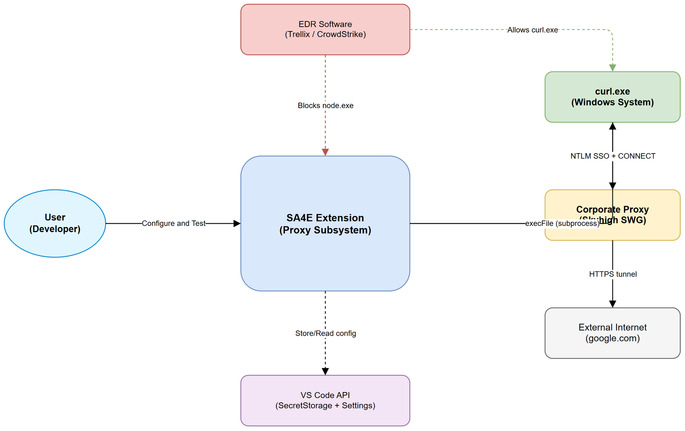
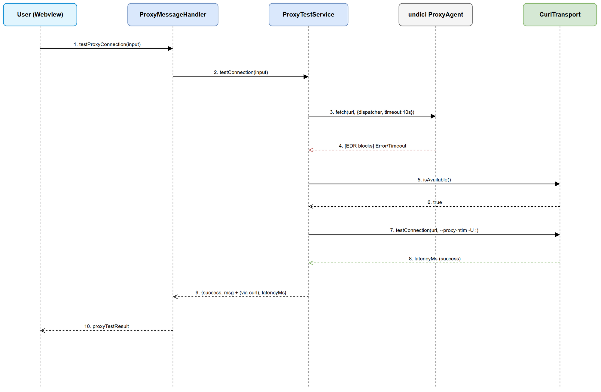
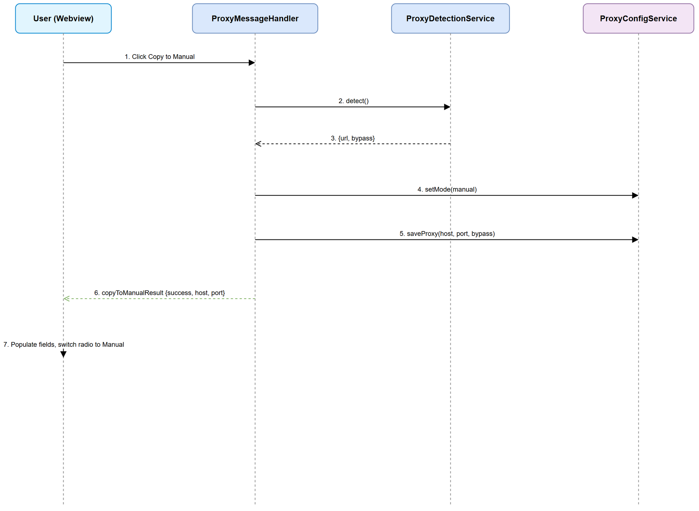
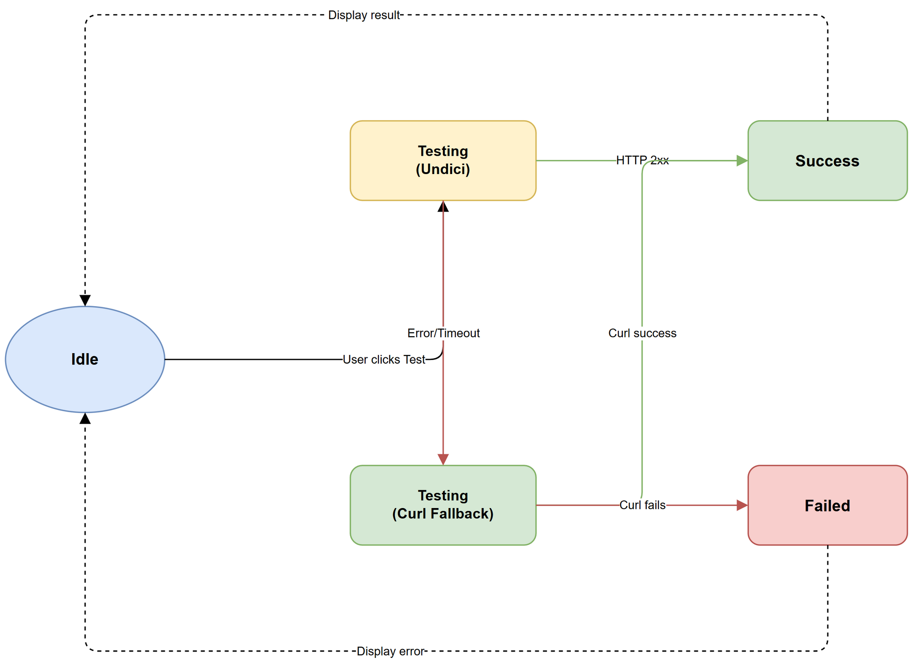

# Functional Specification Document (FSD)

## SA4E Extension — SA4E-100: Curl Fallback for System Proxy + Copy to Manual

---

## Document Information

| Field | Value |
|-------|-------|
| Jira Ticket | SA4E-100 |
| Title | Curl Fallback for System Proxy + Copy to Manual |
| Author | BA Agent |
| Version | 1.0 |
| Date | 2025-07-27 |
| Status | Draft |
| Related BRD | documents/SA4E-100/BRD.md |

---

## Revision History

| Version | Date | Author | Changes |
|---------|------|--------|---------|
| 1.0 | 2025-07-27 | BA Agent | Initiate document — derived from BRD and implementation code |

---

## 1. Introduction

### 1.1 Purpose

This FSD specifies the functional behavior of the "Curl Fallback for System Proxy + Copy to Manual" feature for the SA4E VS Code extension. It translates BRD business requirements into implementable functional specifications.

### 1.2 Scope

- CurlTransport module: curl.exe subprocess HTTP driver with NTLM SSO
- ProxyTestService dual-driver strategy: undici primary → curl fallback
- "Copy to Manual" UI action: copy detected system proxy to manual mode
- Webview message protocol extensions for new operations

### 1.3 Definitions & Acronyms

| Term | Definition |
|------|------------|
| EDR | Endpoint Detection and Response — security software (Trellix, CrowdStrike) blocking unauthorized process network access |
| NTLM SSO | NT LAN Manager Single Sign-On — automatic proxy auth using current Windows domain credentials |
| Skyhigh SWG | Skyhigh Secure Web Gateway — corporate HTTP proxy with NTLM auth (formerly McAfee Web Gateway) |
| undici | Node.js HTTP client library providing ProxyAgent for proxy connectivity |
| CONNECT tunnel | HTTP CONNECT method establishing encrypted tunnel through proxy for HTTPS |
| CurlTransport | Extension module executing HTTP requests via curl.exe subprocess |
| ProxyAgent | undici class routing HTTP requests through a proxy server |
| execFile | Node.js child_process method executing binary directly (no shell) — safe with special chars |

### 1.4 References

| Document | Location |
|----------|----------|
| BRD | documents/SA4E-100/BRD.md |
| CurlTransport Implementation | extension/src/proxy/CurlTransport.ts |
| ProxyTestService Implementation | extension/src/proxy/ProxyTestService.ts |
| ProxyMessageHandler Implementation | extension/src/proxy/ProxyMessageHandler.ts |
| Proxy Tab UI | extension/webview-assets/settings/proxy-tab.js |

---

## 2. System Overview

### 2.1 System Context Diagram

The proxy subsystem operates within the VS Code extension, interacting with:
- **User** — Configures proxy settings via Settings Panel webview
- **Windows OS** — Provides curl.exe binary and NTLM credentials store
- **Corporate Proxy (Skyhigh SWG)** — NTLM-authenticated HTTP proxy server
- **External Internet** — Target URLs for connectivity testing (google.com)
- **VS Code API** — SecretStorage for credentials, settings for config persistence
- **EDR Software** — Blocks node.exe but allows curl.exe network access

### 2.2 System Architecture

The feature consists of three layers:
1. **Transport Layer** — CurlTransport (curl.exe subprocess) + undici ProxyAgent (native HTTP)
2. **Service Layer** — ProxyTestService (dual-driver orchestration), ProxyDetectionService
3. **Presentation Layer** — ProxyMessageHandler (webview message routing), proxy-tab.js (UI)

---

## 3. Functional Requirements

### 3.1 Feature: CurlTransport — Curl Subprocess HTTP Driver

**Source:** BRD US-01, US-02

#### 3.1.1 Description

CurlTransport provides an HTTP transport layer using curl.exe subprocess execution. It bypasses EDR restrictions that block node.exe network access while supporting NTLM SSO authentication through the corporate proxy. The transport handles NTLM multi-block response parsing, skipping intermediate 407/CONNECT headers to extract the final response.

#### 3.1.2 Use Case: UC-01 — Execute HTTP Request via Curl

**Use Case ID:** UC-01
**Actor:** ProxyTestService (internal caller)
**Preconditions:** curl.exe available on system PATH (Windows 10+)
**Postconditions:** HTTP response parsed and returned, or descriptive error thrown

**Main Flow:**

| Step | Actor | System | Description |
|------|-------|--------|-------------|
| 1 | Caller | | Invokes `request(url, options)` with target URL and proxy config |
| 2 | | CurlTransport | Builds argument array: `-s -S --proxy-ntlm -U : -x {proxyUrl} --max-time {sec} -i {url}` |
| 3 | | CurlTransport | Executes curl.exe via `execFile` (no shell) with 20MB maxBuffer |
| 4 | | curl.exe | Connects to proxy, performs NTLM negotiation, tunnels to target |
| 5 | | CurlTransport | Parses stdout: splits by double-newline, iterates blocks backwards |
| 6 | | CurlTransport | Skips blocks starting with HTTP 407 or HTTP 200 Connection Established |
| 7 | | CurlTransport | Extracts status code, headers, body from final real response block |
| 8 | | CurlTransport | Returns `CurlResponse { status, statusText, ok, headers, body }` |

**Alternative Flows:**

| ID | Condition | Steps |
|----|-----------|-------|
| AF-01 | Explicit credentials provided (proxyAuth != null) | Step 2: Use `-U user:pass` instead of `--proxy-ntlm -U :` |
| AF-02 | Method is HEAD | Step 2: Use `-I` flag (not `-X HEAD`) |
| AF-03 | Method is POST/PUT/DELETE | Step 2: Add `-X {METHOD}` and `--data-raw {body}` |
| AF-04 | Insecure mode enabled | Step 2: Add `-k` flag to skip SSL verification |

**Exception Flows:**

| ID | Condition | Steps |
|----|-----------|-------|
| EF-01 | curl exit code 28 (timeout) | Throw CurlTransportError: "Connection timed out — proxy may be unreachable" |
| EF-02 | curl exit code 7 (connection refused) | Throw CurlTransportError: "Connection refused — verify proxy host and port" |
| EF-03 | curl exit code 6 (DNS failure) | Throw CurlTransportError: "Cannot resolve proxy hostname" |
| EF-04 | curl exit code 60 (SSL error) | Throw CurlTransportError: "SSL certificate error — proxy may require CA trust" |
| EF-05 | curl exit code 56 (connection reset) | Throw CurlTransportError: "Connection reset by proxy" |

#### 3.1.3 Business Rules

| Rule ID | Rule | Source |
|---------|------|--------|
| BR-01 | NEVER use `-X GET` with HTTPS proxy — breaks CONNECT tunnel causing timeout | BRD Appendix |
| BR-02 | Use `-I` for HEAD requests (not `-X HEAD`) — avoids proxy compatibility issues | BRD Appendix |
| BR-03 | Use `execFile` (not `exec` or shell spawn) — prevents shell injection with `&` in URLs | BRD Appendix |
| BR-04 | Skip HTTP 407 NTLM challenge + HTTP 200 Connection Established intermediate blocks | BRD Appendix |
| BR-05 | `--proxy-ntlm -U :` means "use current Windows session NTLM credentials" (SSO) | BRD US-02 |
| BR-06 | Parse response from last HTTP block backwards — multiple response blocks in output | BRD Appendix |
| BR-07 | Test URL must be `https://www.google.com` — httpbin is blocked by enterprise proxies | BRD US-02 |
| BR-08 | Connection timeout = 10 seconds for both undici and curl paths | BRD NFR |
| BR-09 | maxBuffer = 20MB for curl subprocess output | BRD NFR |
| BR-10 | When both drivers fail, return curl error (more informative for proxy environments) | BRD US-04 |

#### 3.1.4 Data Specifications

**Input Data (CurlRequestOptions):**

| Field | Type | Required | Validation | Description |
|-------|------|----------|------------|-------------|
| method | string | No | GET/HEAD/POST/PUT/DELETE | HTTP method (default: GET) |
| headers | Record<string,string> | No | Key-value pairs | Custom request headers |
| body | string | No | Non-empty for POST/PUT | Request body |
| timeout | number | No | > 0, ms | Request timeout (default: 15000ms) |
| proxyUrl | string | No | Valid URL | Override proxy URL |
| proxyAuth | string or null | No | user:pass format | Explicit credentials (null = NTLM SSO) |
| insecure | boolean | No | true/false | Skip SSL verification |
| followRedirects | boolean | No | true/false | Follow HTTP redirects |

**Output Data (CurlResponse):**

| Field | Type | Description |
|-------|------|-------------|
| status | number | HTTP status code (200, 301, 404, etc.) |
| statusText | string | HTTP status text ("OK", "Not Found", etc.) |
| ok | boolean | True if status 200-299 |
| headers | Record<string,string> | Response headers (lowercase keys) |
| body | string | Response body text |

### 3.2 Feature: Dual-Driver Proxy Test Strategy

**Source:** BRD US-04

#### 3.2.1 Description

ProxyTestService implements a sequential dual-driver strategy: try undici ProxyAgent first (fast path for standard environments), then automatically fall back to curl subprocess when native HTTP fails. This ensures connectivity in EDR-restricted environments without user intervention.

#### 3.2.2 Use Case: UC-02 — Test Proxy Connection (Dual-Driver)

**Use Case ID:** UC-02
**Actor:** User (via Settings Panel)
**Preconditions:** Proxy mode configured (system or manual), proxy URL resolvable
**Postconditions:** Test result displayed with success/failure message and latency

**Main Flow:**

| Step | Actor | System | Description |
|------|-------|--------|-------------|
| 1 | User | | Clicks "Test Proxy" button in Settings Panel |
| 2 | | Webview | Sends `testProxyConnection` message with form values |
| 3 | | ProxyMessageHandler | Receives message, calls `testService.testConnection(input)` |
| 4 | | ProxyTestService | Resolves proxy URL: manual=host:port; system=VscodeProxyResolver |
| 5 | | ProxyTestService | Attempts connection via undici ProxyAgent with 10s timeout |
| 6 | | ProxyTestService | Undici succeeds → returns success with latencyMs |
| 7 | | ProxyMessageHandler | Posts `proxyTestResult` message to webview |
| 8 | | Webview | Displays "✅ Proxy connection successful (350ms)" |

**Alternative Flows:**

| ID | Condition | Steps |
|----|-----------|-------|
| AF-05 | Undici fails (EDR block, timeout) | Check curl availability → execute curl with NTLM SSO → success returns "(via curl)" suffix |
| AF-06 | Both drivers fail | Return curl error message (more informative than undici) |
| AF-07 | User requests curl-only test | Call `testWithCurlOnly()` — skip undici entirely |
| AF-08 | Proxy returns HTTP 407 via undici | Return "Proxy requires authentication — enter credentials" |

**Exception Flows:**

| ID | Condition | Steps |
|----|-----------|-------|
| EF-06 | No proxy URL resolvable | Return `{ success: false, message: "No proxy URL to test" }` |
| EF-07 | curl.exe not available | Return `{ success: false, message: "curl not available — cannot use curl fallback" }` |

#### 3.2.3 Sequence Diagram: Proxy Test Flow

### 3.3 Feature: Copy Detected Proxy to Manual Mode

**Source:** BRD US-03

#### 3.3.1 Description

The "Copy to Manual" action allows users to copy the auto-detected system proxy configuration into Manual mode fields. This enables users to customize proxy authentication (add explicit credentials) while preserving the detected host, port, and bypass list.

#### 3.3.2 Use Case: UC-03 — Copy System Proxy to Manual

**Use Case ID:** UC-03
**Actor:** User
**Preconditions:** System proxy detected (detectedProxyUrl not null)
**Postconditions:** Mode switched to Manual, fields populated with detected values

**Main Flow:**

| Step | Actor | System | Description |
|------|-------|--------|-------------|
| 1 | User | | Clicks "Copy to Manual" button |
| 2 | | Webview | Sends `copyDetectedToManual` message |
| 3 | | Handler | Calls `detectionService.detect()` |
| 4 | | Handler | Parses URL → extract hostname, port |
| 5 | | Handler | Sets mode to "manual" |
| 6 | | Handler | Saves proxy config (host, port, bypass) |
| 7 | | Handler | Invalidates ProxyAgentFactory |
| 8 | | Handler | Posts `copyToManualResult` with success data |
| 9 | | Handler | Triggers full state refresh |
| 10 | | Webview | Populates fields, switches to manual radio |
| 11 | | Webview | Shows success message |

**Alternative Flows:**

| ID | Condition | Steps |
|----|-----------|-------|
| AF-09 | Port not in detected URL | Default port = 8080 |

**Exception Flows:**

| ID | Condition | Steps |
|----|-----------|-------|
| EF-08 | No system proxy detected | Return error: "No system proxy detected to copy" |
| EF-09 | URL parsing fails | Return error with exception message |

#### 3.3.3 Sequence Diagram: Copy to Manual Flow

#### 3.3.4 UI Specifications

**Screen: Proxy Test Connection Section**

| No. | Element | Type | Required | Behavior | Validation |
|-----|---------|------|----------|----------|------------|
| 1 | Test Proxy | Button | No | Tests connectivity using dual-driver | Loading state during test |
| 2 | Detect System Proxy | Button | No | Detects and displays system proxy URL | Loading state |
| 3 | Copy to Manual | Button | No | Copies detected proxy to manual fields | Meaningful in System mode |
| 4 | Test URL | Input | No | URL to test connectivity | Default: https://www.google.com |
| 5 | Test Result | Status indicator | N/A | Shows success/failure with latency | Green/Red styling |

**Screen: Proxy Manual Configuration Section**

| No. | Element | Type | Required | Behavior | Validation |
|-----|---------|------|----------|----------|------------|
| 1 | Proxy Host | Input (text) | Yes | Proxy hostname | Non-empty, trimmed |
| 2 | Port | Input (number) | Yes | Proxy port | 1–65535, integer |
| 3 | Bypass List | Input (text) | No | Comma-separated bypass | Supports *.domain.com |
| 4 | URL Preview | Text display | N/A | Shows proxy URL | Auto-updates on input |
| 5 | Save Proxy | Button | No | Persists config | Validates before save |
| 6 | Username | Input (text) | No | Proxy auth username | Required with password |
| 7 | Password | Input (password) | No | Proxy auth password | Toggle visibility |
| 8 | Save Credentials | Button | No | Saves to SecretStorage | Both fields required |
| 9 | Clear Credentials | Button | No | Removes stored creds | No confirmation |

---

## 4. Data Model

### 4.1 Logical Entities

#### Entity: ProxyConfig

| Attribute | Type | Required | Business Rule | Description |
|-----------|------|----------|---------------|-------------|
| mode | ProxyMode enum | Yes | — | "none" / "system" / "manual" |
| host | string | Yes (manual) | — | Proxy server hostname |
| port | number | Yes (manual) | 1-65535 | Proxy server port |
| bypass | string | No | — | Comma-separated bypass list |

#### Entity: ProxyCredentials

| Attribute | Type | Required | Business Rule | Description |
|-----------|------|----------|---------------|-------------|
| username | string | Yes | — | Proxy auth username |
| password | string | Yes | — | Proxy auth password (SecretStorage) |

#### Entity: ProxyTestInput

| Attribute | Type | Required | Business Rule | Description |
|-----------|------|----------|---------------|-------------|
| mode | ProxyMode | Yes | — | Proxy mode for URL resolution |
| host | string | Yes (manual) | — | Proxy host from form |
| port | number | Yes | — | Proxy port from form |
| username | string | No | BR-05 | Explicit creds (null = NTLM SSO) |
| password | string | No | BR-05 | Explicit credentials |
| testUrl | string | No | BR-07 | Target URL (default: google.com) |

#### Entity: ProxyTestResult

| Attribute | Type | Required | Business Rule | Description |
|-----------|------|----------|---------------|-------------|
| success | boolean | Yes | — | Whether connection succeeded |
| message | string | Yes | BR-10 | Human-readable result |
| latencyMs | number | No | — | Round-trip time in ms |

#### Entity: CurlResponse

| Attribute | Type | Required | Business Rule | Description |
|-----------|------|----------|---------------|-------------|
| status | number | Yes | BR-04 | HTTP status code |
| statusText | string | Yes | — | HTTP status text |
| ok | boolean | Yes | — | True if 200-299 |
| headers | Record | Yes | — | Response headers (lowercase) |
| body | string | Yes | — | Response body text |

**Relationships:**

| From | To | Cardinality | Description |
|------|-----|-------------|-------------|
| ProxyConfig | ProxyCredentials | 1:0..1 | Manual mode optionally has credentials |
| ProxyTestInput | ProxyTestResult | 1:1 | Each test produces one result |

---

## 5. Integration Specifications

### 5.1 External System: curl.exe (Windows System Binary)

| Attribute | Value |
|-----------|-------|
| Purpose | HTTP transport bypassing EDR restrictions on node.exe |
| Direction | Outbound (extension → curl → proxy → internet) |
| Data Format | HTTP response text (headers + body via -i flag) |
| Frequency | On-demand (user-triggered or automatic fallback) |
| Location | C:\Windows\System32\curl.exe (Windows 10+ built-in) |

### 5.2 External System: Corporate Proxy (Skyhigh SWG)

| Attribute | Value |
|-----------|-------|
| Purpose | Internet access gateway with NTLM authentication |
| Direction | Outbound (extension → proxy → internet) |
| Data Format | HTTP/HTTPS via CONNECT tunnel |
| Frequency | Every outbound request |

### 5.3 External System: VS Code API

| Attribute | Value |
|-----------|-------|
| Purpose | Credential storage and settings persistence |
| Direction | Bidirectional |
| Data Format | TypeScript API calls |
| Frequency | On config change / read |

---

## 6. Processing Logic

### 6.1 Process: NTLM Response Parsing

**Trigger:** curl.exe returns stdout with multi-block HTTP response
**Input:** Raw curl output string
**Output:** Single CurlResponse with final real response

**Processing Steps:**

| Step | Description | Error Handling |
|------|-------------|----------------|
| 1 | Split by double-newline, filter non-empty | Empty → status 0 |
| 2 | Iterate blocks from LAST to FIRST (reverse) | No valid block → use first |
| 3 | Skip blocks with "407" (NTLM challenge) | Intermediate negotiation |
| 4 | Skip blocks with "200 Connection Established" | CONNECT tunnel confirm |
| 5 | First non-skipped HTTP block = target response | — |
| 6 | Parse status via regex `HTTP/\d\.?\d?\s+(\d+)\s*(.*)` | No match → status 0 |
| 7 | Parse headers: split by first `:`, lowercase key | — |
| 8 | Remaining blocks after target = body | Join with double-newline |

### 6.2 Process: Dual-Driver Test Strategy

**Trigger:** User clicks "Test Proxy" or extension needs connectivity
**Input:** ProxyTestInput
**Output:** ProxyTestResult

**Processing Steps:**

| Step | Description | Error Handling |
|------|-------------|----------------|
| 1 | Resolve proxy URL (manual=host:port, system=resolver) | No URL → error |
| 2 | Try undici ProxyAgent with 10s timeout | Catch errors |
| 3 | If undici succeeds → return success with latency | — |
| 4 | If undici fails → check curl availability | Not available → error msg |
| 5 | Execute curl with NTLM SSO | Catch CurlTransportError |
| 6 | If curl succeeds → return success + "(via curl)" | — |
| 7 | If both fail → return curl error (more informative) | BR-10 |

### 6.3 Process: Curl Argument Building

**Trigger:** CurlTransport.request() called
**Input:** URL, method, timeout, proxy, options
**Output:** String array of CLI arguments

**Key Rules:**

| Rule | Implementation |
|------|---------------|
| BR-01: No -X GET | Only add `-i` for GET (implicit method) |
| BR-02: HEAD uses -I | Add `-I` flag, never `-X HEAD` |
| BR-03: execFile | Direct binary execution, no shell |
| BR-05: NTLM SSO | `--proxy-ntlm -U :` when no explicit auth |

---

## 7. Security Requirements

### 7.1 Authentication and Authorization

| Role | Permissions | Features |
|------|-------------|----------|
| Extension User | Full access | All proxy config, test, copy |
| Windows Domain User | NTLM SSO (implicit) | Auto proxy auth via curl |

### 7.2 Data Sensitivity

| Data Type | Classification | Requirement |
|-----------|---------------|-------------|
| Proxy credentials | Confidential | VS Code SecretStorage only |
| NTLM session creds | Confidential | Never exposed — Windows store |
| Proxy host/port | Internal | VS Code settings |
| Test results | Public | UI display, no sensitive data |

### 7.3 Security Controls

| Control | Implementation | Rule |
|---------|----------------|------|
| No shell injection | execFile (not shell) | BR-03 |
| No CLI credentials (SSO) | `--proxy-ntlm -U :` | BR-05 |
| Credential isolation | SecretStorage | VS Code API |
| Buffer limit | 20MB max | BR-09 |
| Timeout enforcement | 10s max | BR-08 |

---

## 8. Non-Functional Requirements

| Category | Requirement | Acceptance Criteria |
|----------|-------------|---------------------|
| Performance | Test completes within 10s | Both drivers timeout at 10s |
| Performance | Curl overhead < 500ms | Subprocess spawn acceptable |
| Reliability | curl.exe check before use | isAvailable() in 5s |
| Compatibility | Windows 10+ | Build 17063+ (curl built-in) |
| Usability | Fallback transparent | "(via curl)" suffix indicator |
| Security | No plaintext creds in CLI | NTLM SSO pattern |
| Security | Safe URL handling | execFile prevents injection |
| Buffer | Max response 20MB | Prevents OOM |

---

## 9. Error Handling (User-Facing)

### 9.1 Error Scenarios

| Scenario | Severity | User Message | Recovery |
|----------|----------|-------------|----------|
| Proxy timeout | Warning | "Connection timed out — proxy may be unreachable" | Check host/port |
| Connection refused | Warning | "Connection refused — verify proxy host and port" | Correct settings |
| DNS failure | Warning | "Cannot resolve proxy hostname" | Check spelling |
| SSL error | Warning | "SSL certificate error — proxy may require CA trust" | Configure CA |
| Connection reset | Warning | "Connection reset by proxy" | Retry / contact IT |
| Auth required (407) | Info | "Proxy requires authentication — enter credentials" | Add credentials |
| curl unavailable | Info | "curl not available — cannot use curl fallback" | Install Win10+ |
| No proxy URL | Info | "No proxy URL to test" | Configure proxy |
| No system proxy | Info | "No system proxy detected to copy" | Configure in OS |

### 9.2 Error Priority

When both undici and curl fail, return **curl error** because curl errors are more specific to proxy environments and reveal NTLM auth issues.

---

## 10. Testing Considerations

### 10.1 Test Scenarios

| ID | Scenario | Expected | Priority |
|----|----------|----------|----------|
| TC-01 | Curl NTLM SSO success | Status 200, latency measured | High |
| TC-02 | Curl explicit credentials | Status 200 with user:pass | High |
| TC-03 | NTLM multi-block parse | Only final response extracted | High |
| TC-04 | Undici success (no fallback) | No "(via curl)" suffix | High |
| TC-05 | Undici fail → curl success | "(via curl)" suffix present | High |
| TC-06 | Both fail | Curl error message returned | High |
| TC-07 | Copy to Manual success | Mode=manual, fields populated | High |
| TC-08 | Copy to Manual: no proxy | Error message shown | Medium |
| TC-09 | curl.exe not available | Graceful error | Medium |
| TC-10 | URL with & character | execFile handles safely | High |
| TC-11 | No -X GET for HTTPS | No -X flag in args | High |
| TC-12 | HEAD uses -I | -I flag, no -X HEAD | Medium |
| TC-13 | 10s timeout | Error within timeout | High |

---

## 11. Appendix

### 11.1 Webview Message Protocol

**Webview → Extension:**

| Message Type | Payload |
|--------------|---------|
| testProxyConnection | { mode, host, port, username?, password?, testUrl? } |
| detectSystemProxy | {} |
| copyDetectedToManual | {} |

**Extension → Webview:**

| Message Type | Payload |
|--------------|---------|
| proxyTestResult | { success, message, latencyMs? } |
| systemProxyDetected | { url, bypass } |
| copyToManualResult | { success, host?, port?, bypass?, error? } |
| proxyState | { mode, host, port, bypass, hasCredentials, detectedProxyUrl } |

### 11.2 State Diagram: Proxy Test Lifecycle

**States:** Idle → Testing(Undici) → Testing(Curl) → Success/Failed → Idle

### Diagram Index

| # | Diagram | Image | Source (editable) |
|---|---------|-------|-------------------|
| 1 | System Context | [system-context.png](diagrams/system-context.png) | [system-context.drawio](diagrams/system-context.drawio) |
| 2 | Proxy Test Sequence | [sequence-proxy-test.png](diagrams/sequence-proxy-test.png) | [sequence-proxy-test.drawio](diagrams/sequence-proxy-test.drawio) |
| 3 | Copy to Manual Sequence | [sequence-copy-to-manual.png](diagrams/sequence-copy-to-manual.png) | [sequence-copy-to-manual.drawio](diagrams/sequence-copy-to-manual.drawio) |
| 4 | Proxy Test State | [state-proxy-test.png](diagrams/state-proxy-test.png) | [state-proxy-test.drawio](diagrams/state-proxy-test.drawio) |

### 11.3 BRD Traceability

| BRD Story | FSD Coverage |
|-----------|-------------|
| US-01 | UC-01 + Section 6.3 |
| US-02 | UC-01 AF-01 + Section 6.1 |
| US-03 | UC-03 |
| US-04 | UC-02 + Section 6.2 |
