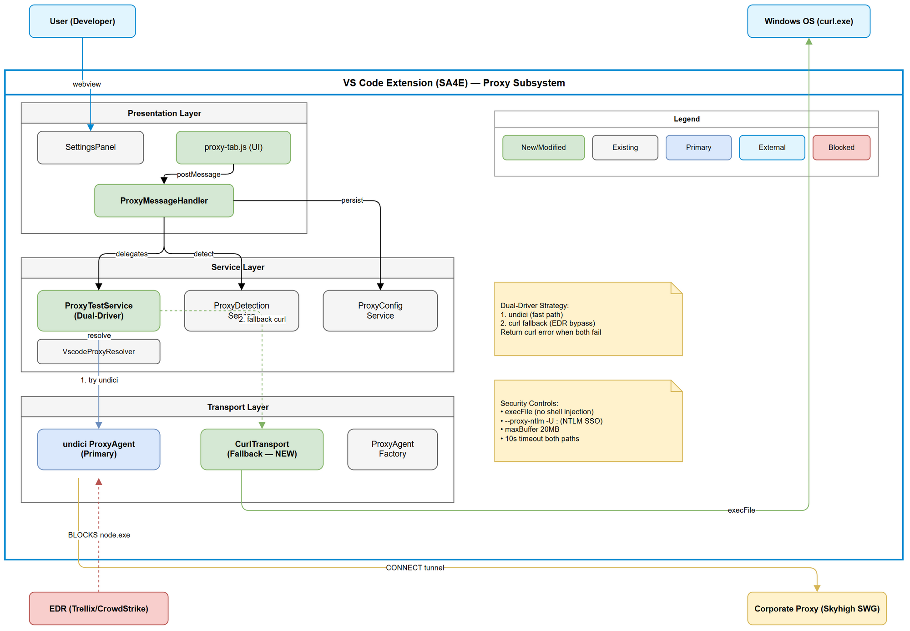
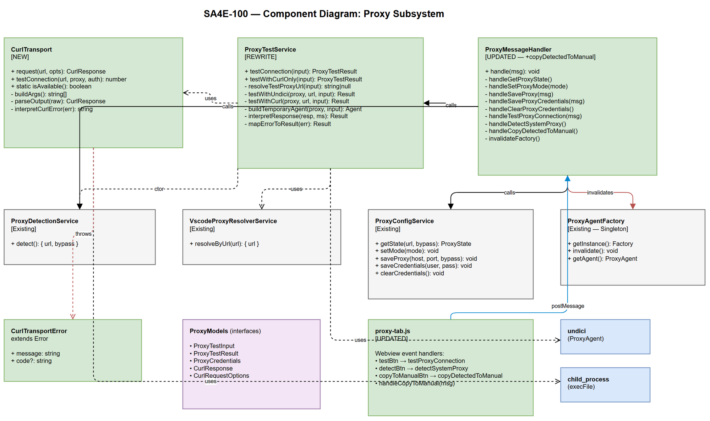

# Technical Design Document (TDD)

## SA4E Extension — SA4E-100: Curl Fallback for System Proxy + Copy to Manual

---

## Document Information

| Field | Value |
|-------|-------|
| Jira Ticket | SA4E-100 |
| Title | Curl Fallback for System Proxy + Copy to Manual |
| Author | SA Agent |
| Version | 1.0 |
| Date | 2025-07-27 |
| Status | Final (reflects implementation) |
| Related BRD | BRD-v1-SA4E-100.docx |
| Related FSD | FSD-v1-SA4E-100.docx |

---

## Revision History

| Version | Date | Author | Changes |
|---------|------|--------|---------|
| 1.0 | 2025-07-27 | SA Agent | Initial TDD — derived from implemented code |

---

## 1. Architecture Overview

### 1.1 High-Level Architecture



The feature extends the existing proxy subsystem of the SA4E VS Code extension with two new capabilities:

1. **CurlTransport** — A stateless curl.exe subprocess HTTP driver that bypasses EDR restrictions
2. **Dual-Driver ProxyTestService** — Orchestrates undici (primary) + curl (fallback) connectivity testing
3. **Copy to Manual** — UI action copying detected system proxy to manual mode

### 1.2 Architecture Pattern

**Plugin (VS Code Extension)** — operates within the VS Code extension host process. All proxy modules are part of the extension activation context and communicate via direct method calls (service layer) and webview postMessage (presentation layer).

### 1.3 Design Principles

| Principle | Application |
|-----------|-------------|
| Single Responsibility | CurlTransport handles only curl subprocess execution; ProxyTestService handles only test orchestration |
| Open/Closed | ProxyTestService is open for new drivers without modifying existing undici path |
| Composition over Inheritance | ProxyTestService composes CurlTransport and ProxyAgent — no inheritance hierarchy |
| Stateless per-request | CurlTransport instances are cheap — no connection pooling, no shared state |
| Fail-safe | Fallback strategy ensures connectivity even when primary transport is blocked |

### 1.4 Key Design Decisions

| # | Decision | Rationale |
|---|----------|-----------|
| 1 | CurlTransport is standalone (no DI container) | Stateless per-request — no lifecycle management needed |
| 2 | ProxyTestService uses composition (undici + curl) | Sequential fallback is simpler than parallel; avoids unnecessary subprocess spawns |
| 3 | `execFile` (not `exec` or shell spawn) | Prevents command injection via URL special characters (`&`, `;`, `|`) |
| 4 | No `-X GET` for HTTPS proxy | Breaks CONNECT tunnel — curl default method is GET for HTTPS without `-X` |
| 5 | `-I` for HEAD (not `-X HEAD`) | Some proxies have compatibility issues with explicit `-X HEAD` |
| 6 | Parse response backwards (last block first) | NTLM negotiation produces multiple 407 + 200 Connection Established blocks before final response |
| 7 | Return curl error when both fail | Curl errors are more informative for proxy environments (exit codes map to specific issues) |
| 8 | 10s timeout for both drivers | Consistent user experience; prevents indefinite hanging |

---

## 2. Component Design

### 2.1 Component Diagram



### 2.2 Module Inventory

| Module | Path | Status | Responsibility |
|--------|------|--------|----------------|
| CurlTransport | `extension/src/proxy/CurlTransport.ts` | **NEW** | curl.exe subprocess HTTP driver |
| ProxyTestService | `extension/src/proxy/ProxyTestService.ts` | **REWRITE** | Dual-driver test orchestration |
| ProxyMessageHandler | `extension/src/proxy/ProxyMessageHandler.ts` | **UPDATED** | Webview message routing (+copyDetectedToManual) |
| SettingsPanel | `extension/src/panels/settings/SettingsPanel.ts` | **UPDATED** | HTML includes Copy to Manual button |
| proxy-tab.js | `extension/webview-assets/settings/proxy-tab.js` | **UPDATED** | Webview event binding + UI state |
| ProxyAgentFactory | `extension/src/proxy/ProxyAgentFactory.ts` | Existing | undici ProxyAgent singleton (invalidated on config change) |
| ProxyDetectionService | `extension/src/proxy/ProxyDetectionService.ts` | Existing | OS-native proxy detection |
| VscodeProxyResolverService | `extension/src/proxy/VscodeProxyResolverService.ts` | Existing | @vscode/proxy-agent wrapper |
| ProxyConfigService | `extension/src/proxy/ProxyConfigService.ts` | Existing | VS Code settings persistence + SecretStorage |

### 2.3 Dependency Graph

```
SettingsPanel
  └─ SettingsMessageHandler
       └─ ProxyMessageHandler
            ├─ ProxyConfigService (settings persistence)
            ├─ ProxyDetectionService (OS proxy detection)
            ├─ ProxyTestService (dual-driver test)
            │    ├─ VscodeProxyResolverService (URL resolution)
            │    ├─ undici.ProxyAgent (primary transport)
            │    └─ CurlTransport (fallback transport)
            └─ ProxyAgentFactory (singleton invalidation)
```

---

## 3. Detailed Module Design

### 3.1 CurlTransport (`extension/src/proxy/CurlTransport.ts`)

#### 3.1.1 Class Structure

```typescript
export class CurlTransport {
  constructor(proxyUrl: string | null, defaultTimeout?: number, insecure?: boolean)
  
  // Public API
  async request(url: string, options?: CurlRequestOptions): Promise<CurlResponse>
  async testConnection(url: string, proxyUrl?: string, proxyAuth?: string | null): Promise<number>
  static async isAvailable(): Promise<boolean>
  
  // Private
  private buildArgs(url, method, timeout, proxy, options): string[]
  private parseOutput(rawOutput: string): CurlResponse
  private getCurlBinary(): string
  private interpretCurlError(err: Error): string
}

export class CurlTransportError extends Error {
  constructor(message: string, public readonly code?: string)
}
```

#### 3.1.2 Argument Building Logic

| Method | Args Generated | Rationale |
|--------|---------------|-----------|
| GET (default) | `-s -S --proxy-ntlm -U : -x {proxy} --max-time {s} -i {url}` | No `-X GET` — breaks CONNECT tunnel |
| HEAD | `-s -S ... -I {url}` | `-I` is compatible; `-X HEAD` is not |
| POST/PUT/DELETE | `-s -S ... -i -X {METHOD} --data-raw {body} {url}` | Explicit method only for non-GET |
| Explicit auth | `-x {proxy} -U user:pass` | Replace `--proxy-ntlm -U :` |
| Insecure | add `-k` | Skip SSL verification |
| Redirects | add `-L` | Follow HTTP 3xx |

#### 3.1.3 Response Parsing Algorithm

```
Input: raw stdout from curl -i
1. Split by \r?\n\r?\n → blocks[]
2. Filter empty blocks
3. Iterate from LAST block to FIRST:
   a. Get first line of block
   b. If starts with "HTTP/" AND NOT contains "407" AND NOT contains "200 Connection Established"
      → this is the target response block; record bodyIdx = i + 1
      → break
4. If no target found → use blocks[0] as fallback
5. Parse status line: regex HTTP/\d\.?\d?\s+(\d+)\s*(.*)
6. Parse headers: split by first ":", lowercase key
7. Body = blocks[bodyIdx:].join("\n\n")
8. Return { status, statusText, ok: 200<=status<300, headers, body }
```

#### 3.1.4 Error Mapping

| Curl Exit Code | Error Message | Node.js Equivalent |
|----------------|---------------|-------------------|
| 28 | "Connection timed out — proxy may be unreachable" | UND_ERR_CONNECT_TIMEOUT |
| 7 | "Connection refused — verify proxy host and port" | ECONNREFUSED |
| 6 | "Cannot resolve proxy hostname" | ENOTFOUND |
| 60 | "SSL certificate error — proxy may require CA trust" | ERR_TLS_* |
| 56 | "Connection reset by proxy" | ECONNRESET |

### 3.2 ProxyTestService (`extension/src/proxy/ProxyTestService.ts`)

#### 3.2.1 Class Structure

```typescript
export class ProxyTestService {
  constructor(private readonly detectionService: ProxyDetectionService)
  
  // Public API
  async testConnection(input: ProxyTestInput): Promise<ProxyTestResult>
  async testWithCurlOnly(input: ProxyTestInput): Promise<ProxyTestResult>
  
  // Private
  private async resolveTestProxyUrl(input: ProxyTestInput): Promise<string | null>
  private async testWithUndici(proxyUrl, targetUrl, input): Promise<ProxyTestResult>
  private async testWithCurl(proxyUrl, targetUrl, input): Promise<ProxyTestResult>
  private buildTemporaryAgent(proxyUrl, input): ProxyAgent
  private async sendTestRequest(agent, targetUrl): Promise<{ response, latencyMs }>
  private interpretResponse(response, latencyMs): ProxyTestResult
  private mapErrorToResult(err: Error): ProxyTestResult
}
```

#### 3.2.2 Dual-Driver Strategy Flow

```
testConnection(input):
  1. Resolve proxy URL
     - manual mode → "http://{host}:{port}"
     - system mode → VscodeProxyResolverService.resolveByUrl(targetUrl)
  2. If no URL → return { success: false, message: "No proxy URL to test" }
  3. Try undici path:
     - Create temporary ProxyAgent with creds (if provided)
     - fetch(targetUrl, { dispatcher: agent, signal: AbortSignal.timeout(10s) })
     - If 2xx → return success + latencyMs
     - If 407 → return "Proxy requires authentication"
     - If error → continue to curl
  4. Try curl path:
     - Check CurlTransport.isAvailable()
     - If not available → return { success: false, message: "curl not available" }
     - Create CurlTransport(proxyUrl)
     - Call testConnection(targetUrl, proxyUrl, proxyAuth)
     - If success → return { success: true, message + " (via curl)", latencyMs }
     - If error → return curl error
  5. If both fail → return curl error (more informative)
```

#### 3.2.3 Internal Dependencies

| Dependency | Usage | Lifecycle |
|------------|-------|-----------|
| VscodeProxyResolverService | Resolve per-URL proxy in system mode | Created in constructor |
| ProxyAgent (undici) | Temporary agent per test | Created and closed per test |
| CurlTransport | Subprocess execution | Created per fallback attempt |

### 3.3 ProxyMessageHandler — `copyDetectedToManual` Handler

#### 3.3.1 Message Flow

```
Webview → { type: "copyDetectedToManual" }
  ↓
handleCopyDetectedToManual():
  1. detectionService.detect() → { url, bypass }
  2. If !url → post { type: "copyToManualResult", success: false, error: "No system proxy..." }
  3. Parse URL → hostname, port (default 8080 if missing)
  4. configService.setMode("manual")
  5. configService.saveProxy(host, port, bypass)
  6. ProxyAgentFactory.getInstance().invalidate()
  7. post { type: "copyToManualResult", success: true, host, port, bypass }
  8. handleGetProxyState() → full state refresh
```

### 3.4 Webview UI Changes

#### 3.4.1 SettingsPanel.ts

Added `copy-to-manual-btn` button in the `proxy-test-section`:
```html
<button id="copy-to-manual-btn" class="btn secondary" 
  title="Copy detected proxy to Manual mode for credential configuration">
  Copy to Manual
</button>
```

#### 3.4.2 proxy-tab.js

- Binds click event on `copy-to-manual-btn` → posts `copyDetectedToManual`
- Handles `copyToManualResult` message:
  - Success: populate host/port/bypass fields, switch radio to "manual", update visibility
  - Failure: show error status

---

## 4. Data Model

### 4.1 TypeScript Interfaces

```typescript
// Input for proxy test (from webview form values)
interface ProxyTestInput {
  mode: ProxyMode;          // "none" | "system" | "manual"
  host: string;             // Proxy hostname (manual mode)
  port: number;             // Proxy port
  username?: string;        // Optional explicit auth
  password?: string;        // Optional explicit auth
  testUrl?: string;         // Target URL (default: google.com)
}

// Result of proxy test
interface ProxyTestResult {
  success: boolean;
  message: string;
  latencyMs?: number;
}

// Curl request options
interface CurlRequestOptions {
  method?: string;          // GET, HEAD, POST, PUT, DELETE
  headers?: Record<string, string>;
  body?: string;
  timeout?: number;         // ms (default: 15000)
  proxyUrl?: string;        // Override proxy URL
  proxyAuth?: string | null;// user:pass or null for NTLM SSO
  insecure?: boolean;       // Skip SSL verification
  followRedirects?: boolean;
}

// Curl response
interface CurlResponse {
  status: number;
  statusText: string;
  ok: boolean;              // 200-299
  headers: Record<string, string>;  // lowercase keys
  body: string;
}

// Proxy credentials (stored in SecretStorage)
interface ProxyCredentials {
  username: string;
  password: string;
}
```

### 4.2 Webview Message Protocol

**Webview → Extension (new messages):**

| Type | Payload | Handler |
|------|---------|---------|
| `copyDetectedToManual` | `{}` | `handleCopyDetectedToManual()` |

**Extension → Webview (new messages):**

| Type | Payload | Trigger |
|------|---------|---------|
| `copyToManualResult` | `{ success, host?, port?, bypass?, error? }` | After copy attempt |
| `proxyTestResult` | `{ success, message, latencyMs? }` | After test (may include "(via curl)") |

---

## 5. Security Design

### 5.1 Threat Model

| Threat | Vector | Mitigation | Status |
|--------|--------|------------|--------|
| Command injection via URL | URL with `&`, `;`, `\|` passed to shell | `execFile` (no shell interpolation) | Mitigated |
| Credential exposure in process list | `-U user:pass` visible in `ps` | NTLM SSO uses `-U :` (no plaintext creds); explicit creds only when user provides them | Accepted risk |
| Buffer overflow from curl output | Malicious response > memory | `maxBuffer: 20MB` hard limit | Mitigated |
| SSRF via testUrl | User provides internal URL | Test URL is user-controlled (by design); only tests connectivity | Accepted (user intent) |
| Credential storage | Proxy credentials at rest | VS Code SecretStorage (OS keychain) | Mitigated |

### 5.2 Security Controls

| Control | Implementation |
|---------|----------------|
| No shell execution | `child_process.execFile()` — binary executed directly |
| Subprocess timeout | `--max-time 10` flag + Node.js timeout |
| Buffer limit | `maxBuffer: 20 * 1024 * 1024` (20MB) |
| Credential isolation | SecretStorage for explicit creds; Windows credential store for NTLM |
| Input validation | Port range 1-65535; host non-empty; mode enum check |

---

## 6. Error Handling Strategy

### 6.1 Error Flow

```
CurlTransport errors → CurlTransportError (typed)
  ↓
ProxyTestService catches → maps to ProxyTestResult { success: false, message }
  ↓
ProxyMessageHandler posts → { type: "proxyTestResult", success: false, message }
  ↓
proxy-tab.js renders → ❌ {message} in status indicator
```

### 6.2 Error Priority

When both undici and curl fail, the service returns the **curl error** because:
- Curl exit codes map directly to proxy-specific issues (NTLM auth, CONNECT tunnel, DNS)
- Undici errors in EDR environments are generic (ECONNREFUSED) — not helpful for proxy debugging

### 6.3 User-Facing Error Messages

| Scenario | Message |
|----------|---------|
| Proxy timeout | "Connection timed out — proxy may be unreachable" |
| Connection refused | "Connection refused — verify proxy host and port" |
| DNS failure | "Cannot resolve proxy hostname" |
| SSL error | "SSL certificate error — proxy may require CA trust" |
| Connection reset | "Connection reset by proxy" |
| Auth required (undici 407) | "Proxy requires authentication — enter credentials" |
| curl not found | "curl not available — cannot use curl fallback" |
| No proxy URL | "No proxy URL to test" |
| No system proxy | "No system proxy detected to copy" |

---

## 7. Non-Functional Requirements

| Category | Requirement | Implementation |
|----------|-------------|----------------|
| Performance | Test completes within 10s | `AbortSignal.timeout(10_000)` + `--max-time 10` |
| Performance | curl overhead < 500ms | `execFile` is lightweight; no shell startup |
| Reliability | curl availability check | `CurlTransport.isAvailable()` with 5s timeout |
| Compatibility | Windows 10+ | curl.exe included since build 17063 |
| Compatibility | Cross-platform binary | `process.platform === "win32" ? "curl.exe" : "curl"` |
| Usability | Fallback transparency | "(via curl)" suffix in success message |
| Security | No plaintext creds in CLI (SSO) | `--proxy-ntlm -U :` pattern |
| Buffer | Max 20MB response | `maxBuffer: 20 * 1024 * 1024` |

---

## 8. Implementation Checklist

| # | Task | File | Status |
|---|------|------|--------|
| 1 | Create CurlTransport class with request/testConnection/isAvailable | `CurlTransport.ts` | Done |
| 2 | Create CurlTransportError class | `CurlTransport.ts` | Done |
| 3 | Implement NTLM response parser (skip 407 + 200 Connection Established) | `CurlTransport.ts` | Done |
| 4 | Implement curl error interpreter (exit codes → messages) | `CurlTransport.ts` | Done |
| 5 | Rewrite ProxyTestService with dual-driver strategy | `ProxyTestService.ts` | Done |
| 6 | Add testWithCurlOnly method | `ProxyTestService.ts` | Done |
| 7 | Add handleCopyDetectedToManual handler | `ProxyMessageHandler.ts` | Done |
| 8 | Register "copyDetectedToManual" in PROXY_MESSAGE_TYPES | `ProxyMessageHandler.ts` | Done |
| 9 | Add "Copy to Manual" button in SettingsPanel HTML | `SettingsPanel.ts` | Done |
| 10 | Add copyToManualBtn event binding + handleCopyToManual | `proxy-tab.js` | Done |

---

## 9. Testing Strategy

### 9.1 Unit Tests

| # | Test | Module | Technique |
|---|------|--------|-----------|
| UT-01 | buildArgs: GET → no `-X GET`, has `-i` | CurlTransport | Assert args array |
| UT-02 | buildArgs: HEAD → `-I`, no `-X HEAD` | CurlTransport | Assert args array |
| UT-03 | buildArgs: NTLM SSO → `--proxy-ntlm -U :` | CurlTransport | Assert args array |
| UT-04 | buildArgs: explicit auth → `-U user:pass` | CurlTransport | Assert args array |
| UT-05 | parseOutput: single block response | CurlTransport | Mock stdout |
| UT-06 | parseOutput: skip 407 + 200 Connection Established | CurlTransport | Multi-block stdout |
| UT-07 | interpretCurlError: exit code mapping | CurlTransport | Error message assertions |
| UT-08 | testConnection: undici success → no curl | ProxyTestService | Mock fetch success |
| UT-09 | testConnection: undici fail → curl success | ProxyTestService | Mock fetch fail + curl success |
| UT-10 | testConnection: both fail → curl error returned | ProxyTestService | Mock both fail |
| UT-11 | resolveTestProxyUrl: manual mode | ProxyTestService | Assert URL format |
| UT-12 | resolveTestProxyUrl: system mode | ProxyTestService | Mock resolver |
| UT-13 | handleCopyDetectedToManual: success | ProxyMessageHandler | Mock detection |
| UT-14 | handleCopyDetectedToManual: no proxy | ProxyMessageHandler | Null URL mock |

### 9.2 Integration Tests

| # | Test | Scope |
|---|------|-------|
| IT-01 | CurlTransport.isAvailable() on Windows | Real subprocess |
| IT-02 | CurlTransport.request() to httpbin (if network available) | Real curl execution |
| IT-03 | ProxyTestService end-to-end with mock proxy | Full dual-driver flow |

---

## 10. Appendix

### 10.1 Diagram Index

| # | Diagram | Image | Source (editable) |
|---|---------|-------|-------------------|
| 1 | Architecture Diagram | [architecture.png](diagrams/architecture.png) | [architecture.drawio](diagrams/architecture.drawio) |
| 2 | Component Diagram | [component.png](diagrams/component.png) | [component.drawio](diagrams/component.drawio) |

### 10.2 BRD/FSD Traceability

| BRD Story | FSD Use Case | TDD Coverage |
|-----------|-------------|-------------|
| US-01 | UC-01 | CurlTransport (Section 3.1), execFile security (Section 5) |
| US-02 | UC-01 AF-01 | NTLM SSO args (Section 3.1.2), response parsing (Section 3.1.3) |
| US-03 | UC-03 | copyDetectedToManual handler (Section 3.3) |
| US-04 | UC-02 | ProxyTestService dual-driver (Section 3.2.2) |

### 10.3 File Change Summary

| File | Change Type | Lines Added | Lines Modified |
|------|-------------|-------------|----------------|
| `extension/src/proxy/CurlTransport.ts` | NEW | ~200 | 0 |
| `extension/src/proxy/ProxyTestService.ts` | REWRITE | ~130 | 0 |
| `extension/src/proxy/ProxyMessageHandler.ts` | UPDATED | ~35 | 2 |
| `extension/src/panels/settings/SettingsPanel.ts` | UPDATED | 1 | 0 |
| `extension/webview-assets/settings/proxy-tab.js` | UPDATED | ~25 | 0 |
