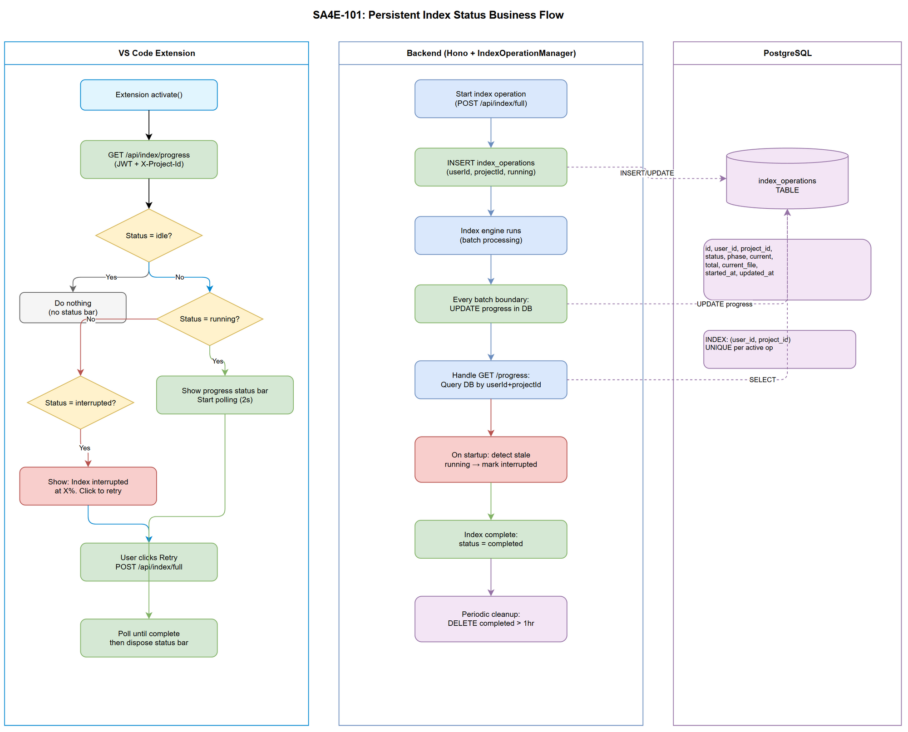

# Business Requirements Document (BRD)

## SA4E — SA4E-101: [Indexing] Persistent multi-tenant index status + auto-reconnect on extension reload

---

## Document Information

| Field | Value |
|-------|-------|
| Jira Ticket | SA4E-101 |
| Title | Persistent multi-tenant index status + auto-reconnect on extension reload |
| Author | BA Agent |
| Version | 1.1 |
| Date | 2026-08-11 |
| Status | Draft |

---

## Author Tracking

| Role | Name - Position | Responsibility |
|------|-----------------|----------------|
| Author | BA Agent – Business Analyst | Create document |
| Peer Reviewer | TA Agent – Technical Architect | Review document |

---

## Revision History

| Version | Date | Author | Changes |
|---------|------|--------|---------|
| 1.0 | 2026-08-11 | BA Agent | Initiate document — auto-generated from Jira ticket SA4E-101 and linked tickets |
| 1.1 | 2026-08-11 | User + Kiro | Added Story 6 (Cancel & Restart on new request) and Story 7 (Checksum-based skip for unchanged files) |

---

## Sign-Off

| Name | Signature and date |
|------|--------------------|
| | ☐ I agree and confirm all criteria on this BRD as expected requirements |
| | ☐ I agree and confirm all criteria on this BRD as expected requirements |

---

## 1. Introduction

### 1.1 Scope

SA4E-99 implemented an ephemeral (in-memory) indexing progress status bar in the VS Code extension. When the extension reloads, the backend restarts, or the user reconnects, all progress state is lost — the user has no visibility into an ongoing index operation.

This change request introduces **persistent multi-tenant index status** stored in PostgreSQL and **auto-reconnect** logic in the extension's `activate()` lifecycle hook. The goal is to ensure that indexing progress survives backend restarts and extension reloads, and that each tenant (userId + projectId) sees only their own progress.

### 1.2 Out of Scope

- Modifying the indexing algorithm itself (scan, parse, batch logic)
- Changing the AbortController-based cancellation mechanism
- SSE (Server-Sent Events) streaming — polling remains the transport
- Dashboard or admin-level view of all tenants' indexing status
- Notifications/push to extension (extension polls, not subscribes)

### 1.3 Preliminary Requirement

- SA4E-99 (Indexing Progress Status Bar) must be complete — provides the in-memory `IndexOperationManager` and `pollIndexProgress()` foundation
- SA4E-78 (Async Indexing Engine) must be complete — provides `IndexingEngine`, AbortController, and batch progress events
- PostgreSQL database available with migration tooling in place
- Authentication/session management operational (`requireAuth`, JWT, `X-Project-Id` header)

---

## 2. Business Requirements

### 2.1 High Level Process Map

The system persists index operation state per tenant in PostgreSQL. On extension activate, the extension polls the backend for any active operations. If an operation is running or was interrupted, the status bar reappears with the correct state. Completed operations are automatically cleaned up after 1 hour.

### 2.2 List of User Stories / Use Cases

| # | Story / Use Case / Epic | Priority | Source Ticket |
|---|-------------------------|----------|---------------|
| 1 | As a developer, I want my indexing progress to survive extension reload so that I can see current progress without losing context | MUST HAVE | SA4E-101 |
| 2 | As a developer, I want my indexing progress to survive backend restart so that I know if my index was interrupted and can retry | MUST HAVE | SA4E-101 |
| 3 | As a developer working in a multi-tenant environment, I want to see only my own project's indexing progress so that I'm not confused by other users' operations | MUST HAVE | SA4E-101 |
| 4 | As a system operator, I want completed index statuses to be automatically cleaned up after 1 hour so that the database stays lean | SHOULD HAVE | SA4E-101 |
| 5 | As a developer, I want to be prompted to retry when my index was interrupted by a backend restart so that I can resume quickly | SHOULD HAVE | SA4E-101 |
| 6 | As a developer, I want the server to cancel the current index and restart with a fresh full-index when I send a new index request for the same project, so that I always get the latest state | MUST HAVE | SA4E-101 |
| 7 | As a developer, I want the backend to store a checksum per indexed file and skip re-analysis when the file hasn't changed, so that re-indexing is fast and efficient | MUST HAVE | SA4E-101 |

---

### 2.3 Details of User Stories

---

#### Business Flow

**Step 1:** User triggers a full index operation (existing SA4E-78 flow)

**Step 2:** Backend creates an `index_operations` record in PostgreSQL with status `running`, tied to the authenticated `userId` and `projectId`

**Step 3:** Backend updates the DB record at batch boundaries (phase, current, total, current_file, updated_at)

**Step 4:** Extension polls `GET /api/index/progress` — backend queries the DB by auth session userId + X-Project-Id header and returns current state

**Step 5:** If backend restarts mid-index, the DB record remains with status `running` but `updated_at` is stale — backend detects this on startup and marks it as `interrupted`

**Step 6:** Extension on `activate()` calls `GET /api/index/progress` — if status is not `idle`, the status bar auto-appears with correct progress or the "interrupted, retry?" prompt

**Step 7:** Completed operations (status = `completed`, `cancelled`, `failed`) older than 1 hour are deleted by a periodic cleanup job

> **Note:** The in-memory `IndexOperationManager` Map continues to exist for fast hot-path access. The DB serves as the persistence layer that survives restarts.

---

#### STORY 1: Index Progress Survives Extension Reload

> As a developer, I want my indexing progress to survive extension reload so that I can see current progress without losing context.

**Requirement Details:**

1. Extension `activate()` must call `GET /api/index/progress` immediately on startup
2. If the response indicates an active operation (status ≠ `idle`), the extension auto-shows the progress status bar
3. The status bar displays the same information as during a normal indexing session: phase, percentage, current file, elapsed time
4. Polling resumes at 2-second intervals until the operation completes

**Acceptance Criteria:**

1. User reloads extension (Ctrl+Shift+P → Reload Window) while backend is actively indexing → status bar re-appears within 4 seconds with correct progress percentage
2. Status bar shows phase, current/total files, percentage — matching the actual backend state
3. No duplicate status bars created on repeated reloads

---

#### STORY 2: Index Progress Survives Backend Restart

> As a developer, I want my indexing progress to survive backend restart so that I know if my index was interrupted and can retry.

**Requirement Details:**

1. Backend persists index operation state to PostgreSQL table `index_operations` on every batch boundary update
2. On backend startup, check for any `index_operations` records with status `running` where `updated_at` is older than a staleness threshold (e.g., 60 seconds) — mark them as `interrupted`
3. When the extension polls and receives status `interrupted`, show a status bar message: "Index interrupted. Retry?"
4. Clicking the status bar item triggers a new full index operation

**Data Fields:**

| Field | Type | Required | Description | Example |
|-------|------|----------|-------------|---------|
| id | UUID | Yes | Primary key | `idx-a1b2c3d4` |
| user_id | VARCHAR(255) | Yes | Authenticated user identifier | `user@company.com` |
| project_id | VARCHAR(255) | Yes | Tenant project identifier | `my-project` |
| status | VARCHAR(20) | Yes | Operation status enum | `running` |
| phase | VARCHAR(20) | Yes | Current indexing phase | `indexing` |
| current | INTEGER | Yes | Files processed so far | `150` |
| total | INTEGER | Yes | Total files to process | `500` |
| current_file | TEXT | No | Currently processing file path | `src/index.ts` |
| started_at | TIMESTAMP | Yes | When operation started | `2026-08-11T10:00:00Z` |
| updated_at | TIMESTAMP | Yes | Last progress update | `2026-08-11T10:01:30Z` |

**Acceptance Criteria:**

1. Backend restarts mid-index → on next extension poll, response shows status `interrupted` with last known progress
2. Extension displays "Index interrupted at 45%. Retry?" in the status bar
3. User clicks retry → new full index operation starts from scratch
4. DB record for the interrupted operation is updated to `interrupted`, not deleted

---

#### STORY 3: Multi-Tenant Isolation

> As a developer working in a multi-tenant environment, I want to see only my own project's indexing progress so that I'm not confused by other users' operations.

**Requirement Details:**

1. `GET /api/index/progress` queries the `index_operations` table filtered by the authenticated session's `userId` AND the `X-Project-Id` header
2. Each user+project combination can have at most one active operation
3. User A cannot see or affect User B's indexing progress, even on the same project
4. The existing `requireAuth` + `requireProjectId` middleware handles extraction of userId and projectId

**Acceptance Criteria:**

1. User A starts indexing project "alpha" → User B polling project "alpha" sees `idle` (different userId)
2. User A indexing project "alpha" → User A polling project "beta" sees `idle` (different projectId)
3. User A indexing project "alpha" → User A polling project "alpha" sees actual progress
4. Two users indexing different projects simultaneously → each sees only their own progress

---

#### STORY 4: Automatic Cleanup of Completed Operations

> As a system operator, I want completed index statuses to be automatically cleaned up after 1 hour so that the database stays lean.

**Requirement Details:**

1. A periodic cleanup mechanism removes `index_operations` records where status is `completed`, `cancelled`, or `failed` AND `updated_at` is older than 1 hour
2. Cleanup runs on a timer (every 10 minutes) or can be triggered lazily on read
3. Records with status `running` or `interrupted` are never automatically deleted

**Acceptance Criteria:**

1. Completed index operation record exists → after 1 hour, it is no longer returned by the progress endpoint and is deleted from the database
2. Running operations are never cleaned up regardless of age
3. Interrupted operations are never cleaned up automatically (require user action)

---

#### STORY 5: Interrupted Index Retry UX

> As a developer, I want to be prompted to retry when my index was interrupted by a backend restart so that I can resume quickly.

**Requirement Details:**

1. When extension polls and receives `interrupted` status, display a clickable status bar item
2. The status bar shows: "$(warning) Index interrupted at {percentage}%. Click to retry"
3. On click, fire `POST /api/index/full` to start a new full index operation
4. The interrupted record is updated to `superseded` or deleted before starting the new operation

**Acceptance Criteria:**

1. Status bar shows warning icon + "Index interrupted at X%" message
2. Clicking the status bar successfully triggers a new index operation
3. The new operation replaces the interrupted record in the database
4. If the backend is unreachable, the extension shows "Backend unavailable" and retries on next poll cycle

---

#### STORY 6: Cancel Current Index and Restart on New Request

> As a developer, I want the server to cancel the current index and restart with a fresh full-index when I send a new index request for the same project, so that I always get the latest state.

**Requirement Details:**

1. When the backend receives `POST /api/index/full` for a tenant (userId + projectId) that already has a `running` operation, it MUST:
   - Abort the current indexing operation (trigger AbortController)
   - Mark the current operation's status as `cancelled` in the DB
   - Immediately start a new full-index operation (new UUID, status `running`)
2. The extension does NOT need to explicitly cancel first — a single `POST /api/index/full` replaces the running operation
3. The response to the new request is the same as a fresh start (HTTP 200 with new operation ID)
4. This differs from the previous HTTP 409 behavior — the server now auto-cancels instead of rejecting

**Acceptance Criteria:**

1. Backend is indexing project "alpha" for User A (at 50%) → User A sends `POST /api/index/full` for "alpha" → current operation is cancelled, new operation starts from 0%
2. Status bar transitions smoothly: "Indexing 250/500 (50%)" → "Indexing 0/N (0%)" — no error flash
3. The cancelled operation record has status `cancelled` and is cleaned up after 1 hour (Story 4)
4. AbortController of the previous operation is triggered — no orphan background work continues
5. If the backend cannot abort cleanly within 5 seconds, it force-terminates the old operation and proceeds

---

#### STORY 7: Checksum-Based Skip for Unchanged Files

> As a developer, I want the backend to store a checksum per indexed file and skip re-analysis when the file hasn't changed, so that re-indexing is fast and efficient.

**Requirement Details:**

1. The backend MUST compute a checksum (e.g., SHA-256 hash of file content) for each file during indexing
2. The checksum is stored alongside the file's indexed data in the database (per tenant + file path)
3. On re-index (including the fresh start from Story 6), for each file:
   - Compute the file's current checksum
   - Compare with the stored checksum in the DB
   - If checksums match → **skip** analysis and KB ingestion for this file (use existing data)
   - If checksums differ or no previous checksum exists → **process** the file fully (parse, analyze, ingest to KB)
4. The "files processed" counter in the progress status includes both skipped and processed files (so total count is accurate)
5. Skipped files are counted as "processed" for progress tracking but do NOT trigger KB re-ingestion

**Data Fields (addition to indexed files table):**

| Field | Type | Required | Description | Example |
|-------|------|----------|-------------|---------|
| file_checksum | VARCHAR(64) | Yes | SHA-256 hex digest of file content at time of last successful indexing | `a3f2b8c1...` |
| last_indexed_at | TIMESTAMP | Yes | When this file was last fully analyzed and ingested | `2026-08-11T10:01:30Z` |

**Acceptance Criteria:**

1. First full-index processes all 500 files → all 500 files get checksums stored
2. Second full-index (triggered immediately or via Story 6 restart) → only changed files are re-analyzed; unchanged files are skipped
3. Re-index of a 500-file project where only 10 files changed → ~10 files fully processed, ~490 skipped (significant time saving)
4. Progress bar shows "Indexing 500/500 (100%)" at end — includes skipped files in the count
5. A file that is deleted since last index → its checksum record is removed during this index run
6. A new file (no previous checksum) → always fully processed
7. Checksum comparison adds negligible overhead (<1ms per file) compared to full analysis

---

## 3. Dependencies

| Dependency | Type | Related Ticket | Description |
|------------|------|----------------|-------------|
| SA4E-99 | System | SA4E-99 | Provides in-memory IndexOperationManager + pollIndexProgress() in extension |
| SA4E-78 | System | SA4E-78 | Provides IndexingEngine with async batch indexing, AbortController, progress events |
| PostgreSQL | Infrastructure | N/A | Database for persisting index_operations table |
| Auth/Session | System | N/A | JWT auth + X-Project-Id header extraction for multi-tenant isolation |

---

## 4. Stakeholders

| Role | Name / Team | Responsibility | Source |
|------|-------------|----------------|--------|
| Developer | Engineering Team | Primary users of the indexing feature | Users |
| DevOps | Platform Team | PostgreSQL infrastructure, migrations | Operations |
| BA | BA Agent | Requirements definition | Author |
| Architect | SA Agent | Technical design | Reviewer |

---

## 5. Risks and Assumptions

### 5.1 Risks

| Risk | Impact | Likelihood | Mitigation |
|------|--------|------------|------------|
| DB writes at batch boundaries add latency to indexing | Medium | Low | Use async fire-and-forget writes; batch update every 50 files (not every file) |
| Stale detection false positive — backend briefly paused (GC) triggers incorrect "interrupted" | Medium | Low | Use generous staleness threshold (60s); only mark interrupted on server startup, not continuously |
| Extension polls too frequently, adding DB load | Low | Low | 2-second polling interval is acceptable; progress endpoint is a simple PK lookup |
| Migration failure on existing databases | High | Low | Test migration on staging; provide rollback script |

### 5.2 Assumptions

- PostgreSQL is the primary database for the backend (confirmed by tech stack)
- The existing `requireAuth` middleware correctly extracts `userId` from JWT claims
- The existing `X-Project-Id` header is always sent by the extension (confirmed by `buildHeaders()`)
- Backend startup hook exists or can be added to detect and mark interrupted operations
- The `index_operations` table is low-volume (at most 1 active record per user per project)

---

## 6. Non-Functional Requirements

| Category | Requirement | Details |
|----------|-------------|---------|
| Performance | Progress endpoint responds within 50ms | Simple indexed query by (user_id, project_id) |
| Performance | DB write at batch boundary adds <10ms overhead | Async upsert, non-blocking to indexing |
| Reliability | Status survives backend restart | PostgreSQL persistence guarantees durability |
| Scalability | Support 100+ concurrent tenants | Each tenant has at most 1 active row; table stays small |
| Security | Multi-tenant isolation enforced at query level | WHERE user_id = :userId AND project_id = :projectId on every query |
| Availability | Extension tolerates backend unavailability | Graceful degradation — status bar shows "Backend unavailable", retries on next poll |

---

## 7. Related Tickets

| Ticket Key | Summary | Status | Type | Relationship |
|------------|---------|--------|------|--------------|
| SA4E-101 | Persistent multi-tenant index status + auto-reconnect on extension reload | To Do | Story | Main ticket |
| SA4E-99 | Indexing progress status bar (ephemeral/in-memory) | Done | Story | Prerequisite — provides foundation |
| SA4E-78 | Async Indexing Engine with cancellation | Done | Story | Prerequisite — provides IndexingEngine |

---

## 8. Appendix

### Glossary

| Term | Definition |
|------|------------|
| Index Operation | A single full-index run for a specific user+project, tracked from start to completion/cancellation/failure |
| Tenant | A unique combination of userId + projectId representing one user's workspace |
| Interrupted | An index operation that was running when the backend restarted — status is stale and operation did not complete |
| Staleness Threshold | Time after which a `running` operation with no updates is considered interrupted (default: 60 seconds) |
| Cleanup | Automatic removal of terminal-state operations older than 1 hour |

### Reference Documents

| Document | Link / Location |
|----------|-----------------|
| SA4E-78 TDD | documents/SA4E-78/TDD.md |
| IndexOperationManager source | backend/src/engine/indexer/index-operation-manager.ts |
| IndexerHttpClient source | extension/src/services/IndexerHttpClient.ts |

### Diagram Index

| # | Diagram | Image | Source (editable) |
|---|---------|-------|-------------------|
| 1 | Use Case Diagram | [use-case.png](diagrams/use-case.png) | [use-case.drawio](diagrams/use-case.drawio) |
| 2 | Business Flow Diagram | [business-flow.png](diagrams/business-flow.png) | [business-flow.drawio](diagrams/business-flow.drawio) |
