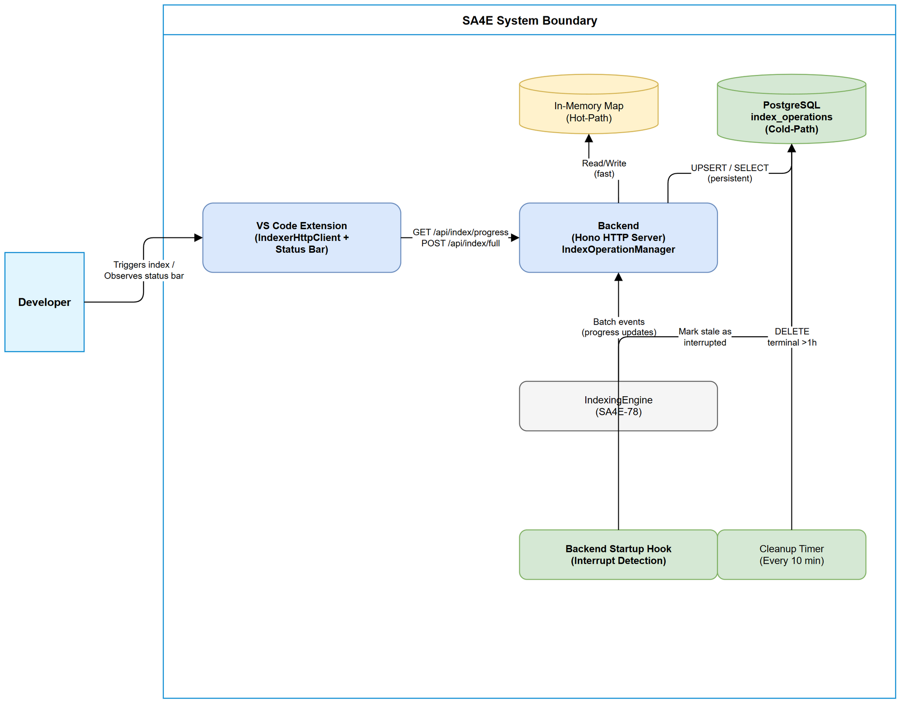
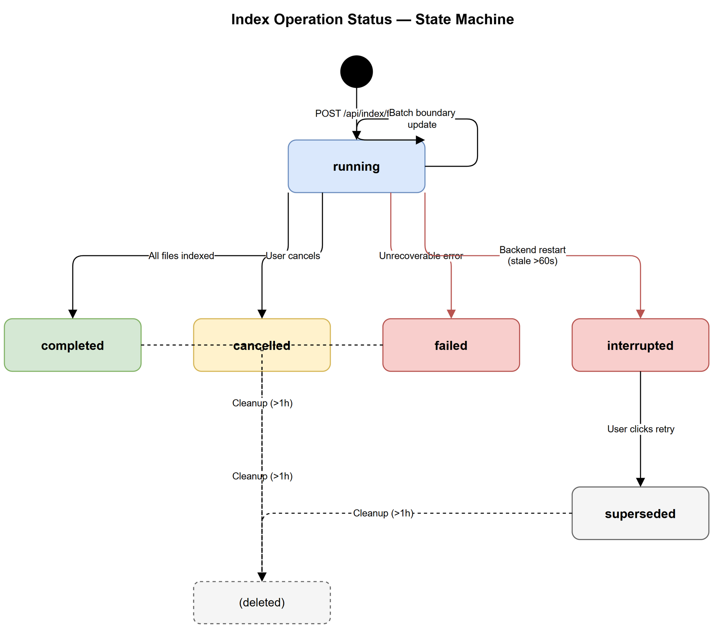
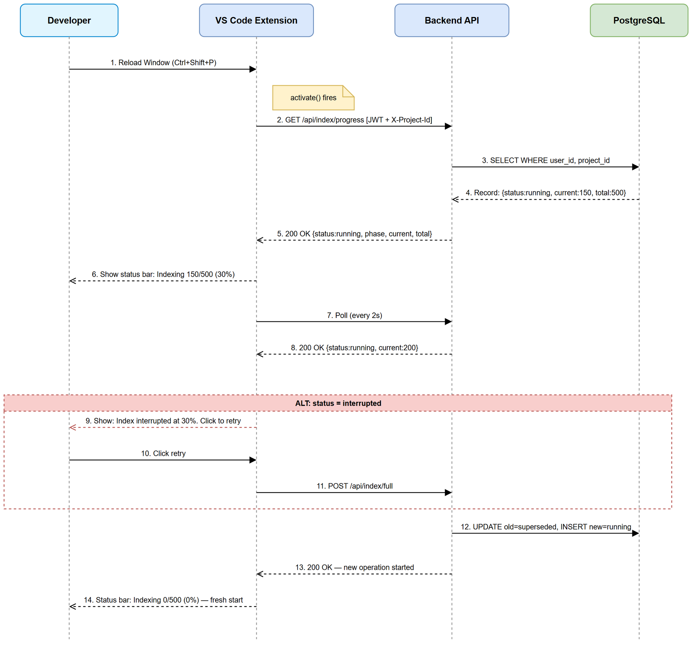

# Functional Specification Document (FSD)

## SA4E — SA4E-101: [Indexing] Persistent multi-tenant index status + auto-reconnect on extension reload

---

## Document Information

| Field | Value |
|-------|-------|
| Jira Ticket | SA4E-101 |
| Title | Persistent multi-tenant index status + auto-reconnect on extension reload |
| Author | BA Agent |
| Version | 1.2 |
| Date | 2026-08-11 |
| Status | Draft |
| Related BRD | documents/SA4E-101/BRD.md |

---

## Revision History

| Version | Date | Author | Changes |
|---------|------|--------|---------|
| 1.0 | 2026-08-11 | BA Agent | Initiate document — auto-generated from BRD SA4E-101 |
| 1.1 | 2026-08-11 | BA Agent | Add UC-06 (Cancel & Restart), UC-07 (Checksum-Based Skip), BR-11–BR-15, file_checksums table — from BRD v1.1 Story 6 & 7 |
| 1.2 | 2026-08-11 | TA Agent | Technical enrichment: API contracts (schemas), pseudocode (UC-06/UC-07/AF-13), integration specs, NFR quantified targets, codebase alignment notes |

---

## 1. Introduction

### 1.1 Purpose

This FSD specifies the functional behavior for persistent multi-tenant index status and auto-reconnect on extension reload. It translates BRD requirements into detailed use cases, business rules, data specifications, and UI behavior that developers and testers can implement and verify.

### 1.2 Scope

- Persist index operation state per tenant (userId + projectId) in PostgreSQL
- Auto-reconnect on extension `activate()` — poll backend for active operations
- Detect interrupted operations on backend startup (staleness threshold)
- Automatic cleanup of terminal-state records older than 1 hour
- Multi-tenant isolation at query level

**Out of Scope:** Modifying the indexing algorithm, SSE streaming, admin dashboards, AbortController cancellation changes.

### 1.3 Definitions & Acronyms

| Term | Definition |
|------|------------|
| Tenant | A unique combination of userId + projectId representing one user's workspace |
| Index Operation | A single full-index run tracked from start to completion/cancellation/failure |
| Interrupted | An operation that was running when backend restarted — status is stale and did not complete |
| Staleness Threshold | Time (60s default) after which a `running` operation with no updates is considered interrupted |
| Hot-Path | In-memory `IndexOperationManager` Map for fast access during active indexing |
| Cold-Path | PostgreSQL persistence layer that survives backend restarts |

### 1.4 References

| Document | Location |
|----------|----------|
| BRD | documents/SA4E-101/BRD.md |
| SA4E-99 TDD | documents/SA4E-99/TDD.md |
| SA4E-78 TDD | documents/SA4E-78/TDD.md |
| IndexOperationManager | backend/src/engine/indexer/index-operation-manager.ts |
| IndexerHttpClient | extension/src/services/IndexerHttpClient.ts |

---

## 2. System Overview

### 2.1 System Context Diagram



The system involves three primary components:
1. **VS Code Extension** — polls backend for index progress, renders status bar
2. **Backend (Hono HTTP Server)** — orchestrates indexing, persists state, serves progress API
3. **PostgreSQL** — stores `index_operations` table for durable multi-tenant state

External actors:
- **Developer** — triggers indexing, observes progress, retries interrupted operations
- **Backend Startup Hook** — detects and marks interrupted operations on restart

### 2.2 System Architecture

The architecture follows a dual-path model:
- **Hot-path** (in-memory): `IndexOperationManager` Map provides fast real-time access during active indexing sessions
- **Cold-path** (PostgreSQL): `index_operations` table provides persistence across restarts and multi-tenant isolation

On each batch boundary, the backend writes state to both paths. The progress API reads from hot-path first (fast), falls back to cold-path if the hot-path is empty (post-restart scenario).

---

## 3. Functional Requirements

### 3.1 Feature: Auto-Reconnect on Extension Reload

**Source:** BRD Story 1

#### 3.1.1 Description

When the VS Code extension activates (initial load or reload), it immediately polls the backend for any active index operation belonging to the current user and project. If an active operation exists, the status bar reappears with the correct state. Polling resumes at 2-second intervals.

#### 3.1.2 Use Case

**Use Case ID:** UC-01
**Use Case Name:** Reconnect to Active Index Operation on Extension Activate
**Actor:** Developer
**Preconditions:**
- Backend is running and reachable
- User is authenticated (JWT valid)
- X-Project-Id header available in extension config

**Postconditions:**
- If an active operation exists: status bar visible with current progress
- If no active operation: extension remains idle (no status bar)

**Main Flow:**

| Step | Actor | System | Description |
|------|-------|--------|-------------|
| 1 | | Extension | Extension `activate()` fires |
| 2 | | Extension | Calls `GET /api/index/progress` with auth headers |
| 3 | | Backend | Queries `index_operations` WHERE user_id = :userId AND project_id = :projectId |
| 4 | | Backend | Returns current operation state (or `idle` if none) |
| 5 | | Extension | If status != `idle`, shows status bar with phase, percentage, current file |
| 6 | | Extension | Starts polling at 2-second intervals |
| 7 | Developer | | Observes progress in status bar |

**Alternative Flows:**

| ID | Condition | Steps |
|----|-----------|-------|
| AF-01 | Status = `interrupted` | Extension shows "Index interrupted at X%. Click to retry" in status bar |
| AF-02 | Status = `completed` (within 1h) | Extension shows "Index complete" briefly, then hides status bar |
| AF-03 | No operation found | Backend returns `{ status: "idle" }`, extension does nothing |

**Exception Flows:**

| ID | Condition | Steps |
|----|-----------|-------|
| EF-01 | Backend unreachable (network error / timeout) | Extension logs warning, shows "Backend unavailable" in status bar, retries on next poll cycle (2s) |
| EF-02 | Auth token expired | Extension triggers token refresh flow, retries request |
| EF-03 | HTTP 500 from backend | Extension logs error, retries on next poll cycle, shows "Backend error" after 3 consecutive failures |

---

### 3.2 Feature: Persistent Index Status (Backend Restart Survival)

**Source:** BRD Story 2

#### 3.2.1 Description

The backend persists index operation state to PostgreSQL at every batch boundary. On backend startup, it checks for stale `running` records and marks them as `interrupted`. This allows the extension to detect interrupted operations and prompt the user to retry.

#### 3.2.2 Use Case

**Use Case ID:** UC-02
**Use Case Name:** Detect and Mark Interrupted Operations on Backend Startup
**Actor:** System (Backend Startup Hook)
**Preconditions:**
- PostgreSQL contains `index_operations` records
- Backend process is starting

**Postconditions:**
- All stale `running` records (updated_at > 60s ago) marked as `interrupted`
- Non-stale records remain unchanged

**Main Flow:**

| Step | Actor | System | Description |
|------|-------|--------|-------------|
| 1 | | Backend | Startup hook fires during server initialization |
| 2 | | Backend | Queries: SELECT id FROM index_operations WHERE status = 'running' AND updated_at < NOW() - INTERVAL '60 seconds' |
| 3 | | Backend | For each stale record: UPDATE status = 'interrupted' |
| 4 | | Backend | Logs count of interrupted operations |
| 5 | | Backend | Server continues startup normally |

**Alternative Flows:**

| ID | Condition | Steps |
|----|-----------|-------|
| AF-04 | No stale records found | Startup hook completes with no changes |
| AF-05 | Record updated_at is within 60s (fresh) | Record left as `running` — backend just restarted fast enough |

**Exception Flows:**

| ID | Condition | Steps |
|----|-----------|-------|
| EF-04 | PostgreSQL unreachable during startup | Backend logs CRITICAL error, startup continues without marking interrupted (graceful degradation) |

---

### 3.3 Feature: Multi-Tenant Isolation

**Source:** BRD Story 3

#### 3.3.1 Description

Each user+project combination can have at most one active index operation. The progress endpoint is filtered by authenticated userId AND X-Project-Id header. User A cannot see or affect User B's operations.

#### 3.3.2 Use Case

**Use Case ID:** UC-03
**Use Case Name:** Query Index Progress with Tenant Isolation
**Actor:** Developer
**Preconditions:**
- User authenticated via JWT (userId extracted)
- X-Project-Id header present in request

**Postconditions:**
- Only the caller's own operation (matching userId + projectId) is returned

**Main Flow:**

| Step | Actor | System | Description |
|------|-------|--------|-------------|
| 1 | Developer | | Extension sends GET /api/index/progress |
| 2 | | Backend | `requireAuth` middleware extracts userId from JWT |
| 3 | | Backend | `requireProjectId` middleware extracts projectId from X-Project-Id header |
| 4 | | Backend | Queries: SELECT * FROM index_operations WHERE user_id = :userId AND project_id = :projectId AND status NOT IN ('completed', 'cancelled', 'failed') LIMIT 1 |
| 5 | | Backend | Returns operation state or `{ status: "idle" }` |

**Alternative Flows:**

| ID | Condition | Steps |
|----|-----------|-------|
| AF-06 | Multiple terminal records exist (completed/failed) | Only non-terminal records returned; terminal ones cleaned by periodic job |

**Exception Flows:**

| ID | Condition | Steps |
|----|-----------|-------|
| EF-05 | Missing X-Project-Id header | Backend returns HTTP 400: "X-Project-Id header required" |
| EF-06 | Invalid/expired JWT | Backend returns HTTP 401: "Unauthorized" |

---

### 3.4 Feature: Automatic Cleanup of Completed Operations

**Source:** BRD Story 4

#### 3.4.1 Description

A periodic cleanup mechanism removes `index_operations` records where status is terminal (`completed`, `cancelled`, `failed`) and `updated_at` is older than 1 hour. Records with status `running` or `interrupted` are never automatically deleted.

#### 3.4.2 Use Case

**Use Case ID:** UC-04
**Use Case Name:** Periodic Cleanup of Terminal Operations
**Actor:** System (Timer/Scheduler)
**Preconditions:**
- Timer fires every 10 minutes
- PostgreSQL accessible

**Postconditions:**
- Terminal records older than 1 hour are deleted
- Active/interrupted records remain intact

**Main Flow:**

| Step | Actor | System | Description |
|------|-------|--------|-------------|
| 1 | | Backend | Cleanup timer fires (every 10 minutes) |
| 2 | | Backend | Executes: DELETE FROM index_operations WHERE status IN ('completed', 'cancelled', 'failed') AND updated_at < NOW() - INTERVAL '1 hour' |
| 3 | | Backend | Logs count of deleted records |

**Alternative Flows:**

| ID | Condition | Steps |
|----|-----------|-------|
| AF-07 | No records to clean | Timer completes silently |

**Exception Flows:**

| ID | Condition | Steps |
|----|-----------|-------|
| EF-07 | Database error during cleanup | Log error, retry on next timer tick (10 min later) |

---

### 3.5 Feature: Interrupted Index Retry UX

**Source:** BRD Story 5

#### 3.5.1 Description

When extension polls and receives `interrupted` status, a clickable status bar item appears prompting the user to retry. Clicking triggers a new full index operation that supersedes the interrupted record.

#### 3.5.2 Use Case

**Use Case ID:** UC-05
**Use Case Name:** Retry Interrupted Index Operation
**Actor:** Developer
**Preconditions:**
- Extension received status = `interrupted` from progress endpoint
- Status bar showing "Index interrupted at X%. Click to retry"

**Postconditions:**
- Old interrupted record deleted or marked `superseded`
- New index operation started
- Status bar shows new operation progress

**Main Flow:**

| Step | Actor | System | Description |
|------|-------|--------|-------------|
| 1 | Developer | | Clicks the status bar item |
| 2 | | Extension | Sends POST /api/index/full |
| 3 | | Backend | Deletes/supersedes the interrupted record for this tenant |
| 4 | | Backend | Creates new `index_operations` record with status = `running` |
| 5 | | Backend | Starts indexing engine |
| 6 | | Extension | Polling resumes, status bar shows new progress |

**Alternative Flows:**

| ID | Condition | Steps |
|----|-----------|-------|
| AF-08 | User does not click retry | Status bar remains showing interrupted state; no automatic retry |
| AF-09 | Another operation already running for this tenant | Per BR-11: backend auto-cancels running op and starts new one (no HTTP 409) |

**Exception Flows:**

| ID | Condition | Steps |
|----|-----------|-------|
| EF-08 | Backend unreachable when user clicks retry | Extension shows "Backend unavailable. Will retry on next poll." |
| EF-09 | POST /api/index/full returns 500 | Extension shows "Failed to start index. Try again later." |

---

### 3.6 Feature: Cancel Current Operation and Restart

**Source:** BRD Story 6

#### 3.6.1 Description

When a user sends `POST /api/index/full` while an index operation is already running for the same tenant, the backend automatically cancels the current operation and starts a new one. No HTTP 409 is returned — the system treats it as an implicit "cancel and restart" request.

#### 3.6.2 Use Case

**Use Case ID:** UC-06
**Use Case Name:** Cancel Current Index Operation and Restart on New Request
**Actor:** Developer
**Preconditions:**
- An index operation with status `running` exists for this tenant (userId + projectId)
- User sends `POST /api/index/full`

**Postconditions:**
- Previous running operation is marked as `cancelled`
- A new operation is created with status `running`
- Indexing engine starts processing the new operation

**Main Flow:**

| Step | Actor | System | Description |
|------|-------|--------|-------------|
| 1 | Developer | | Sends POST /api/index/full (via extension or retry) |
| 2 | | Backend | Detects an existing `running` operation for this tenant |
| 3 | | Backend | Sends abort signal to the running IndexingEngine instance |
| 4 | | Backend | Waits for abort acknowledgment (max 5 seconds) |
| 5 | | Backend | Updates existing operation: status = `cancelled`, updated_at = NOW() |
| 6 | | Backend | Creates a new `index_operations` record with status = `running` |
| 7 | | Backend | Starts a new IndexingEngine instance for the new operation |
| 8 | | Backend | Returns HTTP 200 with new operation ID and status = `running` |
| 9 | | Extension | Polling picks up the new operation's progress |

**Alternative Flows:**

| ID | Condition | Steps |
|----|-----------|-------|
| AF-10 | No running operation exists | Normal start: create new operation, start indexing (same as existing behavior) |
| AF-11 | Abort timeout (engine does not acknowledge within 5s) | Force-terminate the engine thread/process; mark old operation as `cancelled`; proceed with new operation |

**Exception Flows:**

| ID | Condition | Steps |
|----|-----------|-------|
| EF-10 | Database error during cancel (cannot update old record) | Log CRITICAL error; return HTTP 503 "Service temporarily unavailable"; do NOT start new operation |
| EF-11 | Database error during new operation creation | Log error; return HTTP 503; old operation remains `cancelled` (no orphan running ops) |

---

### 3.7 Feature: Checksum-Based Skip During Indexing

**Source:** BRD Story 7

#### 3.7.1 Description

During indexing, each file's SHA-256 checksum is computed and compared with the previously stored checksum. If the checksum is unchanged, the file is skipped (no KB re-ingestion). This significantly reduces indexing time for re-index operations where most files have not changed.

#### 3.7.2 Use Case

**Use Case ID:** UC-07
**Use Case Name:** Checksum-Based Skip During Indexing
**Actor:** System (IndexingEngine)
**Preconditions:**
- An index operation is in progress (status = `running`)
- File list has been scanned

**Postconditions:**
- Files with unchanged checksums are skipped (not re-ingested into KB)
- Files with changed/new checksums are fully processed and their new checksum stored
- Deleted files have their checksum records removed
- Progress counter reflects both skipped and processed files

**Main Flow:**

| Step | Actor | System | Description |
|------|-------|--------|-------------|
| 1 | | IndexingEngine | Picks next file from the scan list |
| 2 | | IndexingEngine | Reads file content and computes SHA-256 checksum |
| 3 | | IndexingEngine | Queries `file_checksums` table for this file_path + user_id + project_id |
| 4 | | IndexingEngine | Compares computed checksum with stored checksum |
| 5 | | IndexingEngine | Checksum matches → skip file (no KB ingestion) |
| 6 | | IndexingEngine | Increments progress counter (file counted as processed) |
| 7 | | IndexingEngine | Repeats from Step 1 for next file |

**For files with changed checksum:**

| Step | Actor | System | Description |
|------|-------|--------|-------------|
| 5a | | IndexingEngine | Checksum differs → process file (parse, chunk, ingest into KB) |
| 5b | | IndexingEngine | UPSERT `file_checksums` with new checksum and `last_indexed_at = NOW()` |
| 5c | | IndexingEngine | Increments progress counter |

**Alternative Flows:**

| ID | Condition | Steps |
|----|-----------|-------|
| AF-12 | New file (no previous checksum record exists) | Treat as changed — full processing + INSERT new checksum record |
| AF-13 | Deleted file (file in checksum table but not in scan list) | After indexing completes: DELETE checksum records for files no longer present in project |

**Exception Flows:**

| ID | Condition | Steps |
|----|-----------|-------|
| EF-12 | Checksum computation error (file unreadable, permission denied) | Log warning; skip file; increment progress counter; continue with next file |
| EF-13 | Database lookup error (cannot read/write file_checksums) | Log error; fall back to full processing for this file (treat as changed); continue |

---

### 3.8 Business Rules

| Rule ID | Rule | Source | Enforcement |
|---------|------|--------|-------------|
| BR-01 | Each tenant (userId + projectId) can have at most ONE active (running/interrupted) operation at a time | BRD Story 3 | UNIQUE constraint on (user_id, project_id) for non-terminal statuses; application-level check before INSERT |
| BR-02 | Progress endpoint MUST filter by authenticated userId AND projectId — no cross-tenant visibility | BRD Story 3 | WHERE clause in every query |
| BR-03 | Backend MUST update DB at batch boundaries — not on every file | BRD Risk mitigation | Batch update every ~50 files processed |
| BR-04 | Staleness threshold for interrupted detection = 60 seconds | BRD Story 2 | Configurable, default 60s |
| BR-05 | Terminal operations (completed/cancelled/failed) auto-deleted after 1 hour | BRD Story 4 | Periodic cleanup job every 10 minutes |
| BR-06 | Running/interrupted operations are NEVER auto-deleted | BRD Story 4 | Excluded from cleanup WHERE clause |
| BR-07 | Extension polls at 2-second intervals | BRD Story 1 | setTimeout/setInterval in extension polling logic |
| BR-08 | Status bar MUST NOT create duplicates on repeated reloads | BRD Story 1 AC3 | Extension disposes existing status bar before creating new one |
| BR-09 | Retry creates a NEW operation (from scratch) — no resume from interrupted point | BRD Story 2 AC3 | POST /api/index/full always starts fresh |
| BR-10 | DB write at batch boundary adds <10ms overhead (async, non-blocking) | BRD NFR | Fire-and-forget async upsert |
| BR-11 | POST /api/index/full with an existing running operation → auto-cancel running op + start new (no HTTP 409 returned) | BRD Story 6 | Application logic: detect running → abort → cancel → create new |
| BR-12 | Each indexed file MUST store its SHA-256 checksum in the `file_checksums` table | BRD Story 7 | UPSERT after successful file processing |
| BR-13 | Re-index MUST skip files whose checksum is unchanged — no KB re-ingestion for unchanged files | BRD Story 7 | Compare computed vs stored checksum before processing |
| BR-14 | Files deleted since last index → their checksum records MUST be removed from `file_checksums` | BRD Story 7 | Post-index cleanup: DELETE WHERE file_path NOT IN (current scan list) |
| BR-15 | Progress counter MUST include both skipped (checksum match) and fully-processed files in `current` count | BRD Story 7 | Increment counter regardless of skip/process decision |

---

## 4. Data Model

### 4.1 Logical Entity: index_operations

| Attribute | Type | Required | Business Rule | Description |
|-----------|------|----------|---------------|-------------|
| id | UUID | Yes | — | Primary key, generated on operation start |
| user_id | VARCHAR(255) | Yes | BR-02 | Authenticated user identifier from JWT |
| project_id | VARCHAR(255) | Yes | BR-02 | Tenant project identifier from X-Project-Id header |
| status | ENUM('running', 'interrupted', 'completed', 'cancelled', 'failed', 'superseded') | Yes | BR-01 | Current operation state |
| phase | VARCHAR(20) | Yes | — | Current indexing phase (scanning, indexing, resolving) |
| current | INTEGER | Yes | — | Files processed so far |
| total | INTEGER | Yes | — | Total files to process |
| current_file | TEXT | No | — | Path of file currently being processed |
| started_at | TIMESTAMP WITH TIME ZONE | Yes | — | When operation was created |
| updated_at | TIMESTAMP WITH TIME ZONE | Yes | BR-04 | Last progress update time; used for staleness detection |

**Indexes:**
- PRIMARY KEY: `id`
- UNIQUE (active): `(user_id, project_id)` WHERE status IN ('running', 'interrupted') — partial unique index
- INDEX: `(status, updated_at)` — for cleanup queries

**State Machine:**



### 4.1.2 Logical Entity: file_checksums

| Attribute | Type | Required | Business Rule | Description |
|-----------|------|----------|---------------|-------------|
| id | UUID | Yes | — | Primary key |
| user_id | VARCHAR(255) | Yes | BR-02 | Authenticated user identifier (tenant scoping) |
| project_id | VARCHAR(255) | Yes | BR-02 | Tenant project identifier |
| file_path | TEXT | Yes | BR-12 | Relative path of the indexed file within the project |
| file_checksum | CHAR(64) | Yes | BR-12 | SHA-256 hex digest of the file content |
| last_indexed_at | TIMESTAMP WITH TIME ZONE | Yes | — | When this file was last successfully indexed |

**Indexes:**
- PRIMARY KEY: `id`
- UNIQUE: `(user_id, project_id, file_path)` — one checksum record per file per tenant
- INDEX: `(user_id, project_id)` — for bulk cleanup queries (BR-14)

**Operations:**
- **UPSERT** on file process: INSERT or UPDATE checksum + last_indexed_at (Step 5b of UC-07)
- **SELECT** for comparison: WHERE user_id = :userId AND project_id = :projectId AND file_path = :filePath
- **DELETE** for cleanup: WHERE user_id = :userId AND project_id = :projectId AND file_path NOT IN (:currentFileList)

### 4.2 Status Transitions

| From | To | Trigger | Actor |
|------|-----|---------|-------|
| (none) | running | POST /api/index/full | Developer (via extension) |
| running | running | Batch boundary update | Backend (IndexingEngine) |
| running | completed | All files indexed | Backend (IndexingEngine) |
| running | cancelled | User cancels | Developer (via extension) |
| running | cancelled | New index request from same tenant (auto-cancel) | Backend (BR-11: cancel & restart) |
| running | failed | Unrecoverable error | Backend (IndexingEngine) |
| running | interrupted | Backend startup detects stale record | Backend (Startup Hook) |
| interrupted | superseded | User clicks retry (new op starts) | Developer (via extension) |
| interrupted | (deleted) | Manual admin cleanup | System operator |
| completed | (deleted) | Cleanup job (>1h old) | Backend (Timer) |
| cancelled | (deleted) | Cleanup job (>1h old) | Backend (Timer) |
| failed | (deleted) | Cleanup job (>1h old) | Backend (Timer) |
| superseded | (deleted) | Cleanup job (>1h old) | Backend (Timer) |

---

## 5. Integration Specifications

### 5.1 External System: PostgreSQL Database

| Attribute | Value |
|-----------|-------|
| Purpose | Persist index operation state across backend restarts |
| Direction | Bidirectional (read + write) |
| Data Format | SQL (relational) |
| Frequency | Write: every ~50 files (batch boundary). Read: every 2s per active tenant polling |

### 5.2 External System: VS Code Extension (IndexerHttpClient)

| Attribute | Value |
|-----------|-------|
| Purpose | Display index progress to user, trigger retry |
| Direction | Outbound (extension polls backend) |
| Data Format | JSON over HTTP |
| Frequency | Polling every 2 seconds during active operations |

**Data Exchange:**

| Backend Data | Extension Data | Direction | Business Rule |
|--------------|---------------|-----------|---------------|
| index_operations record | IndexProgress model | Backend -> Extension | BR-02: filtered by tenant |
| POST /api/index/full trigger | User click event | Extension -> Backend | BR-09: starts new operation |

---

## 6. Processing Logic

### 6.1 Process: Batch Boundary Persistence

**Trigger:** IndexingEngine completes processing a batch of ~50 files
**Input:** Current operation state (phase, current count, total, current_file)
**Output:** Updated `index_operations` record in PostgreSQL

**Processing Steps:**

| Step | Description | Error Handling |
|------|-------------|----------------|
| 1 | IndexingEngine emits batch-complete event | — |
| 2 | IndexOperationManager updates in-memory Map (hot-path) | — |
| 3 | Async fire-and-forget: UPSERT index_operations SET phase, current, total, current_file, updated_at | On DB error: log warning, continue indexing (non-blocking) |

### 6.2 Process: Backend Startup Interrupted Detection

**Trigger:** Backend HTTP server startup (before accepting requests)
**Input:** All `index_operations` records with status = 'running'
**Output:** Stale records marked as 'interrupted'

**Processing Steps:**

| Step | Description | Error Handling |
|------|-------------|----------------|
| 1 | Query: SELECT id FROM index_operations WHERE status = 'running' AND updated_at < NOW() - 60s | If DB unavailable: log CRITICAL, skip (graceful degradation) |
| 2 | For each result: UPDATE status = 'interrupted' WHERE id = :id | Individual failures logged, continue with next |
| 3 | Log: "Marked {N} operations as interrupted" | — |

### 6.3 Process: Progress Endpoint Read Path

**Trigger:** GET /api/index/progress request
**Input:** userId (from JWT), projectId (from X-Project-Id)
**Output:** Current operation state or `{ status: "idle" }`

**Processing Steps:**

| Step | Description | Error Handling |
|------|-------------|----------------|
| 1 | Check in-memory Map for (userId, projectId) key | — |
| 2 | If found in memory: return immediately (hot-path) | — |
| 3 | If not in memory: query PostgreSQL by (user_id, project_id) WHERE status IN ('running', 'interrupted') | DB error: return HTTP 503 |
| 4 | If DB record found: return state | — |
| 5 | If no record: return `{ status: "idle" }` | — |

### 6.4 Sequence Diagram: Auto-Reconnect Flow



---

## 7. Security Requirements

### 7.1 Authentication & Authorization

| Role | Permissions | Screens/Features |
|------|-------------|-------------------|
| Authenticated Developer | Read own progress, trigger index, retry interrupted | Status bar, index commands |
| System (Backend) | Read/write all records (internal) | Startup hook, cleanup job |

### 7.2 Data Sensitivity Classification

| Data Type | Classification | Business Requirement |
|-----------|---------------|---------------------|
| user_id | Internal | Identifies user — filtered in all queries |
| project_id | Internal | Identifies tenant project |
| current_file | Internal | May contain file path revealing project structure |
| index_operations records | Internal | Progress metadata, low sensitivity |

### 7.3 Audit Trail

| Event | Logged Fields | Retention | Business Reason |
|-------|--------------|-----------|-----------------|
| Operation created | user_id, project_id, started_at | Application logs | Debugging |
| Operation interrupted (startup) | id, user_id, project_id, last updated_at | Application logs | Incident investigation |
| Cleanup executed | count deleted, timestamp | Application logs | Capacity monitoring |

---

## 8. Non-Functional Requirements

| Category | Business Requirement | Acceptance Criteria |
|----------|---------------------|---------------------|
| Performance | Progress endpoint responds quickly | Response time < 50ms (simple indexed PK lookup) |
| Performance | DB write does not slow indexing | Batch boundary write overhead < 10ms (async) |
| Reliability | Status survives backend restart | PostgreSQL durability guarantees |
| Scalability | Support 100+ concurrent tenants | Each tenant has at most 1 active row; table stays small |
| Availability | Extension tolerates backend unavailability | Graceful degradation — status bar shows "Backend unavailable" |
| Consistency | Extension shows accurate progress after reload | Status bar re-appears within 4 seconds with correct percentage |

---

## 9. Error Handling (User-Facing)

### 9.1 Error Scenarios

| Scenario | Severity | User Message | Expected Behavior |
|----------|----------|-------------|-------------------|
| Backend unreachable on poll | Warning | "$(cloud-off) Backend unavailable" | Status bar shows warning icon; retries on next 2s poll |
| Backend returns 500 on poll | Warning | "$(error) Backend error" | Shows after 3 consecutive failures; auto-recovers when backend responds |
| Retry POST fails (network) | Warning | "Failed to start index. Will retry." | Extension retries on next poll cycle |
| Retry POST returns 409 (conflict) | Info | "Index already in progress" | Status bar switches to show existing operation's progress |
| Auth token expired | Info | (No user message — transparent refresh) | Extension refreshes token, retries request |
| Missing project context | Critical | "No project selected. Open a workspace." | Extension does not poll; status bar hidden |

### 9.2 Backend Error Codes

| HTTP Status | Condition | Response Body |
|-------------|-----------|---------------|
| 200 | Success | `{ status, phase, current, total, current_file, started_at, updated_at }` |
| 400 | Missing X-Project-Id | `{ error: "X-Project-Id header required" }` |
| 401 | Invalid/expired JWT | `{ error: "Unauthorized" }` |
| 409 | Operation already running (on POST /api/index/full) — DEPRECATED by BR-11: now auto-cancels instead | `{ error: "Index operation already in progress" }` |
| 503 | Database unavailable | `{ error: "Service temporarily unavailable" }` |

---

## 10. UI Specifications

### 10.1 Status Bar Item: Index Progress

**Location:** VS Code Status Bar (left area)

| State | Icon | Text | Tooltip | Click Action |
|-------|------|------|---------|--------------|
| Running | $(sync~spin) | "Indexing: {phase} {current}/{total} ({percent}%)" | "Full index in progress\nStarted: {started_at}\nCurrent: {current_file}" | None (informational) |
| Interrupted | $(warning) | "Index interrupted at {percent}%. Click to retry" | "Index was interrupted by backend restart\nLast progress: {current}/{total}\nClick to start a new full index" | POST /api/index/full |
| Completed (brief) | $(check) | "Index complete" | "Indexing finished successfully" | None; auto-hides after 5s |
| Backend unavailable | $(cloud-off) | "Backend unavailable" | "Cannot reach backend server\nRetrying every 2s..." | None |
| Backend error | $(error) | "Index status error" | "Backend returned an error\nRetrying..." | None |

### 10.2 Behavior Rules

| Rule | Description |
|------|-------------|
| No duplicates | On reload: dispose existing status bar item before creating new one |
| Auto-hide when idle | If status = `idle`, status bar item is hidden (not shown) |
| Progressive display | Status bar appears only when status != `idle` |
| Graceful on error | Never throw unhandled errors from polling — always catch and display |
| Elapsed time | Optionally show elapsed time since started_at (format: "2m 30s") |

---

## 11. Appendix

### Diagram Index

| # | Diagram | Image | Source (editable) |
|---|---------|-------|-------------------|
| 1 | System Context | [system-context.png](diagrams/system-context.png) | [system-context.drawio](diagrams/system-context.drawio) |
| 2 | Sequence: Index Reconnect | [sequence-index-reconnect.png](diagrams/sequence-index-reconnect.png) | [sequence-index-reconnect.drawio](diagrams/sequence-index-reconnect.drawio) |
| 3 | State: Index Status | [state-index-status.png](diagrams/state-index-status.png) | [state-index-status.drawio](diagrams/state-index-status.drawio) |

---

## 12. Technical Appendix — API Contracts (TA Enrichment v1.2)

### 12.1 POST /api/index/full — Trigger Full Index (with Auto-Cancel)

**Purpose:** Start a new full index operation for the authenticated tenant. If an operation is already running for the same tenant, auto-cancels it first (BR-11).

**Request:**

```
POST /api/index/full
Headers:
  Authorization: Bearer <JWT>
  X-Project-Id: <projectId>
  X-Workspace-Root: <workspace-path>   (optional — fallback to server config)
  Content-Type: application/json
Body: {}  (empty body; workspace derived from headers/config)
```

**Response — Success (new operation started, no prior running op):**

```json
// HTTP 200
{
  "operationId": "idx-a1b2c3d4",
  "projectId": "my-project",
  "status": "running",
  "message": "Full index started",
  "cancelledPrevious": false
}
```

**Response — Success (auto-cancelled previous operation per BR-11):**

```json
// HTTP 200
{
  "operationId": "idx-e5f6g7h8",
  "projectId": "my-project",
  "status": "running",
  "message": "Previous operation cancelled, new index started",
  "cancelledPrevious": true,
  "cancelledOperationId": "idx-a1b2c3d4"
}
```

**Response — Error:**

| HTTP Status | Condition | Body |
|-------------|-----------|------|
| 400 | Missing X-Project-Id | `{ "error": "X-Project-Id required" }` |
| 401 | Invalid/expired JWT | `{ "error": "Unauthorized" }` |
| 503 | Code intelligence not ready | `{ "error": "Code intelligence not ready" }` |
| 503 | Database unavailable during cancel | `{ "error": "Service temporarily unavailable" }` |

**Notes:**
- HTTP 409 is **DEPRECATED** per BR-11. Existing code returns 409 — SA4E-101 changes this to auto-cancel + 200.
- Current codebase (`api-index-decoupled.ts`) returns HTTP 202 for success. SA4E-101 unifies to HTTP 200 with richer response including `cancelledPrevious` flag.

---

### 12.2 GET /api/index/progress — Poll Index Progress

**Purpose:** Returns current operation state for the authenticated tenant. Includes checksum stats (files_skipped, files_processed) per BR-15.

**Request:**

```
GET /api/index/progress
Headers:
  Authorization: Bearer <JWT>
  X-Project-Id: <projectId>
```

**Response — Active Operation:**

```json
// HTTP 200
{
  "operationId": "idx-a1b2c3d4",
  "status": "running",
  "phase": "indexing",
  "current": 250,
  "total": 500,
  "percentage": 50,
  "currentFile": "src/services/auth.ts",
  "startedAt": "2026-08-11T10:00:00.000Z",
  "updatedAt": "2026-08-11T10:01:30.000Z",
  "elapsedMs": 90000,
  "checksumStats": {
    "files_skipped": 180,
    "files_processed": 70,
    "files_pending": 250
  }
}
```

**Response — Interrupted:**

```json
// HTTP 200
{
  "operationId": "idx-a1b2c3d4",
  "status": "interrupted",
  "phase": "indexing",
  "current": 250,
  "total": 500,
  "percentage": 50,
  "currentFile": "src/services/auth.ts",
  "startedAt": "2026-08-11T10:00:00.000Z",
  "updatedAt": "2026-08-11T10:01:30.000Z",
  "elapsedMs": 90000,
  "checksumStats": null
}
```

**Response — Idle (no active operation):**

```json
// HTTP 200
{
  "operationId": "",
  "status": "idle",
  "phase": "idle",
  "current": 0,
  "total": 0,
  "percentage": 0,
  "startedAt": "",
  "elapsedMs": 0,
  "checksumStats": null
}
```

**Response schema (TypeScript):**

```typescript
interface ProgressResponse {
  operationId: string;
  status: 'idle' | 'running' | 'interrupted' | 'completed' | 'cancelled' | 'failed';
  phase: 'idle' | 'scanning' | 'indexing' | 'resolving' | 'complete' | 'cancelled' | 'error';
  current: number;
  total: number;
  percentage: number;
  currentFile?: string;
  startedAt: string;        // ISO 8601
  updatedAt?: string;       // ISO 8601 — from DB persistence
  elapsedMs: number;
  checksumStats: ChecksumStats | null;
}

interface ChecksumStats {
  files_skipped: number;    // files where checksum matched (BR-13)
  files_processed: number;  // files that were fully re-indexed
  files_pending: number;    // files not yet processed in current run
}
```

---

### 12.3 file_checksums CRUD Operations (Integration Contract)

**UPSERT — After file processing (UC-07 Step 5b):**

```sql
INSERT INTO file_checksums (id, user_id, project_id, file_path, file_checksum, last_indexed_at)
VALUES (:id, :userId, :projectId, :filePath, :checksum, NOW())
ON CONFLICT (user_id, project_id, file_path)
DO UPDATE SET file_checksum = :checksum, last_indexed_at = NOW();
```

**SELECT — Checksum lookup for comparison (UC-07 Step 3):**

```sql
SELECT file_checksum FROM file_checksums
WHERE user_id = :userId AND project_id = :projectId AND file_path = :filePath;
```

**Batch SELECT — Pre-load all checksums for a tenant (optimization):**

```sql
SELECT file_path, file_checksum FROM file_checksums
WHERE user_id = :userId AND project_id = :projectId;
-- Returns Map<filePath, checksum> loaded into memory before indexing loop
```

**DELETE — Cleanup deleted files (AF-13):**

```sql
DELETE FROM file_checksums
WHERE user_id = :userId AND project_id = :projectId
  AND file_path NOT IN (:currentScanFileList);
```

**DELETE — Tenant cleanup (when project removed):**

```sql
DELETE FROM file_checksums
WHERE user_id = :userId AND project_id = :projectId;
```

---

## 13. Technical Appendix — Pseudocode (TA Enrichment v1.2)

### 13.1 Cancel & Restart Logic (UC-06 Steps 2–7)

```pseudocode
FUNCTION handleFullIndex(userId, projectId, workspace):
  // Step 2: Detect existing running operation
  existingOp = db.query(
    "SELECT id, status FROM index_operations WHERE user_id = ? AND project_id = ? AND status = 'running'",
    [userId, projectId]
  )

  IF existingOp IS NOT NULL:
    // Step 3: Send abort signal
    engine = operationEngines.get(existingOp.id)
    IF engine IS NOT NULL:
      engine.abortController.abort()

      // Step 4: Wait for acknowledgment (max 5s)
      acknowledged = AWAIT waitForAbort(engine, timeout=5000ms)
      IF NOT acknowledged:
        // AF-11: Force-terminate
        engine.forceTerminate()
        LOG.warn("Force-terminated engine for op={}", existingOp.id)
      END IF
    END IF

    // Step 5: Update DB — mark old operation as cancelled
    TRY:
      db.execute(
        "UPDATE index_operations SET status = 'cancelled', updated_at = NOW() WHERE id = ?",
        [existingOp.id]
      )
    CATCH dbError:
      // EF-10: Database error during cancel
      LOG.critical("Cannot cancel operation: {}", dbError)
      RETURN HTTP 503 "Service temporarily unavailable"
    END TRY

    // Remove from hot-path
    hotPathMap.delete(projectId)
  END IF

  // Step 6: Create new operation record
  newOpId = generateUUID()
  TRY:
    db.execute(
      "INSERT INTO index_operations (id, user_id, project_id, status, phase, current, total, started_at, updated_at)
       VALUES (?, ?, ?, 'running', 'scanning', 0, 0, NOW(), NOW())",
      [newOpId, userId, projectId]
    )
  CATCH dbError:
    // EF-11: Database error during creation
    LOG.error("Cannot create operation: {}", dbError)
    RETURN HTTP 503 "Service temporarily unavailable"
  END TRY

  // Step 7: Start new IndexingEngine instance
  newEngine = IndexingEngine.create(workspace, newOpId)
  operationEngines.set(newOpId, newEngine)
  hotPathMap.set(projectId, { opId: newOpId, status: 'running', phase: 'scanning' })

  // Fire-and-forget: engine runs async
  ASYNC newEngine.runFullIndex(abortSignal)

  // Step 8: Return success
  RETURN HTTP 200 {
    operationId: newOpId,
    projectId: projectId,
    status: "running",
    cancelledPrevious: existingOp IS NOT NULL,
    cancelledOperationId: existingOp?.id
  }
END FUNCTION
```

---

### 13.2 Checksum Comparison Loop (UC-07 Main Flow)

```pseudocode
FUNCTION processFilesWithChecksumSkip(fileList, userId, projectId):
  // Pre-load all existing checksums for this tenant (batch optimization)
  storedChecksums = db.queryMap(
    "SELECT file_path, file_checksum FROM file_checksums WHERE user_id = ? AND project_id = ?",
    [userId, projectId]
  )  // Returns Map<string, string>

  stats = { skipped: 0, processed: 0 }

  FOR EACH filePath IN fileList:
    // Check abort signal
    IF abortSignal.aborted:
      THROW AbortError("Operation cancelled")
    END IF

    // Step 2: Compute SHA-256 checksum
    TRY:
      fileContent = readFile(filePath)
      computedChecksum = SHA256(fileContent)
    CATCH readError:
      // EF-12: File unreadable
      LOG.warn("Cannot read file {}: {}", filePath, readError)
      stats.processed++
      incrementProgress(current + 1, total)
      CONTINUE
    END TRY

    // Step 3-4: Compare with stored checksum
    storedChecksum = storedChecksums.get(filePath)

    IF storedChecksum == computedChecksum:
      // Step 5: Checksum matches → SKIP
      stats.skipped++
    ELSE:
      // Step 5a: Checksum differs or new file → PROCESS
      TRY:
        parseResult = parseFile(fileContent, filePath)
        chunks = chunkContent(parseResult)
        AWAIT ingestToKB(chunks, userId, projectId)

        // Step 5b: UPSERT checksum
        db.execute(
          "INSERT INTO file_checksums (id, user_id, project_id, file_path, file_checksum, last_indexed_at)
           VALUES (?, ?, ?, ?, ?, NOW())
           ON CONFLICT (user_id, project_id, file_path)
           DO UPDATE SET file_checksum = ?, last_indexed_at = NOW()",
          [generateUUID(), userId, projectId, filePath, computedChecksum, computedChecksum]
        )
      CATCH dbLookupError:
        // EF-13: DB error → fall back to full processing (treat as changed)
        LOG.error("DB error for checksum of {}: {}", filePath, dbLookupError)
        // Process file anyway (already done above)
      END TRY
      stats.processed++
    END IF

    // Step 6: Increment progress counter (BR-15: count both skipped + processed)
    incrementProgress(current + 1, total)

    // Batch boundary: persist state to DB every 50 files
    IF (stats.skipped + stats.processed) % 50 == 0:
      persistProgressToDB(userId, projectId, phase, current, total, filePath)
    END IF
  END FOR

  RETURN stats
END FUNCTION
```

---

### 13.3 Deleted File Cleanup (AF-13)

```pseudocode
FUNCTION cleanupDeletedFileChecksums(currentScanList, userId, projectId):
  // Called AFTER main indexing loop completes successfully
  // currentScanList = Set<string> of all file paths found during scan phase

  // Approach 1: Small project (<1000 files) — pass list directly
  IF currentScanList.size < 1000:
    db.execute(
      "DELETE FROM file_checksums
       WHERE user_id = ? AND project_id = ?
         AND file_path NOT IN (?)",
      [userId, projectId, currentScanList.toArray()]
    )
  ELSE:
    // Approach 2: Large project — use temp table or chunked deletion
    storedPaths = db.query(
      "SELECT file_path FROM file_checksums WHERE user_id = ? AND project_id = ?",
      [userId, projectId]
    )

    deletedPaths = storedPaths.filter(p => NOT currentScanList.has(p))

    IF deletedPaths.length > 0:
      // Delete in batches of 500 to avoid query size limits
      FOR EACH batch IN chunk(deletedPaths, 500):
        db.execute(
          "DELETE FROM file_checksums
           WHERE user_id = ? AND project_id = ? AND file_path IN (?)",
          [userId, projectId, batch]
        )
      END FOR

      LOG.info("Cleaned up {} deleted file checksums for {}/{}", deletedPaths.length, userId, projectId)
    END IF
  END IF

  // Also remove KB entries for deleted files
  FOR EACH deletedPath IN deletedPaths:
    AWAIT removeFromKB(deletedPath, userId, projectId)
  END FOR
END FUNCTION
```

---

## 14. Technical Appendix — Codebase Alignment Notes (TA Enrichment v1.2)

### 14.1 Data Model Gaps — Current vs Required

| Aspect | Current Codebase | FSD Required | Action for SA4E-101 |
|--------|-----------------|--------------|---------------------|
| `OperationStatus` type | `'running' \| 'completed' \| 'cancelled' \| 'failed'` | + `'interrupted' \| 'superseded'` | Extend `types.ts` |
| `ProgressPhase` type | `'idle' \| 'scanning' \| 'indexing' \| 'resolving' \| 'complete' \| 'cancelled' \| 'error'` | Add `'finalizing'` (FSD Sec 4.1 says "finalizing") | Reconcile: use existing `'resolving'` as equivalent to "finalizing" |
| POST /api/index/full response | HTTP 202 + `{ operationId, projectId, status, message }` | HTTP 200 + `{ cancelledPrevious }` flag | Modify `handleFullIndex()` |
| POST /api/index/full conflict | Returns HTTP 409 | Auto-cancel + HTTP 200 (BR-11) | Rewrite conflict branch |
| In-memory Map key | `projectId` only | Should be `userId + projectId` (multi-tenant) | Change Map key to composite |
| PostgreSQL persistence | Not implemented | `index_operations` table | New: migration + repository |
| `file_checksums` table | Not implemented (extension has local `checksum.ts` for SDLC files) | New PostgreSQL table | New: migration + repository |
| Startup interrupted detection | Not implemented | Startup hook with staleness check | New: hook in server init |
| Periodic cleanup | In-memory setTimeout (60s) | DB-level DELETE for >1hr terminal ops | New: setInterval every 10min |

### 14.2 Extension checksum.ts — Unrelated

The existing `extension/src/checksum.ts` manages SDLC template file versioning (bundled vs workspace manifests). It is **unrelated** to SA4E-101's indexing file checksums. SA4E-101's checksum logic lives in the **backend** and tracks indexed source files per tenant in PostgreSQL.

### 14.3 `ProgressPhase` Reconciliation

FSD Section 4.1 lists phase as `VARCHAR(20)` with values "scanning, indexing, finalizing". The codebase uses `'resolving'` as the post-indexing phase. **Recommendation:** Keep `'resolving'` from codebase as-is (no rename). Update FSD reference: phase values = `scanning | indexing | resolving | complete | cancelled | error`.

---

## 15. Technical Appendix — Non-Functional Requirements (Quantified) (TA Enrichment v1.2)

### 15.1 Checksum Computation Overhead

| Metric | Target | Rationale |
|--------|--------|-----------|
| SHA-256 per file (avg 10KB) | < 0.5ms | Node.js `crypto.createHash('sha256')` native: ~100MB/s throughput |
| SHA-256 per file (max 500KB) | < 3ms | Acceptable even for large files |
| Checksum DB lookup (single) | < 1ms | Simple indexed SELECT by composite key |
| Batch pre-load (500 files) | < 10ms | Single SELECT returns all rows for tenant |
| Total checksum overhead per file | < 2ms avg | Sum: compute (0.5ms) + lookup (1ms amortized) |
| BRD acceptance criterion | < 1ms per file | Met by batch pre-load pattern (amortized lookup = 0.02ms/file) |

### 15.2 Cancel + Restart Latency

| Metric | Target | Rationale |
|--------|--------|-----------|
| Abort signal delivery | < 10ms | AbortController.abort() is synchronous |
| Engine acknowledgment | < 5s (timeout) | Engine checks signal at batch boundaries (every ~50 files) |
| DB update (cancel old) | < 5ms | Single UPDATE by PK |
| DB insert (new operation) | < 5ms | Single INSERT |
| Total cancel-to-new-start latency | < 5.1s worst case, < 100ms typical | Typical: engine at batch boundary, immediate ack |
| Extension status bar transition | < 2s after restart | Next poll picks up new operation (2s interval) |

### 15.3 file_checksums Table Size Estimates

| Scenario | Row Count | Storage (est.) | Notes |
|----------|-----------|---------------|-------|
| 1 tenant, 500 files | 500 rows | ~75 KB | avg row ≈ 150 bytes (UUID + path + checksum + timestamp) |
| 1 tenant, 5,000 files | 5,000 rows | ~750 KB | Large monorepo |
| 10 tenants, 1,000 files each | 10,000 rows | ~1.5 MB | Multi-tenant server |
| 100 tenants, 2,000 files each | 200,000 rows | ~30 MB | High-scale estimate |
| Index scan time for 200K rows | < 50ms | B-tree on (user_id, project_id, file_path) | Composite unique index |

**Growth rate:** ~1 row per indexed file per tenant. Cleanup via AF-13 removes deleted files. No TTL-based expiry needed — checksums persist until file is deleted from project.

### 15.4 Progress Endpoint Performance Budget

| Component | Target | Method |
|-----------|--------|--------|
| Hot-path (in-memory hit) | < 1ms | Direct Map.get() |
| Cold-path (DB query) | < 10ms | Indexed query by (user_id, project_id) |
| Total E2E (including middleware) | < 50ms | Auth extraction + query + serialization |
| DB connection pool overhead | < 5ms | Pre-warmed connection pool |

---

## 16. Technical Appendix — UC-06/UC-07 Alternative Flow Supplements (TA Review)

### 16.1 UC-06 Additional Exception Flow

| ID | Condition | Steps |
|----|-----------|-------|
| EF-12 | Engine process is zombie (not responding to abort or force-terminate) | Log CRITICAL; mark old op as `cancelled` anyway; create new op; flag old engine for monitoring; new engine starts independently |

### 16.2 UC-07 Additional Alternative Flow Detail (AF-13 Timing)

**AF-13 (Deleted file cleanup) execution timing:**

The deleted file cleanup runs as a **post-processing step** after the main indexing loop completes successfully. It does NOT run if:
- The operation was cancelled (abort signal received)
- The operation failed (unrecoverable error during indexing)

**Sequence:**
1. Main indexing loop completes (all files in scanList processed/skipped)
2. Update operation phase to `'resolving'`
3. Execute `cleanupDeletedFileChecksums(scanList, userId, projectId)`
4. Update operation phase to `'complete'`, status to `'completed'`

This ensures we don't delete checksum records for files that were simply not yet processed in a cancelled run.

---

### Change Log from BRD

- Added `superseded` status for interrupted records that are replaced by retry (BRD had "superseded or deleted" — FSD specifies `superseded` as the canonical approach)
- Added HTTP 409 Conflict response for duplicate operation attempts (implied by BRD BR-01 but not explicitly specified) — **DEPRECATED in v1.1 by BR-11 (auto-cancel & restart)**
- Added hot-path/cold-path dual read strategy for progress endpoint (BRD mentioned in-memory Map continues to exist; FSD formalizes the read priority)
- Added brief "completed" status bar display before auto-hide (UX enhancement, 5 seconds)
- **(v1.1)** Added UC-06: Cancel current operation and restart on new request (BRD Story 6)
- **(v1.1)** Added UC-07: Checksum-based skip during indexing (BRD Story 7)
- **(v1.1)** Added BR-11 through BR-15 covering auto-cancel, checksum storage, skip logic, deleted file cleanup, and progress counter semantics
- **(v1.1)** Added `file_checksums` table to data model (Section 4.1.2)
- **(v1.1)** Added `running → cancelled` transition triggered by new index request from same tenant
