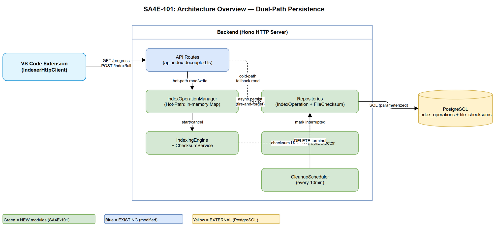
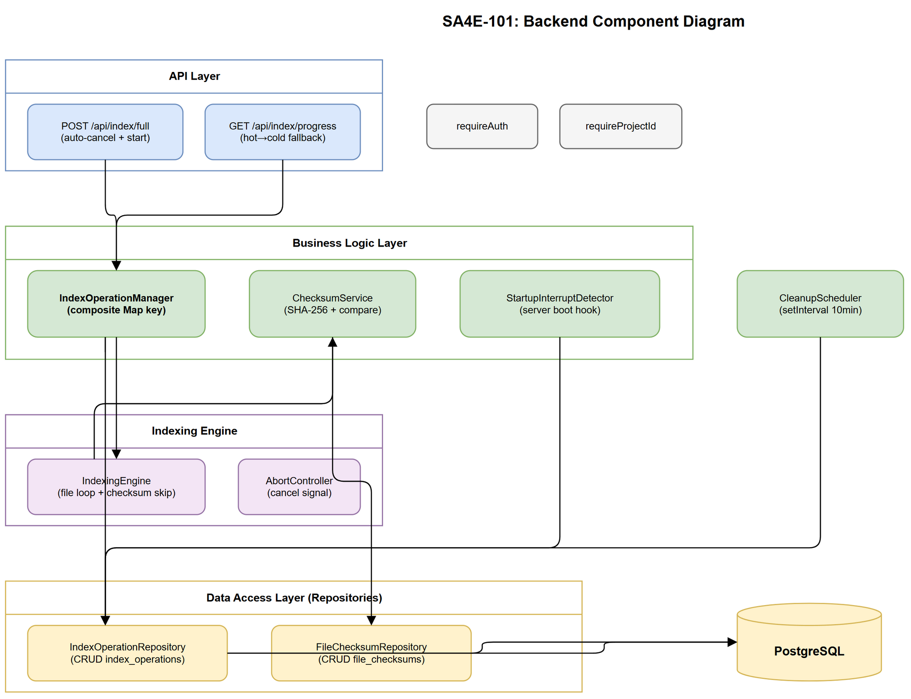

# Technical Design Document (TDD)

## SA4E-101: Persistent Multi-Tenant Index Status + Auto-Reconnect

---

## Document Information

| Field | Value |
|-------|-------|
| Jira Ticket | SA4E-101 |
| Title | Persistent Multi-Tenant Index Status + Auto-Reconnect |
| Author | SA Agent |
| Version | 1.0 |
| Date | 2026-08-11 |
| Status | Draft |
| Related FSD | documents/SA4E-101/FSD.md |
| Related BRD | documents/SA4E-101/BRD.md |

---

## 1. Architecture Overview

### 1.1 Design Philosophy — Dual-Path Model

The design introduces a **dual-path** persistence strategy:

- **Hot-Path (In-Memory):** The existing `IndexOperationManager` Map provides sub-millisecond access during active indexing sessions
- **Cold-Path (PostgreSQL):** New `index_operations` and `file_checksums` tables provide durability across backend restarts and multi-tenant isolation

On each batch boundary (~50 files), the backend writes state to BOTH paths. The progress API reads hot-path first (fast), falls back to cold-path if empty (post-restart scenario).

### 1.2 High-Level Architecture



### 1.3 Key Design Decisions

| Decision | Rationale |
|----------|-----------|
| Composite Map key `userId:projectId` | Multi-tenant isolation (BR-02) |
| Fire-and-forget async DB write | <10ms overhead (BR-10) |
| Batch pre-load checksums into Map | Amortized lookup cost <0.02ms/file |
| Partial unique index on PostgreSQL | Enforce one active op per tenant (BR-01) |
| Repository pattern for DB access | Testability, engine-agnostic (SQLite/PostgreSQL) |
| AbortController for cancel signal | Existing pattern, cooperative cancellation |

---

## 2. Module Design

### 2.1 IndexOperationRepository (NEW)

**Location:** `backend/src/database/repositories/IndexOperationRepository.ts`

**Responsibility:** PostgreSQL CRUD for `index_operations` table. Implements parameterized queries with tenant isolation.

**Interface:**

```typescript
export interface IIndexOperationRepository {
  create(op: IndexOperationRecord): Promise<void>;
  updateProgress(id: string, fields: ProgressUpdate): Promise<void>;
  updateStatus(id: string, status: OperationStatus): Promise<void>;
  findActive(userId: string, projectId: string): Promise<IndexOperationRecord | null>;
  findStaleRunning(thresholdSeconds: number): Promise<IndexOperationRecord[]>;
  deleteTerminalOlderThan(hours: number): Promise<number>;
}
```

### 2.2 FileChecksumRepository (NEW)

**Location:** `backend/src/database/repositories/FileChecksumRepository.ts`

**Responsibility:** PostgreSQL CRUD for `file_checksums` table. Supports batch pre-load and chunked deletion.

**Interface:**

```typescript
export interface IFileChecksumRepository {
  loadAll(userId: string, projectId: string): Promise<Map<string, string>>;
  upsert(record: FileChecksumRecord): Promise<void>;
  deleteNotIn(userId: string, projectId: string, currentPaths: string[]): Promise<number>;
  deleteAll(userId: string, projectId: string): Promise<number>;
}
```

### 2.3 IndexOperationManager (MODIFIED)

**Location:** `backend/src/engine/indexer/index-operation-manager.ts`

**Changes from current implementation:**

| Aspect | Current | SA4E-101 |
|--------|---------|----------|
| Map key | `projectId` | `${userId}:${projectId}` (composite) |
| Conflict handling | Return `null` (→ HTTP 409) | Auto-cancel + start new (BR-11) |
| Persistence | None (in-memory only) | Async DB write at batch boundary |
| Status types | `running/completed/cancelled/failed` | + `interrupted`, `superseded` |
| Cleanup | setTimeout 60s in-memory | DB: periodic job every 10min |
| Recovery | None | `hydrateFromDb()` on startup |

**New methods:**

```typescript
/** Auto-cancel existing op and start new (BR-11). */
startOrReplace(userId: string, projectId: string, scope: IndexScope): Promise<IndexOperation>;

/** Persist progress to cold-path (fire-and-forget). */
persistProgress(userId: string, projectId: string): void;

/** Load active operations from DB after restart. */
hydrateFromDb(): Promise<void>;
```

### 2.4 StartupInterruptDetector (NEW)

**Location:** `backend/src/engine/indexer/startup-interrupt-detector.ts`

**Responsibility:** Hook that runs during server initialization (before accepting HTTP requests). Queries `index_operations` for stale `running` records and marks them `interrupted`.

**Logic:**
1. Query: `SELECT id FROM index_operations WHERE status = 'running' AND updated_at < NOW() - INTERVAL '60 seconds'`
2. For each: `UPDATE status = 'interrupted'`
3. Log count
4. On DB error: log CRITICAL, continue startup (graceful degradation per EF-04)

### 2.5 CleanupScheduler (NEW)

**Location:** `backend/src/engine/indexer/cleanup-scheduler.ts`

**Responsibility:** Periodic timer (every 10 minutes) that deletes terminal records older than 1 hour (BR-05).

**Logic:**
```sql
DELETE FROM index_operations
WHERE status IN ('completed', 'cancelled', 'failed', 'superseded')
  AND updated_at < NOW() - INTERVAL '1 hour';
```

**Rules:** Never deletes `running` or `interrupted` records (BR-06).

### 2.6 ChecksumService (NEW)

**Location:** `backend/src/engine/indexer/checksum-service.ts`

**Responsibility:** SHA-256 computation + comparison logic for checksum-based skip (UC-07).

**Interface:**

```typescript
export interface IChecksumService {
  /** Compute SHA-256 hex digest of file content. */
  computeChecksum(content: Buffer): string;
  /** Pre-load all checksums for tenant into memory. */
  preloadChecksums(userId: string, projectId: string): Promise<Map<string, string>>;
  /** Compare computed vs stored, return skip decision. */
  shouldSkip(filePath: string, computed: string, stored: Map<string, string>): boolean;
  /** Cleanup checksums for deleted files (AF-13). */
  cleanupDeleted(userId: string, projectId: string, currentFiles: string[]): Promise<number>;
}
```

**Implementation notes:**
- Uses Node.js `crypto.createHash('sha256')` (native, ~100MB/s)
- Batch pre-load avoids N+1 queries during indexing loop
- Chunked deletion for projects >1000 files

### 2.7 API Route Changes

**Location:** `backend/src/server/routes/api-index-decoupled.ts`

| Endpoint | Current | SA4E-101 Change |
|----------|---------|-----------------|
| `POST /api/index/full` | Returns 409 on conflict | Auto-cancel + 200 with `cancelledPrevious` flag |
| `POST /api/index/full` | Returns 202 | Returns 200 (unified) |
| `GET /api/index/progress` | In-memory only | Hot-path first → cold-path fallback + `checksumStats` |

---

## 3. API Design

### 3.1 POST /api/index/full — Request/Response

**Zod Schema (Request validation):**

```typescript
import { z } from 'zod';

export const FullIndexRequestHeaders = z.object({
  authorization: z.string().startsWith('Bearer '),
  'x-project-id': z.string().min(1, 'X-Project-Id required'),
  'x-workspace-root': z.string().optional(),
});
```

**Response Schema:**

```typescript
export const FullIndexResponseSchema = z.object({
  operationId: z.string(),
  projectId: z.string(),
  status: z.literal('running'),
  message: z.string(),
  cancelledPrevious: z.boolean(),
  cancelledOperationId: z.string().optional(),
});
```

**Handler pseudocode (cancel & restart per BR-11):**

```typescript
async function handleFullIndex(c: Context): Promise<Response> {
  const userId = extractUserId(c);  // from JWT
  const projectId = requireProjectId(c.req.header('X-Project-Id'));

  const result = await manager.startOrReplace(userId, projectId, scope);

  return c.json({
    operationId: result.operationId,
    projectId,
    status: 'running',
    message: result.cancelledPrevious
      ? 'Previous operation cancelled, new index started'
      : 'Full index started',
    cancelledPrevious: result.cancelledPrevious,
    cancelledOperationId: result.cancelledOperationId,
  }, 200);
}
```

### 3.2 GET /api/index/progress — Response with ChecksumStats

**Zod Schema:**

```typescript
export const ChecksumStatsSchema = z.object({
  files_skipped: z.number().int().min(0),
  files_processed: z.number().int().min(0),
  files_pending: z.number().int().min(0),
}).nullable();

export const ProgressResponseSchema = z.object({
  operationId: z.string(),
  status: z.enum(['idle', 'running', 'interrupted', 'completed', 'cancelled', 'failed']),
  phase: z.enum(['idle', 'scanning', 'indexing', 'resolving', 'complete', 'cancelled', 'error']),
  current: z.number().int().min(0),
  total: z.number().int().min(0),
  percentage: z.number().int().min(0).max(100),
  currentFile: z.string().optional(),
  startedAt: z.string(),
  updatedAt: z.string().optional(),
  elapsedMs: z.number().min(0),
  checksumStats: ChecksumStatsSchema,
});
```

**Read path (hot → cold fallback):**

```typescript
async function handleProgress(c: Context): Promise<Response> {
  const userId = extractUserId(c);
  const projectId = requireProjectId(c.req.header('X-Project-Id'));
  const compositeKey = `${userId}:${projectId}`;

  // Hot-path: in-memory
  const hotOp = manager.getFromMemory(compositeKey);
  if (hotOp) return c.json(formatProgress(hotOp));

  // Cold-path: PostgreSQL
  const coldOp = await opRepo.findActive(userId, projectId);
  if (coldOp) return c.json(formatProgressFromDb(coldOp));

  // Idle
  return c.json({ operationId: '', status: 'idle', phase: 'idle',
    current: 0, total: 0, percentage: 0, startedAt: '', elapsedMs: 0,
    checksumStats: null });
}
```

---

## 4. Class/Interface Design

### 4.1 Extended Types

```typescript
// backend/src/engine/indexer/types.ts — EXTENDED
export type OperationStatus =
  | 'running' | 'interrupted' | 'completed'
  | 'cancelled' | 'failed' | 'superseded';

export type ProgressPhase =
  | 'idle' | 'scanning' | 'indexing'
  | 'resolving' | 'complete' | 'cancelled' | 'error';

export interface ChecksumStats {
  files_skipped: number;
  files_processed: number;
  files_pending: number;
}

export interface ProgressEvent {
  operationId: string;
  status: OperationStatus;
  phase: ProgressPhase;
  current: number;
  total: number;
  percentage: number;
  currentFile?: string;
  startedAt: string;
  updatedAt?: string;
  elapsedMs: number;
  checksumStats: ChecksumStats | null;
}
```

### 4.2 Database Record Interfaces

```typescript
// backend/src/database/models/index-operation.ts
export interface IndexOperationRecord {
  id: string;               // UUID
  user_id: string;          // from JWT
  project_id: string;       // from X-Project-Id
  status: OperationStatus;
  phase: string;
  current: number;
  total: number;
  current_file?: string;
  started_at: Date;
  updated_at: Date;
}

// backend/src/database/models/file-checksum.ts
export interface FileChecksumRecord {
  id: string;               // UUID
  user_id: string;
  project_id: string;
  file_path: string;
  file_checksum: string;    // SHA-256 hex (64 chars)
  last_indexed_at: Date;
}
```

### 4.3 Component Diagram



---

## 5. Database Migration Design

### 5.1 Migration: Create index_operations

```sql
-- Migration: 001_create_index_operations.sql
CREATE TABLE IF NOT EXISTS index_operations (
  id              UUID PRIMARY KEY,
  user_id         VARCHAR(255) NOT NULL,
  project_id      VARCHAR(255) NOT NULL,
  status          VARCHAR(20) NOT NULL DEFAULT 'running'
                  CHECK (status IN ('running','interrupted','completed','cancelled','failed','superseded')),
  phase           VARCHAR(20) NOT NULL DEFAULT 'scanning',
  current         INTEGER NOT NULL DEFAULT 0,
  total           INTEGER NOT NULL DEFAULT 0,
  current_file    TEXT,
  started_at      TIMESTAMP WITH TIME ZONE NOT NULL DEFAULT NOW(),
  updated_at      TIMESTAMP WITH TIME ZONE NOT NULL DEFAULT NOW()
);

-- Partial unique index: enforce one active op per tenant (BR-01)
CREATE UNIQUE INDEX idx_operations_active_tenant
  ON index_operations (user_id, project_id)
  WHERE status IN ('running', 'interrupted');

-- Index for cleanup queries (BR-05)
CREATE INDEX idx_operations_status_updated
  ON index_operations (status, updated_at);

-- Index for tenant lookup
CREATE INDEX idx_operations_tenant
  ON index_operations (user_id, project_id);
```

### 5.2 Migration: Create file_checksums

```sql
-- Migration: 002_create_file_checksums.sql
CREATE TABLE IF NOT EXISTS file_checksums (
  id              UUID PRIMARY KEY,
  user_id         VARCHAR(255) NOT NULL,
  project_id      VARCHAR(255) NOT NULL,
  file_path       TEXT NOT NULL,
  file_checksum   CHAR(64) NOT NULL,
  last_indexed_at TIMESTAMP WITH TIME ZONE NOT NULL DEFAULT NOW()
);

-- Unique constraint: one checksum per file per tenant
CREATE UNIQUE INDEX idx_checksums_tenant_file
  ON file_checksums (user_id, project_id, file_path);

-- Index for bulk tenant queries (pre-load, cleanup)
CREATE INDEX idx_checksums_tenant
  ON file_checksums (user_id, project_id);
```

### 5.3 Migration Strategy

- Use the existing `DatabaseAdapterFactory` and `MigrationService` pattern from SA4E-33
- Migrations run on server startup (before StartupInterruptDetector)
- Idempotent: `CREATE TABLE IF NOT EXISTS` + `CREATE INDEX IF NOT EXISTS` (PostgreSQL >=9.5)
- Rollback: `DROP TABLE IF EXISTS index_operations; DROP TABLE IF EXISTS file_checksums;`

---

## 6. Error Handling Strategy

### 6.1 Error Classification

| Category | Severity | Recovery | Example |
|----------|----------|----------|---------|
| DB write at batch boundary | Warning | Continue indexing (non-blocking) | Connection timeout during UPSERT |
| DB unreachable on startup | Critical | Log, skip interrupt detection, continue | PostgreSQL down during server boot |
| DB error during cancel | Critical | Return 503, do NOT start new op | Transaction failure on UPDATE |
| DB error during create new op | Error | Return 503 | INSERT fails |
| File unreadable (checksum) | Warning | Skip file, increment counter | Permission denied |
| DB error on checksum lookup | Error | Fall back to full processing | Connection pool exhausted |
| Abort timeout (5s) | Warning | Force-terminate engine | Engine not responding |

### 6.2 Error Propagation Rules

1. **Hot-path errors** (in-memory): Throw immediately — these indicate bugs
2. **Cold-path write errors**: Log + continue (fire-and-forget, non-blocking per BR-10)
3. **Cold-path read errors** (progress endpoint): Return HTTP 503
4. **Cancel-flow errors**: Return 503, preserve data integrity (no orphan running ops)

### 6.3 Graceful Degradation

If PostgreSQL is unreachable:
- Hot-path continues to function (indexing works, progress visible during session)
- Cold-path writes silently fail (logged at WARN level)
- Startup interrupt detection skips (logged at CRITICAL)
- Extension still sees progress from hot-path during active session
- After restart without DB: extension sees `idle` (acceptable degradation)

---

## 7. Security Design

### 7.1 Tenant Isolation

| Layer | Enforcement |
|-------|-------------|
| API | `requireAuth` middleware extracts userId from JWT |
| API | `requireProjectId` middleware validates X-Project-Id header |
| Repository | ALL queries include `WHERE user_id = :userId AND project_id = :projectId` |
| Hot-path | Composite key `${userId}:${projectId}` prevents cross-tenant access |

### 7.2 SQL Injection Prevention

All queries use **parameterized queries** (prepared statements). NO string interpolation in SQL.

```typescript
// CORRECT — parameterized
await pool.query(
  'SELECT * FROM index_operations WHERE user_id = $1 AND project_id = $2',
  [userId, projectId]
);

// FORBIDDEN — string interpolation
await pool.query(`SELECT * FROM index_operations WHERE user_id = '${userId}'`);
```

### 7.3 Input Validation

| Field | Validation | Zod Rule |
|-------|-----------|----------|
| userId | Non-empty string from JWT | `z.string().min(1)` |
| projectId | Non-empty string from header | `z.string().min(1)` |
| file_path | Relative path, no `..` traversal | `z.string().refine(noTraversal)` |
| file_checksum | Exactly 64 hex characters | `z.string().regex(/^[a-f0-9]{64}$/)` |
| status | Enum whitelist | `z.enum([...])` |

### 7.4 Rate Limiting

- Progress endpoint: existing `rateLimiter` middleware applies
- Full index endpoint: one active op per tenant enforced by partial unique index
- Cleanup job: internal, no external trigger surface

---

## 8. Implementation Checklist

Ordered tasks for DEV agent (dependencies top-down):

### Phase 1: Foundation (Database Layer)

| # | Task | File | Dependencies |
|---|------|------|--------------|
| 1 | Extend `OperationStatus` type | `backend/src/engine/indexer/types.ts` | None |
| 2 | Add `ChecksumStats` interface | `backend/src/engine/indexer/types.ts` | None |
| 3 | Create `IndexOperationRecord` model | `backend/src/database/models/index-operation.ts` | Task 1 |
| 4 | Create `FileChecksumRecord` model | `backend/src/database/models/file-checksum.ts` | None |
| 5 | Write migration `001_create_index_operations.sql` | `backend/src/database/migrations/` | None |
| 6 | Write migration `002_create_file_checksums.sql` | `backend/src/database/migrations/` | None |
| 7 | Implement `IndexOperationRepository` | `backend/src/database/repositories/IndexOperationRepository.ts` | Tasks 3, 5 |
| 8 | Implement `FileChecksumRepository` | `backend/src/database/repositories/FileChecksumRepository.ts` | Tasks 4, 6 |

### Phase 2: Core Logic

| # | Task | File | Dependencies |
|---|------|------|--------------|
| 9 | Implement `ChecksumService` | `backend/src/engine/indexer/checksum-service.ts` | Task 8 |
| 10 | Implement `StartupInterruptDetector` | `backend/src/engine/indexer/startup-interrupt-detector.ts` | Task 7 |
| 11 | Implement `CleanupScheduler` | `backend/src/engine/indexer/cleanup-scheduler.ts` | Task 7 |
| 12 | Modify `IndexOperationManager` — composite key + persistence | `backend/src/engine/indexer/index-operation-manager.ts` | Tasks 7, 9 |
| 13 | Add auto-cancel logic to `startOrReplace()` | `backend/src/engine/indexer/index-operation-manager.ts` | Task 12 |

### Phase 3: API Layer

| # | Task | File | Dependencies |
|---|------|------|--------------|
| 14 | Update `handleFullIndex` — auto-cancel + 200 response | `backend/src/server/routes/api-index-decoupled.ts` | Task 13 |
| 15 | Update `handleProgress` — hot/cold fallback + checksumStats | `backend/src/server/routes/api-index-decoupled.ts` | Task 12 |
| 16 | Add Zod schemas for request/response validation | `backend/src/server/routes/schemas/index-schemas.ts` | Tasks 1, 2 |
| 17 | Wire startup hook in `HttpServer.ts` | `backend/src/server/HttpServer.ts` | Task 10 |
| 18 | Wire cleanup scheduler in server lifecycle | `backend/src/server/HttpServer.ts` | Task 11 |

### Phase 4: Indexing Engine Integration

| # | Task | File | Dependencies |
|---|------|------|--------------|
| 19 | Integrate `ChecksumService` into indexing loop | `backend/src/engine/indexer/indexing-engine.ts` | Task 9 |
| 20 | Add checksum stats tracking to progress events | `backend/src/engine/indexer/indexing-engine.ts` | Task 19 |
| 21 | Add deleted file cleanup (AF-13) post-indexing | `backend/src/engine/indexer/indexing-engine.ts` | Task 9 |

### Phase 5: Extension Changes (minimal)

| # | Task | File | Dependencies |
|---|------|------|--------------|
| 22 | Update `IndexerHttpClient` progress model — add `checksumStats` | `extension/src/services/IndexerHttpClient.ts` | Task 15 |
| 23 | Handle `interrupted` status in status bar display | `extension/src/` (status bar module) | Task 22 |
| 24 | Remove 409 handling — now gets 200 with `cancelledPrevious` | `extension/src/services/IndexerHttpClient.ts` | Task 14 |

---

## 9. Performance Budget

| Operation | Target | Method |
|-----------|--------|--------|
| Hot-path read (Map.get) | <1ms | Direct lookup by composite key |
| Cold-path read (DB query) | <10ms | Indexed query by (user_id, project_id) |
| Batch boundary DB write | <10ms | Async UPSERT, non-blocking |
| SHA-256 per file (10KB avg) | <0.5ms | Native `crypto.createHash` |
| Checksum batch pre-load (500 files) | <10ms | Single SELECT |
| Cancel + restart total latency | <5.1s worst, <100ms typical | AbortController + batch boundary check |
| Progress endpoint E2E | <50ms | Auth + query + serialize |

---

## 10. Discrepancy Analysis (FSD ↔ Codebase)

| # | FSD States | Codebase Current | Resolution |
|---|-----------|-----------------|------------|
| 1 | Phase `finalizing` mentioned in FSD §4.1 | Codebase uses `resolving` | Keep `resolving` (FSD §14.3 confirms) |
| 2 | POST returns HTTP 200 | Codebase returns HTTP 202 | Change to 200 per FSD §12.1 |
| 3 | POST conflict → auto-cancel | Codebase returns 409 | Rewrite per BR-11 |
| 4 | Map key: `userId:projectId` | Currently: `projectId` only | Change to composite |
| 5 | DB persistence | Not implemented | New implementation |
| 6 | `interrupted` + `superseded` statuses | Not in current OperationStatus | Extend type |

All discrepancies are additive (new features) or changes explicitly mandated by FSD. No conflicting requirements found — DISCREPANCY.md not needed.

---

## 11. Appendix

### Diagram Index

| # | Diagram | Image | Source (editable) |
|---|---------|-------|-------------------|
| 1 | Architecture Overview | [architecture.png](diagrams/architecture.png) | [architecture.drawio](diagrams/architecture.drawio) |
| 2 | Component Diagram | [component.png](diagrams/component.png) | [component.drawio](diagrams/component.drawio) |
