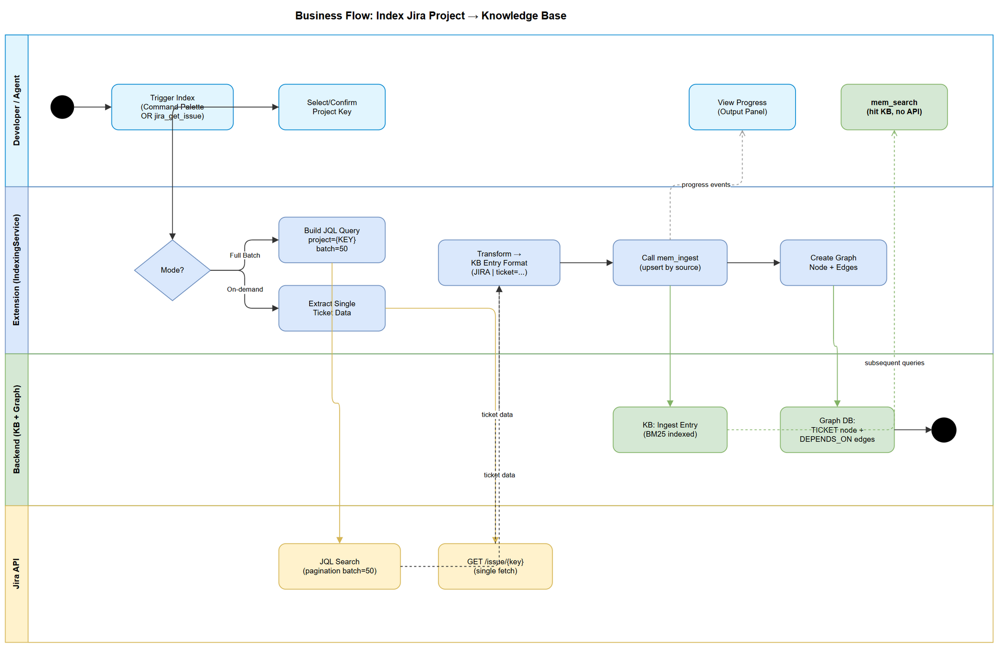
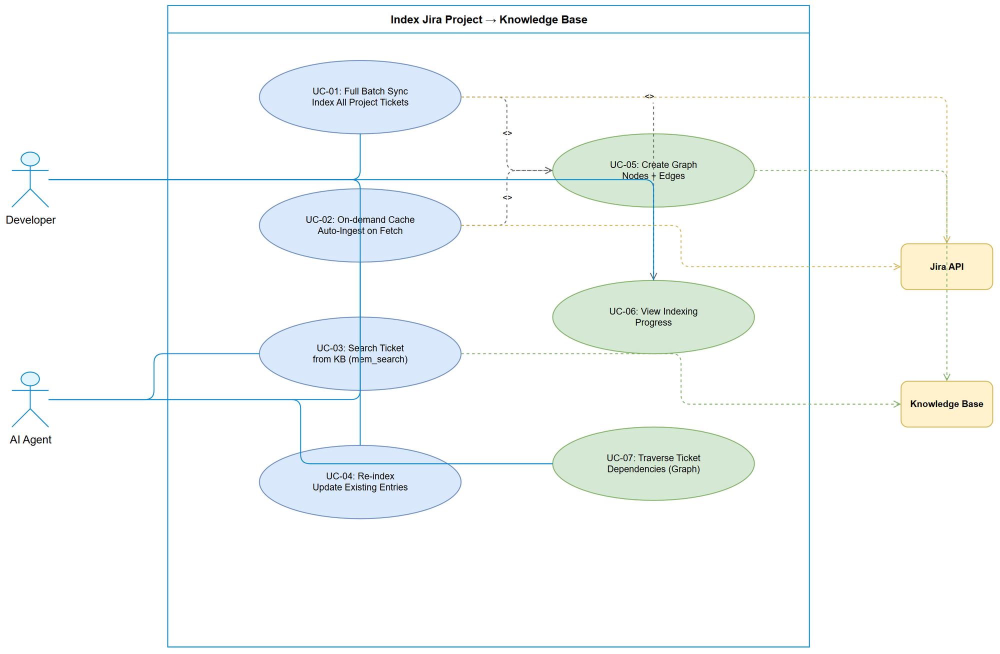

# Business Requirements Document (BRD)

## SDLC-Agents-4-Enterprise — SA4E-102: Index Jira Project → Knowledge Base

---

## Document Information

| Field | Value |
|-------|-------|
| Jira Ticket | SA4E-102 |
| Title | Index Jira Project → Knowledge Base |
| Author | BA Agent |
| Version | 1.0 |
| Date | 2026-08-11 |
| Status | Draft |

---

## Author Tracking

| Role | Name - Position | Responsibility |
|------|-----------------|----------------|
| Author | BA Agent – Business Analyst | Create document |
| Peer Reviewer | TA Agent – Technical Architect | Review document |

---

## Revision History

| Version | Date | Author | Changes |
|---------|------|--------|---------|
| 1.0 | 2026-08-11 | BA Agent | Initiate document — auto-generated from Jira ticket SA4E-102 |

---

## Sign-Off

| Name | Signature and date |
|------|--------------------|
| | ☐ I agree and confirm all criteria on this BRD as expected requirements |
| | ☐ I agree and confirm all criteria on this BRD as expected requirements |

---

## 1. Introduction

### 1.1 Scope

Thêm option thứ 4 "Index Jira Project" vào hệ thống indexing hiện tại của extension, cho phép đồng bộ Jira tickets vào Knowledge Base (KB). Feature này giải quyết vấn đề agents phải gọi Jira API real-time mỗi khi cần ticket info — gây chậm và bị rate-limited.

Feature hỗ trợ 2 trigger modes:
1. **Full Batch Sync** — User-triggered bulk fetch tất cả tickets trong project
2. **On-demand Cache** — Auto-ingest khi agent gọi `jira_get_issue`

### 1.2 Out of Scope

- Webhook-based real-time sync (Jira webhooks push changes)
- Attachment indexing (PDF, images trong Jira tickets)
- Custom field indexing ngoài các fields chuẩn
- Cross-project ticket linking
- Jira board/sprint management features

### 1.3 Preliminary Requirement

- Jira credentials đã được cấu hình trong extension settings (Atlassian MCP server connected)
- Backend MCP server đang chạy (port 48721 default) với `mem_ingest` tool available
- Knowledge Base (SQLite) đã khởi tạo thành công
- Graph DB đang hoạt động cho node/edge creation

---

## 2. Business Requirements

### 2.1 High Level Process Map

Hệ thống hiện tại có 3 index options (Source Code, Documents, Sync Code→Memory). Feature mới thêm option "Index Jira Project" cho phép:

1. User chọn "Index Jira Project" từ Quick Pick menu
2. System fetch tickets từ Jira qua JQL (batch 50)
3. Mỗi ticket được transform thành KB entry format chuẩn
4. KB entries được ingest vào Knowledge Base
5. Graph nodes + edges được tạo cho ticket relationships
6. Subsequent `mem_search` queries hit KB thay vì Jira API



### 2.2 List of User Stories / Use Cases

| # | Story / Use Case / Epic | Priority | Source Ticket |
|---|-------------------------|----------|---------------|
| 1 | As a developer, I want to index all Jira tickets in my project so that agents can search ticket info without API calls | MUST HAVE | SA4E-102 |
| 2 | As an agent, I want ticket info auto-cached to KB when I fetch it so that subsequent searches are instant | MUST HAVE | SA4E-102 |
| 3 | As a developer, I want re-indexing to update existing entries (not duplicate) so that KB stays clean | MUST HAVE | SA4E-102 |
| 4 | As an agent, I want graph nodes for tickets with dependency edges so that I can traverse relationships | SHOULD HAVE | SA4E-102 |
| 5 | As a developer, I want to see indexing progress in the Output panel so that I know what's happening | SHOULD HAVE | SA4E-102 |

---

### 2.3 Details of User Stories

---

#### Business Flow

**Step 1:** User opens Command Palette → "SDLC: Index Workspace"

**Step 2:** Quick Pick menu hiển thị 4+ options, user chọn "Index Jira Project"

**Step 3:** System prompt user nhập Jira Project Key (hoặc auto-detect từ `jira.conf`)

**Step 4:** System thực hiện JQL query `project={KEY} ORDER BY updated DESC` với pagination (batch 50)

**Step 5:** Mỗi ticket được transform thành KB entry format chuẩn

**Step 6:** Entries được ingest vào KB qua `mem_ingest` MCP tool

**Step 7:** Graph nodes (TICKET type) được tạo, edges (DEPENDS_ON, IMPLEMENTS) được thiết lập

**Step 8:** Output panel hiển thị summary: "✅ Indexed {N} tickets from {PROJECT}"

> **Note:** On-demand mode chạy transparently — khi agent gọi `jira_get_issue`, result tự động ingest vào KB song song với response.

---

#### STORY 1: Full Batch Sync — Index All Project Tickets

> As a developer, I want to index all Jira tickets in my project so that agents can search ticket info without API calls.

**Requirement Details:**

1. Thêm option "$(issue-opened) Index Jira Project" vào `showIndexOptions()` Quick Pick menu
2. Khi selected, prompt user cho Project Key (pre-fill từ `jira.conf` nếu có)
3. Thực hiện JQL query: `project={KEY} ORDER BY updated DESC`
4. Fetch theo batch 50 tickets (Jira REST API pagination: `startAt`, `maxResults`)
5. Mỗi ticket extract: Summary, Description, Acceptance Criteria, Comments (latest 10), Labels, Components, Sprint, Status, Priority, Assignee, Linked Issues
6. Transform thành KB entry format (xem Data Fields)
7. Ingest từng batch vào KB qua backend `mem_ingest` tool
8. Tạo graph node cho mỗi ticket + edges cho linked issues
9. Hiển thị progress và summary trong Output panel

**Data Fields:**

| Field | Type | Required | Description | Example |
|-------|------|----------|-------------|---------|
| ticket_key | string | Yes | Jira issue key | SA4E-102 |
| summary | string | Yes | Ticket summary/title | Index Jira Project → KB |
| description | string | No | Full description text | Feature description... |
| acceptance_criteria | string | No | AC extracted from description | Given/When/Then... |
| status | string | Yes | Current Jira status | In Progress |
| priority | string | Yes | Priority level | High |
| assignee | string | No | Assigned person | john.doe |
| labels | string[] | No | Ticket labels | ["backend", "kb"] |
| components | string[] | No | Jira components | ["extension", "indexer"] |
| sprint | string | No | Current sprint name | Sprint 15 |
| comments | string[] | No | Latest 10 comments | ["Comment text..."] |
| linked_issues | object[] | No | Linked ticket keys + type | [{"key":"SA4E-100","type":"blocks"}] |

**KB Entry Format:**

```
JIRA | ticket={KEY} | summary={SUMMARY} | status={STATUS} | priority={PRIORITY}
Description: {DESCRIPTION}
Acceptance Criteria: {AC}
Labels: {LABELS}
Components: {COMPONENTS}
Sprint: {SPRINT}
Assignee: {ASSIGNEE}
Comments (latest):
- {COMMENT_1}
- {COMMENT_2}
Linked Issues: {LINKED_ISSUES}
```

**Acceptance Criteria:**

1. "Index Jira Project" command visible trong Quick Pick menu khi user triggers indexing
2. System fetches ALL tickets from specified Jira project via JQL pagination
3. Mỗi ticket ingested vào KB với format chuẩn (JIRA | ticket=... | ...)
4. `mem_search("SA4E-102")` trả về ticket info mà KHÔNG gọi Jira API
5. Progress bar + Output panel hiển thị tiến trình indexing
6. Batch size 50, xử lý tuần tự để tránh rate-limit
7. Error handling: nếu 1 batch fail → log error, continue với batch tiếp theo

---

#### STORY 2: On-demand Cache — Auto-Ingest on Fetch

> As an agent, I want ticket info auto-cached to KB when I fetch it so that subsequent searches are instant.

**Requirement Details:**

1. Khi agent gọi `jira_get_issue(issue_key)` tool, sau khi trả result cho agent:
2. System tự động ingest ticket data vào KB (fire-and-forget, không block response)
3. Subsequent `mem_search` cho cùng ticket key → hit KB entry
4. Nếu KB đã có entry cho ticket → update (upsert), không duplicate
5. On-demand ingest dùng cùng KB entry format như Full Batch Sync

**Acceptance Criteria:**

1. Agent gọi `jira_get_issue("SA4E-100")` → nhận result ngay lập tức
2. Ngay sau đó, `mem_search("SA4E-100")` trả về ticket info từ KB
3. Gọi `jira_get_issue` lần 2 cho cùng ticket → KB entry updated (not duplicated)
4. On-demand ingest không block/slow down `jira_get_issue` response time
5. On-demand ingest failure → log warning, không affect main flow

---

#### STORY 3: Upsert — Re-index Updates Existing Entries

> As a developer, I want re-indexing to update existing entries (not duplicate) so that KB stays clean.

**Requirement Details:**

1. Mỗi KB entry có unique identifier = `jira/{PROJECT}/{TICKET_KEY}`
2. Khi re-index (Full Batch hoặc On-demand), system check existing entry by source
3. Nếu entry đã tồn tại → update content (upsert semantic)
4. Nếu entry chưa tồn tại → create new
5. KB không bao giờ có 2 entries cho cùng 1 ticket

**Acceptance Criteria:**

1. Full Batch Sync chạy 2 lần → KB vẫn chỉ có 1 entry per ticket
2. Ticket status thay đổi trên Jira → re-index cập nhật entry trong KB
3. `mem_search` cho 1 ticket key luôn trả về max 1 result (latest version)
4. Source field = `jira/{PROJECT}/{TICKET_KEY}` dùng làm upsert key

---

#### STORY 4: Graph Integration — Ticket Nodes & Dependency Edges

> As an agent, I want graph nodes for tickets with dependency edges so that I can traverse relationships.

**Requirement Details:**

1. Mỗi ticket indexed → tạo 1 graph node type `TICKET`
2. Node label = `{TICKET_KEY}: {SUMMARY}`
3. Node metadata: status, priority, assignee
4. Linked issues → tạo edges:
   - "blocks" / "is blocked by" → DEPENDS_ON edge
   - "relates to" → RELATES_TO edge
   - "implements" (ticket→code ref) → IMPLEMENTS edge
5. Edges bidirectional where applicable
6. Graph query: `mem_graph(action: "neighbors", node_id: {ticket_node_id})` trả về linked tickets

**Acceptance Criteria:**

1. Mỗi indexed ticket có corresponding graph node (type=TICKET)
2. Linked issues tạo correct edge types (DEPENDS_ON, RELATES_TO, IMPLEMENTS)
3. `mem_graph(action: "neighbors")` cho 1 ticket node → trả về linked tickets
4. Re-index không duplicate graph nodes (upsert by ticket key)
5. Graph traversal cho phép agent hiểu ticket dependency chain

---

#### STORY 5: Indexing Progress & Feedback

> As a developer, I want to see indexing progress in the Output panel so that I know what's happening.

**Requirement Details:**

1. Output channel "SDLC Indexing" hiển thị progress log
2. Progress notification bar hiển thị "Indexing Jira tickets... {N}/{total}"
3. Per-batch log: "Fetched batch {batchNum}: {startAt}-{endAt} of {total}"
4. Per-ticket log (verbose): "Ingested: {TICKET_KEY} — {summary}"
5. Summary cuối: "✅ Jira Project Indexing Complete: {ingested} tickets, {errors} errors, {graphs} graph nodes"
6. Error log: "⚠️ Failed to ingest {TICKET_KEY}: {error_message}"

**Acceptance Criteria:**

1. Output panel hiển thị real-time progress khi indexing chạy
2. Notification bar hiển thị progress percentage
3. Summary cuối cùng chính xác (correct counts)
4. Errors logged nhưng không stop indexing flow

---

## 3. Dependencies

| Dependency | Type | Related Ticket | Description |
|------------|------|----------------|-------------|
| Atlassian MCP Server | External | N/A | Provides `jira_get_issue`, `jira_search` tools for fetching ticket data |
| Backend MCP Server | System | N/A | Provides `mem_ingest`, `mem_search`, `mem_graph` tools for KB operations |
| KB SQLite Database | Infrastructure | N/A | Storage for ingested ticket entries (BM25 search) |
| Graph Database | Infrastructure | N/A | Storage for TICKET nodes and relationship edges |
| Existing IndexingService | System | N/A | `extension/src/services/IndexingService.ts` — orchestrator to extend |
| IndexerHttpClient | System | N/A | `extension/src/services/IndexerHttpClient.ts` — HTTP client for backend |
| jira.conf | System | N/A | Optional project key auto-detection |

---

## 4. Stakeholders

| Role | Name / Team | Responsibility | Source |
|------|-------------|----------------|--------|
| Developer | Extension Users | End user — triggers indexing, benefits from fast search | Primary stakeholder |
| AI Agents | BA/SA/QA/DEV agents | Consumer — uses `mem_search` to find ticket info | Primary consumer |
| Extension Dev Team | Dev Agent | Implements the feature | Implementor |
| SA | SA Agent | Designs technical architecture | Architect |

---

## 5. Risks and Assumptions

### 5.1 Risks

| Risk | Impact | Likelihood | Mitigation |
|------|--------|------------|------------|
| Jira API rate limiting during large project sync | High | Medium | Batch size 50, sequential processing, configurable delay between batches |
| Large projects (>1000 tickets) may timeout | Medium | Low | Pagination + progress tracking, resume-capable design |
| KB storage growth with many tickets | Low | Medium | Ticket entries are text-only (small), monitor DB size |
| Stale data if Jira tickets updated after indexing | Medium | High | Re-index command + on-demand cache refresh per-ticket |
| Atlassian MCP server unavailable | High | Low | Graceful error handling, inform user to check connection |

### 5.2 Assumptions

- Jira credentials (API token or OAuth) already configured in extension settings
- Atlassian MCP server is connected and operational
- Backend MCP server running with `mem_ingest` tool available
- User has read access to the Jira project being indexed
- JQL queries are supported by the Jira instance (Cloud or Server)
- `jira_search` tool supports pagination parameters (`startAt`, `maxResults`)

---

## 6. Non-Functional Requirements

| Category | Requirement | Details |
|----------|-------------|---------|
| Performance | Batch indexing ≤ 2 seconds per batch of 50 tickets | Network latency + KB ingest time |
| Performance | On-demand cache ingest < 500ms (async, non-blocking) | Fire-and-forget after response |
| Performance | `mem_search` response < 100ms for cached tickets | BM25 search on local SQLite |
| Scalability | Support projects with up to 5000 tickets | Pagination handles any project size |
| Reliability | Partial failure tolerance — 1 ticket failure doesn't stop batch | Log error, continue processing |
| Availability | Feature available when backend + Atlassian MCP are running | Graceful degradation if services down |
| Data Freshness | On-demand always returns latest from Jira | Batch may be stale until re-index |
| Storage | KB entry size ~2KB per ticket average | 5000 tickets ≈ 10MB storage |

---

## 7. Related Tickets

| Ticket Key | Summary | Status | Type | Relationship |
|------------|---------|--------|------|--------------|
| SA4E-102 | Index Jira Project → Knowledge Base | To Do | Story | Main ticket |

---

## 8. Appendix

### Use Case Diagram



### Glossary

| Term | Definition |
|------|------------|
| KB | Knowledge Base — local SQLite database storing indexed content for BM25 search |
| Graph DB | Graph database storing nodes (entities) and edges (relationships) |
| mem_ingest | MCP tool on backend for ingesting content into KB |
| mem_search | MCP tool on backend for searching KB entries |
| mem_graph | MCP tool for managing graph nodes and edges |
| JQL | Jira Query Language — used to search/filter Jira tickets |
| Batch Sync | Full synchronization of all project tickets into KB |
| On-demand Cache | Automatic caching of individual ticket data upon fetch |
| Upsert | Update if exists, insert if not — prevents duplicates |

### Reference Documents

| Document | Link / Location |
|----------|-----------------|
| Existing IndexingService | extension/src/services/IndexingService.ts |
| IndexerHttpClient | extension/src/services/IndexerHttpClient.ts |
| Indexer entry point | extension/src/indexer.ts |
| MCP mem_ingest spec | Backend MCP tool definition |

### Diagram Index

| # | Diagram | Image | Source (editable) |
|---|---------|-------|-------------------|
| 1 | Business Flow | [business-flow.png](diagrams/business-flow.png) | [business-flow.drawio](diagrams/business-flow.drawio) |
| 2 | Use Case | [use-case.png](diagrams/use-case.png) | [use-case.drawio](diagrams/use-case.drawio) |
