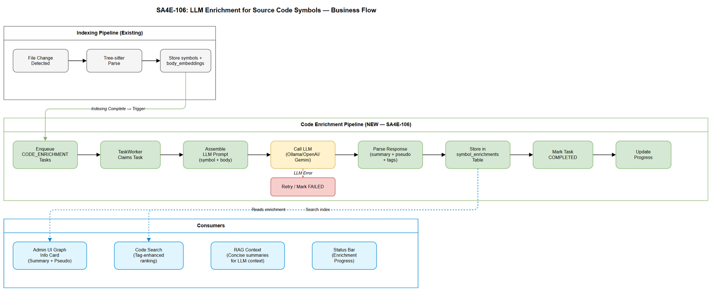

# Business Requirements Document (BRD)

## SA4E — SA4E-106: LLM Enrichment cho Source Code Symbols (Summary, Pseudo Code, Tags)

---

## Document Information

| Field | Value |
|-------|-------|
| Jira Ticket | SA4E-106 |
| Title | LLM Enrichment cho Source Code Symbols (Summary, Pseudo Code, Tags) |
| Author | BA Agent |
| Version | 1.0 |
| Date | 2025-07-22 |
| Status | Draft |

---

## Author Tracking

| Role | Name - Position | Responsibility |
|------|-----------------|----------------|
| Author | BA Agent – Business Analyst | Create document |
| Peer Reviewer | TA Agent – Technical Architect | Review document |

---

## Revision History

| Version | Date | Author | Changes |
|---------|------|--------|---------|
| 1.0 | 2025-07-22 | BA Agent | Initiate document — auto-generated from Jira ticket SA4E-106 |

---

## Sign-Off

| Name | Signature and date |
|------|--------------------|
| | ☐ I agree and confirm all criteria on this BRD as expected requirements |
| | ☐ I agree and confirm all criteria on this BRD as expected requirements |

---

## 1. Introduction

### 1.1 Scope

Feature SA4E-106 mở rộng LLM enrichment pipeline hiện tại (chỉ áp dụng cho KB document entries) sang **source code symbols** (functions, classes, interfaces, enums). Sau khi tree-sitter indexing hoàn thành, hệ thống sẽ tự động gọi LLM để generate:

1. **Summary** — 1-2 câu mô tả mục đích/chức năng của mỗi symbol
2. **Pseudo code** — Structured pseudo code cho function bodies (non-Pega)
3. **Enhanced pseudo code** — LLM bổ sung cho Pega rules (đã có rule-based normalizer)
4. **Semantic tags** — Extract tags mô tả domain/responsibility của symbol

Kết quả enrichment phục vụ:
- Admin UI graph: hiển thị summary + pseudo code trong function info card
- Code search: cải thiện ranking bằng semantic tags
- RAG context: cung cấp concise summaries thay vì raw source code

### 1.2 Out of Scope

- Thay đổi tree-sitter parser logic (indexing vẫn hoạt động như hiện tại)
- Thay đổi cách generate embeddings cho `body_embeddings` table
- Real-time / synchronous LLM enrichment (luôn async via task queue)
- Enrichment cho file-level metadata (chỉ symbol-level)
- Auto-refactoring hoặc code suggestion dựa trên enrichment

### 1.3 Preliminary Requirement

| Prerequisite | Status |
|---|---|
| LLMService multi-provider (Ollama/OpenAI/Gemini) | ✅ Available |
| TaskWorker polling architecture | ✅ Available (TAG_ENRICHMENT + VECTOR_EMBEDDING) |
| Tree-sitter indexing pipeline | ✅ Available |
| `symbols` table với full schema | ✅ Available |
| `body_embeddings` table lưu raw function body | ✅ Available |
| PegaLogicNormalizer (rule-based pseudo code) | ✅ Available |
| Admin UI graph node click → SymbolDetail | ✅ Available |

---

## 2. Business Requirements

### 2.1 High Level Process Map

Hệ thống hiện tại có 2 pipeline song song:
1. **Document Enrichment** — `mem_ingest → pending_task (TAG_ENRICHMENT) → TaskWorker → LLM → update knowledge_entries`
2. **Code Indexing** — `file change → tree-sitter parse → symbols + body_embeddings → DONE (no LLM)`

SA4E-106 bổ sung pipeline thứ 3:
3. **Code Symbol Enrichment** — `indexing complete → enqueue CODE_ENRICHMENT tasks → TaskWorker → LLM → store enrichment data`

### 2.2 List of User Stories / Use Cases

| # | Story / Use Case | Priority | Source Ticket |
|---|------------------|----------|---------------|
| 1 | As a developer, I want to see a concise summary of each function/class in the Admin UI graph so that I can quickly understand what it does without reading source code | MUST HAVE | SA4E-106 |
| 2 | As a developer, I want structured pseudo code for function bodies so that I can understand complex logic at a glance | MUST HAVE | SA4E-106 |
| 3 | As a developer, I want LLM-enhanced pseudo code for Pega rules so that I get better explanations than rule-based normalizer alone | SHOULD HAVE | SA4E-106 |
| 4 | As a developer, I want semantic tags extracted from source code symbols so that code search returns more relevant results | MUST HAVE | SA4E-106 |
| 5 | As an admin, I want to see enrichment progress in the status bar so that I know when the system is processing symbols | SHOULD HAVE | SA4E-106 |
| 6 | As an admin, I want to configure enrichment behavior (enable/disable, batch size, priority kinds) so that I can control resource usage | COULD HAVE | SA4E-106 |

---

### 2.3 Details of User Stories

---

#### Business Flow

**Step 1:** Tree-sitter indexing parses source files and populates `symbols` + `body_embeddings` tables

**Step 2:** After indexing batch completes, system enqueues `CODE_ENRICHMENT` tasks for each eligible symbol (functions, classes, interfaces, enums)

**Step 3:** TaskWorker picks up CODE_ENRICHMENT tasks in FIFO order with configurable concurrency

**Step 4:** For each symbol, TaskWorker assembles LLM prompt with symbol metadata (name, kind, signature, body, doc_comment, file context)

**Step 5:** LLM generates enrichment response: summary + pseudo code (if function) + semantic tags

**Step 6:** System persists enrichment data to `symbol_enrichments` table

**Step 7:** Admin UI graph fetches enrichment data when user clicks a node → displays summary + pseudo code in info card

**Step 8:** Code search incorporates semantic tags for improved ranking

> **Note:** Enrichment is fully asynchronous. Users see "Enriching..." status until LLM processing completes. Already-enriched symbols are skipped on re-index (idempotent).

---

#### STORY 1: Symbol Summary Generation

> As a developer, I want to see a concise summary of each function/class in the Admin UI graph so that I can quickly understand what it does without reading source code.

**Requirement Details:**

1. LLM generates 1-2 sentence English summary for each symbol (Class, Function, Interface, Enum)
2. Summary captures the **purpose** and **responsibility** of the symbol
3. Summary length: 50-200 characters (hard limit 300)
4. Summary is stored persistently — not regenerated on every request
5. Summary appears in Admin UI graph info card below signature

**Data Fields:**

| Field | Type | Required | Description | Example |
|-------|------|----------|-------------|---------|
| symbol_id | INTEGER | Yes | FK to symbols.id | 42 |
| summary | TEXT | Yes | LLM-generated summary | "Validates JWT token claims and extracts workspace ID for multi-tenant auth" |
| enriched_at | TIMESTAMP | Yes | When enrichment completed | 2025-07-22T10:00:00Z |
| enriched_by | TEXT | Yes | LLM model used | "qwen2.5:7b-instruct" |

**Acceptance Criteria:**

1. After indexing completes, all eligible symbols have enrichment tasks enqueued
2. TaskWorker processes CODE_ENRICHMENT tasks and stores summary in DB
3. Admin UI graph info card displays summary when clicking a symbol node
4. Summary is idempotent — re-indexing same symbol does not re-enrich if content unchanged
5. If LLM unavailable → task retries with exponential backoff (max 3 retries, same as existing TAG_ENRICHMENT)

**Validation Rules:**

- Summary must not exceed 300 characters
- Summary must not be empty or placeholder text
- Summary must be in English regardless of source code language

---

#### STORY 2: Pseudo Code Generation (Non-Pega)

> As a developer, I want structured pseudo code for function bodies so that I can understand complex logic at a glance.

**Requirement Details:**

1. LLM generates structured pseudo code from raw function body text
2. Pseudo code uses consistent format: numbered steps, indented blocks for conditionals/loops
3. Only applies to symbols of kind `function` or `method` that have body text in `body_embeddings`
4. Pseudo code replaces raw body display in Admin UI info card
5. Pseudo code preserves logical structure without implementation details (variable names simplified, library calls abstracted)

**Data Fields:**

| Field | Type | Required | Description | Example |
|-------|------|----------|-------------|---------|
| symbol_id | INTEGER | Yes | FK to symbols.id | 42 |
| pseudo_code | TEXT | No | Structured pseudo code | "1. Validate input token\n2. Decode JWT claims\n3. IF expired → throw AuthError\n4. Extract workspace_id\n5. Return auth context" |

**Acceptance Criteria:**

1. Functions with body text > 3 lines get pseudo code generated
2. Pseudo code follows consistent numbered-step format
3. Admin UI info card shows pseudo code tab/section
4. Pseudo code length proportional to function complexity (min 3 steps, max 20 steps)
5. If function body is trivial (≤ 3 lines), pseudo code = null (not generated)

**Validation Rules:**

- Pseudo code must not exceed 2000 characters
- Pseudo code must be structured (numbered steps or indented blocks)
- Must not include raw code syntax — abstract to logic description

---

#### STORY 3: LLM-Enhanced Pseudo Code for Pega Rules

> As a developer, I want LLM-enhanced pseudo code for Pega rules so that I get better explanations than rule-based normalizer alone.

**Requirement Details:**

1. Pega rules already have rule-based pseudo code via `PegaLogicNormalizer` (Activity, Data Transform)
2. LLM takes the existing rule-based output as INPUT and generates enhanced version
3. Enhancement adds: natural language explanations for each step, business intent clarification, edge case notes
4. Original rule-based output is preserved as fallback
5. Applies to: Activity rules, Data Transform rules, Decision Table rules, Flow rules

**Data Fields:**

| Field | Type | Required | Description | Example |
|-------|------|----------|-------------|---------|
| symbol_id | INTEGER | Yes | FK to symbols.id | 150 |
| pseudo_code_raw | TEXT | No | Original rule-based normalizer output | "STEP 1: Call-Method .pyWorkPage.RunActivity..." |
| pseudo_code_enhanced | TEXT | No | LLM-enhanced version | "1. Execute claim validation activity on work object\n   → Checks required fields, validates dates\n2. IF validation passes → set status to 'Ready'" |

**Acceptance Criteria:**

1. Pega symbols with existing logicSummary from PegaLogicNormalizer are eligible
2. LLM prompt includes: rule-based output + Pega class context + rule type
3. Enhanced output is stored separately — does not overwrite rule-based output
4. Admin UI shows enhanced version by default, with toggle to see raw normalizer output
5. If LLM enhancement fails → system falls back to rule-based output silently

**Validation Rules:**

- Enhanced output must be MORE readable than raw normalizer output
- Must preserve all logical steps from original (no information loss)
- Enhancement must not hallucinate non-existent steps

---

#### STORY 4: Semantic Tag Extraction for Source Code Symbols

> As a developer, I want semantic tags extracted from source code symbols so that code search returns more relevant results.

**Requirement Details:**

1. LLM extracts 3-8 semantic tags per symbol based on its purpose, domain, and patterns used
2. Tags are domain-specific (e.g., "authentication", "database", "validation", "caching") not generic (e.g., "code", "function")
3. Tags are stored and indexed for search enhancement
4. Tags appear in Admin UI info card and are searchable via code_search tool

**Data Fields:**

| Field | Type | Required | Description | Example |
|-------|------|----------|-------------|---------|
| symbol_id | INTEGER | Yes | FK to symbols.id | 42 |
| tags | TEXT | Yes | Comma-separated semantic tags | "jwt,authentication,multi-tenant,middleware,validation" |

**Acceptance Criteria:**

1. Each enriched symbol has 3-8 semantic tags
2. Tags are lowercase, hyphen-separated if multi-word (e.g., "error-handling")
3. Code search tool incorporates tags for improved relevance scoring
4. Admin UI info card displays tags as badges/chips
5. Tags are consistent across similar symbols (same domain concept → same tag)

**Validation Rules:**

- Minimum 3 tags per symbol, maximum 8
- Each tag: 2-30 characters, lowercase, alphanumeric + hyphen only
- No duplicate tags per symbol
- No generic tags: "code", "function", "class", "method" are forbidden

---

#### STORY 5: Enrichment Progress Tracking

> As an admin, I want to see enrichment progress in the status bar so that I know when the system is processing symbols.

**Requirement Details:**

1. Extend existing TaskWorker progress API (`/api/admin/taskworker/progress`) to include CODE_ENRICHMENT
2. Status bar shows: "Enriching symbols: {current}/{total} ({percent}%)"
3. Progress updates during processing cycle

**Acceptance Criteria:**

1. Extension status bar shows CODE_ENRICHMENT progress alongside existing TAG_ENRICHMENT
2. Progress goes from 0% to 100% as symbols are processed
3. When complete, status bar returns to idle state
4. Large repos (>1000 symbols) show meaningful progress without flooding

---

#### STORY 6: Enrichment Configuration

> As an admin, I want to configure enrichment behavior so that I can control resource usage.

**Requirement Details:**

1. Admin can enable/disable code enrichment separately from KB document enrichment
2. Admin can configure which symbol kinds to enrich (default: all)
3. Admin can set priority order (functions first, then classes, then interfaces)
4. Admin can set batch size / concurrency for code enrichment tasks

**Data Fields:**

| Field | Type | Required | Description | Example |
|-------|------|----------|-------------|---------|
| enabled | BOOLEAN | Yes | Enable code enrichment | true |
| kinds | TEXT[] | No | Symbol kinds to enrich | ["function", "class", "interface", "enum"] |
| priority_order | TEXT[] | No | Processing order | ["function", "class", "interface", "enum"] |
| concurrency | INTEGER | No | Max parallel enrichment tasks | 2 |

**Acceptance Criteria:**

1. Admin UI Settings page has "Code Enrichment" section
2. Toggle to enable/disable without server restart
3. Kind filter reduces task queue size (only selected kinds enqueued)
4. Configuration persisted across server restarts

---

## 3. Dependencies

| Dependency | Type | Related Ticket | Description |
|------------|------|----------------|-------------|
| LLMService | System (existing) | SA4E-44 | Multi-provider LLM facade (Ollama/OpenAI/Gemini/LMStudio/OpenCode) |
| TaskWorker | System (existing) | SA4E-47 | Background task queue with polling, retry, concurrency |
| Tree-sitter Indexing | System (existing) | SA4E-41 | Source code parsing → symbols + body_embeddings |
| PegaLogicNormalizer | System (existing) | N/A | Rule-based pseudo code for Pega Activity/Data Transform |
| Admin UI Graph | System (existing) | SA4E-104 | Graph visualization with node click → info card |
| LLM Provider | External | N/A | Running LLM server (Ollama local, or cloud API key) |

---

## 4. Stakeholders

| Role | Name / Team | Responsibility | Source |
|------|-------------|----------------|--------|
| Developer | Engineering Team | Primary user — views enrichment in graph, uses enhanced search | End user |
| Admin | Platform Admin | Configures enrichment, monitors progress | Operations |
| Architect | SA Agent | Ensures enrichment integrates with existing pipeline | Design |

---

## 5. Risks and Assumptions

### 5.1 Risks

| Risk | Impact | Likelihood | Mitigation |
|------|--------|------------|------------|
| LLM generates hallucinated/incorrect summaries | Medium | Medium | Include source code in prompt for grounding; mark as "AI-generated" in UI |
| Large repos overwhelm task queue (>10k symbols) | High | Medium | Batch processing, priority ordering, concurrency limits |
| LLM latency slows overall system | Medium | Low | Async processing, separate concurrency pool, backoff |
| Re-indexing triggers redundant enrichment | Low | High | Content hash comparison — skip if unchanged |
| LLM API cost for cloud providers | Medium | Medium | Configurable enable/disable, batch size limits, prefer local Ollama |

### 5.2 Assumptions

- LLM server (Ollama or cloud API) is available and configured via existing admin settings
- Symbols are already indexed before enrichment tasks are enqueued (sequential dependency)
- Enrichment can take minutes to hours for large repos — users accept async behavior
- English output is acceptable for summaries/pseudo code regardless of source language
- Existing TaskWorker infrastructure scales to handle additional task type without architectural change

---

## 6. Non-Functional Requirements

| Category | Requirement | Details |
|----------|-------------|---------|
| Performance | Enrichment throughput | ≥ 10 symbols/minute with local Ollama (7B model) |
| Performance | No impact on indexing speed | Enrichment is fully decoupled — indexing completes before enrichment starts |
| Performance | Admin UI response time | Info card loads in < 200ms (pre-computed enrichment, no real-time LLM call) |
| Scalability | Large repo support | Handle repos with 10,000+ symbols via batching and priority |
| Reliability | Task retry | Failed enrichment tasks retry up to 3 times with exponential backoff |
| Reliability | Idempotency | Re-indexing unchanged symbols does not create duplicate enrichment tasks |
| Availability | Graceful degradation | If LLM unavailable, system continues without enrichment (symbols still searchable) |
| Security | No source code leaks | LLM prompts stay within configured provider (local Ollama or user's API key) |
| Observability | Progress tracking | Real-time progress via existing status bar mechanism |
| Data Integrity | Enrichment versioning | Store model name + timestamp — allows re-enrichment when model changes |

---

## 7. Related Tickets

| Ticket Key | Summary | Status | Type | Relationship |
|------------|---------|--------|------|--------------|
| SA4E-106 | LLM Enrichment cho Source Code Symbols | To Do | Story | Main ticket |
| SA4E-44 | LLM Tag Enrichment Service | Done | Story | Provides LLMService architecture |
| SA4E-47 | TaskWorker Background Processing | Done | Story | Provides task queue infrastructure |
| SA4E-41 | Tree-sitter Code Indexing | Done | Story | Provides symbol data source |
| SA4E-104 | Admin UI Graph Symbol Detail | Done | Story | Provides UI display layer |
| SA4E-101 | TaskWorker Progress Tracking | Done | Story | Provides progress bar mechanism |

---

## 8. Appendix

### Glossary

| Term | Definition |
|------|------------|
| Symbol | A code entity extracted by tree-sitter: function, class, interface, enum, method |
| Enrichment | The process of adding LLM-generated metadata (summary, pseudo code, tags) to a symbol |
| CODE_ENRICHMENT | New TaskType for the pending_tasks queue handling symbol enrichment |
| PegaLogicNormalizer | Existing rule-based system that generates structured pseudo code from Pega rule JSON |
| body_embeddings | Table storing raw function body text and embeddings for each symbol |
| TaskWorker | Background service polling pending_tasks and processing them asynchronously |

### Reference Documents

| Document | Link / Location |
|----------|-----------------|
| LLMService Source | backend/src/modules/memory/llm/LLMService.ts |
| TaskWorker Source | backend/src/modules/memory/task-queue/TaskWorker.ts |
| TaskType enum | backend/src/modules/memory/task-queue/models.ts |
| Symbols Schema | backend/src/engine/db/schema.ts |
| PegaLogicNormalizer | backend/src/modules/pega/PegaLogicNormalizer.ts |
| Admin KB Entries Route | backend/src/server/routes/admin/kb-entries.ts |

### Diagram Index

| # | Diagram | Image | Source (editable) |
|---|---------|-------|-------------------|
| 1 | Business Flow | [business-flow.png](diagrams/business-flow.png) | [business-flow.drawio](diagrams/business-flow.drawio) |
| 2 | Use Case | [use-case.png](diagrams/use-case.png) | [use-case.drawio](diagrams/use-case.drawio) |
