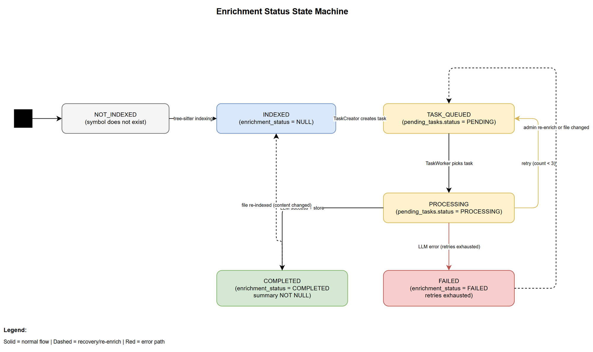

# Functional Specification Document (FSD)

## SA4E — SA4E-106: LLM Enrichment cho Source Code Symbols (Summary, Pseudo Code, Tags)

---

## Document Information

| Field | Value |
|-------|-------|
| Jira Ticket | SA4E-106 |
| Title | LLM Enrichment cho Source Code Symbols (Summary, Pseudo Code, Tags) |
| Author | BA Agent |
| Version | 1.0 |
| Date | 2025-07-23 |
| Status | Draft |
| Related BRD | documents/SA4E-106/BRD.md |

---

## Author Tracking

| Role | Name - Position | Responsibility |
|------|-----------------|----------------|
| Author | BA Agent – Business Analyst | Create document |
| Technical Reviewer | TA Agent – Technical Architect | Review and enrich |
| Technical Enrichment | TA Agent – Technical Architect | API contracts, pseudocode, integration specs (v1.1) |


---

## Revision History

| Version | Date | Author | Changes |
|---------|------|--------|---------|
| 1.0 | 2025-07-23 | BA Agent | Initiate document — auto-generated from BRD SA4E-106 |
| 1.1 | 2025-07-23 | TA Agent | Technical enrichment: API contracts, pseudocode, integration specs, NFR quantification, open issues |

---

## 1. Introduction

### 1.1 Purpose

This FSD specifies the functional behavior of the LLM Enrichment pipeline for source code symbols. It defines how the system generates AI-powered summaries, pseudo code, and semantic tags for code symbols (functions, classes, interfaces, enums) indexed by tree-sitter.

### 1.2 Scope

The scope includes:
- Enqueuing CODE_ENRICHMENT tasks after indexing completes
- LLM prompt construction per symbol kind/strategy
- Parsing and validating LLM responses
- Persisting enrichment data (summary, pseudo_code, llm_tags) to symbols table
- Exposing enrichment results via Admin UI graph info card and code search
- Progress tracking and configuration

Out of scope: tree-sitter parsing changes, embedding generation, real-time LLM calls, file-level metadata enrichment.

### 1.3 Definitions and Acronyms

| Term | Definition |
|------|------------|
| Symbol | A code entity extracted by tree-sitter: function, class, interface, enum, method |
| CODE_ENRICHMENT | TaskType enum value for symbol enrichment tasks in the pending_tasks queue |
| EnrichmentStrategy | Algorithm selection: CLASS_SUMMARY, FUNCTION_SUMMARY, PEGA_SUMMARY, TAG_EXTRACTION |
| body_embeddings | Table storing raw function body text (chunk_index=0) used as LLM context |
| TaskWorker | Background polling service processing pending_tasks asynchronously |
| PegaLogicNormalizer | Existing rule-based system generating pseudo code from Pega rule JSON |
| Cross-scope dedup | Optimization: skip LLM if same file content_hash already enriched in another project |

### 1.4 References

| Document | Location |
|----------|----------|
| BRD | documents/SA4E-106/BRD.md |
| CodeEnrichmentHandler | backend/src/engine/enrichment/CodeEnrichmentHandler.ts |
| CodeEnrichmentTaskCreator | backend/src/engine/enrichment/CodeEnrichmentTaskCreator.ts |
| CodeEnrichmentPromptBuilder | backend/src/engine/enrichment/CodeEnrichmentPromptBuilder.ts |
| TaskWorker | backend/src/modules/memory/task-queue/TaskWorker.ts |
| Enrichment types | backend/src/engine/enrichment/types.ts |

---

## 2. System Overview

### 2.1 System Context Diagram


The Code Enrichment system operates within the Code Intelligence MCP Server. External actors:
- **Developer** — views enrichment results in Admin UI graph and uses enhanced code search
- **Admin** — configures enrichment settings, monitors progress
- **LLM Provider** — external AI service (Ollama local / OpenAI / Gemini) generating summaries and tags
- **Tree-sitter Indexing Engine** — upstream pipeline producing symbols that trigger enrichment

### 2.2 System Architecture

The enrichment pipeline consists of:
1. **CodeEnrichmentTaskCreator** — creates tasks after indexing (injected into IndexingEngine)
2. **TaskWorker** — polls pending_tasks, dispatches CODE_ENRICHMENT to handler
3. **CodeEnrichmentHandler** — orchestrates LLM call per symbol
4. **CodeEnrichmentPromptBuilder** — constructs prompts per strategy
5. **tag-validator** — validates and normalizes LLM-generated tags
6. **symbols table** — persistence layer (summary, pseudo_code, llm_tags, enrichment_status, enriched_at)

---

## 3. Functional Requirements

### 3.1 Feature: Symbol Summary Generation

**Source:** BRD Story 1

#### 3.1.1 Description

After tree-sitter indexing completes for a file, the system creates CODE_ENRICHMENT tasks for each eligible symbol. The TaskWorker processes these tasks by calling the LLM with symbol context to generate a concise 1-3 sentence summary describing the symbol's purpose.

#### 3.1.2 Use Case

**Use Case ID:** UC-01
**Actor:** System (automated), Developer (consumer)
**Preconditions:**
- Tree-sitter indexing completed for at least one file
- LLM provider configured and available
- Symbol exists in symbols table with valid metadata

**Postconditions:**
- Symbol has summary column populated
- Symbol has enrichment_status = 'COMPLETED'
- Symbol has enriched_at timestamp

**Main Flow:**

| Step | Actor | System | Description |
|------|-------|--------|-------------|
| 1 | IndexingEngine | | Calls CodeEnrichmentTaskCreator.createTasks() after storeResults() |
| 2 | | TaskCreator | Checks eligibility: kind in ENRICHABLE_KINDS, not already enriched |
| 3 | | TaskCreator | Inserts pending_task with type=CODE_ENRICHMENT, payload={symbolId, symbolName, symbolKind, projectId, filePath, workspaceType} |
| 4 | | TaskWorker | Polls pending_tasks, picks up CODE_ENRICHMENT task |
| 5 | | Handler | Parses payload via CodeEnrichmentPayloadSchema (zod) |
| 6 | | Handler | Loads SymbolContext: name, kind, signature, doc_comment, bodyText, childMembers |
| 7 | | Handler | Selects strategy: FUNCTION_SUMMARY / CLASS_SUMMARY / PEGA_SUMMARY |
| 8 | | PromptBuilder | Builds system+user messages based on strategy |
| 9 | | Handler | Calls LLM with 30s timeout (Promise.race) |
| 10 | | Handler | Parses response: JSON then regex fallback |
| 11 | | Handler | Validates tags via validateTags() |
| 12 | | Handler | Updates symbols: SET summary, pseudo_code, llm_tags, enrichment_status='COMPLETED', enriched_at |
| 13 | Developer | | Views summary in Admin UI graph info card |

**Alternative Flows:**

| ID | Condition | Steps |
|----|-----------|-------|
| AF-01 | Symbol already enriched (status=COMPLETED AND summary NOT NULL) | TaskCreator skips — no task created |
| AF-02 | Same file content_hash enriched in another project | TaskCreator skips entire file (cross-scope dedup) |
| AF-03 | Function body 3 lines or fewer | Pseudo code = null, only summary + tags generated |
| AF-04 | Pega symbol with existing pseudo_code | LLM receives existing pseudo code as context for enhancement |

**Exception Flows:**

| ID | Condition | Steps |
|----|-----------|-------|
| EF-01 | LLM timeout (>30s) | Handler throws llm_timeout, handleTaskError retries (max 3) |
| EF-02 | LLM returns invalid JSON | parseResponse uses regex fallback extraction |
| EF-03 | Symbol not found in DB | Handler throws symbol_not_found, task marked FAILED |
| EF-04 | Invalid payload schema | Handler throws invalid_payload, task marked FAILED (non-retryable) |
| EF-05 | CodeEnrichmentHandler not injected | processCodeEnrichment resets task for retry |

#### 3.1.3 Business Rules

| Rule ID | Rule | Source |
|---------|------|--------|
| BR-01 | Enrichment failures MUST NOT affect indexing pipeline (non-blocking) | BRD 5.2 |
| BR-02 | LLM call timeout = 30 seconds; use Promise.race for enforcement | Performance NFR |
| BR-03 | Summary must be 1-3 sentences (target 300 chars max) | BRD Story 1 |
| BR-04 | Summary must be in English regardless of source code language | BRD Story 1 |
| BR-05 | Pseudo code max length = 2000 characters; truncate with ellipsis if exceeded | BRD Story 2 |
| BR-06 | Tags must use category:value format with valid categories only | types.ts VALID_TAG_CATEGORIES |
| BR-07 | Enrichment is idempotent — skip if content unchanged (last-write-wins) | BRD 5.1 |
| BR-08 | Retry up to 3 times with exponential backoff on transient failures | BRD 6 NFR |
| BR-09 | Eligible kinds: class, interface, enum, function, method, arrow_function, generator + all Pega kinds | CodeEnrichmentTaskCreator |
| BR-10 | Cross-scope dedup: skip LLM if same content_hash already enriched in another project | CodeEnrichmentTaskCreator |
| BR-11 | Tag categories restricted to: design-pattern, responsibility, domain, complexity, dependency | types.ts |
| BR-12 | Tag values: lowercase, alphanumeric + hyphens only, max 50 chars per value | tag-validator.ts |

#### 3.1.4 Data Specifications

**Input Data (CODE_ENRICHMENT task payload):**

| Field | Type | Required | Validation | Description |
|-------|------|----------|------------|-------------|
| symbolId | number | Yes | > 0, exists in symbols table | FK to symbols.id |
| symbolName | string | Yes | Non-empty | Symbol display name |
| symbolKind | string | Yes | Valid kind enum | function, class, method, etc. |
| projectId | string | Yes | Non-empty | Tenant project ID |
| filePath | string | Yes | Non-empty | Relative file path |
| workspaceType | enum | No | pega or standard | Default: standard |
| pegaClass | string | No | — | Pega class name (pega only) |
| pegaRuleset | string | No | — | Pega ruleset (pega only) |

**Output Data (stored in symbols table):**

| Field | Type | Description |
|-------|------|-------------|
| summary | TEXT | LLM-generated 1-3 sentence summary |
| pseudo_code | TEXT or NULL | Structured pseudo code (functions/pega only) |
| llm_tags | TEXT (JSON array) or NULL | Validated tags in category:value format |
| enrichment_status | TEXT | PENDING / COMPLETED / FAILED |
| enriched_at | TEXT (ISO timestamp) | When enrichment completed |

---

### 3.2 Feature: Pseudo Code Generation

**Source:** BRD Story 2, Story 3

#### 3.2.1 Description

For function/method symbols with body text, the LLM generates structured pseudo code describing the algorithm. For Pega rules, the LLM enhances existing rule-based pseudo code with natural language explanations.

#### 3.2.2 Use Case

**Use Case ID:** UC-02
**Actor:** System (automated), Developer (consumer)
**Preconditions:**
- Symbol is of kind: function, method, arrow_function, generator, or Pega kind
- Symbol has body text in body_embeddings (chunk_index=0)
- For Pega: may have existing pseudo_code from PegaLogicNormalizer

**Postconditions:**
- Symbol has pseudo_code column populated (max 2000 chars)
- Pseudo code uses structured numbered-step format

**Main Flow:**

| Step | Actor | System | Description |
|------|-------|--------|-------------|
| 1 | | Handler | Detects strategy = FUNCTION_SUMMARY or PEGA_SUMMARY |
| 2 | | Handler | Loads bodyText from body_embeddings (chunk_index=0) |
| 3 | | Handler | For Pega: loads existingPseudoCode from symbols.pseudo_code |
| 4 | | PromptBuilder | Builds prompt including body text (truncated to 4000 tokens) |
| 5 | | PromptBuilder | For Pega: includes existing pseudo code + pega class/ruleset context |
| 6 | | LLM | Returns JSON with pseudo_code field |
| 7 | | Handler | Truncates to MAX_PSEUDO_CODE_LENGTH (2000) if exceeded |
| 8 | | Handler | Stores via COALESCE — new value or keep existing |

**Alternative Flows:**

| ID | Condition | Steps |
|----|-----------|-------|
| AF-01 | CLASS_SUMMARY strategy (class/interface/enum) | No pseudo_code generated — field remains null |
| AF-02 | Function body is null/empty | Pseudo code = null, only summary + tags |
| AF-03 | LLM response has no pseudo_code field | COALESCE preserves existing value |

#### 3.2.3 Business Rules

| Rule ID | Rule | Source |
|---------|------|--------|
| BR-05 | Pseudo code max 2000 chars, truncate with ellipsis | BRD Story 2 |
| BR-13 | Pseudo code only for FUNCTION_SUMMARY and PEGA_SUMMARY strategies | CodeEnrichmentHandler |
| BR-14 | COALESCE on UPDATE: new value OR keep existing (do not overwrite with null) | CodeEnrichmentHandler.storeResults() |
| BR-15 | Pega prompt includes existing rule-based pseudo code as INPUT for enhancement | CodeEnrichmentPromptBuilder |
| BR-16 | Body text truncated to 4000 tokens before sending to LLM | CodeEnrichmentPromptBuilder |

---

### 3.3 Feature: Semantic Tag Extraction

**Source:** BRD Story 4

#### 3.3.1 Description

The LLM extracts semantic tags for each symbol categorized into 5 valid categories. Tags describe domain, design patterns, responsibilities, complexity, and dependencies.

#### 3.3.2 Use Case

**Use Case ID:** UC-03
**Actor:** System (automated), Developer (consumer)
**Preconditions:** Symbol enrichment task is being processed

**Postconditions:**
- Symbol has llm_tags column populated with JSON array of validated tags
- Tags follow category:value format

**Main Flow:**

| Step | Actor | System | Description |
|------|-------|--------|-------------|
| 1 | | LLM | Returns tags array in response JSON |
| 2 | | tag-validator | Iterates each tag: splits on first colon |
| 3 | | tag-validator | Validates category is in VALID_TAG_CATEGORIES |
| 4 | | tag-validator | Validates value matches /^[a-z0-9-]+$/ and max 50 chars |
| 5 | | tag-validator | Deduplicates validated tags |
| 6 | | Handler | Stores as JSON string in symbols.llm_tags |

**Alternative Flows:**

| ID | Condition | Steps |
|----|-----------|-------|
| AF-01 | LLM returns no tags or non-array | validateTags returns empty array, llm_tags = null |
| AF-02 | Tag has invalid category | Tag discarded silently |
| AF-03 | Tag value has special chars | Tag discarded (only a-z0-9 and hyphens allowed) |

#### 3.3.3 Business Rules

| Rule ID | Rule | Source |
|---------|------|--------|
| BR-06 | Tags format: category:value | types.ts |
| BR-11 | Valid categories: design-pattern, responsibility, domain, complexity, dependency | types.ts |
| BR-12 | Values: lowercase, alphanumeric + hyphens, max 50 chars | tag-validator.ts |
| BR-17 | No minimum tag count enforced (LLM may return 0 valid tags) | tag-validator.ts |
| BR-18 | Duplicate tags within same symbol are removed | tag-validator.ts |

#### 3.3.4 Valid Tag Categories and Examples

| Category | Description | Example Values |
|----------|-------------|----------------|
| design-pattern | GoF or architectural patterns used | factory, observer, strategy, singleton |
| responsibility | What the symbol is responsible for | validation, authentication, data-access, routing |
| domain | Business domain area | billing, user-management, notification, pega-rules |
| complexity | Complexity indicators | high-cyclomatic, recursive, async-heavy |
| dependency | External dependencies used | database, http-client, file-system, cache |

---

### 3.4 Feature: Enrichment Progress Tracking

**Source:** BRD Story 5

#### 3.4.1 Description

The existing TaskWorker progress API is extended to include CODE_ENRICHMENT task progress. The Admin UI status bar shows enrichment progress during processing.

#### 3.4.2 Use Case

**Use Case ID:** UC-04
**Actor:** Admin
**Preconditions:** CODE_ENRICHMENT tasks exist in pending_tasks queue

**Postconditions:** Status bar displays progress percentage

**Main Flow:**

| Step | Actor | System | Description |
|------|-------|--------|-------------|
| 1 | Admin | | Opens Admin UI |
| 2 | | StatusBar | Polls /api/admin/taskworker/progress endpoint |
| 3 | | TaskWorker | Queries pending/processing/completed counts for CODE_ENRICHMENT |
| 4 | | StatusBar | Displays "Enriching symbols: current/total (percent%)" |
| 5 | | | When all tasks completed, status returns to idle |

#### 3.4.3 Business Rules

| Rule ID | Rule | Source |
|---------|------|--------|
| BR-19 | Progress includes CODE_ENRICHMENT alongside existing TAG_ENRICHMENT | BRD Story 5 |
| BR-20 | Progress polling interval: same as existing status bar mechanism | Existing behavior |

---

### 3.5 Feature: Enrichment Configuration

**Source:** BRD Story 6

#### 3.5.1 Description

Admin can configure code enrichment behavior: enable/disable, symbol kind filter, priority ordering, and concurrency.

#### 3.5.2 Use Case

**Use Case ID:** UC-05
**Actor:** Admin
**Preconditions:** Admin UI Settings page accessible

**Postconditions:** Configuration persisted, takes effect on next enrichment cycle

**Main Flow:**

| Step | Actor | System | Description |
|------|-------|--------|-------------|
| 1 | Admin | | Navigates to Settings then Code Enrichment section |
| 2 | Admin | | Toggles enable/disable switch |
| 3 | Admin | | Selects symbol kinds to enrich |
| 4 | Admin | | Sets concurrency limit |
| 5 | | System | Validates and persists configuration |
| 6 | | TaskWorker | Applies new concurrency on next poll cycle |

#### 3.5.3 Business Rules

| Rule ID | Rule | Source |
|---------|------|--------|
| BR-21 | Configuration applies without server restart | BRD Story 6 |
| BR-22 | Default: all kinds enabled, concurrency = 2 | BRD Story 6 |
| BR-23 | Kind filter reduces task creation (TaskCreator checks before inserting) | BRD Story 6 |

---

### 3.6 Feature: Code Search Enhancement with Tags

**Source:** BRD Story 4

#### 3.6.1 Description

The existing code_search_by_tag MCP tool allows searching symbols by their LLM-generated semantic tags. The code_enrichment_stats tool reports enrichment progress.

#### 3.6.2 Use Case

**Use Case ID:** UC-06
**Actor:** Developer (via MCP tool)
**Preconditions:** Symbols enriched with llm_tags

**Postconditions:** Search results ranked by tag relevance

**Main Flow:**

| Step | Actor | System | Description |
|------|-------|--------|-------------|
| 1 | Developer | | Calls code_search_by_tag(tag: "domain:authentication") |
| 2 | | System | Queries symbols WHERE llm_tags LIKE '%authentication%' |
| 3 | | System | Returns symbol list with name, kind, file_path, summary |

---

## 4. Data Model

### 4.1 Enrichment Columns on Symbols Table

The following columns are added to the existing symbols table (additive migration):

| Column | Type | Nullable | Default | Business Rule | Description |
|--------|------|----------|---------|---------------|-------------|
| summary | TEXT | Yes | NULL | BR-03 | LLM-generated summary (1-3 sentences) |
| pseudo_code | TEXT | Yes | NULL | BR-05 | Structured pseudo code (functions/pega only) |
| llm_tags | TEXT | Yes | NULL | BR-06 | JSON array of validated category:value tags |
| enrichment_status | TEXT | Yes | NULL | BR-07 | NULL then PENDING then COMPLETED or FAILED |
| enriched_at | TEXT | Yes | NULL | — | ISO timestamp when enrichment completed |

### 4.2 Pending Tasks Table (existing, extended usage)

| Column | Type | Notes for CODE_ENRICHMENT |
|--------|------|---------------------------|
| id | INTEGER PK | Auto-increment |
| task_type | TEXT | 'CODE_ENRICHMENT' |
| entry_id | INTEGER | FK to symbols.id (not knowledge_entries) |
| status | TEXT | PENDING then PROCESSING then COMPLETED or FAILED |
| payload | TEXT (JSON) | CodeEnrichmentPayload schema |
| max_retries | INTEGER | Default: 3 |
| retry_count | INTEGER | Incremented on failure |
| project_id | TEXT | Tenant scope for per-project stats |
| created_at | TEXT | ISO timestamp |

### 4.3 Entity Relationships

| From Entity | To Entity | Cardinality | Description |
|-------------|-----------|-------------|-------------|
| symbols | pending_tasks | 1:N | One symbol can have multiple enrichment task attempts |
| symbols | body_embeddings | 1:N | Body text stored as chunks; chunk_index=0 used for enrichment |
| symbols | files | N:1 | Multiple symbols belong to one file |
| files | projects | N:1 | Multiple files scoped to one project |

---

## 5. Integration Specifications

### 5.1 External System: LLM Provider

| Attribute | Value |
|-----------|-------|
| Purpose | Generate summaries, pseudo code, and tags from symbol context |
| Direction | Outbound (request/response) |
| Data Format | JSON (messages array to JSON response) |
| Frequency | Per-symbol, async via task queue |

**Data Exchange:**

| Our Data | External Data | Direction | Business Rule |
|----------|--------------|-----------|---------------|
| System prompt + User prompt (symbol context) | JSON {summary, pseudo_code, tags} | Send/Receive | BR-02: 30s timeout |

**LLM Provider Options (existing LLMService multi-provider):**

| Provider | Use Case | Configuration |
|----------|----------|---------------|
| Ollama (local) | Default, privacy-preserving | No API key needed |
| OpenAI | Higher quality, cloud | API key via admin settings |
| Gemini | Alternative cloud provider | API key via admin settings |
| LM Studio | Local alternative to Ollama | HTTP endpoint config |

### 5.2 Internal System: IndexingEngine

| Attribute | Value |
|-----------|-------|
| Purpose | Triggers enrichment after symbol extraction |
| Direction | Inbound (callback) |
| Integration Point | CodeEnrichmentTaskCreator.createTasks() called after storeResults() |
| Frequency | Per-file indexing event |

### 5.3 Internal System: Admin UI Graph

| Attribute | Value |
|-----------|-------|
| Purpose | Displays enrichment results to developer |
| Direction | Outbound (read from DB) |
| Integration Point | Symbol detail API returns summary, pseudo_code, llm_tags |
| Frequency | On-demand (user clicks node) |

---

## 6. Processing Logic

### 6.1 Enrichment Task Creation (Post-Index)

**Trigger:** IndexingEngine.storeResults() completes for a file
**Input:** Map of symbolName to symbolId, filePath, projectId
**Output:** N pending_tasks created (0 if all already enriched)

**Processing Steps:**

| Step | Description | Error Handling |
|------|-------------|----------------|
| 1 | Check cross-scope dedup: same file content_hash enriched elsewhere? | On error: proceed (non-fatal) |
| 2 | For each symbol in symbolIds map | Skip if symbolId <= 0 |
| 3 | Check shouldCreateTask: enrichment_status != COMPLETED OR summary IS NULL | — |
| 4 | Check kind eligibility: ENRICHABLE_KINDS or isPegaKind() | Skip non-eligible |
| 5 | Insert pending_task with serialized payload | Non-blocking: log and continue on failure |

**State Diagram:**



### 6.2 Task Processing (TaskWorker to Handler)

**Trigger:** TaskWorker poll cycle finds PENDING CODE_ENRICHMENT task
**Input:** PendingTask record
**Output:** Updated symbols row with enrichment data

**Processing Steps:**

| Step | Description | Error Handling |
|------|-------------|----------------|
| 1 | Parse payload via CodeEnrichmentPayloadSchema.safeParse() | Throw invalid_payload: non-retryable FAILED |
| 2 | Load SymbolContext from DB (symbols + body_embeddings) | Throw symbol_not_found: non-retryable FAILED |
| 3 | Select strategy based on (symbolKind, workspaceType) | Fallback to CLASS_SUMMARY |
| 4 | Build LLM messages via PromptBuilder | — |
| 5 | Call LLM with 30s timeout | Throw llm_timeout: retry |
| 6 | Parse response (JSON then markdown fence then regex fallback) | Use best-effort extraction |
| 7 | Validate tags via validateTags() | Invalid tags discarded silently |
| 8 | Store results: UPDATE symbols SET summary, pseudo_code, llm_tags, status, enriched_at | — |

**Sequence Diagram:**


### 6.3 Strategy Selection Logic

| Condition | Strategy | Generates |
|-----------|----------|-----------|
| workspaceType=pega AND isPegaKind(kind) | PEGA_SUMMARY | summary + pseudo_code + tags |
| kind in {function, method, arrow_function, generator} | FUNCTION_SUMMARY | summary + pseudo_code + tags |
| kind in {class, interface, enum} | CLASS_SUMMARY | summary + tags (no pseudo_code) |
| Other (fallback) | CLASS_SUMMARY | summary + tags |

### 6.4 LLM Response Parsing (3-tier fallback)

| Attempt | Method | Success Condition |
|---------|--------|-------------------|
| 1 | JSON.parse(raw) | parsed.summary is string |
| 2 | Extract from markdown code fence | parsed.summary is string |
| 3 | Regex extraction of summary, pseudo_code, tags fields | Always returns result |

### 6.5 Batch Task Creation (Full Project)

**Trigger:** Admin UI Re-enrich action or after full indexing
**Input:** projectId
**Output:** Up to 500 pending_tasks per batch

**Processing Steps:**

| Step | Description | Error Handling |
|------|-------------|----------------|
| 1 | Query symbols WHERE enrichment_status IS NULL/FAILED or summary IS NULL, LIMIT 500 | — |
| 2 | Collect unique file paths, check cross-scope dedup per file | Skip enriched files |
| 3 | For each eligible symbol: insert pending_task | — |

---

## 7. Security Requirements

### 7.1 Authentication and Authorization

| Role | Permissions | Features |
|------|-------------|----------|
| Developer | Read | View enrichment results in graph, use code_search_by_tag |
| Admin | Read + Configure | Configure enrichment settings, view progress, trigger re-enrich |

### 7.2 Data Sensitivity

| Data Type | Classification | Business Requirement |
|-----------|---------------|---------------------|
| Source code (function bodies) | Internal | Sent to LLM — must stay within configured provider |
| LLM-generated summaries | Internal | Derived content, stored in DB |
| LLM API keys | Confidential | Stored in admin settings, not included in prompts |

### 7.3 LLM Data Privacy

| Concern | Mitigation |
|---------|-----------|
| Source code leakage | Default to local Ollama; cloud providers require explicit user config |
| Prompt injection | Structured system/user message separation; no user input in system prompt |
| Model hallucination | Summaries marked as AI-generated in UI; tags validated against allowlist |

---

## 8. Non-Functional Requirements

| Category | Business Requirement | Acceptance Criteria |
|----------|---------------------|---------------------|
| Performance | Enrichment throughput | >= 10 symbols/minute with local Ollama 7B |
| Performance | No indexing impact | Enrichment fully decoupled — indexing completes independently |
| Performance | UI response time | Info card loads in less than 200ms (pre-computed, no real-time LLM) |
| Scalability | Large repos | Handle 10000+ symbols via batching (500/batch) and priority |
| Reliability | Task retry | 3 retries with exponential backoff on transient LLM failures |
| Reliability | Idempotency | Re-index unchanged symbols creates no duplicate tasks |
| Availability | Graceful degradation | LLM unavailable: system continues without enrichment |
| Observability | Progress tracking | Real-time via TaskWorker.getProgress() |
| Data Integrity | Versioning | Store enriched_at timestamp; re-enrichment possible on model change |

---

## 9. Error Handling (User-Facing)

### 9.1 Error Scenarios

| Scenario | Severity | User Message | Expected Behavior |
|----------|----------|-------------|-------------------|
| LLM provider unavailable | Warning | Enrichment paused — LLM unavailable | Tasks retry; system functional without enrichment |
| LLM timeout | Info | None (background) | Task retries up to 3 times; progress shows processing |
| All retries exhausted | Warning | Symbol enrichment failed (in progress stats) | Task marked FAILED; can re-enqueue via admin |
| Invalid symbol (deleted during processing) | Info | None | Task marked FAILED (non-retryable) |

### 9.2 Admin Observability

| Event | Visibility | Channel |
|-------|-----------|---------|
| Enrichment started (batch) | Status bar | Admin UI polling |
| Enrichment progress | Status bar | Admin UI polling |
| Enrichment complete | Status bar idle | Admin UI polling |
| Task failure (after retries) | code_enrichment_stats tool | MCP tool response |

---

## 10. Testing Considerations

### 10.1 Test Scenarios

| ID | Scenario | Input | Expected Output | Priority |
|----|----------|-------|-----------------|----------|
| TC-01 | Function symbol enrichment | Symbol kind=function with body | summary + pseudo_code + tags stored | High |
| TC-02 | Class symbol enrichment | Symbol kind=class with members | summary + tags stored, no pseudo_code | High |
| TC-03 | Pega symbol enrichment | Symbol kind=pega_activity | summary + enhanced pseudo_code + tags | High |
| TC-04 | Already enriched skip | Symbol with COMPLETED + summary | No new task created | High |
| TC-05 | LLM timeout then retry | LLM responds after 30s | Task retried, eventually succeeds | Medium |
| TC-06 | Invalid JSON response | LLM returns plain text | Regex fallback extracts summary | Medium |
| TC-07 | Tag validation | Tags with invalid category | Invalid tags filtered out | Medium |
| TC-08 | Cross-scope dedup | Same file in 2 projects | Second project skips LLM | Medium |
| TC-09 | Batch creation (500 limit) | Project with 1000 unenriched symbols | First call creates 500, second call gets remaining | Low |
| TC-10 | Concurrency control | Multiple CODE_ENRICHMENT tasks | TaskWorker respects concurrency limit | Medium |

---

## 11. Appendix

### 11.1 Enrichment Pipeline Flow

```
[File Change]
    |
[Tree-sitter Parse] --> symbols table + body_embeddings
    |
[CodeEnrichmentTaskCreator.createTasks()]
    | (for each eligible symbol)
[pending_tasks INSERT (CODE_ENRICHMENT)]
    |
[TaskWorker.poll()] --> picks task
    |
[CodeEnrichmentHandler.enrichSymbol()]
    |
[Load SymbolContext] --> [Select Strategy] --> [Build Prompt]
    |
[LLM.complete() with 30s timeout]
    |
[Parse Response (JSON --> fence --> regex)]
    |
[validateTags() + truncate pseudo_code]
    |
[UPDATE symbols SET summary, pseudo_code, llm_tags, enrichment_status='COMPLETED']
```

### Diagram Index

| # | Diagram | Image | Source (editable) |
|---|---------|-------|-------------------|
| 1 | System Context | [system-context.png](diagrams/system-context.png) | [system-context.drawio](diagrams/system-context.drawio) |
| 2 | Enrichment Sequence | [sequence-enrichment.png](diagrams/sequence-enrichment.png) | [sequence-enrichment.drawio](diagrams/sequence-enrichment.drawio) |
| 3 | Enrichment State | [state-enrichment.png](diagrams/state-enrichment.png) | [state-enrichment.drawio](diagrams/state-enrichment.drawio) |

---

## 12. Technical Appendices (TA Enrichment)

### 12.1 API Contracts — Internal Interfaces

#### 12.1.1 CodeEnrichmentTaskCreator

**File:** `backend/src/engine/enrichment/CodeEnrichmentTaskCreator.ts`

```typescript
/**
 * Creates CODE_ENRICHMENT tasks for newly indexed symbols.
 * Injected into IndexingEngine, called after storeResults().
 */
class CodeEnrichmentTaskCreator {
  constructor(adapter: DatabaseAdapter, logger: Logger);

  /**
   * Create enrichment tasks for symbols that haven't been enriched yet.
   * Skips if same file content_hash already enriched in another project (cross-scope dedup).
   * @param symbolIds - Map of symbol name -> symbol ID from storeResults()
   * @param filePath - Relative file path of indexed file
   * @param projectId - Tenant project ID
   * @returns Number of tasks created (0 if all already enriched or skipped)
   */
  async createTasks(
    symbolIds: Map<string, number>,
    filePath: string,
    projectId: string,
  ): Promise<number>;

  /**
   * Create enrichment tasks for all unenriched symbols in a project.
   * Called after full indexing — queries symbols table directly.
   * @param projectId - Tenant project ID
   * @returns Number of tasks created (max 500 per call)
   */
  async createTasksForProject(projectId: string): Promise<number>;
}
```

**Integration Point:** Called by `IndexingEngine` after `storeResults()` returns.

**Eligibility Criteria (ENRICHABLE_KINDS constant):**
- `class`, `interface`, `enum`
- `function`, `method`, `arrow_function`, `generator`
- All Pega kinds via `isPegaKind()` (16+ kinds dynamically resolved)

---

#### 12.1.2 CodeEnrichmentHandler

**File:** `backend/src/engine/enrichment/CodeEnrichmentHandler.ts`

```typescript
/**
 * Orchestrates LLM enrichment for a single code symbol.
 * Injected into TaskWorker via setCodeEnrichmentHandler().
 */
class CodeEnrichmentHandler {
  constructor(adapter: DatabaseAdapter, llmService: LLMService, logger: Logger);

  /**
   * Enrich a single symbol from a CODE_ENRICHMENT task.
   * Steps: parse payload -> load context -> select strategy -> build prompt
   *        -> call LLM (30s timeout) -> parse response -> validate tags -> store results
   * @param task - The pending task record with JSON payload
   * @throws Error('invalid_payload: ...') — non-retryable
   * @throws Error('symbol_not_found: ...') — non-retryable
   * @throws Error('llm_timeout') — retryable (caught by TaskWorker.handleTaskError)
   */
  async enrichSymbol(task: PendingTask): Promise<void>;
}
```

**Injection into TaskWorker:**
```typescript
taskWorker.setCodeEnrichmentHandler(handler: CodeEnrichmentHandler): void;
```

**Error Contract:**

| Error Message Pattern | Retryable | Behavior |
|-----------------------|-----------|----------|
| `invalid_payload: ...` | No (intended) | Task should be FAILED immediately |
| `symbol_not_found: ...` | No (intended) | Task should be FAILED immediately |
| `llm_timeout` | Yes | Task retry up to max_retries (3) |
| Any other Error | Yes | Task retry up to max_retries (3) |

**Note:** `handleTaskError` in TaskWorker checks `err.message.includes('invalid_json') || err.message.includes('entry_not_found')` for non-retryable. CODE_ENRICHMENT errors `invalid_payload` and `symbol_not_found` do NOT match these patterns, so they are actually retried. This is an **existing behavior gap** (see OI-02 in Open Issues).

---

#### 12.1.3 CodeEnrichmentPromptBuilder

**File:** `backend/src/engine/enrichment/CodeEnrichmentPromptBuilder.ts`

```typescript
/**
 * Builds LLM prompts for code enrichment based on strategy and context.
 * Strategy pattern: each strategy produces a system + user message pair.
 */
class CodeEnrichmentPromptBuilder {
  /**
   * Build LLM messages for a given strategy and symbol context.
   * @param strategy - Which enrichment strategy to apply
   * @param context - Symbol metadata and source content
   * @returns Array of LLM messages [system, user] (always exactly 2)
   */
  build(strategy: EnrichmentStrategy, context: SymbolContext): LLMMessage[];
}
```

**Strategy -> Prompt Mapping:**

| Strategy | System Prompt Template | User Prompt Includes | Expected Response |
|----------|----------------------|---------------------|-------------------|
| `CLASS_SUMMARY` | "Summarize class/interface/enum -> JSON {summary, tags}" | [kind] name, signature, docComment, childMembers (max 20) | `{summary, tags}` |
| `FUNCTION_SUMMARY` | "Summarize function + pseudo code -> JSON {summary, pseudo_code, tags}" | [kind] name, signature, docComment, bodyText (4000 tokens) | `{summary, pseudo_code, tags}` |
| `PEGA_SUMMARY` | "Analyze Pega rule business purpose -> JSON {summary, pseudo_code, tags}" | [kind] name, pegaClass, pegaRuleset, signature, ruleContent, existingPseudoCode | `{summary, pseudo_code, tags}` |
| `TAG_EXTRACTION` | "Extract semantic tags -> JSON {tags}" | [kind] name, signature, body (500 chars) | `{tags}` |

**LLM Message Format (LLMService.complete() contract):**

```typescript
interface LLMMessage {
  role: 'system' | 'user' | 'assistant';
  content: string;
}

// LLMService returns:
interface LLMResponse {
  content: string;  // Raw text response from model
}
```

---

#### 12.1.4 Tag Validator API

**File:** `backend/src/engine/enrichment/tag-validator.ts`

```typescript
/**
 * Validate and filter LLM-generated tags.
 * @param tags - Raw tags from LLM response (unknown type — may not be array)
 * @returns Array of validated tags in `category:value` format (deduped)
 */
export function validateTags(tags: unknown): string[];

/**
 * Check if a single tag string belongs to a valid category.
 */
export function isValidTagCategory(tag: string): boolean;
```

**Validation Rules (applied per tag):**

| Step | Check | On Fail |
|------|-------|---------|
| 1 | Input is Array | Return `[]` |
| 2 | Element is string | Skip element |
| 3 | Contains `:` (colonIdx > 0) | Skip element |
| 4 | Category in VALID_TAG_CATEGORIES | Skip element |
| 5 | Value matches `/^[a-z0-9-]+$/` | Skip element |
| 6 | Value.length <= 50 | Skip element |
| 7 | Deduplicate (Set) | Remove dupe |

**VALID_TAG_CATEGORIES:** `['design-pattern', 'responsibility', 'domain', 'complexity', 'dependency']`

---
### 12.2 Pseudocode — Complex Business Logic

#### 12.2.1 Task Creation Logic (Cross-Scope Dedup)

```pseudocode
FUNCTION createTasks(symbolIds: Map, filePath: string, projectId: string) -> number:
  IF symbolIds is empty THEN RETURN 0

  // Step 1: Cross-scope dedup check (file-level)
  TRY:
    currentFile = QUERY files WHERE relative_path = filePath AND project_id = projectId
    IF currentFile.content_hash EXISTS:
      enrichedElsewhere = QUERY files f JOIN symbols s
        WHERE f.content_hash = currentFile.content_hash
        AND f.project_id != projectId
        AND s.enrichment_status = 'COMPLETED'
        LIMIT 1
      IF enrichedElsewhere:
        LOG "Skipped — same hash enriched in another scope"
        RETURN 0
  CATCH:
    // Non-fatal: proceed with task creation on query error
    PASS

  // Step 2: Per-symbol eligibility + task creation
  created = 0
  FOR EACH (symbolName, symbolId) IN symbolIds:
    IF symbolId <= 0: CONTINUE

    // Check if already enriched
    row = QUERY symbols WHERE id = symbolId
    IF row.enrichment_status = 'COMPLETED' AND row.summary IS NOT NULL:
      CONTINUE  // Already has valid enrichment

    // Check kind eligibility
    kind = QUERY symbols.kind WHERE id = symbolId
    IF kind NOT IN ENRICHABLE_KINDS AND NOT isPegaKind(kind):
      CONTINUE

    // Build payload with dynamic workspaceType
    payload = {
      symbolId, symbolName, symbolKind: kind,
      projectId, filePath,
      workspaceType: isPegaKind(kind) ? 'pega' : 'standard'
    }

    // Insert task (non-blocking)
    TRY:
      INSERT INTO pending_tasks (task_type, entry_id, status, payload, max_retries, created_at)
      VALUES ('CODE_ENRICHMENT', symbolId, 'PENDING', JSON(payload), 3, NOW())
      created++
    CATCH:
      LOG warning and CONTINUE

  RETURN created
```

---

#### 12.2.2 Batch Task Creation (Full Project)

```pseudocode
FUNCTION createTasksForProject(projectId: string) -> number:
  // Query unenriched symbols (max 500 per batch)
  symbols = QUERY s.id, s.name, s.kind, f.relative_path
    FROM symbols s JOIN files f ON s.file_id = f.id
    WHERE s.project_id = projectId
      AND (s.enrichment_status IS NULL
           OR s.enrichment_status = 'FAILED'
           OR (s.enrichment_status = 'COMPLETED' AND s.summary IS NULL))
    LIMIT 500

  // Batch cross-scope check: unique file paths
  uniqueFilePaths = DISTINCT(symbols.map(s -> s.file_path))
  skippedFiles = SET()
  FOR EACH fp IN uniqueFilePaths:
    IF isFileEnrichedInOtherScope(fp, projectId):
      skippedFiles.add(fp)

  // Create tasks for eligible, non-skipped symbols
  created = 0
  FOR EACH sym IN symbols:
    IF sym.kind NOT IN ENRICHABLE_KINDS AND NOT isPegaKind(sym.kind): CONTINUE
    IF sym.file_path IN skippedFiles: CONTINUE
    INSERT pending_task(sym.id, sym.name, sym.kind, sym.file_path, projectId)
    created++

  RETURN created
```

---

#### 12.2.3 LLM Response Parsing (3-Tier Fallback)

```pseudocode
FUNCTION parseResponse(raw: string, strategy: EnrichmentStrategy) -> CodeEnrichmentLLMResponse:
  // Attempt 1: Direct JSON parse
  TRY:
    parsed = JSON.parse(raw)
    IF parsed.summary IS string:
      RETURN parsed  // Success — valid JSON with summary
  CATCH: PASS

  // Attempt 2: Extract from markdown code fence (```json ... ```)
  fenceMatch = REGEX_MATCH(raw, /```(?:json)?\s*([\s\S]*?)```/)
  IF fenceMatch:
    TRY:
      parsed = JSON.parse(fenceMatch[1].trim())
      IF parsed.summary IS string:
        RETURN parsed
    CATCH: PASS

  // Attempt 3: Regex fallback — extract individual fields
  summaryMatch = REGEX_MATCH(raw, /"summary"\s*:\s*"([^"]+)"/)
  pseudoMatch  = REGEX_MATCH(raw, /"pseudo_code"\s*:\s*"([^"]+)"/)
  tagsMatch    = REGEX_MATCH(raw, /"tags"\s*:\s*\[([^\]]*)\]/)

  summary = summaryMatch?.[1]
    ELSE raw.slice(0, 200).replace(/["\n]/g, ' ').trim()  // Last resort: first 200 chars

  result = { summary }

  IF strategy IN {FUNCTION_SUMMARY, PEGA_SUMMARY} AND pseudoMatch:
    result.pseudo_code = pseudoMatch[1]

  IF tagsMatch:
    tagStrings = ALL matches of /"([^"]+)"/ within tagsMatch[1]
    result.tags = tagStrings

  RETURN result  // Always returns a result (never throws)
```

---

#### 12.2.4 Strategy Selection Algorithm

```pseudocode
FUNCTION selectStrategy(kind: string, workspaceType: string) -> EnrichmentStrategy:
  // Priority 1: Pega workspace with Pega-specific kind
  IF workspaceType = 'pega' AND isPegaKind(kind):
    RETURN 'PEGA_SUMMARY'

  // Priority 2: Function-like kinds
  IF kind IN {'function', 'method', 'arrow_function', 'generator'}:
    RETURN 'FUNCTION_SUMMARY'

  // Priority 3: Class-like kinds
  IF kind IN {'class', 'interface', 'enum'}:
    RETURN 'CLASS_SUMMARY'

  // Fallback: treat as class-like
  RETURN 'CLASS_SUMMARY'
```

---

#### 12.2.5 SymbolContext Loading

```pseudocode
FUNCTION loadContext(payload: CodeEnrichmentPayload) -> SymbolContext:
  // Load symbol metadata
  sym = QUERY name, kind, signature, doc_comment, parent_symbol
    FROM symbols WHERE id = payload.symbolId
  IF sym IS NULL: THROW Error('symbol_not_found: {symbolId}')

  // Load body text from body_embeddings (chunk_index=0 = full body)
  bodyRow = QUERY embedding FROM body_embeddings
    WHERE symbol_id = payload.symbolId AND chunk_index = 0
  bodyText = bodyRow?.embedding ? Buffer.toString('utf-8') : NULL

  // Load child members for classes (max 30)
  childRows = QUERY name, kind FROM symbols
    WHERE parent_symbol_id = payload.symbolId LIMIT 30
  childMembers = childRows.length > 0
    ? childRows.map(r -> "{r.kind}:{r.name}")
    : NULL

  // Load existing pseudo code (for Pega COALESCE logic)
  existingPseudoCode = QUERY pseudo_code FROM symbols WHERE id = payload.symbolId

  RETURN {
    name: sym.name,
    kind: sym.kind,
    signature: sym.signature,
    docComment: sym.doc_comment,
    bodyText,
    childMembers,
    existingPseudoCode,
    pegaClass: payload.pegaClass OR sym.parent_symbol OR undefined,
    pegaRuleset: payload.pegaRuleset OR undefined,
  }
```

---
### 12.3 Data Model Corrections and Clarifications

#### 12.3.1 Symbols Table — Complete Column Set (from codebase)

The enrichment columns are added via `addEnrichmentColumns()` in `engine/graph/migrator.ts` (SQLite) and `pg-schema-ensure.ts` (PostgreSQL). The columns are:

| Column | Type | Default | Migration Source |
|--------|------|---------|-----------------|
| summary | TEXT | NULL | migrator.ts ENRICHMENT_COLUMNS |
| pseudo_code | TEXT | NULL | migrator.ts ENRICHMENT_COLUMNS |
| llm_tags | TEXT | NULL | migrator.ts ENRICHMENT_COLUMNS |
| enrichment_status | TEXT | NULL | migrator.ts ENRICHMENT_COLUMNS |
| enriched_at | TEXT | NULL | migrator.ts ENRICHMENT_COLUMNS |

**Indexes created:**
- `idx_symbols_enrichment_status ON symbols(enrichment_status)`
- `idx_symbols_project_enrichment ON symbols(project_id, enrichment_status)`

#### 12.3.2 Pending Tasks — FK Constraint Note

The `pending_tasks.entry_id` originally references `knowledge_entries(id)`. For CODE_ENRICHMENT tasks, `entry_id` stores `symbols.id` instead. The FK constraint has been explicitly dropped in `pg-schema-ensure.ts`:

```sql
ALTER TABLE pending_tasks DROP CONSTRAINT IF EXISTS pending_tasks_entry_id_fkey;
```

This allows `entry_id` to store either `knowledge_entries.id` (for TAG_ENRICHMENT/VECTOR_EMBEDDING) or `symbols.id` (for CODE_ENRICHMENT).

#### 12.3.3 Pending Tasks — Full Schema (from migration 003 + 006)

| Column | Type | Default | Notes |
|--------|------|---------|-------|
| id | SERIAL/INTEGER PK | Auto-increment | — |
| task_type | TEXT NOT NULL | — | `'CODE_ENRICHMENT'` / `'TAG_ENRICHMENT'` / `'VECTOR_EMBEDDING'` |
| entry_id | INTEGER NOT NULL | — | symbols.id for CODE_ENRICHMENT |
| status | TEXT NOT NULL | 'PENDING' | PENDING -> PROCESSING -> COMPLETED/FAILED |
| payload | TEXT NOT NULL | — | JSON serialized CodeEnrichmentPayload |
| error | TEXT | NULL | Error message on failure |
| retry_count | INTEGER NOT NULL | 0 | Incremented on each retry |
| max_retries | INTEGER NOT NULL | 3 | From insertTask() |
| created_at | TEXT NOT NULL | current_timestamp | — |
| started_at | TEXT | NULL | Set when processing begins |
| completed_at | TEXT | NULL | Set when completed/failed |
| project_id | TEXT | NULL | Added by migration 006 (SA4E-164) |

**Indexes:**
- `idx_pending_tasks_status_created ON pending_tasks(status, created_at)`
- `idx_pending_tasks_entry_id ON pending_tasks(entry_id)`
- `idx_pending_tasks_project_status ON pending_tasks(project_id, status)`

---

### 12.4 Integration Specifications — Detailed Contracts

#### 12.4.1 IndexingEngine -> CodeEnrichmentTaskCreator

**Trigger Point:** After `IndexingEngine.storeResults()` returns

**Caller Contract:**
```typescript
// In IndexingEngine (simplified):
async storeResults(results: IndexingResult, filePath: string, projectId: string): Promise<Map<string, number>> {
  const symbolIds = await this.persistSymbols(results); // returns Map<name, id>
  // ... other post-indexing steps ...

  // Non-blocking: enrichment failure doesn't affect indexing (BR-01)
  try {
    await this.enrichmentTaskCreator.createTasks(symbolIds, filePath, projectId);
  } catch (err) {
    this.logger.warn({ err, filePath }, '[indexing] Enrichment task creation failed (non-fatal)');
  }

  return symbolIds;
}
```

**Contract guarantees:**
- `symbolIds` values are always valid symbol IDs (already persisted)
- `filePath` is relative path matching `files.relative_path`
- `projectId` matches the project scope of the indexing operation
- Failure in createTasks() MUST NOT propagate (wrapped in try/catch by IndexingEngine)

---

#### 12.4.2 TaskWorker -> CodeEnrichmentHandler Dispatch

**Dispatch Logic (from processTask):**

```typescript
// TaskWorker.processTask():
if (task.task_type === TaskType.CODE_ENRICHMENT) {
  // Guard: handler not injected -> reset for retry (will pick up when handler available)
  if (!this.codeEnrichmentHandler) {
    this.repo.resetForRetry(task.id);
    return;
  }
  await this.codeEnrichmentHandler.enrichSymbol(task);
  await this.repo.markCompleted(task.id);
}
```

**Error handling in TaskWorker.handleTaskError():**

| Condition | Action |
|-----------|--------|
| `err.message.includes('invalid_json')` | Non-retryable -> markFailed |
| `err.message.includes('entry_not_found')` | Non-retryable -> markFailed |
| `retry_count + 1 >= max_retries` | Max retries exhausted -> markFailed |
| Otherwise | markFailed then resetForRetry (retry) |

---

#### 12.4.3 LLMService Contract

**Interface used by CodeEnrichmentHandler:**

```typescript
interface LLMService {
  /**
   * Send messages to LLM and receive completion.
   * @param messages - Array of system/user/assistant messages
   * @returns Promise<{ content: string }> — raw text response
   */
  complete(messages: LLMMessage[]): Promise<{ content: string }>;

  /** Get current model configuration. */
  getConfig(): { model: string };
}
```

**Timeout enforcement (in handler, NOT in LLMService):**
```typescript
const LLM_TIMEOUT_MS = 30_000;
const result = await Promise.race([
  this.llmService.complete(messages),
  new Promise<never>((_, reject) =>
    setTimeout(() => reject(new Error('llm_timeout')), LLM_TIMEOUT_MS)
  ),
]);
```

---
### 12.5 Type Definitions (Zod Schema)

#### 12.5.1 CodeEnrichmentPayloadSchema

```typescript
// backend/src/engine/enrichment/types.ts
export const CodeEnrichmentPayloadSchema = z.object({
  symbolId: z.number(),
  symbolName: z.string(),
  symbolKind: z.string(),
  projectId: z.string(),
  filePath: z.string(),
  workspaceType: z.enum(['pega', 'standard']).default('standard'),
  pegaClass: z.string().optional(),
  pegaRuleset: z.string().optional(),
});
```

#### 12.5.2 SymbolContext Interface

```typescript
export interface SymbolContext {
  name: string;
  kind: string;
  signature: string | null;
  docComment: string | null;
  bodyText: string | null;        // Truncated to 4000 tokens before LLM
  childMembers: string[] | null;  // Format: "kind:name" (max 30)
  existingPseudoCode: string | null;
  pegaClass?: string;
  pegaRuleset?: string;
}
```

#### 12.5.3 CodeEnrichmentLLMResponse Interface

```typescript
export interface CodeEnrichmentLLMResponse {
  summary: string;           // Always present (extracted via fallback if needed)
  pseudo_code?: string;      // Only for FUNCTION_SUMMARY and PEGA_SUMMARY
  tags?: string[];           // Raw tags before validation
}
```

---

### 12.6 Non-Functional Requirements — Quantified Targets

| ID | Category | Metric | Target | Measurement Method |
|----|----------|--------|--------|-------------------|
| NFR-01 | Throughput | Symbols enriched per minute (local Ollama 7B) | >= 10 sym/min | Monitor completed tasks over 10-minute window |
| NFR-02 | Throughput | Symbols enriched per minute (OpenAI GPT-4o-mini) | >= 30 sym/min | Same as above |
| NFR-03 | Latency | Single symbol enrichment (p95) | <= 25s | Measure enrichSymbol() call duration |
| NFR-04 | Latency | Admin UI info card load | <= 200ms | Pre-computed data; no real-time LLM |
| NFR-05 | Indexing Impact | Indexing latency overhead from task creation | < 5ms/file | Measure createTasks() call time |
| NFR-06 | Memory | Handler memory per concurrent task | < 10MB | Body text + prompt fit in memory |
| NFR-07 | Batch Size | Max tasks created per batch call | 500 | Hard-coded LIMIT in createTasksForProject |
| NFR-08 | Retry | Max retries per task | 3 | max_retries column default |
| NFR-09 | Timeout | LLM call timeout | 30,000ms | Promise.race with setTimeout |
| NFR-10 | Concurrency | TaskWorker concurrent processing | Configurable (default varies by server) | `updateConfig({ concurrency })` |
| NFR-11 | Data Size | Summary max length | ~300 chars (1-3 sentences) | Enforced by prompt instruction |
| NFR-12 | Data Size | Pseudo code max length | 2000 chars | Hard truncation + ellipsis |
| NFR-13 | Data Size | Tag value max length | 50 chars | Validated in tag-validator |
| NFR-14 | Body Truncation | Max body tokens sent to LLM | 4000 (word-split) | truncateToTokens() in PromptBuilder |

---

### 12.7 Open Issues

| ID | Issue | Impact | Proposed Resolution | Priority |
|----|-------|--------|---------------------|----------|
| OI-01 | `pending_tasks.entry_id` FK dropped globally — no referential integrity for CODE_ENRICHMENT tasks pointing to `symbols.id` | Low — orphan tasks possible if symbol deleted during processing | Accept: handler checks symbol existence; FAILED tasks are harmless | Low |
| OI-02 | `handleTaskError` non-retryable check uses `'invalid_json'` and `'entry_not_found'` patterns, but CODE_ENRICHMENT throws `'invalid_payload'` and `'symbol_not_found'` — these errors ARE retried when they should be non-retryable | Medium — wasted retries on truly invalid tasks | Fix: add `'invalid_payload'` and `'symbol_not_found'` to non-retryable patterns in `handleTaskError` | Medium |
| OI-03 | `TAG_EXTRACTION` strategy exists in EnrichmentStrategy type but is never selected by `selectStrategy()` — it always piggybacks on the summary strategies | Low — tags are always generated alongside summary | Consider removing TAG_EXTRACTION from strategy enum if unused, or document as future standalone mode | Low |
| OI-04 | Token truncation uses word count (`split(/\s+/)`) as proxy for token count — may under/over-estimate for non-English code | Low — body text is code, typically ASCII | Accept: word count is a reasonable approximation for code; exact tokenization would require tiktoken dependency | Low |
| OI-05 | Cross-scope dedup copies enrichment status but not actual enrichment data between projects — second project has unenriched symbols pointing to enriched file | Medium — symbols in second project remain without summary | Design decision needed: either copy enrichment data cross-scope OR mark symbols as "enriched-by-reference" | Medium |
| OI-06 | `enrichment_status` column has no `PENDING` value set during task creation — only set by handler to `COMPLETED` or remains NULL until processing | Low — progress queries use pending_tasks.status, not symbols.enrichment_status for in-progress tracking | Document: symbols.enrichment_status only transitions NULL -> COMPLETED or NULL -> (remains NULL on FAILED) | Low |

---

### 12.8 Security Review Notes

| Area | Assessment | Recommendation |
|------|-----------|----------------|
| Prompt Injection | Low risk: symbol content (code) is placed in user message only; system prompt is static | No action needed — LLM output is validated (tags) and stored (summary) without execution |
| SQL Injection | Low risk: all DB queries use parameterized queries via DatabaseAdapter | No action needed |
| Payload Validation | Zod safeParse validates payload before processing | No action needed |
| LLM API Key exposure | Keys stored in admin settings, never included in prompts or logs | Verify no logging of LLMService config in production |
| Data exfiltration | Source code sent to LLM — cloud providers see function bodies | Document: admin must explicitly enable cloud LLM; default is local Ollama |
| DoS via task queue | Batch limited to 500; TaskWorker has configurable concurrency | No action needed — natural backpressure via queue polling |