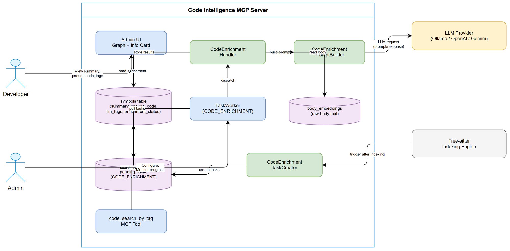
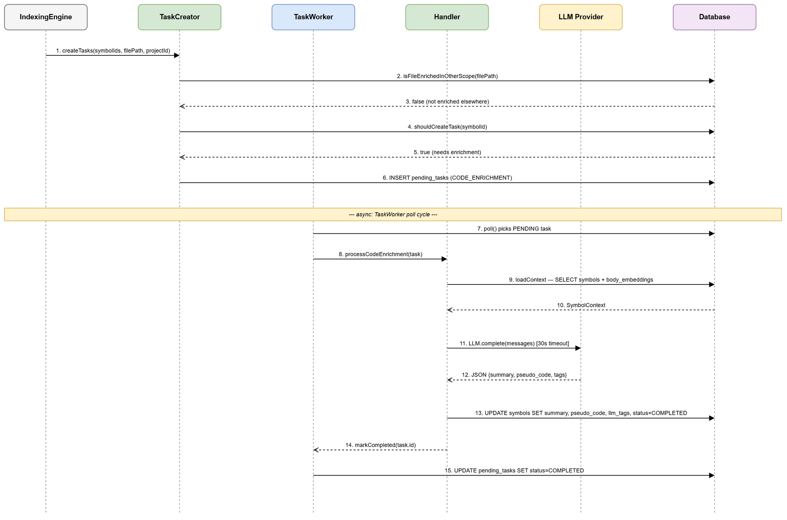

# Functional Specification Document (FSD)

## SA4E — SA4E-106: LLM Enrichment cho Source Code Symbols (Summary, Pseudo Code, Tags)

---

## Document Information

| Field | Value |
|-------|-------|
| Jira Ticket | SA4E-106 |
| Title | LLM Enrichment cho Source Code Symbols (Summary, Pseudo Code, Tags) |
| Author | BA Agent |
| Version | 1.0 |
| Date | 2025-07-22 |
| Status | Draft |
| Related BRD | documents/SA4E-106/BRD.md |

---

## Revision History

| Version | Date | Author | Changes |
|---------|------|--------|---------|
| 1.0 | 2025-07-22 | BA Agent | Initial FSD — translated from BRD v1.0 |

---

## 1. Introduction

### 1.1 Purpose

This FSD specifies the functional behavior of the LLM Enrichment pipeline for source code symbols. It defines use cases, business rules, data specifications, UI changes, error handling, and integration requirements for implementing CODE_ENRICHMENT within the existing TaskWorker infrastructure.

### 1.2 Scope

Extends the background enrichment pipeline to process source code symbols (functions, classes, interfaces, enums) after tree-sitter indexing completes. LLM generates: summary, pseudo code, and semantic tags. Results are persisted and displayed in Admin UI graph info cards.

### 1.3 Definitions & Acronyms

| Term | Definition |
|------|------------|
| Symbol | Code entity extracted by tree-sitter: function, class, interface, enum, method |
| CODE_ENRICHMENT | New TaskType for pending_tasks queue handling symbol enrichment |
| body_embeddings | Table storing raw function body text (as BLOB) per symbol chunk |
| TaskWorker | Background service polling pending_tasks with retry + concurrency |
| PegaLogicNormalizer | Rule-based pseudo code generator for Pega Activity/Data Transform rules |
| Enrichment | Process of adding LLM-generated metadata to a symbol record |
| Content Hash | SHA-256 hash of symbol signature + body used for idempotency checks |

### 1.4 References

| Document | Location |
|----------|----------|
| BRD | documents/SA4E-106/BRD.md |
| LLMService | backend/src/modules/memory/llm/LLMService.ts |
| TaskWorker | backend/src/modules/memory/task-queue/TaskWorker.ts |
| TaskWorkerConfig | backend/src/modules/memory/task-queue/TaskWorkerConfig.ts |
| DB Schema | backend/src/engine/db/schema.ts |
| Admin KB Entries | backend/src/server/routes/admin/kb-entries.ts |

---

## 2. System Overview

### 2.1 System Context Diagram

The system boundary encompasses the Code Intelligence backend server. External actors:

- **Developer** - Views enriched symbol data in Admin UI graph info card
- **Admin** - Configures enrichment settings, monitors progress via status bar
- **LLM Provider** - External service (Ollama local / OpenAI / Gemini / LMStudio) generating enrichment content
- **Tree-sitter Indexer** - Upstream process that populates symbols + body_embeddings tables (trigger)

### 2.2 System Architecture (High-Level)

The enrichment pipeline consists of:

1. **Enrichment Enqueuer** - Triggered after indexing batch completes; creates CODE_ENRICHMENT tasks
2. **TaskWorker** - Existing polling worker; extended with CODE_ENRICHMENT case handler
3. **CodeEnrichmentProcessor** - New processor assembling prompts and parsing LLM responses
4. **symbol_enrichments table** - New persistence layer for enrichment results
5. **Admin UI Info Card** - Extended to display summary, pseudo code, and tags

---

## 3. Functional Requirements

### 3.1 Use Case: UC-01 — Symbol Summary Generation

**Source:** BRD Story 1
**Actor:** Developer (views), System (generates)
**Preconditions:** Tree-sitter indexing completed; symbol exists in symbols table; LLM service available
**Postconditions:** symbol_enrichments record created with summary text; Admin UI displays summary

**Main Flow:**

| Step | Actor | System | Description |
|------|-------|--------|-------------|
| 1 | | Indexer | Tree-sitter indexing batch completes for a set of files |
| 2 | | Enqueuer | System queries newly indexed symbols eligible for enrichment (BR-01) |
| 3 | | Enqueuer | For each eligible symbol, checks content hash against existing enrichment (BR-02) |
| 4 | | Enqueuer | Creates CODE_ENRICHMENT pending_task with symbol_id in payload |
| 5 | | TaskWorker | Polls pending_tasks, picks up CODE_ENRICHMENT task |
| 6 | | Processor | Assembles LLM prompt: system prompt + symbol metadata (name, kind, signature, doc_comment, body) |
| 7 | | LLM | Generates 1-2 sentence summary (50-200 chars) |
| 8 | | Processor | Validates response (BR-03), stores in symbol_enrichments |
| 9 | Developer | | Clicks symbol node in Admin UI graph |
| 10 | | UI | Fetches enrichment data, displays summary in info card |

**Alternative Flows:**

| ID | Condition | Steps |
|----|-----------|-------|
| AF-01 | Symbol already enriched with same content hash | Step 3: skip enqueue, mark as up-to-date |
| AF-02 | Symbol has no body text (interface/enum) | Step 6: prompt uses only signature + doc_comment |
| AF-03 | Enrichment not yet complete when user clicks node | Step 10: show "Enriching..." placeholder with spinner |

**Exception Flows:**

| ID | Condition | Steps |
|----|-----------|-------|
| EF-01 | LLM service unavailable | Step 7: task stays PENDING, retry with backoff (BR-04) |
| EF-02 | LLM returns empty/invalid response | Step 8: mark task FAILED, increment retry_count |
| EF-03 | DB write failure | Step 8: mark task FAILED, log error, retry |
| EF-04 | Max retries exceeded (3) | Task marked FAILED permanently, symbol remains un-enriched |

---

### 3.2 Use Case: UC-02 — Pseudo Code Generation (Non-Pega)

**Source:** BRD Story 2
**Actor:** Developer (views), System (generates)
**Preconditions:** Symbol is kind=function/method; body text exists in body_embeddings (>3 lines); LLM available
**Postconditions:** symbol_enrichments.pseudo_code populated with structured numbered steps

**Main Flow:**

| Step | Actor | System | Description |
|------|-------|--------|-------------|
| 1 | | Processor | During CODE_ENRICHMENT processing, checks symbol kind = function/method |
| 2 | | Processor | Reads body text from body_embeddings (chunk_index=0) |
| 3 | | Processor | Counts body lines; if <= 3, sets pseudo_code = NULL (BR-05) |
| 4 | | Processor | Assembles pseudo code prompt with body text + signature |
| 5 | | LLM | Generates structured pseudo code (numbered steps, max 20 steps) |
| 6 | | Processor | Validates format (BR-06), stores in symbol_enrichments.pseudo_code |
| 7 | Developer | | Views pseudo code tab in Admin UI info card |

**Alternative Flows:**

| ID | Condition | Steps |
|----|-----------|-------|
| AF-04 | Body text > 6000 chars | Step 4: truncate to first 6000 chars (llmChunkSize) before prompting |
| AF-05 | Symbol is class/interface/enum | Step 1: skip pseudo code generation entirely |

**Exception Flows:**

| ID | Condition | Steps |
|----|-----------|-------|
| EF-05 | LLM returns raw code instead of pseudo code | Step 6: validation fails, retry with refined prompt |
| EF-06 | Pseudo code exceeds 2000 chars | Step 6: truncate to 2000 chars at last complete step |

---

### 3.3 Use Case: UC-03 — LLM-Enhanced Pseudo Code for Pega Rules

**Source:** BRD Story 3
**Actor:** Developer (views), System (generates)
**Preconditions:** Symbol is Pega rule type (Activity, DataTransform, DecisionTable, Flow); PegaLogicNormalizer has generated rule-based output
**Postconditions:** symbol_enrichments.pseudo_code_enhanced populated; original preserved in pseudo_code_raw

**Main Flow:**

| Step | Actor | System | Description |
|------|-------|--------|-------------|
| 1 | | Processor | Detects Pega symbol (file extension .pega.json or metadata flag) |
| 2 | | Processor | Retrieves existing logicSummary from PegaLogicNormalizer output |
| 3 | | Processor | Assembles enhancement prompt: rule-based output + Pega class context + rule type |
| 4 | | LLM | Generates enhanced pseudo code with natural language explanations |
| 5 | | Processor | Stores raw in pseudo_code_raw, enhanced in pseudo_code_enhanced |
| 6 | Developer | | Admin UI shows enhanced version by default, toggle for raw |

**Alternative Flows:**

| ID | Condition | Steps |
|----|-----------|-------|
| AF-06 | PegaLogicNormalizer output not available | Step 2: treat as non-Pega, generate from raw body |
| AF-07 | Enhanced output identical to raw | Step 5: store only pseudo_code_raw, leave enhanced NULL |

**Exception Flows:**

| ID | Condition | Steps |
|----|-----------|-------|
| EF-07 | LLM enhancement hallucinates non-existent steps | Validation: compare step count with raw; flag if > 2x raw steps |
| EF-08 | Enhancement fails | Step 5: fall back to raw normalizer output silently |

---

### 3.4 Use Case: UC-04 — Semantic Tag Extraction

**Source:** BRD Story 4
**Actor:** Developer (searches), System (generates)
**Preconditions:** Symbol exists; LLM available
**Postconditions:** symbol_enrichments.tags populated with 3-8 semantic tags

**Main Flow:**

| Step | Actor | System | Description |
|------|-------|--------|-------------|
| 1 | | Processor | During CODE_ENRICHMENT, includes tag extraction in LLM prompt |
| 2 | | LLM | Returns comma-separated semantic tags (3-8 tags) |
| 3 | | Processor | Validates tags (BR-07), normalizes to lowercase-hyphen format |
| 4 | | Processor | Stores in symbol_enrichments.tags |
| 5 | Developer | | Uses code_search tool; tags contribute to relevance scoring |
| 6 | Developer | | Views tags as badges in Admin UI info card |

**Alternative Flows:**

| ID | Condition | Steps |
|----|-----------|-------|
| AF-08 | LLM returns < 3 tags | Step 3: retry prompt once with explicit instruction for more tags |
| AF-09 | LLM returns > 8 tags | Step 3: take first 8 tags by relevance order |

**Exception Flows:**

| ID | Condition | Steps |
|----|-----------|-------|
| EF-09 | Tags contain forbidden generic terms | Step 3: filter out forbidden tags (BR-08), keep remainder |
| EF-10 | All tags invalid after filtering | Mark tag extraction as partial failure, store empty |

---

### 3.5 Use Case: UC-05 — Enrichment Progress Tracking

**Source:** BRD Story 5
**Actor:** Admin
**Preconditions:** CODE_ENRICHMENT tasks exist in pending_tasks
**Postconditions:** Status bar shows real-time progress

**Main Flow:**

| Step | Actor | System | Description |
|------|-------|--------|-------------|
| 1 | Admin | | Opens extension / Admin UI |
| 2 | | Extension | Polls GET /api/admin/taskworker/progress |
| 3 | | Backend | Returns stats including CODE_ENRICHMENT counts |
| 4 | | Extension | Displays "Enriching symbols: {done}/{total} ({pct}%)" in status bar |
| 5 | | Extension | Progress reaches 100% - status bar returns to idle |

**Alternative Flows:**

| ID | Condition | Steps |
|----|-----------|-------|
| AF-10 | No CODE_ENRICHMENT tasks | Step 3: CODE_ENRICHMENT section omitted from response |
| AF-11 | Mixed task types running | Step 4: show both TAG_ENRICHMENT and CODE_ENRICHMENT progress |

---

### 3.6 Use Case: UC-06 — Enrichment Configuration

**Source:** BRD Story 6
**Actor:** Admin
**Preconditions:** Admin UI Settings page accessible
**Postconditions:** Configuration persisted; affects subsequent enrichment behavior

**Main Flow:**

| Step | Actor | System | Description |
|------|-------|--------|-------------|
| 1 | Admin | | Navigates to Settings > Code Enrichment section |
| 2 | Admin | | Toggles enable/disable switch |
| 3 | Admin | | Selects which symbol kinds to enrich |
| 4 | Admin | | Sets priority order and concurrency |
| 5 | Admin | | Clicks Save |
| 6 | | Backend | Validates config, persists to config store |
| 7 | | Backend | Emits CONFIG_CHANGED event; TaskWorker picks up new settings |

**Alternative Flows:**

| ID | Condition | Steps |
|----|-----------|-------|
| AF-12 | Admin disables enrichment mid-processing | Step 7: existing queued tasks remain but no new ones enqueued |
| AF-13 | Invalid concurrency value (0 or > 8) | Step 6: reject with validation error |

**Exception Flows:**

| ID | Condition | Steps |
|----|-----------|-------|
| EF-11 | Config persistence fails | Step 6: show error toast, revert UI to previous state |

---

## 4. Business Rules

| Rule ID | Rule | Source | Applies To |
|---------|------|--------|------------|
| BR-01 | Only symbols of kind function, class, interface, enum, method are eligible for enrichment | BRD Story 1 | UC-01 |
| BR-02 | Idempotency: if symbol content hash unchanged since last enrichment, skip re-enrichment | BRD Story 1 AC-4 | UC-01 |
| BR-03 | Summary must be 50-300 characters, non-empty, English, no placeholder text | BRD Story 1 Validation | UC-01 |
| BR-04 | Failed tasks retry up to 3 times with exponential backoff (2s, 4s, 8s base intervals) | BRD Story 1 AC-5 | All UCs |
| BR-05 | Functions with body <= 3 lines do NOT get pseudo code (pseudo_code = NULL) | BRD Story 2 AC-5 | UC-02 |
| BR-06 | Pseudo code must be structured (numbered steps or indented blocks), max 2000 chars, max 20 steps | BRD Story 2 Validation | UC-02 |
| BR-07 | Each tag: 2-30 chars, lowercase, alphanumeric + hyphen only; 3-8 tags per symbol | BRD Story 4 Validation | UC-04 |
| BR-08 | Forbidden tags: "code", "function", "class", "method", "interface", "enum", "variable" | BRD Story 4 Validation | UC-04 |
| BR-09 | Enrichment is async-only: no LLM calls during user request path (pre-computed results served) | BRD NFR | All UCs |
| BR-10 | Content hash = SHA-256(symbol.signature + body_text). If body unavailable, hash = SHA-256(signature + doc_comment) | BRD Idempotency | UC-01 |
| BR-11 | Pega symbols with existing logicSummary are enriched via enhancement path (UC-03), not standard path | BRD Story 3 | UC-03 |
| BR-12 | When enrichment is disabled via config, no new CODE_ENRICHMENT tasks are enqueued, but existing tasks continue processing | BRD Story 6 | UC-06 |
| BR-13 | Enrichment throughput target: >= 10 symbols/minute with local Ollama 7B model | BRD NFR | All UCs |
| BR-14 | symbol_enrichments stores model name + timestamp for provenance; enables future re-enrichment on model upgrade | BRD NFR | All UCs |

---

## 5. Data Model

### 5.1 Entity: symbol_enrichments (NEW TABLE)

| Attribute | Type | Required | Business Rule | Description |
|-----------|------|----------|---------------|-------------|
| id | INTEGER (PK, AUTOINCREMENT) | Yes | - | Primary key |
| project_id | TEXT | Yes | - | Multi-tenant scope (FK-like to symbols.project_id) |
| symbol_id | INTEGER | Yes | BR-01 | FK to symbols.id (ON DELETE CASCADE) |
| summary | TEXT | Yes | BR-03 | LLM-generated 1-2 sentence summary |
| pseudo_code | TEXT | No | BR-05, BR-06 | Structured pseudo code for functions (NULL for non-functions or trivial bodies) |
| pseudo_code_raw | TEXT | No | BR-11 | Original PegaLogicNormalizer output (Pega symbols only) |
| pseudo_code_enhanced | TEXT | No | BR-11 | LLM-enhanced pseudo code (Pega symbols only) |
| tags | TEXT | Yes | BR-07, BR-08 | Comma-separated semantic tags |
| content_hash | TEXT | Yes | BR-02, BR-10 | SHA-256 hash for idempotency check |
| enriched_by | TEXT | Yes | BR-14 | LLM model identifier (e.g., "qwen2.5:7b-instruct") |
| enriched_at | TEXT | Yes | BR-14 | ISO 8601 timestamp of enrichment completion |
| status | TEXT | Yes | - | Enrichment status: pending, processing, done, failed |
| error_message | TEXT | No | - | Last error message if status = failed |

**Constraints:**
- UNIQUE(project_id, symbol_id) — one enrichment record per symbol per project
- FOREIGN KEY (symbol_id) REFERENCES symbols(id) ON DELETE CASCADE

**Indexes:**
- idx_enrichments_symbol ON symbol_enrichments(symbol_id)
- idx_enrichments_project ON symbol_enrichments(project_id)
- idx_enrichments_status ON symbol_enrichments(project_id, status)
- idx_enrichments_hash ON symbol_enrichments(project_id, symbol_id, content_hash)

### 5.2 Extension: pending_tasks (EXISTING TABLE)

New TaskType enum value added:

| TaskType | Description |
|----------|-------------|
| CODE_ENRICHMENT | Process symbol through LLM for summary + pseudo code + tags |

**Payload schema for CODE_ENRICHMENT tasks:**

`json
{
  "symbol_id": 42,
  "symbol_name": "validateJwtToken",
  "symbol_kind": "function",
  "file_path": "src/auth/jwt.ts",
  "content_hash": "abc123..."
}
`

### 5.3 Extension: code_enrichment_config (NEW — part of admin config store)

| Attribute | Type | Required | Default | Description |
|-----------|------|----------|---------|-------------|
| enabled | BOOLEAN | Yes | true | Enable/disable code enrichment |
| kinds | TEXT (JSON array) | No | ["function","class","interface","enum","method"] | Symbol kinds to enrich |
| priority_order | TEXT (JSON array) | No | ["function","method","class","interface","enum"] | Processing priority |
| concurrency | INTEGER | No | 2 | Max parallel CODE_ENRICHMENT tasks (1-8) |

---

## 6. Processing Logic

### 6.1 Enrichment Enqueue Process

**Trigger:** Tree-sitter indexing batch completes (post-index hook)
**Input:** List of symbol IDs from completed indexing batch
**Output:** CODE_ENRICHMENT tasks in pending_tasks queue

**Processing Steps:**

| Step | Description | Error Handling |
|------|-------------|----------------|
| 1 | Check if code enrichment is enabled (config) | If disabled, exit silently |
| 2 | Query symbols from batch matching configured kinds (BR-01) | Empty result = no-op |
| 3 | For each symbol, compute content_hash (BR-10) | Hash failure = skip symbol, log warning |
| 4 | Check symbol_enrichments for existing record with same hash (BR-02) | If match found, skip |
| 5 | Create pending_task with type=CODE_ENRICHMENT, payload={symbol_id, hash, kind} | DB write failure = log error, continue with next |
| 6 | Emit progress event with total enqueued count | - |

**Sequence Diagram:**

### 6.2 CODE_ENRICHMENT Task Processing

**Trigger:** TaskWorker picks up task with type=CODE_ENRICHMENT
**Input:** PendingTask with payload containing symbol_id
**Output:** symbol_enrichments record with summary + pseudo_code + tags

**Processing Steps:**

| Step | Description | Error Handling |
|------|-------------|----------------|
| 1 | Parse payload, extract symbol_id | Invalid payload = mark FAILED immediately |
| 2 | Fetch symbol metadata from symbols table (name, kind, signature, doc_comment) | Symbol deleted = mark COMPLETED (orphan cleanup) |
| 3 | Fetch body text from body_embeddings (chunk_index=0) | Missing body = proceed without body (summary-only) |
| 4 | Detect if Pega symbol (file extension .pega.json or metadata) | - |
| 5a (non-Pega) | Assemble standard enrichment prompt | - |
| 5b (Pega) | Fetch logicSummary, assemble enhancement prompt | - |
| 6 | Call LLMService.complete() with assembled messages | Timeout (30s) = throw, caught by retry logic |
| 7 | Parse LLM response: extract summary, pseudo_code, tags | Malformed response = retry with refined prompt (once) |
| 8 | Validate all fields against business rules (BR-03, BR-06, BR-07) | Validation fail = retry or mark partial |
| 9 | Upsert into symbol_enrichments (ON CONFLICT update) | DB failure = mark task FAILED, retry |
| 10 | Mark pending_task as COMPLETED | - |

### 6.3 Symbol Enrichment State Machine

**States:**

| State | Description | Transitions |
|-------|-------------|-------------|
| **not_indexed** | Symbol not yet in DB | -> pending (after indexing) |
| **pending** | Task enqueued, awaiting processing | -> processing (TaskWorker picks up) |
| **processing** | LLM call in progress | -> enriched (success) / failed (error) |
| **enriched** | All fields populated successfully | -> pending (content hash changed on re-index) |
| **failed** | Max retries exceeded | -> pending (manual retry via admin) |

---

## 7. Integration Specifications

### 7.1 External System: LLM Provider

| Attribute | Value |
|-----------|-------|
| Purpose | Generate summary, pseudo code, and semantic tags for code symbols |
| Direction | Outbound (request/response) |
| Data Format | JSON (OpenAI-compatible chat completion API) |
| Frequency | On-demand (async, batched via task queue) |
| Providers | Ollama (local), OpenAI, Gemini, LMStudio, Anthropic, OpenCode |

**Data Exchange:**

| Our Data | External Data | Direction | Business Rule |
|----------|--------------|-----------|---------------|
| Symbol metadata (name, kind, signature, body) | LLM prompt (system + user messages) | Send | Prompt assembles all relevant context |
| - | Generated text (summary, pseudo code, tags) | Receive | Parse structured response |
| LLM config (model, temperature, maxTokens) | API parameters | Send | Use admin-configured provider settings |

### 7.2 Internal Integration: Tree-sitter Indexer (Upstream)

| Attribute | Value |
|-----------|-------|
| Purpose | Trigger enrichment after indexing completes |
| Direction | Inbound (event-driven) |
| Mechanism | Post-index hook / EventBus emission |
| Frequency | After each indexing batch |

**Integration point:** After IndexingService completes a batch, emit INDEXING_BATCH_COMPLETE event with list of affected symbol IDs. EnrichmentEnqueuer subscribes to this event.

### 7.3 Internal Integration: Admin UI Graph (Downstream)

| Attribute | Value |
|-----------|-------|
| Purpose | Display enrichment data in symbol info card |
| Direction | Outbound (API response enrichment) |
| Mechanism | Extend existing getCodeSymbolDetail() in kb-entries.ts |
| Frequency | On-demand (user clicks graph node) |

**Integration point:** Existing getCodeSymbolDetail() function in ackend/src/server/routes/admin/kb-entries.ts extended to query symbol_enrichments and include summary, pseudo_code, tags in response.

### 7.4 Internal Integration: Code Search (Downstream)

| Attribute | Value |
|-----------|-------|
| Purpose | Improve search relevance with semantic tags |
| Direction | Read (query enhancement) |
| Mechanism | Join symbol_enrichments.tags in search query scoring |
| Frequency | On every code_search invocation |

---

## 8. UI Specifications

### 8.1 Screen: Admin Graph Info Card (MODIFIED)

The existing symbol info card (triggered by node click in Admin UI graph) is extended with enrichment data.

**New elements added below existing content:**

| No. | Element | Type | Required | Behavior | Validation |
|-----|---------|------|----------|----------|------------|
| 1 | Summary section | Text block | Yes (if enriched) | Shows LLM summary below signature | Truncate at 300 chars |
| 2 | Pseudo Code section | Collapsible block | No | Shows numbered pseudo code steps (non-Pega) or enhanced (Pega) | Max 2000 chars |
| 3 | Pseudo Code toggle | Toggle button | No (Pega only) | Switches between "Enhanced" and "Raw" pseudo code views | - |
| 4 | Tags section | Badge/chip list | Yes (if enriched) | Shows semantic tags as colored badges | Max 8 badges |
| 5 | Enrichment status | Status indicator | Yes | "Enriching..." spinner if pending/processing; hidden if done | - |
| 6 | Model attribution | Small text | Yes (if enriched) | "Generated by {model} at {date}" below content | - |

**Layout order in info card:**
1. Symbol name + kind (existing)
2. Signature (existing)
3. **Summary** (new - always visible if enriched)
4. **Tags** (new - badge row)
5. **Pseudo Code** (new - collapsible, expanded by default)
6. Code body (existing - moved below pseudo code, collapsed by default)
7. **Model attribution** (new - footer)

### 8.2 Screen: Settings Page — Code Enrichment Section (NEW)

| No. | Element | Type | Required | Behavior | Validation |
|-----|---------|------|----------|----------|------------|
| 1 | Section header | H3 | - | "Code Enrichment" | - |
| 2 | Enable toggle | Switch | Yes | Enable/disable code enrichment pipeline | - |
| 3 | Symbol kinds | Multi-select checkboxes | No | Select which kinds to enrich | At least 1 if enabled |
| 4 | Priority order | Drag-and-drop list | No | Reorder enrichment priority | - |
| 5 | Concurrency | Number input | No | Parallel task limit | 1-8, integer |
| 6 | Save button | Button | - | Persists config, shows success toast | - |

### 8.3 Screen: Status Bar — Enrichment Progress (MODIFIED)

Extend existing TaskWorker progress display:

| No. | Element | Type | Behavior |
|-----|---------|------|----------|
| 1 | Progress text | Inline text | "Enriching symbols: {done}/{total} ({pct}%)" |
| 2 | Progress bar | Linear progress | Fills proportionally to completion |
| 3 | Combined view | Stacked text | If TAG_ENRICHMENT also running: show both on separate lines |

---

## 9. API Contracts (Functional View)

### 9.1 GET /api/admin/taskworker/progress (EXTENDED)

**Purpose:** Return enrichment progress for status bar display

**Output Data (extended):**

| Field | Type | Description |
|-------|------|-------------|
| TAG_ENRICHMENT.pending | number | Pending tag enrichment tasks |
| TAG_ENRICHMENT.completed | number | Completed tag enrichment tasks |
| TAG_ENRICHMENT.total | number | Total tag enrichment tasks |
| CODE_ENRICHMENT.pending | number | Pending code enrichment tasks |
| CODE_ENRICHMENT.completed | number | Completed code enrichment tasks |
| CODE_ENRICHMENT.total | number | Total code enrichment tasks |
| CODE_ENRICHMENT.failed | number | Failed code enrichment tasks |
| isRunning | boolean | Whether TaskWorker is actively processing |

### 9.2 GET /api/admin/kb-entries/:id (EXTENDED — code symbol detail)

**Purpose:** Return enriched symbol data for Admin UI info card

**Additional output fields when id starts with "code:":**

| Field | Type | Description |
|-------|------|-------------|
| enrichment.summary | string or null | LLM-generated summary |
| enrichment.pseudoCode | string or null | Pseudo code (enhanced for Pega, standard for others) |
| enrichment.pseudoCodeRaw | string or null | Raw normalizer output (Pega only) |
| enrichment.tags | string[] | Semantic tags array |
| enrichment.status | string | "pending" / "processing" / "enriched" / "failed" |
| enrichment.enrichedBy | string or null | Model name |
| enrichment.enrichedAt | string or null | ISO timestamp |

**Business Error Scenarios:**

| Scenario | User Message | Trigger Condition |
|----------|-------------|-------------------|
| Symbol not found | "Symbol not found" | symbol_id deleted after task enqueued |
| Enrichment pending | Shows "Enriching..." in UI | Status = pending or processing |
| Enrichment failed | Shows last error tooltip | Status = failed |

### 9.3 POST /api/admin/config/code-enrichment (NEW)

**Purpose:** Save code enrichment configuration

**Input Parameters:**

| Parameter | Type | Required | Business Rule | Description |
|-----------|------|----------|---------------|-------------|
| enabled | boolean | Yes | BR-12 | Enable/disable enrichment |
| kinds | string[] | No | BR-01 | Symbol kinds to enrich |
| priority_order | string[] | No | - | Processing priority |
| concurrency | number | No | - | Parallel task limit (1-8) |

**Output Data:**

| Field | Type | Description |
|-------|------|-------------|
| success | boolean | Whether config was saved |
| config | object | Current config state after save |

**Business Error Scenarios:**

| Scenario | User Message | Trigger Condition |
|----------|-------------|-------------------|
| Invalid concurrency | "Concurrency must be 1-8" | concurrency < 1 or > 8 |
| Empty kinds with enabled=true | "At least one symbol kind required when enabled" | kinds=[] and enabled=true |

### 9.4 POST /api/admin/enrichment/retry (NEW)

**Purpose:** Retry failed enrichment for specific symbols or all failed

**Input Parameters:**

| Parameter | Type | Required | Description |
|-----------|------|----------|-------------|
| symbol_ids | number[] | No | Specific symbols to retry (empty = retry all failed) |

**Output Data:**

| Field | Type | Description |
|-------|------|-------------|
| retried | number | Count of tasks re-enqueued |

---

## 10. Security Requirements

### 10.1 Authentication & Authorization

| Role | Permissions | Screens/Features |
|------|-------------|-------------------|
| Developer | Read enrichment data | View info card, code search with tags |
| Admin | Read + Configure enrichment | Settings page, retry failed, view progress |

### 10.2 Data Sensitivity Classification

| Data Type | Classification | Business Requirement |
|-----------|---------------|---------------------|
| Source code bodies | Internal | Sent to LLM provider only (never logged in full) |
| LLM prompts | Internal | Stay within configured provider (local or user's API key) |
| Enrichment results | Internal | Stored locally in project DB, no external transmission |
| API keys | Confidential | Never included in enrichment payloads or logs |

### 10.3 Audit Trail

| Event | Logged Fields | Retention | Business Reason |
|-------|--------------|-----------|-----------------|
| Enrichment completed | symbol_id, model, timestamp | Indefinite (in DB) | Provenance tracking |
| Enrichment failed | symbol_id, error, retry_count | Until successful retry | Debugging |
| Config changed | setting_key, old_value, new_value | 30 days | Audit compliance |

---

## 11. Non-Functional Requirements

| Category | Business Requirement | Acceptance Criteria |
|----------|---------------------|---------------------|
| Performance | Enrichment does not slow indexing | Indexing completes before enrichment starts (decoupled) |
| Performance | Info card loads instantly | < 200ms response (pre-computed, no real-time LLM call) |
| Performance | Throughput | >= 10 symbols/minute with local Ollama 7B model |
| Scalability | Large repo support | Handle 10,000+ symbols via batching and priority ordering |
| Reliability | Task retry | Failed tasks retry up to 3 times with exponential backoff |
| Reliability | Idempotency | Re-indexing unchanged symbols does not duplicate tasks |
| Availability | Graceful degradation | LLM unavailable = system continues; symbols searchable without enrichment |
| Observability | Progress tracking | Real-time progress via existing status bar mechanism |
| Data Integrity | Provenance | Store model name + timestamp; supports future re-enrichment |

---

## 12. Error Handling (User-Facing)

### 12.1 Error Scenarios

| Scenario | Severity | User Message | Expected Behavior |
|----------|----------|-------------|-------------------|
| LLM provider unreachable | Warning | "AI enrichment paused - LLM unavailable" | Tasks remain queued, auto-retry when available |
| LLM timeout (>30s) | Warning | None (background) | Task retries with exponential backoff |
| Malformed LLM response | Warning | None (background) | Retry once with refined prompt; then mark failed |
| DB write failure | Critical | None (background, logged) | Task marked FAILED, admin can view in progress panel |
| Symbol deleted during processing | Info | None | Task marked COMPLETED (orphan cleanup) |
| All retries exhausted | Warning | "Enrichment failed" tooltip on symbol | Admin can manually retry via API |
| Enrichment disabled but tasks queued | Info | None | Existing tasks continue processing; no new tasks created |
| Invalid config save | Error | Specific field validation message | UI shows inline error, does not save |

### 12.2 Notification Requirements

| Event | Who is Notified | Channel | Timing |
|-------|----------------|---------|--------|
| Enrichment batch complete | Admin | Status bar update | Immediate (via progress polling) |
| Enrichment failures > 10% | Admin | Log warning | After batch processing cycle |
| LLM unavailable > 5 minutes | Admin | Status bar warning | After 5 consecutive failed health checks |

---

## 13. Testing Considerations

### 13.1 Test Scenarios

| ID | Scenario | Input | Expected Output | Priority |
|----|----------|-------|-----------------|----------|
| TC-01 | Enqueue after indexing | Index 5 functions | 5 CODE_ENRICHMENT tasks created | High |
| TC-02 | Idempotent skip | Re-index unchanged symbol | No new task created | High |
| TC-03 | Summary generation | Function with 10-line body | Summary 50-300 chars, English | High |
| TC-04 | Pseudo code generation | Function with >3 line body | Numbered steps, max 20 | High |
| TC-05 | Trivial function skip | Function with 2-line body | pseudo_code = NULL | Medium |
| TC-06 | Tag extraction | Any eligible symbol | 3-8 valid tags, no forbidden terms | High |
| TC-07 | Pega enhancement | Pega Activity with logicSummary | Enhanced output stored separately | Medium |
| TC-08 | LLM timeout handling | LLM responds after 35s | Task retried, not marked failed immediately | High |
| TC-09 | Max retries exceeded | 3 consecutive failures | Task marked FAILED permanently | High |
| TC-10 | Progress API | 50 tasks, 25 done | Response shows 50% progress | Medium |
| TC-11 | Config disable | Disable enrichment, index files | No new tasks enqueued | Medium |
| TC-12 | Info card display | Click enriched symbol | Summary + tags + pseudo code shown | High |
| TC-13 | Concurrent processing | concurrency=3, 10 tasks | 3 tasks processed in parallel | Medium |
| TC-14 | Content hash change | Modify function body, re-index | New enrichment task created | High |
| TC-15 | Large repo batch | 1000 symbols indexed | Tasks created in batches, no timeout | High |

---

## 14. Appendix

### Diagram Index

| # | Diagram | Image | Source (editable) |
|---|---------|-------|-------------------|
| 1 | System Context | [system-context.png](diagrams/system-context.png) | [system-context.drawio](diagrams/system-context.drawio) |
| 2 | Enrichment Sequence | [sequence-enrichment.png](diagrams/sequence-enrichment.png) | [sequence-enrichment.drawio](diagrams/sequence-enrichment.drawio) |
| 3 | Symbol State Machine | [state-symbol.png](diagrams/state-symbol.png) | [state-symbol.drawio](diagrams/state-symbol.drawio) |

### Change Log from BRD

- BRD Story 3 (Pega Enhancement): FSD clarifies that enhanced output is stored in separate column pseudo_code_enhanced, not overwriting pseudo_code
- BRD NFR "No impact on indexing speed": FSD specifies decoupled via EventBus event after indexing completes
- BRD "Content hash comparison": FSD specifies SHA-256 of signature + body as the hash algorithm
- BRD "Configurable enable/disable": FSD adds API contract for config persistence and specifies behavior when disabled mid-processing
