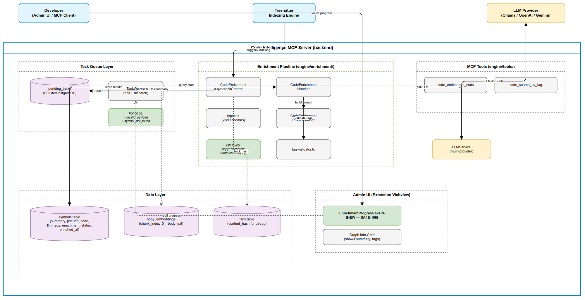
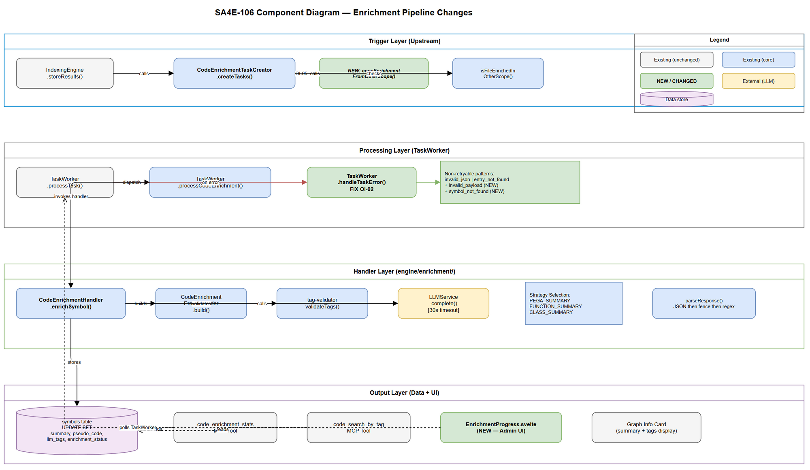

# Technical Design Document (TDD)

## SA4E-106: LLM Enrichment cho Source Code Symbols

---

## Document Information

| Field | Value |
|-------|-------|
| Jira Ticket | SA4E-106 |
| Title | LLM Enrichment cho Source Code Symbols (Summary, Pseudo Code, Tags) |
| Author | SA Agent – Solution Architect |
| Version | 1.0 |
| Date | 2025-07-23 |
| Status | Draft |
| Related FSD | documents/SA4E-106/FSD.md |
| Related BRD | documents/SA4E-106/BRD.md |

---

## Revision History

| Version | Date | Author | Changes |
|---------|------|--------|---------|
| 1.0 | 2025-07-23 | SA Agent | Initial TDD — architecture, fixes (OI-02, OI-05), MCP tool, Admin UI |

---

## 1. Architecture Overview

### 1.1 System Context

The LLM Enrichment pipeline extends the Code Intelligence MCP Server. It operates as an async background processing subsystem that takes indexed code symbols and generates AI-powered metadata (summary, pseudo code, tags) via LLM providers.



### 1.2 Key Design Decisions

| # | Decision | Rationale |
|---|----------|-----------|
| AD-01 | Async task queue (pending_tasks) | Decouples enrichment from indexing; non-blocking (BR-01) |
| AD-02 | Strategy pattern for prompt selection | Clean extension for new symbol kinds (Pega, future) |
| AD-03 | 3-tier response parsing fallback | LLM output is non-deterministic; maximize extraction success |
| AD-04 | Cross-scope dedup at file level | Avoids redundant LLM calls for shared libraries across projects |
| AD-05 | Handler injection via setter | Enables late binding; graceful degradation if handler unavailable |
| AD-06 | COALESCE on UPDATE for pseudo_code | Prevents overwriting PegaLogicNormalizer output with null |

### 1.3 Component Interaction



---

## 2. Architecture — Enrichment Pipeline

### 2.1 Flow Summary

```
IndexingEngine.storeResults()
  -> CodeEnrichmentTaskCreator.createTasks()
    -> INSERT pending_tasks (CODE_ENRICHMENT)
      -> TaskWorker.poll()
        -> TaskWorker.processCodeEnrichment()
          -> CodeEnrichmentHandler.enrichSymbol()
            -> loadContext() -> selectStrategy() -> PromptBuilder.build()
            -> LLMService.complete() [30s timeout]
            -> parseResponse() -> validateTags() -> storeResults()
```

### 2.2 Existing Components (Already Implemented)

| Component | Location | Status |
|-----------|----------|--------|
| CodeEnrichmentHandler | `backend/src/engine/enrichment/CodeEnrichmentHandler.ts` | Exists (SA4E-107) |
| CodeEnrichmentTaskCreator | `backend/src/engine/enrichment/CodeEnrichmentTaskCreator.ts` | Exists (SA4E-107) |
| CodeEnrichmentPromptBuilder | `backend/src/engine/enrichment/CodeEnrichmentPromptBuilder.ts` | Exists (SA4E-107) |
| tag-validator | `backend/src/engine/enrichment/tag-validator.ts` | Exists (SA4E-107) |
| types.ts | `backend/src/engine/enrichment/types.ts` | Exists (SA4E-107) |
| code_enrichment_stats MCP tool | `backend/src/engine/tools/code-enrichment-stats.ts` | Exists (SA4E-107) |
| code_search_by_tag MCP tool | `backend/src/engine/tools/code-search-by-tag.ts` | Exists (SA4E-107) |
| TaskWorker dispatch | `backend/src/modules/memory/task-queue/TaskWorker.ts` | Fixed (SA4E-104) |
| Handler injection wiring | DI container / setup | Fixed (SA4E-104) |
| Pega symbol kinds | `backend/src/modules/pega/pega-mapping.ts` | Migrated (SA4E-171) |

### 2.3 What THIS Ticket Changes

| Change | Component | Type |
|--------|-----------|------|
| Fix OI-02: Non-retryable error patterns | TaskWorker.handleTaskError() | Bug fix |
| Fix OI-05: Cross-scope dedup copies enrichment data | CodeEnrichmentTaskCreator | Enhancement |
| Verify end-to-end flow (SA4E-104 fix) | Integration test | Verification |
| Admin UI enrichment progress display | New Svelte component | New feature |
| Ensure Pega symbols work end-to-end | Integration test | Verification |

---

## 3. API Design

### 3.1 Existing MCP Tool: code_enrichment_stats

Already implemented at `backend/src/engine/tools/code-enrichment-stats.ts`.

**Tool Definition:**

| Parameter | Type | Required | Default | Description |
|-----------|------|----------|---------|-------------|
| __projectId | string | No | injected | Tenant scope |

**Response Format:**

```
Code Enrichment Stats
  Total symbols: 1234
  Completed: 980 (79%)
  Pending: 150
  Failed: 24
  Not started: 80
```

**No changes needed** — tool already registered and functional.

### 3.2 Existing MCP Tool: code_search_by_tag

Already implemented at `backend/src/engine/tools/code-search-by-tag.ts`.

**No changes needed.**

### 3.3 Existing Admin API: TaskWorker Progress

`GET /api/admin/taskworker/progress` — already returns CODE_ENRICHMENT progress via `TaskWorker.getProgress()`.

**Enhancement needed:** Admin UI must display enrichment-specific progress (see Section 5).

---

## 4. Class/Module Design — Changes Required

### 4.1 Fix OI-02: handleTaskError Non-Retryable Patterns

**File:** `backend/src/modules/memory/task-queue/TaskWorker.ts`

**Current Code (line ~500):**

```typescript
private async handleTaskError(task: PendingTask, err: Error): Promise<void> {
  this.consecutiveErrors++;
  const nonRetryable = err.message.includes('invalid_json')
    || err.message.includes('entry_not_found');
  // ...
}
```

**Problem:** `CodeEnrichmentHandler` throws `invalid_payload` and `symbol_not_found` but these patterns are NOT in the non-retryable check. This causes pointless retries of permanently broken tasks.

**Fix — Add CODE_ENRICHMENT non-retryable patterns:**

```typescript
private async handleTaskError(task: PendingTask, err: Error): Promise<void> {
  this.consecutiveErrors++;
  const nonRetryable = err.message.includes('invalid_json')
    || err.message.includes('entry_not_found')
    || err.message.includes('invalid_payload')
    || err.message.includes('symbol_not_found');
  if (nonRetryable || task.retry_count + 1 >= task.max_retries) {
    await this.repo.markFailed(task.id, err.message);
  } else {
    await this.repo.markFailed(task.id, err.message);
    await this.repo.resetForRetry(task.id);
  }
}
```

**Impact:** Low risk — purely additive check. Existing TAG_ENRICHMENT and VECTOR_EMBEDDING tasks use `invalid_json` and `entry_not_found`, which remain unchanged.

---

### 4.2 Fix OI-05: Cross-Scope Dedup Should Copy Enrichment Data

**File:** `backend/src/engine/enrichment/CodeEnrichmentTaskCreator.ts`

**Current Behavior:** When cross-scope dedup detects that the same file (by content_hash) is already enriched in another project, it returns 0 (skips task creation). The symbols in the current project remain un-enriched — their `summary`, `pseudo_code`, `llm_tags` remain NULL.

**Problem:** Symbols in the new project have no enrichment data even though identical content was already processed.

**Fix — Copy enrichment data from source scope:**

```typescript
/**
 * Copy enrichment data from an already-enriched scope to current project's symbols.
 * Matches by file content_hash + symbol name + kind.
 * @param filePath - Relative file path in current project
 * @param projectId - Current project ID
 * @returns Number of symbols updated
 */
private async copyEnrichmentFromOtherScope(
  filePath: string,
  projectId: string,
): Promise<number> {
  // Find source file with same content_hash in another project
  const currentFile = await this.adapter.getAsync<{ content_hash: string }>(
    'SELECT content_hash FROM files WHERE relative_path = ? AND project_id = ?',
    [filePath, projectId],
  );
  if (!currentFile?.content_hash) return 0;

  const sourceFile = await this.adapter.getAsync<{ id: number }>(
    `SELECT f.id FROM files f
     JOIN symbols s ON s.file_id = f.id
     WHERE f.content_hash = ?
     AND f.project_id != ?
     AND s.enrichment_status = 'COMPLETED'
     LIMIT 1`,
    [currentFile.content_hash, projectId],
  );
  if (!sourceFile) return 0;

  // Get target file ID in current project
  const targetFile = await this.adapter.getAsync<{ id: number }>(
    'SELECT id FROM files WHERE relative_path = ? AND project_id = ?',
    [filePath, projectId],
  );
  if (!targetFile) return 0;

  // Get enriched source symbols
  const sourceSymbols = await this.adapter.allAsync<{
    name: string; kind: string; summary: string | null;
    pseudo_code: string | null; llm_tags: string | null;
  }>(
    `SELECT name, kind, summary, pseudo_code, llm_tags FROM symbols
     WHERE file_id = ? AND enrichment_status = 'COMPLETED'`,
    [sourceFile.id],
  );

  let copied = 0;
  for (const src of sourceSymbols) {
    if (!src.summary) continue;
    const result = await this.adapter.runAsync(
      `UPDATE symbols SET
         summary = ?,
         pseudo_code = COALESCE(?, pseudo_code),
         llm_tags = ?,
         enrichment_status = 'COMPLETED',
         enriched_at = datetime('now')
       WHERE file_id = ? AND name = ? AND kind = ?
         AND (enrichment_status IS NULL OR enrichment_status != 'COMPLETED')`,
      [src.summary, src.pseudo_code, src.llm_tags, targetFile.id, src.name, src.kind],
    );
    if (result?.changes && result.changes > 0) copied++;
  }

  return copied;
}
```

**Updated `createTasks` method:**

```typescript
async createTasks(
  symbolIds: Map<string, number>,
  filePath: string,
  projectId: string,
): Promise<number> {
  if (symbolIds.size === 0) return 0;

  // Cross-scope dedup: copy enrichment data instead of just skipping
  const enrichedElsewhere = await this.isFileEnrichedInOtherScope(filePath, projectId);
  if (enrichedElsewhere) {
    const copied = await this.copyEnrichmentFromOtherScope(filePath, projectId);
    this.logger.debug({ filePath, projectId, copied },
      '[enrichment] Cross-scope copy — enrichment data copied from another scope');
    return 0; // No new LLM tasks needed
  }

  // ... rest of method unchanged ...
}
```

**Impact:** Medium — introduces UPDATE queries during indexing. Bounded to symbols in a single file (typically <50), so performance impact is minimal. Uses COALESCE to preserve existing PegaLogicNormalizer pseudo_code.

---

### 4.3 Admin UI: Enrichment Progress Component

**New File:** `extension/src/webview/components/EnrichmentProgress.svelte`

**Design:**
- Polls `/api/admin/taskworker/progress` (same endpoint status bar uses)
- Shows enrichment-specific progress: completed/total, percentage bar
- Integrates into existing Admin UI status area

**Component Interface:**

```typescript
interface EnrichmentProgressState {
  total: number;
  completed: number;
  pending: number;
  failed: number;
  percentage: number;
  isProcessing: boolean;
}
```

**Polling Strategy:**
- Poll every 5 seconds while `isProcessing = true`
- Stop polling when `pending = 0 AND isProcessing = false`
- Uses existing Admin UI polling mechanism (matches BR-20)

**Display:**
- Progress bar with percentage
- Text: "Enriching symbols: {completed}/{total} ({percentage}%)"
- Failed count shown if > 0 (warning color)
- Hidden when no enrichment tasks exist

---

### 4.4 End-to-End Flow Verification (SA4E-104)

**What SA4E-104 fixed:** CodeEnrichmentHandler was not injected into TaskWorker. The `setCodeEnrichmentHandler()` call was missing from the DI wiring.

**Verification scope:**
1. TaskWorker receives CODE_ENRICHMENT task and dispatches to handler (not resetForRetry)
2. Handler parses payload, loads context, calls LLM, stores results
3. Symbols table updated with summary + pseudo_code + llm_tags + enrichment_status

**Test file:** `backend/src/engine/enrichment/__tests__/enrichment-e2e.test.ts`

---

### 4.5 Pega Symbol Enrichment Verification

**What SA4E-171 did:** Migrated Pega rules to symbols table. `isPegaKind()` now resolves 16+ Pega-specific kinds.

**Verification scope:**
1. `CodeEnrichmentTaskCreator` correctly identifies Pega symbols via `isPegaKind()`
2. `workspaceType: 'pega'` is set in task payload
3. `CodeEnrichmentHandler.selectStrategy()` returns `PEGA_SUMMARY` for Pega kinds
4. `CodeEnrichmentPromptBuilder.build()` includes pegaClass + pegaRuleset in prompt
5. Existing pseudo_code (from PegaLogicNormalizer) preserved via COALESCE

---

## 5. Error Handling Design

### 5.1 Error Classification (After OI-02 Fix)

| Error Pattern | Source | Retryable | Action |
|---------------|--------|-----------|--------|
| `invalid_json` | TAG_ENRICHMENT payload parse | No | markFailed immediately |
| `entry_not_found` | Knowledge entry lookup | No | markFailed immediately |
| `invalid_payload` | CodeEnrichmentPayloadSchema.safeParse() | No | markFailed immediately |
| `symbol_not_found` | Symbol lookup in DB | No | markFailed immediately |
| `llm_timeout` | LLM 30s timeout exceeded | Yes | Retry up to 3 times |
| Any other Error | LLM network, unexpected | Yes | Retry up to 3 times |

### 5.2 Retry Strategy

- **Mechanism:** `resetForRetry()` increments `retry_count`, resets status to PENDING
- **Max retries:** 3 (configurable via `max_retries` column)
- **Backoff:** Implicit — TaskWorker poll interval (default 5s) provides natural spacing
- **Exhaustion:** Task marked FAILED with error message; visible in `code_enrichment_stats`

### 5.3 Graceful Degradation

| Scenario | Behavior |
|----------|----------|
| LLM provider down | Tasks accumulate as PENDING; retry on next poll |
| Handler not injected | Task reset for retry (SA4E-104 fixed the root cause) |
| DB query failure in loadContext | Error propagates then retried as transient |
| TaskCreator failure | Non-blocking: IndexingEngine continues (BR-01) |

---

## 6. Data Model — No Schema Changes

All required columns already exist (added by SA4E-107 migration):
- `symbols`: summary, pseudo_code, llm_tags, enrichment_status, enriched_at
- `pending_tasks`: project_id (added by SA4E-164)

**Indexes already exist:**
- `idx_symbols_enrichment_status`
- `idx_symbols_project_enrichment`
- `idx_pending_tasks_project_status`

**No new migrations needed for SA4E-106.**

---

## 7. Security Design

### 7.1 Data Privacy

| Concern | Mitigation |
|---------|-----------|
| Source code sent to LLM | Body text truncated to 4000 tokens; only sent to user-configured provider |
| LLM API keys | Stored in admin settings (encrypted at rest); never included in prompts |
| Cross-scope data copy | Only copies AI-generated metadata (summary/tags), not source code |

### 7.2 Input Validation

| Component | Validation | Tool |
|-----------|-----------|------|
| Task payload | Zod schema (CodeEnrichmentPayloadSchema.safeParse) | Zod |
| LLM response tags | validateTags() — category allowlist + regex | Custom |
| MCP tool input | Zod schema at tool registration | MCP SDK |

### 7.3 Injection Prevention

- System prompt and user prompt are constructed programmatically (no user input in system role)
- Symbol content is placed in user message only, bounded by prompt template structure
- Tag values validated against `/^[a-z0-9-]+$/` — no special characters

---

## 8. Implementation Checklist

### 8.1 Must-Do (This Ticket)

| # | Task | File | Type | Priority |
|---|------|------|------|----------|
| 1 | Add `invalid_payload` + `symbol_not_found` to non-retryable patterns | `backend/src/modules/memory/task-queue/TaskWorker.ts` | Fix (OI-02) | High |
| 2 | Implement `copyEnrichmentFromOtherScope()` | `backend/src/engine/enrichment/CodeEnrichmentTaskCreator.ts` | Fix (OI-05) | High |
| 3 | Update `createTasks()` to call copy instead of skip | `backend/src/engine/enrichment/CodeEnrichmentTaskCreator.ts` | Fix (OI-05) | High |
| 4 | Create EnrichmentProgress Svelte component | `extension/src/webview/components/EnrichmentProgress.svelte` | New | Medium |
| 5 | Write integration test: end-to-end enrichment flow | `backend/src/engine/enrichment/__tests__/enrichment-e2e.test.ts` | Test | High |
| 6 | Write integration test: Pega symbol enrichment | `backend/src/engine/enrichment/__tests__/pega-enrichment.test.ts` | Test | Medium |
| 7 | Write unit test: handleTaskError non-retryable patterns | `backend/src/modules/memory/task-queue/__tests__/TaskWorker.test.ts` | Test | High |
| 8 | Write unit test: cross-scope copy logic | `backend/src/engine/enrichment/__tests__/CodeEnrichmentTaskCreator.test.ts` | Test | Medium |

### 8.2 Verification (Already Working After SA4E-104)

| # | Verification | Method |
|---|-------------|--------|
| V-1 | Handler injected into TaskWorker | Check DI wiring code |
| V-2 | CODE_ENRICHMENT task dispatches to handler | Run existing tests |
| V-3 | code_enrichment_stats tool returns valid data | Manual MCP call |
| V-4 | code_search_by_tag returns enriched symbols | Manual MCP call |

### 8.3 Files Modified Summary

| File | Change |
|------|--------|
| `backend/src/modules/memory/task-queue/TaskWorker.ts` | +2 lines in handleTaskError |
| `backend/src/engine/enrichment/CodeEnrichmentTaskCreator.ts` | +~50 lines (copyEnrichmentFromOtherScope + createTasks update) |
| `extension/src/webview/components/EnrichmentProgress.svelte` | New file (~80 lines) |
| `backend/src/engine/enrichment/__tests__/enrichment-e2e.test.ts` | New test file |
| `backend/src/engine/enrichment/__tests__/pega-enrichment.test.ts` | New test file |

---

## 9. Non-Functional Requirements

| Category | Target | How Achieved |
|----------|--------|-------------|
| Performance | >=10 symbols/min (Ollama 7B) | Async queue; no blocking |
| Performance | Indexing unaffected | try/catch in IndexingEngine (BR-01) |
| Scalability | 10,000+ symbols | Batch creation (500/batch) |
| Reliability | Retry transient failures | 3 retries with backoff |
| Reliability | No retry permanent failures | OI-02 fix: invalid_payload, symbol_not_found |
| Observability | Progress tracking | code_enrichment_stats tool + Admin UI |
| Data Integrity | No data loss on dedup | OI-05 fix: copy instead of skip |

---

## 10. Open Issues Resolved by This TDD

| OI | Issue | Resolution |
|----|-------|-----------|
| OI-02 | handleTaskError does not recognize invalid_payload / symbol_not_found as non-retryable | Add patterns to nonRetryable check (Section 4.1) |
| OI-05 | Cross-scope dedup skips tasks but leaves symbols un-enriched | Copy enrichment data from source scope (Section 4.2) |

---

## Appendix A: Diagram Index

| # | Diagram | Image | Source (editable) |
|---|---------|-------|-------------------|
| 1 | Architecture Overview | [architecture.png](diagrams/architecture.png) | [architecture.drawio](diagrams/architecture.drawio) |
| 2 | Component Diagram | [component.png](diagrams/component.png) | [component.drawio](diagrams/component.drawio) |
