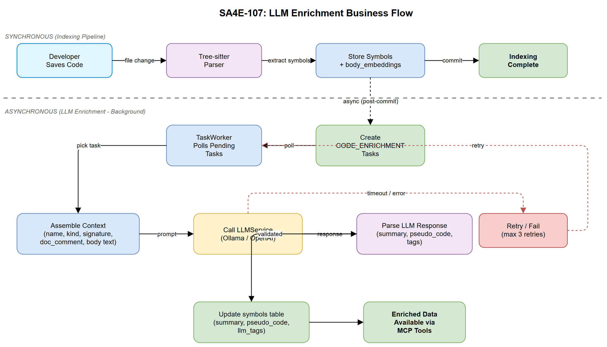
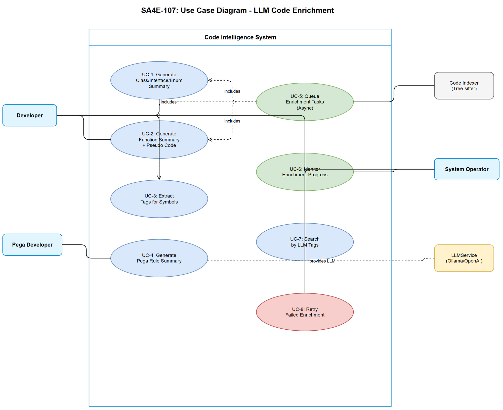

# Business Requirements Document (BRD)

## SA4E — SA4E-107: LLM Enrichment cho Source Code Index

---

## Document Information

| Field | Value |
|-------|-------|
| Jira Ticket | SA4E-107 |
| Title | LLM Enrichment cho Source Code Index |
| Author | BA Agent |
| Version | 1.0 |
| Date | 2025-07-27 |
| Status | Draft |

---

## Author Tracking

| Role | Name - Position | Responsibility |
|------|-----------------|----------------|
| Author | BA Agent – Business Analyst | Create document |
| Peer Reviewer | TA Agent – Technical Architect | Review document |

---

## Revision History

| Version | Date | Author | Changes |
|---------|------|--------|---------|
| 1.0 | 2025-07-27 | BA Agent | Initiate document — auto-generated from Jira ticket SA4E-107 |

---

## 1. Introduction

### 1.1 Scope

Hiện tại backend source code indexing (Tree-sitter parser → symbols → body_embeddings) **không gọi LLM** để làm giàu (enrich) dữ liệu cho code symbols. Ticket SA4E-107 yêu cầu bổ sung LLM enrichment cho source code symbols tương tự cách đã triển khai cho KB documents (TaskWorker `TAG_ENRICHMENT` — SA4E-44/SA4E-47).

Mục tiêu là tăng chất lượng tìm kiếm semantic và cung cấp natural language summary cho developers khi explore codebase thông qua Code Intelligence tools.

### 1.2 Out of Scope

- Thay đổi Tree-sitter parser hoặc quy trình indexing hiện tại
- Thay đổi LLMService core (Ollama/OpenAI adapters)
- Real-time LLM enrichment trong indexing pipeline (enrichment phải async)
- UI/Frontend hiển thị enrichment data (sẽ là ticket riêng)
- Re-enrichment toàn bộ codebase đã index (chỉ enrich symbols mới/thay đổi)

### 1.3 Preliminary Requirement

- LLMService (Ollama/OpenAI adapters) đã hoạt động — SA4E-47
- TaskWorker pattern đã chạy ổn định cho KB TAG_ENRICHMENT — SA4E-44
- `body_embeddings` table có dữ liệu raw function body text
- `symbols` table có: name, kind, signature, doc_comment

---

## 2. Business Requirements

### 2.1 High Level Process Map

Khi source code được index (file mới hoặc thay đổi), sau khi symbols và body_embeddings được lưu, hệ thống tạo pending tasks với type `CODE_ENRICHMENT`. TaskWorker poll các tasks này, gọi LLM để generate summary, pseudo code, và tags, rồi cập nhật lại vào `symbols` table.

### 2.2 List of User Stories / Use Cases

| # | Story / Use Case | Priority | Source Ticket |
|---|------------------|----------|---------------|
| 1 | As a developer, I want class/interface/enum symbols to have natural language summaries so that I can quickly understand their purpose without reading full code | MUST HAVE | SA4E-107 |
| 2 | As a developer, I want function/method symbols to have concise summaries and structured pseudo code so that I can understand logic flow without diving into implementation | MUST HAVE | SA4E-107 |
| 3 | As a developer, I want code symbols to be tagged with categories (design-pattern, business-domain, technical-concern) so that I can discover related code by semantic meaning | MUST HAVE | SA4E-107 |
| 4 | As a Pega developer, I want Pega rules to have LLM-generated natural language summaries augmenting existing template-based pseudo code so that business logic is easier to understand | SHOULD HAVE | SA4E-107 |
| 5 | As a system operator, I want LLM enrichment to run asynchronously without blocking the indexing pipeline so that code navigation remains responsive during indexing | MUST HAVE | SA4E-107 |

---

### 2.3 Details of User Stories

---

#### Business Flow

**Step 1:** Developer saves/modifies source code files in workspace.

**Step 2:** Code Indexer (Tree-sitter) parses files, extracts symbols, stores in `symbols` table, and stores function body text as embeddings in `body_embeddings`.

**Step 3:** After successful symbol storage, Indexer creates `CODE_ENRICHMENT` pending tasks for each new/modified symbol.

**Step 4:** TaskWorker (background poller) picks up `CODE_ENRICHMENT` tasks.

**Step 5:** TaskWorker assembles context (symbol name, kind, signature, doc_comment, body text from body_embeddings) and calls LLMService.

**Step 6:** LLM returns structured response: summary, pseudo_code (if applicable), tags.

**Step 7:** TaskWorker persists enrichment results into `symbols` table (new columns: `summary`, `pseudo_code`, `llm_tags`).

**Step 8:** Enriched data available for semantic search, code exploration tools, and MCP tool responses.

> **Note:** Steps 1-2 (indexing) complete WITHOUT waiting for Steps 3-8 (enrichment). Enrichment is fully decoupled.

---

#### STORY 1: Summary cho Class/Interface/Enum

> As a developer, I want class/interface/enum symbols to have natural language summaries so that I can quickly understand their purpose without reading full code.

**Requirement Details:**

1. LLM generates 1-3 sentence summary describing the purpose and responsibility of the class/interface/enum.
2. Summary uses context: symbol name, kind, signature, doc_comment (if exists), child methods/properties list.
3. Summary stored in `symbols.summary` column (TEXT, nullable).
4. If doc_comment already provides adequate summary, LLM refines rather than duplicates.
5. Summary language follows the primary language of existing doc_comment; defaults to English if no doc_comment.

**Acceptance Criteria:**

1. GIVEN a class symbol is indexed, WHEN CODE_ENRICHMENT task completes, THEN `symbols.summary` contains 1-3 sentences describing the class purpose.
2. GIVEN a class with existing doc_comment, WHEN enrichment runs, THEN summary is complementary (not duplicative) of doc_comment.
3. GIVEN LLM call fails or times out, WHEN enrichment task retries exhausted, THEN `symbols.summary` remains NULL and task status = FAILED.
4. GIVEN enrichment completes, WHEN developer queries symbol via MCP tool, THEN summary is included in response.

---

#### STORY 2: Summary + Pseudo Code cho Function/Method (Non-Pega)

> As a developer, I want function/method symbols to have concise summaries and structured pseudo code so that I can understand logic flow without diving into implementation.

**Requirement Details:**

1. LLM generates 1-2 sentence summary describing what the function does.
2. LLM generates structured pseudo code from function body text (from `body_embeddings`).
3. Pseudo code format: indented structured text with control flow (IF/ELSE, FOR/WHILE, TRY/CATCH), function calls, and return statements.
4. Pseudo code maximum length: 2000 characters (truncate with `...` if exceeds).
5. Summary stored in `symbols.summary`, pseudo code stored in `symbols.pseudo_code` (TEXT, nullable).
6. Only applies to non-Pega workspaces (workspace type detection via project configuration).

**Data Fields:**

| Field | Type | Required | Description | Example |
|-------|------|----------|-------------|---------|
| summary | TEXT | No | 1-2 sentence function summary | "Validates user input and returns sanitized data or throws ValidationError" |
| pseudo_code | TEXT | No | Structured pseudo code | "1. Extract params\n2. IF valid → sanitize\n3. ELSE → throw Error" |

**Acceptance Criteria:**

1. GIVEN a function symbol with body text in body_embeddings, WHEN CODE_ENRICHMENT completes, THEN both `summary` and `pseudo_code` columns are populated.
2. GIVEN a function body > 4000 tokens, WHEN enrichment runs, THEN body is chunked/truncated to fit LLM context window before sending.
3. GIVEN pseudo_code output > 2000 chars, WHEN storing, THEN content is truncated with trailing `...`.
4. GIVEN a function without body_embeddings data, WHEN enrichment runs, THEN only summary is generated (from signature + doc_comment).

---

#### STORY 3: Extract Tags cho Code Symbols

> As a developer, I want code symbols to be tagged with categories so that I can discover related code by semantic meaning.

**Requirement Details:**

1. LLM classifies each symbol into 1-5 tags from predefined categories:
   - `design-pattern` (e.g., factory, singleton, observer, strategy, builder)
   - `business-domain` (e.g., authentication, payment, notification, user-management)
   - `technical-concern` (e.g., caching, logging, error-handling, validation, serialization)
   - `architecture-layer` (e.g., controller, service, repository, middleware, utility)
   - `data-access` (e.g., database, api-client, file-io, message-queue)
2. Tags stored in `symbols.llm_tags` column as JSON array string (e.g., `["design-pattern:factory","business-domain:authentication"]`).
3. Format: `{category}:{tag-value}` — lowercase, hyphen-separated.
4. LLM receives symbol context (name, kind, signature, summary if available, first 500 chars of body) to classify.

**Acceptance Criteria:**

1. GIVEN a symbol is enriched, WHEN CODE_ENRICHMENT completes, THEN `symbols.llm_tags` contains 1-5 categorized tags.
2. GIVEN tag extraction runs, WHEN LLM returns tags outside predefined categories, THEN those tags are discarded.
3. GIVEN tags are stored, WHEN developer searches by tag via MCP tool, THEN matching symbols are returned.

---

#### STORY 4: Pseudo Code cho Pega Rules (Pega Workspace)

> As a Pega developer, I want Pega rules to have LLM-generated natural language summaries augmenting existing template-based pseudo code so that business logic is easier to understand.

**Requirement Details:**

1. Pega workspace already has `PegaLogicNormalizer` generating template-based structured pseudo code for Activities and Data Transforms.
2. LLM enrichment adds a natural language summary (2-3 sentences) explaining WHAT the rule does in business terms.
3. LLM input: existing normalized pseudo code (from PegaLogicNormalizer) + rule metadata (class, ruleset, purpose).
4. LLM output is stored in `symbols.summary`; existing `pseudo_code` retains PegaLogicNormalizer output.
5. Only applies when workspace type = Pega (detected from project configuration).

**Acceptance Criteria:**

1. GIVEN a Pega Activity rule is indexed, WHEN enrichment runs, THEN `symbols.summary` contains a business-level description of the activity.
2. GIVEN PegaLogicNormalizer has already produced pseudo_code, WHEN LLM enrichment runs, THEN existing pseudo_code is NOT overwritten; only summary is added.
3. GIVEN a Pega workspace, WHEN enrichment creates tasks, THEN task payload includes PegaLogicNormalizer output as context for LLM.

---

#### STORY 5: Async Enrichment (Non-Blocking Pipeline)

> As a system operator, I want LLM enrichment to run asynchronously without blocking the indexing pipeline so that code navigation remains responsive during indexing.

**Requirement Details:**

1. Code indexing pipeline (parse → store symbols → store body_embeddings) completes independently of LLM enrichment.
2. `CODE_ENRICHMENT` tasks are queued AFTER indexing pipeline commits successfully.
3. TaskWorker processes enrichment tasks with configurable concurrency (default: 1 concurrent task).
4. LLM calls have configurable timeout (default: 30 seconds per call).
5. Failed tasks are retried with exponential backoff (max 3 retries).
6. Enrichment progress is visible via TaskWorker stats endpoint.

**Acceptance Criteria:**

1. GIVEN 100 files are being indexed simultaneously, WHEN indexing completes, THEN all symbols are available for search BEFORE enrichment finishes.
2. GIVEN LLM is unavailable (network error), WHEN enrichment task fails, THEN task is retried up to max_retries with exponential backoff.
3. GIVEN LLM call exceeds timeout (30s), WHEN timeout triggers, THEN task is marked failed and retried.
4. GIVEN TaskWorker is processing enrichment tasks, WHEN user queries task stats, THEN pending/processing/completed/failed counts are accurate.
5. GIVEN enrichment is in progress, WHEN user indexes more files, THEN new indexing is not blocked by enrichment queue.

---

## 3. Dependencies

| Dependency | Type | Related Ticket | Description |
|------------|------|----------------|-------------|
| LLMService (Ollama/OpenAI) | System | SA4E-47 | LLM adapters providing chat completion API |
| TaskWorker | System | SA4E-44 | Background task polling infrastructure |
| TagAnalyzerService | System | SA4E-47 | Reference implementation for LLM-based enrichment pattern |
| body_embeddings table | Data | SA4E-41 | Raw function body text stored as Buffer |
| symbols table | Data | SA4E-41 | Symbol metadata (name, kind, signature, doc_comment) |
| PegaLogicNormalizer | System | N/A | Template-based pseudo code generation for Pega rules |
| Tree-sitter Indexer | System | N/A | Upstream — produces symbols and body_embeddings data |

---

## 4. Stakeholders

| Role | Name / Team | Responsibility | Source |
|------|-------------|----------------|--------|
| Developer | Dev Team | Primary consumer of enriched symbol data | User |
| System Operator | DevOps Team | Monitor enrichment pipeline health | Operator |
| Pega Developer | Pega Team | Consumer of Pega rule summaries | User |
| Product Owner | PO | Approve enrichment quality and scope | Decision Maker |

---

## 5. Risks and Assumptions

### 5.1 Risks

| Risk | Impact | Likelihood | Mitigation |
|------|--------|------------|------------|
| LLM latency causes enrichment backlog | Medium | Medium | Configurable concurrency, batch processing, priority queue |
| LLM generates incorrect/hallucinated summaries | Medium | Medium | Confidence scoring, user can override, clear "LLM-generated" attribution |
| Large codebase overwhelms task queue | High | Low | Rate limiting, batch size limits, skip unchanged symbols |
| LLM cost (OpenAI) accumulates for large codebases | Medium | Medium | Token budget per project, local Ollama as default |
| Schema migration breaks existing queries | High | Low | Additive columns only (nullable), no schema breaking changes |

### 5.2 Assumptions

- LLMService is already deployed and accessible (Ollama local or OpenAI configured).
- `body_embeddings` table contains valid UTF-8 text when decoded from Buffer.
- Symbols table allows additive columns without migration issues on SQLite and PostgreSQL.
- Developers use MCP tools to query code intelligence data (enrichment improves existing tool responses).
- Enrichment for a single symbol completes within 30 seconds (timeout threshold).

---

## 6. Non-Functional Requirements

| Category | Requirement | Details |
|----------|-------------|---------|
| Performance | Enrichment MUST NOT block indexing pipeline | Indexing completes before enrichment starts; zero impact on parse → store latency |
| Performance | Single symbol enrichment < 30s | LLM call timeout = 30s; fail fast on slow responses |
| Performance | Batch throughput ≥ 50 symbols/minute | With local Ollama (8B model); lower for cloud LLM due to rate limits |
| Reliability | Retry with exponential backoff | Max 3 retries; backoff: 5s → 15s → 45s |
| Reliability | Graceful degradation | If LLM unavailable, symbols remain usable without enrichment data |
| Scalability | Handle codebases with 10,000+ symbols | Task queue must not exhaust memory; pagination/batching required |
| Data Integrity | Enrichment is idempotent | Re-running enrichment on same symbol produces same stored result (last-write-wins) |
| Observability | Task stats endpoint | Expose pending/processing/completed/failed counts via existing TaskWorker stats |
| Security | No source code sent to external services by default | Default LLM = local Ollama; OpenAI requires explicit opt-in configuration |

---

## 7. Related Tickets

| Ticket Key | Summary | Status | Type | Relationship |
|------------|---------|--------|------|--------------|
| SA4E-107 | LLM Enrichment cho Source Code Index | In Progress | Story | Main ticket |
| SA4E-44 | TaskWorker — Background Task Queue | Done | Story | Depends on (task queue infra) |
| SA4E-47 | LLM Tag Enrichment for KB Documents | Done | Story | Reference implementation |
| SA4E-41 | Multi-tenant Code Intelligence | Done | Story | Depends on (symbols/body_embeddings schema) |
| SA4E-104 | PostgreSQL body_embeddings schema | Done | Task | Depends on (PG compatibility) |

---

## 8. Appendix

### Use Case Diagram

### Glossary

| Term | Definition |
|------|------------|
| Symbol | A named code entity extracted by Tree-sitter: class, interface, enum, function, method |
| Enrichment | Process of augmenting raw symbol data with LLM-generated metadata (summary, pseudo code, tags) |
| body_embeddings | Table storing raw function/method body text as Buffer, used as input for LLM |
| TaskWorker | Background poller that processes pending async tasks (existing SA4E-44 infrastructure) |
| PegaLogicNormalizer | Template-based transformer converting Pega rule JSON to structured pseudo code |
| CODE_ENRICHMENT | New TaskType enum value for LLM enrichment of code symbols |

### Diagram Index

| # | Diagram | Image | Source (editable) |
|---|---------|-------|-------------------|
| 1 | Business Flow | [business-flow.png](diagrams/business-flow.png) | [business-flow.drawio](diagrams/business-flow.drawio) |
| 2 | Use Case Diagram | [use-case.png](diagrams/use-case.png) | [use-case.drawio](diagrams/use-case.drawio) |
