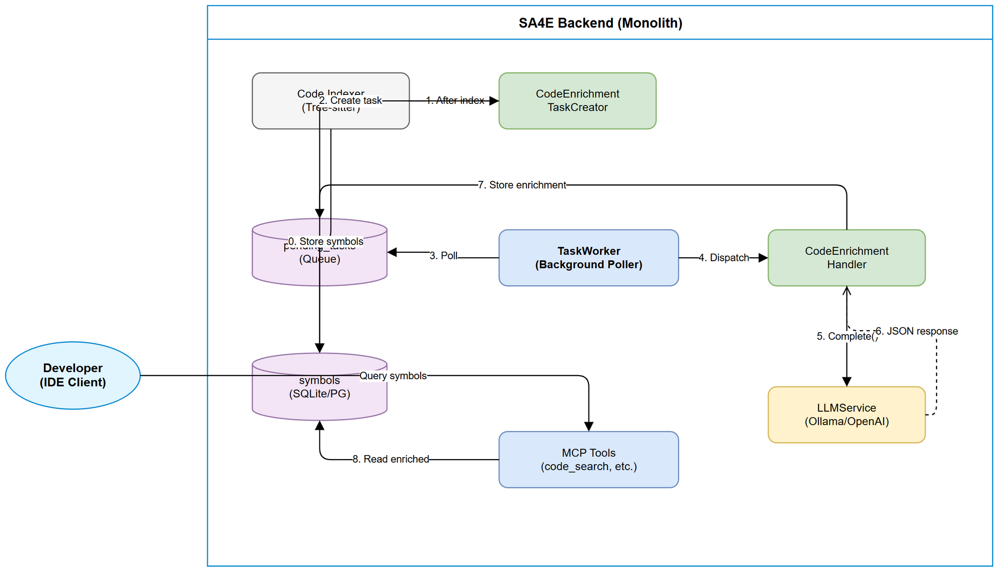
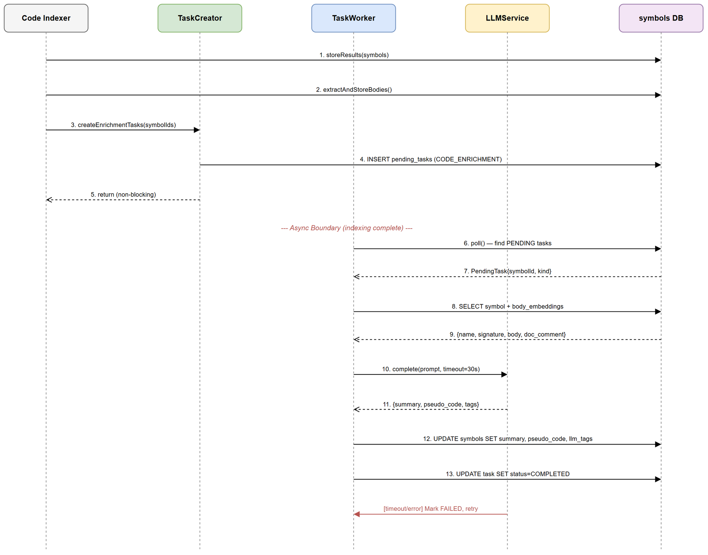
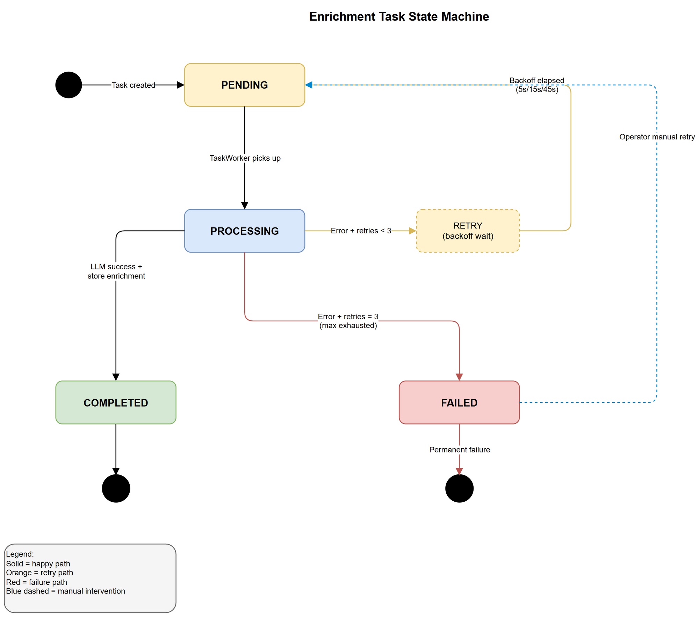

# Functional Specification Document (FSD)

## SA4E — SA4E-107: LLM Enrichment cho Source Code Index

---

## Document Information

| Field | Value |
|-------|-------|
| Jira Ticket | SA4E-107 |
| Title | LLM Enrichment cho Source Code Index |
| Author | BA Agent |
| Version | 1.0 |
| Date | 2025-07-27 |
| Status | Draft |
| Related BRD | documents/SA4E-107/BRD.md |

---

## Revision History

| Version | Date | Author | Changes |
|---------|------|--------|---------|
| 1.0 | 2025-07-27 | BA Agent | Initiate document |

---

## 1. Introduction

### 1.1 Purpose

This FSD specifies the functional behavior of LLM Enrichment for Source Code
Index — translating BRD user stories into use cases, business rules, data
specifications, and API contracts.

### 1.2 Scope

- Async LLM enrichment pipeline for code symbols
- New TaskType `CODE_ENRICHMENT` via TaskWorker (SA4E-44)
- New columns on `symbols` table (summary, pseudo_code, llm_tags)
- LLM prompt templates per symbol kind
- Enriched data surfaced in MCP tool responses

### 1.3 Definitions & Acronyms

| Term | Definition |
|------|------------|
| Symbol | Named code entity: class, interface, enum, function, method |
| Enrichment | Augmenting symbol data with LLM-generated metadata |
| body_embeddings | Table storing raw function body text as Buffer |
| TaskWorker | Background poller for async tasks (SA4E-44) |
| CODE_ENRICHMENT | New TaskType enum value for this feature |
| PegaLogicNormalizer | Template-based Pega rule pseudo code generator |

### 1.4 References

| Document | Location |
|----------|----------|
| BRD | documents/SA4E-107/BRD.md |
| TaskWorker (SA4E-44) | backend/src/modules/memory/task-queue/TaskWorker.ts |
| TagAnalyzerService (SA4E-47) | backend/src/modules/memory/llm/analyzer.ts |
| Indexer Storage | backend/src/engine/parsers/indexer/storage.ts |
| LLMService | backend/src/modules/memory/llm/LLMService.ts |

---

## 2. System Overview

### 2.1 System Context Diagram



The enrichment system operates as a background pipeline:
1. **Code Indexer** parses files, stores symbols + body_embeddings
2. **Indexer** creates `CODE_ENRICHMENT` pending tasks
3. **TaskWorker** polls tasks, calls **LLMService**
4. **LLMService** returns structured enrichment data
5. **TaskWorker** persists results to `symbols` table
6. **MCP Tools** serve enriched data to IDE clients

### 2.2 Key Components

| Component | Responsibility |
|-----------|---------------|
| Code Indexer (Tree-sitter) | Parse → store symbols + body_embeddings |
| CodeEnrichmentTaskCreator | Create CODE_ENRICHMENT tasks after indexing |
| TaskWorker | Poll + process enrichment tasks |
| CodeEnrichmentHandler | Assemble context, call LLM, parse response |
| LLMService | Multi-provider LLM facade (Ollama/OpenAI) |
| symbols DB | Store enrichment results |
---

## 3. Use Cases

### 3.1 UC-01: Enrich Class/Interface/Enum with Summary

**Actor:** System (TaskWorker)
**Preconditions:** Symbol of kind class/interface/enum exists in `symbols` table
**Postconditions:** `symbols.summary` populated with 1-3 sentence description

**Main Flow:**

| Step | Actor | System | Description |
|------|-------|--------|-------------|
| 1 | | TaskWorker | Pick up CODE_ENRICHMENT task for class/interface/enum |
| 2 | | Handler | Load symbol metadata (name, kind, signature, doc_comment) |
| 3 | | Handler | Load child symbols (methods, properties) from same file |
| 4 | | Handler | Assemble LLM prompt with CLASS_SUMMARY template |
| 5 | | LLMService | Send prompt, receive structured response |
| 6 | | Handler | Parse response, extract summary (1-3 sentences) |
| 7 | | Handler | Store summary in `symbols.summary` |
| 8 | | TaskWorker | Mark task COMPLETED |

**Alternative Flows:**

| ID | Condition | Steps |
|----|-----------|-------|
| AF-01.1 | Symbol has doc_comment | Include doc_comment in prompt; LLM refines, not duplicates |
| AF-01.2 | Symbol has no child members | Skip child loading; use only name + signature |

**Exception Flows:**

| ID | Condition | Steps |
|----|-----------|-------|
| EF-01.1 | LLM timeout (>30s) | Mark FAILED, retry with exponential backoff |
| EF-01.2 | LLM unparseable response | Log error, mark FAILED, retry |
| EF-01.3 | Max retries exhausted (3) | Mark FAILED permanently, summary remains NULL |

---

### 3.2 UC-02: Enrich Function/Method with Summary + Pseudo Code

**Actor:** System (TaskWorker)
**Preconditions:** Symbol of kind function/method exists; body_embeddings has body text
**Postconditions:** `symbols.summary` and `symbols.pseudo_code` populated

**Main Flow:**

| Step | Actor | System | Description |
|------|-------|--------|-------------|
| 1 | | TaskWorker | Pick up CODE_ENRICHMENT task for function/method |
| 2 | | Handler | Load symbol metadata + body text from body_embeddings |
| 3 | | Handler | If body > 4000 tokens, truncate to fit LLM context |
| 4 | | Handler | Assemble prompt with FUNCTION_SUMMARY template |
| 5 | | LLMService | Send prompt, receive structured response |
| 6 | | Handler | Parse response: extract summary + pseudo_code |
| 7 | | Handler | Truncate pseudo_code to 2000 chars if needed (append `...`) |
| 8 | | Handler | Store summary + pseudo_code in symbols table |
| 9 | | TaskWorker | Mark task COMPLETED |

**Alternative Flows:**

| ID | Condition | Steps |
|----|-----------|-------|
| AF-02.1 | No body_embeddings for symbol | Generate summary from signature + doc_comment only; pseudo_code = NULL |
| AF-02.2 | Body text < 3 lines | Skip pseudo_code generation; only generate summary |

**Exception Flows:**

| ID | Condition | Steps |
|----|-----------|-------|
| EF-02.1 | LLM timeout | Same as EF-01.1 |
| EF-02.2 | Pseudo code exceeds 2000 chars | Truncate with trailing `...` before storing |

---

### 3.3 UC-03: Extract Tags for Code Symbols

**Actor:** System (TaskWorker)
**Preconditions:** Symbol exists in symbols table
**Postconditions:** `symbols.llm_tags` populated with 1-5 categorized tags

**Main Flow:**

| Step | Actor | System | Description |
|------|-------|--------|-------------|
| 1 | | TaskWorker | Pick up CODE_ENRICHMENT task (tag extraction phase) |
| 2 | | Handler | Load symbol context (name, kind, signature, summary, first 500 chars body) |
| 3 | | Handler | Assemble prompt with TAG_EXTRACTION template + valid categories |
| 4 | | LLMService | Send prompt, receive JSON response |
| 5 | | Handler | Parse tags, validate against predefined categories |
| 6 | | Handler | Discard tags outside valid categories |
| 7 | | Handler | Store validated tags as JSON array in `symbols.llm_tags` |
| 8 | | TaskWorker | Mark task COMPLETED |

**Alternative Flows:**

| ID | Condition | Steps |
|----|-----------|-------|
| AF-03.1 | LLM returns > 5 tags | Keep only first 5 tags (ordered by relevance) |
| AF-03.2 | LLM returns 0 valid tags | Store empty array `[]`, mark COMPLETED |

**Exception Flows:**

| ID | Condition | Steps |
|----|-----------|-------|
| EF-03.1 | LLM returns invalid JSON | Attempt regex extraction; if fails, mark FAILED |

---

### 3.4 UC-04: Enrich Pega Rule with Natural Language Summary

**Actor:** System (TaskWorker)
**Preconditions:** Workspace type = Pega; Pega rule symbol exists; PegaLogicNormalizer output available
**Postconditions:** `symbols.summary` populated; existing `pseudo_code` NOT overwritten

**Main Flow:**

| Step | Actor | System | Description |
|------|-------|--------|-------------|
| 1 | | TaskWorker | Pick up CODE_ENRICHMENT task for Pega rule symbol |
| 2 | | Handler | Detect workspace type = Pega from project config |
| 3 | | Handler | Load existing pseudo_code (PegaLogicNormalizer output) |
| 4 | | Handler | Load rule metadata (class, ruleset, purpose) |
| 5 | | Handler | Assemble prompt with PEGA_SUMMARY template |
| 6 | | LLMService | Send prompt, receive summary response |
| 7 | | Handler | Store summary in `symbols.summary` (DO NOT touch pseudo_code) |
| 8 | | TaskWorker | Mark task COMPLETED |

**Alternative Flows:**

| ID | Condition | Steps |
|----|-----------|-------|
| AF-04.1 | No PegaLogicNormalizer output | Use rule metadata only for prompt context |
| AF-04.2 | Workspace is not Pega | Skip Pega-specific handling, use standard function flow |

**Exception Flows:**

| ID | Condition | Steps |
|----|-----------|-------|
| EF-04.1 | Rule metadata unavailable | Log warning, generate generic summary from name+kind |

---

### 3.5 UC-05: Queue CODE_ENRICHMENT Tasks (After Indexing)

**Actor:** System (Code Indexer)
**Preconditions:** File indexing completed successfully (symbols + body_embeddings stored)
**Postconditions:** CODE_ENRICHMENT tasks created for each new/modified symbol

**Main Flow:**

| Step | Actor | System | Description |
|------|-------|--------|-------------|
| 1 | | Indexer | Complete symbol storage (storeResults) |
| 2 | | Indexer | Complete body extraction (extractAndStoreBodies) |
| 3 | | TaskCreator | For each stored symbol, create CODE_ENRICHMENT task |
| 4 | | TaskCreator | Set task payload: {symbolId, symbolKind, projectId, filePath} |
| 5 | | TaskCreator | Insert tasks with status = PENDING, retry_count = 0 |
| 6 | | Indexer | Return to caller (non-blocking) |

**Alternative Flows:**

| ID | Condition | Steps |
|----|-----------|-------|
| AF-05.1 | Symbol already enriched (summary != NULL) | Skip task creation (idempotent) |
| AF-05.2 | Symbol unchanged since last enrichment | Skip task creation |
| AF-05.3 | Batch indexing (100+ files) | Batch insert tasks for efficiency |

**Exception Flows:**

| ID | Condition | Steps |
|----|-----------|-------|
| EF-05.1 | Task creation fails (DB error) | Log error, continue indexing (enrichment is optional) |

---

### 3.6 UC-06: Monitor Enrichment Progress

**Actor:** System Operator
**Preconditions:** TaskWorker is running
**Postconditions:** Operator sees enrichment task statistics

**Main Flow:**

| Step | Actor | System | Description |
|------|-------|--------|-------------|
| 1 | Operator | | Request task stats via API/MCP tool |
| 2 | | TaskWorker | Query task counts by status for CODE_ENRICHMENT type |
| 3 | | TaskWorker | Return: {pending, processing, completed, failed, isRunning, lastPollAt} |
| 4 | Operator | | View progress dashboard |

**Alternative Flows:**

| ID | Condition | Steps |
|----|-----------|-------|
| AF-06.1 | Filter by project_id | Return stats scoped to specific project |

**Exception Flows:**

| ID | Condition | Steps |
|----|-----------|-------|
| EF-06.1 | TaskWorker not running | Return isRunning=false, stale lastPollAt |

---

### 3.7 UC-07: Search by LLM Tags

**Actor:** Developer
**Preconditions:** Symbols have been enriched with llm_tags
**Postconditions:** Developer receives symbols matching tag query

**Main Flow:**

| Step | Actor | System | Description |
|------|-------|--------|-------------|
| 1 | Developer | | Search symbols by tag (e.g., "design-pattern:factory") |
| 2 | | MCP Tool | Query symbols WHERE llm_tags LIKE '%{tag}%' |
| 3 | | MCP Tool | Return matching symbols with metadata |
| 4 | Developer | | Browse results |

**Alternative Flows:**

| ID | Condition | Steps |
|----|-----------|-------|
| AF-07.1 | Search by category only | Match all tags starting with category prefix |
| AF-07.2 | No matches found | Return empty array with helpful message |

**Exception Flows:**

| ID | Condition | Steps |
|----|-----------|-------|
| EF-07.1 | Invalid tag format | Return validation error with format hint |

---

### 3.8 UC-08: Retry Failed Enrichment

**Actor:** System (TaskWorker) / Operator
**Preconditions:** Task status = FAILED, retry_count < max_retries
**Postconditions:** Task retried with exponential backoff

**Main Flow:**

| Step | Actor | System | Description |
|------|-------|--------|-------------|
| 1 | | TaskWorker | Detect failed task with retry_count < max_retries |
| 2 | | TaskWorker | Calculate backoff: 5s * 3^(retry_count) |
| 3 | | TaskWorker | Wait backoff period |
| 4 | | TaskWorker | Reset task status to PENDING |
| 5 | | TaskWorker | Process task (same as original UC flow) |

**Alternative Flows:**

| ID | Condition | Steps |
|----|-----------|-------|
| AF-08.1 | Operator manually triggers retry | Reset all FAILED tasks to PENDING |
| AF-08.2 | LLM becomes available after outage | All pending retries process normally |

**Exception Flows:**

| ID | Condition | Steps |
|----|-----------|-------|
| EF-08.1 | Max retries exhausted | Task remains FAILED permanently; log for operator review |

---

## 4. Business Rules

| Rule ID | Rule | Category | Source |
|---------|------|----------|--------|
| BR-01 | Enrichment MUST NOT block the indexing pipeline. Indexing completes independently; enrichment tasks are queued AFTER commit. | Performance | BRD Story 5 |
| BR-02 | LLM call timeout = 30 seconds. Calls exceeding timeout are aborted and task marked FAILED. | Reliability | BRD NFR |
| BR-03 | Max retries = 3 per task. Exponential backoff: 5s, 15s, 45s (base=5s, multiplier=3). | Reliability | BRD NFR |
| BR-04 | Default LLM = local Ollama. No external LLM service called unless explicitly configured by operator. | Security | BRD NFR |
| BR-05 | Pseudo code maximum length = 2000 characters. Truncate with trailing `...` if exceeds. | Data | BRD Story 2 |
| BR-06 | Tags format: `{category}:{value}` — all lowercase, hyphen-separated values. Max 5 tags per symbol. | Data | BRD Story 3 |
| BR-07 | Enrichment is idempotent. Re-enriching same symbol overwrites previous values (last-write-wins). | Data Integrity | BRD NFR |
| BR-08 | Valid tag categories: `design-pattern`, `business-domain`, `technical-concern`, `architecture-layer`, `data-access`. Tags outside these categories are discarded. | Data | BRD Story 3 |
| BR-09 | Summary language follows existing doc_comment language; defaults to English if no doc_comment. | UX | BRD Story 1 |
| BR-10 | For Pega workspace: LLM enrichment adds summary ONLY; existing pseudo_code from PegaLogicNormalizer is never overwritten. | Data Integrity | BRD Story 4 |
| BR-11 | Symbols without body_embeddings (classes, interfaces, enums) get summary + tags only; no pseudo_code. | Logic | BRD Stories 1,2 |
| BR-12 | TaskWorker concurrency for CODE_ENRICHMENT: configurable, default = 1 (sequential processing). | Performance | BRD Story 5 |
| BR-13 | Function body > 4000 tokens: truncate to 4000 tokens before sending to LLM. | Performance | BRD Story 2 |
| BR-14 | Skip task creation for symbols that already have enrichment data AND whose source hasn't changed since last enrichment. | Performance | BRD 1.2 |

---

## 5. Data Specifications

### 5.1 Schema Changes — `symbols` Table

| Column | Type | Nullable | Default | Description |
|--------|------|----------|---------|-------------|
| summary | TEXT | YES | NULL | LLM-generated natural language summary (1-3 sentences) |
| pseudo_code | TEXT | YES | NULL | Structured pseudo code for functions/methods (max 2000 chars) |
| llm_tags | TEXT | YES | NULL | JSON array of categorized tags (e.g., `["design-pattern:factory"]`) |
| enrichment_status | TEXT | YES | NULL | PENDING / COMPLETED / FAILED — tracks enrichment state per symbol |
| enriched_at | TEXT | YES | NULL | ISO timestamp of last successful enrichment |

**Migration:** Additive columns only (nullable). No breaking changes to existing queries.

### 5.2 New TaskType Enum Value

```typescript
export enum TaskType {
  TAG_ENRICHMENT = 'TAG_ENRICHMENT',
  VECTOR_EMBEDDING = 'VECTOR_EMBEDDING',
  CODE_ENRICHMENT = 'CODE_ENRICHMENT',  // NEW — SA4E-107
}
```

### 5.3 CODE_ENRICHMENT Task Payload Schema

```typescript
interface CodeEnrichmentPayload {
  symbolId: number;        // symbols.id
  symbolName: string;      // symbols.name
  symbolKind: string;      // class | interface | enum | function | method
  projectId: string;       // tenant project ID
  filePath: string;        // relative file path
  workspaceType?: string;  // 'pega' | 'standard' (default: 'standard')
}
```

### 5.4 LLM Response Schema (Expected from LLM)

```typescript
interface CodeEnrichmentLLMResponse {
  summary: string;          // 1-3 sentences
  pseudo_code?: string;     // Structured pseudo code (functions/methods only)
  tags: Array<{
    category: string;       // One of 5 valid categories
    value: string;          // Lowercase, hyphen-separated
  }>;
}
```

### 5.5 Tag Categories (Valid Values)

| Category | Example Values |
|----------|---------------|
| design-pattern | factory, singleton, observer, strategy, builder, adapter, decorator |
| business-domain | authentication, payment, notification, user-management, reporting |
| technical-concern | caching, logging, error-handling, validation, serialization, parsing |
| architecture-layer | controller, service, repository, middleware, utility, handler |
| data-access | database, api-client, file-io, message-queue, cache-store |

---

## 6. LLM Prompt Templates

### 6.1 CLASS_SUMMARY Template (UC-01)

```
SYSTEM: You are a code documentation assistant. Generate concise summaries for code symbols.

USER:
Analyze the following {kind} and provide a 1-3 sentence summary describing its purpose and responsibility.

Symbol: {name}
Kind: {kind}
Signature: {signature}
Documentation: {doc_comment || "None"}
Child Members: {child_methods_and_properties_list}

Respond in JSON format:
{
  "summary": "1-3 sentence description",
  "tags": [{"category": "...", "value": "..."}]
}
```

### 6.2 FUNCTION_SUMMARY Template (UC-02)

```
SYSTEM: You are a code documentation assistant. Generate summaries and structured pseudo code.

USER:
Analyze the following function/method. Provide:
1. A 1-2 sentence summary of what it does
2. Structured pseudo code showing control flow (max 2000 chars)
3. Categorized tags

Symbol: {name}
Kind: {kind}
Signature: {signature}
Documentation: {doc_comment || "None"}
Body:
```
{body_text (truncated to 4000 tokens)}
```

Respond in JSON format:
{
  "summary": "1-2 sentence description",
  "pseudo_code": "Structured pseudo code with IF/ELSE, FOR, TRY/CATCH",
  "tags": [{"category": "...", "value": "..."}]
}
```

### 6.3 TAG_EXTRACTION Template (UC-03)

```
SYSTEM: You are a code classifier. Assign 1-5 tags from these categories ONLY:
- design-pattern: factory, singleton, observer, strategy, builder, adapter, decorator, proxy, facade, template-method
- business-domain: authentication, payment, notification, user-management, reporting, scheduling, analytics
- technical-concern: caching, logging, error-handling, validation, serialization, parsing, configuration
- architecture-layer: controller, service, repository, middleware, utility, handler, gateway
- data-access: database, api-client, file-io, message-queue, cache-store, event-bus

USER:
Classify this code symbol:
Name: {name}
Kind: {kind}
Signature: {signature}
Summary: {summary || "Not available"}
Body Preview: {first_500_chars_body}

Respond in JSON:
{
  "tags": [{"category": "...", "value": "..."}]
}
```

### 6.4 PEGA_SUMMARY Template (UC-04)

```
SYSTEM: You are a Pega business analyst. Explain Pega rules in plain business language.

USER:
Explain what this Pega rule does in 2-3 sentences, focusing on business impact.

Rule Name: {name}
Rule Type: {kind} (Activity/DataTransform/DecisionTable/Flow)
Class: {pega_class}
Ruleset: {ruleset}
Purpose: {purpose_property || "Not specified"}

Existing Pseudo Code (from PegaLogicNormalizer):
{existing_pseudo_code}

Respond in JSON:
{
  "summary": "2-3 sentence business-level description"
}
```

---

## 7. API Specifications (MCP Tool Enrichment)

### 7.1 Enriched Symbol Response (Existing MCP Tools)

Existing MCP tools (`code_search`, `code_symbols`, `code_context`) will include enrichment
data in their responses when available.

**Enhanced Response Fields:**

| Field | Type | Condition | Description |
|-------|------|-----------|-------------|
| summary | string | null | When symbol has been enriched |
| pseudo_code | string | null | Functions/methods with enrichment |
| llm_tags | string[] | [] | Array of `category:value` strings |
| enrichment_status | string | null | COMPLETED / FAILED / PENDING |
| enriched_at | string | null | ISO timestamp |

**Example enriched symbol response:**

```json
{
  "name": "TaskWorker",
  "kind": "class",
  "signature": "export class TaskWorker",
  "file": "backend/src/modules/memory/task-queue/TaskWorker.ts",
  "startLine": 42,
  "endLine": 180,
  "summary": "Background polling worker that processes pending async tasks with exponential backoff, configurable concurrency, and graceful shutdown support.",
  "pseudo_code": null,
  "llm_tags": ["design-pattern:observer", "architecture-layer:service", "technical-concern:scheduling"],
  "enrichment_status": "COMPLETED",
  "enriched_at": "2025-07-27T10:30:00Z"
}
```

### 7.2 Tag Search API (UC-07)

**MCP Tool:** `code_search_by_tag`

**Input:**

| Parameter | Type | Required | Description |
|-----------|------|----------|-------------|
| tag | string | Yes | Full tag (`design-pattern:factory`) or category prefix (`design-pattern`) |
| project_id | string | Yes | Tenant project scope |
| limit | number | No | Max results (default: 20) |

**Output:**

```json
{
  "symbols": [
    {
      "name": "ProviderFactory",
      "kind": "class",
      "file": "src/factories/ProviderFactory.ts",
      "summary": "Creates provider instances based on transport type configuration.",
      "llm_tags": ["design-pattern:factory", "architecture-layer:service"],
      "startLine": 5
    }
  ],
  "total": 1
}
```

### 7.3 Enrichment Stats API (UC-06)

**MCP Tool:** `code_enrichment_stats` (or via existing `task_stats`)

**Input:**

| Parameter | Type | Required | Description |
|-----------|------|----------|-------------|
| project_id | string | No | Filter by project (default: all) |

**Output:**

```json
{
  "pending": 142,
  "processing": 2,
  "completed": 856,
  "failed": 12,
  "total_symbols": 1010,
  "enrichment_coverage": "84.7%",
  "isRunning": true,
  "lastPollAt": "2025-07-27T10:29:55Z"
}
```

---

## 8. Processing Logic

### 8.1 Enrichment Task Processing

**Trigger:** TaskWorker poll cycle detects PENDING CODE_ENRICHMENT tasks
**Concurrency:** Configurable (default: 1)

**Processing Steps:**

| Step | Description | Error Handling |
|------|-------------|----------------|
| 1 | Load task from pending_tasks table | Skip if task no longer exists |
| 2 | Parse payload → extract symbolId, symbolKind | Mark FAILED if invalid payload |
| 3 | Load symbol from symbols table by ID | Mark FAILED if symbol deleted |
| 4 | Determine enrichment strategy by symbolKind | Use default if unknown kind |
| 5 | Assemble LLM context (see prompt templates) | Proceed with available data |
| 6 | Call LLMService.complete() with timeout=30s | On timeout → FAILED + retry |
| 7 | Parse JSON response (with fallback regex) | On parse failure → FAILED + retry |
| 8 | Validate tags against allowed categories | Discard invalid tags silently |
| 9 | Truncate pseudo_code if > 2000 chars | Append `...` |
| 10 | UPDATE symbols SET summary, pseudo_code, llm_tags, enriched_at | On DB error → FAILED |
| 11 | Mark task COMPLETED | — |

### 8.2 Task Creation Logic (After Indexing)

**Trigger:** `storeResults()` completes successfully in indexer storage
**Schedule:** Synchronous inline (but non-blocking — just INSERT tasks)

**Decision Logic:**

```
FOR each symbol stored:
  IF symbol.enrichment_status == 'COMPLETED' AND source unchanged:
    SKIP (already enriched, no change)
  ELSE:
    CREATE CODE_ENRICHMENT task with payload
    SET symbol.enrichment_status = 'PENDING'
```

### 8.3 Enrichment Sequence Diagram



### 8.4 Enrichment State Diagram



---

## 9. Error Handling

### 9.1 Error Scenarios

| Scenario | Severity | System Behavior | Recovery |
|----------|----------|-----------------|----------|
| LLM service unavailable (connection refused) | Warning | Task marked FAILED, retry with backoff | Auto-retry; after 3 failures, task stays FAILED |
| LLM timeout (>30s) | Warning | Abort request, mark FAILED | Retry with same payload |
| LLM returns invalid JSON | Warning | Attempt regex extraction of fields | If regex fails, mark FAILED + retry |
| LLM returns empty summary | Info | Store empty string, mark COMPLETED | No retry needed |
| LLM returns tags outside categories | Info | Discard invalid tags, store valid ones | No error — graceful degradation |
| Symbol deleted between task creation and processing | Info | Mark task COMPLETED (no-op) | Skip processing |
| Database error during enrichment store | Critical | Mark task FAILED | Retry; if persistent, operator intervention |
| Token budget exceeded (body too large) | Info | Truncate body to 4000 tokens before send | Always succeeds after truncation |
| Concurrent enrichment of same symbol | Info | Last-write-wins (idempotent) | No conflict resolution needed |

### 9.2 Retry Strategy

| Attempt | Backoff Delay | Total Elapsed |
|---------|---------------|---------------|
| 1st retry | 5 seconds | 5s |
| 2nd retry | 15 seconds | 20s |
| 3rd retry | 45 seconds | 65s |
| Max exceeded | No more retries | Task remains FAILED |

**Formula:** `delay = 5s * 3^(retry_count - 1)`

### 9.3 Graceful Degradation

When enrichment fails or LLM is unavailable:
- Symbols remain fully functional for code navigation
- Search works on name, signature, doc_comment (existing behavior)
- Enrichment data fields are NULL — no impact on existing queries
- System logs enrichment failures for operator monitoring
- No user-facing errors — enrichment is invisible enhancement

---

## 10. Non-Functional Requirements

| Category | Requirement | Acceptance Criteria |
|----------|-------------|---------------------|
| Performance | Enrichment must not block indexing | Index completes before any enrichment task starts |
| Performance | Single enrichment < 30s | LLM timeout enforced at 30s |
| Performance | Throughput >= 50 symbols/min (local Ollama 8B) | Measured in integration test |
| Reliability | Retry failed tasks 3 times | Exponential backoff verified |
| Reliability | Graceful degradation when LLM down | Symbols usable without enrichment |
| Scalability | Handle 10,000+ symbols | Task queue pagination, no memory exhaustion |
| Data Integrity | Idempotent enrichment | Re-run produces same stored result |
| Security | No source code to external services by default | Default = local Ollama |
| Observability | Task stats exposed via API | pending/processing/completed/failed counts |

---

## 11. Security Requirements

### 11.1 Data Sensitivity

| Data Type | Classification | Requirement |
|-----------|---------------|-------------|
| Source code body text | Confidential | Never sent to external LLM without explicit opt-in |
| LLM-generated summaries | Internal | Stored in local DB only |
| LLM tags | Internal | No PII or secrets in tags |

### 11.2 LLM Provider Security

| Rule | Implementation |
|------|---------------|
| Default provider = local Ollama | No network egress for code data |
| External LLM (OpenAI) = opt-in | Requires explicit config: `LLM_PROVIDER=openai` |
| API keys stored in env vars | Never in DB or source code |
| Body text truncated before send | Max 4000 tokens — limits exposure |

---

## 12. Appendix

### 12.1 Diagram Index

| # | Diagram | Image | Source (editable) |
|---|---------|-------|-------------------|
| 1 | System Context | [system-context.png](diagrams/system-context.png) | [system-context.drawio](diagrams/system-context.drawio) |
| 2 | Enrichment Sequence | [sequence-enrichment.png](diagrams/sequence-enrichment.png) | [sequence-enrichment.drawio](diagrams/sequence-enrichment.drawio) |
| 3 | Enrichment State | [state-enrichment.png](diagrams/state-enrichment.png) | [state-enrichment.drawio](diagrams/state-enrichment.drawio) |

### 12.2 Traceability Matrix

| Use Case | BRD Story | Business Rules |
|----------|-----------|----------------|
| UC-01 | Story 1 | BR-01, BR-07, BR-09 |
| UC-02 | Story 2 | BR-01, BR-05, BR-07, BR-13 |
| UC-03 | Story 3 | BR-06, BR-08 |
| UC-04 | Story 4 | BR-10, BR-04 |
| UC-05 | Story 5 | BR-01, BR-14 |
| UC-06 | Story 5 | BR-12 |
| UC-07 | Story 3 | BR-06, BR-08 |
| UC-08 | Story 5 | BR-02, BR-03 |

### 12.3 Open Questions

| # | Question | Impact | Decision Needed By |
|---|----------|--------|-------------------|
| 1 | Should enrichment re-run when LLM model changes? | Data consistency | SA / PO |
| 2 | Should summary language be configurable per project? | UX | PO |
| 3 | Maximum task queue size per project? | Scalability | SA |
