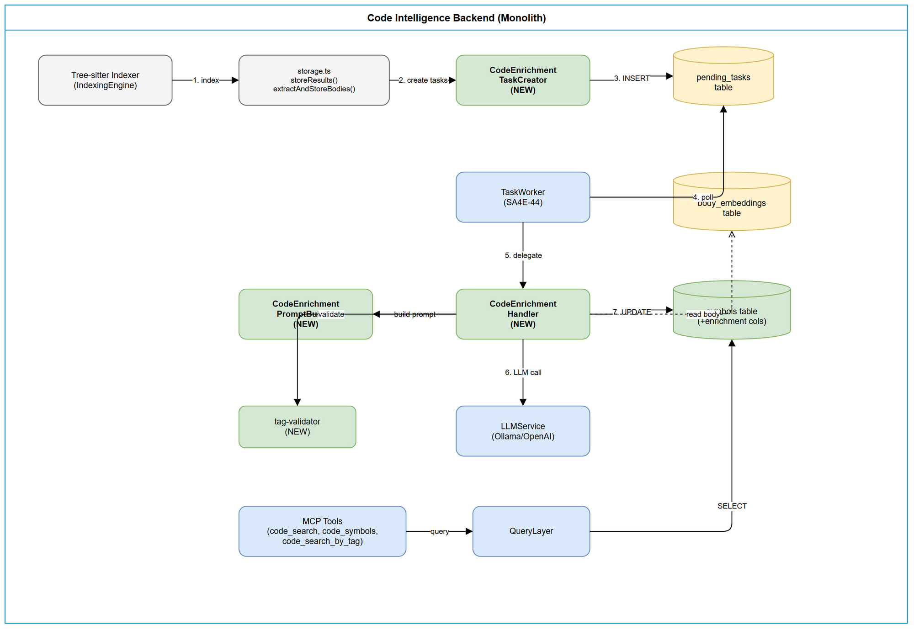
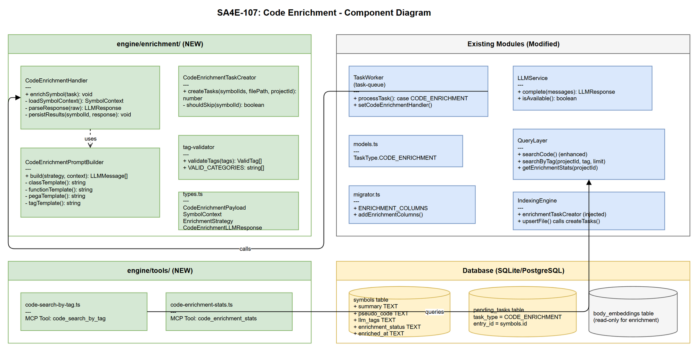

# Technical Design Document (TDD)

## SA4E-107: LLM Enrichment cho Source Code Index

---

## Document Information

| Field | Value |
|-------|-------|
| Jira Ticket | SA4E-107 |
| Title | LLM Enrichment cho Source Code Index |
| Author | SA Agent |
| Version | 1.0 |
| Date | 2025-07-27 |
| Status | Draft |
| Related BRD | documents/SA4E-107/BRD.md |
| Related FSD | documents/SA4E-107/FSD.md |

---

## 1. Architecture Overview

### 1.1 Position in System

CODE_ENRICHMENT integrates as a post-indexing async extension within the existing Code Intelligence backend monolith (TypeScript + Hono):

- **Trigger:** After storeResults() + extractAndStoreBodies() in storage.ts
- **Processing:** TaskWorker (SA4E-44) polls CODE_ENRICHMENT tasks
- **Persistence:** Results in existing symbols table (additive nullable columns)
- **Consumption:** MCP tools include enriched fields in responses

### 1.2 Design Principles

1. **Non-blocking** - Enrichment never delays indexing (BR-01)
2. **Additive** - Nullable columns only, zero breaking changes
3. **Idempotent** - Last-write-wins (BR-07)
4. **Fail-safe** - LLM down does not degrade existing functionality
5. **Strategy pattern** - Different enrichment per symbol kind

### 1.3 Architecture Diagram


---

## 2. Detailed Design

### 2.1 New TaskType: CODE_ENRICHMENT

**File:** backend/src/modules/memory/task-queue/models.ts

```typescript
export enum TaskType {
  TAG_ENRICHMENT = 'TAG_ENRICHMENT',
  VECTOR_EMBEDDING = 'VECTOR_EMBEDDING',
  CODE_ENRICHMENT = 'CODE_ENRICHMENT',  // NEW - SA4E-107
}
```

**Task Payload:**

```typescript
interface CodeEnrichmentPayload {
  symbolId: number;        // symbols.id
  symbolName: string;      // symbols.name
  symbolKind: string;      // class | interface | enum | function | method
  projectId: string;       // tenant project ID
  filePath: string;        // relative file path
  workspaceType?: string;  // 'pega' | 'standard' (default: 'standard')
}
```

Design Decision: entry_id in pending_tasks maps to symbols.id for CODE_ENRICHMENT tasks. Reuses existing schema.

### 2.2 CodeEnrichmentHandler (NEW)

**Location:** backend/src/engine/enrichment/CodeEnrichmentHandler.ts

```typescript
export class CodeEnrichmentHandler {
  constructor(
    private readonly adapter: DatabaseAdapter,
    private readonly llmService: LLMService,
    private readonly promptBuilder: CodeEnrichmentPromptBuilder,
    private readonly logger: Logger,
  ) {}
  async enrichSymbol(task: PendingTask): Promise<void>;
}
```

**Strategy Selection:**

| symbolKind | Template | Fields Populated |
|------------|----------|------------------|
| class, interface, enum | CLASS_SUMMARY | summary + llm_tags |
| function, method, arrow_function, generator | FUNCTION_SUMMARY | summary + pseudo_code + llm_tags |
| pega_activity, pega_data_transform, pega_flow | PEGA_SUMMARY | summary only (pseudo_code preserved) |
| unknown / fallback | CLASS_SUMMARY | summary + llm_tags |

**Processing Flow:**

1. Parse task.payload to CodeEnrichmentPayload
2. SELECT symbol from DB (fail if not found)
3. Select strategy by symbolKind
4. Load context: metadata + children/body/pega pseudo_code
5. promptBuilder.build(strategy, context) produces LLMMessage[]
6. llmService.complete(messages) with 30s AbortController timeout (BR-02)
7. Parse JSON response (regex fallback on failure)
8. Validate tags against allowed categories (discard invalid)
9. Truncate pseudo_code to 2000 chars (BR-05)
10. UPDATE symbols SET summary, pseudo_code, llm_tags, enrichment_status='COMPLETED', enriched_at=NOW()

### 2.3 CodeEnrichmentPromptBuilder (NEW)

**Location:** backend/src/engine/enrichment/CodeEnrichmentPromptBuilder.ts

```typescript
export type EnrichmentStrategy = 'CLASS_SUMMARY' | 'FUNCTION_SUMMARY' | 'TAG_EXTRACTION' | 'PEGA_SUMMARY';

export interface SymbolContext {
  name: string;
  kind: string;
  signature: string | null;
  docComment: string | null;
  bodyText: string | null;         // truncated to 4000 tokens
  childMembers: string[] | null;   // for classes
  existingPseudoCode: string | null; // for Pega rules
  pegaClass?: string;
  pegaRuleset?: string;
}

export class CodeEnrichmentPromptBuilder {
  build(strategy: EnrichmentStrategy, context: SymbolContext): LLMMessage[];
}
```

**Context per Strategy:**

| Strategy | Fields Used |
|----------|-------------|
| CLASS_SUMMARY | name, kind, signature, docComment, childMembers |
| FUNCTION_SUMMARY | name, kind, signature, docComment, bodyText (max 4000 tokens) |
| TAG_EXTRACTION | name, kind, signature, summary (if available), bodyText (first 500 chars) |
| PEGA_SUMMARY | name, kind, existingPseudoCode, pegaClass, pegaRuleset |

Token truncation (BR-13): Body text > 4000 tokens is truncated before prompt assembly.

### 2.4 Schema Migration

**Location:** Extend runGraphMigrations() in backend/src/engine/database/migrator.ts

```typescript
const ENRICHMENT_COLUMNS = [
  { name: 'summary', type: 'TEXT' },
  { name: 'pseudo_code', type: 'TEXT' },
  { name: 'llm_tags', type: 'TEXT' },
  { name: 'enrichment_status', type: 'TEXT' },
  { name: 'enriched_at', type: 'TEXT' },
] as const;
```

```sql
CREATE INDEX IF NOT EXISTS idx_symbols_enrichment_status ON symbols(enrichment_status);
CREATE INDEX IF NOT EXISTS idx_symbols_project_enrichment ON symbols(project_id, enrichment_status);
```

Cross-engine: SQLite + PostgreSQL both support nullable ALTER TABLE ADD COLUMN. Uses try/catch per column (idempotent, same pattern as ENHANCED_SYMBOL_COLUMNS).

### 2.5 Task Creation in Indexing Pipeline

**Location:** backend/src/engine/enrichment/CodeEnrichmentTaskCreator.ts (NEW)

```typescript
export class CodeEnrichmentTaskCreator {
  constructor(private readonly adapter: DatabaseAdapter, private readonly logger: Logger) {}

  async createTasks(
    symbolIds: Map<string, number>,
    filePath: string,
    projectId: string,
  ): Promise<number>;
}
```

**Integration:** IndexingEngine calls createTasks() after storeResults() + extractAndStoreBodies(). Wrapped in try/catch - failures do NOT affect indexing (BR-01).

**Skip logic (BR-14):** If enrichment_status = 'COMPLETED' on symbol, skip task creation.

### 2.6 TaskWorker Integration

**File:** backend/src/modules/memory/task-queue/TaskWorker.ts

Add CODE_ENRICHMENT case to processTask() switch:
```typescript
case TaskType.CODE_ENRICHMENT:
  await this.processCodeEnrichment(task, payload);
  break;
```

Handler injection (same pattern as setTagAnalyzer):
```typescript
private codeEnrichmentHandler?: CodeEnrichmentHandler;
setCodeEnrichmentHandler(handler: CodeEnrichmentHandler): void {
  this.codeEnrichmentHandler = handler;
}
```

### 2.7 MCP Tool Response Enhancement

**Modified:** Add enrichment fields to SYMBOL_COLUMNS in query-layer.ts:
```typescript
const SYMBOL_COLUMNS = s.name, s.kind, s.signature, f.relative_path as filePath,
  s.start_line as startLine, s.end_line as endLine,
  s.visibility, s.doc_comment as docComment, s.parent_symbol as parentSymbol,
  s.summary, s.pseudo_code as pseudoCode, s.llm_tags as llmTags,
  s.enrichment_status as enrichmentStatus, s.enriched_at as enrichedAt;
```

**New methods on QueryLayer:** searchByTag(projectId, tag, limit), getEnrichmentStats(projectId)

**New MCP tools:** code_search_by_tag, code_enrichment_stats

---

## 3. API Design

### 3.1 code_search_by_tag

| Parameter | Type | Required | Default | Description |
|-----------|------|----------|---------|-------------|
| tag | string | Yes | - | Full tag (design-pattern:factory) or category prefix |
| limit | number | No | 20 | Max results |
| __projectId | string | No | injected | Tenant scope |

### 3.2 code_enrichment_stats

| Parameter | Type | Required | Default | Description |
|-----------|------|----------|---------|-------------|
| __projectId | string | No | injected | Tenant scope |

**Output:** total_symbols, completed (count + %), pending, failed, isRunning, lastPollAt

---

## 4. Database Design

### 4.1 New Columns (symbols table)

| Column | Type | Nullable | Default | Description |
|--------|------|----------|---------|-------------|
| summary | TEXT | YES | NULL | LLM summary (1-3 sentences) |
| pseudo_code | TEXT | YES | NULL | Structured pseudo code (max 2000 chars) |
| llm_tags | TEXT | YES | NULL | JSON array: ["category:value", ...] |
| enrichment_status | TEXT | YES | NULL | PENDING / COMPLETED / FAILED |
| enriched_at | TEXT | YES | NULL | ISO 8601 timestamp |

### 4.2 Indexes

```sql
CREATE INDEX IF NOT EXISTS idx_symbols_enrichment_status ON symbols(enrichment_status);
CREATE INDEX IF NOT EXISTS idx_symbols_project_enrichment ON symbols(project_id, enrichment_status);
```

### 4.3 Key Query Patterns

**Tag search:**
```sql
SELECT s.*, f.relative_path FROM symbols s
JOIN files f ON s.file_id = f.id
WHERE s.project_id = ? AND s.llm_tags LIKE ?
ORDER BY s.name LIMIT ?
```

**Enrichment stats:**
```sql
SELECT COUNT(*) as total,
  SUM(CASE WHEN enrichment_status='COMPLETED' THEN 1 ELSE 0 END) as completed,
  SUM(CASE WHEN enrichment_status='PENDING' THEN 1 ELSE 0 END) as pending,
  SUM(CASE WHEN enrichment_status='FAILED' THEN 1 ELSE 0 END) as failed
FROM symbols WHERE project_id = ?
```

---

## 5. Implementation Checklist

### 5.1 New Files (8)

| # | File Path | Purpose |
|---|-----------|---------|
| 1 | backend/src/engine/enrichment/CodeEnrichmentHandler.ts | Main handler |
| 2 | backend/src/engine/enrichment/CodeEnrichmentPromptBuilder.ts | Prompt assembly |
| 3 | backend/src/engine/enrichment/CodeEnrichmentTaskCreator.ts | Task creation |
| 4 | backend/src/engine/enrichment/types.ts | Interfaces + payload schema |
| 5 | backend/src/engine/enrichment/tag-validator.ts | Tag category validation |
| 6 | backend/src/engine/enrichment/index.ts | Re-exports |
| 7 | backend/src/engine/tools/code-search-by-tag.ts | MCP tool |
| 8 | backend/src/engine/tools/code-enrichment-stats.ts | MCP tool |

### 5.2 Modified Files (8)

| # | File Path | Change |
|---|-----------|--------|
| 1 | modules/memory/task-queue/models.ts | Add CODE_ENRICHMENT enum |
| 2 | modules/memory/task-queue/TaskWorker.ts | Add case + handler injection |
| 3 | engine/database/migrator.ts | Add ENRICHMENT_COLUMNS + indexes |
| 4 | engine/query/query-layer.ts | Add fields + searchByTag + getEnrichmentStats |
| 5 | engine/tools/code-search.ts | Include enrichment in output |
| 6 | engine/tools/code-symbols.ts | Include enrichment in output |
| 7 | engine/tools/register-tools.ts | Register 2 new tools |
| 8 | engine/indexer/indexing-engine.ts | Inject + call TaskCreator |

---

## 6. Error Handling

### 6.1 Retry Strategy (BR-03)

| Attempt | Delay | Formula |
|---------|-------|---------|
| 1st retry | 5s | 5 x 3^0 |
| 2nd retry | 15s | 5 x 3^1 |
| 3rd retry | 45s | 5 x 3^2 |
| Exhausted | - | Task stays FAILED permanently |

### 6.2 JSON Parse Fallback

1. JSON.parse(raw) - try full response
2. Extract from markdown code fence
3. Regex extraction of individual fields (summary, pseudo_code, tags)

### 6.3 Graceful Degradation

When LLM unavailable: symbols remain functional, enrichment fields NULL, no user errors. System logs for operator monitoring.

---

## 7. Security Design

| Aspect | Implementation |
|--------|---------------|
| Default LLM | Local Ollama - no network egress (BR-04) |
| External LLM | Explicit LLM_PROVIDER env var required |
| Body truncation | Max 4000 tokens sent to LLM |
| SQL safety | All queries parameterized |
| Tag sanitization | Lowercase, alphanumeric + hyphens only |
| API keys | Environment variables only |

---

## 8. Component Diagram



---

## 9. Appendix

### Diagram Index

| # | Diagram | Image | Source (editable) |
|---|---------|-------|-------------------|
| 1 | Architecture | [architecture.png](diagrams/architecture.png) | [architecture.drawio](diagrams/architecture.drawio) |
| 2 | Component | [component.png](diagrams/component.png) | [component.drawio](diagrams/component.drawio) |

### Traceability Matrix

| TDD Section | FSD Use Case | BRD Story | Business Rules |
|-------------|--------------|-----------|----------------|
| 2.2 (CLASS) | UC-01 | Story 1 | BR-01, BR-07, BR-09 |
| 2.2 (FUNCTION) | UC-02 | Story 2 | BR-01, BR-05, BR-07, BR-13 |
| 2.2 (TAGS) | UC-03 | Story 3 | BR-06, BR-08 |
| 2.2 (PEGA) | UC-04 | Story 4 | BR-10, BR-04 |
| 2.5 (TaskCreator) | UC-05 | Story 5 | BR-01, BR-14 |
| 3.2 (Stats) | UC-06 | Story 5 | BR-12 |
| 3.1 (TagSearch) | UC-07 | Story 3 | BR-06, BR-08 |
| 6.1 (Retry) | UC-08 | Story 5 | BR-02, BR-03 |

### Open Design Decisions

| # | Decision | Recommendation |
|---|----------|----------------|
| 1 | FTS5 for summary field | Defer - LIKE sufficient for v1 |
| 2 | Batch enrichment | Single per call - simpler error handling |
| 3 | Re-enrichment on model change | Manual trigger via operator tool |
| 4 | Tag category extensibility | Hardcoded 5 categories for v1 |
