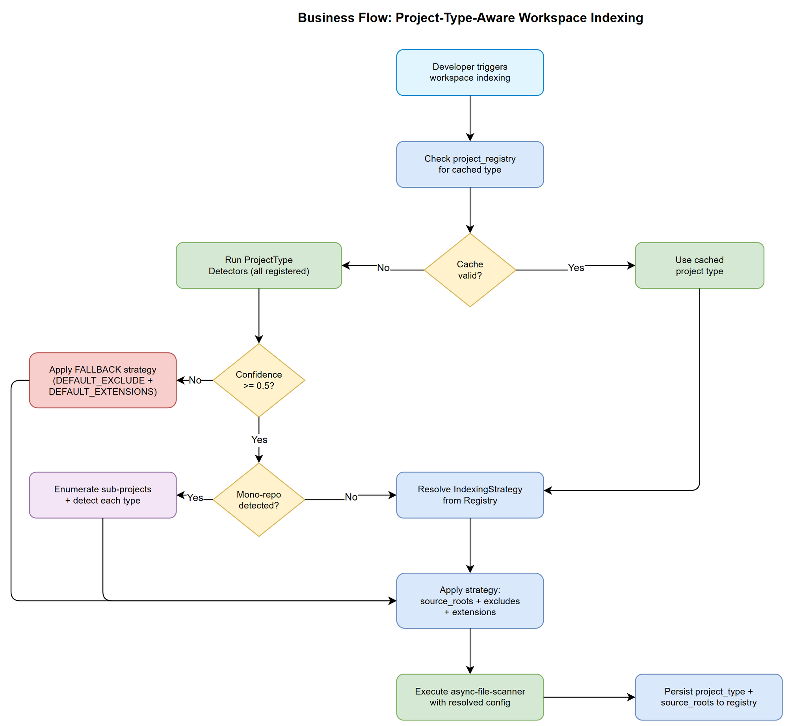
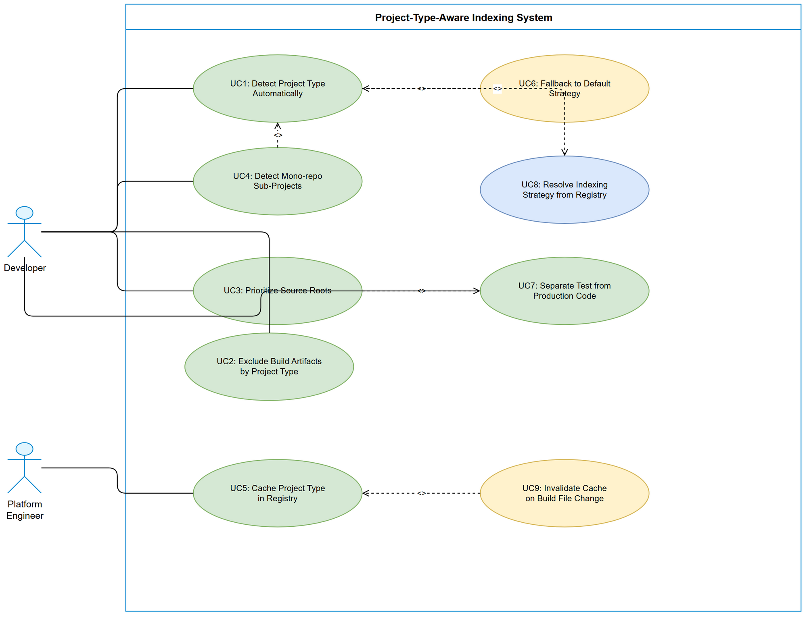

# Business Requirements Document (BRD)

## SA4E Code Intelligence — SA4E-108: [Indexing] Project-Type-Aware Workspace Indexing Strategy

---

## Document Information

| Field | Value |
|-------|-------|
| Jira Ticket | SA4E-108 |
| Title | [Indexing] Project-Type-Aware Workspace Indexing Strategy |
| Author | BA Agent |
| Version | 1.0 |
| Date | 2025-01-27 |
| Status | Draft |

---

## Author Tracking

| Role | Name - Position | Responsibility |
|------|-----------------|----------------|
| Author | BA Agent – Business Analyst | Create document |
| Peer Reviewer | TA Agent – Technical Architect | Review document |

---

## Revision History

| Version | Date | Author | Changes |
|---------|------|--------|---------|
| 1.0 | 2025-01-27 | BA Agent | Initiate document — auto-generated from Jira ticket SA4E-108 and Reference Analysis |

---

## Sign-Off

| Name | Signature and date |
|------|--------------------|
| | ☐ I agree and confirm all criteria on this BRD as expected requirements |
| | ☐ I agree and confirm all criteria on this BRD as expected requirements |

---

## 1. Introduction

### 1.1 Scope

SA4E-108 addresses the critical limitation of the current workspace indexer which uses hardcoded `DEFAULT_EXCLUDE` and `DEFAULT_EXTENSIONS` patterns (defined in `backend/src/config/index.ts`) for ALL project types regardless of their technology stack. This results in inefficient scanning, missed source roots, and indexing of irrelevant files.

The scope covers:
- **Project Type Detection**: Automatic identification of project type from build files (pom.xml, package.json, build.gradle, pyproject.toml, etc.)
- **Type-Specific Indexing Strategy**: Per-project-type configuration for source roots, exclude patterns, and file extensions
- **KB-Driven Type Definitions**: Project type configurations stored in Knowledge Base — NOT hardcoded in source code. New types can be added at runtime by ingesting new definitions into KB without code changes.
- **Mono-repo Support**: Detection of workspace roots and sub-project enumeration
- **Strategy Registry**: KB-backed extensible registry — detectors query KB for type definitions at detection time
- **Caching**: Persistent storage of detected project type in `project_registry` table

### 1.2 Out of Scope

- Language-specific code analysis (syntax/semantic parsing beyond file scanning)
- IDE-level project settings import (reading `.idea/`, `.vscode/` configs)
- UI-based project type management (types are managed via KB ingestion — CLI/API, not GUI)
- Real-time file system watching for project type changes (re-detection on manual trigger only)
- Cross-repository indexing (only single workspace at a time)

### 1.3 Preliminary Requirement

- Current indexer infrastructure (`async-file-scanner.ts`) must be functional
- `project_registry` table schema must support additional columns for project type metadata
- Extension must support sending additional metadata (project type) in indexing requests

---

## 2. Business Requirements

### 2.1 High Level Process Map

The system performs a 4-phase process when indexing a workspace:

1. **KB Load Phase** — Query Knowledge Base for all registered project type definitions (signals, excludes, source roots, extensions)
2. **Detection Phase** — Scan workspace root for build-file signatures and match against KB-loaded type definitions
3. **Strategy Resolution Phase** — Map detected type to its KB-defined indexing strategy (source roots, excludes, extensions)
4. **Indexing Phase** — Execute file scanning using the resolved strategy instead of hardcoded defaults

For mono-repos, the detection phase identifies sub-project boundaries and applies per-project strategies.

> **Key Architecture Decision:** Project type definitions are stored in KB as structured entries (type=PROJECT_TYPE_CONFIG). Adding a new project type requires ONLY ingesting a new KB entry — no code changes needed. The 15 initial types ship as seed data ingested into KB at first run.



### 2.2 List of User Stories / Use Cases

| # | Story / Use Case / Epic | Priority | Source Ticket |
|---|-------------------------|----------|---------------|
| 1 | As a developer, I want the indexer to detect my project type automatically so that only relevant source files are indexed | MUST HAVE | SA4E-108 |
| 2 | As a developer, I want build artifacts excluded based on my project type so that index results are clean and accurate | MUST HAVE | SA4E-108 |
| 3 | As a developer, I want source roots prioritized for my project type so that important code is indexed first | MUST HAVE | SA4E-108 |
| 4 | As a developer working in a mono-repo, I want each sub-project indexed with its own strategy so that cross-project noise is eliminated | SHOULD HAVE | SA4E-108 |
| 5 | As a platform engineer, I want detected project type cached in the registry so that re-indexing is fast without re-detection | SHOULD HAVE | SA4E-108 |
| 6 | As a developer using an unsupported project type, I want the indexer to fall back to current behavior so that indexing still works | MUST HAVE | SA4E-108 |
| 7 | As a developer, I want test code separated from production code in indexing metadata so that search results can be filtered | COULD HAVE | SA4E-108 |
| 8 | As a platform engineer, I want project type definitions stored in KB so that new types can be added at runtime without code changes | MUST HAVE | SA4E-108 |
| 9 | As a platform engineer, I want the LLM to auto-discover unknown project types so that the system self-upgrades without manual intervention | SHOULD HAVE | SA4E-108 |

---

### 2.3 Details of User Stories

---

#### Business Flow



**Step 1:** Developer opens workspace (or triggers re-index) in the IDE extension.

**Step 2:** Extension sends indexing request to backend. Backend initiates project type detection.

**Step 3:** `ProjectTypeDetector` scans workspace root for build-file signatures (pom.xml, package.json, etc.). Each registered detector returns a confidence score (0.0–1.0).

**Step 4:** Highest-confidence detector wins. If multiple detectors tie, mono-repo detection is triggered.

**Step 5:** `ProjectTypeRegistry` maps the detected type to its `ProjectIndexingStrategy` (source roots, excludes, extensions).

**Step 6:** `async-file-scanner` executes scanning using the resolved strategy.

**Step 7:** Detected project type + source roots are persisted in `project_registry` table for future re-indexing.

> **Note:** If no detector exceeds a minimum confidence threshold (0.5), the fallback strategy (current DEFAULT_EXCLUDE + DEFAULT_EXTENSIONS) is applied — ensuring backward compatibility.

---

#### STORY 1: Automatic Project Type Detection

> As a developer, I want the indexer to detect my project type automatically so that only relevant source files are indexed.

**Requirement Details:**

1. System MUST detect project type by scanning for build-file signatures at workspace root and up to 2 levels deep
2. Supported project types at launch:
   - `java-maven` (pom.xml)
   - `java-gradle` (build.gradle, build.gradle.kts)
   - `nodejs` (package.json)
   - `python` (setup.py, pyproject.toml, requirements.txt)
   - `salesforce` (sfdx-project.json)
   - `rust` (Cargo.toml)
   - `go` (go.mod)
   - `dotnet` (*.csproj, *.sln, *.fsproj)
   - `c-cpp` (CMakeLists.txt, Makefile, meson.build)
   - `kotlin-multiplatform` (build.gradle.kts + KMP markers)
   - `flutter-dart` (pubspec.yaml)
   - `swift-ios` (Package.swift, *.xcodeproj, *.xcworkspace)
   - `php` (composer.json)
   - `ruby` (Gemfile, *.gemspec)
   - `pega` (*.pega.json rules directory pattern)
3. Each detector MUST return a confidence score between 0.0 and 1.0
4. Detection results MUST include: project_type, build_tool, detected_files list
5. Detection MUST complete within 500ms for workspaces up to 10,000 files

**Acceptance Criteria:**

1. AC1: Given a workspace with `pom.xml` at root, the system detects `java-maven` with confidence >= 0.9
2. AC2: Given a workspace with `package.json` at root, the system detects `nodejs` with confidence >= 0.9
3. AC3: Given a workspace with both `pom.xml` and `package.json`, the system returns both detections with respective confidence scores
4. AC4: Given a workspace with no recognized build files, the system returns fallback type with confidence 0.0
5. AC5: Detection completes within 500ms for a workspace with 10,000 files

---

#### STORY 2: Type-Specific Build Artifact Exclusion

> As a developer, I want build artifacts excluded based on my project type so that index results are clean and accurate.

**Requirement Details:**

1. Each project type defines its own exclude patterns:
   - Java/Maven: `target/`, `.mvn/`, `.idea/`
   - Java/Gradle: `build/`, `.gradle/`, `.idea/`
   - Node.js: `node_modules/`, `dist/`, `build/`, `.next/`, `.nuxt/`
   - Python: `__pycache__/`, `.venv/`, `venv/`, `dist/`, `*.egg-info/`, `.mypy_cache/`
   - Salesforce: `.sfdx/`, `.sf/`
   - Rust: `target/`
   - Go: `vendor/` (if go.sum exists)
   - .NET/C#: `bin/`, `obj/`, `.vs/`, `packages/`
   - C/C++: `build/`, `cmake-build-*/`, `out/`, `*.o`, `*.a`, `*.so`
   - Kotlin Multiplatform: `build/`, `.gradle/`, `.kotlin/`
   - Flutter/Dart: `.dart_tool/`, `build/`, `.pub-cache/`
   - Swift/iOS: `.build/`, `DerivedData/`, `Pods/`, `*.xcarchive`
   - PHP: `vendor/`, `.phpunit.cache/`
   - Ruby: `vendor/bundle/`, `.bundle/`, `tmp/`, `coverage/`
   - Pega: `__staging__/`, `*.bak.json`
2. Type-specific excludes REPLACE the hardcoded `DEFAULT_EXCLUDE` array (not merge)
3. A common base exclude set always applies: `.git/`, `.svn/`, `.hg/`

**Acceptance Criteria:**

1. AC1: Java/Maven project does NOT index files under `target/` directory
2. AC2: Node.js project does NOT index files under `node_modules/` directory
3. AC3: Python project does NOT index files under `__pycache__/` or `.venv/`
4. AC4: Common excludes (.git/) always apply regardless of project type
5. AC5: Unrecognized project types use current DEFAULT_EXCLUDE (backward compatible)

---

#### STORY 3: Source Root Prioritization

> As a developer, I want source roots prioritized for my project type so that important code is indexed first.

**Requirement Details:**

1. Each project type defines source root directories:
   - Java/Maven: `src/main/java/`, `src/main/resources/`
   - Java/Gradle: `src/main/java/`, `src/main/kotlin/`
   - Node.js: `src/`, `lib/`
   - Python: `src/`, `app/`, `lib/`
   - Salesforce: `force-app/main/default/`
   - Rust: `src/`
   - Go: `./` (all .go files at any level)
   - .NET/C#: `src/`, project directories containing `*.csproj`
   - C/C++: `src/`, `include/`, `lib/`
   - Kotlin Multiplatform: `src/commonMain/`, `src/jvmMain/`, `src/jsMain/`
   - Flutter/Dart: `lib/`, `bin/`
   - Swift/iOS: `Sources/`, `src/`
   - PHP: `src/`, `app/`, `lib/`
   - Ruby: `lib/`, `app/`
   - Pega: `rules/` (JSON rule files directory)
2. Source root files are indexed BEFORE other files in the workspace
3. Files outside source roots but matching extensions are still indexed (lower priority)
4. Indexing metadata includes a `source_category` field: `production`, `test`, `config`, `other`

**Data Fields:**

| Field | Type | Required | Description | Example |
|-------|------|----------|-------------|---------|
| source_roots | JSON array | Yes | Relative paths of source directories | `["src/main/java", "src/main/resources"]` |
| test_roots | JSON array | No | Relative paths of test directories | `["src/test/java"]` |
| source_category | Enum | Yes | Classification of indexed file | `production` / `test` / `config` / `other` |

**Acceptance Criteria:**

1. AC1: Java/Maven project indexes `src/main/java/` files before root-level files
2. AC2: Source category is correctly set to `test` for files under test directories
3. AC3: Files outside defined source roots are still indexed (not excluded)
4. AC4: Source root paths are stored in `project_registry` for reference

---

#### STORY 4: Mono-repo Sub-Project Detection

> As a developer working in a mono-repo, I want each sub-project indexed with its own strategy so that cross-project noise is eliminated.

**Requirement Details:**

1. Mono-repo detection triggers when workspace root contains:
   - `lerna.json` — Lerna mono-repo
   - `pnpm-workspace.yaml` — pnpm workspace
   - `nx.json` — Nx workspace
   - Multiple `package.json` in subdirectories (npm/yarn workspaces defined in root `package.json`)
   - Multiple `pom.xml` in subdirectories (Maven multi-module)
2. Each sub-project is detected independently and gets its own strategy
3. Sub-project boundaries are respected during indexing (no file belongs to multiple sub-projects)
4. Top-level shared code (common/, shared/) inherits root project type or uses its own detection

**Acceptance Criteria:**

1. AC1: Workspace with `lerna.json` and 3 packages detects 3 sub-projects
2. AC2: Each sub-project has its own source_roots and exclude patterns
3. AC3: Maven multi-module project (parent pom + child modules) detects each module
4. AC4: Nx workspace with mixed app types (React + Node backend) detects correctly
5. AC5: If mono-repo detection fails, fall back to single-project detection

---

#### STORY 5: Project Type Caching in Registry

> As a platform engineer, I want detected project type cached in the registry so that re-indexing is fast without re-detection.

**Requirement Details:**

1. Detected project type is stored in `project_registry` table with:
   - `project_type` (varchar): detected type identifier
   - `build_tool` (varchar): detected build tool
   - `source_roots` (JSON): array of source root paths
   - `detection_confidence` (float): confidence score at detection time
   - `detected_at` (timestamp): when detection occurred
2. On re-index, system checks if cached type is still valid:
   - If build file still exists and hasn't changed → use cached type (skip detection)
   - If build file removed or changed → re-run detection
3. Cache invalidation triggers: manual re-index request, build file modification

**Acceptance Criteria:**

1. AC1: After first index, `project_registry` contains project_type and source_roots
2. AC2: Second index uses cached type without re-detection (measurable latency reduction)
3. AC3: Removing pom.xml and re-indexing triggers re-detection
4. AC4: Cache includes confidence score for debugging

---

#### STORY 6: Fallback to Default Behavior

> As a developer using an unsupported project type, I want the indexer to fall back to current behavior so that indexing still works.

**Requirement Details:**

1. If no detector returns confidence >= 0.5, the fallback strategy activates
2. Fallback strategy = current `DEFAULT_EXCLUDE` + `DEFAULT_EXTENSIONS` from `config/index.ts`
3. Fallback MUST be logged for observability: "No project type detected, using fallback strategy"
4. Fallback does NOT prevent indexing — it ensures backward compatibility

**Acceptance Criteria:**

1. AC1: Workspace with unknown build system still gets indexed
2. AC2: Fallback uses exact same patterns as current hardcoded defaults
3. AC3: Fallback event is logged with workspace path for debugging
4. AC4: No regression in indexing behavior for currently supported workspaces

---

#### STORY 7: Test/Production Code Separation

> As a developer, I want test code separated from production code in indexing metadata so that search results can be filtered.

**Requirement Details:**

1. Each project type strategy defines test root patterns:
   - Java: `src/test/java/`, `src/test/resources/`
   - Node.js: `__tests__/`, `*.test.ts`, `*.spec.ts`, `test/`, `tests/`
   - Python: `tests/`, `test/`, `*_test.py`
   - Rust: files containing `#[cfg(test)]`, `tests/`
   - Go: `*_test.go`
   - .NET/C#: `*.Tests/`, `*.UnitTests/`, `*Test.cs`
   - C/C++: `test/`, `tests/`, `*_test.cpp`, `*_test.c`
   - Kotlin Multiplatform: `src/commonTest/`, `src/jvmTest/`
   - Flutter/Dart: `test/`, `*_test.dart`
   - Swift/iOS: `Tests/`, `*Tests.swift`
   - PHP: `tests/`, `*Test.php`
   - Ruby: `spec/`, `test/`, `*_spec.rb`, `*_test.rb`
   - Pega: N/A (no test concept in Pega rules)
2. Indexed files receive `source_category = "test"` when matched
3. API consumers can filter search results by source_category

**Acceptance Criteria:**

1. AC1: Java test files under `src/test/` are categorized as `test`
2. AC2: Node.js files matching `*.test.ts` are categorized as `test`
3. AC3: API search endpoint supports filtering by source_category
4. AC4: Production code is never incorrectly categorized as test

---

#### STORY 8: KB-Driven Project Type Definitions (Extensible Registry)

> As a platform engineer, I want project type definitions stored in KB so that new types can be added at runtime without code changes.

**Requirement Details:**

1. Project type definitions are stored in Knowledge Base as structured entries with type=`PROJECT_TYPE_CONFIG`
2. Each KB entry contains a complete type definition:
   ```json
   {
     "type_id": "java-maven",
     "display_name": "Java (Maven)",
     "signals": [{"file": "pom.xml", "confidence": 0.9}, {"file": ".mvn/", "confidence": 0.7}],
     "source_roots": ["src/main/java/", "src/main/resources/"],
     "test_roots": ["src/test/java/", "src/test/resources/"],
     "exclude_patterns": ["target/", ".mvn/", ".idea/"],
     "extensions": [".java", ".xml", ".properties"],
     "mono_repo_signals": ["<modules>"],
     "priority": 10
   }
   ```
3. Detection engine queries KB at startup (or first detection) via `mem_search(query="PROJECT_TYPE_CONFIG", type="ARCHITECTURE")`
4. Results are cached in-memory for the session (invalidated on KB update or manual refresh)
5. Adding a new project type = ingesting a new KB entry with `mem_ingest(content=..., type="ARCHITECTURE", tags="project-type-config,{type_id}")`
6. The 15 initial types ship as **seed data** — ingested into KB at first run if not present
7. No code changes required to support a new project type — only KB data

**Acceptance Criteria:**

1. AC1: System reads project type definitions from KB at detection time (not from hardcoded source)
2. AC2: Ingesting a new `PROJECT_TYPE_CONFIG` entry into KB makes it immediately available for detection
3. AC3: Removing a KB entry disables that project type detection (gracefully — no crash)
4. AC4: If KB is empty/unavailable, system falls back to a minimal built-in default set (backward compatible)
5. AC5: KB entries include full schema (signals, source_roots, test_roots, excludes, extensions)
6. AC6: Seed data (15 initial types) is auto-ingested on first startup if KB has no PROJECT_TYPE_CONFIG entries

**KB Entry Schema:**

| Field | Type | Required | Description |
|-------|------|----------|-------------|
| type_id | string | Yes | Unique identifier (e.g., `java-maven`, `nodejs`) |
| display_name | string | Yes | Human-readable name |
| signals | array | Yes | Files/patterns that indicate this type, each with confidence weight |
| source_roots | array | Yes | Directories containing production source |
| test_roots | array | No | Directories containing test code |
| exclude_patterns | array | Yes | Directories/patterns to exclude from indexing |
| extensions | array | Yes | File extensions relevant to this type |
| mono_repo_signals | array | No | Patterns indicating mono-repo sub-project |
| priority | number | No | Resolution order when multiple types match (higher = checked first) |

---

#### STORY 9: LLM Auto-Discovery of Unknown Project Types

> As a platform engineer, I want the LLM to auto-discover unknown project types so that the system self-upgrades without manual intervention.

**Requirement Details:**

1. When detection fallback activates (no type confidence >= 0.5), system triggers an async LLM Discovery Task
2. LLM receives a list of files at workspace root (top 50 filenames) and analyzes the project structure
3. LLM returns a structured `PROJECT_TYPE_CONFIG` JSON matching the KB schema (Story 8)
4. System validates the LLM output against zod schema before ingesting into KB
5. Discovered types are tagged with `"auto_discovered": true` to distinguish from human-curated seed types
6. Discovery is rate-limited: max 1 discovery attempt per workspace per day
7. Discovery does NOT block indexing — fallback completes normally, new type available on next index

**LLM Discovery Prompt (stored in KB as PROCEDURE):**
```
Given these files at workspace root: {file_list}

Identify the project type. Return JSON with:
- type_id, display_name, signals (file + confidence), source_roots, test_roots, 
  exclude_patterns, extensions, mono_repo_signals, priority

If you cannot determine the type with confidence, return null.
```

**Acceptance Criteria:**

1. AC1: Workspace with `mix.exs` (Elixir) triggers LLM discovery when no KB entry exists for Elixir
2. AC2: LLM output is validated — invalid JSON or missing required fields are rejected (not ingested)
3. AC3: After successful discovery, next detection run detects the new type from KB
4. AC4: Discovery is async — indexing completes with fallback within 500ms regardless of LLM latency
5. AC5: Same workspace does not trigger discovery more than once per 24 hours
6. AC6: Auto-discovered types can be promoted to "curated" by admin removing the `auto_discovered` flag
7. AC7: If LLM returns null (unable to determine), no KB entry is created and event is logged

**Safeguards:**

| Safeguard | Implementation |
|-----------|---------------|
| Schema validation | Zod parse before ingestion — reject malformed output |
| Rate limiting | 1 discovery per workspace per 24h (stored in project_registry) |
| Human review flag | `auto_discovered: true` distinguishes from curated types |
| No blocking | Discovery runs in background worker, not in detection path |
| Confidence floor | LLM must assert at least one signal with confidence >= 0.7 |
| Deduplication | Check KB for existing type_id before ingesting |

---

## 3. Dependencies

| Dependency | Type | Related Ticket | Description |
|------------|------|----------------|-------------|
| async-file-scanner.ts | System | N/A | Current scanner must accept dynamic config (source roots, excludes, extensions) instead of hardcoded defaults |
| project_registry table | System | N/A | Database schema must support new columns (project_type, build_tool, source_roots, detection_confidence) |
| AppConfig (config/index.ts) | System | N/A | Configuration module must support per-project overrides of DEFAULT_EXCLUDE and DEFAULT_EXTENSIONS |
| Extension-Backend communication | System | N/A | Extension must pass detected project type hint in indexing API requests |
| Knowledge Base (SA4E-85) | System | SA4E-85 | KB service stores project type configs AND indexed file metadata with source_category |
| LLM Provider (Extension) | System | N/A | Extension's LLM client needed for auto-discovery (Story 9) — uses existing EnrichmentObserver infrastructure |

---

## 4. Stakeholders

| Role | Name / Team | Responsibility | Source |
|------|-------------|----------------|--------|
| Product Owner | Project Lead | Approve requirements, UAT | Jira reporter |
| Developer | Backend Team | Implement detection + strategy logic | Jira assignee |
| Developer | Extension Team | Pass project type to backend | Jira assignee |
| QA | QA Team | Verify detection accuracy across project types | Pipeline |

---

## 5. Risks and Assumptions

### 5.1 Risks

| Risk | Impact | Likelihood | Mitigation |
|------|--------|------------|------------|
| False positive detection (e.g., package.json in non-Node project) | Medium | Medium | Confidence scoring + multi-signal detection (look for lock files too) |
| Performance regression for large mono-repos | High | Low | Cap sub-project enumeration depth; parallelize detection |
| Breaking change for existing indexed workspaces | High | Low | Fallback strategy ensures backward compatibility; migration path for cached data |
| Polyglot repos confuse detection | Medium | Medium | Support multiple detected types per workspace; highest confidence wins for root |

### 5.2 Assumptions

- Build files (pom.xml, package.json, etc.) are located at workspace root or within 2 levels of nesting
- Workspace root corresponds to a single logical project (or mono-repo)
- The extension has access to workspace root path
- `project_registry` table can be extended with new columns without migration issues (SQLite)
- Confidence threshold of 0.5 is sufficient to distinguish real projects from incidental build files

---

## 6. Non-Functional Requirements

| Category | Requirement | Details |
|----------|-------------|---------|
| Performance | Detection must complete within 500ms | For workspaces up to 10,000 files at root scan depth |
| Performance | Re-index with cached type >= 50% faster than first index | Skip detection phase entirely |
| Performance | KB query for type definitions cached in-memory | First query loads from KB, subsequent reads from cache |
| Scalability | Support up to 20 sub-projects in a mono-repo | Enumeration + per-project strategy resolution |
| Scalability | Support unlimited project type definitions in KB | No hardcoded limit on number of types |
| Extensibility | New project types addable via KB ingestion only | No code changes, no recompilation, no redeploy needed |
| Extensibility | KB entry schema is self-describing | Each entry contains all info needed for detection + indexing |
| Reliability | Fallback ensures no indexing failure | If KB unavailable or empty, use built-in minimal defaults |
| Maintainability | 15 seed types shipped as JSON seed file | Auto-ingested into KB on first startup |
| Maintainability | Each type definition is independently testable | Validate KB entry schema before ingestion |

---

## 7. Related Tickets

| Ticket Key | Summary | Status | Type | Relationship |
|------------|---------|--------|------|--------------|
| SA4E-108 | [Indexing] Project-Type-Aware Workspace Indexing Strategy | In Progress | Story | Main ticket |
| SA4E-85 | Knowledge Service | Done | Story | Provides KB persistence layer used by indexer |

---

## 8. Appendix

### Glossary

| Term | Definition |
|------|------------|
| Project Type | Classification of a workspace based on its build system and technology stack (e.g., java-maven, nodejs, python) |
| Indexing Strategy | A configuration object that defines source roots, exclude patterns, and file extensions for a specific project type |
| Source Root | A directory within a project that contains primary source code files (e.g., src/main/java for Maven projects) |
| Confidence Score | A numeric value (0.0-1.0) returned by a project type detector indicating certainty of detection |
| Mono-repo | A single repository containing multiple independent projects or packages, each with its own build configuration |
| Fallback Strategy | The default indexing behavior (current DEFAULT_EXCLUDE + DEFAULT_EXTENSIONS) applied when no project type is detected |
| Detection Signal | A file or pattern that indicates a specific project type (e.g., pom.xml signals java-maven) |
| Project Registry | Database table storing detected project metadata (type, source roots, build tool) for caching |

### Reference Documents

| Document | Link / Location |
|----------|-----------------|
| Reference Analysis | [REFERENCE-ANALYSIS.md](REFERENCE-ANALYSIS.md) |
| Project Structure | [project-structure.md](../../.analysis/code-intelligence/project-structure.md) |
| Current Config | `backend/src/config/index.ts` (DEFAULT_EXCLUDE, DEFAULT_EXTENSIONS) |
| Current Scanner | `backend/src/engine/indexer/async-file-scanner.ts` |

### Diagram Index

| # | Diagram | Image | Source (editable) |
|---|---------|-------|-------------------|
| 1 | Use Case Diagram | [use-case.png](diagrams/use-case.png) | [use-case.drawio](diagrams/use-case.drawio) |
| 2 | Business Flow | [business-flow.png](diagrams/business-flow.png) | [business-flow.drawio](diagrams/business-flow.drawio) |
