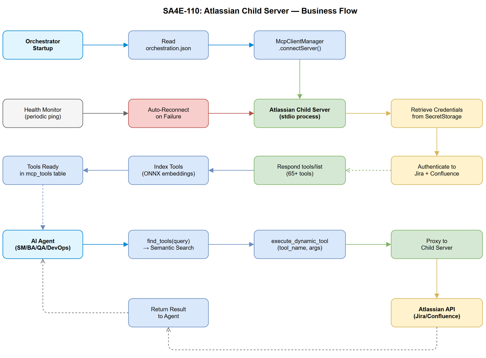

# Business Requirements Document (BRD)

## SA4E — SA4E-110: Integrate Atlassian MCP Server as Child Server in Orchestrator

---

## Document Information

| Field | Value |
|-------|-------|
| Jira Ticket | SA4E-110 |
| Title | Integrate Atlassian MCP Server as Child Server in Orchestrator |
| Author | BA Agent |
| Version | 1.0 |
| Date | 2026-08-13 |
| Status | Draft |
| Architecture Pattern | ai-agent (child server integration) |

---

## Author Tracking

| Role | Name - Position | Responsibility |
|------|-----------------|----------------|
| Author | BA Agent – Business Analyst | Create document |
| Peer Reviewer | TA Agent – Technical Architect | Review document |

---

## Revision History

| Version | Date | Author | Changes |
|---------|------|--------|---------|
| 1.0 | 2026-08-13 | BA Agent | Initiate document — auto-generated from Jira ticket SA4E-110 and linked tickets |
| 1.1 | 2026-08-14 | SM | Update Story 7 — add Extension-side credential config UI + IPC sender requirements |

---

## Sign-Off

| Name | Signature and date |
|------|--------------------|
| | ☐ I agree and confirm all criteria on this BRD as expected requirements |
| | ☐ I agree and confirm all criteria on this BRD as expected requirements |

---

## 1. Introduction

### 1.1 Scope

Integrate the open-source Atlassian MCP server (Jira-MCP-Extension, 42 Jira tools + 23 Confluence tools) as a child server in the SA4E orchestrator. The child server will be registered via `McpClientManager`, indexed by `find_tools`, and executable via `execute_dynamic_tool`. This enables all AI agents in the SDLC pipeline to interact with Jira and Confluence directly through the MCP protocol.

The integration includes:
- Copying and refactoring source from the reference repo into `backend/src/servers/atlassian/`
- Replacing axios with native fetch/undici (project standard)
- Adding a `jira_transition_by_name` helper tool
- Adding a Jira file attachment upload tool (multipart)
- Wiring credentials through the existing AuthManager/SecretStorage pattern
- Registering as a child server with health check and auto-reconnect

### 1.2 Out of Scope

- Atlassian OAuth 2.0 (3LO) interactive login flow — only PAT/Basic Auth supported in v1
- Jira Service Management (JSM) customer portal tools — existing tools retained but not enhanced
- Confluence Cloud-only features (Whiteboard API, Smart Links)
- Migration of existing external Atlassian MCP server at port 3061 — coexistence until full cutover

### 1.3 Preliminary Requirements

- SA4E-37 (Health check and auto-reconnect for child MCP servers) must be implemented or in-progress
- SA4E-42 (find_tools re-index on late-connecting child servers) must be resolved
- Valid Jira Cloud/Server/DC instance with API access (PAT or Basic Auth)
- Valid Confluence instance with API access

---

## 2. Business Requirements

### 2.1 High Level Process Map

The Atlassian child server provides a bridge between the SA4E orchestrator and Atlassian APIs (Jira + Confluence). On orchestrator startup, the child server connects, registers its 65+ tools, and indexes them for semantic discovery. AI agents (SM, BA, QA, DevOps) can then discover and execute Atlassian tools seamlessly through the standard `find_tools` → `execute_dynamic_tool` pattern.

### 2.2 List of User Stories / Use Cases

| # | Story / Use Case | Priority | Source Ticket |
|---|-----------------|----------|---------------|
| 1 | As an SM agent, I want to discover all Jira tools via `find_tools("jira")` so that I can manage tickets without hardcoding tool names | MUST HAVE | SA4E-110 |
| 2 | As an SM agent, I want to transition Jira issues by name (not ID) so that workflow automation is human-readable | MUST HAVE | SA4E-110 |
| 3 | As a BA agent, I want to search Confluence pages so that I can find reference documentation during BRD creation | MUST HAVE | SA4E-110 |
| 4 | As a QA agent, I want to attach test reports to Jira via multipart upload so that artifacts are linked to tickets | MUST HAVE | SA4E-110 |
| 5 | As an orchestrator, I want the Atlassian child server to auto-connect on startup and auto-reconnect on failure so that tools are always available | MUST HAVE | SA4E-37 |
| 6 | As a DevOps agent, I want to query Jira agile boards and sprints so that release planning data is accessible | SHOULD HAVE | SA4E-110 |
| 7 | As a security agent, I want credentials stored in SecretStorage (OS keychain) so that API tokens are never exposed in config files | MUST HAVE | SA4E-110 |
| 8 | As a developer, I want all source files ≤ 200 lines and functions ≤ 20 lines so that the codebase remains maintainable | MUST HAVE | SA4E-110 |

---

### 2.3 Details of User Stories

---

#### Business Flow

**Step 1:** Orchestrator reads `orchestration.json` on startup and finds the `atlassian` child server entry.

**Step 2:** `McpClientManager.connectServer("atlassian", config)` establishes connection (stdio transport).

**Step 3:** Child server initializes, authenticates to Jira/Confluence using credentials from SecretStorage.

**Step 4:** Child server responds to `tools/list` with 65+ tool definitions (42 Jira + 23 Confluence).

**Step 5:** Orchestrator indexes all tool definitions with ONNX embeddings into `mcp_tools` table.

**Step 6:** Agent calls `find_tools("jira search")` → returns relevant Jira tools ranked by semantic similarity.

**Step 7:** Agent calls `execute_dynamic_tool("jira_search", { jql: "..." })` → orchestrator proxies to child server → returns results.

**Step 8:** Health monitor pings child server periodically; on failure, triggers auto-reconnect per SA4E-37.

> **Note:** The child server uses stdio transport for process-level isolation. The orchestrator manages its lifecycle.

---

#### STORY 1: Discover Jira Tools via find_tools

> As an SM agent, I want to discover all Jira tools via `find_tools("jira")` so that I can manage tickets without hardcoding tool names.

**Requirement Details:**

1. All 42 Jira tools from the reference repo must be registered and indexed on startup
2. `find_tools("jira")` must return tool list ranked by semantic relevance
3. Tool definitions must include complete `inputSchema` (zod-validated) for each tool
4. Tool names must follow existing convention: `jira_{action}` (e.g., `jira_get_issue`, `jira_search`)

**Acceptance Criteria:**

1. `find_tools("jira")` returns ≥ 42 results with tool names starting with `jira_`
2. Each tool has a valid JSON Schema in `inputSchema`
3. Tools are available within 10 seconds of orchestrator startup
4. `find_tools("jira issue")` returns `jira_get_issue` in top 3 results

---

#### STORY 2: Transition Jira Issue by Name

> As an SM agent, I want to transition Jira issues by name (not ID) so that workflow automation is human-readable.

**Requirement Details:**

1. New tool `jira_transition_by_name` accepts `issue_key` and `transition_name` parameters
2. Tool internally resolves transition name to ID via `GET /rest/api/2/issue/{key}/transitions`
3. Performs case-insensitive fuzzy match on transition name
4. Executes transition via `POST /rest/api/2/issue/{key}/transitions`

**Data Fields:**

| Field | Type | Required | Description | Example |
|-------|------|----------|-------------|---------|
| issue_key | string | Yes | Jira issue key | "SA4E-110" |
| transition_name | string | Yes | Human-readable transition name | "Review Docs" |
| comment | string | No | Comment to add with transition | "Moving to review" |
| fields | object | No | Additional fields required by transition | `{ "resolution": { "name": "Done" } }` |

**Acceptance Criteria:**

1. `execute_dynamic_tool("jira_transition_by_name", { issue_key: "SA4E-1", transition_name: "Review Docs" })` succeeds
2. Case-insensitive match: "review docs" matches "Review Docs"
3. Returns clear error if transition name not found (with list of available transitions)
4. Returns clear error if transition not applicable to current issue status

---

#### STORY 3: Search Confluence Pages

> As a BA agent, I want to search Confluence pages so that I can find reference documentation during BRD creation.

**Requirement Details:**

1. All 23 Confluence tools from the reference repo must be registered and indexed
2. `find_tools("confluence")` must return all Confluence tools
3. Key tools: `confluence_search`, `confluence_get_page`, `confluence_create_page`, `confluence_update_page`

**Acceptance Criteria:**

1. `find_tools("confluence")` returns ≥ 23 results with tool names starting with `confluence_`
2. `execute_dynamic_tool("confluence_search", { query: "architecture" })` returns search results
3. `execute_dynamic_tool("confluence_get_page", { page_id: "12345" })` returns page content

---

#### STORY 4: Attach Files to Jira (Multipart Upload)

> As a QA agent, I want to attach test reports to Jira via multipart upload so that artifacts are linked to tickets.

**Requirement Details:**

1. New tool `jira_attach_file` accepts `issue_key` and `file_path` parameters
2. Reads file from local filesystem and uploads via multipart/form-data
3. Supports common document types: `.docx`, `.xlsx`, `.pdf`, `.png`, `.drawio`
4. Maximum file size: 50MB (Jira Cloud default limit)

**Data Fields:**

| Field | Type | Required | Description | Example |
|-------|------|----------|-------------|---------|
| issue_key | string | Yes | Target Jira issue | "SA4E-110" |
| file_path | string | Yes | Absolute path to local file | "documents/SA4E-110/BRD-v1-SA4E-110.docx" |

**Acceptance Criteria:**

1. `execute_dynamic_tool("jira_attach_file", { issue_key: "SA4E-110", file_path: "path/to/file.docx" })` uploads and attaches
2. Returns attachment metadata (id, filename, size, mimeType) on success
3. Returns clear error if file not found or exceeds size limit
4. Supports at least `.docx`, `.xlsx`, `.pdf`, `.png`, `.drawio` formats

---

#### STORY 5: Auto-Connect and Auto-Reconnect

> As an orchestrator, I want the Atlassian child server to auto-connect on startup and auto-reconnect on failure so that tools are always available.

**Requirement Details:**

1. Child server listed in `orchestration.json` connects automatically on orchestrator startup
2. Health monitor detects disconnection and triggers reconnect per SA4E-37
3. On reconnect success, tools are re-registered and re-indexed
4. On max retries exhausted, server marked as degraded and SM notified

**Acceptance Criteria:**

1. Orchestrator startup completes with Atlassian child server connected (visible in `orchestration_status`)
2. If child server process crashes, reconnect triggers within health check interval (30s default)
3. After reconnect, `find_tools("jira")` returns full tool list
4. After max retries (configurable, default 3), status shows "disconnected" and no phantom tools in find_tools

---

#### STORY 6: Query Agile Boards and Sprints

> As a DevOps agent, I want to query Jira agile boards and sprints so that release planning data is accessible.

**Requirement Details:**

1. Existing agile tools from reference repo: `jira_get_agile_boards`, `jira_get_sprints`, `jira_get_sprint_issues`
2. These tools must be registered and discoverable

**Acceptance Criteria:**

1. `find_tools("agile board sprint")` returns agile-related tools
2. `execute_dynamic_tool("jira_get_agile_boards", {})` returns list of boards
3. Board and sprint data includes standard fields (id, name, state, dates)

---

#### STORY 7: Secure Credential Storage + Extension Configuration UI

> As a security agent, I want credentials stored in SecretStorage (OS keychain) so that API tokens are never exposed in config files.
> As a user, I want a Settings UI in the Extension to configure Jira/Confluence credentials so that I don't need to manually edit files.

**Requirement Details:**

**Backend (Child Server) — ĐÃ IMPLEMENT:**
1. Child server retrieves credentials via IPC protocol (sends `getCredentials` request, receives response)
2. CredentialManager validates `requestId` correlation and timestamp staleness (≤5s)
3. Builds auth headers (`Basic base64(email:token)` for Cloud, `Bearer PAT` for Server/DC)
4. Supports credential hot-reload without restart

**Extension (Orchestrator/Parent) — CẦN IMPLEMENT:**
5. Settings Panel phải có section "Atlassian Connection" với form fields:
   - Jira Base URL (text input, validates URL format)
   - Email (text input, validates email format — for Cloud)
   - API Token / PAT (password input, masked)
   - Connection Type toggle: Cloud vs Server/DC
   - "Test Connection" button (calls `/rest/api/2/myself` to validate)
   - "Save" button (stores to SecretStorage)
6. Credentials lưu trong VS Code SecretStorage (OS keychain) — KHÔNG file:
   - Key: `kiroSdlc.atlassian.baseUrl`
   - Key: `kiroSdlc.atlassian.email`
   - Key: `kiroSdlc.atlassian.apiToken`
7. IPC message handler trong McpClientManager:
   - Khi child server gửi `{type:'getCredentials', requestId, timestamp}` → Extension đọc từ SecretStorage → respond `{type:'credentials', requestId, timestamp, credentials:{email, apiToken, baseUrl}}`
8. Nếu credentials chưa configured → respond error message rõ ràng: "Atlassian credentials not configured. Open Settings to configure."
9. Credential update (user thay đổi trong Settings) → IPC push new credentials tới child (hot-reload)

**Data Fields:**

| Field | Type | Required | Description | Example |
|-------|------|----------|-------------|---------|
| jira_base_url | string | Yes | Jira instance URL | "https://company.atlassian.net" |
| jira_email | string | Yes (Cloud) | User email for Cloud | "user@company.com" |
| jira_api_token | string | Yes | API token or PAT | "ATATT3xFfGF..." |
| connection_type | enum | Yes | "cloud" or "server" | "cloud" |
| confluence_base_url | string | No | Confluence URL (if different from Jira) | "https://company.atlassian.net/wiki" |

**Acceptance Criteria:**

1. No credentials in any committed file (orchestration.json, .env, config.ts)
2. Settings Panel shows "Atlassian Connection" section with all fields
3. "Test Connection" validates credentials against Jira API and shows success/error
4. Credentials stored in SecretStorage, retrievable at runtime
5. Child server fails gracefully with clear error if credentials not configured
6. Credential update does not require orchestrator restart (hot-reload via IPC push)
7. Extension IPC handler responds within 100ms to child `getCredentials` request
8. Settings UI matches existing Pega Connection section UX pattern (same SettingsPanel)

---

#### STORY 8: Code Quality — File and Function Size

> As a developer, I want all source files ≤ 200 lines and functions ≤ 20 lines so that the codebase remains maintainable.

**Requirement Details:**

1. Reference repo has files exceeding 700 lines — must be refactored during integration
2. `jira/client.ts` (700+ lines) → split into domain-specific modules
3. `jira/tools.ts` (500+ lines) → split by tool category (issues, search, agile, etc.)
4. All `any` types replaced with proper TypeScript interfaces

**Acceptance Criteria:**

1. No file in `backend/src/servers/atlassian/` exceeds 200 lines
2. No function exceeds 20 lines
3. Zero `any` types in production code
4. All API responses have TypeScript interfaces with zod validation schemas

---

## 3. Dependencies

| Dependency | Type | Related Ticket | Description |
|------------|------|----------------|-------------|
| SA4E-37: Health check and auto-reconnect | System | SA4E-37 | Required for child server resilience |
| SA4E-42: find_tools re-index on late connect | System | SA4E-42 | Required so tools are indexed even if child connects after startup |
| Jira Cloud/Server/DC instance | External | N/A | Target Atlassian instance with API access |
| Confluence instance | External | N/A | Target Confluence instance (often same as Jira Cloud) |
| VS Code SecretStorage API | Infrastructure | N/A | OS keychain for credential storage |
| @modelcontextprotocol/sdk | System | N/A | MCP protocol implementation (already in project) |
| undici / native fetch | System | N/A | HTTP client (project standard, replaces axios) |

---

## 4. Stakeholders

| Role | Name / Team | Responsibility | Source |
|------|-------------|----------------|--------|
| SM Agent | Scrum Master | Primary consumer — Jira transitions, status queries | Pipeline orchestrator |
| BA Agent | Business Analyst | Confluence search, Jira ticket reading | Requirements phase |
| QA Agent | Quality Assurance | Jira attachments, test report linking | Testing phase |
| DevOps Agent | DevOps | Agile boards, sprint data, release management | Deployment phase |
| Security Agent | Security | Credential audit, API security review | All phases |
| Developer | Development Team | Implementation, code quality compliance | Implementation phase |

---

## 5. Risks and Assumptions

### 5.1 Risks

| Risk | Impact | Likelihood | Mitigation |
|------|--------|------------|------------|
| Atlassian API rate limiting (Cloud: 100 req/min) | Medium | High | Implement request throttling in child server; batch operations where possible |
| Reference repo uses axios — removal may break edge cases | Medium | Medium | Comprehensive integration testing against real Jira instance |
| Large tool count (65+) may slow find_tools indexing | Low | Low | Batch embedding generation; lazy indexing on first query |
| Credential rotation causes temporary tool unavailability | Medium | Low | Graceful retry with re-auth on 401; hot-reload credentials |
| Jira Server/DC API differences from Cloud | High | Medium | Abstract API version differences behind adapter layer; test both |

### 5.2 Assumptions

- The existing `McpClientManager` and `OrchestrationModule` patterns are stable and sufficient for this integration
- stdio transport provides adequate performance for Atlassian API call volumes
- The reference repo (Jira-MCP-Extension) is MIT-licensed and can be integrated
- Jira Cloud REST API v2/v3 remains backward-compatible during development
- A single Jira/Confluence instance per workspace is sufficient (no multi-tenant)

---

## 6. Non-Functional Requirements

| Category | Requirement | Details |
|----------|-------------|---------|
| Performance | Tool execution latency < 3s for simple queries | Simple GET operations (get_issue, get_page) should complete within 3 seconds end-to-end |
| Performance | find_tools response < 200ms | Semantic search over 65 tools should be near-instant after indexing |
| Performance | Startup connection < 10s | Child server should be connected and tools indexed within 10 seconds of orchestrator start |
| Security | No plaintext credentials on disk | All secrets in OS keychain via SecretStorage |
| Security | API tokens scoped to minimum required permissions | Document required Jira/Confluence permissions |
| Reliability | Auto-reconnect within 30s of failure detection | Per SA4E-37 health check pattern |
| Reliability | Graceful degradation | If Atlassian is unreachable, other tools unaffected |
| Maintainability | File ≤ 200 lines, function ≤ 20 lines | Per project code standards |
| Maintainability | Zero `any` types | All types explicit with interfaces + zod schemas |
| Scalability | Support 65+ tools without performance degradation | Indexing and discovery must scale to tool count |
| Compatibility | Support Jira Cloud + Server/DC (7.x, 8.x, 9.x) | Adapter pattern for API version differences |

---

## 7. Related Tickets

| Ticket Key | Summary | Status | Type | Relationship |
|------------|---------|--------|------|--------------|
| SA4E-110 | Integrate Atlassian MCP Server as Child Server in Orchestrator | To Do | Story | Main ticket |
| SA4E-37 | Health check and auto-reconnect for child MCP servers | In Progress | Story | Dependency (blocks SA4E-110) |
| SA4E-42 | find_tools does not re-index when child MCP server connects late | To Do | Bug | Dependency (blocks SA4E-110) |

---

## 8. Appendix

### Glossary

| Term | Definition |
|------|------------|
| Child Server | An MCP server managed by the orchestrator via McpClientManager; communicates over stdio/http transport |
| Orchestrator | The SA4E backend MCP server that manages child servers and proxies tool execution |
| find_tools | Semantic search tool that discovers available tools by embedding similarity |
| execute_dynamic_tool | Proxy tool that routes execution to the owning child server or internal module |
| PAT | Personal Access Token — authentication credential for Jira Server/DC |
| SecretStorage | VS Code API for storing secrets in the OS keychain (encrypted at rest) |
| stdio transport | Child server communication via stdin/stdout process pipes |

### Reference Documents

| Document | Link / Location |
|----------|-----------------|
| Jira-MCP-Extension (source) | https://github.com/dnguyenminh/Jira-MCP-Extension |
| McpClientManager | backend/src/modules/orchestration/McpClientManager.ts |
| OrchestrationModule | backend/src/modules/orchestration/OrchestrationModule.ts |
| AuthManager | extension/src/auth/AuthManager.ts |
| orchestration.json | .code-intel/orchestration.json |

### Tool Inventory (from Reference Repo)

**Jira Tools (42):**

| Category | Tools |
|----------|-------|
| Issues | jira_get_issue, jira_create_issue, jira_update_issue, jira_delete_issue, jira_assign_issue |
| Search | jira_search (JQL), jira_search_fields |
| Transitions | jira_get_transitions, jira_transition_issue, **jira_transition_by_name** (new) |
| Comments | jira_add_comment, jira_get_comments, jira_update_comment, jira_delete_comment |
| Fields | jira_get_fields, jira_get_field_options |
| Projects | jira_get_all_projects, jira_get_project |
| Agile | jira_get_agile_boards, jira_get_sprints, jira_get_sprint_issues, jira_get_epic_issues |
| Links | jira_link_issues, jira_get_issue_links, jira_get_link_types |
| Worklog | jira_add_worklog, jira_get_worklogs |
| Attachments | jira_get_attachments, **jira_attach_file** (new - multipart) |
| Users | jira_get_users, jira_find_users |
| Watchers | jira_add_watcher, jira_remove_watcher, jira_get_watchers |
| Service Desk | jira_get_queues, jira_get_customers |
| Forms | jira_get_forms |
| Metrics | jira_get_dashboard |
| Development | jira_get_dev_info |

**Confluence Tools (23):**

| Category | Tools |
|----------|-------|
| Search | confluence_search |
| Pages | confluence_get_page, confluence_create_page, confluence_update_page, confluence_delete_page, confluence_get_page_children |
| Comments | confluence_add_comment, confluence_get_comments |
| Labels | confluence_add_labels, confluence_get_labels, confluence_remove_label |
| Users | confluence_get_user, confluence_get_current_user |
| Analytics | confluence_get_page_analytics |
| Attachments | confluence_get_attachments, confluence_upload_attachment |
| Spaces | confluence_get_spaces, confluence_get_space |
| Content | confluence_get_content_by_type |
| Macros | confluence_expand_macros |
| Templates | confluence_get_templates |
| History | confluence_get_page_history |
| Permissions | confluence_get_page_permissions |

### Diagram Index

| # | Diagram | Image | Source (editable) |
|---|---------|-------|-------------------|
| 1 | Business Flow | [business-flow.png](diagrams/business-flow.png) | [business-flow.drawio](diagrams/business-flow.drawio) |
| 2 | Use Case Diagram | [use-case.png](diagrams/use-case.png) | [use-case.drawio](diagrams/use-case.drawio) |
