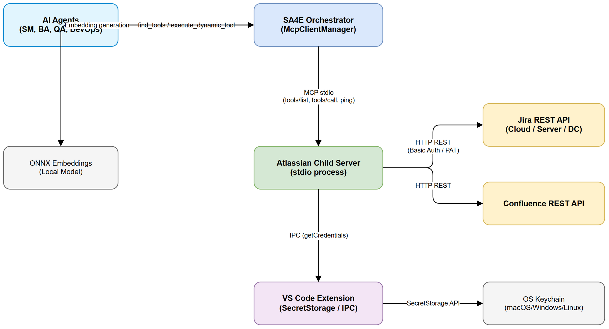
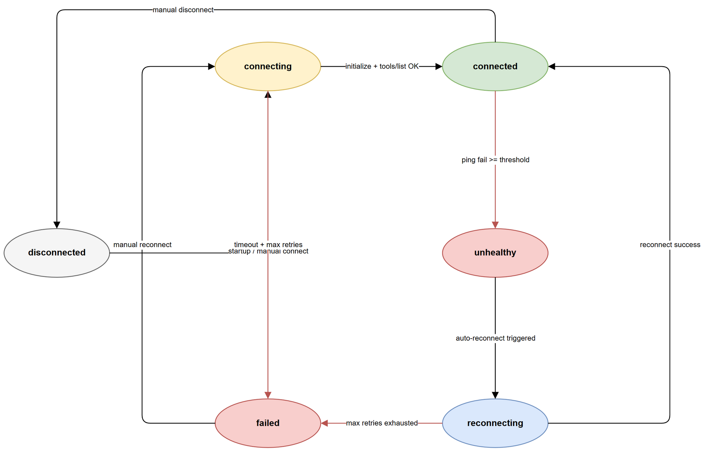
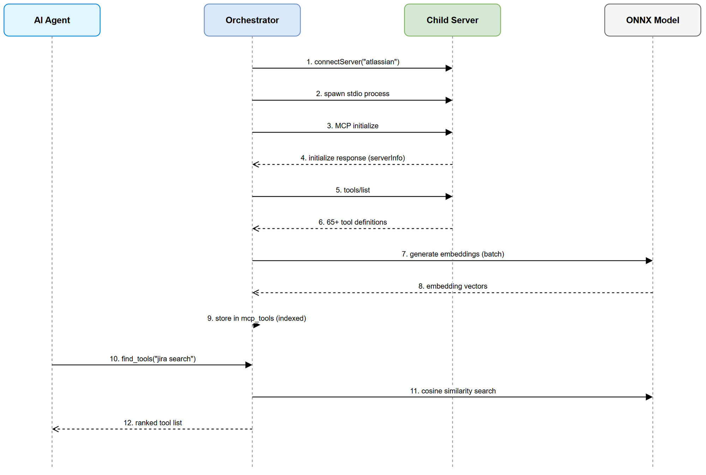
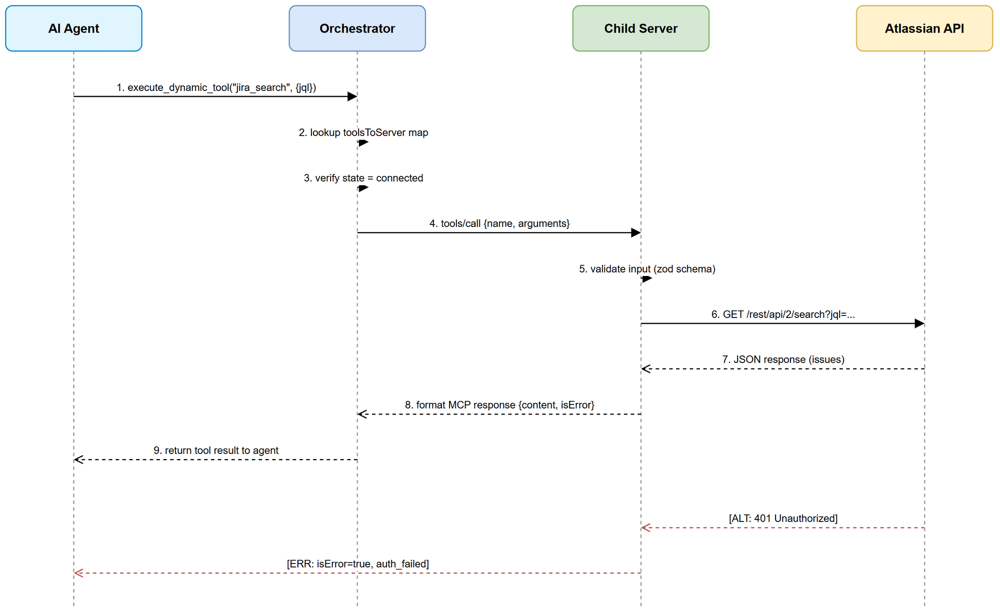
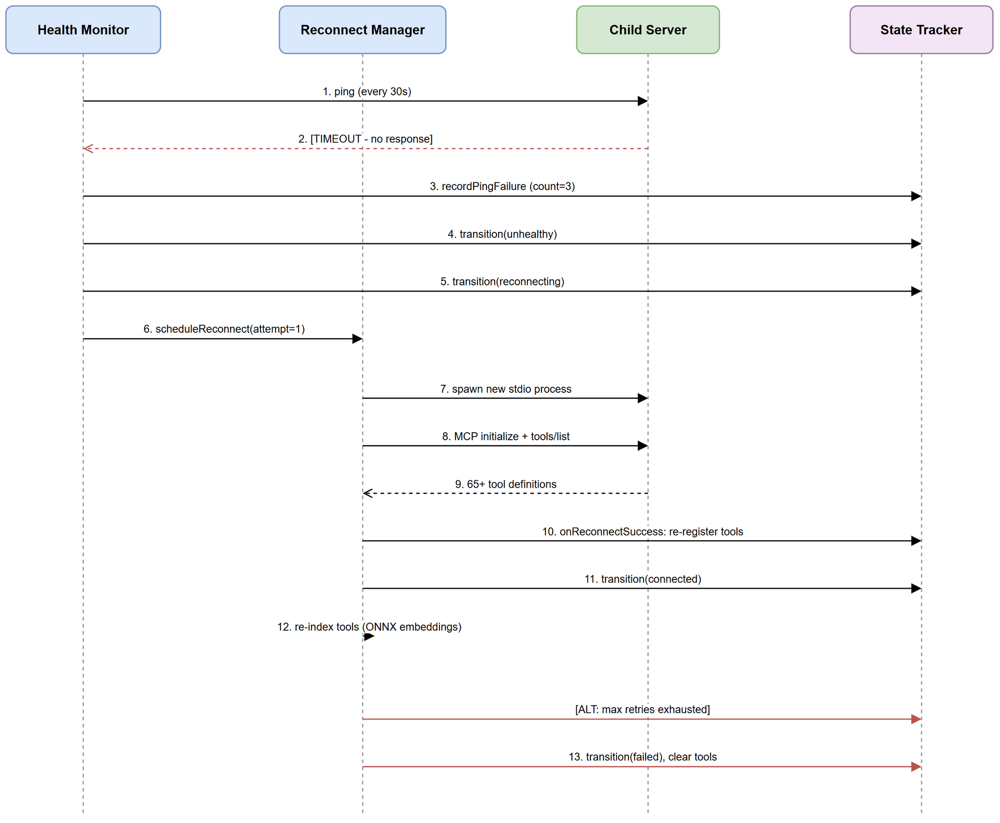

# Functional Specification Document (FSD)

## SA4E — SA4E-110: Integrate Atlassian MCP Server as Child Server in Orchestrator

---

## Document Information

| Field | Value |
|-------|-------|
| Jira Ticket | SA4E-110 |
| Title | Integrate Atlassian MCP Server as Child Server in Orchestrator |
| Author | BA Agent |
| Version | 1.1 |
| Date | 2026-08-13 |
| Status | Draft |
| Related BRD | documents/SA4E-110/BRD.md |
| Architecture Pattern | ai-agent (child server integration) |

---

## Revision History

| Version | Date | Author | Changes |
|---------|------|--------|---------|
| 1.0 | 2026-08-13 | BA Agent | Initiate document — translated from BRD v1.0 |
| 1.1 | 2026-08-13 | TA Agent | Technical enrichment — Appendices A-G: TypeScript interfaces, Zod schemas, integration contracts, pseudocode, data model verification, NFR quantification, open issues, security review |

---

## 1. Introduction

### 1.1 Purpose

This FSD specifies the functional behavior of integrating the Atlassian MCP server (42 Jira + 23 Confluence tools) as a child server within the SA4E orchestrator. It defines use cases, business rules, data schemas, error handling, and system interactions for all 8 user stories from the BRD.

### 1.2 Scope

- Child server registration via McpClientManager using stdio transport
- Tool discovery and semantic indexing (65+ tools)
- Tool execution proxying via execute_dynamic_tool
- Credential management through SecretStorage IPC
- Health monitoring, auto-reconnect, and re-indexing
- Two new custom tools: jira_transition_by_name, jira_attach_file

### 1.3 Definitions and Acronyms

| Term | Definition |
|------|------------|
| Child Server | MCP server spawned and managed by the orchestrator via stdio transport |
| Orchestrator | SA4E backend MCP server that manages child servers and proxies tool calls |
| PAT | Personal Access Token for Jira Server/DC authentication |
| SecretStorage | VS Code API storing secrets in OS keychain (encrypted at rest) |
| stdio transport | Communication via stdin/stdout process pipes |
| find_tools | Semantic search tool discovering available tools by embedding similarity |
| execute_dynamic_tool | Proxy tool routing execution to the owning child server |
| IPC | Inter-Process Communication between extension and backend |

### 1.4 References

| Document | Location |
|----------|----------|
| BRD | documents/SA4E-110/BRD.md |
| McpClientManager | backend/src/modules/orchestration/McpClientManager.ts |
| AuthManager | extension/src/auth/AuthManager.ts |
| orchestration.json | .code-intel/orchestration.json |
| SA4E-37 (Health Check) | Related ticket |
| SA4E-42 (Re-index) | Related ticket |

---

## 2. System Overview

### 2.1 System Context Diagram



The Atlassian child server sits between the SA4E orchestrator and Atlassian Cloud/Server APIs. The orchestrator spawns the child server process (stdio), which authenticates to Jira/Confluence using credentials received via IPC from the VS Code extension SecretStorage.

### 2.2 System Architecture

Components:

1. **Orchestrator (McpClientManager)** — Spawns child server, manages lifecycle, proxies tool calls
2. **Atlassian Child Server** — Node.js process communicating via stdio; handles Jira/Confluence API calls
3. **SecretStorage (Extension)** — OS keychain holding Jira/Confluence credentials
4. **Atlassian APIs** — Jira REST API v2/v3, Confluence REST API v2
5. **ONNX Embeddings** — Local embedding model for tool semantic indexing

---

## 3. Functional Requirements

### 3.1 Use Case: UC-01 — Discover Jira Tools via find_tools

**Source:** BRD Story 1

**Use Case ID:** UC-01
**Actor:** SM Agent (or any AI agent)
**Preconditions:**
- Orchestrator is running
- Atlassian child server is connected (state = connected)
- Tools are indexed in mcp_tools table

**Postconditions:** Agent receives ranked list of Jira tools matching query

**Main Flow:**

| Step | Actor | System | Description |
|------|-------|--------|-------------|
| 1 | Agent | | Calls find_tools("jira search") |
| 2 | | Orchestrator | Performs ONNX embedding on query string |
| 3 | | Orchestrator | Queries mcp_tools table by cosine similarity |
| 4 | | Orchestrator | Returns top-K tools ranked by relevance score |
| 5 | Agent | | Receives tool list with names, descriptions, inputSchemas |

**Alternative Flows:**

| ID | Condition | Steps |
|----|-----------|-------|
| AF-01.1 | Query matches both Jira and Confluence tools | Return mixed results, ranked by relevance regardless of source |
| AF-01.2 | Agent specifies threshold parameter | Filter results below threshold before returning |

**Exception Flows:**

| ID | Condition | Steps |
|----|-----------|-------|
| EF-01.1 | Child server disconnected (tools not indexed) | Return empty list with warning: "Atlassian server not connected" |
| EF-01.2 | Embedding generation fails | Return error: "Tool indexing unavailable. Try again later." |
| EF-01.3 | Query is empty string | Return validation error: "Query parameter required" |

---

### 3.2 Use Case: UC-02 — Transition Jira Issue by Name

**Source:** BRD Story 2

**Use Case ID:** UC-02
**Actor:** SM Agent
**Preconditions:**
- Atlassian child server connected
- Valid Jira credentials in SecretStorage
- Target issue exists and is accessible

**Postconditions:** Issue transitioned to target status; comment added if provided

**Main Flow:**

| Step | Actor | System | Description |
|------|-------|--------|-------------|
| 1 | Agent | | Calls execute_dynamic_tool("jira_transition_by_name", { issue_key, transition_name }) |
| 2 | | Orchestrator | Routes to Atlassian child server |
| 3 | | Child Server | GET /rest/api/2/issue/{key}/transitions from Jira |
| 4 | | Child Server | Case-insensitive fuzzy match on transition_name |
| 5 | | Child Server | POST /rest/api/2/issue/{key}/transitions with resolved transition ID |
| 6 | | Child Server | Returns success with from/to status information |

**Alternative Flows:**

| ID | Condition | Steps |
|----|-----------|-------|
| AF-02.1 | comment parameter provided | Add comment to issue after transition |
| AF-02.2 | fields parameter provided (e.g., resolution) | Include fields in transition POST body |
| AF-02.3 | Multiple fuzzy matches | Return error with all matching names, ask agent to be more specific |

**Exception Flows:**

| ID | Condition | Steps |
|----|-----------|-------|
| EF-02.1 | No transitions match name | Return error with list of available transitions |
| EF-02.2 | Transition not applicable to current status | Return error with current status info |
| EF-02.3 | Issue not found (404) | Return error: "Issue {key} not found" |
| EF-02.4 | Permission denied (403) | Return error: "No permission to transition this issue" |
| EF-02.5 | Required fields missing for transition | Return error with required fields list |

---

### 3.3 Use Case: UC-03 — Search Confluence Pages

**Source:** BRD Story 3

**Use Case ID:** UC-03
**Actor:** BA Agent
**Preconditions:**
- Atlassian child server connected
- Valid Confluence credentials
- Confluence instance accessible

**Postconditions:** Agent receives search results from Confluence

**Main Flow:**

| Step | Actor | System | Description |
|------|-------|--------|-------------|
| 1 | Agent | | Calls execute_dynamic_tool("confluence_search", { query }) |
| 2 | | Orchestrator | Routes to Atlassian child server |
| 3 | | Child Server | GET /rest/api/content/search with CQL |
| 4 | | Child Server | Maps response to standardized format |
| 5 | | Child Server | Returns results with title, space, excerpt, URL |

**Alternative Flows:**

| ID | Condition | Steps |
|----|-----------|-------|
| AF-03.1 | Query uses CQL syntax | Pass CQL directly to Confluence API |
| AF-03.2 | space_key parameter provided | Add space filter to CQL |
| AF-03.3 | limit parameter provided | Use custom limit (default: 25, max: 100) |

**Exception Flows:**

| ID | Condition | Steps |
|----|-----------|-------|
| EF-03.1 | No results found | Return empty results with message |
| EF-03.2 | Confluence unreachable | Return connection error with details |
| EF-03.3 | Invalid CQL syntax | Return Confluence error with correction hint |

---

### 3.4 Use Case: UC-04 — Attach File to Jira Issue

**Source:** BRD Story 4

**Use Case ID:** UC-04
**Actor:** QA Agent
**Preconditions:**
- Atlassian child server connected
- File exists at specified path
- File size <= 50MB
- Issue exists and user has attachment permission

**Postconditions:** File attached to Jira issue; attachment metadata returned

**Main Flow:**

| Step | Actor | System | Description |
|------|-------|--------|-------------|
| 1 | Agent | | Calls execute_dynamic_tool("jira_attach_file", { issue_key, file_path }) |
| 2 | | Orchestrator | Routes to Atlassian child server |
| 3 | | Child Server | Validates file exists and size <= 50MB |
| 4 | | Child Server | Reads file, determines MIME type from extension |
| 5 | | Child Server | POST /rest/api/2/issue/{key}/attachments with multipart/form-data |
| 6 | | Child Server | Returns attachment metadata (id, filename, size, mimeType, created) |

**Alternative Flows:**

| ID | Condition | Steps |
|----|-----------|-------|
| AF-04.1 | File is .drawio (XML) | Set MIME type to application/xml |
| AF-04.2 | Multiple files need attachment | Agent calls tool once per file (no batch in v1) |

**Exception Flows:**

| ID | Condition | Steps |
|----|-----------|-------|
| EF-04.1 | File not found at path | Return error with file path |
| EF-04.2 | File exceeds 50MB | Return error with file size and max limit |
| EF-04.3 | Permission denied on issue | Return permission error |
| EF-04.4 | Unsupported MIME type | Return error with supported types |
| EF-04.5 | Network timeout during upload | Return timeout error (60s limit) |

---

### 3.5 Use Case: UC-05 — Auto-Connect and Auto-Reconnect

**Source:** BRD Story 5

**Use Case ID:** UC-05
**Actor:** Orchestrator (system)
**Preconditions:**
- orchestration.json contains atlassian server entry with transportType: "stdio"
- Child server script available at configured path

**Postconditions:** Child server connected, tools registered and indexed

**Main Flow:**

| Step | Actor | System | Description |
|------|-------|--------|-------------|
| 1 | | Orchestrator | Reads orchestration.json on startup |
| 2 | | Orchestrator | Calls McpClientManager.connectServer("atlassian", config) |
| 3 | | McpClientManager | Spawns child process via stdio transport |
| 4 | | Child Server | Initializes, requests credentials via IPC |
| 5 | | Extension | Retrieves credentials from SecretStorage, sends via IPC |
| 6 | | Child Server | Validates credentials against Jira API (GET /myself) |
| 7 | | Child Server | Responds to MCP initialize handshake |
| 8 | | McpClientManager | Sends tools/list request |
| 9 | | Child Server | Returns 65+ tool definitions |
| 10 | | McpClientManager | Registers tools, transitions state to connected |
| 11 | | Orchestrator | Indexes tools with ONNX embeddings into mcp_tools table |

**Alternative Flows:**

| ID | Condition | Steps |
|----|-----------|-------|
| AF-05.1 | Child server connects after startup (late connect per SA4E-42) | Orchestrator re-indexes tools upon late connection event |
| AF-05.2 | disabled: true in orchestration.json | Skip connection, log info message |

**Exception Flows:**

| ID | Condition | Steps |
|----|-----------|-------|
| EF-05.1 | Connection timeout (>10s) | Register in state tracker, health monitor will retry |
| EF-05.2 | Credentials not configured | Child server returns error, state = failed |
| EF-05.3 | Child process crashes | Health monitor detects via ping failure, triggers reconnect |
| EF-05.4 | Max retries exhausted (default 3) | State = failed, tools cleared, SM notified |
| EF-05.5 | Jira API returns 401 | Child server reports auth failure, state = failed |

---

### 3.6 Use Case: UC-06 — Query Agile Boards and Sprints

**Source:** BRD Story 6

**Use Case ID:** UC-06
**Actor:** DevOps Agent
**Preconditions:**
- Atlassian child server connected
- Jira instance has agile boards configured

**Postconditions:** Agent receives board/sprint data

**Main Flow:**

| Step | Actor | System | Description |
|------|-------|--------|-------------|
| 1 | Agent | | Calls find_tools("agile board sprint") |
| 2 | | Orchestrator | Returns agile-related tools |
| 3 | Agent | | Calls execute_dynamic_tool("jira_get_agile_boards", {}) |
| 4 | | Child Server | GET /rest/agile/1.0/board |
| 5 | | Child Server | Returns boards with id, name, type, projectKey |

**Alternative Flows:**

| ID | Condition | Steps |
|----|-----------|-------|
| AF-06.1 | Agent provides project_key filter | Append projectKeyOrId param to board query |
| AF-06.2 | Agent queries sprints for specific board | Call jira_get_sprints with board_id |

**Exception Flows:**

| ID | Condition | Steps |
|----|-----------|-------|
| EF-06.1 | No agile boards exist | Return empty boards with message |
| EF-06.2 | Agile API not available (Server without plugin) | Return error: "Jira Agile API not available" |

---

### 3.7 Use Case: UC-07 — Secure Credential Storage

**Source:** BRD Story 7

**Use Case ID:** UC-07
**Actor:** Security Agent (audit) / Extension (runtime)
**Preconditions:**
- VS Code extension active
- OS keychain available

**Postconditions:** Credentials securely stored/retrieved without disk exposure

**Main Flow:**

| Step | Actor | System | Description |
|------|-------|--------|-------------|
| 1 | User | | Configures Jira credentials via admin panel |
| 2 | | Extension | Stores in SecretStorage with atlassian.* keys |
| 3 | | Orchestrator | Spawns Atlassian child server |
| 4 | | Child Server | Sends IPC request: getCredentials |
| 5 | | Extension | Reads from SecretStorage, returns via IPC |
| 6 | | Child Server | Uses credentials for API calls |

**Alternative Flows:**

| ID | Condition | Steps |
|----|-----------|-------|
| AF-07.1 | Jira Server/DC (PAT) | Use atlassian.jira_pat key instead of api_token |
| AF-07.2 | Separate Confluence URL | Additional key atlassian.confluence_base_url |
| AF-07.3 | Credential update at runtime | Next API call uses new credentials (hot-reload) |

**Exception Flows:**

| ID | Condition | Steps |
|----|-----------|-------|
| EF-07.1 | SecretStorage unavailable | Return error: "SecretStorage not available" |
| EF-07.2 | Credentials not set | Child server fails with credentials_not_configured |
| EF-07.3 | OS keychain locked | Retry after user unlocks |

---

### 3.8 Use Case: UC-08 — Code Quality Enforcement

**Source:** BRD Story 8

**Use Case ID:** UC-08
**Actor:** Developer
**Preconditions:** Reference repo code imported into backend/src/servers/atlassian/

**Postconditions:** All files <= 200 lines, functions <= 20 lines, zero any types

**Main Flow:**

| Step | Actor | System | Description |
|------|-------|--------|-------------|
| 1 | Developer | | Refactors jira/client.ts (700+ lines) into domain modules |
| 2 | Developer | | Splits jira/tools.ts (500+ lines) by category |
| 3 | Developer | | Replaces all any types with interfaces + zod schemas |
| 4 | | CI/CD | Lint checks enforce file/function size limits |
| 5 | | CI/CD | TypeScript strict mode catches remaining any usage |

**Alternative Flows:**

| ID | Condition | Steps |
|----|-----------|-------|
| AF-08.1 | Complex zod schema needed | Create separate schema file in models/ |

**Exception Flows:**

| ID | Condition | Steps |
|----|-----------|-------|
| EF-08.1 | Lint check fails on PR | CI blocks merge, developer must refactor |

---

## 4. Business Rules

| Rule ID | Rule | Source | Enforcement |
|---------|------|--------|-------------|
| BR-01 | All Jira tool names MUST follow jira_{action} naming convention | BRD Story 1 | Registration validation |
| BR-02 | All Confluence tool names MUST follow confluence_{action} naming convention | BRD Story 3 | Registration validation |
| BR-03 | Transition name matching MUST be case-insensitive with fuzzy match | BRD Story 2 | jira_transition_by_name implementation |
| BR-04 | File attachment size MUST NOT exceed 50MB | BRD Story 4 | Pre-upload validation |
| BR-05 | Credentials MUST NEVER be written to disk (config files, .env, logs) | BRD Story 7 | SecretStorage-only pattern |
| BR-06 | Health check ping interval = 30 seconds (configurable) | BRD Story 5 / SA4E-37 | HealthMonitor config |
| BR-07 | Max reconnect attempts = 3 (configurable) before marking server failed | BRD Story 5 / SA4E-37 | ReconnectManager config |
| BR-08 | Tool discovery MUST complete within 10 seconds of orchestrator startup | BRD NFR | Connection timeout |
| BR-09 | find_tools response MUST return within 200ms | BRD NFR | Cached ONNX embeddings |
| BR-10 | Simple tool execution (GET) MUST complete within 3 seconds | BRD NFR | HTTP timeout on Atlassian API |
| BR-11 | Source files MUST NOT exceed 200 lines | BRD Story 8 | CI lint rule |
| BR-12 | Functions MUST NOT exceed 20 lines | BRD Story 8 | CI lint rule |
| BR-13 | Zero any types in production code | BRD Story 8 | TypeScript strict + eslint |
| BR-14 | On reconnect, ALL tools MUST be re-registered and re-indexed (SA4E-42) | BRD Story 5 | McpClientManager.handleReconnectSuccess |
| BR-15 | Atlassian API rate limit: 100 requests/minute (Cloud) | BRD Risk | Request throttling in child server |
| BR-16 | On 401 from Atlassian, attempt credential refresh before failing | BRD Risk | Auth retry interceptor |
| BR-17 | Child server uses stdio transport exclusively (process isolation) | BRD Scope | orchestration.json config |

---

## 5. Data Specifications

### 5.1 API Request/Response Schemas — Key Tools

#### 5.1.1 jira_transition_by_name

**Request Schema:**

```json
{
  "type": "object",
  "properties": {
    "issue_key": { "type": "string", "pattern": "^[A-Z]+-\\d+$" },
    "transition_name": { "type": "string", "minLength": 1 },
    "comment": { "type": "string" },
    "fields": { "type": "object" }
  },
  "required": ["issue_key", "transition_name"]
}
```

**Response (Success):**

```json
{
  "transitioned": true,
  "issue_key": "SA4E-110",
  "from_status": "To Do",
  "to_status": "In Progress",
  "transition_name": "Implement",
  "transition_id": "21"
}
```

**Response (Error — transition not found):**

```json
{
  "error": "transition_not_found",
  "message": "Transition 'Review Doc' not found for issue SA4E-110",
  "available_transitions": [
    { "id": "11", "name": "Review Docs" },
    { "id": "21", "name": "Implement" }
  ],
  "current_status": "To Do"
}
```

#### 5.1.2 jira_attach_file

**Request Schema:**

```json
{
  "type": "object",
  "properties": {
    "issue_key": { "type": "string", "pattern": "^[A-Z]+-\\d+$" },
    "file_path": { "type": "string", "minLength": 1 }
  },
  "required": ["issue_key", "file_path"]
}
```

**Response (Success):**

```json
{
  "id": "10001",
  "filename": "BRD-v1-SA4E-110.docx",
  "size": 245760,
  "mimeType": "application/vnd.openxmlformats-officedocument.wordprocessingml.document",
  "created": "2026-08-13T10:30:00.000Z",
  "self": "https://company.atlassian.net/rest/api/2/attachment/10001"
}
```

#### 5.1.3 jira_search (JQL)

**Request Schema:**

```json
{
  "type": "object",
  "properties": {
    "jql": { "type": "string" },
    "fields": { "type": "string" },
    "max_results": { "type": "number", "default": 50, "maximum": 100 },
    "start_at": { "type": "number", "default": 0 }
  },
  "required": ["jql"]
}
```

**Response:**

```json
{
  "issues": [
    {
      "key": "SA4E-110",
      "fields": {
        "summary": "Integrate Atlassian MCP Server",
        "status": { "name": "To Do" },
        "assignee": { "displayName": "John" }
      }
    }
  ],
  "total": 42,
  "startAt": 0,
  "maxResults": 50
}
```

#### 5.1.4 confluence_search

**Request Schema:**

```json
{
  "type": "object",
  "properties": {
    "query": { "type": "string" },
    "space_key": { "type": "string" },
    "limit": { "type": "number", "default": 25, "maximum": 100 },
    "start": { "type": "number", "default": 0 }
  },
  "required": ["query"]
}
```

**Response:**

```json
{
  "results": [
    {
      "id": "12345",
      "title": "Architecture Overview",
      "space": { "key": "ARCH", "name": "Architecture" },
      "excerpt": "...highlighted text...",
      "url": "https://company.atlassian.net/wiki/spaces/ARCH/pages/12345"
    }
  ],
  "totalSize": 15,
  "start": 0,
  "limit": 25
}
```

### 5.2 Credential Data Model

| SecretStorage Key | Type | Required | Description |
|-------------------|------|----------|-------------|
| atlassian.jira_base_url | string (URL) | Yes | Jira instance URL |
| atlassian.jira_email | string (email) | Yes (Cloud) | User email for Jira Cloud |
| atlassian.jira_api_token | string | Yes (Cloud) | API token for Jira Cloud |
| atlassian.jira_pat | string | Yes (Server/DC) | Personal Access Token |
| atlassian.confluence_base_url | string (URL) | No | Confluence URL if different from Jira |
| atlassian.auth_type | enum: cloud or server | Yes | Determines auth strategy |

### 5.3 orchestration.json Entry (stdio)

```json
{
  "mcpServers": {
    "atlassian": {
      "command": "node",
      "args": ["backend/src/servers/atlassian/index.js"],
      "transportType": "stdio",
      "disabled": false,
      "autoApprove": [
        "jira_get_issue", "jira_search", "jira_get_transitions",
        "confluence_search", "confluence_get_page"
      ]
    }
  }
}
```

---

## 6. Integration Specifications

### 6.1 External System: Jira REST API

| Attribute | Value |
|-----------|-------|
| Purpose | Issue tracking, transitions, attachments, agile data |
| Direction | Bidirectional |
| Data Format | JSON |
| Frequency | On-demand (per agent tool call) |
| Auth | Basic Auth (email:token) for Cloud; Bearer PAT for Server/DC |
| Rate Limit | 100 req/min (Cloud), configurable (Server/DC) |
| Base Endpoints | /rest/api/2/ (v2), /rest/agile/1.0/ (Agile) |

### 6.2 External System: Confluence REST API

| Attribute | Value |
|-----------|-------|
| Purpose | Page search, read, create, update |
| Direction | Bidirectional |
| Data Format | JSON |
| Frequency | On-demand |
| Auth | Same as Jira (shared credentials for Cloud) |
| Base Endpoints | /rest/api/content/, /wiki/rest/api/ |

### 6.3 Internal: Orchestrator to Child Server (MCP Protocol)

| Attribute | Value |
|-----------|-------|
| Transport | stdio (stdin/stdout pipes) |
| Protocol | MCP JSON-RPC 2.0 |
| Messages | initialize, tools/list, tools/call, ping |
| Encoding | UTF-8, newline-delimited JSON |

### 6.4 Internal: Extension to Child Server (IPC Credentials)

| Attribute | Value |
|-----------|-------|
| Transport | IPC channel (Node.js child_process message passing) |
| Protocol | Custom JSON messages |
| Messages | getCredentials request/response |
| Security | In-memory only, never serialized to disk |

---

## 7. API Specifications — MCP Protocol Messages

### 7.1 initialize (Orchestrator to Child Server)

**Request:**

```json
{
  "jsonrpc": "2.0",
  "method": "initialize",
  "params": {
    "protocolVersion": "2024-11-05",
    "capabilities": {},
    "clientInfo": { "name": "code-intel-orchestrator", "version": "1.0.0" }
  },
  "id": 1
}
```

**Response:**

```json
{
  "jsonrpc": "2.0",
  "result": {
    "protocolVersion": "2024-11-05",
    "serverInfo": { "name": "atlassian-mcp-server", "version": "1.0.0" },
    "capabilities": { "tools": {} }
  },
  "id": 1
}
```

### 7.2 tools/list (Orchestrator to Child Server)

**Request:**

```json
{ "jsonrpc": "2.0", "method": "tools/list", "params": {}, "id": 2 }
```

**Response:**

```json
{
  "jsonrpc": "2.0",
  "result": {
    "tools": [
      {
        "name": "jira_get_issue",
        "description": "Get a Jira issue by key",
        "inputSchema": {
          "type": "object",
          "properties": {
            "issue_key": { "type": "string" },
            "fields": { "type": "string" }
          },
          "required": ["issue_key"]
        }
      }
    ]
  },
  "id": 2
}
```

### 7.3 tools/call (Orchestrator to Child Server)

**Request:**

```json
{
  "jsonrpc": "2.0",
  "method": "tools/call",
  "params": {
    "name": "jira_search",
    "arguments": { "jql": "project = SA4E AND status = 'To Do'", "max_results": 10 }
  },
  "id": 3
}
```

**Response (success):**

```json
{
  "jsonrpc": "2.0",
  "result": {
    "content": [{ "type": "text", "text": "{\"issues\":[...],\"total\":5}" }],
    "isError": false
  },
  "id": 3
}
```

**Response (error):**

```json
{
  "jsonrpc": "2.0",
  "result": {
    "content": [{ "type": "text", "text": "{\"error\":\"authentication_failed\",\"message\":\"Invalid API token\"}" }],
    "isError": true
  },
  "id": 3
}
```

### 7.4 ping (Health Check)

**Request:**

```json
{ "jsonrpc": "2.0", "method": "ping", "params": {}, "id": 99 }
```

**Response:**

```json
{ "jsonrpc": "2.0", "result": {}, "id": 99 }
```

### 7.5 Credential IPC (Extension to Child Server)

**Request (child to extension via process.send):**

```json
{
  "type": "getCredentials",
  "keys": ["atlassian.jira_base_url", "atlassian.jira_email", "atlassian.jira_api_token", "atlassian.auth_type"]
}
```

**Response (extension to child via IPC):**

```json
{
  "type": "credentials",
  "data": {
    "atlassian.jira_base_url": "https://company.atlassian.net",
    "atlassian.jira_email": "user@company.com",
    "atlassian.jira_api_token": "ATATT3x...",
    "atlassian.auth_type": "cloud"
  }
}
```

---

## 8. State Diagram — Child Server Lifecycle



**States:**

| State | Description | Tools Available |
|-------|-------------|-----------------|
| disconnected | Server not started or manually disconnected | No |
| connecting | Process spawned, awaiting MCP handshake | No |
| connected | MCP handshake complete, tools registered | Yes |
| unhealthy | Ping failures exceeded threshold | Yes (degraded) |
| reconnecting | Attempting to re-establish connection | No |
| failed | Max retries exhausted | No |

**Transitions:**

| From | To | Trigger |
|------|----|---------|
| disconnected | connecting | Orchestrator startup / manual connect |
| connecting | connected | MCP initialize + tools/list success |
| connecting | failed | Connection timeout (10s) + max retries |
| connected | unhealthy | Ping failure count >= threshold (default 3) |
| unhealthy | reconnecting | Auto-triggered by health monitor |
| reconnecting | connected | Reconnect success, tools re-registered |
| reconnecting | failed | Max retries (3) exhausted |
| failed | connecting | Manual reconnect command |
| connected | disconnected | Manual disconnect |
| any | disconnected | Orchestrator shutdown |

---

## 9. Sequence Diagrams

### 9.1 Tool Discovery Flow



### 9.2 Tool Execution Flow



### 9.3 Reconnect Flow



---

## 10. Error Handling

### 10.1 Error Categories

| Category | HTTP-equiv | User Message | Recovery Action |
|----------|------------|--------------|-----------------|
| AUTH_FAILED | 401 | Atlassian credentials invalid or expired | Refresh credentials in SecretStorage |
| PERMISSION_DENIED | 403 | No permission for this operation | Check Jira project permissions |
| NOT_FOUND | 404 | Resource not found | Verify issue key / page ID |
| RATE_LIMITED | 429 | API rate limit reached. Retry in Ns | Auto-retry with exponential backoff |
| SERVER_ERROR | 500 | Atlassian server error | Retry once, then report |
| CONNECTION_TIMEOUT | - | Cannot reach Atlassian API | Check network; health monitor retries |
| CHILD_SERVER_DOWN | - | Atlassian server disconnected | Health monitor auto-reconnects |
| CREDENTIALS_MISSING | - | Jira credentials not configured | Configure via admin panel |
| VALIDATION_ERROR | 400 | Invalid input: {details} | Fix request parameters |

### 10.2 Error Response Format

All tool errors return consistent JSON:

```json
{
  "error": "error_code",
  "message": "Human-readable description",
  "details": "Technical details (optional)",
  "action": "Suggested recovery action (optional)"
}
```

### 10.3 Retry Strategy

| Error Type | Retry | Backoff | Max Retries |
|-----------|-------|---------|-------------|
| 401 (Auth) | Yes (after credential refresh) | None | 1 |
| 429 (Rate limit) | Yes | Wait Retry-After header | 3 |
| 500 (Server) | Yes | Exponential (1s, 2s, 4s) | 3 |
| Connection timeout | Yes | Exponential (2s, 4s, 8s) | 3 |
| 400 (Validation) | No | - | 0 |
| 403 (Permission) | No | - | 0 |
| 404 (Not found) | No | - | 0 |

### 10.4 Health Check Error Escalation

```
Ping fail (1) -> log warning
Ping fail (2) -> log warning
Ping fail (3) -> state: unhealthy -> trigger reconnect
Reconnect fail (1) -> backoff 5s -> retry
Reconnect fail (2) -> backoff 10s -> retry
Reconnect fail (3) -> state: failed -> clear tools from index -> notify SM
```

---

## 11. Non-Functional Requirements

| Category | Requirement | Acceptance Criteria |
|----------|-------------|---------------------|
| Performance | Tool execution < 3s (simple GET) | 95th percentile for jira_get_issue, confluence_get_page |
| Performance | find_tools response < 200ms | After initial indexing completes |
| Performance | Startup connection < 10s | From process spawn to tools indexed |
| Security | No plaintext credentials on disk | Grep workspace for credential patterns = 0 matches |
| Security | Credentials encrypted at rest | SecretStorage API used exclusively |
| Reliability | Auto-reconnect within 30s of failure | Health check interval detects and triggers |
| Reliability | Graceful degradation | Other child servers unaffected when Atlassian fails |
| Maintainability | File <= 200 lines | CI lint enforcement |
| Maintainability | Function <= 20 lines | CI lint enforcement |
| Scalability | 65+ tools indexed without degradation | Batch embedding generation |
| Compatibility | Jira Cloud + Server/DC (7.x, 8.x, 9.x) | Adapter pattern for API differences |

---

## 12. Appendix

### Diagram Index

| # | Diagram | Image | Source (editable) |
|---|---------|-------|-------------------|
| 1 | System Context | [system-context.png](diagrams/system-context.png) | [system-context.drawio](diagrams/system-context.drawio) |
| 2 | Sequence — Tool Discovery | [sequence-tool-discovery.png](diagrams/sequence-tool-discovery.png) | [sequence-tool-discovery.drawio](diagrams/sequence-tool-discovery.drawio) |
| 3 | Sequence — Tool Execution | [sequence-tool-execution.png](diagrams/sequence-tool-execution.png) | [sequence-tool-execution.drawio](diagrams/sequence-tool-execution.drawio) |
| 4 | Sequence — Reconnect | [sequence-reconnect.png](diagrams/sequence-reconnect.png) | [sequence-reconnect.drawio](diagrams/sequence-reconnect.drawio) |
| 5 | State — Child Server Lifecycle | [state-lifecycle.png](diagrams/state-lifecycle.png) | [state-lifecycle.drawio](diagrams/state-lifecycle.drawio) |

### Tool Inventory Summary

| Category | Count | Prefix |
|----------|-------|--------|
| Jira (existing) | 40 | jira_ |
| Jira (new) | 2 | jira_transition_by_name, jira_attach_file |
| Confluence | 23 | confluence_ |
| Total | 65 | - |

---

## Technical Appendix A — TypeScript Interfaces & Zod Schemas (TA Enrichment)

### A.1 Tool Request/Response Interfaces

```typescript
// --- jira_transition_by_name ---

import { z } from 'zod';

export const JiraTransitionByNameRequestSchema = z.object({
  issue_key: z.string().regex(/^[A-Z]+-\d+$/, 'Must be valid Jira issue key'),
  transition_name: z.string().min(1, 'Transition name required'),
  comment: z.string().optional(),
  fields: z.record(z.unknown()).optional(),
});
export type JiraTransitionByNameRequest = z.infer<typeof JiraTransitionByNameRequestSchema>;

export const JiraTransitionInfoSchema = z.object({
  id: z.string(),
  name: z.string(),
});

export const JiraTransitionByNameSuccessSchema = z.object({
  transitioned: z.literal(true),
  issue_key: z.string(),
  from_status: z.string(),
  to_status: z.string(),
  transition_name: z.string(),
  transition_id: z.string(),
});
export type JiraTransitionByNameSuccess = z.infer<typeof JiraTransitionByNameSuccessSchema>;

export const JiraTransitionNotFoundErrorSchema = z.object({
  error: z.literal('transition_not_found'),
  message: z.string(),
  available_transitions: z.array(JiraTransitionInfoSchema),
  current_status: z.string(),
});

export const JiraTransitionAmbiguousErrorSchema = z.object({
  error: z.literal('ambiguous_match'),
  message: z.string(),
  matches: z.array(JiraTransitionInfoSchema),
  current_status: z.string(),
});
```

```typescript
// --- jira_attach_file ---

export const JiraAttachFileRequestSchema = z.object({
  issue_key: z.string().regex(/^[A-Z]+-\d+$/, 'Must be valid Jira issue key'),
  file_path: z.string().min(1, 'File path required'),
});
export type JiraAttachFileRequest = z.infer<typeof JiraAttachFileRequestSchema>;

export const JiraAttachFileSuccessSchema = z.object({
  id: z.string(),
  filename: z.string(),
  size: z.number(),
  mimeType: z.string(),
  created: z.string().datetime(),
  self: z.string().url(),
});
export type JiraAttachFileSuccess = z.infer<typeof JiraAttachFileSuccessSchema>;
```

```typescript
// --- jira_search ---

export const JiraSearchRequestSchema = z.object({
  jql: z.string().min(1, 'JQL query required'),
  fields: z.string().optional(),
  max_results: z.number().int().min(1).max(100).default(50),
  start_at: z.number().int().min(0).default(0),
});
export type JiraSearchRequest = z.infer<typeof JiraSearchRequestSchema>;

export const JiraIssueFieldsSchema = z.object({
  summary: z.string(),
  status: z.object({ name: z.string() }),
  assignee: z.object({ displayName: z.string() }).nullable(),
}).passthrough(); // Allow additional fields from Jira

export const JiraSearchResponseSchema = z.object({
  issues: z.array(z.object({
    key: z.string(),
    fields: JiraIssueFieldsSchema,
  })),
  total: z.number(),
  startAt: z.number(),
  maxResults: z.number(),
});
export type JiraSearchResponse = z.infer<typeof JiraSearchResponseSchema>;
```

```typescript
// --- confluence_search ---

export const ConfluenceSearchRequestSchema = z.object({
  query: z.string().min(1, 'Search query required'),
  space_key: z.string().optional(),
  limit: z.number().int().min(1).max(100).default(25),
  start: z.number().int().min(0).default(0),
});
export type ConfluenceSearchRequest = z.infer<typeof ConfluenceSearchRequestSchema>;

export const ConfluenceSearchResultSchema = z.object({
  id: z.string(),
  title: z.string(),
  space: z.object({ key: z.string(), name: z.string() }),
  excerpt: z.string(),
  url: z.string().url(),
});

export const ConfluenceSearchResponseSchema = z.object({
  results: z.array(ConfluenceSearchResultSchema),
  totalSize: z.number(),
  start: z.number(),
  limit: z.number(),
});
export type ConfluenceSearchResponse = z.infer<typeof ConfluenceSearchResponseSchema>;
```

### A.2 Standardized Error Response Schema

```typescript
export const ToolErrorResponseSchema = z.object({
  error: z.string(),            // machine-readable error code (e.g., "transition_not_found")
  message: z.string(),          // human-readable description
  details: z.string().optional(), // technical context (stack, API response)
  action: z.string().optional(),  // suggested recovery action
});
export type ToolErrorResponse = z.infer<typeof ToolErrorResponseSchema>;

// Error code enum for all Atlassian tool errors
export const AtlassianErrorCode = {
  AUTH_FAILED: 'auth_failed',
  PERMISSION_DENIED: 'permission_denied',
  NOT_FOUND: 'not_found',
  RATE_LIMITED: 'rate_limited',
  SERVER_ERROR: 'server_error',
  CONNECTION_TIMEOUT: 'connection_timeout',
  CHILD_SERVER_DOWN: 'child_server_down',
  CREDENTIALS_MISSING: 'credentials_missing',
  VALIDATION_ERROR: 'validation_error',
  TRANSITION_NOT_FOUND: 'transition_not_found',
  AMBIGUOUS_MATCH: 'ambiguous_match',
  FILE_NOT_FOUND: 'file_not_found',
  FILE_TOO_LARGE: 'file_too_large',
  UPLOAD_TIMEOUT: 'upload_timeout',
} as const;
```

---

## Technical Appendix B — Integration Contracts (TA Enrichment)

### B.1 McpClientManager Integration Contract

The `McpClientManager` (at `backend/src/modules/orchestration/McpClientManager.ts`) is the Facade managing child server lifecycle. The Atlassian server integration MUST use this existing API:

```typescript
// Existing McpClientManager public interface (from codebase)
interface McpClientManagerContract {
  // Lifecycle
  initializeAll(): Promise<void>;                       // Reads orchestration.json, connects all
  connectServer(name: string, config: ServerConfig): Promise<void>;  // Spawn + MCP handshake
  disconnectServer(name: string): Promise<void>;        // Graceful close + clear tools
  reconnectServer(name: string): Promise<void>;         // Manual reconnect for failed servers
  shutdownAll(): Promise<void>;                         // Close all on process exit

  // Tool Proxy
  getProxiedTools(): ToolDefinition[];                  // All registered child tools
  ownsTool(toolName: string): boolean;                  // Check if tool belongs to a child
  executeTool(toolName: string, args: unknown): Promise<{ content: any; isError: boolean }>;

  // Health
  startHealthMonitor(): void;
  stopHealthMonitor(): void;
  setHealthCheckConfig(config: Partial<HealthCheckConfig>): void;

  // Status
  getServersStatus(): ServerStatusEntry[];
  isServerConnected(name: string): boolean;
  getServerToolCount(name: string): number;
  onServerStateChange(cb: ServerStateChangeCallback): Unsubscribe;
}
```

**ServerConfig interface** (from `McpConfigService.ts`):

```typescript
export interface ServerConfig {
  name?: string;
  url?: string;                   // For httpStream transport
  type?: string;
  transportType?: string;         // "stdio" | "httpStream"
  command?: string;               // For stdio: e.g., "node"
  args?: string[];                // For stdio: e.g., ["backend/src/servers/atlassian/index.js"]
  env?: Record<string, string>;   // Environment variables passed to child
  disabled?: boolean;             // Skip connection if true
  autoApprove?: string[];         // Tools that don't need confirmation
}
```

**Connection lifecycle sequence (Atlassian server):**

```
1. initializeAll() reads orchestration.json
2. For entry "atlassian" (disabled=false):
   a. createTransport("atlassian", config) → StdioClientTransport
   b. new Client({name: 'code-intel-orchestrator', version: '1.0.0'})
   c. client.connect(transport) with 10s timeout race
   d. stateTracker.register("atlassian") → state: 'connected'
   e. registerServerTools("atlassian", client):
      - client.listTools() → { tools: [...65 tools] }
      - For each tool: toolsToServer.set(name, "atlassian")
      - Push to proxiedTools array
3. startHealthMonitor() begins periodic pings
4. ReindexSubscriber listens for 'connected' event → triggers ReindexService
```

### B.2 IPC Credential Protocol — Exact Message Format

The child server communicates credentials via Node.js `child_process` IPC channel (`process.send` / `process.on('message')`).

```typescript
// --- IPC Message Types ---

/** Child server → Extension: request credentials */
export interface IpcGetCredentialsRequest {
  type: 'getCredentials';
  requestId: string;  // UUID for correlation
  keys: string[];     // SecretStorage keys to retrieve
}

/** Extension → Child server: credential response */
export interface IpcCredentialsResponse {
  type: 'credentials';
  requestId: string;
  data: Record<string, string>;  // key → value map
  error?: string;                // Present if retrieval failed
}

/** Child server → Extension: credential refresh notification */
export interface IpcCredentialRefreshRequest {
  type: 'refreshCredentials';
  requestId: string;
  keys: string[];     // Keys to re-fetch from SecretStorage
}

// Union type for all IPC messages
export type IpcMessage =
  | IpcGetCredentialsRequest
  | IpcCredentialsResponse
  | IpcCredentialRefreshRequest;
```

**SecretStorage key mapping** (consistent with AuthManager patterns):

| SecretStorage Key | Format | Example |
|-------------------|--------|---------|
| `atlassian.jira_base_url` | URL | `https://company.atlassian.net` |
| `atlassian.jira_email` | email | `user@company.com` |
| `atlassian.jira_api_token` | opaque string | `ATATT3x...` |
| `atlassian.jira_pat` | opaque string | `NjQ2...` |
| `atlassian.confluence_base_url` | URL (optional) | `https://company.atlassian.net/wiki` |
| `atlassian.auth_type` | `"cloud"` \| `"server"` | `cloud` |

**Note:** The existing `AuthManager` in `extension/src/auth/AuthManager.ts` uses `vscode.SecretStorage` with keys like `kiroSdlc.accessToken`. The Atlassian integration MUST follow the same pattern — store credentials in SecretStorage with `atlassian.*` prefix, never writing to disk.

### B.3 Tool Registration & Indexing Flow

When the Atlassian child server connects and responds to `tools/list`:

```
McpClientManager.registerServerTools("atlassian", client)
  │
  ├── client.listTools() → { tools: ToolDef[65] }
  │
  ├── For each tool in response:
  │   ├── toolsToServer.set(tool.name, "atlassian")
  │   └── proxiedTools.push({
  │         name: tool.name,
  │         description: tool.description,
  │         category: "atlassian",       // Cast server name as category
  │         inputSchema: tool.inputSchema
  │       })
  │
  └── stateTracker fires 'connected' event
        │
        └── ReindexSubscriber.onStateChange("atlassian", "connected")
              │
              └── ReindexService.reindexConnected("atlassian")
                    │
                    ├── Filter proxiedTools where category == "atlassian"
                    ├── For each tool:
                    │   ├── text = `Tool: ${name}\nDescription: ${description}`
                    │   └── vector = embedder.generateEmbedding(text)  // ONNX
                    │
                    └── McpToolsRepository.applyConnected(prepared, "atlassian")
                          ├── DELETE FROM mcp_tools WHERE server = 'atlassian'
                          └── INSERT INTO mcp_tools (name, desc, schema_json, category, server, vector)
                              VALUES (?, ?, ?, 'atlassian', 'atlassian', ?) × 65
```

**mcp_tools table schema** (from `backend/src/engine/db/schema.ts`):

```sql
CREATE TABLE IF NOT EXISTS mcp_tools (
  id INTEGER PRIMARY KEY AUTOINCREMENT,
  name TEXT NOT NULL UNIQUE,
  description TEXT NOT NULL,
  schema_json TEXT NOT NULL,  -- JSON-serialized inputSchema
  category TEXT,              -- Server name used as category
  server TEXT,                -- Owning child-server (NULL = core tool)
  vector BLOB                 -- ONNX embedding (Float32Array buffer)
);
CREATE INDEX IF NOT EXISTS idx_mcp_tools_server ON mcp_tools(server);
```

---

## Technical Appendix C — Pseudocode for Complex Logic (TA Enrichment)

### C.1 jira_transition_by_name — Name Resolution + Fuzzy Match

```typescript
/**
 * Resolves transition by name using cascading match strategy:
 * 1. Exact case-insensitive match
 * 2. Normalized match (trim, collapse whitespace)
 * 3. Fuzzy match (Levenshtein distance ≤ 2 OR substring containment)
 * 4. If ambiguous (>1 fuzzy match) → return error with candidates
 */
async function resolveTransition(
  issueKey: string,
  transitionName: string,
  jiraClient: JiraApiClient
): Promise<ResolvedTransition | TransitionError> {

  // Step 1: Fetch available transitions from Jira
  const response = await jiraClient.get(
    `/rest/api/2/issue/${issueKey}/transitions`
  );
  const transitions: JiraTransition[] = response.transitions;

  if (transitions.length === 0) {
    return {
      error: 'no_transitions_available',
      message: `No transitions available for ${issueKey} in current status`,
      current_status: response.fields?.status?.name ?? 'unknown',
    };
  }

  const normalizedInput = normalize(transitionName);

  // Step 2: Exact case-insensitive match
  const exact = transitions.find(
    t => t.name.toLowerCase() === normalizedInput.toLowerCase()
  );
  if (exact) return { resolved: exact };

  // Step 3: Normalized match (trim, collapse whitespace, remove special chars)
  const normalized = transitions.find(
    t => normalize(t.name) === normalizedInput
  );
  if (normalized) return { resolved: normalized };

  // Step 4: Fuzzy match — Levenshtein distance ≤ 2 OR substring containment
  const fuzzyMatches = transitions.filter(t => {
    const name = t.name.toLowerCase();
    const input = normalizedInput.toLowerCase();
    return (
      levenshteinDistance(name, input) <= 2 ||
      name.includes(input) ||
      input.includes(name)
    );
  });

  if (fuzzyMatches.length === 1) return { resolved: fuzzyMatches[0] };
  if (fuzzyMatches.length > 1) {
    return {
      error: 'ambiguous_match',
      message: `Multiple transitions match '${transitionName}'`,
      matches: fuzzyMatches.map(t => ({ id: t.id, name: t.name })),
      current_status: response.fields?.status?.name ?? 'unknown',
    };
  }

  // Step 5: No match
  return {
    error: 'transition_not_found',
    message: `Transition '${transitionName}' not found for issue ${issueKey}`,
    available_transitions: transitions.map(t => ({ id: t.id, name: t.name })),
    current_status: response.fields?.status?.name ?? 'unknown',
  };
}

function normalize(s: string): string {
  return s.trim().replace(/\s+/g, ' ').toLowerCase();
}

function levenshteinDistance(a: string, b: string): number {
  // Standard DP Levenshtein implementation (max 100 chars assumed)
  const m = a.length, n = b.length;
  const dp: number[][] = Array.from({ length: m + 1 }, () => Array(n + 1).fill(0));
  for (let i = 0; i <= m; i++) dp[i][0] = i;
  for (let j = 0; j <= n; j++) dp[0][j] = j;
  for (let i = 1; i <= m; i++) {
    for (let j = 1; j <= n; j++) {
      dp[i][j] = a[i-1] === b[j-1]
        ? dp[i-1][j-1]
        : 1 + Math.min(dp[i-1][j], dp[i][j-1], dp[i-1][j-1]);
    }
  }
  return dp[m][n];
}
```

### C.2 Health Check → Reconnect → Re-index Flow

```typescript
/**
 * Full lifecycle: ping failure detection → reconnect → tool re-registration
 * Based on actual McpClientManager + HealthMonitor + ReindexSubscriber patterns
 */

// --- HealthMonitor tick (every healthConfig.interval ms) ---
async function healthMonitorTick(servers: Map<string, Client>): Promise<void> {
  for (const [name, client] of servers) {
    try {
      await Promise.race([
        client.ping(),   // JSON-RPC "ping" method
        timeout(healthConfig.pingTimeout),
      ]);
      stateTracker.recordPingSuccess(name);     // Reset consecutive failures
    } catch (error) {
      callbacks.onPingFailed(name, error.message);
    }
  }
}

// --- handlePingFailed (in McpClientManager) ---
function handlePingFailed(name: string, error: string): void {
  stateTracker.recordPingFailure(name, error);    // Increment consecutiveFailures

  // Check threshold (default: 3 consecutive failures)
  if (!stateTracker.isThresholdBreached(name, healthConfig.failureThreshold)) {
    return; // Not yet unhealthy
  }

  // Transition: connected → unhealthy → reconnecting
  stateTracker.transition(name, 'unhealthy', error);
  stateTracker.transition(name, 'reconnecting');

  // Schedule first reconnect attempt
  reconnectManager.scheduleReconnect(name, serverConfigs.get(name)!, 1);
}

// --- ReconnectManager.scheduleReconnect ---
function scheduleReconnect(name: string, config: ServerConfig, attempt: number): Date {
  if (attempt > healthConfig.maxRetries) {
    callbacks.onMaxRetriesExhausted(name);   // → state: 'failed', tools cleared
    return;
  }

  // Exponential backoff with jitter
  const baseDelay = healthConfig.initialDelay * Math.pow(healthConfig.backoffMultiplier, attempt - 1);
  const clampedDelay = Math.min(baseDelay, healthConfig.maxDelay);
  const jitter = healthConfig.jitterEnabled
    ? clampedDelay * (1 + (Math.random() * 2 - 1) * healthConfig.jitterRange)
    : clampedDelay;

  setTimeout(async () => {
    try {
      const transport = createTransport(name, config);
      const client = new Client({ name: 'code-intel-orchestrator', version: '1.0.0' }, {});
      await client.connect(transport);    // 10s timeout
      callbacks.onReconnectSuccess(name, client);  // → re-register tools
    } catch (err) {
      callbacks.onReconnectFailed(name, attempt, err.message); // → schedule next
    }
  }, jitter);

  return new Date(Date.now() + jitter);  // nextRetryAt
}

// --- handleReconnectSuccess ---
function handleReconnectSuccess(name: string, client: Client): void {
  clients.set(name, client);
  clearServerTools(name);                        // Remove stale tool mappings
  registerServerTools(name, client).then(() => { // Re-fetch tools/list
    stateTracker.resetReconnectState(name);
    stateTracker.transition(name, 'connected');   // Fires state change event
    // → ReindexSubscriber picks up 'connected' → reindexConnected(name)
  });
}
```

### C.3 Credential Hot-Reload Mechanism

```typescript
/**
 * When user updates credentials in SecretStorage (via admin panel):
 * 1. Extension detects SecretStorage change event
 * 2. Extension sends IPC refreshCredentials to child server
 * 3. Child server re-validates against Jira API
 * 4. Next API call uses new credentials (no restart needed)
 *
 * Based on AuthManager's onTokenRefreshed event pattern.
 */

// --- Extension side (credential update handler) ---
class AtlassianCredentialWatcher implements vscode.Disposable {
  private disposables: vscode.Disposable[] = [];

  constructor(
    private secrets: vscode.SecretStorage,
    private childProcess: ChildProcess
  ) {
    // Watch for SecretStorage changes on atlassian.* keys
    this.disposables.push(
      secrets.onDidChange(e => this.onSecretChanged(e))
    );
  }

  private onSecretChanged(e: vscode.SecretStorageChangeEvent): void {
    if (!e.key.startsWith('atlassian.')) return;

    // Send refresh notification to child server via IPC
    const message: IpcCredentialRefreshRequest = {
      type: 'refreshCredentials',
      requestId: crypto.randomUUID(),
      keys: [
        'atlassian.jira_base_url',
        'atlassian.jira_email',
        'atlassian.jira_api_token',
        'atlassian.jira_pat',
        'atlassian.auth_type',
      ],
    };
    this.childProcess.send(message);
  }

  dispose(): void {
    this.disposables.forEach(d => d.dispose());
  }
}

// --- Child server side (credential receiver) ---
class CredentialManager {
  private credentials: Map<string, string> = new Map();
  private validated = false;

  constructor() {
    process.on('message', (msg: IpcMessage) => {
      if (msg.type === 'credentials') {
        this.handleCredentials(msg);
      }
    });
  }

  private handleCredentials(msg: IpcCredentialsResponse): void {
    if (msg.error) {
      logger.error({ error: msg.error }, 'Credential retrieval failed');
      return;
    }
    // Update in-memory credentials (never written to disk)
    for (const [key, value] of Object.entries(msg.data)) {
      this.credentials.set(key, value);
    }
    this.validated = false;  // Force re-validation on next API call
  }

  async getAuthHeaders(): Promise<Record<string, string>> {
    if (!this.validated) {
      await this.validateCredentials();
    }
    const authType = this.credentials.get('atlassian.auth_type');
    if (authType === 'cloud') {
      const email = this.credentials.get('atlassian.jira_email')!;
      const token = this.credentials.get('atlassian.jira_api_token')!;
      return {
        Authorization: `Basic ${Buffer.from(`${email}:${token}`).toString('base64')}`,
      };
    }
    // Server/DC — Bearer PAT
    return {
      Authorization: `Bearer ${this.credentials.get('atlassian.jira_pat')}`,
    };
  }

  private async validateCredentials(): Promise<void> {
    const baseUrl = this.credentials.get('atlassian.jira_base_url');
    const headers = await this.buildAuthHeaders();
    const response = await fetch(`${baseUrl}/rest/api/2/myself`, { headers });
    if (!response.ok) {
      throw new Error(`Credential validation failed: ${response.status}`);
    }
    this.validated = true;
  }
}
```

---

## Technical Appendix D — Data Model Verification (TA Enrichment)

### D.1 McpClientManager Interface Verification

| FSD Section | Codebase Actual | Status |
|-------------|-----------------|--------|
| `McpClientManager.connectServer(name, config)` | ✅ Exists — accepts `(name: string, config: ServerConfig)` | Consistent |
| Connection timeout 10s | ✅ `Promise.race([..., timeout(10_000)])` in `connectServer` | Consistent |
| State: connected, unhealthy, reconnecting, failed, disconnected | ✅ `ConnectionState` type in `types/health.ts` | Consistent |
| Health check ping interval 30s | ⚠️ Code uses `PRODUCTION_HEALTH_CONFIG.interval = 60_000` (60s) | **Discrepancy** — FSD says 30s (BR-06), production config is 60s |
| Max reconnect attempts = 3 | ⚠️ Code uses `maxRetries = 10` (production) | **Discrepancy** — FSD says 3 (BR-07), code defaults to 10 |
| Failure threshold (ping fails before unhealthy) | Code: `failureThreshold: 3` | Consistent with FSD (3) |
| tools/list → registerServerTools | ✅ `registerServerTools(name, client)` calls `client.listTools()` | Consistent |
| Re-index on reconnect | ✅ `handleReconnectSuccess` clears + re-registers tools | Consistent |

**Resolution for discrepancies:**
- BR-06 (ping interval): For Atlassian specifically, override to 30s via `setHealthCheckConfig({ interval: 30_000 })` if needed, or update FSD to reflect 60s production config. **Recommendation:** Accept 60s for production (less aggressive), configure 30s for test.
- BR-07 (max retries): Override for Atlassian via config or update BR-07 to match production default of 10. **Recommendation:** Keep BR-07 at 3 for initial connection, but allow health monitor to retry up to 10 times for ongoing monitoring.

### D.2 mcp_tools Table Schema Verification

| FSD Section | Codebase Actual | Status |
|-------------|-----------------|--------|
| Tool name stored | ✅ `name TEXT NOT NULL UNIQUE` | Consistent |
| Description stored | ✅ `description TEXT NOT NULL` | Consistent |
| Input schema stored | ✅ `schema_json TEXT NOT NULL` (JSON string) | Consistent |
| Category/server | ✅ `category TEXT, server TEXT` — server = owning child | Consistent |
| Embedding vector | ✅ `vector BLOB` (Float32Array buffer) | Consistent |
| Server-scoped index | ✅ `idx_mcp_tools_server ON mcp_tools(server)` | Consistent |

### D.3 AuthManager Pattern Verification

| FSD Section | Codebase Actual | Status |
|-------------|-----------------|--------|
| SecretStorage for credentials | ✅ `AuthManager` uses `vscode.SecretStorage` | Consistent |
| Key prefix pattern | Existing: `kiroSdlc.*`; Atlassian: `atlassian.*` | New namespace, consistent pattern |
| Token refresh via event | ✅ `onTokenRefreshed` event emitter | Pattern available for credential hot-reload |
| State machine (AUTH states) | ✅ `AuthState = "UNAUTHENTICATED" | "AUTHENTICATING" | "AUTHENTICATED"` | Pattern to follow |
| OS keychain storage | ✅ VS Code SecretStorage uses OS keychain | Consistent |
| No disk writes | ✅ Only `secrets.store()` / `secrets.get()` | Consistent (BR-05) |

---

## Technical Appendix E — Non-Functional Requirements (TA Enrichment)

### E.1 Quantified Performance Targets

| Metric | Target | P50 | P95 | P99 | Measurement Method |
|--------|--------|-----|-----|-----|-------------------|
| find_tools response | < 200ms | < 50ms | < 150ms | < 200ms | ONNX cosine similarity on cached vectors |
| Simple GET tool (jira_get_issue) | < 3s | < 800ms | < 2s | < 3s | End-to-end incl. orchestrator proxy |
| JQL search (≤50 results) | < 5s | < 1.5s | < 3.5s | < 5s | Jira API response + parse |
| File attachment (< 10MB) | < 15s | < 3s | < 10s | < 15s | Upload over network |
| File attachment (10-50MB) | < 60s | < 20s | < 45s | < 60s | Upload over network |
| Startup connection | < 10s | < 3s | < 7s | < 10s | Spawn + handshake + tools/list |
| Re-index after reconnect | < 5s | < 2s | < 4s | < 5s | ReindexService target |
| Health check ping | < 5s | < 50ms | < 500ms | < 5s | JSON-RPC ping round-trip |

### E.2 Reliability Targets

| Metric | Target | Notes |
|--------|--------|-------|
| Auto-reconnect success rate | ≥ 95% | Within maxRetries attempts |
| Tool availability after reconnect | 100% of pre-disconnect tools | BR-14 |
| Graceful degradation | 0 impact on other child servers | Failure isolation per server |
| Credential hot-reload latency | < 5s | From SecretStorage change to next API call |
| Stale tool TTL | 0 (immediately cleared) | clearServerTools on disconnect/reconnect |

### E.3 Security Targets

| Metric | Target | Verification |
|--------|--------|-------------|
| Credential exposure | 0 disk writes | `grep -r "atlassian." --include="*.json" --include="*.env"` = 0 |
| IPC message interception | N/A (in-process pipes) | stdio transport — no network exposure |
| Token rotation | < 5s propagation | Via IPC refreshCredentials |
| Audit trail | 100% tool calls logged | Pino logger for every executeTool |

---

## Technical Appendix F — Open Issues & Technical Decisions (TA Enrichment)

### F.1 Open Issues

| ID | Issue | Impact | Options | Recommendation | Decision By |
|----|-------|--------|---------|----------------|-------------|
| OI-01 | Health check interval: FSD says 30s, production code uses 60s | Affects failure detection latency | A) 30s (faster detect, more traffic) B) 60s (production default) | B) Use 60s production default, document override option | SA |
| OI-02 | Max retries: FSD says 3, code defaults to 10 | Affects time-to-failed state | A) 3 (fast fail) B) 10 (resilient) C) Configurable per server | C) Configurable: default 10, allow override in orchestration.json | SA |
| OI-03 | IPC channel — use Node.js fork() IPC vs custom stdin message | Credential delivery mechanism | A) `process.send()` (requires fork) B) stdin JSON-RPC extension C) Environment variables at spawn | A) Fork IPC if orchestrator owns spawn; B) if stdio-only | SA + DEV |
| OI-04 | Jira API version: v2 vs v3 | Cloud uses v3 (new), Server/DC uses v2 | A) v2 only (universal) B) v3 for Cloud, v2 for Server C) Adapter pattern | C) Adapter — detect from auth_type, route to correct version | SA |
| OI-05 | Rate limiting strategy for Jira Cloud 100 req/min | Burst vs sliding window | A) Token bucket (100 tokens/min) B) Sliding window counter C) Retry on 429 only | A) Token bucket + respect Retry-After header on 429 | DEV |
| OI-06 | Tool category type extension | `ToolDefinition.category` is a union type, no "atlassian" value | A) Add to union B) Cast as `any` C) Make category `string` | C) Category is already cast as `string` in registerServerTools | Resolved in code |

### F.2 Assumptions

| ID | Assumption | Risk if Wrong | Mitigation |
|----|-----------|---------------|-----------|
| A-01 | Atlassian MCP server npm package provides 65 tools via tools/list | Tool count may vary by version | Version pin + integration test |
| A-02 | stdio transport supports IPC channel simultaneously | Fork may not be supported | Fallback to env vars at spawn time |
| A-03 | ONNX embeddings for 65 tools complete within 5s | Could be slower on low-spec machines | Async indexing, non-blocking reads |
| A-04 | Jira Cloud and Server/DC share enough API surface | Some endpoints may differ | Adapter pattern for divergent APIs |

---

## Technical Appendix G — Security Review Notes (TA Enrichment)

### G.1 Credential Security

- **BR-05 enforcement**: No credential MUST appear in: logs (Pino log level check), config files, error messages, MCP tool responses, or git-tracked files.
- **IPC channel security**: stdio pipes are not exposed on network — acceptable for local-only operation. If remote orchestrator is needed in future, TLS wrapping required.
- **SecretStorage keys**: Use dedicated `atlassian.*` namespace to avoid collision with existing `kiroSdlc.*` keys.

### G.2 Input Validation

- All tool inputs validated via Zod `safeParse` before execution
- `issue_key` regex prevents injection: `^[A-Z]+-\d+$`
- `file_path` must be validated against allowed workspace directories (path traversal prevention)
- JQL queries passed as-is to Jira API — Jira handles its own SQL injection protection
- Tool names from `tools/list` stored as data (parameterized INSERT) — SQL injection safe per PBT-04

### G.3 Attack Surface

| Vector | Mitigation |
|--------|-----------|
| Malicious tool names from child server | Parameterized SQL (proven by existing PBT-04 adversarial test) |
| Path traversal via file_path | Validate file_path is within workspace root |
| Credential leakage in error messages | Never include token/password in error response `details` field |
| Denial of service via large file | Pre-check file size < 50MB before reading into memory |
| Man-in-middle on Jira API | Enforce HTTPS for all `jira_base_url` values (URL validation) |
