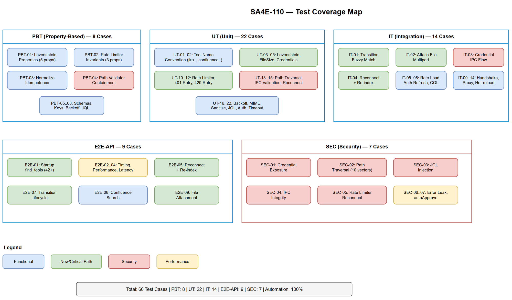
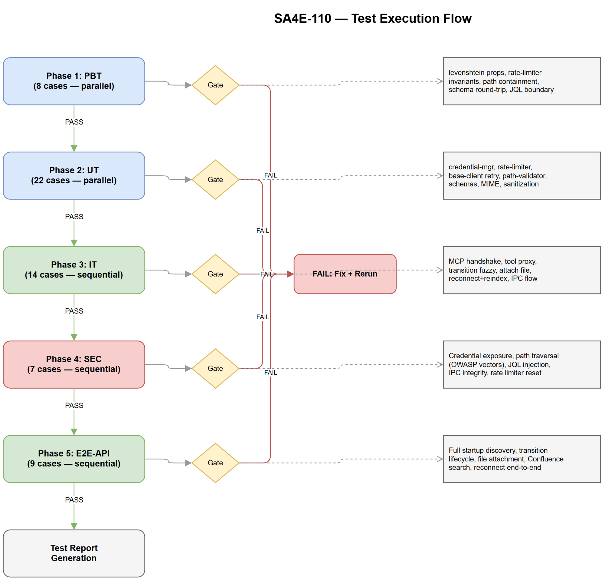

# System Test Plan (STP)

## SA4E — SA4E-110: Integrate Atlassian MCP Server as Child Server in Orchestrator

---

## Document Information

| Field | Value |
|-------|-------|
| Jira Ticket | SA4E-110 |
| Title | Integrate Atlassian MCP Server as Child Server in Orchestrator |
| Author | QA Agent |
| Version | 1.0 |
| Date | 2026-08-14 |
| Status | Draft |
| Related BRD | BRD-v1-SA4E-110.docx |
| Related FSD | FSD-v1.1-SA4E-110.docx |
| Related TDD | TDD-v1-SA4E-110.docx |
| Architecture Pattern | ai-agent (child server integration) |

---

## Revision History

| Version | Date | Author | Changes |
|---------|------|--------|---------|
| 1.0 | 2026-08-14 | QA Agent | Initial STP — test strategy, RTM, coverage analysis, 6 test levels |

---

## 1. Test Scope

### 1.1 In Scope

- Atlassian child server lifecycle (connect, disconnect, reconnect)
- Credential management via IPC (request, receive, refresh, hot-reload)
- Rate limiter (token bucket — acquire, refill, burst prevention)
- HTTP client (retry logic, error handling, timeout, auth refresh)
- Fuzzy matching (Levenshtein distance, case-insensitive normalization)
- Path validation (traversal prevention, symlink resolution)
- Tool registration and indexing (65+ tools)
- Tool execution proxy (orchestrator → child server → Jira/Confluence API)
- jira_transition_by_name (exact match, fuzzy match, no match)
- jira_attach_file (valid file, oversized file, path traversal)
- confluence_search (CQL, simple text, space filter)
- Security findings from SECURITY-REVIEW.md (#1–#10)

### 1.2 Out of Scope

- OAuth 2.0 (3LO) interactive flow
- Jira Service Management customer portal enhancements
- Confluence Cloud-only features (Whiteboard API)
- UI components for Atlassian configuration
- Existing external MCP server at port 3061

### 1.3 Test Environment

| Component | Specification |
|-----------|---------------|
| Runtime | Node.js 20+ (LTS) |
| Test Framework | Vitest 2.x |
| Mocking | vitest mock + msw (HTTP interception) |
| Coverage Tool | @vitest/coverage-v8 |
| CI Runner | GitHub Actions |
| Mock Jira API | msw handlers simulating Jira REST API v2 |
| OS | Windows 11 (primary), Linux (CI) |

---

## 2. Test Strategy

### 2.1 Test Levels

| Level | Abbreviation | Scope | Tool/Framework | Automation |
|-------|-------------|-------|----------------|------------|
| Property-Based Testing | PBT | Pure functions: levenshtein, normalize, rate-limiter math | Vitest + fast-check | 100% automated |
| Unit Testing | UT | Individual modules: credential-manager, base-client, rate-limiter, schemas | Vitest + mocks | 100% automated |
| Integration Testing | IT | Module interactions: MCP handshake, tool call proxy, fuzzy transition | Vitest + child process spawn | 100% automated |
| End-to-End API | E2E-API | Full flow: orchestrator → child server → mock Jira/Confluence | Vitest + msw | 100% automated |
| End-to-End UI | E2E-UI | N/A — no UI component in this feature | — | — |
| System Integration | SIT | N/A — no UI for this feature | — | — |

### 2.2 Entry Criteria

- BRD, FSD, TDD reviewed and approved
- SECURITY-REVIEW.md findings addressed in implementation
- Development environment operational (Node.js, TypeScript, Vitest)
- Mock Jira API handlers created
- orchestration.json configured with atlassian child server entry

### 2.3 Exit Criteria

- All PBT, UT, IT, E2E-API test cases pass
- Code coverage >= 90% for new modules (backend/src/servers/atlassian/)
- Zero Critical/High defects open
- All security test cases from SECURITY-REVIEW findings pass
- Performance benchmarks met (find_tools <200ms, tool exec <3s)

### 2.4 Test Approach by Level

#### PBT — Property-Based Testing

| Module | Properties to Verify |
|--------|---------------------|
| levenshtein.ts | Distance >= 0; d(a,a) = 0; d(a,b) = d(b,a); triangle inequality |
| normalize.ts | Idempotent: normalize(normalize(x)) = normalize(x); lowercase invariant |
| rate-limiter.ts | Tokens never negative; tokens <= maxTokens; monotonic refill |
| credential-schemas.ts | Zod parse(generate(schema)) always succeeds for valid input shapes |
| path-validator.ts | Resolved path always starts with workspace root; no `..` escapes |

#### UT — Unit Testing

| Module | Focus Areas |
|--------|-------------|
| credential-manager.ts | IPC message handling, requestId correlation, stale message rejection, cache update |
| rate-limiter.ts | Token consumption, wait behavior at 0 tokens, refill timing, reset |
| base-client.ts | Retry on 429/500/timeout, no retry on 400/403/404, auth refresh on 401, exponential backoff |
| jira-schemas.ts | Zod validation: valid/invalid issue_key patterns, JQL length limit |
| error-schemas.ts | Error sanitization, field ID stripping, email redaction |
| mime-types.ts | Extension to MIME mapping for .docx, .xlsx, .pdf, .png, .drawio |
| levenshtein.ts | Known distance pairs, empty strings, Unicode characters |

#### IT — Integration Testing

| Scenario | Scope |
|----------|-------|
| MCP handshake + tools/list | Spawn actual child process, verify 65+ tool definitions returned |
| tools/call proxy | Orchestrator proxies jira_get_issue to child → mock API → response |
| jira_transition_by_name fuzzy match | Full pipeline: get transitions → fuzzy resolve → execute transition |
| jira_attach_file with real file | Create temp file → attach → verify multipart payload |
| Credential refresh flow | Simulate 401 → IPC refresh → retry succeeds |
| Health check + reconnect | Kill child process → verify health monitor triggers reconnect |

#### E2E-API — End-to-End API Testing

| Scenario | Flow |
|----------|------|
| Full startup → find_tools | Start orchestrator → child connects → index tools → find_tools("jira") returns 42+ |
| Transition lifecycle | Create issue → transition by name → verify status changed |
| File attachment round-trip | Create temp file → attach to issue → verify attachment metadata |
| Confluence search | Search → verify results contain expected page fields |
| Rate limit enforcement | Send 101 requests → verify 101st is throttled/delayed |
| Reconnect + re-index | Kill child → verify reconnect → verify find_tools still works |

---

## 3. Requirements Traceability Matrix (RTM)

| Req ID | Requirement | Test Level | Test Case IDs | Priority |
|--------|-------------|------------|---------------|----------|
| BR-01 | Jira tool names follow jira_{action} convention | UT, E2E-API | UT-01, E2E-01 | High |
| BR-02 | Confluence tool names follow confluence_{action} convention | UT, E2E-API | UT-02, E2E-01 | High |
| BR-03 | Transition name matching case-insensitive + fuzzy | PBT, UT, IT | PBT-01, UT-03, IT-01 | Critical |
| BR-04 | File attachment <= 50MB | UT, IT | UT-04, IT-02 | High |
| BR-05 | Credentials never on disk | UT, IT, SEC | UT-05, IT-03, SEC-01 | Critical |
| BR-06 | Health check interval = 60s | UT | UT-06 | Medium |
| BR-07 | Max retries = 10 (configurable) | UT, IT | UT-07, IT-04 | Medium |
| BR-08 | Tool discovery < 10s | E2E-API | E2E-02 | High |
| BR-09 | find_tools response < 200ms | E2E-API | E2E-03 | High |
| BR-10 | Simple GET tool < 3s | E2E-API | E2E-04 | High |
| BR-11 | Files <= 200 lines | UT (lint) | UT-08 | Medium |
| BR-12 | Functions <= 20 lines | UT (lint) | UT-08 | Medium |
| BR-13 | Zero any types | UT (tsc) | UT-09 | Medium |
| BR-14 | Reconnect → re-register + re-index | IT, E2E-API | IT-04, E2E-05 | Critical |
| BR-15 | Rate limit 100 req/min | PBT, UT, IT | PBT-02, UT-10, IT-05 | High |
| BR-16 | 401 → credential refresh → retry | UT, IT | UT-11, IT-06 | High |
| BR-17 | stdio transport for process isolation | IT, E2E-API | IT-07, E2E-06 | Critical |
| UC-01 | find_tools("jira") returns >= 42 tools | E2E-API | E2E-01 | Critical |
| UC-02 | jira_transition_by_name exact + fuzzy + error | IT, E2E-API | IT-01, E2E-07 | Critical |
| UC-03 | confluence_search CQL + text | IT, E2E-API | IT-08, E2E-08 | High |
| UC-04 | jira_attach_file valid + oversized + traversal | IT, E2E-API, SEC | IT-02, E2E-09, SEC-02 | Critical |
| UC-05 | Auto-connect + auto-reconnect | IT, E2E-API | IT-04, E2E-05 | Critical |
| UC-07 | Credential via IPC, hot-reload | UT, IT | UT-05, IT-03 | Critical |
| SEC-#2 | JQL length limit enforcement | UT, SEC | UT-12, SEC-03 | High |
| SEC-#3 | Path traversal prevention | UT, SEC | UT-13, SEC-02 | Critical |
| SEC-#4 | IPC message validation (requestId + timestamp) | UT, SEC | UT-14, SEC-04 | High |
| SEC-#5 | Rate limiter conservative init after reconnect | UT, IT | UT-15, IT-05 | High |

---

## 4. Test Data Strategy

### 4.1 Test Data Files

| File | Content | Used By |
|------|---------|---------|
| test-data/jira-transitions.json | Mock transitions response (5 transitions) | IT-01, E2E-07 |
| test-data/jira-issue.json | Mock issue response (SA4E-110) | IT, E2E |
| test-data/confluence-search-results.json | Mock Confluence search response (3 pages) | IT-08, E2E-08 |
| test-data/credentials.json | Mock IPC credential messages (Cloud + Server) | UT-05, IT-03 |
| test-data/attachment-metadata.json | Mock attachment upload response | IT-02, E2E-09 |
| test-data/fuzzy-match-cases.csv | Transition name fuzzy match test vectors | PBT-01, UT-03 |
| test-data/path-traversal-vectors.csv | Path traversal attack payloads | UT-13, SEC-02 |

### 4.2 Mock API Handlers (msw)

| Handler | Endpoint | Response |
|---------|----------|----------|
| GET /rest/api/2/myself | Auth validation | 200: user info / 401: unauthorized |
| GET /rest/api/2/issue/{key} | Get issue | 200: issue JSON / 404: not found |
| GET /rest/api/2/issue/{key}/transitions | Get transitions | 200: transitions array |
| POST /rest/api/2/issue/{key}/transitions | Execute transition | 204: success / 400: invalid |
| POST /rest/api/2/issue/{key}/attachments | Upload attachment | 200: attachment meta |
| GET /rest/api/2/search | JQL search | 200: search results |
| GET /rest/api/content/search | Confluence CQL | 200: content results |
| GET /rest/agile/1.0/board | Agile boards | 200: boards list |

---

## 5. Security Test Strategy

Based on SECURITY-REVIEW.md findings:

| Finding # | Test Approach | Test Case |
|-----------|--------------|-----------|
| #1 (Transport mismatch) | Config validation — verify stdio in orchestration.json | SEC-01 |
| #2 (JQL injection) | Input validation — verify length limit, maxResults cap | SEC-03 |
| #3 (Path traversal) | Fuzzy + boundary — attack vectors from OWASP | SEC-02 |
| #4 (IPC integrity) | Message validation — requestId, timestamp, stale rejection | SEC-04 |
| #5 (Rate limiter reconnect) | Behavior test — verify 25% initial capacity after reconnect | SEC-05 |
| #7 (Error response leak) | Response sanitization — no internal field IDs, emails | SEC-06 |
| #8 (autoApprove) | Config validation — only read-only tools in autoApprove | SEC-07 |

---

## 6. Performance Test Strategy

| Metric | Target | Test Method |
|--------|--------|-------------|
| find_tools response | < 200ms | Benchmark with 65 indexed tools |
| Simple GET tool (jira_get_issue) | < 3s end-to-end | Timer from execute_dynamic_tool call to response |
| Startup connection | < 10s | Timer from orchestrator init to state=connected |
| Rate limiter throughput | 100 req/min sustained | Burst 100 requests, verify timing |

---

## 7. Risk Assessment

| Risk | Impact | Mitigation |
|------|--------|------------|
| Flaky tests from child process spawn timing | Medium | Use retries + appropriate timeouts in IT/E2E |
| msw handler mismatches with real Jira API | High | Validate handlers against official Jira API docs |
| Rate limiter timing sensitivity | Medium | Use fake timers (vi.useFakeTimers) for UT/PBT |
| IPC race conditions | Medium | Test with deliberate delays and concurrent messages |
| Path traversal vectors evolving | Low | Use established OWASP path traversal wordlist |

---

## 8. Test Automation Architecture

```
tests/
├── __mocks__/
│   ├── jira-api-handlers.ts        # msw request handlers
│   ├── confluence-api-handlers.ts   # msw request handlers
│   └── ipc-mock.ts                  # Mock process.send/on('message')
├── property/
│   ├── levenshtein.prop.test.ts     # PBT: distance properties
│   ├── rate-limiter.prop.test.ts    # PBT: token bucket invariants
│   └── path-validator.prop.test.ts  # PBT: containment property
├── unit/
│   ├── credential-manager.test.ts   # UT: IPC handling
│   ├── rate-limiter.test.ts         # UT: token bucket behavior
│   ├── base-client.test.ts          # UT: retry logic
│   ├── levenshtein.test.ts          # UT: known pairs
│   ├── path-validator.test.ts       # UT: traversal prevention
│   └── jira-schemas.test.ts         # UT: Zod validation
├── integration/
│   ├── mcp-handshake.test.ts        # IT: spawn + handshake + tools/list
│   ├── tool-call-proxy.test.ts      # IT: execute_dynamic_tool routing
│   ├── transition-fuzzy.test.ts     # IT: fuzzy match pipeline
│   ├── attach-file.test.ts          # IT: multipart upload
│   ├── reconnect-reindex.test.ts    # IT: crash → reconnect → re-index
│   └── credential-refresh.test.ts   # IT: 401 → IPC → retry
├── e2e-api/
│   ├── startup-discovery.test.ts    # E2E: full startup → find_tools
│   ├── transition-lifecycle.test.ts # E2E: create → transition → verify
│   ├── file-attachment.test.ts      # E2E: attach → verify metadata
│   ├── confluence-search.test.ts    # E2E: search → verify results
│   └── rate-limit-enforcement.test.ts # E2E: 101 requests behavior
├── security/
│   ├── path-traversal.test.ts       # SEC: OWASP vectors
│   ├── jql-injection.test.ts        # SEC: length limit, maxResults
│   ├── ipc-validation.test.ts       # SEC: requestId, timestamp, replay
│   ├── credential-exposure.test.ts  # SEC: no creds in logs/responses
│   └── rate-limiter-reconnect.test.ts # SEC: conservative init
└── test-data/
    ├── jira-transitions.json
    ├── jira-issue.json
    ├── confluence-search-results.json
    ├── credentials.json
    ├── attachment-metadata.json
    ├── fuzzy-match-cases.csv
    └── path-traversal-vectors.csv
```

---

## 9. Diagrams

### Diagram Index

| # | Diagram | Image | Source (editable) |
|---|---------|-------|-------------------|
| 1 | Test Coverage | [test-coverage.png](diagrams/test-coverage.png) | [test-coverage.drawio](diagrams/test-coverage.drawio) |
| 2 | Test Execution Flow | [test-execution-flow.png](diagrams/test-execution-flow.png) | [test-execution-flow.drawio](diagrams/test-execution-flow.drawio) |





---

## 10. Approvals

| Role | Name | Signature |
|------|------|-----------|
| QA Lead | QA Agent | ☐ Approved |
| SA Reviewer | SA Agent | ☐ Approved |
| SM | SM Agent | ☐ Approved |
