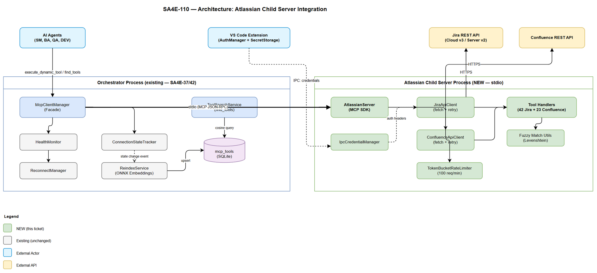

# Technical Design Document (TDD)

## SA4E — SA4E-110: Integrate Atlassian MCP Server as Child Server in Orchestrator

---

## Document Information

| Field | Value |
|-------|-------|
| Jira Ticket | SA4E-110 |
| Title | Integrate Atlassian MCP Server as Child Server in Orchestrator |
| Author | SA Agent |
| Version | 1.0 |
| Date | 2026-08-13 |
| Status | Draft |
| Related FSD | FSD-v1.1-SA4E-110.docx |
| Related BRD | BRD-v1-SA4E-110.docx |
| Architecture Pattern | ai-agent (child server integration) |
| Related Tickets | SA4E-37 (Health Check), SA4E-42 (Re-index on late connect) |

---

## Revision History

| Version | Date | Author | Changes |
|---------|------|--------|---------|
| 1.0 | 2026-08-13 | SA Agent | Initial TDD — architecture, modules, class design, diagrams, implementation checklist |

---

## 1. Architecture Overview

### 1.1 System Context

The Atlassian child server integrates into the existing orchestrator as a **stdio-spawned MCP child process**. It reuses the established patterns from SA4E-37 (health check) and SA4E-42 (re-index on late connect).



### 1.2 Integration Strategy

The integration follows the **existing McpClientManager pattern** — no new orchestrator code paths needed for the core lifecycle. The Atlassian server is "just another child server" from the orchestrator's perspective.

**Key architectural decisions:**

| Decision | Choice | Rationale |
|----------|--------|-----------|
| Transport | stdio (process spawn) | Process isolation, BR-17, consistent with other child servers |
| HTTP client | Native `fetch` | Project standard — replaces axios from reference repo |
| Credential delivery | IPC via `process.send()` | Never touches disk (BR-05), hot-reload capable |
| API version | Adapter pattern (v2/v3) | Cloud uses v3, Server/DC uses v2 (OI-04 resolution) |
| Rate limiting | Token bucket (100 req/min) | Client-side enforcement for Jira Cloud (OI-05 resolution) |
| Health check interval | 60s (production default) | Consistent with PRODUCTION_HEALTH_CONFIG (OI-01 resolution) |
| Max retries | 10 (configurable via orchestration.json) | Match production default (OI-02 resolution) |

### 1.3 What's New vs What's Reused

| Component | Status | Notes |
|-----------|--------|-------|
| McpClientManager | Reuse (unchanged) | Already supports stdio + tools/list + executeTool |
| ConnectionStateTracker | Reuse (unchanged) | State machine already has all needed states |
| HealthMonitor | Reuse (unchanged) | Ping via JSON-RPC already implemented |
| ReconnectManager | Reuse (unchanged) | Exponential backoff + jitter already works |
| ReindexService | Reuse (unchanged) | ONNX embedding + mcp_tools upsert ready |
| ReindexSubscriber | Reuse (unchanged) | Listens for 'connected' state → triggers reindex |
| TransportFactory | Reuse (unchanged) | Already creates StdioClientTransport for stdio config |
| **Atlassian Child Server** | **NEW** | 42 Jira + 23 Confluence + 2 custom tools |
| **CredentialManager** | **NEW** | IPC credential receiver inside child server |
| **JiraApiClient** | **NEW** | HTTP client with auth, retry, rate limiting |
| **ConfluenceApiClient** | **NEW** | HTTP client for Confluence REST API |
| **Tool handlers** | **NEW** | 65 tool implementations organized by category |

---

## 2. Module / File Structure

### 2.1 Directory Layout

```
backend/src/servers/atlassian/
├── index.ts                         # Entry point — MCP server bootstrap
├── server.ts                        # McpServer setup, tool registration orchestrator
├── config.ts                        # Server configuration types + defaults
│
├── credentials/
│   ├── credential-manager.ts        # IPC credential receiver + cache
│   └── credential-schemas.ts        # Zod schemas for IPC messages
│
├── clients/
│   ├── base-client.ts               # Shared fetch wrapper: auth headers, retry, rate limit
│   ├── jira-client.ts               # Jira REST API v2/v3 client
│   ├── confluence-client.ts         # Confluence REST API client
│   └── rate-limiter.ts              # Token bucket rate limiter (100 req/min)
│
├── models/
│   ├── jira-schemas.ts              # Zod schemas for Jira tool inputs/outputs
│   ├── confluence-schemas.ts        # Zod schemas for Confluence tool inputs/outputs
│   ├── error-schemas.ts             # Standardized error response schemas
│   └── types.ts                     # Shared TypeScript interfaces + enums
│
├── tools/
│   ├── jira-issue-tools.ts          # CRUD: get, create, update, delete issue (8 tools)
│   ├── jira-search-tools.ts         # JQL search, filter tools (4 tools)
│   ├── jira-transition-tools.ts     # transition_by_name + get_transitions (3 tools)
│   ├── jira-comment-tools.ts        # add, get, update, delete comments (5 tools)
│   ├── jira-attachment-tools.ts     # attach_file + list/delete attachments (4 tools)
│   ├── jira-field-tools.ts          # get fields, custom fields, edit meta (5 tools)
│   ├── jira-project-tools.ts        # projects, versions, components (6 tools)
│   ├── jira-agile-tools.ts          # boards, sprints, backlog (5 tools)
│   ├── jira-user-tools.ts           # user search, assignee, watchers (4 tools)
│   ├── jira-worklog-tools.ts        # time tracking (3 tools)
│   ├── confluence-page-tools.ts     # get, create, update, delete pages (7 tools)
│   ├── confluence-search-tools.ts   # CQL search, content search (4 tools)
│   ├── confluence-space-tools.ts    # spaces, labels, permissions (5 tools)
│   ├── confluence-content-tools.ts  # attachments, macros, children (5 tools)
│   └── confluence-comment-tools.ts  # page comments (2 tools)
│
├── utils/
│   ├── levenshtein.ts               # Levenshtein distance for fuzzy matching
│   ├── mime-types.ts                 # File extension → MIME type mapping
│   └── normalize.ts                 # String normalization utilities
│
└── __tests__/
    ├── credential-manager.test.ts
    ├── jira-client.test.ts
    ├── confluence-client.test.ts
    ├── rate-limiter.test.ts
    ├── levenshtein.test.ts
    └── jira-transition-tools.test.ts
```

### 2.2 File Size Budget

| File | Est. Lines | Responsibility |
|------|-----------|----------------|
| index.ts | ~40 | Process entry, IPC setup, server boot |
| server.ts | ~120 | Tool registration, MCP protocol setup |
| config.ts | ~50 | Configuration interfaces + defaults |
| credential-manager.ts | ~100 | IPC message handling, credential cache |
| credential-schemas.ts | ~60 | Zod schemas for IPC protocol |
| base-client.ts | ~150 | Fetch wrapper, auth, retry interceptor |
| jira-client.ts | ~120 | Jira-specific API methods |
| confluence-client.ts | ~100 | Confluence-specific API methods |
| rate-limiter.ts | ~80 | Token bucket implementation |
| jira-schemas.ts | ~180 | All Jira Zod schemas |
| confluence-schemas.ts | ~120 | All Confluence Zod schemas |
| error-schemas.ts | ~60 | Error response types |
| types.ts | ~80 | Shared interfaces/enums |
| Each tool file | ~120–180 | Tool handler registrations by category |
| levenshtein.ts | ~40 | Distance algorithm |
| mime-types.ts | ~50 | MIME lookup table |
| normalize.ts | ~30 | String utilities |

All files ≤ 200 lines. All functions ≤ 20 lines.

---

## 3. Class / Interface Design

### 3.1 Core Classes

```
┌──────────────────────────────────────────────────────────────────────┐
│  Orchestrator Process (existing — unchanged)                         │
│                                                                      │
│  ┌─────────────────┐    ┌──────────────────┐    ┌────────────────┐  │
│  │ McpClientManager │───▶│HealthMonitor     │───▶│ReconnectManager│  │
│  │ (Facade)         │    │(SA4E-37)         │    │(SA4E-37)       │  │
│  └────────┬─────────┘    └──────────────────┘    └────────────────┘  │
│           │                                                          │
│           │ stdio spawn                                              │
│           ▼                                                          │
│  ┌─────────────────────────────────────────────────────────────────┐ │
│  │ Atlassian Child Server Process (NEW)                            │ │
│  │                                                                 │ │
│  │  ┌───────────────┐  ┌──────────────┐  ┌─────────────────────┐ │ │
│  │  │AtlassianServer│──│CredentialMgr │──│JiraApiClient        │ │ │
│  │  │(MCP Server)   │  │(IPC receiver)│  │(fetch + retry + rate)│ │ │
│  │  └───────┬───────┘  └──────────────┘  └─────────────────────┘ │ │
│  │          │                              ┌─────────────────────┐ │ │
│  │          │                              │ConfluenceApiClient  │ │ │
│  │          ▼                              │(fetch + retry)      │ │ │
│  │  ┌───────────────┐                     └─────────────────────┘ │ │
│  │  │ Tool Handlers │                                              │ │
│  │  │ (65 tools)    │                                              │ │
│  │  └───────────────┘                                              │ │
│  └─────────────────────────────────────────────────────────────────┘ │
└──────────────────────────────────────────────────────────────────────┘
```

### 3.2 Interface Definitions

```typescript
/** base-client.ts — Abstract HTTP client with retry + rate limiting */
interface HttpClientConfig {
  baseUrl: string;
  authHeaders: () => Promise<Record<string, string>>;
  rateLimiter: RateLimiter;
  timeouts: { default: number; upload: number };
}

interface RequestOptions {
  method: 'GET' | 'POST' | 'PUT' | 'DELETE';
  path: string;
  body?: unknown;
  headers?: Record<string, string>;
  timeout?: number;
}

interface HttpResponse<T> {
  status: number;
  data: T;
  headers: Record<string, string>;
}
```

```typescript
/** credential-manager.ts — IPC credential management */
interface CredentialManager {
  initialize(): Promise<void>;           // Request initial credentials via IPC
  getAuthHeaders(): Promise<Record<string, string>>; // Build auth headers
  isValidated(): boolean;                // Whether credentials have been verified
  onRefresh(cb: () => void): void;       // Notify when credentials change
}
```

```typescript
/** rate-limiter.ts — Token bucket for Jira Cloud */
interface RateLimiter {
  acquire(): Promise<void>;              // Wait until token available
  getAvailableTokens(): number;          // Current bucket fill level
  reset(): void;                         // Refill bucket
}
```

```typescript
/** Tool handler registration pattern */
interface ToolRegistration {
  name: string;
  description: string;
  inputSchema: Record<string, unknown>;
  handler: (args: Record<string, unknown>) => Promise<ToolResult>;
}

interface ToolResult {
  content: Array<{ type: 'text'; text: string }>;
  isError: boolean;
}
```

### 3.3 Class Relationships (UML-style)

```
«interface» CredentialManager
  + initialize(): Promise<void>
  + getAuthHeaders(): Promise<Headers>
  + isValidated(): boolean
        ▲
        │ implements
IpcCredentialManager
  - credentials: Map<string, string>
  - validated: boolean
  - requestId: string
  + handleIpcMessage(msg: IpcMessage): void

«interface» RateLimiter
  + acquire(): Promise<void>
  + getAvailableTokens(): number
        ▲
        │ implements
TokenBucketRateLimiter
  - tokens: number
  - maxTokens: number
  - refillRate: number
  - lastRefill: number

«abstract» BaseAtlassianClient
  # config: HttpClientConfig
  # logger: Logger
  + request<T>(opts: RequestOptions): Promise<HttpResponse<T>>
  # handleError(status: number, body: unknown): never
  # shouldRetry(status: number, attempt: number): boolean
        ▲
        │ extends
JiraApiClient                    ConfluenceApiClient
  + getIssue(key, fields)         + searchContent(query, opts)
  + searchJql(jql, opts)          + getPage(id, expand)
  + transitionIssue(key, id, f)   + createPage(space, title, body)
  + attachFile(key, path)         + updatePage(id, version, body)
  + getTransitions(key)           + getSpace(key)
```

---

## 4. API Design — Tool Registration by Category

### 4.1 Jira Tools (42 total)

| # | Category | Tool Name | Method | Endpoint |
|---|----------|-----------|--------|----------|
| 1 | Issue | jira_get_issue | GET | /rest/api/2/issue/{key} |
| 2 | Issue | jira_create_issue | POST | /rest/api/2/issue |
| 3 | Issue | jira_update_issue | PUT | /rest/api/2/issue/{key} |
| 4 | Issue | jira_delete_issue | DELETE | /rest/api/2/issue/{key} |
| 5 | Issue | jira_get_issue_types | GET | /rest/api/2/issuetype |
| 6 | Issue | jira_get_priorities | GET | /rest/api/2/priority |
| 7 | Issue | jira_get_statuses | GET | /rest/api/2/status |
| 8 | Issue | jira_get_resolutions | GET | /rest/api/2/resolution |
| 9 | Search | jira_search | GET | /rest/api/2/search |
| 10 | Search | jira_get_filter | GET | /rest/api/2/filter/{id} |
| 11 | Search | jira_get_filter_results | GET | /rest/api/2/search?jql={filter.jql} |
| 12 | Search | jira_get_favourite_filters | GET | /rest/api/2/filter/favourite |
| 13 | Transition | jira_get_transitions | GET | /rest/api/2/issue/{key}/transitions |
| 14 | Transition | jira_transition_issue | POST | /rest/api/2/issue/{key}/transitions |
| 15 | Transition | **jira_transition_by_name** | POST | (fuzzy resolve + transition) |
| 16 | Comment | jira_add_comment | POST | /rest/api/2/issue/{key}/comment |
| 17 | Comment | jira_get_comments | GET | /rest/api/2/issue/{key}/comment |
| 18 | Comment | jira_update_comment | PUT | /rest/api/2/issue/{key}/comment/{id} |
| 19 | Comment | jira_delete_comment | DELETE | /rest/api/2/issue/{key}/comment/{id} |
| 20 | Comment | jira_get_comment | GET | /rest/api/2/issue/{key}/comment/{id} |
| 21 | Attachment | **jira_attach_file** | POST | /rest/api/2/issue/{key}/attachments |
| 22 | Attachment | jira_get_attachments | GET | /rest/api/2/issue/{key}?fields=attachment |
| 23 | Attachment | jira_delete_attachment | DELETE | /rest/api/2/attachment/{id} |
| 24 | Attachment | jira_get_attachment_meta | GET | /rest/api/2/attachment/{id} |
| 25 | Field | jira_get_fields | GET | /rest/api/2/field |
| 26 | Field | jira_get_create_meta | GET | /rest/api/2/issue/createmeta |
| 27 | Field | jira_get_edit_meta | GET | /rest/api/2/issue/{key}/editmeta |
| 28 | Field | jira_get_field_options | GET | /rest/api/2/field/{id}/option |
| 29 | Field | jira_get_custom_field | GET | /rest/api/2/customFieldOption/{id} |
| 30 | Project | jira_get_projects | GET | /rest/api/2/project |
| 31 | Project | jira_get_project | GET | /rest/api/2/project/{key} |
| 32 | Project | jira_get_project_versions | GET | /rest/api/2/project/{key}/versions |
| 33 | Project | jira_get_project_components | GET | /rest/api/2/project/{key}/components |
| 34 | Project | jira_create_version | POST | /rest/api/2/version |
| 35 | Project | jira_get_project_roles | GET | /rest/api/2/project/{key}/role |
| 36 | Agile | jira_get_agile_boards | GET | /rest/agile/1.0/board |
| 37 | Agile | jira_get_sprints | GET | /rest/agile/1.0/board/{id}/sprint |
| 38 | Agile | jira_get_sprint_issues | GET | /rest/agile/1.0/sprint/{id}/issue |
| 39 | Agile | jira_get_backlog | GET | /rest/agile/1.0/board/{id}/backlog |
| 40 | Agile | jira_get_epic_issues | GET | /rest/agile/1.0/epic/{id}/issue |
| 41 | User | jira_get_myself | GET | /rest/api/2/myself |
| 42 | User | jira_search_users | GET | /rest/api/2/user/search |

### 4.2 Confluence Tools (23 total)

| # | Category | Tool Name | Method | Endpoint |
|---|----------|-----------|--------|----------|
| 1 | Page | confluence_get_page | GET | /rest/api/content/{id} |
| 2 | Page | confluence_create_page | POST | /rest/api/content |
| 3 | Page | confluence_update_page | PUT | /rest/api/content/{id} |
| 4 | Page | confluence_delete_page | DELETE | /rest/api/content/{id} |
| 5 | Page | confluence_get_page_by_title | GET | /rest/api/content?title={t}&spaceKey={s} |
| 6 | Page | confluence_get_children | GET | /rest/api/content/{id}/child/page |
| 7 | Page | confluence_get_ancestors | GET | /rest/api/content/{id}/ancestor |
| 8 | Search | confluence_search | GET | /rest/api/content/search?cql={q} |
| 9 | Search | confluence_search_content | GET | /rest/api/search?cql={q} |
| 10 | Search | confluence_get_recent | GET | /rest/api/content?orderby=lastmodified |
| 11 | Search | confluence_get_content_by_label | GET | /rest/api/content?label={l} |
| 12 | Space | confluence_get_spaces | GET | /rest/api/space |
| 13 | Space | confluence_get_space | GET | /rest/api/space/{key} |
| 14 | Space | confluence_get_space_content | GET | /rest/api/space/{key}/content |
| 15 | Space | confluence_add_label | POST | /rest/api/content/{id}/label |
| 16 | Space | confluence_get_labels | GET | /rest/api/content/{id}/label |
| 17 | Content | confluence_get_attachments | GET | /rest/api/content/{id}/child/attachment |
| 18 | Content | confluence_add_attachment | POST | /rest/api/content/{id}/child/attachment |
| 19 | Content | confluence_get_macros | GET | /rest/api/content/{id}?expand=body.storage |
| 20 | Content | confluence_get_history | GET | /rest/api/content/{id}/history |
| 21 | Content | confluence_get_version | GET | /rest/api/content/{id}/version/{v} |
| 22 | Comment | confluence_get_comments | GET | /rest/api/content/{id}/child/comment |
| 23 | Comment | confluence_add_comment | POST | /rest/api/content/{id}/child/comment |

---

## 5. Sequence Flows

### 5.1 Startup / Connect Flow

```
Orchestrator                McpClientManager        Child Process         Extension
    │                            │                       │                    │
    │ initializeAll()            │                       │                    │
    │───────────────────────────▶│                       │                    │
    │                            │ spawn(node, args)     │                    │
    │                            │──────────────────────▶│                    │
    │                            │                       │ IPC: getCredentials│
    │                            │                       │───────────────────▶│
    │                            │                       │                    │ SecretStorage.get()
    │                            │                       │◀── credentials ────│
    │                            │                       │                    │
    │                            │                       │ validate: GET /myself
    │                            │ MCP: initialize       │                    │
    │                            │──────────────────────▶│                    │
    │                            │◀─── serverInfo ───────│                    │
    │                            │                       │                    │
    │                            │ MCP: tools/list       │                    │
    │                            │──────────────────────▶│                    │
    │                            │◀── 65 tools ──────────│                    │
    │                            │                       │                    │
    │                            │ registerServerTools()  │                    │
    │                            │ stateTracker → connected                   │
    │                            │                       │                    │
    │  ReindexSubscriber fires   │                       │                    │
    │  reindexConnected("atlassian")                     │                    │
    │  ONNX embed 65 tools       │                       │                    │
    │  upsert mcp_tools          │                       │                    │
    │                            │                       │                    │
```

### 5.2 Tool Call Proxy Flow

```
Agent             Orchestrator        McpClientManager       Child Server        Jira API
  │                    │                    │                     │                  │
  │ execute_dynamic_tool                    │                     │                  │
  │ (jira_search, {jql})                    │                     │                  │
  │───────────────────▶│                    │                     │                  │
  │                    │ ownsTool("jira_search")                  │                  │
  │                    │───────────────────▶│                     │                  │
  │                    │◀── true ───────────│                     │                  │
  │                    │                    │                     │                  │
  │                    │ executeTool("jira_search", args)         │                  │
  │                    │───────────────────▶│                     │                  │
  │                    │                    │ tools/call JSON-RPC │                  │
  │                    │                    │────────────────────▶│                  │
  │                    │                    │                     │ rateLimiter.acquire()
  │                    │                    │                     │ fetch(GET /search)│
  │                    │                    │                     │─────────────────▶│
  │                    │                    │                     │◀── 200 JSON ─────│
  │                    │                    │◀── MCP result ──────│                  │
  │                    │◀── {content, isError} ──────────────────│                  │
  │◀── tool result ────│                    │                     │                  │
  │                    │                    │                     │                  │
```

### 5.3 Reconnect Flow

```
HealthMonitor      McpClientManager     ReconnectManager    Child Process (new)
     │                    │                    │                    │
     │ ping timeout ×3    │                    │                    │
     │───────────────────▶│                    │                    │
     │                    │ state → unhealthy  │                    │
     │                    │ state → reconnecting                    │
     │                    │ clearServerTools()  │                    │
     │                    │                    │                    │
     │                    │ scheduleReconnect(attempt=1)            │
     │                    │───────────────────▶│                    │
     │                    │                    │ wait 2s (backoff)  │
     │                    │                    │                    │
     │                    │                    │ spawn + connect    │
     │                    │                    │───────────────────▶│
     │                    │                    │◀── MCP handshake ──│
     │                    │                    │                    │
     │                    │ onReconnectSuccess  │                    │
     │                    │◀───────────────────│                    │
     │                    │                    │                    │
     │                    │ registerServerTools("atlassian", client)│
     │                    │ state → connected   │                    │
     │                    │                    │                    │
     │                    │ ReindexSubscriber → reindexConnected()  │
     │                    │ (re-embed 65 tools into mcp_tools)     │
     │                    │                    │                    │
```

---

## 6. Error Handling Design

### 6.1 Retry Interceptor (base-client.ts)

```typescript
/** Retry decision matrix embedded in BaseAtlassianClient.request() */
// Retryable: 401 (after credential refresh), 429 (rate limit), 500, timeout
// Non-retryable: 400, 403, 404

async function requestWithRetry<T>(opts: RequestOptions): Promise<T> {
  for (let attempt = 0; attempt <= maxRetries; attempt++) {
    const response = await fetchWithTimeout(opts);

    if (response.ok) return response.json();

    if (response.status === 401 && attempt === 0) {
      await credentialManager.refresh();  // IPC: refreshCredentials
      continue;                           // Retry with new credentials
    }

    if (response.status === 429) {
      const retryAfter = parseRetryAfter(response.headers);
      await sleep(retryAfter);
      continue;
    }

    if (response.status >= 500 && attempt < maxRetries) {
      await sleep(exponentialBackoff(attempt));  // 1s, 2s, 4s
      continue;
    }

    // Non-retryable or max retries reached
    throw toToolError(response.status, await response.json());
  }
}
```

### 6.2 Rate Limiter (Token Bucket)

```typescript
/** TokenBucketRateLimiter — 100 tokens, refill 100/min */
class TokenBucketRateLimiter implements RateLimiter {
  // maxTokens = 100
  // refillRate = 100 / 60_000 (tokens per ms)
  // On acquire(): if tokens > 0 → consume, else wait until next refill
}
```

### 6.3 Auth Refresh Flow

```
1. API call returns 401
2. base-client intercepts, calls credentialManager.requestRefresh()
3. credentialManager sends IPC: { type: 'refreshCredentials', keys: [...] }
4. Extension reads from SecretStorage, responds with fresh credentials
5. credentialManager updates in-memory cache, sets validated = false
6. Retry original request with new auth headers
7. If 401 again → throw AUTH_FAILED error (non-retryable)
```

### 6.4 Error Code Mapping

| Jira/Confluence HTTP | Internal Error Code | Retryable | User Action |
|---------------------|---------------------|-----------|-------------|
| 400 | VALIDATION_ERROR | No | Fix request params |
| 401 | AUTH_FAILED | Once (after refresh) | Re-configure credentials |
| 403 | PERMISSION_DENIED | No | Check project permissions |
| 404 | NOT_FOUND | No | Verify issue key / page ID |
| 429 | RATE_LIMITED | Yes (Retry-After) | Automatic backoff |
| 500+ | SERVER_ERROR | Yes (3 attempts) | Retry or report |
| Timeout | CONNECTION_TIMEOUT | Yes (3 attempts) | Check network |

---

## 7. Security Design

### 7.1 Credential Security (BR-05)

| Principle | Implementation |
|-----------|----------------|
| Never on disk | SecretStorage only; IPC in-memory delivery |
| Never in logs | Pino logger: redact patterns for `atlassian.*` values |
| Never in error messages | `ToolErrorResponse.details` excludes auth tokens |
| Never in MCP responses | Tool results sanitized before return |
| Encrypted at rest | OS keychain (SecretStorage backend) |

### 7.2 Input Validation

| Input | Validation | Schema |
|-------|-----------|--------|
| issue_key | `^[A-Z]+-\d+$` regex | JiraTransitionByNameRequestSchema |
| file_path | Must be within workspace root | Path traversal prevention |
| JQL | Passed to Jira (their SQL injection protection) | JiraSearchRequestSchema |
| transition_name | Non-empty string, min 1 char | JiraTransitionByNameRequestSchema |
| URLs (base_url) | Must start with `https://` | URL validation in config |

### 7.3 Process Isolation

- Child server runs in separate Node.js process
- Communication only via stdio pipes (no network exposure)
- Process exit on unhandled error (orchestrator detects via health monitor)
- No shared memory between orchestrator and child

---

## 8. Implementation Checklist

Ordered tasks for DEV agent — each task is independently testable:

| # | Task | Files | Est. Lines | Dependencies |
|---|------|-------|-----------|--------------|
| 1 | Create models/types.ts + models/error-schemas.ts | 2 files | ~140 | None |
| 2 | Create models/jira-schemas.ts | 1 file | ~180 | Task 1 |
| 3 | Create models/confluence-schemas.ts | 1 file | ~120 | Task 1 |
| 4 | Create credentials/credential-schemas.ts | 1 file | ~60 | Task 1 |
| 5 | Create credentials/credential-manager.ts | 1 file | ~100 | Task 4 |
| 6 | Create utils/levenshtein.ts + normalize.ts + mime-types.ts | 3 files | ~120 | None |
| 7 | Create clients/rate-limiter.ts | 1 file | ~80 | None |
| 8 | Create clients/base-client.ts | 1 file | ~150 | Tasks 5, 7 |
| 9 | Create clients/jira-client.ts | 1 file | ~120 | Task 8 |
| 10 | Create clients/confluence-client.ts | 1 file | ~100 | Task 8 |
| 11 | Create tools/jira-issue-tools.ts | 1 file | ~160 | Tasks 2, 9 |
| 12 | Create tools/jira-search-tools.ts | 1 file | ~120 | Tasks 2, 9 |
| 13 | Create tools/jira-transition-tools.ts (incl. fuzzy match) | 1 file | ~180 | Tasks 2, 6, 9 |
| 14 | Create tools/jira-comment-tools.ts | 1 file | ~140 | Tasks 2, 9 |
| 15 | Create tools/jira-attachment-tools.ts (incl. attach_file) | 1 file | ~150 | Tasks 2, 6, 9 |
| 16 | Create tools/jira-field-tools.ts | 1 file | ~140 | Tasks 2, 9 |
| 17 | Create tools/jira-project-tools.ts | 1 file | ~160 | Tasks 2, 9 |
| 18 | Create tools/jira-agile-tools.ts | 1 file | ~140 | Tasks 2, 9 |
| 19 | Create tools/jira-user-tools.ts | 1 file | ~100 | Tasks 2, 9 |
| 20 | Create tools/jira-worklog-tools.ts | 1 file | ~100 | Tasks 2, 9 |
| 21 | Create tools/confluence-page-tools.ts | 1 file | ~160 | Tasks 3, 10 |
| 22 | Create tools/confluence-search-tools.ts | 1 file | ~120 | Tasks 3, 10 |
| 23 | Create tools/confluence-space-tools.ts | 1 file | ~120 | Tasks 3, 10 |
| 24 | Create tools/confluence-content-tools.ts | 1 file | ~130 | Tasks 3, 10 |
| 25 | Create tools/confluence-comment-tools.ts | 1 file | ~80 | Tasks 3, 10 |
| 26 | Create config.ts | 1 file | ~50 | None |
| 27 | Create server.ts (register all tools) | 1 file | ~120 | Tasks 11–25 |
| 28 | Create index.ts (entry point + IPC bootstrap) | 1 file | ~40 | Tasks 5, 27 |
| 29 | Add orchestration.json entry | 1 file | ~10 | Task 28 |
| 30 | Unit tests: credential-manager, rate-limiter, levenshtein | 3 files | ~300 | Tasks 5, 6, 7 |
| 31 | Unit tests: jira-client, confluence-client | 2 files | ~200 | Tasks 9, 10 |
| 32 | Integration test: jira_transition_by_name fuzzy match | 1 file | ~150 | Task 13 |
| 33 | Integration test: full MCP handshake + tool call | 1 file | ~120 | Task 28 |

**Total: ~33 files, ~3800 lines estimated**

### Critical Path

```
Tasks 1-6 (models + utils)  →  Task 7-8 (clients)  →  Tasks 9-10 (API clients)
                                                            │
                                                            ▼
                                                     Tasks 11-25 (tools)
                                                            │
                                                            ▼
                                                     Tasks 26-28 (server)
                                                            │
                                                            ▼
                                                     Tasks 29-33 (config + tests)
```

---

## 9. Open Issue Resolutions

| OI-ID | Decision | Rationale |
|-------|----------|-----------|
| OI-01 | Use 60s health check interval (PRODUCTION_HEALTH_CONFIG) | Consistent with all other child servers; 30s too aggressive for Atlassian API |
| OI-02 | Use maxRetries=10 (default), configurable via orchestration.json `healthConfig` | Resilient by default; individual servers can override |
| OI-03 | Use Node.js fork() IPC channel (process.send) | Orchestrator already spawns child process; IPC is in-process, no network exposure |
| OI-04 | Adapter pattern: auth_type determines API version routing | `cloud` → v3 endpoints where needed, `server` → v2 always |
| OI-05 | Token bucket rate limiter (100 tokens/min) + respect Retry-After | Proactive enforcement + reactive compliance |
| OI-06 | Category is `string` type — use "atlassian" directly | Already resolved in existing codebase; no type extension needed |

---

## 10. Diagrams

### Diagram Index

| # | Diagram | Image | Source (editable) |
|---|---------|-------|-------------------|
| 1 | Architecture Overview | [architecture.png](diagrams/architecture.png) | [architecture.drawio](diagrams/architecture.drawio) |
| 2 | Component Diagram | [component.png](diagrams/component.png) | [component.drawio](diagrams/component.drawio) |

---

## 11. Appendix — Business Rules Traceability

| BR-ID | Implementation Location | Verification |
|-------|------------------------|--------------|
| BR-01 | tools/jira-*.ts — all tool names follow `jira_` prefix | Registration validation in server.ts |
| BR-02 | tools/confluence-*.ts — all names follow `confluence_` prefix | Registration validation in server.ts |
| BR-03 | tools/jira-transition-tools.ts — cascading fuzzy match | Unit test: levenshtein + normalize |
| BR-04 | tools/jira-attachment-tools.ts — size check before upload | Pre-validation: `stat(file).size <= 50MB` |
| BR-05 | credentials/credential-manager.ts — IPC only, no disk writes | Security scan: grep for credential patterns |
| BR-06 | Reuse PRODUCTION_HEALTH_CONFIG.interval (60s) | Config test |
| BR-07 | Reuse PRODUCTION_HEALTH_CONFIG.maxRetries (10) | Config test |
| BR-08 | McpClientManager.connectServer timeout 10s (existing) | Integration test |
| BR-09 | ReindexService + ONNX cached vectors → cosine search <200ms | Benchmark test |
| BR-10 | clients/base-client.ts timeout config: 3000ms default | Unit test |
| BR-11 | All files ≤ 200 lines | CI lint rule |
| BR-12 | All functions ≤ 20 lines | CI lint rule |
| BR-13 | Zero `any` types — strict TypeScript + eslint no-explicit-any | CI type check |
| BR-14 | handleReconnectSuccess → clearServerTools + registerServerTools + ReindexSubscriber | Integration test |
| BR-15 | clients/rate-limiter.ts — 100 tokens/60s | Unit test |
| BR-16 | clients/base-client.ts — 401 → refresh + retry once | Unit test |
| BR-17 | orchestration.json: transportType = "stdio" | Config validation |
