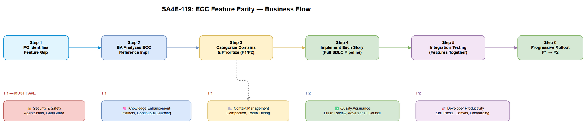
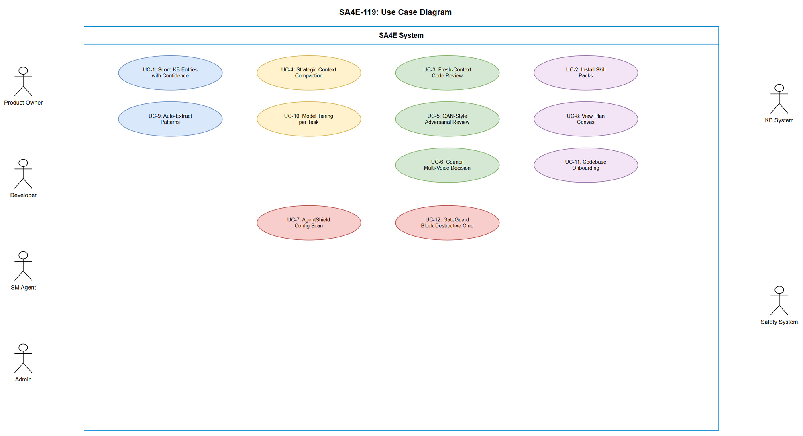

# Business Requirements Document (BRD)

## SA4E — SA4E-119: [Epic] ECC Feature Parity - Import Missing Concepts

---

## Document Information

| Field | Value |
|-------|-------|
| Jira Ticket | SA4E-119 |
| Title | ECC Feature Parity - Import Missing Concepts |
| Author | BA Agent |
| Version | 1.0 |
| Date | 2026-08-16 |
| Status | Draft |

---

## Revision History

| Version | Date | Author | Changes |
|---------|------|--------|---------|
| 1.0 | 2026-08-16 | BA Agent | Initiate document — auto-generated from Jira Epic SA4E-119 |

---

## 1. Introduction

### 1.1 Scope

Import 12 advanced AI agent features/concepts from the ECC (Enterprise Code Cognition) repository into SA4E. These features span 4 domains: Knowledge Enhancement, Context Management, Quality Assurance, and Developer Productivity. Each feature becomes a child story of this Epic with independent implementation lifecycle.

**Reference:** https://github.com/affaan-m/ECC

### 1.2 Out of Scope

- Full ECC codebase migration (only concepts/patterns are imported, adapted to SA4E architecture)
- UI redesign of existing SA4E webview panels (unless required by specific features)
- Changes to the SDLC pipeline steering files (BA/SA/QA/DEV coordination)
- Third-party LLM provider integrations beyond existing Anthropic SDK

### 1.3 Preliminary Requirements

- SA4E backend MCP server operational (port 48721)
- Extension MCP bridge functional (port 9181)
- KB module with mem_search/mem_ingest working
- CodeIntel module with AST parsing working
- Orchestration module with child MCP management working

---

## 2. Business Requirements

### 2.1 High Level Process Map

The ECC Feature Parity initiative imports 12 features organized in 4 domains:

| Domain | Features | Priority |
|--------|----------|----------|
| Knowledge Enhancement | Instincts & Confidence Scoring, Continuous Learning v2 | P1 (High) |
| Context Management | Strategic Context Compaction, Token Optimization | P1 (High) |
| Quality Assurance | Fresh-Context Review, GAN-Style Adversarial Review, Council/Multi-Voice | P2 (Medium) |
| Developer Productivity | Skill Packs, Plan Canvas, Codebase Onboarding | P2 (Medium) |
| Security & Safety | AgentShield, GateGuard | P1 (High) |

### 2.2 List of User Stories

| # | Story / Use Case | Priority | Source Ticket |
|---|------------------|----------|---------------|
| 1 | As a KB system, I want confidence scores on knowledge entries so that retrieval prioritizes high-confidence facts | MUST HAVE | SA4E-121 |
| 2 | As a developer, I want reusable skill packs per tech stack so that agents apply domain-specific patterns automatically | SHOULD HAVE | SA4E-122 |
| 3 | As a code reviewer, I want fresh-context isolation so that review is unbiased by implementation history | MUST HAVE | SA4E-123 |
| 4 | As the system, I want strategic context compaction so that context window is optimally utilized across phases | MUST HAVE | SA4E-124 |
| 5 | As a quality gate, I want GAN-style adversarial review so that documents are stress-tested against attack vectors | SHOULD HAVE | SA4E-125 |
| 6 | As a decision maker, I want council/multi-voice deliberation so that critical decisions consider multiple perspectives | SHOULD HAVE | SA4E-126 |
| 7 | As an admin, I want AgentShield security scanning so that agent configurations are audited for vulnerabilities | MUST HAVE | SA4E-127 |
| 8 | As a project manager, I want Plan Canvas visual review so that implementation plans are visually inspectable | COULD HAVE | SA4E-128 |
| 9 | As the system, I want auto pattern extraction so that successful patterns are captured without manual intervention | SHOULD HAVE | SA4E-129 |
| 10 | As a cost-conscious user, I want model tiering per task so that simple tasks use cheaper models | MUST HAVE | SA4E-130 |
| 11 | As a new team member, I want codebase onboarding skill so that I can quickly understand project architecture | SHOULD HAVE | SA4E-131 |
| 12 | As a safety system, I want GateGuard destructive command prevention so that dangerous operations are blocked programmatically | MUST HAVE | SA4E-132 |

---

### 2.3 Details of User Stories

---

#### Business Flow

**Step 1:** Product Owner identifies feature gap between SA4E and ECC capabilities

**Step 2:** BA analyzes ECC reference implementation for each feature concept

**Step 3:** Features are categorized into domains and prioritized (P1 security/core, P2 quality/productivity)

**Step 4:** Each feature implemented as independent child story following full SDLC pipeline

**Step 5:** Integration testing validates features work together within SA4E architecture

**Step 6:** Progressive rollout — P1 features first, P2 features in subsequent sprints

---

#### STORY 1: Instincts & Confidence Scoring (SA4E-121)

> As a KB system, I want confidence scores on knowledge entries so that retrieval prioritizes high-confidence facts over uncertain or stale data.

**Requirement Details:**

1. Each KB entry (mem_ingest) gets a confidence score (0.0-1.0) based on source reliability, corroboration count, and age decay
2. mem_search results are re-ranked using confidence * relevance hybrid score
3. Instincts are pre-defined heuristics (e.g., "prefer recent over old", "prefer code-verified over user-stated") configurable per project
4. Confidence decays over time unless refreshed by re-corroboration

**Acceptance Criteria:**

1. Given a KB with entries of varying confidence, when mem_search is called, then results are ranked by (relevance * confidence) hybrid score
2. Given a new entry ingested, when no corroboration exists, then default confidence = 0.5
3. Given an entry corroborated by 3+ sources, when scored, then confidence >= 0.8
4. Given an entry older than 30 days without refresh, when scored, then confidence decays by 0.1 per week

---

#### STORY 2: Reusable Skill Packs (SA4E-122)

> As a developer, I want reusable skill packs per tech stack so that agents apply domain-specific patterns automatically without manual steering configuration.

**Requirement Details:**

1. Skill Pack = bundled steering files + tool configs + prompt templates for a specific tech stack
2. Packs discoverable and installable from a registry (local folder or remote)
3. Packs can be composed (e.g., "TypeScript + Hono + SQLite" combines 3 packs)
4. Each pack defines: code-standards, test patterns, architecture patterns, naming conventions

**Acceptance Criteria:**

1. Given a new project with TypeScript stack, when onboarding, then system suggests matching skill packs
2. Given a skill pack installed, when agents run, then pack's steering rules are automatically included
3. Given conflicting rules between packs, when composed, then later-installed pack takes precedence with warning

---

#### STORY 3: Fresh-Context Review Isolation (SA4E-123)

> As a code reviewer, I want fresh-context isolation so that code review is unbiased by the implementation conversation history.

**Requirement Details:**

1. Code review agent spawned with isolated context: only git diff + TDD + FSD + code-standards
2. No access to implementation reasoning, RUN-LOG, STATUS.json progress, or prior conversation
3. Review findings compared against standard (context-aware) review to detect blind spots
4. Configurable trigger: >500 lines changed, security changes, or DB schema changes

**Acceptance Criteria:**

1. Given a code change >500 lines, when review phase starts, then fresh-context review is automatically triggered
2. Given fresh-context reviewer, when reviewing, then it has NO access to implementation history
3. Given both reviews complete, when compared, then blind spots (fresh found, standard missed) are escalated

---

#### STORY 4: Strategic Context Compaction (SA4E-124)

> As the system, I want strategic context compaction so that context window usage is optimized by compacting completed phase data while preserving key decisions.

**Requirement Details:**

1. After each SDLC phase completes, phase context is compacted to summary (key decisions, artifact paths, open issues)
2. Full document content is dropped from context (already ingested in KB)
3. Compaction preserves: user story IDs, BR-IDs, architecture decisions, API contracts
4. Warning levels: normal (<60%), warn (60-80%), critical (80-90%), emergency (90%+)

**Acceptance Criteria:**

1. Given Phase 1 (BRD) complete, when context is compacted, then only summary block remains in context
2. Given context at 80% capacity, when warning triggers, then SM switches to report-only mode
3. Given context at 90%+, when emergency triggers, then force compact retaining only essential state

---

#### STORY 5: GAN-Style Adversarial Review (SA4E-125)

> As a quality gate, I want GAN-style adversarial review so that documents and code are stress-tested by a "red team" agent.

**Requirement Details:**

1. Generator agent produces output (BRD, FSD, TDD, code)
2. Discriminator agent attacks the output: finds gaps, inconsistencies, edge cases not covered
3. Generator revises based on discriminator feedback
4. Loop continues until discriminator "accepts" (no critical findings) or max iterations (3)
5. Both agents operate independently without shared reasoning context

**Acceptance Criteria:**

1. Given a generated TDD, when adversarial review runs, then discriminator identifies >= 3 potential issues
2. Given discriminator feedback, when generator revises, then revision addresses all critical findings
3. Given max 3 iterations reached, when discriminator still finds criticals, then escalate to user

---

#### STORY 6: Council / Multi-Voice Decision Making (SA4E-126)

> As a decision maker, I want council/multi-voice deliberation so that critical architecture decisions consider multiple expert perspectives before committing.

**Requirement Details:**

1. For critical decisions (architecture choices, tech stack selection, security design), spawn 3+ "voices" with different personas
2. Voices: Conservative (risk-averse), Progressive (innovation-focused), Pragmatic (cost/time-focused)
3. Each voice independently analyzes options and provides recommendation with reasoning
4. Final decision synthesized from all voices with explicit trade-off documentation
5. Council invoked by SM when detecting high-impact decisions in TDD or implementation

**Acceptance Criteria:**

1. Given an architecture decision with 3+ options, when council convenes, then 3 independent recommendations are produced
2. Given conflicting voices, when synthesized, then trade-offs are explicitly documented
3. Given unanimous agreement, when decided, then confidence level = "high" logged in KB

---

#### STORY 7: AgentShield - Agent Config Security Scanner (SA4E-127)

> As an admin, I want AgentShield security scanning so that agent configurations, steering files, and MCP server configs are audited for security vulnerabilities.

**Requirement Details:**

1. Scan agent configs (.kiro/agents/, .kiro/steering/, mcp.json) for:
   - Exposed secrets/credentials in prompts or configs
   - Overly permissive tool access (e.g., shell access without constraints)
   - Prompt injection vectors in steering files
   - Unsafe MCP server connections (non-TLS, public endpoints)
2. Generate security report with severity levels
3. Run automatically on config changes (hook: fileEdited on config patterns)
4. Block pipeline if critical security issues detected

**Acceptance Criteria:**

1. Given a steering file with hardcoded API key, when scanned, then report flags as CRITICAL
2. Given an MCP server config with http:// (non-TLS), when scanned, then report flags as HIGH
3. Given a prompt template with user-controllable injection point, when scanned, then report flags as HIGH
4. Given all configs pass scan, when pipeline runs, then no blocking occurs

---

#### STORY 8: Plan Canvas - Visual Plan Review (SA4E-128)

> As a project manager, I want Plan Canvas visual review so that implementation plans are rendered as interactive visual diagrams for stakeholder review.

**Requirement Details:**

1. Convert STATUS.json + phase data into a visual canvas (draw.io or HTML)
2. Show: phase dependencies, current progress, blocking items, agent assignments
3. Auto-update canvas when STATUS.json changes
4. Export as PNG/PDF for stakeholder sharing
5. Interactive: click on phase to show details (agent, duration, tokens used)

**Acceptance Criteria:**

1. Given a ticket with 4 phases complete, when canvas rendered, then completed phases are green, in-progress yellow, blocked red
2. Given STATUS.json updated, when canvas refreshes, then visual reflects new state within 5 seconds
3. Given canvas exported as PNG, when shared, then all phases and dependencies are readable

---

#### STORY 9: Continuous Learning v2 - Auto Pattern Extraction (SA4E-129)

> As the system, I want automatic pattern extraction so that successful implementation patterns are captured in KB without manual mem_ingest calls.

**Requirement Details:**

1. After successful pipeline completion (ticket to DONE), system auto-extracts:
   - Architecture patterns used (from TDD)
   - Code patterns that passed review (from diff)
   - Testing patterns that achieved coverage (from STP/STC)
   - Deployment patterns that succeeded (from DPG)
2. Extracted patterns ingested into KB with tags: "auto-extracted, pattern, {domain}"
3. Pattern similarity detection: if extracted pattern is similar to existing one, merge/update instead of duplicate
4. Patterns promoted to SEMANTIC tier after 3+ successful reuses

**Acceptance Criteria:**

1. Given a ticket reaching DONE status, when auto-extraction runs, then >= 3 patterns are extracted
2. Given a duplicate pattern detected, when ingesting, then existing entry is updated (not duplicated)
3. Given a pattern used in 3+ tickets successfully, when checked, then it is promoted to SEMANTIC tier

---

#### STORY 10: Token Optimization - Model Tiering per Task (SA4E-130)

> As a cost-conscious user, I want model tiering per task so that simple tasks (file reads, transitions, exports) use lighter/cheaper models while complex tasks (design, review, implementation) use full reasoning models.

**Requirement Details:**

1. Task complexity classification: Low (lookups, transitions), Medium (formatting, simple generation), High (reasoning, design, implementation)
2. Model assignment per complexity: Low = fast/cheap model, Medium = balanced model, High = full reasoning model
3. SM decides model tier before each sub-agent invocation based on task type table
4. Token savings tracked and reported in budget metrics
5. User can override tier for specific invocations

**Acceptance Criteria:**

1. Given a Jira transition task, when SM invokes agent, then lighter model is selected
2. Given a TDD creation task, when SM invokes SA, then full reasoning model is selected
3. Given model tiering active, when daily report generated, then token savings vs flat-model baseline shown

---

#### STORY 11: Codebase Onboarding Skill (SA4E-131)

> As a new team member, I want a codebase onboarding skill so that I can quickly understand project architecture, conventions, and key patterns through guided exploration.

**Requirement Details:**

1. Skill activated by command: "onboard me" or "explain this project"
2. Generates interactive walkthrough: architecture overview, module deep-dives, convention guide
3. Uses CodeIntel module to analyze actual code structure (not stale docs)
4. Produces: ONBOARDING.md with architecture diagram, key files map, coding conventions extracted from code
5. Caches result in KB — refreshes when significant code changes detected

**Acceptance Criteria:**

1. Given a new user runs onboarding, when skill executes, then ONBOARDING.md is generated within 60 seconds
2. Given existing onboarding cached, when code hasn't changed, then cached version served
3. Given significant refactoring (>20% files changed), when onboarding requested, then regenerates

---

#### STORY 12: GateGuard - Destructive Command Prevention (SA4E-132)

> As a safety system, I want GateGuard programmatic destructive command prevention so that dangerous operations (force push, rm -rf, DROP TABLE, etc.) are blocked before execution.

**Requirement Details:**

1. PreToolUse hook intercepts all shell/write tool invocations
2. Command parsed against denylist patterns: `git push --force`, `rm -rf /`, `DROP TABLE`, `DELETE FROM`, `git reset --hard`, `docker system prune`
3. Configurable denylist (per-project overrides)
4. Block action: prevent tool execution + log attempt + notify user
5. Override: user can explicitly approve blocked command ("approve <command-hash>")
6. Audit trail: all blocked commands logged with timestamp, user, reason

**Acceptance Criteria:**

1. Given agent attempts `git push --force`, when GateGuard intercepts, then command is BLOCKED with explanation
2. Given user approves blocked command, when re-submitted, then command executes with audit log entry
3. Given custom denylist pattern added, when matching command runs, then it is blocked
4. Given non-destructive command (git push, npm test), when submitted, then passes through immediately

---

## 3. Dependencies

| Dependency | Type | Related Ticket | Description |
|------------|------|----------------|-------------|
| KB Module (mem_search/mem_ingest) | System | SA4E-100 | Required for Stories 1, 9, 11 |
| CodeIntel Module (AST parsing) | System | SA4E-101 | Required for Stories 2, 11 |
| Orchestration Module | System | SA4E-102 | Required for Stories 5, 6, 10 |
| Hook System | System | SA4E-110 | Required for Stories 7, 12 |
| Draw.io Engine | System | SA4E-106 | Required for Story 8 |
| LangGraph Pipeline | System | SA4E-107 | Required for Stories 5, 6 |
| ECC Reference Repo | External | N/A | https://github.com/affaan-m/ECC |

---

## 4. Stakeholders

| Role | Name / Team | Responsibility |
|------|-------------|----------------|
| Product Owner | Project Lead | Prioritize features, approve UAT |
| Tech Lead | SA Agent | Architecture decisions, TDD review |
| Developers | DEV Agent | Implementation |
| QA | QA Agent | Test planning and execution |

---

## 5. Risks and Assumptions

### 5.1 Risks

| Risk | Impact | Likelihood | Mitigation |
|------|--------|------------|------------|
| ECC concepts don't map cleanly to SA4E architecture | High | Medium | Adapt concepts to SA4E patterns, don't force 1:1 port |
| Feature interactions cause regressions | High | Medium | Progressive rollout P1 then P2, comprehensive integration tests |
| Token budget exceeded by multi-voice/adversarial features | Medium | High | Model tiering (Story 10) implemented first to control costs |
| GateGuard false positives block legitimate operations | Medium | Medium | Configurable denylist with easy override mechanism |
| Context compaction loses critical information | High | Low | Preserve key decisions explicitly, KB as fallback |

### 5.2 Assumptions

- SA4E backend modules (KB, CodeIntel, Orchestration) are stable and won't undergo breaking changes during implementation
- ECC repo remains accessible as reference (public GitHub)
- Token costs remain within current budget allocation (500k/day cap)
- All 12 features are independently implementable (no mandatory ordering beyond P1 first)
- Existing steering files (fresh-context-review.md, context-compaction.md) serve as starting specs for Stories 3, 4

---

## 6. Non-Functional Requirements

| Category | Requirement | Details |
|----------|-------------|---------|
| Performance | KB search with confidence scoring | < 200ms p95 for mem_search with re-ranking |
| Performance | GateGuard command interception | < 50ms per preToolUse hook evaluation |
| Performance | Context compaction | < 2 seconds per phase compaction |
| Scalability | Skill packs | Support 50+ packs without startup degradation |
| Security | AgentShield | Zero false negatives for exposed secrets |
| Security | GateGuard | Zero false negatives for known destructive patterns |
| Reliability | Confidence decay | Deterministic — same inputs produce same scores |
| Usability | Codebase onboarding | Complete onboarding < 60 seconds |

---

## 7. Related Tickets

| Ticket Key | Summary | Type | Relationship |
|------------|---------|------|--------------|
| SA4E-119 | [Epic] ECC Feature Parity | Epic | Parent |
| SA4E-121 | Instincts & Confidence Scoring | Story | Child |
| SA4E-122 | Reusable Skill Packs | Story | Child |
| SA4E-123 | Fresh-Context Review Isolation | Story | Child |
| SA4E-124 | Strategic Context Compaction | Story | Child |
| SA4E-125 | GAN-Style Adversarial Review | Story | Child |
| SA4E-126 | Council / Multi-Voice Decision | Story | Child |
| SA4E-127 | AgentShield Security Scanner | Story | Child |
| SA4E-128 | Plan Canvas Visual Review | Story | Child |
| SA4E-129 | Continuous Learning v2 | Story | Child |
| SA4E-130 | Token Optimization Model Tiering | Story | Child |
| SA4E-131 | Codebase Onboarding Skill | Story | Child |
| SA4E-132 | GateGuard Destructive Prevention | Story | Child |

---

## 8. Appendix

### Use Case Diagram

### Glossary

| Term | Definition | Avoid |
|------|------------|-------|
| Confidence Score | Numeric value (0.0-1.0) indicating reliability of a KB entry based on source, corroboration, and freshness | trust score, quality score |
| Skill Pack | Bundled steering rules + tool configs + prompts for a specific technology stack | template, preset, profile |
| Fresh-Context | Review mode where reviewer has NO access to implementation history, only specs + diff | clean review, blind review |
| Context Compaction | Process of summarizing completed phase data to free context window capacity | compression, trimming |
| Adversarial Review | GAN-inspired quality check where a discriminator agent attacks generated output | red team, stress test |
| Council | Multi-voice decision pattern where 3+ personas independently evaluate options | committee, voting |
| GateGuard | Runtime hook that intercepts and blocks destructive shell/write commands | safety net, firewall |
| AgentShield | Security scanner for agent configurations and steering files | config audit, linter |
| Instinct | Pre-defined heuristic rule that biases KB retrieval (e.g., prefer recent over old) | rule, bias, weight |
| Model Tiering | Assigning different LLM models based on task complexity to optimize cost | model routing, model selection |

### Diagram Index

| # | Diagram | Image | Source (editable) |
|---|---------|-------|-------------------|
| 1 | Business Flow | [business-flow.png](diagrams/business-flow.png) | [business-flow.drawio](diagrams/business-flow.drawio) |
| 2 | Use Case | [use-case.png](diagrams/use-case.png) | [use-case.drawio](diagrams/use-case.drawio) |

### Reference Documents

| Document | Link / Location |
|----------|-----------------|
| ECC Repository | https://github.com/affaan-m/ECC |
| SA4E Architecture | .code-intel/SA4E-ARCHITECTURE.md |
| Context Compaction Steering | .kiro/steering/context-compaction.md |
| Fresh-Context Review Steering | .kiro/steering/fresh-context-review.md |
