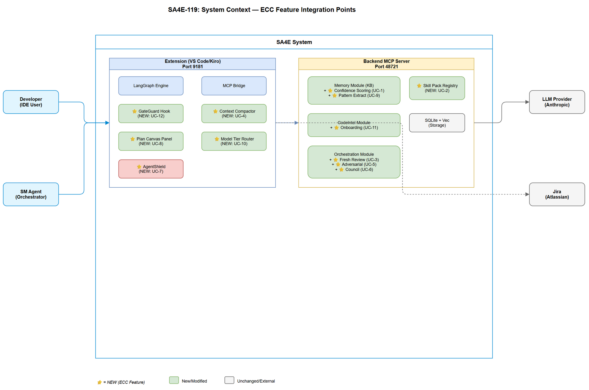

# Functional Specification Document (FSD)

## SA4E — SA4E-119: [Epic] ECC Feature Parity - Import Missing Concepts

---

## Document Information

| Field | Value |
|-------|-------|
| Jira Ticket | SA4E-119 |
| Title | ECC Feature Parity - Import Missing Concepts |
| Author | BA Agent + TA Agent |
| Version | 1.0 |
| Date | 2026-08-16 |
| Status | Draft |
| Related BRD | BRD-v1-SA4E-119.docx |

---

## Revision History

| Version | Date | Author | Changes |
|---------|------|--------|---------|
| 1.0 | 2026-08-16 | BA Agent | Initiate document from BRD SA4E-119 |
| 1.1 | 2026-08-16 | TA Agent | Technical enrichment — API contracts, integration specs |

---

## 1. Introduction

### 1.1 Purpose

This FSD specifies the functional behavior of 12 features imported from ECC into SA4E. Each feature is a child story of Epic SA4E-119, implemented as an independent module within the existing SA4E backend/extension architecture.

### 1.2 Scope

Covers all 12 features across 5 domains: Knowledge Enhancement, Context Management, Quality Assurance, Developer Productivity, and Security & Safety.

### 1.3 Definitions & Acronyms

| Term | Definition |
|------|------------|
| KB | Knowledge Base — SA4E memory module with hybrid search |
| MCP | Model Context Protocol |
| ECC | Enterprise Code Cognition — reference repository |
| Confidence Score | 0.0-1.0 value indicating KB entry reliability |
| Skill Pack | Bundled steering + tools + prompts for a tech stack |
| GateGuard | Runtime hook blocking destructive commands |
| AgentShield | Security scanner for agent configurations |
| Council | Multi-voice decision pattern with 3+ personas |

### 1.4 References

| Document | Location |
|----------|----------|
| BRD | BRD-v1-SA4E-119.docx |
| SA4E Architecture | .code-intel/SA4E-ARCHITECTURE.md |

---

## 2. System Overview

### 2.1 System Context Diagram



The SA4E system consists of Backend MCP Server (port 48721) hosting KB, CodeIntel, Orchestration modules; Extension (VS Code/Kiro) with LangGraph engine and MCP bridge (port 9181); and Child MCP Servers managed by Orchestration.

### 2.2 Feature Integration Map

| Feature | Primary Module | New Files |
|---------|---------------|-----------|
| UC-1: Confidence Scoring | Memory (KB) | ConfidenceScorer.ts, InstinctEngine.ts |
| UC-2: Skill Packs | New: SkillPack | SkillPackRegistry.ts, SkillPackLoader.ts |
| UC-3: Fresh-Context Review | Orchestration | FreshContextReviewer.ts |
| UC-4: Context Compaction | Extension | ContextCompactor.ts |
| UC-5: Adversarial Review | Orchestration | AdversarialReviewEngine.ts |
| UC-6: Council Decision | Orchestration | CouncilEngine.ts, VoicePersona.ts |
| UC-7: AgentShield | New: Security | AgentShieldScanner.ts |
| UC-8: Plan Canvas | Extension (Webview) | PlanCanvasPanel.ts |
| UC-9: Auto Pattern Extract | Memory (KB) | PatternExtractor.ts |
| UC-10: Model Tiering | Orchestration | ModelTierRouter.ts |
| UC-11: Codebase Onboarding | CodeIntel | OnboardingSkill.ts |
| UC-12: GateGuard | Extension (hooks) | GateGuardHook.ts, DenylistManager.ts |

---

## 3. Functional Requirements

### 3.1 Feature: Instincts & Confidence Scoring (SA4E-121)

#### 3.1.1 Use Cases

**UC-1A: Ingest with Confidence**

| Step | Actor | System | Description |
|------|-------|--------|-------------|
| 1 | Agent | — | Calls mem_ingest with content + metadata |
| 2 | — | KB | Computes initial confidence based on source type |
| 3 | — | KB | Checks corroboration (similar entries) |
| 4 | — | KB | Stores entry with confidence field |

**UC-1B: Search with Confidence Re-ranking**

| Step | Actor | System | Description |
|------|-------|--------|-------------|
| 1 | Agent | — | Calls mem_search(query) |
| 2 | — | KB | Performs hybrid search (BM25 + vector) |
| 3 | — | KB | Loads active instincts for project |
| 4 | — | KB | Re-ranks: final_score = relevance * confidence * instinct_boost |
| 5 | — | Agent | Returns ranked results with confidence metadata |

**Alternative Flows:**

| ID | Condition | Steps |
|----|-----------|-------|
| AF-1A | No instincts configured | Skip instinct_boost |
| AF-1B | Entry has no confidence | Use default 0.5 |

**Exception Flows:**

| ID | Condition | Steps |
|----|-----------|-------|
| EF-1A | Corroboration check times out | Use default confidence, log warning |

#### 3.1.2 Business Rules

| Rule ID | Rule | Source |
|---------|------|--------|
| BR-101 | Default confidence = 0.5 | BRD AC-2 |
| BR-102 | Confidence >= 0.8 when corroborated by 3+ sources | BRD AC-3 |
| BR-103 | Decay 0.1/week after 30 days without refresh | BRD AC-4 |
| BR-104 | Range [0.0, 1.0] clamped | Implied |
| BR-105 | Instincts are project-scoped | BRD Req-3 |

#### 3.1.3 API Contract

**mem_ingest (enhanced):**

| Parameter | Type | Required | Description |
|-----------|------|----------|-------------|
| confidence_override | number | N | Manual confidence 0.0-1.0 |

**mem_search (enhanced response):**

| Output Field | Type | Description |
|--------------|------|-------------|
| results[].confidence | number | Entry confidence score |
| results[].instinct_boosts | object | Applied instincts |

**instinct_manage (NEW tool):**

| Parameter | Type | Required | Description |
|-----------|------|----------|-------------|
| action | string | Y | create/update/delete/list |
| project_id | string | Y | Project scope |
| instinct | object | Conditional | Instinct definition |

---

### 3.2 Feature: Reusable Skill Packs (SA4E-122)

#### 3.2.1 Use Cases

**UC-2A: Install Skill Pack**

| Step | Actor | System | Description |
|------|-------|--------|-------------|
| 1 | Developer | — | Runs "install skill pack {name}" |
| 2 | — | Registry | Resolves pack from catalog |
| 3 | — | Loader | Validates manifest, copies to .kiro/steering/packs/{name}/ |
| 4 | — | Config | Registers in project config |

**UC-2B: Compose Multiple Packs**

| Step | Actor | System | Description |
|------|-------|--------|-------------|
| 1 | Developer | — | Installs pack A then pack B |
| 2 | — | Loader | Detects overlaps, later pack wins with warning |

#### 3.2.2 Business Rules

| Rule ID | Rule |
|---------|------|
| BR-201 | Later-installed pack overrides earlier on conflict |
| BR-202 | Manifest must declare version + compatible SA4E version |
| BR-203 | Storage: .kiro/steering/packs/{name}/ |

---

### 3.3 Feature: Fresh-Context Review Isolation (SA4E-123)

#### 3.3.1 Use Cases

**UC-3A: Trigger Fresh Review**

| Step | Actor | System | Description |
|------|-------|--------|-------------|
| 1 | SM | — | Detects trigger (>500 lines, security, DB changes) |
| 2 | — | Orchestration | Prepares isolated bundle: diff + specs only |
| 3 | — | Orchestration | Spawns reviewer with NO history access |
| 4 | — | Reviewer | Produces independent findings |
| 5 | — | SM | Compares vs standard review, escalates blind spots |

#### 3.3.2 Business Rules

| Rule ID | Rule |
|---------|------|
| BR-301 | Trigger: >500 lines OR security OR DB schema changes |
| BR-302 | Reviewer CANNOT access: RUN-LOG, STATUS.json, conversation history |
| BR-303 | Critical blind spots block pipeline |

---

### 3.4 Feature: Strategic Context Compaction (SA4E-124)

#### 3.4.1 Use Cases

**UC-4A: Post-Phase Compaction**

| Step | Actor | System | Description |
|------|-------|--------|-------------|
| 1 | SM | — | Phase completes |
| 2 | — | Compactor | Extracts key decisions, paths, issues |
| 3 | — | Compactor | Generates summary (max 500 tokens) |
| 4 | — | Compactor | Replaces full phase context with summary |

**UC-4B: Emergency Compaction** — At 90%+ context, force-compact to essentials only.

#### 3.4.2 Business Rules

| Rule ID | Rule |
|---------|------|
| BR-401 | Normal: <60% context |
| BR-402 | Warn: 60-80% → suggest compact |
| BR-403 | Critical: 80-90% → force compact |
| BR-404 | Emergency: 90%+ → retain only essentials |
| BR-405 | Summary max 500 tokens per phase |

---

### 3.5 Feature: GAN-Style Adversarial Review (SA4E-125)

#### 3.5.1 Use Cases

**UC-5A: Adversarial Review Loop**

| Step | Actor | System | Description |
|------|-------|--------|-------------|
| 1 | SM | — | Phase output ready |
| 2 | — | Engine | Spawns Discriminator (isolated context) |
| 3 | — | Discriminator | Attacks: finds gaps, inconsistencies |
| 4 | — | Engine | If criticals → Generator revises |
| 5 | — | Engine | Loop max 3 iterations |

#### 3.5.2 Business Rules

| Rule ID | Rule |
|---------|------|
| BR-501 | Max 3 iterations |
| BR-502 | Discriminator must find >= 3 issues or declare "accepted" |
| BR-503 | Generator and Discriminator have independent contexts |

---

### 3.6 Feature: Council / Multi-Voice Decision (SA4E-126)

#### 3.6.1 Use Cases

**UC-6A: Convene Council**

| Step | Actor | System | Description |
|------|-------|--------|-------------|
| 1 | SM | — | Detects high-impact decision |
| 2 | — | Engine | Spawns 3 voices (Conservative, Progressive, Pragmatic) |
| 3 | — | Voices | Each independently recommends |
| 4 | — | SM | Synthesizes, documents trade-offs |

#### 3.6.2 Business Rules

| Rule ID | Rule |
|---------|------|
| BR-601 | Minimum 3 voices |
| BR-602 | Unanimous → confidence "high" |
| BR-603 | Split → user approves final |

---

### 3.7 Feature: AgentShield Security Scanner (SA4E-127)

#### 3.7.1 Use Cases

**UC-7A: Scan on Config Change**

| Step | Actor | System | Description |
|------|-------|--------|-------------|
| 1 | — | FileWatcher | Config file changed |
| 2 | — | Scanner | Checks: secrets, permissions, injection, TLS |
| 3 | — | Scanner | Produces findings with severity |
| 4 | — | Hook | CRITICAL → block pipeline |

#### 3.7.2 Business Rules

| Rule ID | Rule |
|---------|------|
| BR-701 | Hardcoded secrets = CRITICAL |
| BR-702 | HTTP MCP server = HIGH |
| BR-703 | Prompt injection vector = HIGH |
| BR-704 | CRITICAL blocks pipeline |

---

### 3.8 Feature: Plan Canvas (SA4E-128)

#### 3.8.1 Use Cases

**UC-8A: View Canvas**

| Step | Actor | System | Description |
|------|-------|--------|-------------|
| 1 | User | — | Opens Plan Canvas panel |
| 2 | — | Extension | Reads STATUS.json |
| 3 | — | Renderer | Generates visual from phase data |
| 4 | — | Webview | Displays with color-coded phases |

#### 3.8.2 Business Rules

| Rule ID | Rule |
|---------|------|
| BR-801 | Done=green, in-progress=yellow, blocked=red |
| BR-802 | Auto-refresh within 5s of STATUS.json change |

---

### 3.9 Feature: Continuous Learning v2 (SA4E-129)

#### 3.9.1 Use Cases

**UC-9A: Auto-Extract on Done**

| Step | Actor | System | Description |
|------|-------|--------|-------------|
| 1 | — | Hook | Ticket → DONE |
| 2 | — | Extractor | Reads TDD, diff, STP → extracts patterns |
| 3 | — | Deduplicator | Checks similarity > 0.85 → update or create |
| 4 | — | Promoter | If reuse_count >= 3 → promote to SEMANTIC |

#### 3.9.2 Business Rules

| Rule ID | Rule |
|---------|------|
| BR-901 | Extract >= 3 patterns per ticket |
| BR-902 | Similarity > 0.85 → update existing |
| BR-903 | Promote after 3+ reuses |

---

### 3.10 Feature: Token Optimization — Model Tiering (SA4E-130)

#### 3.10.1 Use Cases

**UC-10A: Route to Model**

| Step | Actor | System | Description |
|------|-------|--------|-------------|
| 1 | SM | — | Prepares sub-agent invocation |
| 2 | — | Router | Classifies complexity (Low/Medium/High) |
| 3 | — | Router | Selects model tier |
| 4 | — | Tracker | Logs tokens + tier for savings report |

#### 3.10.2 Business Rules

| Rule ID | Rule |
|---------|------|
| BR-1001 | Low: lookups, transitions → fast model |
| BR-1002 | High: design, implementation → full model |
| BR-1003 | User can override tier |

---

### 3.11 Feature: Codebase Onboarding (SA4E-131)

#### 3.11.1 Use Cases

**UC-11A: Run Onboarding**

| Step | Actor | System | Description |
|------|-------|--------|-------------|
| 1 | Developer | — | Runs "onboard me" |
| 2 | — | Skill | Checks KB cache |
| 3 | — | CodeIntel | Analyzes structure (AST, modules, deps) |
| 4 | — | Skill | Generates ONBOARDING.md |
| 5 | — | KB | Caches result |

#### 3.11.2 Business Rules

| Rule ID | Rule |
|---------|------|
| BR-1101 | Generation < 60 seconds |
| BR-1102 | Cache valid until >20% files changed |

---

### 3.12 Feature: GateGuard (SA4E-132)

#### 3.12.1 Use Cases

**UC-12A: Block Command**

| Step | Actor | System | Description |
|------|-------|--------|-------------|
| 1 | Agent | — | Attempts destructive command |
| 2 | — | Hook | PreToolUse intercepts |
| 3 | — | Denylist | Matches against patterns |
| 4 | — | GateGuard | BLOCK + log + explain |

**UC-12B: User Override**

| Step | Actor | System | Description |
|------|-------|--------|-------------|
| 1 | User | — | Says "approve {hash}" |
| 2 | — | GateGuard | One-time allow + audit log |

#### 3.12.2 Business Rules

| Rule ID | Rule |
|---------|------|
| BR-1201 | Default denylist: git push --force, rm -rf, DROP TABLE, DELETE FROM, git reset --hard |
| BR-1202 | Override requires explicit user approval |
| BR-1203 | Non-destructive pass-through < 50ms |
| BR-1204 | Audit trail append-only |
| BR-1205 | Custom patterns per project |

---

## 4. Data Model

### 4.1 Modified: knowledge_entries

| New Field | Type | Description |
|-----------|------|-------------|
| confidence | REAL | Score 0.0-1.0 |
| corroboration_count | INTEGER | Corroborating sources count |
| last_refreshed_at | TEXT | Last corroboration timestamp |
| confidence_source | TEXT | initial/corroboration/decay/manual |

### 4.2 New: instincts

| Field | Type | Description |
|-------|------|-------------|
| id | INTEGER PK | Auto-increment |
| project_id | TEXT | Project scope |
| name | TEXT | Instinct name |
| rule_type | TEXT | prefer_recent/prefer_verified/prefer_corroborated/custom |
| weight | REAL | Boost factor 0.1-2.0 |
| condition_json | TEXT | Custom condition |
| active | BOOLEAN | Enabled |

### 4.3 New: gateguard_audit

| Field | Type | Description |
|-------|------|-------------|
| id | INTEGER PK | Auto-increment |
| timestamp | TEXT | ISO timestamp |
| command | TEXT | Blocked command |
| agent | TEXT | Attempting agent |
| pattern_matched | TEXT | Matched denylist pattern |
| action | TEXT | blocked/overridden |
| override_by | TEXT | Override user |

### 4.4 New: skill_packs

| Field | Type | Description |
|-------|------|-------------|
| id | INTEGER PK | Auto-increment |
| name | TEXT UNIQUE | Pack identifier |
| version | TEXT | Semver |
| installed_at | TEXT | ISO timestamp |
| priority_order | INTEGER | Composition order |

---

## 5. Processing Logic

### 5.1 Confidence Decay (Daily)

```
FOR EACH entry WHERE last_refreshed_at + 30 days < NOW:
  weeks_stale = (NOW - last_refreshed_at - 30 days) / 7
  new_confidence = MAX(0.1, confidence - 0.1 * weeks_stale)
  UPDATE entry SET confidence = new_confidence, confidence_source = 'decay'
```

### 5.2 GateGuard Evaluation (< 50ms)

```
FUNCTION evaluate(command: string): ALLOW | BLOCK
  patterns = loadDenylist(project_id)  // cached
  FOR EACH pattern IN patterns:
    IF regex_match(command, pattern):
      logAudit(command, pattern, 'blocked')
      RETURN BLOCK(pattern, explanation)
  RETURN ALLOW
```

### 5.3 Pattern Extraction (On Ticket Done)

```
FUNCTION extractPatterns(ticket: string):
  patterns = []
  IF exists(TDD.md): patterns += extractArchitecturePatterns(TDD)
  IF exists(git diff): patterns += extractCodePatterns(diff)
  IF exists(STP.md): patterns += extractTestPatterns(STP)
  FOR EACH pattern:
    similar = memSearch(pattern.content, threshold=0.85)
    IF similar: updateEntry(similar.id, pattern)
    ELSE: memIngest(pattern, tags=['auto-extracted'])
  checkPromotions(patterns)
```

---

## 6. Non-Functional Requirements

| Category | Requirement | Target |
|----------|-------------|--------|
| Performance | mem_search with re-ranking | < 200ms p95 |
| Performance | GateGuard interception | < 50ms |
| Performance | Context compaction | < 2s |
| Performance | Onboarding | < 60s |
| Scalability | Skill packs | 50+ without degradation |
| Security | AgentShield | Zero false negatives (secrets) |
| Security | GateGuard | Zero false negatives (default denylist) |

---

## 7. Appendix

### Diagram Index

| # | Diagram | Image | Source |
|---|---------|-------|--------|
| 1 | System Context | [system-context.png](diagrams/system-context.png) | [system-context.drawio](diagrams/system-context.drawio) |
| 2 | Sequence: Confidence | [sequence-confidence.png](diagrams/sequence-confidence.png) | [sequence-confidence.drawio](diagrams/sequence-confidence.drawio) |
| 3 | State: GateGuard | [state-gateguard.png](diagrams/state-gateguard.png) | [state-gateguard.drawio](diagrams/state-gateguard.drawio) |

### Open Issues

| # | Issue | Owner |
|---|-------|-------|
| 1 | Model tiering: specific model names per tier? | SA/DevOps |
| 2 | Skill pack remote registry: defer or now? | PO |
| 3 | Council: configurable voices or fixed 3? | SA |
