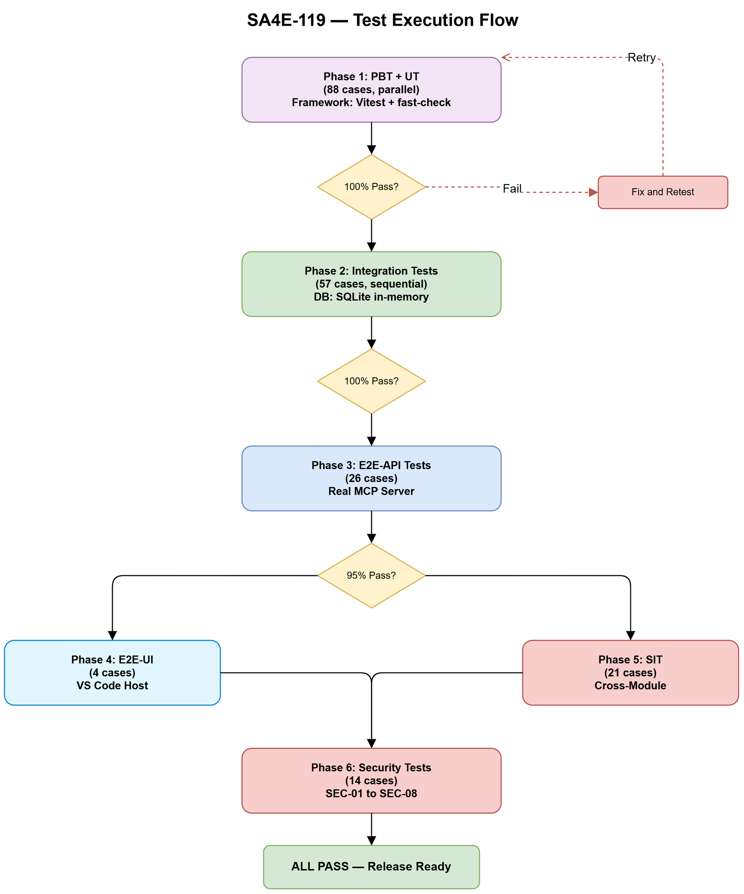
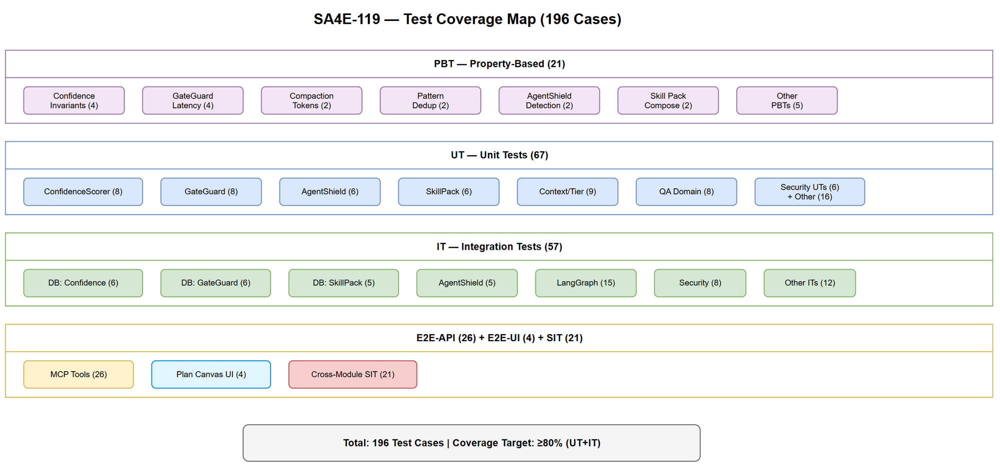

# System Test Plan (STP)

## SA4E — SA4E-119: [Epic] ECC Feature Parity - Import Missing Concepts

---

## Document Information

| Field | Value |
|-------|-------|
| Jira Ticket | SA4E-119 |
| Title | ECC Feature Parity - Import Missing Concepts |
| Author | QA Agent |
| Version | 1.0 |
| Date | 2026-08-16 |
| Status | Draft |
| Related BRD | BRD-v1-SA4E-119.docx |
| Related FSD | FSD-v1-SA4E-119.docx |
| Related TDD | TDD-v1-SA4E-119.docx |

---

## Revision History

| Version | Date | Author | Changes |
|---------|------|--------|---------|
| 1.0 | 2026-08-16 | QA Agent | Initial STP — 12 features, 6 test levels, RTM |

---

## 1. Introduction

### 1.1 Purpose

This System Test Plan defines the testing strategy, test levels, environments, and traceability for the 12 ECC Feature Parity features. It ensures comprehensive validation of confidence scoring, security (GateGuard + AgentShield), skill packs, context management, and quality assurance features.

### 1.2 Scope

- 12 features across 5 domains (Knowledge Enhancement, Context Management, Quality Assurance, Developer Productivity, Security & Safety)
- 30+ business rules (BR-101 to BR-1205)
- 12 use cases (UC-1 to UC-12)
- 10 new MCP tools
- 5 database migrations
- Security findings from SECURITY-REVIEW.md (3 High, 5 Medium)

### 1.3 Test Approach

6 test levels following the test pyramid:

| Level | Abbreviation | Focus | Framework | Automation |
|-------|-------------|-------|-----------|------------|
| Property-Based Testing | PBT | Mathematical invariants | Vitest + fast-check | 100% automated |
| Unit Testing | UT | Individual classes/functions | Vitest | 100% automated |
| Integration Testing | IT | Module interactions, DB | Vitest + better-sqlite3 | 100% automated |
| E2E API Testing | E2E-API | Full MCP tool lifecycle | Vitest + HTTP client | 100% automated |
| E2E UI Testing | E2E-UI | Extension webview flows | Mocha + VS Code test | 90% automated |
| System Integration Testing | SIT | Cross-module orchestration | Vitest + extension tests | 80% automated |

### 1.4 References

| Document | Location |
|----------|----------|
| BRD | BRD-v1-SA4E-119.docx |
| FSD | FSD-v1-SA4E-119.docx |
| TDD | TDD-v1-SA4E-119.docx |
| Security Review | SECURITY-REVIEW.md |

---

## 2. Test Strategy

### 2.1 Strategy per Feature Domain

#### Domain 1: Knowledge Enhancement (UC-1, UC-9)

| Aspect | Strategy |
|--------|----------|
| PBT Focus | Confidence score always in [0.0, 1.0], decay monotonic, corroboration monotonically increases |
| UT Focus | ConfidenceScorer, InstinctEngine, PatternExtractor, PatternDeduplicator |
| IT Focus | Database operations, confidence decay batch, pattern similarity check |
| E2E-API | Enhanced mem_ingest, mem_search with confidence, instinct_manage tool |
| Security | condition_json injection (SEC-07), rate limiting |

#### Domain 2: Context Management (UC-3, UC-4, UC-10)

| Aspect | Strategy |
|--------|----------|
| PBT Focus | Compacted output always < 500 tokens, context levels monotonically escalate |
| UT Focus | ContextCompactor, ModelTierRouter, TierClassifier |
| IT Focus | LangGraph node integration, state channel isolation |
| E2E-API | Model tier routing accuracy, compaction quality |
| Security | Fresh-context isolation verification (no history leakage) |

#### Domain 3: Quality Assurance (UC-5, UC-6)

| Aspect | Strategy |
|--------|----------|
| PBT Focus | Adversarial loop terminates (max 3), council always >= 3 voices |
| UT Focus | AdversarialReviewEngine, CouncilEngine, VoicePersona |
| IT Focus | LangGraph subgraph execution, parallel voice spawning |
| E2E-API | Adversarial round-trip, council synthesis output |
| Security | Context isolation between Generator/Discriminator (BR-503) |

#### Domain 4: Developer Productivity (UC-2, UC-8, UC-11)

| Aspect | Strategy |
|--------|----------|
| PBT Focus | Skill pack composition is deterministic (same input, same result) |
| UT Focus | SkillPackRegistry, SkillPackLoader, SkillPackComposer, OnboardingSkill |
| IT Focus | File system operations, manifest validation, DB CRUD |
| E2E-API | skill_pack_install, skill_pack_list, onboarding_generate |
| E2E-UI | Plan Canvas webview rendering |
| Security | Supply chain integrity (SEC-02), path traversal |

#### Domain 5: Security & Safety (UC-7, UC-12)

| Aspect | Strategy |
|--------|----------|
| PBT Focus | GateGuard: non-destructive always passes, regex match < 50ms |
| UT Focus | AgentShieldScanner, SecretDetector, GateGuardHook, DenylistManager |
| IT Focus | Audit log integrity, denylist CRUD, scan rule execution |
| E2E-API | gateguard_evaluate, gateguard_denylist, agentshield_scan |
| Security | Override auth (SEC-01), ReDoS (SEC-05), audit tamper (SEC-06), scan path (SEC-08) |

### 2.2 Test Data Strategy

| Category | Source | Format |
|----------|--------|--------|
| Confidence scores | Generated (boundary + random) | CSV |
| GateGuard commands | Default denylist + custom patterns | CSV |
| AgentShield configs | Malicious + clean samples | JSON files |
| Skill pack manifests | Valid + invalid + malicious | JSON |
| KB entries | Synthetic with varying ages/sources | CSV |

### 2.3 Risk-Based Testing Priority

| Risk Area | Priority | Coverage Target |
|-----------|----------|----------------|
| GateGuard (safety-critical) | P1 | 100% BR coverage + security |
| AgentShield (security) | P1 | 100% BR + OWASP coverage |
| Confidence Scoring (core logic) | P1 | 100% BR + PBT |
| Model Tiering (cost impact) | P2 | 100% BR coverage |
| Skill Packs (supply chain) | P2 | 100% BR + security |
| Context Compaction | P2 | 90% coverage |
| Fresh-Context / Adversarial / Council | P3 | 80% coverage |
| Plan Canvas / Onboarding | P3 | 70% coverage |

---

## 3. Test Environment

### 3.1 Backend Test Environment

| Component | Configuration |
|-----------|--------------|
| Runtime | Node.js 20+ |
| Framework | Vitest 2.x |
| Database | SQLite in-memory (better-sqlite3) |
| MCP SDK | @modelcontextprotocol/sdk 1.x |
| HTTP | Hono 4.x test client |
| Mocking | Vitest mock/spy |
| PBT | fast-check 3.x |

### 3.2 Extension Test Environment

| Component | Configuration |
|-----------|--------------|
| Runtime | VS Code Extension Host |
| Framework | Mocha 10.x |
| Test runner | @vscode/test-electron |
| Mock LLM | Stubbed Anthropic SDK |
| File system | tmp directories |

### 3.3 E2E Test Environment

| Component | Configuration |
|-----------|--------------|
| Backend server | localhost:48721 (real instance) |
| Extension bridge | localhost:9181 (real instance) |
| Database | SQLite file (test.db) |
| Cleanup | Truncate all test tables before each suite |

---

## 4. Requirements Traceability Matrix (RTM)

### 4.1 Business Rules to Test Cases

| BR ID | Business Rule | Test Level | Test Case IDs |
|-------|--------------|------------|---------------|
| BR-101 | Default confidence = 0.5 | UT, IT, E2E-API | TC-0101, TC-0102, TC-0103 |
| BR-102 | Confidence >= 0.8 when 3+ corroboration | UT, PBT, IT | TC-0104, TC-0105, TC-0106 |
| BR-103 | Decay 0.1/week after 30 days | UT, PBT, IT | TC-0107, TC-0108, TC-0109, TC-0110 |
| BR-104 | Confidence clamped [0.0, 1.0] | PBT, UT | TC-0111, TC-0112 |
| BR-105 | Instincts project-scoped | UT, IT, E2E-API | TC-0113, TC-0114 |
| BR-201 | Later pack overrides earlier | UT, IT | TC-0201, TC-0202 |
| BR-202 | Manifest must have version + compat | UT, IT | TC-0203, TC-0204 |
| BR-203 | Storage in .kiro/steering/packs/ | IT, E2E-API | TC-0205, TC-0206 |
| BR-301 | Trigger: >500 lines OR security OR DB | UT, IT | TC-0301, TC-0302, TC-0303 |
| BR-302 | Reviewer no access to history | IT, SIT | TC-0304, TC-0305 |
| BR-303 | Critical blind spots block pipeline | IT, SIT | TC-0306 |
| BR-401 | Normal: <60% context | UT | TC-0401 |
| BR-402 | Warn: 60-80% | UT, IT | TC-0402, TC-0403 |
| BR-403 | Critical: 80-90% force compact | UT, IT | TC-0404, TC-0405 |
| BR-404 | Emergency: 90%+ essentials only | UT, IT | TC-0406 |
| BR-405 | Summary max 500 tokens | PBT, UT | TC-0407, TC-0408 |
| BR-501 | Adversarial max 3 iterations | UT, IT | TC-0501, TC-0502 |
| BR-502 | Discriminator >= 3 issues or accept | UT, IT | TC-0503, TC-0504 |
| BR-503 | Independent contexts | IT, SIT | TC-0505, TC-0506 |
| BR-601 | Minimum 3 voices | UT, IT | TC-0601, TC-0602 |
| BR-602 | Unanimous = confidence high | UT, IT | TC-0603 |
| BR-603 | Split = user approves | IT, SIT | TC-0604 |
| BR-701 | Hardcoded secrets = CRITICAL | UT, IT, E2E-API | TC-0701, TC-0702, TC-0703 |
| BR-702 | HTTP MCP server = HIGH | UT, IT | TC-0704, TC-0705 |
| BR-703 | Prompt injection = HIGH | UT, IT | TC-0706, TC-0707 |
| BR-704 | CRITICAL blocks pipeline | IT, SIT | TC-0708, TC-0709 |
| BR-801 | Color coding green/yellow/red | E2E-UI | TC-0801 |
| BR-802 | Auto-refresh within 5s | E2E-UI | TC-0802, TC-0803 |
| BR-901 | Extract >= 3 patterns | UT, IT | TC-0901, TC-0902 |
| BR-902 | Similarity > 0.85 update existing | UT, PBT, IT | TC-0903, TC-0904 |
| BR-903 | Promote after 3+ reuses | UT, IT | TC-0905, TC-0906 |
| BR-1001 | Low = fast model | UT, IT | TC-1001, TC-1002 |
| BR-1002 | High = full model | UT, IT | TC-1003, TC-1004 |
| BR-1003 | User can override tier | UT, E2E-API | TC-1005, TC-1006 |
| BR-1101 | Generation < 60s | IT, E2E-API | TC-1101, TC-1102 |
| BR-1102 | Cache valid until >20% change | UT, IT | TC-1103, TC-1104 |
| BR-1201 | Default denylist patterns | UT, IT, E2E-API | TC-1201, TC-1202, TC-1203 |
| BR-1202 | Override requires user approval | UT, IT, E2E-API | TC-1204, TC-1205 |
| BR-1203 | Non-destructive < 50ms | PBT, IT, E2E-API | TC-1206, TC-1207, TC-1208 |
| BR-1204 | Audit trail append-only | IT, E2E-API | TC-1209, TC-1210 |
| BR-1205 | Custom patterns per project | UT, IT, E2E-API | TC-1211, TC-1212 |

### 4.2 Security Findings to Test Cases

| Finding | Severity | Test Case IDs |
|---------|----------|---------------|
| SEC-01: GateGuard override auth | High | TC-SEC-01, TC-SEC-02, TC-SEC-03 |
| SEC-02: Skill pack integrity | High | TC-SEC-04, TC-SEC-05, TC-SEC-06 |
| SEC-03: Tool-level RBAC | High | TC-SEC-07, TC-SEC-08 |
| SEC-05: ReDoS prevention | Medium | TC-SEC-09, TC-SEC-10 |
| SEC-07: condition_json schema | Medium | TC-SEC-11, TC-SEC-12 |
| SEC-08: Scan path restriction | Medium | TC-SEC-13, TC-SEC-14 |

### 4.3 Use Cases to Test Cases Summary

| UC | Feature | PBT | UT | IT | E2E-API | E2E-UI | SIT | Total |
|----|---------|-----|----|----|---------|--------|-----|-------|
| UC-1 | Confidence Scoring | 4 | 8 | 6 | 4 | 0 | 2 | 24 |
| UC-2 | Skill Packs | 2 | 6 | 5 | 4 | 0 | 1 | 18 |
| UC-3 | Fresh-Context Review | 1 | 4 | 4 | 0 | 0 | 3 | 12 |
| UC-4 | Context Compaction | 2 | 5 | 4 | 0 | 0 | 2 | 13 |
| UC-5 | Adversarial Review | 1 | 4 | 4 | 0 | 0 | 2 | 11 |
| UC-6 | Council Decision | 1 | 4 | 3 | 0 | 0 | 2 | 10 |
| UC-7 | AgentShield | 2 | 6 | 5 | 4 | 0 | 2 | 19 |
| UC-8 | Plan Canvas | 0 | 3 | 2 | 0 | 4 | 1 | 10 |
| UC-9 | Pattern Extraction | 2 | 5 | 4 | 3 | 0 | 1 | 15 |
| UC-10 | Model Tiering | 1 | 4 | 3 | 3 | 0 | 1 | 12 |
| UC-11 | Codebase Onboarding | 1 | 4 | 3 | 3 | 0 | 1 | 12 |
| UC-12 | GateGuard | 4 | 8 | 6 | 5 | 0 | 3 | 26 |
| Security | SEC-01 to SEC-08 | 0 | 6 | 8 | 0 | 0 | 0 | 14 |
| **Total** | | **21** | **67** | **57** | **26** | **4** | **21** | **196** |

---

## 5. Test Execution Plan

### 5.1 Execution Order

```
Phase 1: PBT + UT (parallel, all domains)
  |
Phase 2: IT (sequential per module, DB setup required)
  |
Phase 3: E2E-API (sequential, real server instance)
  |
Phase 4: E2E-UI (Plan Canvas webview only)
  |
Phase 5: SIT (cross-module integration scenarios)
  |
Phase 6: Security-focused tests (SEC-01 to SEC-08)
```

### 5.2 Execution Flow



### 5.3 Entry Criteria

| Phase | Criteria |
|-------|---------|
| PBT/UT | Code compiles, dependencies installed |
| IT | DB migrations applied, modules registered |
| E2E-API | Server running on localhost:48721 |
| E2E-UI | Extension loaded in test host |
| SIT | All IT pass, server + extension running |

### 5.4 Exit Criteria

| Criterion | Threshold |
|-----------|-----------|
| PBT pass rate | 100% (100 runs per property) |
| UT pass rate | 100% |
| IT pass rate | 100% |
| E2E-API pass rate | 95% (flaky tolerance for timing) |
| E2E-UI pass rate | 90% |
| SIT pass rate | 90% |
| Code coverage (UT + IT) | >= 80% lines |
| Security test pass rate | 100% |

### 5.5 Test Automation

| Level | CI Integration | Trigger |
|-------|---------------|---------|
| PBT + UT | GitHub Actions / pre-push | Every commit |
| IT | GitHub Actions | Every PR |
| E2E-API | GitHub Actions (with server startup) | PR merge to main |
| E2E-UI | Manual + nightly CI | Nightly |
| SIT | Release pipeline | Before release |

---

## 6. Test Coverage

### 6.1 Coverage Diagram



### 6.2 Coverage Targets per Module

| Module | Line Coverage | Branch Coverage | Focus |
|--------|-------------|-----------------|-------|
| ConfidenceScorer | >= 95% | >= 90% | Core algorithm |
| InstinctEngine | >= 90% | >= 85% | Re-ranking logic |
| GateGuardHook | >= 95% | >= 95% | Safety-critical |
| DenylistManager | >= 95% | >= 90% | Pattern matching |
| AgentShieldScanner | >= 90% | >= 85% | Security scanning |
| SkillPackRegistry | >= 85% | >= 80% | CRUD + composition |
| ModelTierRouter | >= 90% | >= 85% | Classification |
| ContextCompactor | >= 80% | >= 75% | LLM-dependent |
| PatternExtractor | >= 85% | >= 80% | Pattern analysis |
| OnboardingSkill | >= 80% | >= 75% | CodeIntel integration |

---

## 7. Defect Management

### 7.1 Severity Classification

| Severity | Definition | Example |
|----------|-----------|---------|
| Critical | System unusable, data loss, security breach | GateGuard bypass, audit log corruption |
| High | Major feature broken, no workaround | Confidence scoring produces values > 1.0 |
| Medium | Feature degraded, workaround exists | Skill pack install slow (>10s) |
| Low | Minor issue, cosmetic | Plan Canvas color slightly off |

### 7.2 Response Times

| Severity | Fix Deadline | Retest |
|----------|-------------|--------|
| Critical | Same sprint | Immediate |
| High | Same sprint | Next day |
| Medium | Next sprint | Within 3 days |
| Low | Backlog | Next release |

---

## 8. Risks and Mitigations

| Risk | Impact | Mitigation |
|------|--------|-----------|
| LLM responses non-deterministic | IT/SIT flakiness | Mock LLM in IT, use seed/temperature=0 in SIT |
| GateGuard regex performance varies | False pass on < 50ms | PBT with 1000+ random commands, benchmark suite |
| SQLite concurrency in tests | Flaky IT | Use separate in-memory DB per test suite |
| Extension test host instability | E2E-UI failures | Retry mechanism, nightly-only for UI tests |
| Pattern similarity threshold sensitive | False merges | PBT with known-different and known-similar pairs |

---

## 9. Appendix

### Diagram Index

| # | Diagram | Image | Source (editable) |
|---|---------|-------|-------------------|
| 1 | Test Coverage | [test-coverage.png](diagrams/test-coverage.png) | [test-coverage.drawio](diagrams/test-coverage.drawio) |
| 2 | Test Execution Flow | [test-execution-flow.png](diagrams/test-execution-flow.png) | [test-execution-flow.drawio](diagrams/test-execution-flow.drawio) |

### Test Data Files

| File | Content | Used By |
|------|---------|---------|
| test-data/confidence-scores.csv | Boundary values for confidence | TC-01xx |
| test-data/gateguard-commands.csv | Destructive + safe commands | TC-12xx |
| test-data/agentshield-configs.json | Malicious + clean configs | TC-07xx |
| test-data/skill-pack-manifests.json | Valid + invalid manifests | TC-02xx |
| test-data/instinct-conditions.json | Valid + malicious conditions | TC-01xx, TC-SEC-11 |
