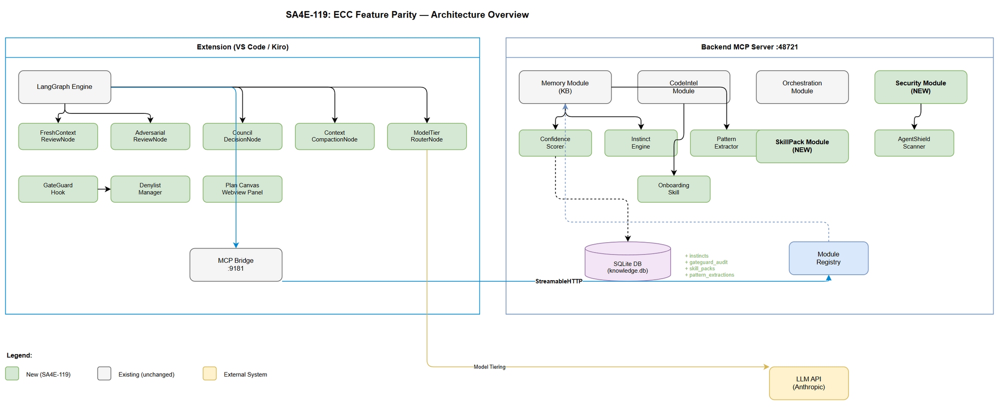
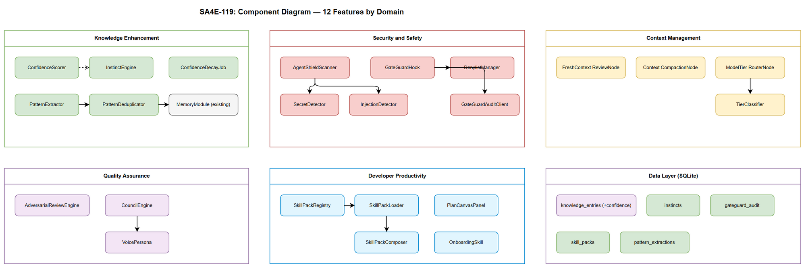

# Technical Design Document (TDD)

## SA4E — SA4E-119: [Epic] ECC Feature Parity - Import Missing Concepts

---

## Document Information

| Field | Value |
|-------|-------|
| Jira Ticket | SA4E-119 |
| Title | ECC Feature Parity - Import Missing Concepts |
| Author | SA Agent |
| Version | 1.0 |
| Date | 2026-08-16 |
| Status | Draft |
| Related BRD | BRD-v1-SA4E-119.docx |
| Related FSD | FSD-v1-SA4E-119.docx |

---

## Revision History

| Version | Date | Author | Changes |
|---------|------|--------|---------|
| 1.0 | 2026-08-16 | SA Agent | Initial TDD — architecture design for 12 ECC features |

---

## 1. Introduction

### 1.1 Purpose

This TDD defines the technical architecture for importing 12 features from ECC (Enterprise Code Cognition) into the SA4E multi-agent system. Each feature integrates into existing backend modules or creates new modules within the established IModule plugin architecture.

### 1.2 Scope

Covers implementation design across 5 domains:
- **Knowledge Enhancement** — Confidence Scoring, Continuous Learning v2
- **Context Management** — Fresh-Context Review, Strategic Compaction, Model Tiering
- **Quality Assurance** — Adversarial Review, Council Decision
- **Developer Productivity** — Skill Packs, Plan Canvas, Codebase Onboarding
- **Security & Safety** — AgentShield, GateGuard

### 1.3 Technology Stack

| Layer | Technology | Version |
|-------|-----------|---------|
| Language | TypeScript | 5.x |
| Backend Framework | Hono | 4.x |
| MCP SDK | @modelcontextprotocol/sdk | 1.x |
| Database | SQLite (better-sqlite3) + vec extensions | 11.x |
| Embeddings | ONNX Runtime (all-MiniLM-L6-v2) | local |
| Pipeline | LangGraph (extension) | 0.2.x |
| Extension | VS Code/Kiro Extension API | latest |
| Test | Vitest (backend) / Mocha (extension) | 2.x / 10.x |

### 1.4 Design Principles

- **Module Plugin Architecture** — All features implement `IModule` interface and register via `ModuleRegistry`
- **SOLID** — Single Responsibility per class, interfaces for abstraction
- **Event-Driven** — Use `EventBus` for cross-module communication
- **Incremental Adoption** — Each feature can be enabled/disabled independently
- **Backward Compatibility** — ALTER TABLE only adds nullable columns; no breaking changes to existing API

### 1.5 Constraints

- SQLite single-writer limitation — writes serialized via better-sqlite3 sync API
- Extension context window budget — compaction must stay < 2s
- GateGuard interception < 50ms — regex-only matching, no LLM calls in hot path
- MCP tool schema backward-compat — existing tool parameters unchanged, new params optional

### 1.6 References

| Document | Location |
|----------|----------|
| BRD | BRD-v1-SA4E-119.docx |
| FSD | FSD-v1-SA4E-119.docx |
| Architecture | .code-intel/SA4E-ARCHITECTURE.md |

---

## 2. System Architecture

### 2.1 Architecture Overview

The 12 features integrate into the existing two-tier architecture (Backend MCP Server + Extension):



**Integration Strategy:**

| Domain | Location | Approach |
|--------|----------|----------|
| Knowledge Enhancement | Backend (Memory Module) | Extend existing `MemoryModule` with `ConfidenceScorer` + `InstinctEngine` |
| Skill Packs | Backend (New Module) | New `SkillPackModule` implementing `IModule` |
| Fresh-Context / Adversarial / Council | Extension (LangGraph) | New LangGraph nodes in SDLC subgraph |
| Context Compaction | Extension (LangGraph) | New `CompactionNode` called at phase boundaries |
| Model Tiering | Extension (LangGraph) | New `ModelTierRouter` replacing direct LLM calls |
| Plan Canvas | Extension (Webview) | New Webview panel via `webview-panel-manager.ts` |
| AgentShield | Backend (New Module) | New `SecurityModule` implementing `IModule` |
| GateGuard | Extension (Hooks) | New hook in `.kiro/hooks/` + backend audit table |
| Codebase Onboarding | Backend (CodeIntel Module) | Extend existing `CodeIntelModule` |
| Pattern Extraction | Backend (Memory Module) | New `PatternExtractor` service in Memory |

### 2.2 Component Diagram



| Component | Responsibility | Module |
|-----------|---------------|--------|
| ConfidenceScorer | Compute/decay/corroborate confidence scores | Memory |
| InstinctEngine | Manage project-scoped instincts for re-ranking | Memory |
| PatternExtractor | Extract patterns on ticket completion | Memory |
| SkillPackRegistry | Discover/install/compose skill packs | SkillPack (new) |
| SkillPackLoader | Validate manifests, load into .kiro/steering/packs/ | SkillPack (new) |
| AgentShieldScanner | Scan configs for secrets/injection/TLS | Security (new) |
| GateGuardHook | PreToolUse hook blocking destructive commands | Extension |
| DenylistManager | CRUD project-specific denylist patterns | Extension + Backend |
| FreshContextReviewer | Spawn isolated review with no history | Extension (LangGraph) |
| AdversarialReviewEngine | GAN-style Generator/Discriminator loop | Extension (LangGraph) |
| CouncilEngine | Multi-voice decision with 3+ personas | Extension (LangGraph) |
| ContextCompactor | Post-phase context summarization | Extension (LangGraph) |
| ModelTierRouter | Classify complexity and route to model tier | Extension (LangGraph) |
| PlanCanvasPanel | Webview showing STATUS.json visually | Extension (Webview) |
| OnboardingSkill | Analyze codebase and generate ONBOARDING.md | CodeIntel |

### 2.3 Communication Patterns

| From | To | Protocol | Pattern | Description |
|------|----|----------|---------|-------------|
| Extension (LangGraph) | Backend | MCP (StreamableHTTP) | Sync | Tool calls (mem_*, code_*, instinct_*) |
| GateGuardHook | Backend | MCP (StreamableHTTP) | Sync | Audit log writes |
| AgentShieldScanner | FileSystem | Direct | Sync/Watch | Config file scanning |
| PlanCanvasPanel | STATUS.json | FileSystem | Watch | fs.watch for auto-refresh |
| PatternExtractor | Memory Module | Internal | Sync | Direct function call (same process) |
| ModelTierRouter | LLM API | HTTPS | Async | Route to different model endpoints |

---

## 3. API Design

### 3.1 API Overview — New MCP Tools

| # | Tool Name | Method | Description | Feature |
|---|-----------|--------|-------------|---------|
| 1 | instinct_manage | MCP tool/call | CRUD instincts for project | UC-1 |
| 2 | skill_pack_install | MCP tool/call | Install skill pack by name | UC-2 |
| 3 | skill_pack_list | MCP tool/call | List installed packs | UC-2 |
| 4 | skill_pack_remove | MCP tool/call | Remove installed pack | UC-2 |
| 5 | gateguard_evaluate | MCP tool/call | Evaluate command against denylist | UC-12 |
| 6 | gateguard_audit_log | MCP tool/call | Query audit log | UC-12 |
| 7 | gateguard_denylist | MCP tool/call | CRUD denylist patterns | UC-12 |
| 8 | agentshield_scan | MCP tool/call | Scan config file(s) for issues | UC-7 |
| 9 | onboarding_generate | MCP tool/call | Generate ONBOARDING.md | UC-11 |
| 10 | pattern_extract | MCP tool/call | Manually trigger extraction | UC-9 |

### 3.2 Tool: instinct_manage

**Implements:** UC-1B, BR-105

| Attribute | Value |
|-----------|-------|
| Tool Name | instinct_manage |
| Auth | Project-scoped (project_id required) |

**Input Schema:**

```json
{
  "action": "create | update | delete | list",
  "project_id": "string (required)",
  "instinct": {
    "name": "string",
    "rule_type": "prefer_recent | prefer_verified | prefer_corroborated | custom",
    "weight": "number (0.1-2.0)",
    "condition_json": "string (optional, for custom rules)",
    "active": "boolean (default true)"
  },
  "instinct_id": "number (required for update/delete)"
}
```

**Response — Success (list):**

```json
{
  "content": [{ "type": "text", "text": "{\"instincts\": [{\"id\":1,\"name\":\"...\",\"rule_type\":\"...\",\"weight\":1.2,\"active\":true}]}" }]
}
```

**Error Responses:**

| Code | Message | Condition |
|------|---------|-----------|
| INVALID_WEIGHT | Weight must be 0.1-2.0 | weight out of range |
| INVALID_RULE_TYPE | Unknown rule_type | rule_type not in enum |
| NOT_FOUND | Instinct not found | delete/update with bad id |

---

### 3.3 Tool: skill_pack_install

**Implements:** UC-2A, BR-201-203

| Attribute | Value |
|-----------|-------|
| Tool Name | skill_pack_install |

**Input Schema:**

```json
{
  "name": "string (required — pack identifier)",
  "source": "string (optional — local path or catalog URL, default: built-in catalog)",
  "force": "boolean (optional — override existing, default false)"
}
```

**Response — Success:**

```json
{
  "content": [{ "type": "text", "text": "{\"installed\":true,\"name\":\"react-ts\",\"version\":\"1.2.0\",\"path\":\".kiro/steering/packs/react-ts/\",\"conflicts\":[]}" }]
}
```

---

### 3.4 Tool: gateguard_evaluate

**Implements:** UC-12A, BR-1201-1203

| Attribute | Value |
|-----------|-------|
| Tool Name | gateguard_evaluate |
| Performance | < 50ms |

**Input Schema:**

```json
{
  "command": "string (required — command to evaluate)",
  "agent": "string (optional — requesting agent name)",
  "project_id": "string (optional — for custom patterns)"
}
```

**Response — ALLOW:**

```json
{
  "content": [{ "type": "text", "text": "{\"action\":\"allow\",\"latency_ms\":2}" }]
}
```

**Response — BLOCK:**

```json
{
  "content": [{ "type": "text", "text": "{\"action\":\"block\",\"pattern_matched\":\"rm -rf\",\"explanation\":\"Destructive command blocked by GateGuard\",\"override_hash\":\"abc123\",\"latency_ms\":4}" }]
}
```

---

### 3.5 Tool: agentshield_scan

**Implements:** UC-7A, BR-701-704

**Input Schema:**

```json
{
  "paths": "string[] (required — config file paths to scan)",
  "rules": "string[] (optional — specific rule IDs to check)"
}
```

**Response:**

```json
{
  "content": [{ "type": "text", "text": "{\"findings\":[{\"severity\":\"CRITICAL\",\"rule\":\"hardcoded_secret\",\"file\":\"mcp.json\",\"line\":5,\"message\":\"API key found in config\"}],\"summary\":{\"critical\":1,\"high\":0,\"medium\":0,\"low\":0}}" }]
}
```

---

### 3.6 Enhanced Existing Tools

#### mem_ingest (enhanced — UC-1A)

New optional parameter:

| Parameter | Type | Required | Description |
|-----------|------|----------|-------------|
| confidence_override | number | N | Manual confidence score 0.0-1.0 |

When provided, bypasses automatic confidence computation.

#### mem_search (enhanced response — UC-1B)

New fields in response entries:

| Field | Type | Description |
|-------|------|-------------|
| confidence | number | Entry confidence score |
| instinct_boosts | object | Map of instinct_name to boost_value applied |

---

## 4. Database Design

### 4.1 Schema Overview

All new tables reside in the existing `knowledge.db` (SQLite) alongside `knowledge_entries`.

### 4.2 DDL Scripts

#### ALTER TABLE: knowledge_entries (Confidence Fields)

```sql
-- Migration: V119_01__add_confidence_fields.sql
ALTER TABLE knowledge_entries ADD COLUMN corroboration_count INTEGER NOT NULL DEFAULT 0;
ALTER TABLE knowledge_entries ADD COLUMN last_refreshed_at TEXT;
ALTER TABLE knowledge_entries ADD COLUMN confidence_source TEXT NOT NULL DEFAULT 'initial';

-- Note: 'confidence' column already exists in knowledge_entries (see models.ts)
-- Update default: existing entries retain their current confidence value
```

#### New Table: instincts

```sql
-- Migration: V119_02__create_instincts.sql
CREATE TABLE IF NOT EXISTS instincts (
  id INTEGER PRIMARY KEY AUTOINCREMENT,
  project_id TEXT NOT NULL,
  name TEXT NOT NULL,
  rule_type TEXT NOT NULL CHECK(rule_type IN ('prefer_recent','prefer_verified','prefer_corroborated','custom')),
  weight REAL NOT NULL DEFAULT 1.0 CHECK(weight >= 0.1 AND weight <= 2.0),
  condition_json TEXT,
  active INTEGER NOT NULL DEFAULT 1,
  created_at TEXT NOT NULL DEFAULT (datetime('now')),
  updated_at TEXT NOT NULL DEFAULT (datetime('now'))
);
CREATE INDEX idx_instincts_project ON instincts(project_id, active);
CREATE UNIQUE INDEX idx_instincts_project_name ON instincts(project_id, name);
```

#### New Table: gateguard_audit

```sql
-- Migration: V119_03__create_gateguard_audit.sql
CREATE TABLE IF NOT EXISTS gateguard_audit (
  id INTEGER PRIMARY KEY AUTOINCREMENT,
  timestamp TEXT NOT NULL DEFAULT (datetime('now')),
  command TEXT NOT NULL,
  agent TEXT,
  pattern_matched TEXT,
  action TEXT NOT NULL CHECK(action IN ('blocked','overridden','allowed')),
  override_by TEXT,
  project_id TEXT,
  context_json TEXT
);
CREATE INDEX idx_gateguard_audit_time ON gateguard_audit(timestamp DESC);
CREATE INDEX idx_gateguard_audit_project ON gateguard_audit(project_id, timestamp DESC);
```

#### New Table: skill_packs

```sql
-- Migration: V119_04__create_skill_packs.sql
CREATE TABLE IF NOT EXISTS skill_packs (
  id INTEGER PRIMARY KEY AUTOINCREMENT,
  name TEXT NOT NULL UNIQUE,
  version TEXT NOT NULL,
  sa4e_compat TEXT NOT NULL DEFAULT '>=1.0.0',
  manifest_json TEXT NOT NULL,
  installed_at TEXT NOT NULL DEFAULT (datetime('now')),
  priority_order INTEGER NOT NULL DEFAULT 0,
  active INTEGER NOT NULL DEFAULT 1
);
CREATE INDEX idx_skill_packs_active ON skill_packs(active, priority_order);
```

#### New Table: pattern_extractions

```sql
-- Migration: V119_05__create_pattern_extractions.sql
CREATE TABLE IF NOT EXISTS pattern_extractions (
  id INTEGER PRIMARY KEY AUTOINCREMENT,
  ticket_key TEXT NOT NULL,
  pattern_type TEXT NOT NULL,
  content_hash TEXT NOT NULL,
  kb_entry_id INTEGER,
  reuse_count INTEGER NOT NULL DEFAULT 0,
  promoted_at TEXT,
  created_at TEXT NOT NULL DEFAULT (datetime('now')),
  FOREIGN KEY(kb_entry_id) REFERENCES knowledge_entries(id)
);
CREATE INDEX idx_pattern_ticket ON pattern_extractions(ticket_key);
CREATE INDEX idx_pattern_reuse ON pattern_extractions(reuse_count DESC);
```

### 4.3 Migration Plan

| Order | Script | Description | Rollback |
|-------|--------|-------------|----------|
| 1 | V119_01__add_confidence_fields.sql | Add columns to knowledge_entries | Drop columns (SQLite: recreate table) |
| 2 | V119_02__create_instincts.sql | Create instincts table | DROP TABLE instincts |
| 3 | V119_03__create_gateguard_audit.sql | Create audit table | DROP TABLE gateguard_audit |
| 4 | V119_04__create_skill_packs.sql | Create skill_packs table | DROP TABLE skill_packs |
| 5 | V119_05__create_pattern_extractions.sql | Create pattern tracking | DROP TABLE pattern_extractions |

### 4.4 Query Patterns

| Operation | Query Pattern | Performance Target |
|-----------|--------------|-------------------|
| Search with confidence re-rank | SELECT + ORDER BY (relevance * confidence * instinct_boost) | < 200ms p95 |
| GateGuard denylist lookup | Cached in-memory Set + regex match | < 50ms |
| Instinct load for project | SELECT * FROM instincts WHERE project_id=? AND active=1 | < 10ms (indexed) |
| Audit log insert | INSERT INTO gateguard_audit | < 5ms |
| Confidence decay batch | UPDATE ... WHERE last_refreshed_at < threshold | Daily cron, < 5s |

---

## 5. Class / Module Design

### 5.1 Package Structure — New Files

```
backend/src/
├── modules/
│   ├── memory/
│   │   ├── confidence/
│   │   │   ├── ConfidenceScorer.ts      # Compute, decay, corroborate
│   │   │   ├── InstinctEngine.ts        # Load/apply instincts for re-ranking
│   │   │   └── ConfidenceDecayJob.ts    # Daily decay scheduler
│   │   └── learning/
│   │       ├── PatternExtractor.ts      # Extract patterns from tickets
│   │       └── PatternDeduplicator.ts   # Similarity check + merge
│   ├── skill-pack/                      # NEW MODULE
│   │   ├── SkillPackModule.ts           # IModule implementation
│   │   ├── SkillPackRegistry.ts         # Catalog + resolution
│   │   ├── SkillPackLoader.ts           # Validate manifest, copy files
│   │   ├── SkillPackComposer.ts         # Merge multiple packs
│   │   ├── models.ts                    # SkillPackManifest, SkillPackEntry
│   │   └── definitions.ts              # MCP tool definitions
│   └── security/                        # NEW MODULE
│       ├── SecurityModule.ts            # IModule implementation
│       ├── AgentShieldScanner.ts        # Config scanning engine
│       ├── rules/                       # Scanning rules
│       │   ├── SecretDetector.ts        # BR-701: Hardcoded secrets
│       │   ├── HttpEndpointRule.ts      # BR-702: HTTP MCP servers
│       │   ├── InjectionDetector.ts     # BR-703: Prompt injection
│       │   └── TlsValidator.ts         # TLS config validation
│       ├── models.ts                    # Finding, ScanResult
│       └── definitions.ts              # MCP tool definitions
│
extension/src/
├── langgraph/
│   ├── nodes/
│   │   ├── FreshContextReviewNode.ts   # UC-3: Isolated reviewer spawn
│   │   ├── AdversarialReviewNode.ts    # UC-5: GAN-style loop
│   │   ├── CouncilDecisionNode.ts      # UC-6: Multi-voice
│   │   ├── ContextCompactionNode.ts    # UC-4: Post-phase compaction
│   │   └── ModelTierRouterNode.ts      # UC-10: Complexity → tier
│   └── strategies/
│       └── TierClassifier.ts           # Rule-based complexity classification
├── hooks/
│   └── GateGuardHook.ts                # UC-12: PreToolUse interception
├── gateguard/
│   ├── DenylistManager.ts              # Load/cache/match patterns
│   ├── GateGuardAuditClient.ts         # Write audit via MCP
│   └── models.ts                       # DenyPattern, EvalResult
├── panels/
│   └── PlanCanvasPanel.ts              # UC-8: STATUS.json webview
└── onboarding/
    └── OnboardingSkill.ts              # UC-11: Codebase analysis
```

### 5.2 Key Interfaces

```typescript
// === Backend: Confidence Scoring ===
export interface IConfidenceScorer {
  computeInitial(entry: KnowledgeEntry, metadata: IngestMetadata): number;
  corroborate(entryId: number, newSources: string[]): Promise<number>;
  decay(cutoffDate: string): Promise<number>; // returns count decayed
}

export interface IInstinctEngine {
  loadForProject(projectId: string): Promise<Instinct[]>;
  applyBoosts(results: SearchResult[], instincts: Instinct[]): SearchResult[];
}

// === Backend: Security ===
export interface IScanRule {
  readonly id: string;
  readonly severity: 'CRITICAL' | 'HIGH' | 'MEDIUM' | 'LOW';
  scan(filePath: string, content: string): Finding[];
}

export interface IAgentShieldScanner {
  scan(paths: string[], rules?: string[]): Promise<ScanResult>;
  registerRule(rule: IScanRule): void;
}

// === Backend: Skill Pack ===
export interface ISkillPackRegistry {
  install(name: string, source?: string, force?: boolean): Promise<InstallResult>;
  remove(name: string): Promise<void>;
  list(): Promise<SkillPackEntry[]>;
  resolve(name: string): Promise<SkillPackManifest>;
}

// === Extension: GateGuard ===
export interface IGateGuard {
  evaluate(command: string, agent?: string): Promise<EvalResult>;
  override(hash: string, user: string): Promise<void>;
}

export interface IDenylistManager {
  load(projectId?: string): Promise<DenyPattern[]>;
  match(command: string): DenyPattern | null;
  add(pattern: DenyPattern): Promise<void>;
  remove(patternId: string): Promise<void>;
}

// === Extension: LangGraph Nodes ===
export interface IContextCompactor {
  compact(phaseOutput: string, mode: 'normal' | 'critical' | 'emergency'): Promise<string>;
  estimateTokens(content: string): number;
}

export interface IModelTierRouter {
  classify(task: TaskContext): ComplexityLevel;
  selectModel(level: ComplexityLevel): ModelConfig;
}

export type ComplexityLevel = 'low' | 'medium' | 'high';
```

### 5.3 Design Patterns

| Pattern | Where Used | Rationale |
|---------|-----------|-----------|
| Strategy | AgentShield scan rules | Each rule is independent, new rules added without modifying scanner |
| Observer | PatternExtractor via EventBus | Triggered by ticket-done event, decoupled from pipeline |
| Factory | SkillPackLoader for manifests | Different pack formats may require different loaders |
| Template Method | LangGraph BaseNode for ReviewNodes | Fresh/Adversarial/Council share review orchestration |
| Chain of Responsibility | GateGuard denylist matching | Multiple patterns checked sequentially, first match wins |
| Decorator | ConfidenceScorer wrapping search | Adds re-ranking without modifying core search |
| Facade | ModelTierRouter | Hides model selection complexity from LangGraph nodes |

### 5.4 Error Handling

| Exception | Error Code | When Thrown |
|-----------|------------|------------|
| InvalidInstinctError | INVALID_INSTINCT | Weight out of range, bad rule_type |
| PackNotFoundError | PACK_NOT_FOUND | Skill pack not in catalog |
| PackConflictError | PACK_CONFLICT | Manifest version incompatible |
| ScanTimeoutError | SCAN_TIMEOUT | AgentShield scan exceeds 30s |
| DenylistParseError | DENYLIST_INVALID | Regex pattern compilation fails |
| CompactionError | COMPACT_FAILED | LLM summarization fails |
| OnboardingTimeoutError | ONBOARD_TIMEOUT | Exceeds 60s limit (BR-1102) |

---

## 6. Integration Design

### 6.1 Confidence Scoring Integration (Memory Module)

**Location:** `backend/src/modules/memory/confidence/`

```
mem_ingest → ConfidenceScorer.computeInitial() → INSERT with confidence
mem_search → HybridSearch → ConfidenceScorer.reRank() → InstinctEngine.applyBoosts() → response
Daily cron → ConfidenceDecayJob.run() → batch UPDATE
```

**Integration point:** The existing `MemoryModule.initialize()` will instantiate `ConfidenceScorer` and `InstinctEngine`. The search handler chain is extended with a post-search re-ranking step.

**Confidence Computation Logic (BR-101 to BR-104):**

```typescript
function computeInitial(source: string, metadata: IngestMetadata): number {
  let score = 0.5; // BR-101: default
  if (metadata.source_type === 'verified_doc') score = 0.7;
  if (metadata.source_type === 'code_analysis') score = 0.8;
  if (metadata.confidence_override !== undefined) {
    score = Math.max(0.0, Math.min(1.0, metadata.confidence_override)); // BR-104: clamp
  }
  return score;
}
```

### 6.2 Model Tiering Integration (Extension LangGraph)

**Location:** `extension/src/langgraph/nodes/ModelTierRouterNode.ts`

```
BaseNode.invokeLLM(prompt, options)
  → ModelTierRouter.classify(taskContext)
  → Select model endpoint based on tier
  → Route to appropriate Anthropic model
```

**Classification Rules (BR-1001-1002):**

| Task Pattern | Tier | Model |
|-------------|------|-------|
| Status lookup, Jira transition, file read | Low | claude-3-haiku (fast) |
| Code review, test planning | Medium | claude-3.5-sonnet |
| Architecture design, implementation, security | High | claude-sonnet-4 |

User override via `options.forceModel` parameter (BR-1003).

### 6.3 GateGuard Integration (Extension Hooks)

**Location:** `extension/src/hooks/GateGuardHook.ts`

```
Agent executes tool → PreToolUse hook fires
  → GateGuardHook.onPreToolUse(toolName, args)
  → If tool = "execute_command" or "bash":
    → DenylistManager.match(args.command)
    → BLOCK: return { blocked: true, reason: "..." }
    → ALLOW: pass through (< 50ms)
  → Log to gateguard_audit via MCP
```

**Hook Registration:** Via `.kiro/hooks/gateguard.json`:
```json
{
  "hooks": [{
    "event": "preToolUse",
    "tools": ["execute_command", "bash", "shell"],
    "handler": "gateguard"
  }]
}
```

### 6.4 Pattern Extraction Integration (Memory Module)

**Trigger:** EventBus event `Events.TICKET_DONE` emitted by SM when Jira transitions to DONE.

```
EventBus.on(Events.TICKET_DONE) → PatternExtractor.extract(ticketKey)
  → Read TDD.md, git diff, STP.md via file system
  → Extract architecture/code/test patterns
  → PatternDeduplicator.checkSimilarity(pattern, threshold=0.85)
    → If similar: update existing entry (BR-902)
    → Else: mem_ingest(pattern, tags=['auto-extracted'])
  → Check reuse_count >= 3 → promote to SEMANTIC tier (BR-903)
```

### 6.5 Fresh-Context Review Integration (LangGraph)

**Location:** `extension/src/langgraph/nodes/FreshContextReviewNode.ts`

Spawns a new LangGraph subgraph with isolated state — no access to parent state channels (chatHistory, agentOutputs, RUN-LOG).

```
SM detects trigger (>500 lines, security, DB) →
  FreshContextReviewNode.invoke({
    diff: gitDiff,
    tdd: tddContent,
    fsd: fsdContent,
    standards: codeStandards
  })
  → Independent findings
  → SM compares with standard review
```

### 6.6 Adversarial Review Integration (LangGraph)

**Location:** `extension/src/langgraph/nodes/AdversarialReviewNode.ts`

```
Phase output ready → AdversarialReviewNode
  → Spawn Discriminator (isolated context, BR-503)
  → Discriminator attacks: finds gaps/inconsistencies
  → If >= 3 issues found (BR-502):
    → Generator revises
    → Loop max 3 iterations (BR-501)
  → Else: declare "accepted"
```

### 6.7 Council Decision Integration (LangGraph)

**Location:** `extension/src/langgraph/nodes/CouncilDecisionNode.ts`

```
High-impact decision detected →
  → Spawn 3-5 VoicePersona instances (BR-601)
  → Each independently recommends (parallel LLM calls)
  → Synthesize:
    → Unanimous → confidence "high" (BR-602)
    → Split → user approves final (BR-603)
  → Document trade-offs in output
```

---

## 7. Security Design

### 7.1 AgentShield Scanning Rules

| Rule ID | Severity | Detection |
|---------|----------|-----------|
| SHIELD-001 | CRITICAL | Hardcoded secrets (regex: API keys, tokens, passwords in plaintext) |
| SHIELD-002 | HIGH | HTTP (non-TLS) MCP server endpoints |
| SHIELD-003 | HIGH | Prompt injection vectors in config (${}, template literals) |
| SHIELD-004 | MEDIUM | Overly permissive file permissions |
| SHIELD-005 | LOW | Missing TLS certificate validation config |

**Scanning Strategy (BR-704):** CRITICAL findings block pipeline immediately via EventBus event. SM receives the event and halts execution.

### 7.2 GateGuard Default Denylist (BR-1201)

```regex
git push --force.*
git push -f.*
rm -rf\s+(/|~|\.\.)
DROP\s+TABLE
DROP\s+DATABASE
DELETE\s+FROM\s+\w+\s*;?\s*$
git reset --hard
kubectl delete namespace
docker system prune -a
```

**Override Mechanism (BR-1202):**
1. GateGuard blocks command → generates SHA-256 hash of command
2. User says "approve {hash}" → one-time allow
3. Audit entry records: command, user, timestamp
4. Override is single-use — same command next time still blocked

### 7.3 Data Protection

| Data | At Rest | In Transit | In Logs |
|------|---------|------------|---------|
| KB entries | SQLite file (unencrypted, local) | MCP over localhost | Content truncated at 200 chars |
| GateGuard audit | SQLite (append-only, BR-1204) | MCP over localhost | Full command logged |
| Instincts | SQLite | MCP over localhost | No sensitive data |
| Skill pack manifests | File system (.kiro/) | N/A (local) | Name/version only |

### 7.4 Input Validation (All New Tools)

| Field | Validation | Sanitization |
|-------|-----------|--------------|
| project_id | Non-empty string, max 100 chars | Trim whitespace |
| instinct.weight | Number, 0.1 <= x <= 2.0 | Clamp to range |
| command (GateGuard) | Non-empty string, max 4096 chars | None (exact match required) |
| paths (AgentShield) | Array of valid file paths | Resolve to absolute, reject path traversal |
| pack name | Alphanumeric + hyphen, max 50 chars | Lowercase |
| condition_json | Valid JSON, max 2048 chars | JSON.parse validation |

---

## 8. Performance & Scalability

### 8.1 Performance Targets (from FSD NFRs)

| Operation | Target | Approach |
|-----------|--------|----------|
| mem_search with re-ranking | < 200ms p95 | In-memory instinct cache, pre-computed confidence |
| GateGuard interception | < 50ms | Pre-compiled regex Set cached in memory |
| Context compaction | < 2s | LLM call with 500-token max output |
| Onboarding generation | < 60s | Cached result, incremental update on 20%+ changes |
| Skill pack install | < 5s | Local file copy, no network (v1) |
| AgentShield scan | < 30s | Regex-based rules, no LLM in scanner |

### 8.2 Caching Strategy

| Cache | What | TTL | Eviction |
|-------|------|-----|----------|
| Instinct cache | Active instincts per project | 5 min | On instinct_manage write |
| Denylist cache | Compiled regex patterns | Session | On denylist change |
| Onboarding cache | Generated ONBOARDING.md | Until 20% files change | File watcher check |
| Skill pack catalog | Available packs list | 1 hour | On install/remove |

### 8.3 Scalability Considerations

- **50+ skill packs** (FSD NFR): Manifest loading is O(n) at startup but packs are file-based — no DB pressure
- **Knowledge entries scaling**: Confidence decay is batch — daily cron, not per-query
- **GateGuard audit growth**: Append-only table, consider monthly archival for > 100k entries

---

## 9. Monitoring & Observability

### 9.1 Logging

| Event | Level | Fields |
|-------|-------|--------|
| Confidence computed | DEBUG | entryId, score, source |
| Confidence decayed | INFO | count, cutoffDate |
| Instinct applied | DEBUG | projectId, instinctName, boost |
| GateGuard BLOCK | WARN | command, agent, pattern |
| GateGuard override | INFO | command, user, hash |
| AgentShield CRITICAL | ERROR | file, rule, message |
| Skill pack installed | INFO | name, version, conflicts |
| Pattern extracted | INFO | ticketKey, patternCount |
| Model tier routed | DEBUG | task, tier, model |

### 9.2 Metrics (via analytics module)

| Metric | Type | Description |
|--------|------|-------------|
| gateguard_blocks_total | Counter | Total blocked commands |
| gateguard_overrides_total | Counter | Total user overrides |
| confidence_decay_count | Gauge | Entries decayed in last run |
| model_tier_distribution | Histogram | Low/Medium/High call distribution |
| agentshield_findings | Counter | By severity level |
| pattern_extractions_total | Counter | Patterns extracted |

---

## 10. Deployment Considerations

### 10.1 Feature Flags

| Flag | Default | Description |
|------|---------|-------------|
| feature.confidence_scoring | true | Enable confidence + instincts |
| feature.gateguard | true | Enable command blocking |
| feature.agentshield | true | Enable config scanning |
| feature.skill_packs | true | Enable skill pack system |
| feature.model_tiering | false | Enable model routing (requires multi-model config) |
| feature.context_compaction | true | Enable post-phase compaction |
| feature.pattern_extraction | true | Enable auto-extract on done |
| feature.council | false | Enable multi-voice (experimental) |
| feature.adversarial_review | false | Enable GAN review (experimental) |

### 10.2 Migration Strategy

1. Run migrations V119_01 through V119_05 — all ADD COLUMN and CREATE TABLE (non-destructive)
2. Existing knowledge_entries retain their current confidence value (column already exists)
3. New columns (corroboration_count, last_refreshed_at, confidence_source) default to safe values
4. Feature flags allow gradual rollout — start with confidence_scoring + gateguard (P1)

### 10.3 Rollback Strategy

- All migrations are additive (new tables, new columns) — rollback = drop columns/tables
- Feature flags disable behavior without schema rollback
- Skill packs stored in filesystem (.kiro/steering/packs/) — delete folder to rollback

---

## 11. Implementation Checklist

### Priority P1 — Core (Sprint 1-2)

| # | Feature | Story | Files to Create | Effort |
|---|---------|-------|-----------------|--------|
| 1 | Confidence Scoring | SA4E-121 | ConfidenceScorer.ts, InstinctEngine.ts, ConfidenceDecayJob.ts | 3d |
| 2 | GateGuard | SA4E-132 | GateGuardHook.ts, DenylistManager.ts, GateGuardAuditClient.ts | 3d |
| 3 | AgentShield | SA4E-127 | SecurityModule.ts, AgentShieldScanner.ts, rules/*.ts | 2d |
| 4 | Model Tiering | SA4E-130 | ModelTierRouterNode.ts, TierClassifier.ts | 2d |

### Priority P2 — Enhancement (Sprint 3-4)

| # | Feature | Story | Files to Create | Effort |
|---|---------|-------|-----------------|--------|
| 5 | Context Compaction | SA4E-124 | ContextCompactionNode.ts | 2d |
| 6 | Skill Packs | SA4E-122 | SkillPackModule.ts, Registry, Loader, Composer | 3d |
| 7 | Pattern Extraction | SA4E-129 | PatternExtractor.ts, PatternDeduplicator.ts | 2d |
| 8 | Codebase Onboarding | SA4E-131 | OnboardingSkill.ts | 2d |

### Priority P3 — Advanced (Sprint 5-6)

| # | Feature | Story | Files to Create | Effort |
|---|---------|-------|-----------------|--------|
| 9 | Fresh-Context Review | SA4E-123 | FreshContextReviewNode.ts | 2d |
| 10 | Adversarial Review | SA4E-125 | AdversarialReviewNode.ts | 3d |
| 11 | Council Decision | SA4E-126 | CouncilDecisionNode.ts, VoicePersona.ts | 3d |
| 12 | Plan Canvas | SA4E-128 | PlanCanvasPanel.ts + Svelte webview | 3d |

### Total Estimate: ~30 development days (6 sprints)

---

## 12. Appendix

### 12.1 Open Questions (from FSD)

| # | Question | Decision | Rationale |
|---|----------|----------|-----------|
| 1 | Model tiering: specific model names per tier? | Configurable via BackendConfig | Different orgs use different providers |
| 2 | Skill pack remote registry: defer or now? | Defer to v2 — local catalog only in v1 | Reduce scope, network complexity |
| 3 | Council: configurable voices or fixed 3? | Configurable (min 3, max 5) | Flexibility without complexity |

### 12.2 Glossary

| Term | Definition |
|------|------------|
| Instinct | Project-scoped rule that boosts/penalizes KB search results |
| Confidence Score | 0.0-1.0 reliability metric for KB entries, decays over time |
| Corroboration | Multiple independent sources confirming same knowledge |
| Denylist | Set of regex patterns matching destructive commands to block |
| Skill Pack | Bundled steering files + tool configs + prompts for a tech stack |
| GateGuard | Runtime hook intercepting and blocking dangerous agent commands |
| AgentShield | Security scanner checking agent configurations for vulnerabilities |
| Council | Multi-persona decision pattern with independent voices voting |
| Tier (Model) | Classification of task complexity determining which LLM to use |
| Fresh-Context | Review technique where reviewer has no prior conversation history |

### Diagram Index

| # | Diagram | Image | Source (editable) |
|---|---------|-------|-------------------|
| 1 | Architecture Overview | [architecture.png](diagrams/architecture.png) | [architecture.drawio](diagrams/architecture.drawio) |
| 2 | Component Diagram | [component.png](diagrams/component.png) | [component.drawio](diagrams/component.drawio) |
