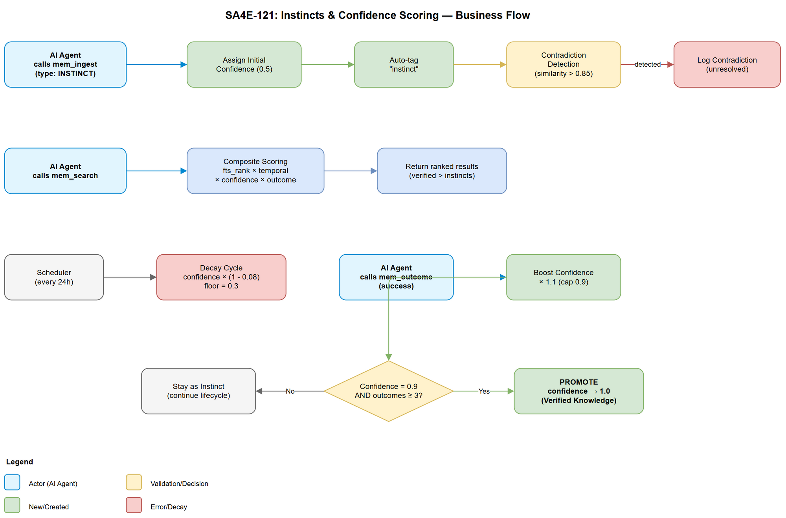
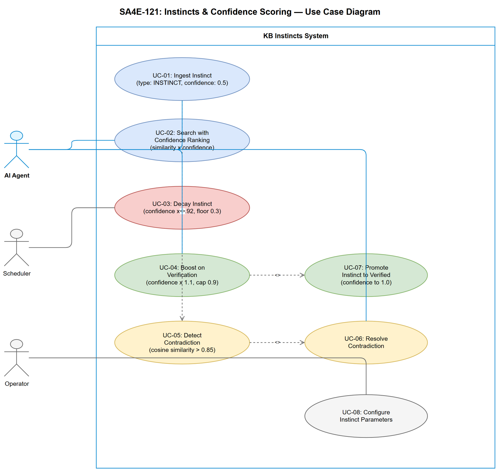

# Business Requirements Document (BRD)

## Code Intelligence KB — SA4E-121: Instincts and Confidence Scoring System

---

## Document Information

| Field | Value |
|-------|-------|
| Jira Ticket | SA4E-121 |
| Title | [KB] Instincts and Confidence Scoring System |
| Epic | SA4E-119 (ECC Feature Parity) |
| Author | BA Agent |
| Version | 1.0 |
| Date | 2025-07-20 |
| Status | Draft |
| Architecture Pattern | ai-agent |

---

## Author Tracking

| Role | Name - Position | Responsibility |
|------|-----------------|----------------|
| Author | BA Agent – Business Analyst | Create document |
| Peer Reviewer | TA Agent – Technical Architect | Review FSD enrichment |

---

## Revision History

| Version | Date | Author | Changes |
|---------|------|--------|---------|
| 1.0 | 2025-07-20 | BA Agent | Initiate document — auto-generated from Jira ticket SA4E-121 |

---

## Sign-Off

| Name | Signature and date |
|------|--------------------|
| | ☐ I agree and confirm all criteria on this BRD as expected requirements |
| | ☐ I agree and confirm all criteria on this BRD as expected requirements |

---

## 1. Introduction

### 1.1 Scope

Implement an ECC-style "instincts" system for the Knowledge Base (KB) module. This feature introduces a confidence scoring mechanism that:

1. Assigns a confidence score (range 0.3–0.9) to KB entries that represent "instincts" — learned patterns and heuristics that have not yet been fully verified
2. Applies time-based decay to reduce confidence of unused/unverified entries
3. Boosts confidence when entries are verified through positive outcomes
4. Detects contradictions between KB entries and resolves them
5. Integrates confidence into `mem_search` ranking via `similarity × confidence` formula

The system builds on existing infrastructure: `knowledge_entries.confidence` field (currently default 1.0), `DecayService` (configurable decay rate), `OutcomeService` (boost on success), and `CompositeScorer` (confidence as multiplier in search ranking).

### 1.2 Out of Scope

- Full ECC emotional model (only confidence/instinct scoring is in scope)
- Changes to the embedding model or vector search algorithm
- UI/frontend for confidence visualization (future ticket)
- Cross-project instinct sharing (follow existing scope isolation)
- Changes to `mem_ingest` API signature (backward compatible)

### 1.3 Preliminary Requirement

- SA4E-119 Epic established (ECC Feature Parity)
- Existing `knowledge_entries.confidence` column (REAL, default 1.0)
- Existing `DecayService` with configurable decay rate and scheduler
- Existing `OutcomeService` with Bayesian outcome factor
- Existing `CompositeScorer` with `ConfidenceStrategy`

---

## 2. Business Requirements

### 2.1 High Level Process Map

The Instincts and Confidence Scoring system operates as a lifecycle around KB entries:

1. **Ingestion** — New "instinct" entries are ingested with initial confidence (0.5 default for instincts vs 1.0 for verified knowledge)
2. **Search Ranking** — `mem_search` applies `similarity × confidence` to rank results, preferring high-confidence entries
3. **Decay** — Unused/unverified instincts decay over time toward the confidence floor (0.3)
4. **Verification/Boost** — When an agent uses an instinct and reports success, confidence is boosted (capped at 0.9 for instincts)
5. **Contradiction Detection** — System detects entries that contradict each other and flags/resolves them
6. **Promotion** — Instincts that consistently receive positive outcomes and reach the confidence ceiling (0.9) are promoted to verified knowledge (confidence → 1.0)

### 2.2 List of User Stories / Use Cases

| # | Story / Use Case | Priority | Source Ticket |
|---|------------------|----------|---------------|
| 1 | As an AI agent, I want to ingest learned patterns as "instincts" with initial confidence so that unverified knowledge is distinguished from verified facts | MUST HAVE | SA4E-121 |
| 2 | As an AI agent, I want `mem_search` to rank results by `similarity × confidence` so that high-confidence entries appear first | MUST HAVE | SA4E-121 |
| 3 | As an AI agent, I want instinct confidence to decay over time when unused so that stale heuristics lose relevance | MUST HAVE | SA4E-121 |
| 4 | As an AI agent, I want instinct confidence to boost when verified (positive outcome) so that validated patterns become more prominent | MUST HAVE | SA4E-121 |
| 5 | As an AI agent, I want the system to detect contradictions between KB entries so that conflicting knowledge is identified and resolved | MUST HAVE | SA4E-121 |
| 6 | As an AI agent, I want instincts that reach the confidence ceiling (0.9) through repeated verification to be promoted to full knowledge entries | SHOULD HAVE | SA4E-121 |
| 7 | As a system operator, I want to configure instinct parameters (initial confidence, decay rate, boost factor, confidence floor/ceiling) so that the system can be tuned per project | SHOULD HAVE | SA4E-121 |

---

### 2.3 Details of User Stories

---

#### Business Flow

**Step 1:** Agent calls `mem_ingest` with `type: "INSTINCT"` or `instinct: true` flag — system assigns initial confidence 0.5

**Step 2:** Agent calls `mem_search` — system retrieves matching entries, applies composite scoring with `similarity × confidence` weighting

**Step 3:** Scheduler runs decay cycle (every 24h) — unaccessed instinct entries lose confidence by decay rate until floor (0.3)

**Step 4:** Agent calls `mem_outcome` with `outcome: "success"` referencing an instinct entry — system boosts confidence by factor (×1.1, capped at 0.9)

**Step 5:** On ingest/update, system runs contradiction detection — compares new entry against existing entries with high semantic similarity but contradictory content

**Step 6:** When instinct reaches confidence 0.9 with ≥3 successful outcomes — system promotes to verified knowledge (confidence → 1.0, type → original type or "VERIFIED")

> **Note:** The confidence range for instincts is 0.3–0.9. Verified knowledge retains confidence 1.0 (unchanged from current behavior). This ensures instincts never outrank verified facts.

---

#### STORY 1: Ingest Instinct Entries

> As an AI agent, I want to ingest learned patterns as "instincts" with initial confidence so that unverified knowledge is distinguished from verified facts

**Requirement Details:**

1. When `mem_ingest` is called with `type: "INSTINCT"` (or `instinct: true` flag), set initial confidence to 0.5 (configurable)
2. Regular KB entries (non-instinct) retain default confidence 1.0 — no behavioral change
3. Instinct entries are tagged with `instinct` tag automatically
4. The confidence field bounds for instincts are [0.3, 0.9] — never below floor, never above ceiling
5. If an entry is explicitly ingested with a custom confidence value within [0.3, 0.9], use that value

**Data Fields:**

| Field | Type | Required | Description | Example |
|-------|------|----------|-------------|---------|
| content | string | Yes | Knowledge content | "When PostgreSQL query is slow, check missing indexes first" |
| type | string | No | Entry type, "INSTINCT" triggers instinct behavior | "INSTINCT" |
| instinct | boolean | No | Explicit flag to mark as instinct | true |
| confidence | number | No | Override initial confidence [0.3–0.9] | 0.6 |
| source | string | No | Origin of the instinct | "agent-learning/SA4E-100" |

**Acceptance Criteria:**

1. GIVEN `mem_ingest` called with `type: "INSTINCT"`, WHEN entry is created, THEN `confidence = 0.5` and tags include "instinct"
2. GIVEN `mem_ingest` called with `instinct: true` and custom confidence 0.7, WHEN entry is created, THEN `confidence = 0.7`
3. GIVEN `mem_ingest` called without instinct flag, WHEN entry is created, THEN `confidence = 1.0` (unchanged behavior)
4. GIVEN confidence value outside [0.3, 0.9] provided for instinct, WHEN entry is created, THEN clamp to valid range and proceed

---

#### STORY 2: Confidence-Weighted Search Ranking

> As an AI agent, I want `mem_search` to rank results by `similarity × confidence` so that high-confidence entries appear first

**Requirement Details:**

1. `mem_search` composite scoring formula must include confidence as a direct multiplier: `final_score = fts_rank × temporal_weight × confidence × outcome_factor`
2. This is already partially implemented via `ConfidenceStrategy` in `CompositeScorer` — the current behavior reads `entry.confidence` directly
3. The enhancement ensures instinct entries (confidence 0.3–0.9) naturally rank below verified entries (confidence 1.0) for the same similarity score
4. No new API parameters needed — the existing behavior is correct; this story validates it works with instinct entries

**Acceptance Criteria:**

1. GIVEN two entries with identical FTS rank, one with confidence 1.0 and one with confidence 0.5, WHEN `mem_search` returns results, THEN the 1.0 entry ranks higher
2. GIVEN an instinct entry with confidence 0.3, WHEN searched alongside a verified entry with same content, THEN verified entry always ranks first
3. GIVEN `mem_search` execution, WHEN results are returned, THEN total scoring overhead (confidence multiplication) adds < 1ms per entry
4. GIVEN 1000 entries mixed instinct/verified, WHEN `mem_search` executes, THEN total additional latency from confidence scoring < 5ms

---

#### STORY 3: Confidence Decay for Instincts

> As an AI agent, I want instinct confidence to decay over time when unused so that stale heuristics lose relevance

**Requirement Details:**

1. Extend existing `DecayService` to support instinct-specific decay parameters
2. Instinct entries decay faster than general entries (configurable `instinct_decay_rate`, default 0.08 vs general 0.05)
3. Decay only applies to entries not accessed within `accessThresholdDays` (configurable, default 14 days for instincts)
4. Decay stops at confidence floor (0.3) — instincts are never fully removed by decay alone
5. Pinned entries are exempt from decay (existing behavior preserved)
6. Decay formula: `new_confidence = MAX(confidence × (1 - instinct_decay_rate), 0.3)`

**Acceptance Criteria:**

1. GIVEN an instinct entry with confidence 0.5 not accessed for 14+ days, WHEN decay cycle runs, THEN confidence decreases to 0.46 (0.5 × 0.92)
2. GIVEN an instinct entry with confidence 0.31, WHEN decay cycle runs, THEN confidence stays at 0.3 (floor)
3. GIVEN a pinned instinct entry, WHEN decay cycle runs, THEN confidence is unchanged
4. GIVEN an instinct entry accessed today, WHEN decay cycle runs, THEN confidence is unchanged (within threshold)
5. GIVEN 500 instinct entries subject to decay, WHEN decay cycle runs, THEN total execution time < 2 seconds

---

#### STORY 4: Confidence Boost on Verification

> As an AI agent, I want instinct confidence to boost when verified (positive outcome) so that validated patterns become more prominent

**Requirement Details:**

1. Extend existing `OutcomeService.boostConfidence()` to respect instinct ceiling (0.9)
2. On `mem_outcome` with `outcome: "success"` for an instinct entry, multiply confidence by boost factor (1.1, configurable)
3. Boost is capped at instinct ceiling: `new_confidence = MIN(confidence × 1.1, 0.9)`
4. Partial outcomes (`outcome: "partial"`) give half boost: `confidence × 1.05`
5. Failed outcomes (`outcome: "fail"`) reduce confidence: `confidence × 0.9` (floor-bounded at 0.3)

**Acceptance Criteria:**

1. GIVEN instinct entry with confidence 0.5, WHEN `mem_outcome(outcome: "success")` called, THEN confidence → 0.55
2. GIVEN instinct entry with confidence 0.85, WHEN `mem_outcome(outcome: "success")` called, THEN confidence → 0.9 (capped)
3. GIVEN instinct entry with confidence 0.5, WHEN `mem_outcome(outcome: "fail")` called, THEN confidence → 0.45
4. GIVEN instinct entry with confidence 0.32, WHEN `mem_outcome(outcome: "fail")` called, THEN confidence → 0.3 (floor)
5. GIVEN verified entry (confidence 1.0), WHEN `mem_outcome(outcome: "success")` called, THEN confidence stays 1.0 (existing behavior)

---

#### STORY 5: Contradiction Detection

> As an AI agent, I want the system to detect contradictions between KB entries so that conflicting knowledge is identified and resolved

**Requirement Details:**

1. On `mem_ingest` of a new entry, check for semantic similarity > 0.85 with existing entries
2. If high similarity is found, perform contradiction analysis:
   - Same topic + contradictory assertions = CONTRADICTION
   - Same topic + complementary information = SUPPLEMENT (no action)
   - Same topic + newer information = SUPERSEDE (mark old as superseded)
3. Contradictions are logged in `contradiction_log` table with both entry IDs, similarity score, and resolution status
4. When contradiction is detected, the newer entry's confidence is reduced by 0.1 (penalty for unresolved conflict)
5. Agent is notified in `mem_search` results if returned entries have unresolved contradictions
6. Resolution options: `resolve_keep_new`, `resolve_keep_old`, `resolve_merge`, `resolve_both`

**Data Fields:**

| Field | Type | Required | Description | Example |
|-------|------|----------|-------------|---------|
| entry_id_a | integer | Yes | First (existing) entry | 42 |
| entry_id_b | integer | Yes | Second (new) entry | 105 |
| similarity | real | Yes | Cosine similarity score | 0.92 |
| status | string | Yes | Resolution status | "unresolved" |
| resolution | string | No | How it was resolved | "resolve_keep_new" |
| detected_at | text | Yes | ISO timestamp | "2025-07-20T10:00:00Z" |

**Acceptance Criteria:**

1. GIVEN a new entry ingested with >0.85 similarity to existing entry AND contradictory content, WHEN ingest completes, THEN contradiction is logged with status "unresolved"
2. GIVEN a contradiction exists, WHEN `mem_search` returns one of the contradicting entries, THEN result includes contradiction warning
3. GIVEN a contradiction is resolved via `mem_verify(action: "resolve", resolution: "resolve_keep_new")`, WHEN the old entry is searched, THEN it is marked superseded
4. GIVEN contradiction detection runs, WHEN processing a single entry against existing KB, THEN detection time < 50ms (vector comparison only)
5. GIVEN embeddings are not available, WHEN ingest occurs, THEN contradiction detection is gracefully skipped (no error)

---

#### STORY 6: Instinct Promotion to Verified Knowledge

> As an AI agent, I want instincts that reach the confidence ceiling through repeated verification to be promoted to full knowledge entries

**Requirement Details:**

1. When an instinct entry reaches confidence 0.9 AND has ≥3 successful outcomes, auto-promote
2. Promotion changes: `confidence → 1.0`, remove "instinct" tag, add "promoted" tag, update `type` if originally "INSTINCT" → preserve content type
3. Log promotion event in `memory_audit` table
4. Promotion is irreversible — once promoted, entry follows standard knowledge lifecycle (decay from 1.0 with general rate)
5. Optional: agent can manually promote via `mem_verify(action: "promote", entry_id: N)`

**Acceptance Criteria:**

1. GIVEN instinct with confidence 0.9 and 3 successful outcomes, WHEN next successful outcome is recorded, THEN entry is promoted (confidence → 1.0)
2. GIVEN instinct with confidence 0.9 but only 2 outcomes, WHEN outcome recorded, THEN confidence stays 0.9 (not promoted yet)
3. GIVEN promoted entry, WHEN searched, THEN it ranks alongside other verified entries (confidence 1.0)
4. GIVEN promotion occurs, WHEN audit log is queried, THEN promotion event is recorded with entry_id, from_confidence, to_confidence

---

#### STORY 7: Configurable Instinct Parameters

> As a system operator, I want to configure instinct parameters so that the system can be tuned per project

**Requirement Details:**

1. Extend existing `decay_config` table with instinct-specific keys
2. Configurable via `mem_configure_decay(action: "set_config")` with new fields
3. Configuration parameters:

| Parameter | Default | Description |
|-----------|---------|-------------|
| instinct_initial_confidence | 0.5 | Starting confidence for new instincts |
| instinct_confidence_floor | 0.3 | Minimum confidence (decay stops here) |
| instinct_confidence_ceiling | 0.9 | Maximum confidence for instincts |
| instinct_decay_rate | 0.08 | Decay rate per cycle for instincts |
| instinct_boost_factor | 1.1 | Multiplier on success |
| instinct_fail_factor | 0.9 | Multiplier on failure |
| instinct_access_threshold_days | 14 | Days without access before decay starts |
| instinct_promotion_threshold | 3 | Min successful outcomes for promotion |
| contradiction_similarity_threshold | 0.85 | Cosine similarity threshold for contradiction detection |

**Acceptance Criteria:**

1. GIVEN `mem_configure_decay(action: "set_config", instinct_decay_rate: 0.1)`, WHEN next decay cycle runs, THEN instincts decay at 0.1 rate
2. GIVEN `mem_configure_decay(action: "get_config")`, WHEN called, THEN response includes all instinct parameters with current values
3. GIVEN invalid config value (e.g., `instinct_confidence_floor: 1.5`), WHEN set_config called, THEN validation error returned

---

## 3. Dependencies

| Dependency | Type | Related Ticket | Description |
|------------|------|----------------|-------------|
| knowledge_entries.confidence column | System | Existing | Already exists (REAL, default 1.0) — reused |
| DecayService | System | SA4E-53 | Existing decay mechanism — extended for instinct-specific rates |
| OutcomeService | System | SA4E-53 | Existing outcome/boost mechanism — extended with ceiling cap |
| CompositeScorer + ConfidenceStrategy | System | Existing | Already multiplies confidence into search score — validated |
| knowledge_vectors table | System | Existing | Required for contradiction detection (cosine similarity) |
| Local embeddings (ONNX) | System | Existing | Required for computing vectors for contradiction detection |
| mem_search tool | System | Existing | Search tool that integrates confidence scoring |
| mem_ingest tool | System | Existing | Ingest tool extended with instinct flag |
| mem_outcome tool | System | Existing | Outcome tool extended with instinct boost/decay |
| mem_configure_decay tool | System | Existing | Config tool extended with instinct parameters |
| mem_verify tool | System | Existing | Verify tool extended with contradiction resolution and promotion |

---

## 4. Stakeholders

| Role | Name / Team | Responsibility | Source |
|------|-------------|----------------|--------|
| Product Owner | Engineering Lead | Define acceptance criteria | Jira ticket creator |
| Developer | DEV Agent | Implementation | Assigned |
| Solution Architect | SA Agent | Technical design | TDD author |
| QA | QA Agent | Test planning and execution | Verification |

---

## 5. Risks and Assumptions

### 5.1 Risks

| Risk | Impact | Likelihood | Mitigation |
|------|--------|------------|------------|
| Contradiction detection performance with large KB (>100k entries) | Medium | Medium | Limit comparison to top-N nearest vectors; index on embeddings |
| Instinct decay too aggressive — valid patterns lost | Medium | Low | Configurable parameters; floor prevents full removal; audit log for recovery |
| Boost factor too generous — unverified instincts dominate search | Medium | Low | Cap at 0.9; verified entries always rank higher at 1.0 |
| Embedding unavailability blocks contradiction detection | Low | Low | Graceful degradation — skip contradiction detection when embeddings unavailable |
| Backward compatibility — existing entries disrupted | High | Low | Default confidence 1.0 unchanged; instinct system is opt-in via type/flag |

### 5.2 Assumptions

- Existing `confidence` column (default 1.0) is correct for all current entries — no migration needed for existing data
- The existing `CompositeScorer` formula `fts_rank × temporal_weight × confidence × outcome_factor` is the correct place to apply instinct confidence
- Local ONNX embeddings are available for contradiction detection (vector comparison)
- The 24-hour decay scheduler interval is appropriate for instincts (may be configurable in future)
- Instinct entries are created programmatically by agents, not manually by users

---

## 6. Non-Functional Requirements

| Category | Requirement | Details |
|----------|-------------|---------|
| Performance | Search latency overhead < 5ms | Confidence multiplication per entry must not add more than 5ms total to `mem_search` for up to 1000 entries |
| Performance | Decay cycle < 5 seconds | Full decay cycle processing all instinct entries must complete within 5 seconds for up to 10,000 instinct entries |
| Performance | Contradiction detection < 50ms per entry | Single entry contradiction check against existing KB vectors must complete within 50ms |
| Scalability | Support up to 10,000 instinct entries per project | System must handle this volume without degradation |
| Reliability | Graceful degradation | If embeddings unavailable, contradiction detection is skipped; other features continue |
| Backward Compatibility | Zero impact on existing entries | Entries without instinct flag behave exactly as before (confidence 1.0, standard decay) |
| Data Integrity | Confidence bounds enforced | Database constraint or application-level validation ensures confidence never leaves [0.0, 1.0] range |
| Observability | Audit logging | All confidence changes (decay, boost, promotion) logged in memory_audit |
| Security | No new attack surface | Instinct parameters validated via Zod schemas; no new API endpoints exposed externally |

---

## 7. Related Tickets

| Ticket Key | Summary | Status | Type | Relationship |
|------------|---------|--------|------|--------------|
| SA4E-121 | [KB] Instincts and Confidence Scoring System | To Do | Story | Main ticket |
| SA4E-119 | ECC Feature Parity | In Progress | Epic | Parent epic |
| SA4E-53 | Evolution module (decay, outcome, epochs) | Done | Story | Foundation — provides DecayService, OutcomeService |

---

## 8. Appendix

### Use Cases

| UC-ID | Use Case | Actor | Description |
|-------|----------|-------|-------------|
| UC-01 | Ingest Instinct | AI Agent | Create KB entry with instinct type and initial confidence |
| UC-02 | Search with Confidence | AI Agent | Retrieve results ranked by similarity × confidence |
| UC-03 | Decay Instinct | Scheduler | Reduce confidence of unused instinct entries |
| UC-04 | Boost on Verification | AI Agent | Increase confidence after successful outcome |
| UC-05 | Detect Contradiction | System | Identify conflicting entries on ingest |
| UC-06 | Resolve Contradiction | AI Agent | Choose resolution strategy for conflicting entries |
| UC-07 | Promote Instinct | System/Agent | Upgrade validated instinct to verified knowledge |
| UC-08 | Configure Parameters | Operator | Adjust instinct scoring parameters |

### Glossary

| Term | Definition |
|------|------------|
| Instinct | A learned heuristic or pattern stored in KB with reduced confidence (0.3–0.9), indicating it has not been fully verified |
| Confidence Score | A real number [0.0–1.0] representing the system's trust in a KB entry. For instincts: [0.3–0.9]; for verified knowledge: 1.0 |
| Confidence Floor | The minimum confidence value an instinct can decay to (default 0.3). Prevents automatic deletion via decay |
| Confidence Ceiling | The maximum confidence an instinct can reach via boost (default 0.9). Exceeding triggers promotion |
| Decay | Time-based reduction of confidence for entries not recently accessed or verified |
| Boost | Confidence increase triggered by a positive outcome (`mem_outcome success`) |
| Contradiction | Two KB entries with high semantic similarity (>0.85) but contradictory assertions |
| Promotion | The transition of an instinct entry to verified knowledge (confidence 0.9 → 1.0) after meeting outcome thresholds |
| Composite Score | The final search ranking score: `fts_rank × temporal_weight × confidence × outcome_factor × predictive_boost` |

### Diagram Index

| # | Diagram | Image | Source (editable) |
|---|---------|-------|-------------------|
| 1 | Business Flow | [business-flow.png](diagrams/business-flow.png) | [business-flow.drawio](diagrams/business-flow.drawio) |
| 2 | Use Case | [use-case.png](diagrams/use-case.png) | [use-case.drawio](diagrams/use-case.drawio) |

### Reference Documents

| Document | Link / Location |
|----------|-----------------|
| DecayService source | backend/src/modules/memory/evolution/DecayService.ts |
| OutcomeService source | backend/src/modules/memory/evolution/OutcomeService.ts |
| CompositeScorer source | backend/src/modules/memory/evolution/CompositeScorer.ts |
| ConfidenceStrategy source | backend/src/modules/memory/evolution/strategies/ConfidenceStrategy.ts |
| knowledge_entries schema | backend/src/modules/memory/schema/tables.ts |
| mem_search dispatcher | backend/src/modules/memory/dispatchers/search.ts |
