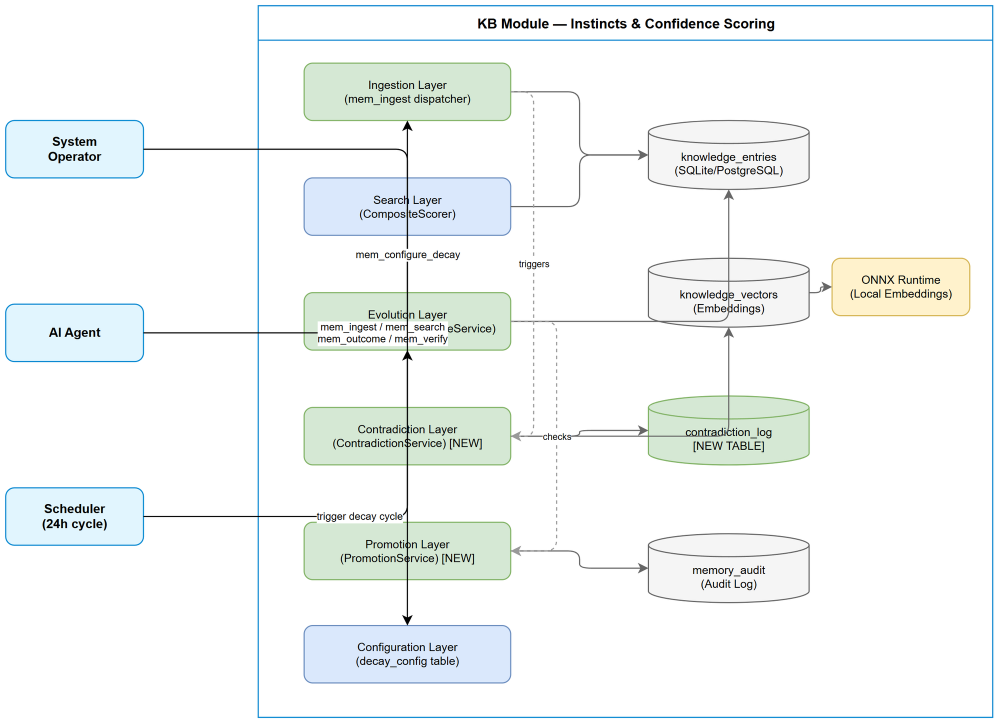
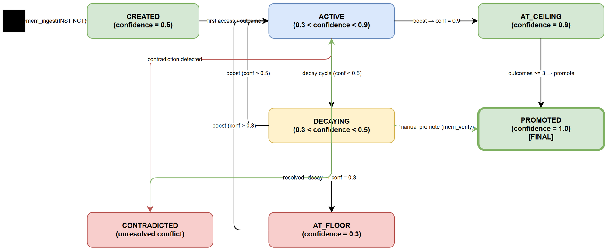
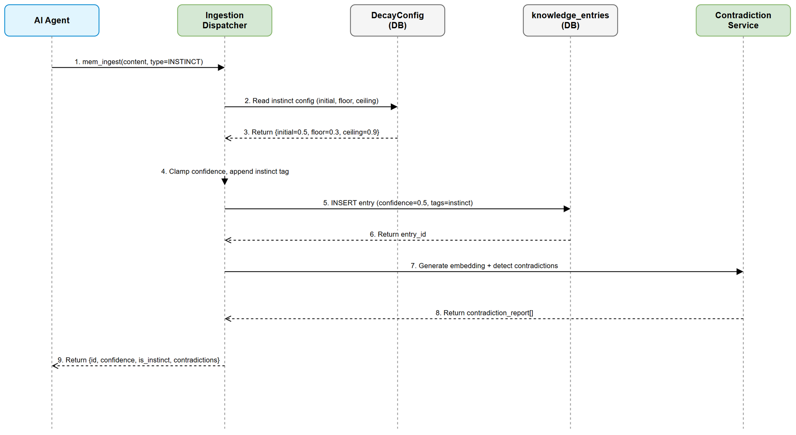
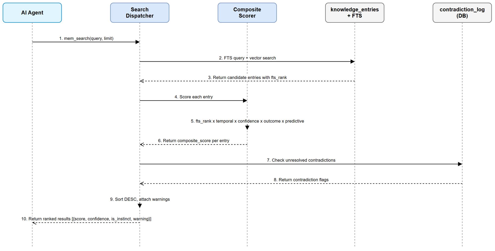

# Functional Specification Document (FSD)

## Code Intelligence KB — SA4E-121: Instincts and Confidence Scoring System

---

## Document Information

| Field | Value |
|-------|-------|
| Jira Ticket | SA4E-121 |
| Title | [KB] Instincts and Confidence Scoring System |
| Epic | SA4E-119 (ECC Feature Parity) |
| Author | BA Agent |
| Version | 1.0 |
| Date | 2025-07-20 |
| Status | Draft |
| Related BRD | documents/SA4E-121/BRD.md |
| Architecture Pattern | ai-agent |

---

## Revision History

| Version | Date | Author | Changes |
|---------|------|--------|---------|
| 1.0 | 2025-07-20 | BA Agent | Initial FSD — translated from BRD v1.0 |

---

## 1. Introduction

### 1.1 Purpose

This FSD translates the business requirements from BRD SA4E-121 into detailed functional specifications for the Instincts and Confidence Scoring System. It defines use cases, business rules, data models, API contracts, and processing logic that developers need to implement the feature.

### 1.2 Scope

Implement an ECC-style "instincts" system for the Knowledge Base module that:

1. Assigns confidence scores (0.3–0.9) to instinct entries, distinct from verified knowledge (1.0)
2. Applies configurable time-based decay to unused instincts
3. Boosts confidence on positive outcome verification
4. Detects and resolves contradictions between KB entries
5. Promotes validated instincts to verified knowledge
6. Exposes configurable parameters for system tuning

### 1.3 Definitions & Acronyms

| Term | Definition |
|------|------------|
| Instinct | A learned heuristic/pattern stored in KB with confidence [0.3–0.9], not yet fully verified |
| Confidence Score | Real number [0.0–1.0] representing trust level. Instincts: [0.3–0.9]; Verified: 1.0 |
| Confidence Floor | Minimum confidence an instinct can decay to (default 0.3) |
| Confidence Ceiling | Maximum confidence an instinct can reach via boost (default 0.9) |
| Decay | Time-based confidence reduction for entries not recently accessed |
| Boost | Confidence increase triggered by positive outcome |
| Contradiction | Two entries with similarity >0.85 but contradictory assertions |
| Promotion | Transition from instinct (0.9) to verified knowledge (1.0) |
| Composite Score | Final search ranking: `fts_rank × temporal_weight × confidence × outcome_factor × predictive_boost` |

### 1.4 References

| Document | Location |
|----------|----------|
| BRD | documents/SA4E-121/BRD.md |
| DecayService | backend/src/modules/memory/evolution/DecayService.ts |
| OutcomeService | backend/src/modules/memory/evolution/OutcomeService.ts |
| CompositeScorer | backend/src/modules/memory/evolution/CompositeScorer.ts |
| ConfidenceStrategy | backend/src/modules/memory/evolution/strategies/ConfidenceStrategy.ts |
| Schema (tables) | backend/src/modules/memory/schema/tables.ts |

---

## 2. System Overview

### 2.1 System Context Diagram

The Instincts and Confidence Scoring System operates within the existing KB module. External actors (AI Agents) interact via MCP tools (`mem_ingest`, `mem_search`, `mem_outcome`, `mem_verify`). The Scheduler triggers decay cycles. The system uses local ONNX embeddings for contradiction detection via vector similarity.

### 2.2 System Architecture

The feature extends existing KB infrastructure:

- **Ingestion Layer** — Extended `mem_ingest` dispatcher to detect instinct type and set initial confidence
- **Search Layer** — Existing `CompositeScorer` with `ConfidenceStrategy` already multiplies confidence into rankings
- **Evolution Layer** — Extended `DecayService` for instinct-specific decay rates; extended `OutcomeService` for ceiling-bounded boost
- **Contradiction Layer** — New `ContradictionService` using vector similarity from `knowledge_vectors`
- **Promotion Layer** — New `PromotionService` checking confidence + outcome thresholds
- **Configuration Layer** — Extended `decay_config` table with instinct parameters

---

## 3. Functional Requirements

### 3.1 Feature: Ingest Instinct Entries

**Source:** BRD Story 1

#### 3.1.1 Description

Enable AI agents to ingest learned patterns as "instincts" — KB entries with reduced initial confidence (default 0.5) that distinguishes them from verified knowledge (confidence 1.0). Instinct entries are automatically tagged and bounded within [0.3, 0.9].

#### 3.1.2 Use Case

**Use Case ID:** UC-01
**Use Case Name:** Ingest Instinct
**Actor:** AI Agent
**Preconditions:** KB module initialized; project context available
**Postconditions:** New KB entry created with instinct confidence and tags

**Main Flow:**

| Step | Actor | System | Description |
|------|-------|--------|-------------|
| 1 | Agent calls `mem_ingest` with `type: "INSTINCT"` or `instinct: true` | | Agent provides content, optional confidence override |
| 2 | | Validates input via Zod schema | Check content, type, confidence bounds |
| 3 | | Determines initial confidence | If no override: use `instinct_initial_confidence` (0.5). If override: clamp to [floor, ceiling] |
| 4 | | Appends "instinct" to tags | Ensures entry is identifiable as instinct |
| 5 | | Creates KB entry with computed confidence | Inserts into `knowledge_entries` |
| 6 | | Generates embedding vector | Stores in `knowledge_vectors` for contradiction detection |
| 7 | | Runs contradiction detection (UC-05) | Async check against existing entries |
| 8 | | Returns entry ID and confidence | Response to agent |

**Alternative Flows:**

| ID | Condition | Steps |
|----|-----------|-------|
| AF-01 | Agent provides custom confidence within [0.3, 0.9] | Step 3: Use provided value directly |
| AF-02 | Agent provides `instinct: true` flag without `type: "INSTINCT"` | Step 3: Treat as instinct, preserve original type value, apply instinct confidence |
| AF-03 | Entry is non-instinct (no flag, no INSTINCT type) | Step 3: Use default confidence 1.0; skip tag append; no instinct-specific behavior |

**Exception Flows:**

| ID | Condition | Steps |
|----|-----------|-------|
| EF-01 | Confidence override outside [0.3, 0.9] for instinct | Clamp value: `MAX(floor, MIN(ceiling, value))`. Log warning. Proceed. |
| EF-02 | Content is empty or invalid | Return validation error: `INVALID_CONTENT` |
| EF-03 | Embedding generation fails | Log error; skip contradiction detection; entry created without vector. Return success with warning. |

---

### 3.2 Feature: Confidence-Weighted Search Ranking

**Source:** BRD Story 2

#### 3.2.1 Description

Search results are ranked by composite scoring that includes confidence as a direct multiplier. This ensures instinct entries (0.3–0.9) naturally rank below verified entries (1.0) for equivalent similarity scores.

#### 3.2.2 Use Case

**Use Case ID:** UC-02
**Use Case Name:** Search with Confidence Ranking
**Actor:** AI Agent
**Preconditions:** KB contains entries (mix of instincts and verified); `CompositeScorer` initialized
**Postconditions:** Results returned ranked by `similarity × confidence` composite

**Main Flow:**

| Step | Actor | System | Description |
|------|-------|--------|-------------|
| 1 | Agent calls `mem_search` with query | | Standard search request |
| 2 | | Executes FTS/vector search | Retrieves candidate entries |
| 3 | | Applies CompositeScorer to each entry | Calculates: `fts_rank × temporal_weight × confidence × outcome_factor × predictive_boost` |
| 4 | | Sorts results by composite score DESC | Higher confidence → higher rank |
| 5 | | Attaches contradiction warnings | If any result has unresolved contradictions, add warning to metadata |
| 6 | | Returns ranked results with score breakdown | Includes confidence value per entry |

**Alternative Flows:**

| ID | Condition | Steps |
|----|-----------|-------|
| AF-01 | Query matches only instinct entries | Return instinct entries ranked by their relative confidence × similarity |
| AF-02 | No results found | Return empty results array |

**Exception Flows:**

| ID | Condition | Steps |
|----|-----------|-------|
| EF-01 | CompositeScorer strategy throws | Gracefully skip failed strategy; continue with remaining strategies |
| EF-02 | Database timeout during scoring | Return partial results with warning flag |

---

### 3.3 Feature: Confidence Decay for Instincts

**Source:** BRD Story 3

#### 3.3.1 Description

Extend `DecayService` to support instinct-specific decay parameters. Instinct entries that haven't been accessed within a threshold period (default 14 days) decay faster (0.08 rate) toward the confidence floor (0.3).

#### 3.3.2 Use Case

**Use Case ID:** UC-03
**Use Case Name:** Decay Instinct Confidence
**Actor:** Scheduler (24h cycle)
**Preconditions:** `DecayService` configured; instinct entries exist with confidence > floor
**Postconditions:** Eligible instinct entries have reduced confidence; audit records created

**Main Flow:**

| Step | Actor | System | Description |
|------|-------|--------|-------------|
| 1 | Scheduler triggers decay cycle | | Every 24 hours (configurable) |
| 2 | | Reads instinct decay config from `decay_config` | Gets `instinct_decay_rate`, `instinct_access_threshold_days`, `instinct_confidence_floor` |
| 3 | | Fetches eligible instinct entries | WHERE: is instinct AND `pinned = 0` AND `confidence > floor` AND `last_accessed_at < threshold` |
| 4 | | Applies decay formula per entry | `new_confidence = MAX(confidence × (1 - instinct_decay_rate), floor)` |
| 5 | | Updates confidence in `knowledge_entries` | Batch UPDATE |
| 6 | | Logs decay events in `memory_audit` | Records entry_id, old_confidence, new_confidence |
| 7 | | Returns cycle result | `{decayed_count, duration_ms, skipped_pinned}` |

**Alternative Flows:**

| ID | Condition | Steps |
|----|-----------|-------|
| AF-01 | No instinct entries eligible for decay | Return `{decayed_count: 0}` |
| AF-02 | Entry already at floor (0.3) | Skip entry, do not update |
| AF-03 | Non-instinct entries in same cycle | Apply standard decay rate (0.05) with standard threshold (60 days) |

**Exception Flows:**

| ID | Condition | Steps |
|----|-----------|-------|
| EF-01 | Decay cycle already running | Throw `JOB_IN_PROGRESS`; skip |
| EF-02 | Database batch update fails | Log error; return partial result with count of successfully decayed |

---

### 3.4 Feature: Confidence Boost on Verification

**Source:** BRD Story 4

#### 3.4.1 Description

When an agent reports a successful outcome for an instinct entry via `mem_outcome`, the system boosts confidence (×1.1) capped at the instinct ceiling (0.9). Failed outcomes reduce confidence (×0.9) bounded at the floor (0.3).

#### 3.4.2 Use Case

**Use Case ID:** UC-04
**Use Case Name:** Boost on Verification
**Actor:** AI Agent
**Preconditions:** Instinct entry exists; outcome reported
**Postconditions:** Confidence updated; promotion checked (UC-07)

**Main Flow:**

| Step | Actor | System | Description |
|------|-------|--------|-------------|
| 1 | Agent calls `mem_outcome` with entry_id and outcome | | outcome: "success" / "partial" / "fail" |
| 2 | | Validates entry exists and outcome is valid | Check entry_id in DB; check outcome enum |
| 3 | | Records outcome in `entry_outcomes` table | Standard outcome recording |
| 4 | | Determines entry is instinct | Check type = "INSTINCT" or tags contain "instinct" |
| 5 | | Applies instinct-specific boost/penalty | Success: `MIN(confidence × boost_factor, ceiling)`. Fail: `MAX(confidence × fail_factor, floor)`. Partial: `MIN(confidence × 1.05, ceiling)` |
| 6 | | Updates confidence in `knowledge_entries` | Write new confidence |
| 7 | | Logs confidence change in `memory_audit` | Records operation, entry_id, details |
| 8 | | Checks promotion criteria (UC-07) | If confidence >= 0.9 AND outcomes >= threshold |
| 9 | | Returns result | `{recorded, new_confidence, new_outcome_factor, promoted}` |

**Alternative Flows:**

| ID | Condition | Steps |
|----|-----------|-------|
| AF-01 | Entry is verified knowledge (confidence 1.0) | Step 5: Apply existing behavior — cap at 1.0. No instinct-specific logic. |
| AF-02 | Boost would exceed ceiling (0.9) | Step 5: Clamp to 0.9. Check promotion. |
| AF-03 | Fail would go below floor (0.3) | Step 5: Clamp to 0.3. |

**Exception Flows:**

| ID | Condition | Steps |
|----|-----------|-------|
| EF-01 | Entry not found | Return error: `ENTRY_NOT_FOUND` |
| EF-02 | Invalid outcome value | Return error: `INVALID_OUTCOME` |

---

### 3.5 Feature: Contradiction Detection

**Source:** BRD Story 5

#### 3.5.1 Description

On ingestion of a new entry, the system checks for semantic similarity > 0.85 with existing entries. High-similarity entries are analyzed for contradiction, supplementation, or supersession. Contradictions are logged and flagged in search results.

#### 3.5.2 Use Case

**Use Case ID:** UC-05
**Use Case Name:** Detect Contradiction
**Actor:** System (triggered by ingestion)
**Preconditions:** New entry has embedding vector; existing entries with vectors exist
**Postconditions:** Contradictions logged; new entry confidence penalized if contradiction found

**Main Flow:**

| Step | Actor | System | Description |
|------|-------|--------|-------------|
| 1 | System triggers after `mem_ingest` completes | | New entry has vector in `knowledge_vectors` |
| 2 | | Computes cosine similarity against existing vectors | Find entries with similarity > `contradiction_similarity_threshold` (0.85) |
| 3 | | For each high-similarity match, classify relationship | CONTRADICTION / SUPPLEMENT / SUPERSEDE |
| 4 | | If CONTRADICTION: log to `contradiction_log` | entry_id_a, entry_id_b, similarity, status="unresolved" |
| 5 | | Reduce new entry confidence by 0.1 | Penalty for unresolved conflict; bounded by floor |
| 6 | | If SUPERSEDE: mark old entry as superseded | Set superseded relationship on old entry |
| 7 | | If SUPPLEMENT: no action | Complementary info, no conflict |
| 8 | | Return contradiction report | List of detected contradictions (if any) |

**Alternative Flows:**

| ID | Condition | Steps |
|----|-----------|-------|
| AF-01 | No entries exceed similarity threshold | No contradictions detected; return empty report |
| AF-02 | Multiple contradictions found | Log all; apply penalty once (not stacked) |
| AF-03 | Entry is a SUPPLEMENT | No action; log as supplement for audit |

**Exception Flows:**

| ID | Condition | Steps |
|----|-----------|-------|
| EF-01 | Embeddings unavailable (ONNX model not loaded) | Skip contradiction detection entirely; log warning; entry created normally |
| EF-02 | Vector comparison timeout (>50ms per entry) | Abort remaining comparisons; log partial result |

---

### 3.6 Feature: Resolve Contradiction

**Source:** BRD Story 5 (resolution workflow)

#### 3.6.1 Description

Agents can resolve detected contradictions via `mem_verify` with a resolution strategy. Resolution updates the contradiction log and may supersede or merge entries.

#### 3.6.2 Use Case

**Use Case ID:** UC-06
**Use Case Name:** Resolve Contradiction
**Actor:** AI Agent
**Preconditions:** Unresolved contradiction exists in `contradiction_log`
**Postconditions:** Contradiction resolved; affected entries updated

**Main Flow:**

| Step | Actor | System | Description |
|------|-------|--------|-------------|
| 1 | Agent calls `mem_verify` with `action: "resolve"` | | Provides contradiction_id or entry_ids, resolution strategy |
| 2 | | Validates contradiction exists and is unresolved | Look up in `contradiction_log` |
| 3 | | Applies resolution strategy | See BR-11 for strategies |
| 4 | | Updates `contradiction_log.status` to "resolved" | Records resolution type and timestamp |
| 5 | | Updates affected entries | Depending on strategy: archive, merge, or keep |
| 6 | | Removes confidence penalty from winning entry | Restore 0.1 penalty if applicable |
| 7 | | Logs resolution in `memory_audit` | Full audit trail |
| 8 | | Returns resolution result | `{resolved: true, strategy, affected_entries}` |

**Alternative Flows:**

| ID | Condition | Steps |
|----|-----------|-------|
| AF-01 | `resolve_keep_new` — new entry wins | Mark old entry as superseded; restore new entry confidence |
| AF-02 | `resolve_keep_old` — old entry wins | Archive or reduce confidence of new entry |
| AF-03 | `resolve_merge` — combine entries | Merge content; keep higher confidence; archive originals |
| AF-04 | `resolve_both` — both valid | Mark contradiction as "accepted"; remove penalty from both |

**Exception Flows:**

| ID | Condition | Steps |
|----|-----------|-------|
| EF-01 | Contradiction already resolved | Return error: `ALREADY_RESOLVED` |
| EF-02 | Invalid resolution strategy | Return error: `INVALID_RESOLUTION` |
| EF-03 | Referenced entry no longer exists | Return error: `ENTRY_NOT_FOUND`; auto-resolve contradiction as stale |

---

### 3.7 Feature: Instinct Promotion to Verified Knowledge

**Source:** BRD Story 6

#### 3.7.1 Description

When an instinct entry reaches confidence 0.9 AND has >= 3 successful outcomes, it is automatically promoted to verified knowledge (confidence = 1.0). Promotion is irreversible.

#### 3.7.2 Use Case

**Use Case ID:** UC-07
**Use Case Name:** Promote Instinct
**Actor:** System (triggered by UC-04) / AI Agent (manual)
**Preconditions:** Instinct entry with confidence >= 0.9; successful outcomes >= `instinct_promotion_threshold`
**Postconditions:** Entry promoted to verified knowledge; confidence = 1.0

**Main Flow:**

| Step | Actor | System | Description |
|------|-------|--------|-------------|
| 1 | System checks promotion criteria after outcome recording | | OR: Agent calls `mem_verify(action: "promote", entry_id: N)` |
| 2 | | Validates: confidence >= ceiling AND successes >= threshold | Query `entry_outcomes` for success count |
| 3 | | Updates confidence to 1.0 | `UPDATE knowledge_entries SET confidence = 1.0` |
| 4 | | Removes "instinct" tag; adds "promoted" tag | Tag management |
| 5 | | If type was "INSTINCT", update to "KNOWLEDGE" | Preserve content semantics |
| 6 | | Logs promotion in `memory_audit` | `{operation: "promote", entry_id, from_confidence, to_confidence}` |
| 7 | | Returns promotion result | `{promoted: true, entry_id, new_confidence: 1.0}` |

**Alternative Flows:**

| ID | Condition | Steps |
|----|-----------|-------|
| AF-01 | Manual promotion via `mem_verify` | Skip criteria check; promote immediately if agent has authority |
| AF-02 | Entry already promoted (confidence = 1.0) | Return `{promoted: false, reason: "already_verified"}` |

**Exception Flows:**

| ID | Condition | Steps |
|----|-----------|-------|
| EF-01 | Criteria not met (confidence < 0.9 or outcomes < threshold) | Return `{promoted: false, reason: "criteria_not_met", current_confidence, current_outcomes}` |
| EF-02 | Entry not found | Return error: `ENTRY_NOT_FOUND` |

---

### 3.8 Feature: Configure Instinct Parameters

**Source:** BRD Story 7

#### 3.8.1 Description

Extend the existing `mem_configure_decay` tool to support instinct-specific configuration parameters. All 9 instinct parameters are stored in `decay_config` and configurable per project.

#### 3.8.2 Use Case

**Use Case ID:** UC-08
**Use Case Name:** Configure Parameters
**Actor:** System Operator / AI Agent
**Preconditions:** `decay_config` table exists with instinct keys seeded
**Postconditions:** Configuration updated; next cycle uses new values

**Main Flow:**

| Step | Actor | System | Description |
|------|-------|--------|-------------|
| 1 | Operator calls `mem_configure_decay` with `action: "set_config"` | | Provides one or more instinct parameters |
| 2 | | Validates parameter values via Zod schema | Type check, range check |
| 3 | | Updates `decay_config` table for each provided key | UPSERT with `updated_at` timestamp |
| 4 | | Returns updated full configuration | All current parameter values |

**Alternative Flows:**

| ID | Condition | Steps |
|----|-----------|-------|
| AF-01 | `action: "get_config"` | Read all decay_config rows; return as structured object |
| AF-02 | Partial update (only some parameters provided) | Update only provided keys; return full config |

**Exception Flows:**

| ID | Condition | Steps |
|----|-----------|-------|
| EF-01 | Invalid parameter value (out of range) | Return validation error with field name and allowed range |
| EF-02 | Unknown parameter key | Ignore unknown keys; return warning in response |

---

## 4. Business Rules

| Rule ID | Rule | Source | Enforcement |
|---------|------|--------|-------------|
| BR-01 | Instinct confidence range is [0.3, 0.9]. Values outside this range for instincts MUST be clamped. | BRD Story 1 | Application-level validation + Zod schema |
| BR-02 | Verified knowledge confidence is always 1.0. Non-instinct entries default to 1.0 with no change. | BRD Story 1 | Default column value |
| BR-03 | Instinct initial confidence = `instinct_initial_confidence` (default 0.5) when no override provided. | BRD Story 1 | Ingestion dispatcher |
| BR-04 | Composite search score formula: `fts_rank × temporal_weight × confidence × outcome_factor × predictive_boost × supersede_factor` | BRD Story 2 | CompositeScorer |
| BR-05 | Instinct decay formula: `new_confidence = MAX(confidence × (1 - instinct_decay_rate), instinct_confidence_floor)` | BRD Story 3 | DecayService |
| BR-06 | Decay applies only to entries not accessed within `instinct_access_threshold_days` (default 14). Pinned entries exempt. | BRD Story 3 | DecayService fetch query |
| BR-07 | Boost on success: `MIN(confidence × instinct_boost_factor, instinct_confidence_ceiling)`. Boost on partial: `MIN(confidence × 1.05, ceiling)`. | BRD Story 4 | OutcomeService |
| BR-08 | Penalty on failure: `MAX(confidence × instinct_fail_factor, instinct_confidence_floor)` | BRD Story 4 | OutcomeService |
| BR-09 | Contradiction detection threshold: cosine similarity > `contradiction_similarity_threshold` (default 0.85) | BRD Story 5 | ContradictionService |
| BR-10 | Contradiction penalty: reduce new entry confidence by 0.1 (bounded by floor). Applied once regardless of number of contradictions. | BRD Story 5 | ContradictionService |
| BR-11 | Resolution strategies: `resolve_keep_new`, `resolve_keep_old`, `resolve_merge`, `resolve_both` | BRD Story 5 | mem_verify dispatcher |
| BR-12 | Promotion criteria: confidence >= ceiling (0.9) AND successful outcomes >= `instinct_promotion_threshold` (default 3) | BRD Story 6 | PromotionService |
| BR-13 | Promotion is irreversible. Once promoted, entry follows standard knowledge lifecycle. | BRD Story 6 | PromotionService |
| BR-14 | All confidence changes MUST be logged in `memory_audit` table. | BRD NFR | All services |
| BR-15 | Backward compatibility: existing entries without instinct flag behave exactly as before (confidence 1.0, standard decay). | BRD NFR | All services |

---

## 5. Data Model

### 5.1 Existing Tables (Modified)

#### knowledge_entries (No Schema Change)

No new columns required. Existing columns used:

| Column | Type | Usage for Instincts |
|--------|------|-------------------|
| confidence | REAL NOT NULL DEFAULT 1.0 | Stores instinct confidence [0.3–0.9] or verified (1.0) |
| type | TEXT NOT NULL | "INSTINCT" identifies instinct entries |
| tags | TEXT NOT NULL DEFAULT '' | "instinct" tag appended for instincts |
| pinned | INTEGER NOT NULL DEFAULT 0 | Pinned entries exempt from decay |
| last_accessed_at | TEXT | Used for decay threshold calculation |
| access_count | INTEGER NOT NULL DEFAULT 0 | Track access frequency |

#### decay_config (Extended — New Rows)

New key-value rows added to existing table:

| Key | Default Value | Type | Description |
|-----|---------------|------|-------------|
| instinct_initial_confidence | 0.5 | REAL | Starting confidence for new instincts |
| instinct_confidence_floor | 0.3 | REAL | Minimum confidence (decay stops here) |
| instinct_confidence_ceiling | 0.9 | REAL | Maximum confidence for instincts |
| instinct_decay_rate | 0.08 | REAL | Decay rate per cycle for instincts |
| instinct_boost_factor | 1.1 | REAL | Confidence multiplier on success |
| instinct_fail_factor | 0.9 | REAL | Confidence multiplier on failure |
| instinct_access_threshold_days | 14 | INTEGER | Days without access before decay applies |
| instinct_promotion_threshold | 3 | INTEGER | Min successful outcomes for promotion |
| contradiction_similarity_threshold | 0.85 | REAL | Cosine similarity threshold |

### 5.2 New Tables

#### contradiction_log

| Column | Type | Required | Default | Description |
|--------|------|----------|---------|-------------|
| id | INTEGER PRIMARY KEY AUTOINCREMENT | Yes | Auto | Unique ID |
| entry_id_a | INTEGER | Yes | — | First (existing) entry — FK to knowledge_entries |
| entry_id_b | INTEGER | Yes | — | Second (new) entry — FK to knowledge_entries |
| similarity | REAL | Yes | — | Cosine similarity score between vectors |
| classification | TEXT | Yes | — | CHECK: "CONTRADICTION" / "SUPPLEMENT" / "SUPERSEDE" |
| status | TEXT | Yes | "unresolved" | CHECK: "unresolved" / "resolved" / "stale" |
| resolution | TEXT | No | NULL | Resolution strategy applied |
| resolved_by | TEXT | No | NULL | Agent name that resolved |
| detected_at | TEXT | Yes | current_timestamp | ISO timestamp |
| resolved_at | TEXT | No | NULL | ISO timestamp when resolved |
| project_id | TEXT | No | NULL | Project scope isolation |

**Indexes:**
- `idx_cl_status` ON `contradiction_log(status)` — filter unresolved
- `idx_cl_entry_a` ON `contradiction_log(entry_id_a)` — lookup by entry
- `idx_cl_entry_b` ON `contradiction_log(entry_id_b)` — lookup by entry
- `idx_cl_project` ON `contradiction_log(project_id)` — project isolation

**Foreign Keys:**
- `entry_id_a` REFERENCES `knowledge_entries(id)` ON DELETE CASCADE
- `entry_id_b` REFERENCES `knowledge_entries(id)` ON DELETE CASCADE

### 5.3 Existing Tables (Referenced, No Change)

#### memory_audit

Used for logging all confidence changes. Existing schema:

| Column | Usage for Instincts |
|--------|-------------------|
| operation | "decay" / "boost" / "promote" / "contradiction_penalty" |
| entry_id | Affected entry |
| details | JSON: `{"from_confidence": 0.5, "to_confidence": 0.46, "reason": "decay_cycle"}` |

#### entry_outcomes

Used for counting successful outcomes for promotion criteria. Existing schema unchanged.

#### knowledge_vectors

Used for contradiction detection (cosine similarity). Existing schema unchanged.

---

## 6. API Specifications (MCP Tools)

### 6.1 mem_ingest (Extended)

**Tool:** `mem_ingest`
**Purpose:** Create KB entry with optional instinct behavior

**Extended Input Parameters:**

| Parameter | Type | Required | Business Rule | Description |
|-----------|------|----------|---------------|-------------|
| content | string | Yes | — | Knowledge content text |
| type | string | No | BR-01, BR-03 | Entry type. "INSTINCT" triggers instinct behavior |
| instinct | boolean | No | BR-03 | Explicit instinct flag (alternative to type) |
| confidence | number | No | BR-01 | Override initial confidence [0.3–0.9] for instincts |
| source | string | No | — | Origin reference |
| tags | string | No | — | Comma-separated tags |
| scope | string | No | — | "USER" / "PROJECT" / "GLOBAL" |

**Output Data:**

| Field | Type | Description |
|-------|------|-------------|
| id | number | Created entry ID |
| confidence | number | Assigned confidence value |
| is_instinct | boolean | Whether entry was created as instinct |
| contradictions | array | List of detected contradictions (if any) |

**Business Error Scenarios:**

| Scenario | Error Code | Trigger Condition |
|----------|------------|-------------------|
| Empty content | INVALID_CONTENT | content is empty or whitespace-only |
| Invalid confidence range | CONFIDENCE_CLAMPED | Value outside [0.3, 0.9] — clamped, warning returned |

---

### 6.2 mem_search (Validation — No API Change)

**Tool:** `mem_search`
**Purpose:** Search KB with confidence-weighted ranking

No new parameters. Existing behavior validated:
- `CompositeScorer` already applies `ConfidenceStrategy` which reads `entry.confidence`
- Instinct entries (0.3–0.9) naturally rank below verified entries (1.0)

**Enhanced Output (per result entry):**

| Field | Type | Description |
|-------|------|-------------|
| confidence | number | Entry confidence value |
| is_instinct | boolean | Whether entry is an instinct |
| has_contradiction | boolean | Whether entry has unresolved contradictions |
| contradiction_warning | string | Warning message if contradiction exists |

---

### 6.3 mem_outcome (Extended)

**Tool:** `mem_outcome`
**Purpose:** Record outcome and apply instinct-aware confidence adjustment

**Input Parameters (unchanged):**

| Parameter | Type | Required | Description |
|-----------|------|----------|-------------|
| entry_id | number | Yes | Target entry ID |
| outcome | string | Yes | "success" / "fail" / "partial" |
| agent_name | string | No | Reporting agent |
| context | string | No | Context of outcome |

**Enhanced Output:**

| Field | Type | Description |
|-------|------|-------------|
| recorded | boolean | Outcome recorded successfully |
| new_confidence | number | Updated confidence value |
| new_outcome_factor | number | Updated Bayesian factor |
| total_outcomes | number | Total outcomes for entry |
| promoted | boolean | Whether entry was promoted to verified |

---

### 6.4 mem_verify (Extended)

**Tool:** `mem_verify`
**Purpose:** Resolve contradictions and manually promote instincts

**Input Parameters:**

| Parameter | Type | Required | Description |
|-----------|------|----------|-------------|
| action | string | Yes | "resolve" / "promote" |
| entry_id | number | Conditional | Required for "promote" |
| contradiction_id | number | Conditional | Required for "resolve" (or provide entry_ids) |
| entry_id_a | number | Conditional | Alternative: first entry in contradiction |
| entry_id_b | number | Conditional | Alternative: second entry in contradiction |
| resolution | string | Conditional | Required for "resolve": "resolve_keep_new" / "resolve_keep_old" / "resolve_merge" / "resolve_both" |

**Output Data (resolve):**

| Field | Type | Description |
|-------|------|-------------|
| resolved | boolean | Resolution successful |
| strategy | string | Applied strategy |
| affected_entries | array | Entry IDs affected |

**Output Data (promote):**

| Field | Type | Description |
|-------|------|-------------|
| promoted | boolean | Promotion successful |
| entry_id | number | Promoted entry |
| new_confidence | number | 1.0 if promoted |
| reason | string | If not promoted, explanation |

**Business Error Scenarios:**

| Scenario | Error Code | Trigger Condition |
|----------|------------|-------------------|
| Contradiction already resolved | ALREADY_RESOLVED | Status != "unresolved" |
| Invalid resolution strategy | INVALID_RESOLUTION | Strategy not in allowed list |
| Entry not found | ENTRY_NOT_FOUND | entry_id doesn't exist |
| Promotion criteria not met | CRITERIA_NOT_MET | confidence < 0.9 or outcomes < threshold |

---

### 6.5 mem_configure_decay (Extended)

**Tool:** `mem_configure_decay`
**Purpose:** Get/set instinct configuration parameters

**Extended Input Parameters:**

| Parameter | Type | Required | Validation | Description |
|-----------|------|----------|------------|-------------|
| action | string | Yes | "get_config" / "set_config" | Operation type |
| instinct_initial_confidence | number | No | [0.1, 0.9] | Starting confidence |
| instinct_confidence_floor | number | No | [0.1, 0.5] | Minimum confidence |
| instinct_confidence_ceiling | number | No | [0.5, 1.0] | Maximum instinct confidence |
| instinct_decay_rate | number | No | [0.01, 0.5] | Decay rate per cycle |
| instinct_boost_factor | number | No | [1.01, 2.0] | Success multiplier |
| instinct_fail_factor | number | No | [0.5, 0.99] | Failure multiplier |
| instinct_access_threshold_days | number | No | [1, 365] | Days before decay applies |
| instinct_promotion_threshold | number | No | [1, 100] | Min outcomes for promotion |
| contradiction_similarity_threshold | number | No | [0.5, 0.99] | Similarity threshold |

**Output Data:**

| Field | Type | Description |
|-------|------|-------------|
| config | object | Full current configuration (all parameters with values) |
| updated_keys | array | List of keys that were updated (for set_config) |

---

## 7. Processing Logic

### 7.1 Instinct Ingestion Process

**Trigger:** `mem_ingest` called with instinct indicators
**Input:** Content, type/instinct flag, optional confidence override
**Output:** Created entry with instinct metadata

**Processing Steps:**

| Step | Description | Error Handling |
|------|-------------|----------------|
| 1 | Validate input via Zod schema | Return INVALID_CONTENT on failure |
| 2 | Determine if instinct: `type === "INSTINCT"` OR `instinct === true` | — |
| 3 | If instinct: read `instinct_initial_confidence` from config | Use hardcoded 0.5 if config read fails |
| 4 | If confidence override: clamp to [floor, ceiling] | Log warning; proceed with clamped value |
| 5 | Append "instinct" to tags list | — |
| 6 | Insert into `knowledge_entries` with computed confidence | Propagate DB errors |
| 7 | Generate embedding vector (async) | Skip contradiction detection on failure |
| 8 | Run contradiction detection (UC-05) | Graceful skip if unavailable |
| 9 | Return result with entry_id, confidence, contradictions | — |

### 7.2 Decay Cycle Process

**Trigger:** Scheduler (every `decayIntervalHours`)
**Input:** Decay configuration
**Output:** Cycle result metrics

**Processing Steps:**

| Step | Description | Error Handling |
|------|-------------|----------------|
| 1 | Check if cycle already running (mutex) | Throw JOB_IN_PROGRESS |
| 2 | Read all instinct parameters from `decay_config` | Use defaults if read fails |
| 3 | Calculate threshold date: `NOW - instinct_access_threshold_days` | — |
| 4 | Fetch instinct entries: WHERE `(type='INSTINCT' OR tags LIKE '%instinct%')` AND `confidence > floor` AND `pinned=0` AND `(last_accessed_at < threshold OR last_accessed_at IS NULL)` | — |
| 5 | Process in batches of 100 | Continue on batch error; log |
| 6 | Per entry: `new_conf = MAX(conf × (1 - rate), floor)` | — |
| 7 | UPDATE confidence, updated_at | — |
| 8 | INSERT into memory_audit per entry | Best-effort; don't fail cycle |
| 9 | Release mutex; return metrics | — |

### 7.3 Contradiction Detection Process

**Trigger:** After embedding generated for new entry
**Input:** New entry vector, entry_id
**Output:** List of contradictions

**Processing Steps:**

| Step | Description | Error Handling |
|------|-------------|----------------|
| 1 | Load new entry's vector from `knowledge_vectors` | Abort if no vector |
| 2 | Compute cosine similarity against all vectors in same project | Timeout after 50ms budget |
| 3 | Filter candidates: similarity > threshold | — |
| 4 | For each candidate, classify: CONTRADICTION / SUPPLEMENT / SUPERSEDE | Default to SUPPLEMENT if classification uncertain |
| 5 | If CONTRADICTION: INSERT into `contradiction_log` | — |
| 6 | If CONTRADICTION: apply confidence penalty (−0.1, bounded) | — |
| 7 | If SUPERSEDE: mark old entry superseded | — |
| 8 | Return contradiction report | — |

### 7.4 Promotion Check Process

**Trigger:** After confidence boost (UC-04) or manual promote (UC-07)
**Input:** entry_id
**Output:** Promotion result

**Processing Steps:**

| Step | Description | Error Handling |
|------|-------------|----------------|
| 1 | Read entry confidence | ENTRY_NOT_FOUND |
| 2 | Check: confidence >= ceiling | Return false if not met |
| 3 | Count successful outcomes from `entry_outcomes` | — |
| 4 | Check: successes >= promotion_threshold | Return false if not met |
| 5 | UPDATE confidence = 1.0 | — |
| 6 | Remove "instinct" tag, add "promoted" tag | — |
| 7 | If type = "INSTINCT", update type to "KNOWLEDGE" | — |
| 8 | INSERT promotion event into `memory_audit` | — |
| 9 | Return `{promoted: true}` | — |

---

## 8. State Machine: Instinct Lifecycle

### States

| State | Confidence Range | Description |
|-------|-----------------|-------------|
| CREATED | 0.5 (initial) | New instinct just ingested |
| ACTIVE | (0.3, 0.9) | Normal operational state |
| DECAYING | (0.3, 0.5) | Below initial, losing relevance |
| AT_FLOOR | 0.3 | Minimum confidence reached |
| AT_CEILING | 0.9 | Maximum instinct confidence, ready for promotion |
| PROMOTED | 1.0 | Verified knowledge (final state) |
| CONTRADICTED | Any in [0.3, 0.9] | Has unresolved contradiction |

### Transitions

| From | To | Trigger | Condition |
|------|----|---------|-----------| 
| CREATED | ACTIVE | First access or outcome | — |
| ACTIVE | DECAYING | Decay cycle | confidence drops below 0.5 |
| ACTIVE | AT_CEILING | Boost (success) | confidence reaches 0.9 |
| ACTIVE | CONTRADICTED | Contradiction detected | similarity > threshold |
| DECAYING | AT_FLOOR | Decay cycle | confidence = 0.3 |
| DECAYING | ACTIVE | Boost (success) | confidence rises above 0.5 |
| AT_FLOOR | ACTIVE | Boost (success) | confidence > floor |
| AT_CEILING | PROMOTED | Promotion check | confidence >= 0.9 AND outcomes >= 3 |
| CONTRADICTED | ACTIVE | Contradiction resolved | resolution applied |
| Any (instinct) | PROMOTED | Manual promote | Agent calls mem_verify(promote) |

---

## 9. Error Handling Matrix

| Error Code | HTTP Equivalent | Trigger | User Message | Recovery Action |
|------------|----------------|---------|-------------|-----------------|
| INVALID_CONTENT | 400 | Empty/null content in mem_ingest | "Content must not be empty" | Provide valid content |
| ENTRY_NOT_FOUND | 404 | entry_id doesn't exist | "Entry {id} not found" | Verify entry_id |
| INVALID_OUTCOME | 400 | Outcome not in [success, fail, partial] | "Invalid outcome. Use: success, fail, partial" | Use valid outcome value |
| JOB_IN_PROGRESS | 409 | Decay cycle already running | "Decay cycle already in progress" | Wait and retry |
| ALREADY_RESOLVED | 409 | Contradiction already resolved | "Contradiction already resolved" | No action needed |
| INVALID_RESOLUTION | 400 | Unknown resolution strategy | "Invalid resolution. Use: resolve_keep_new, resolve_keep_old, resolve_merge, resolve_both" | Use valid strategy |
| CRITERIA_NOT_MET | 422 | Promotion criteria not satisfied | "Promotion requires confidence >= 0.9 and >= 3 successful outcomes" | Continue recording outcomes |
| CONFIDENCE_CLAMPED | 200 (warning) | Provided confidence outside bounds | "Confidence clamped to [floor, ceiling]" | Value auto-corrected |
| EMBEDDINGS_UNAVAILABLE | 200 (degraded) | ONNX model not loaded | "Contradiction detection skipped — embeddings unavailable" | Entry created without contradiction check |
| CONFIG_VALIDATION | 400 | Invalid config parameter value | "Parameter {key} must be in range [{min}, {max}]" | Provide valid value |

---

## 10. Non-Functional Requirements

| Category | Business Requirement | Acceptance Criteria |
|----------|---------------------|---------------------|
| Performance — Search | Confidence scoring overhead negligible | < 5ms total additional latency for 1000 entries |
| Performance — Decay | Full decay cycle fast | < 5 seconds for 10,000 instinct entries |
| Performance — Contradiction | Per-entry detection bounded | < 50ms per entry vector comparison |
| Scalability | Support instinct volume | Up to 10,000 instinct entries per project |
| Backward Compat | Zero impact on existing | Non-instinct entries unchanged (confidence 1.0, standard decay) |
| Reliability | Graceful degradation | If embeddings unavailable, contradiction detection skipped; all other features work |
| Data Integrity | Confidence bounds | Application-level validation ensures [0.0, 1.0] global, [0.3, 0.9] for instincts |
| Observability | Full audit trail | All confidence changes logged in `memory_audit` |
| Security | No new surface | Input validated via Zod; no new external endpoints |

---

## 11. Sequence Diagrams

### 11.1 Ingest Instinct Flow

### 11.2 Search with Confidence Flow

---

## 12. Appendix

### Diagram Index

| # | Diagram | Image | Source (editable) |
|---|---------|-------|-------------------|
| 1 | System Context | [system-context.png](diagrams/system-context.png) | [system-context.drawio](diagrams/system-context.drawio) |
| 2 | Sequence — Ingest Instinct | [sequence-ingest-instinct.png](diagrams/sequence-ingest-instinct.png) | [sequence-ingest-instinct.drawio](diagrams/sequence-ingest-instinct.drawio) |
| 3 | Sequence — Search with Confidence | [sequence-search-confidence.png](diagrams/sequence-search-confidence.png) | [sequence-search-confidence.drawio](diagrams/sequence-search-confidence.drawio) |
| 4 | State — Instinct Lifecycle | [state-instinct-lifecycle.png](diagrams/state-instinct-lifecycle.png) | [state-instinct-lifecycle.drawio](diagrams/state-instinct-lifecycle.drawio) |

### Change Log from BRD

- No deviations from BRD. All 7 user stories translated into 8 use cases (UC-01 through UC-08).
- UC-05 and UC-06 split from BRD Story 5 (detection + resolution are separate use cases).
- Contradiction classification (SUPPLEMENT, SUPERSEDE) added as implementation detail per BRD requirement.

### Reference Documents

| Document | Location |
|----------|----------|
| BRD | documents/SA4E-121/BRD.md |
| DecayService | backend/src/modules/memory/evolution/DecayService.ts |
| OutcomeService | backend/src/modules/memory/evolution/OutcomeService.ts |
| CompositeScorer | backend/src/modules/memory/evolution/CompositeScorer.ts |
| Schema (tables) | backend/src/modules/memory/schema/tables.ts |
| Migration (evolution) | backend/src/modules/memory/migrations/002-add-evolution-columns.ts |
