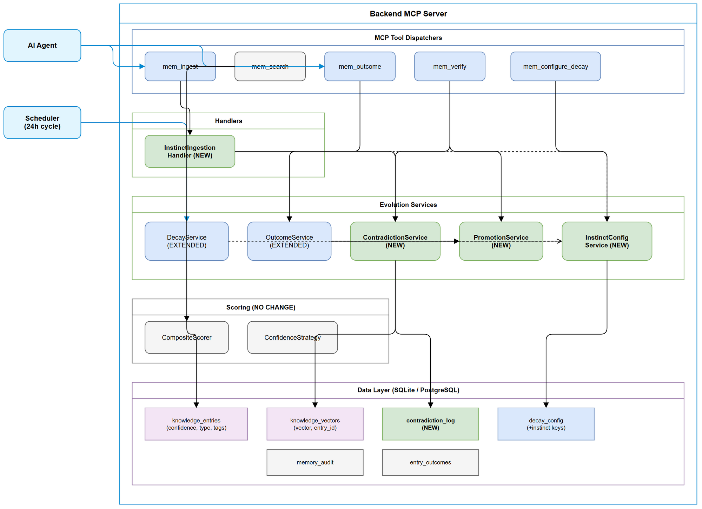

# Technical Design Document (TDD)

## Code Intelligence KB — SA4E-121: Instincts and Confidence Scoring System

---

## Document Information

| Field | Value |
|-------|-------|
| Jira Ticket | SA4E-121 |
| Title | [KB] Instincts and Confidence Scoring System |
| Epic | SA4E-119 (ECC Feature Parity) |
| Author | SA Agent |
| Version | 1.0 |
| Date | 2025-07-20 |
| Status | Draft |
| Related BRD | documents/SA4E-121/BRD.md |
| Related FSD | documents/SA4E-121/FSD.md |
| Architecture Pattern | ai-agent |

---

## Revision History

| Version | Date | Author | Changes |
|---------|------|--------|---------|
| 1.0 | 2025-07-20 | SA Agent | Initial TDD from FSD v1.0 |

---

## 1. Architecture Overview

### 1.1 System Architecture



The Instincts and Confidence Scoring System extends the existing KB Memory module within the backend MCP server. It introduces two new services (`ContradictionService`, `PromotionService`) and extends two existing services (`DecayService`, `OutcomeService`) while preserving backward compatibility.

### 1.2 Design Principles

| Principle | Application |
|-----------|-------------|
| Open/Closed | Extend existing services via configuration, not modification of core logic |
| Single Responsibility | New services (Contradiction, Promotion) handle distinct lifecycle phases |
| Strategy Pattern | Existing `CompositeScorer` strategies unchanged — confidence already flows through |
| Dependency Inversion | All services depend on `DatabaseAdapter` interface, not concrete implementations |
| Graceful Degradation | Embedding unavailability does not block ingestion — contradiction detection skipped |

### 1.3 Key Design Decisions

| # | Decision | Rationale |
|---|----------|-----------|
| 1 | No schema migration for `knowledge_entries` | Existing `confidence`, `type`, `tags` columns sufficient |
| 2 | New `contradiction_log` table | Separate concern; avoid polluting existing tables |
| 3 | Config stored in existing `decay_config` key-value table | Reuse infrastructure; per-project isolation via project_id |
| 4 | Instinct detection via `type="INSTINCT"` OR `tags LIKE '%instinct%'` | Support both explicit type and flag-based identification |
| 5 | Contradiction detection is async (post-ingest) | Do not block ingestion on potentially slow vector comparisons |
| 6 | Promotion is irreversible | Once at 1.0, entry follows standard knowledge lifecycle |

---

## 2. Component Design


### 2.1 Component Inventory

| Component | Type | Status | Location |
|-----------|------|--------|----------|
| `InstinctIngestionHandler` | New handler | Create | `memory/handlers/InstinctIngestionHandler.ts` |
| `ContradictionService` | New service | Create | `memory/evolution/ContradictionService.ts` |
| `PromotionService` | New service | Create | `memory/evolution/PromotionService.ts` |
| `InstinctConfigService` | New service | Create | `memory/evolution/InstinctConfigService.ts` |
| `DecayService` | Existing | Extend | `memory/evolution/DecayService.ts` |
| `OutcomeService` | Existing | Extend | `memory/evolution/OutcomeService.ts` |
| `CompositeScorer` | Existing | No change | `memory/evolution/CompositeScorer.ts` |
| `ConfidenceStrategy` | Existing | No change | `memory/evolution/strategies/ConfidenceStrategy.ts` |
| `mem_ingest` dispatcher | Existing | Extend | `memory/dispatchers/ingest.ts` |
| `mem_outcome` dispatcher | Existing | Extend | `memory/dispatchers/outcome.ts` |
| `mem_verify` dispatcher | Existing | Extend | `memory/dispatchers/verify.ts` |
| `mem_search` dispatcher | Existing | Minor extend | `memory/dispatchers/search.ts` |

### 2.2 Dependency Graph

```
mem_ingest dispatcher
  -> InstinctIngestionHandler
    -> InstinctConfigService (read config)
    -> ContradictionService (detect contradictions)

mem_outcome dispatcher
  -> OutcomeService (extended)
    -> InstinctConfigService (read ceiling/floor)
    -> PromotionService (check promotion)

mem_verify dispatcher
  -> ContradictionService (resolve)
  -> PromotionService (manual promote)

Scheduler
  -> DecayService (extended)
    -> InstinctConfigService (read instinct decay params)

mem_search dispatcher
  -> CompositeScorer (unchanged)
    -> ConfidenceStrategy (unchanged — reads entry.confidence)
  -> ContradictionService.getWarnings(entryIds)
```

---

## 3. API Design

### 3.1 Extended `mem_ingest` Input Schema (Zod)

```typescript
const InstinctIngestSchema = z.object({
  content: z.string().min(1),
  type: z.string().optional(),
  instinct: z.boolean().optional(),
  confidence: z.number().min(0).max(1).optional(),
  source: z.string().optional(),
  tags: z.string().optional(),
  scope: z.enum(['USER', 'PROJECT', 'GLOBAL']).optional(),
});
```

**Instinct detection logic:**
```typescript
const isInstinct = args.type === 'INSTINCT' || args.instinct === true;
```

**Confidence assignment:**
```typescript
if (isInstinct) {
  const config = await configService.getInstinctConfig();
  let confidence = args.confidence ?? config.instinct_initial_confidence;
  confidence = Math.max(config.instinct_confidence_floor,
               Math.min(config.instinct_confidence_ceiling, confidence));
}
```

### 3.2 Extended `mem_outcome` Response

```typescript
interface OutcomeResult {
  recorded: boolean;
  new_confidence: number;
  new_outcome_factor: number;
  total_outcomes: number;
  promoted: boolean; // NEW
}
```

### 3.3 Extended `mem_verify` Actions

```typescript
type VerifyAction = 'resolve' | 'promote';

interface ResolveInput {
  action: 'resolve';
  contradiction_id?: number;
  entry_id_a?: number;
  entry_id_b?: number;
  resolution: 'resolve_keep_new' | 'resolve_keep_old' | 'resolve_merge' | 'resolve_both';
}

interface PromoteInput {
  action: 'promote';
  entry_id: number;
}
```

### 3.4 Extended `mem_configure_decay` Schema

```typescript
const InstinctConfigSchema = z.object({
  action: z.enum(['get_config', 'set_config']),
  instinct_initial_confidence: z.number().min(0.1).max(0.9).optional(),
  instinct_confidence_floor: z.number().min(0.1).max(0.5).optional(),
  instinct_confidence_ceiling: z.number().min(0.5).max(1.0).optional(),
  instinct_decay_rate: z.number().min(0.01).max(0.5).optional(),
  instinct_boost_factor: z.number().min(1.01).max(2.0).optional(),
  instinct_fail_factor: z.number().min(0.5).max(0.99).optional(),
  instinct_access_threshold_days: z.number().int().min(1).max(365).optional(),
  instinct_promotion_threshold: z.number().int().min(1).max(100).optional(),
  contradiction_similarity_threshold: z.number().min(0.5).max(0.99).optional(),
});
```

### 3.5 Extended `mem_search` Response (per entry)

```typescript
interface SearchResultEntry {
  // ... existing fields
  confidence: number;
  is_instinct: boolean;
  has_contradiction: boolean;
  contradiction_warning?: string;
}
```

---

## 4. Class/Module Design


### 4.1 InstinctConfigService

```typescript
/**
 * InstinctConfigService — reads/writes instinct-specific configuration
 * from decay_config table. Provides typed access to all 9 instinct parameters.
 */
export interface InstinctConfig {
  instinct_initial_confidence: number;  // default 0.5
  instinct_confidence_floor: number;    // default 0.3
  instinct_confidence_ceiling: number;  // default 0.9
  instinct_decay_rate: number;          // default 0.08
  instinct_boost_factor: number;        // default 1.1
  instinct_fail_factor: number;         // default 0.9
  instinct_access_threshold_days: number; // default 14
  instinct_promotion_threshold: number;  // default 3
  contradiction_similarity_threshold: number; // default 0.85
}

export class InstinctConfigService {
  constructor(private readonly adapter: DatabaseAdapter) {}

  async getInstinctConfig(): Promise<InstinctConfig>;
  async setInstinctConfig(updates: Partial<InstinctConfig>): Promise<InstinctConfig>;
  async seedDefaults(): Promise<void>;
}
```

### 4.2 ContradictionService

```typescript
/**
 * ContradictionService — detects semantic contradictions between KB entries
 * using cosine similarity on embedding vectors. Logs contradictions and
 * provides resolution workflows.
 */
export interface ContradictionReport {
  contradictions: ContradictionEntry[];
  supplements: number;
  superseded: number;
}

export interface ContradictionEntry {
  id: number;
  entry_id_a: number;
  entry_id_b: number;
  similarity: number;
  classification: 'CONTRADICTION' | 'SUPPLEMENT' | 'SUPERSEDE';
  status: 'unresolved' | 'resolved' | 'stale';
}

export interface ResolutionResult {
  resolved: boolean;
  strategy: string;
  affected_entries: number[];
}

export class ContradictionService {
  constructor(
    private readonly adapter: DatabaseAdapter,
    private readonly configService: InstinctConfigService,
    private readonly logger: Logger,
  ) {}

  async detectContradictions(entryId: number, projectId?: string): Promise<ContradictionReport>;
  async resolveContradiction(contradictionId: number, resolution: string, resolvedBy?: string): Promise<ResolutionResult>;
  async getWarnings(entryIds: number[]): Promise<Map<number, string>>;
  private async classifyRelationship(entryA: { id: number; content: string }, entryB: { id: number; content: string }, similarity: number): Promise<'CONTRADICTION' | 'SUPPLEMENT' | 'SUPERSEDE'>;
  private cosineSimilarity(vecA: Float32Array, vecB: Float32Array): number;
}
```

### 4.3 PromotionService

```typescript
/**
 * PromotionService — handles instinct-to-knowledge promotion.
 * Checks criteria (confidence >= ceiling AND outcomes >= threshold)
 * and performs irreversible promotion.
 */
export interface PromotionResult {
  promoted: boolean;
  entry_id: number;
  new_confidence?: number;
  reason?: string;
}

export class PromotionService {
  constructor(
    private readonly adapter: DatabaseAdapter,
    private readonly configService: InstinctConfigService,
    private readonly logger: Logger,
  ) {}

  async checkAndPromote(entryId: number): Promise<PromotionResult>;
  async manualPromote(entryId: number): Promise<PromotionResult>;
  private async meetsCriteria(entryId: number): Promise<boolean>;
  private async executePromotion(entryId: number): Promise<void>;
}
```

### 4.4 DecayService Extension

```typescript
// Add instinct-specific decay to existing DecayService
private async executeInstinctDecay(): Promise<number> {
  const config = await this.instinctConfig.getInstinctConfig();
  const threshold = new Date(
    Date.now() - config.instinct_access_threshold_days * 86_400_000
  ).toISOString();

  const entries = await this.adapter.allAsync<{ id: number; confidence: number }>(`
    SELECT id, confidence FROM knowledge_entries
    WHERE (type = 'INSTINCT' OR tags LIKE '%instinct%')
      AND pinned = 0 AND archived = 0
      AND confidence > ?
      AND (last_accessed_at < ? OR last_accessed_at IS NULL)
    ORDER BY id
  `, [config.instinct_confidence_floor, threshold]);

  let decayed = 0;
  for (const entry of entries) {
    const newConf = Math.max(
      entry.confidence * (1 - config.instinct_decay_rate),
      config.instinct_confidence_floor,
    );
    if (newConf < entry.confidence) {
      await this.adapter.runAsync(
        `UPDATE knowledge_entries SET confidence = ?, updated_at = ${this.dialect.now()} WHERE id = ?`,
        [newConf, entry.id],
      );
      await this.auditConfidenceChange(entry.id, entry.confidence, newConf, 'decay');
      decayed++;
    }
  }
  return decayed;
}
```

### 4.5 OutcomeService Extension

```typescript
// Extended applyInstinctConfidenceChange method
private async applyInstinctConfidenceChange(
  entryId: number,
  currentConfidence: number,
  outcome: string,
): Promise<void> {
  const config = await this.instinctConfig.getInstinctConfig();
  let newConfidence: number;

  switch (outcome) {
    case 'success':
      newConfidence = Math.min(
        currentConfidence * config.instinct_boost_factor,
        config.instinct_confidence_ceiling,
      );
      break;
    case 'partial':
      newConfidence = Math.min(currentConfidence * 1.05, config.instinct_confidence_ceiling);
      break;
    case 'fail':
      newConfidence = Math.max(
        currentConfidence * config.instinct_fail_factor,
        config.instinct_confidence_floor,
      );
      break;
    default:
      return;
  }

  await this.adapter.runAsync(
    `UPDATE knowledge_entries SET confidence = ?, updated_at = ${this.dialect.now()} WHERE id = ?`,
    [newConfidence, entryId],
  );
  await this.auditConfidenceChange(entryId, currentConfidence, newConfidence, outcome);
}
```

### 4.6 InstinctIngestionHandler

```typescript
/**
 * InstinctIngestionHandler — orchestrates instinct-specific ingestion logic.
 * Called by mem_ingest dispatcher when instinct indicators detected.
 */
export class InstinctIngestionHandler {
  constructor(
    private readonly configService: InstinctConfigService,
    private readonly contradictionService: ContradictionService,
    private readonly logger: Logger,
  ) {}

  async computeInitialConfidence(args: IngestArgs): Promise<number>;
  applyInstinctTags(existingTags: string): string;
  async runContradictionDetection(entryId: number, projectId?: string): Promise<ContradictionReport | null>;
}
```

---

## 5. Database Design

### 5.1 New Table: `contradiction_log`

```sql
CREATE TABLE IF NOT EXISTS contradiction_log (
  id INTEGER PRIMARY KEY AUTOINCREMENT,
  entry_id_a INTEGER NOT NULL,
  entry_id_b INTEGER NOT NULL,
  similarity REAL NOT NULL,
  classification TEXT NOT NULL CHECK (classification IN ('CONTRADICTION', 'SUPPLEMENT', 'SUPERSEDE')),
  status TEXT NOT NULL DEFAULT 'unresolved' CHECK (status IN ('unresolved', 'resolved', 'stale')),
  resolution TEXT DEFAULT NULL,
  resolved_by TEXT DEFAULT NULL,
  detected_at TEXT NOT NULL DEFAULT (datetime('now')),
  resolved_at TEXT DEFAULT NULL,
  project_id TEXT DEFAULT NULL,
  FOREIGN KEY (entry_id_a) REFERENCES knowledge_entries(id) ON DELETE CASCADE,
  FOREIGN KEY (entry_id_b) REFERENCES knowledge_entries(id) ON DELETE CASCADE
);

CREATE INDEX IF NOT EXISTS idx_cl_status ON contradiction_log(status);
CREATE INDEX IF NOT EXISTS idx_cl_entry_a ON contradiction_log(entry_id_a);
CREATE INDEX IF NOT EXISTS idx_cl_entry_b ON contradiction_log(entry_id_b);
CREATE INDEX IF NOT EXISTS idx_cl_project ON contradiction_log(project_id);
```

### 5.2 Seed Data: `decay_config`

```sql
INSERT OR IGNORE INTO decay_config (key, value, updated_at) VALUES
  ('instinct_initial_confidence', '0.5', datetime('now')),
  ('instinct_confidence_floor', '0.3', datetime('now')),
  ('instinct_confidence_ceiling', '0.9', datetime('now')),
  ('instinct_decay_rate', '0.08', datetime('now')),
  ('instinct_boost_factor', '1.1', datetime('now')),
  ('instinct_fail_factor', '0.9', datetime('now')),
  ('instinct_access_threshold_days', '14', datetime('now')),
  ('instinct_promotion_threshold', '3', datetime('now')),
  ('contradiction_similarity_threshold', '0.85', datetime('now'));
```

### 5.3 Migration Strategy

- **Migration file:** `backend/src/modules/memory/migrations/003-add-instinct-tables.ts`
- **Approach:** Additive only — no ALTER on existing tables
- **Steps:** CREATE contradiction_log + indexes, INSERT seed data into decay_config
- **Rollback:** DROP contradiction_log; DELETE seed rows from decay_config

---

## 6. Error Handling

| Error Code | Layer | Trigger | Recovery |
|------------|-------|---------|----------|
| INVALID_CONTENT | Dispatcher | Empty content | Return 400 |
| ENTRY_NOT_FOUND | Service | Invalid entry_id | Return 404 |
| INVALID_OUTCOME | Service | Unknown outcome value | Return 400 |
| JOB_IN_PROGRESS | DecayService | Concurrent cycle | Return 409 |
| ALREADY_RESOLVED | ContradictionService | Double-resolve | Return 409 |
| INVALID_RESOLUTION | ContradictionService | Unknown strategy | Return 400 |
| CRITERIA_NOT_MET | PromotionService | Preconditions not met | Return 422 |
| CONFIDENCE_CLAMPED | Ingestion | Out-of-bounds value | Clamp + 200 with warning |
| EMBEDDINGS_UNAVAILABLE | ContradictionService | ONNX not loaded | Skip + 200 degraded |

---

## 7. Security Design

### 7.1 Input Validation

All inputs validated via Zod schemas. Confidence bounded [0.3, 0.9] for instincts. Resolution strategies enum-validated. Entry IDs checked for existence.

### 7.2 Data Isolation

- `contradiction_log.project_id` ensures cross-project isolation
- Config stored per-project in existing `decay_config` pattern
- No PII in contradiction_log — only entry IDs and metadata

### 7.3 No New Attack Surface

- No new external API endpoints — extends existing MCP tools
- No new authentication — inherits existing session context
- All parameters validated via Zod before processing

---

## 8. Performance Considerations

| Operation | Target | Strategy |
|-----------|--------|----------|
| Confidence scoring | < 0.005ms/entry | Direct field read O(1) |
| Decay cycle (10k entries) | < 5s | Batch 100/batch |
| Contradiction detection | < 50ms/entry | Project-scoped + LIMIT 50 candidates |
| Search overhead | < 5ms/1000 entries | No additional queries |

---

## 9. Implementation Checklist

### Phase 1: Foundation

- [ ] Create `InstinctConfigService` with read/write/seed
- [ ] Create migration `003-add-instinct-tables.ts`
- [ ] Unit tests for InstinctConfigService

### Phase 2: Ingestion

- [ ] Create `InstinctIngestionHandler`
- [ ] Extend `mem_ingest` dispatcher
- [ ] Unit + integration tests

### Phase 3: Decay Extension

- [ ] Extend `DecayService` with `executeInstinctDecay()`
- [ ] Inject `InstinctConfigService` dependency
- [ ] Unit + integration tests

### Phase 4: Outcome + Promotion

- [ ] Create `PromotionService`
- [ ] Extend `OutcomeService` with instinct-aware logic
- [ ] Unit + integration tests

### Phase 5: Contradiction Detection

- [ ] Create `ContradictionService`
- [ ] Wire into ingestion flow (async post-ingest)
- [ ] Extend `mem_verify` dispatcher with resolve action
- [ ] Unit + integration tests

### Phase 6: Search Enhancement

- [ ] Extend `mem_search` response with instinct/contradiction fields
- [ ] Wire `ContradictionService.getWarnings()`
- [ ] Integration tests

### Phase 7: Configuration

- [ ] Extend `mem_configure_decay` dispatcher
- [ ] Integration test: config change -> behavior change

---

## 10. File Structure

```
backend/src/modules/memory/
  evolution/
    DecayService.ts              (EXTEND)
    OutcomeService.ts            (EXTEND)
    CompositeScorer.ts           (NO CHANGE)
    ContradictionService.ts      (NEW)
    PromotionService.ts          (NEW)
    InstinctConfigService.ts     (NEW)
    models.ts                    (EXTEND)
    strategies/
      ConfidenceStrategy.ts      (NO CHANGE)
  handlers/
    InstinctIngestionHandler.ts  (NEW)
  dispatchers/
    ingest.ts                    (EXTEND)
    outcome.ts                   (EXTEND)
    verify.ts                    (EXTEND)
    search.ts                    (MINOR EXTEND)
  migrations/
    003-add-instinct-tables.ts   (NEW)
  schema/
    tables.ts                    (NO CHANGE)
```

---

## 11. Appendix

### Diagram Index

| # | Diagram | Image | Source (editable) |
|---|---------|-------|-------------------|
| 1 | Architecture Overview | [architecture.png](diagrams/architecture.png) | [architecture.drawio](diagrams/architecture.drawio) |
| 2 | Component Diagram | [component.png](diagrams/component.png) | [component.drawio](diagrams/component.drawio) |
| 3 | Class Diagram | [class-instinct.png](diagrams/class-instinct.png) | [class-instinct.drawio](diagrams/class-instinct.drawio) |

### Reference Documents

| Document | Location |
|----------|----------|
| BRD | documents/SA4E-121/BRD.md |
| FSD | documents/SA4E-121/FSD.md |
| DecayService | backend/src/modules/memory/evolution/DecayService.ts |
| OutcomeService | backend/src/modules/memory/evolution/OutcomeService.ts |
| CompositeScorer | backend/src/modules/memory/evolution/CompositeScorer.ts |
| Schema (tables) | backend/src/modules/memory/schema/tables.ts |
