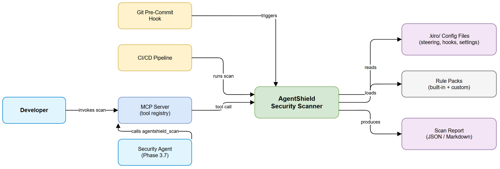
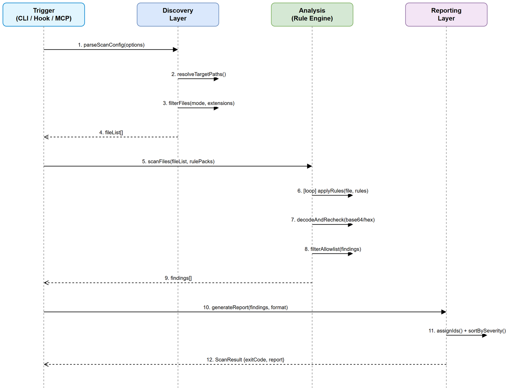
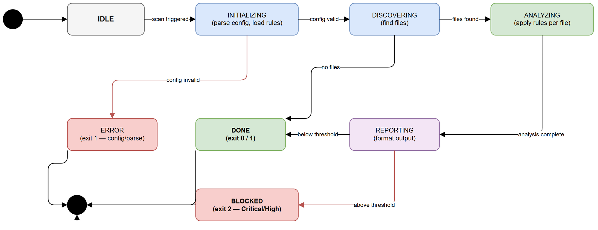

# Functional Specification Document (FSD)

## AgentShield — SA4E-128: Agent Config Security Scanner

---

## Document Information

| Field | Value |
|-------|-------|
| Jira Ticket | SA4E-128 |
| Title | [Security] AgentShield - Agent Config Security Scanner |
| Author | BA Agent |
| Version | 1.0 |
| Date | 2025-07-27 |
| Status | Draft |
| Related BRD | documents/SA4E-128/BRD.md |

---

## Revision History

| Version | Date | Author | Changes |
|---------|------|--------|---------|
| 1.0 | 2025-07-27 | BA Agent | Initiate document — auto-generated from BRD SA4E-128 |

---

## 1. Introduction

### 1.1 Purpose

This FSD specifies the functional behavior of AgentShield — a static security scanner for AI agent configuration files. It translates business requirements from the BRD into implementable functional specifications covering use cases, business rules, data models, API contracts, and processing logic.

### 1.2 Scope

AgentShield scans `.kiro/steering/`, `.kiro/hooks/`, and `.kiro/settings/` directories for security vulnerabilities including prompt injection vectors, malicious hook commands, overly permissive MCP configurations, and hardcoded secrets. The scanner operates as:

1. **CLI tool** — invoked via `npx agentshield scan` for on-demand scanning
2. **Pre-commit hook** — blocks commits with Critical/High findings
3. **MCP tool** — exposed as an MCP tool for agent-driven security scans

### 1.3 Definitions & Acronyms

| Term | Definition |
|------|------------|
| AgentShield | The security scanner tool specified in this FSD |
| Steering File | Markdown file in `.kiro/steering/` providing behavioral instructions to AI agents |
| Hook | Automation trigger (JSON/shell) in `.kiro/hooks/` executing commands on events |
| MCP Config | JSON configuration defining Model Context Protocol server connections and permissions |
| Finding | A single security issue detected by the scanner, scored by severity |
| Denylist | List of explicitly forbidden commands/patterns flagged as violations |
| autoApprove | MCP config field listing tools allowed to execute without user confirmation |
| Rule | A detection pattern with associated severity and category |
| Rule Pack | A versioned collection of rules that can be updated independently |

### 1.4 References

| Document | Location |
|----------|----------|
| BRD | documents/SA4E-128/BRD.md |
| Security Agent Definition | `.kiro/agents/security-agent.md` |
| OWASP Testing Guide v4.2 | https://owasp.org/www-project-web-security-testing-guide/ |

---

## 2. System Overview

### 2.1 System Context Diagram



AgentShield operates within the developer's workspace. It reads configuration files from the `.kiro/` directory, applies security rules, and outputs findings. It integrates with:

- **Git hooks** — pre-commit hook triggers scan on staged files
- **CI/CD pipeline** — runs as a step with exit code-based gating
- **Security Agent (Phase 3.7)** — consumes scan results for design review workflow
- **MCP Server** — exposes `agentshield_scan` tool for programmatic invocation

### 2.2 System Architecture

AgentShield follows a pipeline architecture:

1. **Trigger Layer** — CLI parser / pre-commit hook / MCP tool handler
2. **Discovery Layer** — file discovery and filtering
3. **Analysis Layer** — rule engine with pluggable rule packs
4. **Reporting Layer** — finding aggregation, formatting, exit code determination

---

## 3. Functional Requirements

### 3.1 Feature: Scan Steering Files for Prompt Injection

**Source:** BRD Story 1

#### 3.1.1 Description

Scanner reads all markdown files in `.kiro/steering/` recursively and applies prompt injection detection rules. Detected patterns include instruction override attempts, hidden instructions in HTML comments, encoded payloads, and role hijacking.

#### 3.1.2 Use Case

**Use Case ID:** UC-01
**Actor:** Developer
**Preconditions:** `.kiro/steering/` directory exists with at least one `.md` file
**Postconditions:** Findings array populated with any detected prompt injection patterns

**Main Flow:**

| Step | Actor | System | Description |
|------|-------|--------|-------------|
| 1 | Developer | | Triggers scan (CLI or pre-commit) |
| 2 | | Scanner | Discovers `.md` files in `.kiro/steering/` recursively |
| 3 | | Scanner | For each file, loads content line by line |
| 4 | | Scanner | Applies prompt injection rules (PI-001 through PI-005) |
| 5 | | Scanner | Decodes base64/hex segments and re-applies rules |
| 6 | | Scanner | Generates findings with file:line references |
| 7 | | Scanner | Returns findings array to reporting layer |

**Alternative Flows:**

| ID | Condition | Steps |
|----|-----------|-------|
| AF-01-1 | `.kiro/steering/` directory does not exist | Skip steering scan, log info message, continue with other directories |
| AF-01-2 | File is binary (not valid UTF-8) | Skip file, log warning, continue scanning |

**Exception Flows:**

| ID | Condition | Steps |
|----|-----------|-------|
| EF-01-1 | File read permission denied | Log error with file path, add Info finding "Unreadable file", continue |
| EF-01-2 | File exceeds 1MB size limit | Skip file, log warning "File too large for scanning", continue |

---

### 3.2 Feature: Scan Hooks for Injection Risks

**Source:** BRD Story 2

#### 3.2.1 Description

Scanner reads all files in `.kiro/hooks/` (JSON, shell scripts, `.kiro.hook` files) and detects command injection patterns including unquoted variable expansion, pipe/redirect chains for data exfiltration, eval/exec with dynamic input, and environment variable manipulation.

#### 3.2.2 Use Case

**Use Case ID:** UC-02
**Actor:** Developer
**Preconditions:** `.kiro/hooks/` directory exists with at least one hook file
**Postconditions:** Findings array populated with any detected command injection patterns

**Main Flow:**

| Step | Actor | System | Description |
|------|-------|--------|-------------|
| 1 | Developer | | Triggers scan |
| 2 | | Scanner | Discovers files in `.kiro/hooks/` (JSON, .sh, .kiro.hook) |
| 3 | | Scanner | For JSON files: parses and extracts `command` fields |
| 4 | | Scanner | For shell files: reads content line by line |
| 5 | | Scanner | Applies command injection rules (CI-001 through CI-004) |
| 6 | | Scanner | Applies dangerous command rules (DC-001 through DC-010) |
| 7 | | Scanner | Generates findings with file:line references |

**Alternative Flows:**

| ID | Condition | Steps |
|----|-----------|-------|
| AF-02-1 | `.kiro/hooks/` does not exist | Skip hooks scan, log info, continue |
| AF-02-2 | JSON file is malformed | Log warning, add Low finding "Malformed hook config", continue |

**Exception Flows:**

| ID | Condition | Steps |
|----|-----------|-------|
| EF-02-1 | File read permission denied | Log error, add Info finding, continue |

---

### 3.3 Feature: Scan MCP Configs for Overly Permissive Permissions

**Source:** BRD Story 3

#### 3.3.1 Description

Scanner reads MCP configuration files (`.kiro/settings/mcp.json`, `.agents/mcp.json`, `.claude/mcp.json`, `.roo/mcp.json`) and analyzes `autoApprove` arrays, authentication settings, and server configurations for security weaknesses.

#### 3.3.2 Use Case

**Use Case ID:** UC-03
**Actor:** Developer
**Preconditions:** At least one MCP configuration file exists
**Postconditions:** Findings array populated with permission/configuration issues

**Main Flow:**

| Step | Actor | System | Description |
|------|-------|--------|-------------|
| 1 | Developer | | Triggers scan |
| 2 | | Scanner | Discovers MCP config files in known locations |
| 3 | | Scanner | Parses JSON and extracts `mcpServers` entries |
| 4 | | Scanner | For each server: checks `autoApprove` array |
| 5 | | Scanner | Checks for wildcard approvals, excessive permissions |
| 6 | | Scanner | Checks for missing auth on HTTP servers |
| 7 | | Scanner | Checks for non-HTTPS URLs for non-localhost servers |
| 8 | | Scanner | Generates findings |

**Alternative Flows:**

| ID | Condition | Steps |
|----|-----------|-------|
| AF-03-1 | No MCP config files found | Skip MCP scan, log info, continue |
| AF-03-2 | MCP config has no `mcpServers` key | Skip file, no findings |

**Exception Flows:**

| ID | Condition | Steps |
|----|-----------|-------|
| EF-03-1 | JSON parse error | Log warning, add Low finding "Malformed MCP config", continue |

---

### 3.4 Feature: Detect Hardcoded Secrets

**Source:** BRD Story 4

#### 3.4.1 Description

Scanner applies secret detection across ALL scanned files. Detects API keys, JWT tokens, connection strings, private keys, and high-entropy strings. Uses an allowlist to exclude known safe patterns.

#### 3.4.2 Use Case

**Use Case ID:** UC-04
**Actor:** Developer
**Preconditions:** Files have been discovered for scanning
**Postconditions:** Findings array populated with detected secrets

**Main Flow:**

| Step | Actor | System | Description |
|------|-------|--------|-------------|
| 1 | | Scanner | For each file being scanned (all types) |
| 2 | | Scanner | Applies secret detection rules (SD-001 through SD-008) |
| 3 | | Scanner | Checks against allowlist patterns |
| 4 | | Scanner | If match AND not in allowlist → generate finding |
| 5 | | Scanner | Calculates entropy for suspicious strings |
| 6 | | Scanner | High-entropy (>4.5 bits/char, >32 chars) → generate finding |

**Alternative Flows:**

| ID | Condition | Steps |
|----|-----------|-------|
| AF-04-1 | Value matches allowlist pattern | Skip, no finding generated |
| AF-04-2 | Value is environment variable reference (`${ENV_VAR}`) | Skip, no finding generated |

**Exception Flows:**

| ID | Condition | Steps |
|----|-----------|-------|
| EF-04-1 | Entropy calculation fails (non-ASCII content) | Skip entropy check, apply pattern rules only |

---

### 3.5 Feature: Validate Hook Commands Are Safe

**Source:** BRD Story 5

#### 3.5.1 Description

Scanner maintains a denylist of dangerous commands/patterns and validates all hook command values against it. Supports custom denylist/allowlist per project via configuration file.

#### 3.5.2 Use Case

**Use Case ID:** UC-05
**Actor:** Developer
**Preconditions:** Hook files with `command` fields have been discovered
**Postconditions:** Findings generated for dangerous commands

**Main Flow:**

| Step | Actor | System | Description |
|------|-------|--------|-------------|
| 1 | | Scanner | Extracts command strings from hook files |
| 2 | | Scanner | Loads built-in denylist + custom project denylist |
| 3 | | Scanner | Loads project allowlist (overrides) |
| 4 | | Scanner | For each command: matches against denylist patterns |
| 5 | | Scanner | If match AND not in allowlist → determine severity from context |
| 6 | | Scanner | Scoped commands (e.g., `rm -rf node_modules/`) → Medium |
| 7 | | Scanner | Unscoped destructive commands → Critical |

**Alternative Flows:**

| ID | Condition | Steps |
|----|-----------|-------|
| AF-05-1 | Command matches project allowlist | Skip, no finding generated |
| AF-05-2 | Custom denylist file not found | Use built-in denylist only |

**Exception Flows:**

| ID | Condition | Steps |
|----|-----------|-------|
| EF-05-1 | Custom denylist/allowlist YAML/JSON parse error | Log warning, use built-in only, add Info finding |

---

### 3.6 Feature: Severity-Scored Report Generation

**Source:** BRD Story 6

#### 3.6.1 Description

Scanner aggregates all findings, assigns final severity scores, and generates reports in JSON and Markdown formats. Each finding includes a unique ID, severity, category, file reference, evidence, and remediation suggestion.

#### 3.6.2 Use Case

**Use Case ID:** UC-06
**Actor:** Developer / CI Pipeline
**Preconditions:** Scan has completed with findings array
**Postconditions:** Report generated in requested format(s)

**Main Flow:**

| Step | Actor | System | Description |
|------|-------|--------|-------------|
| 1 | | Scanner | Collects all findings from analysis layer |
| 2 | | Scanner | Assigns sequential IDs (AS-001, AS-002, ...) |
| 3 | | Scanner | Sorts findings by severity (Critical → Info) |
| 4 | | Scanner | Generates summary (counts per severity, per category) |
| 5 | | Scanner | Formats as JSON (if `--format json`) |
| 6 | | Scanner | Formats as Markdown (if `--format md` or default) |
| 7 | | Scanner | Outputs to stdout (or `--output` file path) |

**Alternative Flows:**

| ID | Condition | Steps |
|----|-----------|-------|
| AF-06-1 | No findings | Output "Clean — no security issues found", exit 0 |
| AF-06-2 | `--format json` specified | Output valid JSON array of finding objects |
| AF-06-3 | `--output` path specified | Write to file instead of stdout |

**Exception Flows:**

| ID | Condition | Steps |
|----|-----------|-------|
| EF-06-1 | Output file write fails | Fallback to stdout, log error |

---

### 3.7 Feature: Pre-Commit and On-Demand Execution

**Source:** BRD Story 7

#### 3.7.1 Description

Scanner supports two execution modes: pre-commit (scans only staged files, blocks commit on Critical/High) and on-demand (scans entire directories, generates full report).

#### 3.7.2 Use Case: Pre-Commit Mode

**Use Case ID:** UC-07A
**Actor:** Developer (via git commit)
**Preconditions:** Pre-commit hook installed, files staged for commit
**Postconditions:** Commit allowed or blocked based on findings severity

**Main Flow:**

| Step | Actor | System | Description |
|------|-------|--------|-------------|
| 1 | Developer | | Runs `git commit` |
| 2 | | Git | Triggers pre-commit hook |
| 3 | | Scanner | Gets list of staged files via `git diff --cached --name-only` |
| 4 | | Scanner | Filters to `.kiro/` files only |
| 5 | | Scanner | Runs scan on filtered files |
| 6 | | Scanner | If Critical/High findings exist → exit 2 (blocks commit) |
| 7 | | Scanner | If only Medium/Low/Info → exit 0 (allows commit) |
| 8 | | Scanner | Outputs brief summary to terminal |

**Alternative Flows:**

| ID | Condition | Steps |
|----|-----------|-------|
| AF-07A-1 | No `.kiro/` files staged | Skip scan, exit 0 immediately |
| AF-07A-2 | Scanner config disables pre-commit | Exit 0 immediately |

#### 3.7.3 Use Case: On-Demand Mode

**Use Case ID:** UC-07B
**Actor:** Developer
**Preconditions:** Project workspace with `.kiro/` directories
**Postconditions:** Full scan report generated

**Main Flow:**

| Step | Actor | System | Description |
|------|-------|--------|-------------|
| 1 | Developer | | Runs `npx agentshield scan [options]` |
| 2 | | Scanner | Parses CLI arguments |
| 3 | | Scanner | Discovers all target directories |
| 4 | | Scanner | Runs full scan |
| 5 | | Scanner | Generates report in specified format |
| 6 | | Scanner | Returns exit code based on severity threshold |

---

### 3.8 Feature: CI/CD Integration

**Source:** BRD Story 8

#### 3.8.1 Description

Scanner returns structured exit codes for CI/CD pipeline integration. Supports configurable severity threshold and machine-readable JSON output.

#### 3.8.2 Use Case

**Use Case ID:** UC-08
**Actor:** CI/CD Pipeline
**Preconditions:** Scanner installed in CI environment
**Postconditions:** Process exits with appropriate code

**Main Flow:**

| Step | Actor | System | Description |
|------|-------|--------|-------------|
| 1 | Pipeline | | Runs `npx agentshield scan --format json --severity-threshold high` |
| 2 | | Scanner | Performs full scan |
| 3 | | Scanner | Evaluates findings against threshold |
| 4 | | Scanner | Exit 0 = no findings above threshold |
| 5 | | Scanner | Exit 1 = findings exist but below threshold |
| 6 | | Scanner | Exit 2 = Critical/High findings (above threshold) |

**Alternative Flows:**

| ID | Condition | Steps |
|----|-----------|-------|
| AF-08-1 | `--severity-threshold critical` | Only exit 2 for Critical findings |
| AF-08-2 | `--severity-threshold medium` | Exit 2 for Critical, High, or Medium |

---

### 3.9 Feature: MCP Tool Interface

**Source:** BRD Dependency — MCP server integration

#### 3.9.1 Description

Scanner exposes an MCP tool `agentshield_scan` for programmatic invocation by AI agents (e.g., security-agent). This allows agents to trigger scans and consume structured results.

#### 3.9.2 Use Case

**Use Case ID:** UC-09
**Actor:** Security Agent (AI)
**Preconditions:** MCP server running, AgentShield registered as tool
**Postconditions:** Scan results returned as MCP tool response

**Main Flow:**

| Step | Actor | System | Description |
|------|-------|--------|-------------|
| 1 | Agent | | Calls `agentshield_scan` MCP tool with arguments |
| 2 | | MCP Handler | Validates input arguments |
| 3 | | Scanner | Executes scan with provided options |
| 4 | | MCP Handler | Formats findings as structured JSON content |
| 5 | | MCP Handler | Returns result to calling agent |

**Alternative Flows:**

| ID | Condition | Steps |
|----|-----------|-------|
| AF-09-1 | Invalid arguments | Return MCP error with validation message |
| AF-09-2 | Scan timeout (>30s) | Return partial results with timeout warning |

---

## 4. Business Rules

| Rule ID | Rule | Category | Source |
|---------|------|----------|--------|
| BR-01 | Critical/High findings MUST block commit in pre-commit mode | Gating | BRD Story 7 |
| BR-02 | Exit code 2 when findings exist above severity threshold | CI/CD | BRD Story 8 |
| BR-03 | Exit code 1 when findings exist below threshold | CI/CD | BRD Story 8 |
| BR-04 | Exit code 0 when no findings or all below threshold | CI/CD | BRD Story 8 |
| BR-05 | Allowlisted patterns MUST NOT generate findings | Allowlist | BRD Story 4, 5 |
| BR-06 | Environment variable references (${ENV_VAR}) are always safe | Allowlist | BRD Story 4 |
| BR-07 | Placeholder values (YOUR_API_KEY_HERE, xxx, placeholder) are safe | Allowlist | BRD Story 4 |
| BR-08 | Scoped destructive commands receive lower severity than unscoped | Severity | BRD Story 5 |
| BR-09 | Custom allowlist overrides built-in denylist | Configuration | BRD Story 5 |
| BR-10 | Scanner MUST NOT execute any scanned content | Security | BRD NFR |
| BR-11 | Wildcard autoApprove (`*`) is always Critical severity | Permission | BRD Story 3 |
| BR-12 | Pre-commit mode scans only staged files matching `.kiro/` paths | Performance | BRD Story 7 |
| BR-13 | Base64/hex encoded content MUST be decoded before pattern matching | Detection | BRD Story 1 |
| BR-14 | Findings are assigned sequential IDs within a single scan (AS-001, AS-002, ...) | Reporting | BRD Story 6 |
| BR-15 | Scan MUST complete within 5 seconds for <100 config files | Performance | BRD NFR |

---

## 5. Data Model

### 5.1 Entity Specifications

#### Entity: ScanResult

| Attribute | Type | Required | Description |
|-----------|------|----------|-------------|
| scanId | string (UUID) | Yes | Unique identifier for this scan execution |
| timestamp | ISO 8601 string | Yes | When the scan was executed |
| duration | number (ms) | Yes | Total scan duration in milliseconds |
| mode | enum | Yes | `pre-commit` \| `on-demand` \| `mcp` |
| targetPaths | string[] | Yes | Directories/files that were scanned |
| findings | Finding[] | Yes | Array of detected security findings |
| summary | ScanSummary | Yes | Aggregated counts |
| exitCode | number | Yes | 0, 1, or 2 |

#### Entity: Finding

| Attribute | Type | Required | Description |
|-----------|------|----------|-------------|
| id | string | Yes | Sequential ID (AS-001, AS-002, ...) |
| severity | enum | Yes | `Critical` \| `High` \| `Medium` \| `Low` \| `Info` |
| category | enum | Yes | `PromptInjection` \| `CommandInjection` \| `OverPermission` \| `HardcodedSecret` \| `DangerousCommand` |
| file | string | Yes | Relative file path from workspace root |
| line | number | No | Line number (1-indexed), null if N/A |
| column | number | No | Column number, null if N/A |
| rule | string | Yes | Rule ID that triggered (e.g., PI-001) |
| description | string | Yes | Human-readable issue description |
| evidence | string | Yes | Matched text/pattern (redacted for secrets) |
| remediation | string | Yes | Actionable fix suggestion |

#### Entity: ScanSummary

| Attribute | Type | Required | Description |
|-----------|------|----------|-------------|
| total | number | Yes | Total findings count |
| bySeverity | Record<Severity, number> | Yes | Count per severity level |
| byCategory | Record<Category, number> | Yes | Count per category |
| filesScanned | number | Yes | Number of files analyzed |
| filesWithFindings | number | Yes | Files that had at least 1 finding |

#### Entity: Rule

| Attribute | Type | Required | Description |
|-----------|------|----------|-------------|
| id | string | Yes | Unique rule ID (e.g., PI-001) |
| name | string | Yes | Human-readable rule name |
| description | string | Yes | What the rule detects |
| category | enum | Yes | Finding category this rule produces |
| severity | enum | Yes | Default severity |
| pattern | RegExp \| function | Yes | Detection logic |
| fileTypes | string[] | Yes | File extensions this rule applies to |
| enabled | boolean | Yes | Whether rule is active |

#### Entity: ScanConfig

| Attribute | Type | Required | Description |
|-----------|------|----------|-------------|
| targetDirs | string[] | Yes | Directories to scan (default: `.kiro/steering/`, `.kiro/hooks/`, `.kiro/settings/`) |
| extraDirs | string[] | No | Additional directories from config |
| customDenylist | string[] | No | Additional denied patterns |
| customAllowlist | string[] | No | Patterns to exclude from findings |
| severityThreshold | enum | No | Minimum severity for non-zero exit (default: High) |
| format | enum | No | Output format: `json` \| `md` (default: `md`) |
| output | string | No | File path for report output |
| maxFileSize | number | No | Max file size in bytes (default: 1MB) |

**Relationships:**

| From Entity | To Entity | Cardinality | Description |
|-------------|-----------|-------------|-------------|
| ScanResult | Finding | 1:N | A scan produces zero or more findings |
| ScanResult | ScanSummary | 1:1 | Each scan has exactly one summary |
| Finding | Rule | N:1 | Each finding is generated by one rule |
| ScanConfig | ScanResult | 1:1 | Each scan execution uses one configuration |

---

## 6. Processing Logic

### 6.1 Scan Pipeline Process

**Trigger:** CLI invocation, pre-commit hook, or MCP tool call
**Input:** ScanConfig (from CLI args / defaults / MCP arguments)
**Output:** ScanResult

**Processing Steps:**

| Step | Description | Error Handling |
|------|-------------|----------------|
| 1 | Parse trigger input → build ScanConfig | Invalid args → exit 1 with usage message |
| 2 | Resolve target paths (expand directories, filter by mode) | Missing dirs → warn and skip |
| 3 | Load rule packs (built-in + custom) | Custom rules malformed → use built-in only |
| 4 | For each file: determine file type → select applicable rules | File read error → log, skip file |
| 5 | For each applicable rule: execute pattern matching | Rule error → log, skip rule, continue |
| 6 | Decode encoded segments (base64/hex) → re-apply rules | Decode error → skip segment |
| 7 | Check findings against allowlist → filter out allowed | — |
| 8 | Assign sequential IDs and final severity | — |
| 9 | Generate ScanSummary | — |
| 10 | Format output (JSON/MD) | Output write error → fallback stdout |
| 11 | Determine exit code based on severity threshold | — |

### 6.2 Severity Assignment Process

**Trigger:** Finding generated by a rule
**Input:** Rule default severity + context
**Output:** Final severity

| Context | Severity Adjustment |
|---------|-------------------|
| Unscoped destructive command (`rm -rf /`) | Critical (no change) |
| Scoped destructive command (`rm -rf node_modules/`) | Downgrade to Medium |
| Wildcard autoApprove | Critical (no change) |
| >20 items in autoApprove | Medium |
| Duplicate autoApprove entries | Low |
| Base64-encoded injection | Same as decoded pattern severity |
| Pattern in markdown comment | Medium (hidden instruction) |

### 6.3 File Discovery Process

**Trigger:** Scan initiated
**Input:** ScanConfig.targetDirs + mode

**Pre-commit mode:**
1. Run `git diff --cached --name-only`
2. Filter paths starting with `.kiro/`
3. Return filtered file list

**On-demand mode:**
1. For each directory in targetDirs
2. Recursively find all files
3. Filter by supported extensions (`.md`, `.json`, `.sh`, `.yaml`, `.yml`, `.kiro.hook`)
4. Exclude files exceeding maxFileSize
5. Return file list

---

## 7. Security Requirements

### 7.1 Authentication & Authorization

AgentShield runs locally with the developer's filesystem permissions. No additional authentication is required for CLI/pre-commit modes.

For MCP tool access:

| Role | Permissions | Context |
|------|-------------|---------|
| Developer (local) | Full scan access | CLI / pre-commit |
| AI Agent (MCP) | Full scan access | MCP tool invocation |
| CI Pipeline | Full scan access | CLI in CI environment |

### 7.2 Data Sensitivity

| Data Type | Classification | Handling |
|-----------|---------------|----------|
| Scanned file content | Internal | Read-only, never executed, not transmitted |
| Detected secrets (evidence) | Confidential | Redacted in output (first 4 + last 4 chars shown) |
| Scan results | Internal | Output to local stdout/file only |
| Rule definitions | Public | Open-source rule packs |

### 7.3 Security Constraints

| Constraint | Rationale |
|------------|-----------|
| No eval/exec of scanned content | Prevent scanner from being attack vector |
| No network calls during scan | Prevent data exfiltration via scanner |
| Read-only filesystem access | Scanner never modifies scanned files |
| Secret redaction in output | Prevent accidental secret exposure in logs |
| Config file validation before use | Prevent tampered scanner config from disabling rules |

---

## 8. Non-Functional Requirements

| Category | Business Requirement | Acceptance Criteria |
|----------|---------------------|---------------------|
| Performance | Full scan completes quickly | < 5s for <100 config files |
| Performance | Pre-commit scan is instant-feel | < 2s for staged files |
| Scalability | Handles large projects | Linear time for up to 500 files |
| Reliability | No false negatives for denylist | Exact string match = 100% detection |
| Extensibility | Custom rules without code changes | JSON/YAML rule definition files |
| Compatibility | Cross-platform | Windows, macOS, Linux (Node.js) |
| Usability | Clear findings | Every finding has actionable remediation |
| Maintainability | Rule versioning | Semantic versioning for rule packs |

---

## 9. Error Handling

### 9.1 Error Scenarios

| Scenario | Severity | User Message | Expected Behavior |
|----------|----------|-------------|-------------------|
| Target directory not found | Info | `Directory {path} not found, skipping` | Continue scanning other dirs |
| File read permission denied | Warning | `Cannot read {file}, skipping` | Skip file, continue |
| File exceeds size limit | Info | `File {file} exceeds 1MB limit, skipping` | Skip file, continue |
| Invalid JSON in config file | Warning | `Malformed JSON in {file}` | Add Low finding, continue |
| Custom rule pack parse error | Warning | `Failed to load custom rules from {path}, using built-in only` | Fallback to built-in rules |
| Scan timeout (>30s in MCP mode) | Error | `Scan timed out after 30s` | Return partial results |
| No scannable files found | Info | `No agent config files found to scan` | Exit 0 with empty report |
| Invalid CLI arguments | Error | `Invalid argument: {detail}. Run --help for usage.` | Exit 1 with help |

### 9.2 Error Codes

| Code | Name | Description |
|------|------|-------------|
| E001 | DIR_NOT_FOUND | Target directory does not exist |
| E002 | FILE_UNREADABLE | Cannot read file (permissions) |
| E003 | FILE_TOO_LARGE | File exceeds size limit |
| E004 | INVALID_JSON | JSON parsing failed |
| E005 | INVALID_CONFIG | Scanner configuration is invalid |
| E006 | RULE_LOAD_ERROR | Custom rule pack failed to load |
| E007 | SCAN_TIMEOUT | Scan exceeded time limit |
| E008 | INVALID_ARGS | CLI arguments are invalid |

---

## 10. API Specifications

### 10.1 CLI Interface

**Command:** `npx agentshield scan [options]`

| Option | Type | Default | Description |
|--------|------|---------|-------------|
| `--path <dir>` | string | `.` (current dir) | Workspace root to scan |
| `--format <fmt>` | enum | `md` | Output format: `json` \| `md` |
| `--severity-threshold <level>` | enum | `high` | Min severity for exit code 2: `critical` \| `high` \| `medium` \| `low` |
| `--output <file>` | string | stdout | Write report to file |
| `--config <file>` | string | `.agentshield.yml` | Path to config file |
| `--staged-only` | boolean | `false` | Scan only git-staged files |
| `--no-color` | boolean | `false` | Disable colored output |
| `--verbose` | boolean | `false` | Show detailed scan progress |
| `--version` | boolean | — | Show version and exit |
| `--help` | boolean | — | Show help and exit |

**Exit Codes:**

| Code | Meaning |
|------|---------|
| 0 | No findings above threshold (or clean scan) |
| 1 | Findings exist but all below threshold |
| 2 | Findings at or above severity threshold |

### 10.2 MCP Tool Interface

**Tool Name:** `agentshield_scan`

**Input Schema:**

```json
{
  "type": "object",
  "properties": {
    "path": {
      "type": "string",
      "description": "Workspace root path to scan",
      "default": "."
    },
    "directories": {
      "type": "array",
      "items": { "type": "string" },
      "description": "Specific directories to scan (overrides defaults)"
    },
    "severity_threshold": {
      "type": "string",
      "enum": ["critical", "high", "medium", "low"],
      "default": "high",
      "description": "Minimum severity to report"
    },
    "include_evidence": {
      "type": "boolean",
      "default": true,
      "description": "Include matched evidence in findings"
    }
  },
  "required": []
}
```

**Output Schema:**

```json
{
  "type": "object",
  "properties": {
    "success": { "type": "boolean" },
    "scan_id": { "type": "string" },
    "timestamp": { "type": "string", "format": "date-time" },
    "duration_ms": { "type": "number" },
    "summary": {
      "type": "object",
      "properties": {
        "total": { "type": "number" },
        "critical": { "type": "number" },
        "high": { "type": "number" },
        "medium": { "type": "number" },
        "low": { "type": "number" },
        "info": { "type": "number" },
        "files_scanned": { "type": "number" }
      }
    },
    "findings": {
      "type": "array",
      "items": {
        "type": "object",
        "properties": {
          "id": { "type": "string" },
          "severity": { "type": "string" },
          "category": { "type": "string" },
          "file": { "type": "string" },
          "line": { "type": "number" },
          "rule": { "type": "string" },
          "description": { "type": "string" },
          "evidence": { "type": "string" },
          "remediation": { "type": "string" }
        }
      }
    },
    "pass": { "type": "boolean", "description": "true if no findings above threshold" }
  }
}
```

### 10.3 Configuration File (`.agentshield.yml`)

```yaml
# AgentShield Configuration
version: "1.0"

# Directories to scan (relative to workspace root)
target_dirs:
  - ".kiro/steering/"
  - ".kiro/hooks/"
  - ".kiro/settings/"
  - ".agents/"
  - ".claude/"
  - ".roo/"

# Custom rules
rules:
  custom_denylist:
    - pattern: "kubectl delete"
      severity: "high"
      description: "Kubernetes resource deletion"
  custom_allowlist:
    - "git push --force-with-lease"
    - "rm -rf node_modules/"
    - "rm -rf dist/"

# Severity threshold for exit code
severity_threshold: "high"

# File limits
max_file_size_bytes: 1048576  # 1MB

# Secret detection
secrets:
  entropy_threshold: 4.5
  min_length: 32
  allowlist_patterns:
    - "YOUR_*_HERE"
    - "xxx*"
    - "placeholder"
    - "example"

# Output
format: "md"
```

---

## 11. Rule Definitions

### 11.1 Prompt Injection Rules

| Rule ID | Name | Pattern | Severity | Category |
|---------|------|---------|----------|----------|
| PI-001 | Instruction Override | `ignore previous instructions`, `forget your system prompt`, `disregard above` | High | PromptInjection |
| PI-002 | Role Hijacking | `you are now a`, `act as a`, `pretend to be` (in imperative context) | High | PromptInjection |
| PI-003 | Hidden Instructions | Content within `<!-- -->` HTML comments containing imperative verbs | Medium | PromptInjection |
| PI-004 | Boundary Bypass | Special delimiters: `---END---`, `[SYSTEM]`, `###INSTRUCTION###` | Medium | PromptInjection |
| PI-005 | Encoded Payload | Base64/hex segments that decode to PI-001/PI-002 patterns | High | PromptInjection |

### 11.2 Command Injection Rules

| Rule ID | Name | Pattern | Severity | Category |
|---------|------|---------|----------|----------|
| CI-001 | Unquoted Variable | `${variable}` without surrounding quotes in shell context | Medium | CommandInjection |
| CI-002 | Pipe to Network | `\| curl`, `\| wget`, `> /dev/tcp/` | High | CommandInjection |
| CI-003 | Eval/Exec Dynamic | `eval $`, `exec $`, `eval "` with variable interpolation | High | CommandInjection |
| CI-004 | Env Manipulation | `export PATH=`, `export LD_PRELOAD=` in hook context | Medium | CommandInjection |

### 11.3 Dangerous Command Rules

| Rule ID | Name | Pattern | Severity | Category |
|---------|------|---------|----------|----------|
| DC-001 | Recursive Force Delete | `rm -rf /`, `rm -rf ~`, `rm -rf *` (unscoped) | Critical | DangerousCommand |
| DC-002 | Force Push | `git push --force`, `git push -f` | High | DangerousCommand |
| DC-003 | Force Clean | `git clean -f` | Medium | DangerousCommand |
| DC-004 | Hard Reset | `git reset --hard` | Medium | DangerousCommand |
| DC-005 | World-Writable | `chmod 777` | High | DangerousCommand |
| DC-006 | Remote Code Exec | `curl * \| sh`, `wget * \| bash` | Critical | DangerousCommand |
| DC-007 | Disk Operations | `dd if=`, `mkfs`, `fdisk` | Critical | DangerousCommand |
| DC-008 | Fork Bomb | `:(){ :\|:& };:` and variants | Critical | DangerousCommand |
| DC-009 | Eval Raw | `eval`, `exec` with dynamic arguments | High | DangerousCommand |
| DC-010 | Scoped Delete | `rm -rf {specific_dir}/` (node_modules, dist, etc.) | Medium | DangerousCommand |

### 11.4 Secret Detection Rules

| Rule ID | Name | Pattern | Severity | Category |
|---------|------|---------|----------|----------|
| SD-001 | API Key (OpenAI) | `sk-[a-zA-Z0-9]{20,}` | Critical | HardcodedSecret |
| SD-002 | API Key (Anthropic) | `sk-ant-[a-zA-Z0-9]{20,}` | Critical | HardcodedSecret |
| SD-003 | JWT Token | `eyJ[A-Za-z0-9-_]{10,}\.[A-Za-z0-9-_]{10,}` | High | HardcodedSecret |
| SD-004 | Private Key | `-----BEGIN (RSA\|EC\|DSA) PRIVATE KEY-----` | Critical | HardcodedSecret |
| SD-005 | High Entropy String | >32 chars, entropy >4.5 bits/char, in value position | Medium | HardcodedSecret |
| SD-006 | AWS Key | `AKIA[0-9A-Z]{16}` | Critical | HardcodedSecret |
| SD-007 | Connection String | `(postgres\|mysql\|mongodb)://[^:]+:[^@]+@` | High | HardcodedSecret |
| SD-008 | Generic Password | Key contains `password\|secret\|token\|api_key` with non-variable value | High | HardcodedSecret |

### 11.5 Permission Rules

| Rule ID | Name | Pattern | Severity | Category |
|---------|------|---------|----------|----------|
| OP-001 | Wildcard AutoApprove | `autoApprove: ["*"]` | Critical | OverPermission |
| OP-002 | Excessive AutoApprove | `autoApprove` array with >20 entries | Medium | OverPermission |
| OP-003 | Duplicate AutoApprove | Duplicate entries in `autoApprove` array | Low | OverPermission |
| OP-004 | Non-HTTPS External | HTTP URL for non-localhost MCP server | High | OverPermission |
| OP-005 | Dangerous Tool Approved | Shell/exec/delete tools in autoApprove without review | High | OverPermission |

---

## 12. Sequence Diagrams

### 12.1 Scan Flow Sequence



The scan flow illustrates the complete pipeline from trigger through discovery, analysis, to reporting.

### 12.2 State Diagram



The scanner transitions through states: Idle → Initializing → Discovering → Analyzing → Reporting → Done/Blocked.

---

## 13. Testing Considerations

### 13.1 Test Scenarios

| ID | Scenario | Input | Expected Output | Priority |
|----|----------|-------|-----------------|----------|
| TC-01 | Clean steering file | Normal `.md` with agent instructions | No findings | High |
| TC-02 | Injection in steering | `.md` with "ignore previous instructions" | High finding PI-001 | High |
| TC-03 | Hidden HTML instruction | `.md` with `<!-- do something malicious -->` | Medium finding PI-003 | High |
| TC-04 | Base64 encoded injection | `.md` with base64 that decodes to injection | High finding PI-005 | High |
| TC-05 | Destructive hook command | Hook with `rm -rf /` | Critical finding DC-001 | High |
| TC-06 | Scoped delete hook | Hook with `rm -rf node_modules/` | Medium finding DC-010 | High |
| TC-07 | Wildcard autoApprove | MCP config with `autoApprove: ["*"]` | Critical finding OP-001 | High |
| TC-08 | Hardcoded API key | File with `sk-proj-abc123...` | Critical finding SD-001 | High |
| TC-09 | Env var reference | File with `${API_KEY}` | No finding (safe) | High |
| TC-10 | Placeholder value | File with `YOUR_API_KEY_HERE` | No finding (allowlist) | Medium |
| TC-11 | Custom allowlist | Allowed command in hook | No finding | Medium |
| TC-12 | Pre-commit staged only | Non-.kiro file staged | Skip, exit 0 | Medium |
| TC-13 | Multiple findings | Files with mixed issues | Correct severity ordering | Medium |
| TC-14 | JSON output format | `--format json` | Valid parseable JSON | High |
| TC-15 | Exit code threshold | Findings below threshold | Exit 0 | High |

---

## 14. Appendix

### Diagram Index

| # | Diagram | Image | Source (editable) |
|---|---------|-------|-------------------|
| 1 | System Context | [system-context.png](diagrams/system-context.png) | [system-context.drawio](diagrams/system-context.drawio) |
| 2 | Scan Flow Sequence | [sequence-scan.png](diagrams/sequence-scan.png) | [sequence-scan.drawio](diagrams/sequence-scan.drawio) |
| 3 | Scan State Diagram | [state-scan.png](diagrams/state-scan.png) | [state-scan.drawio](diagrams/state-scan.drawio) |

### Change Log from BRD

- Added MCP tool interface (UC-09) based on project architecture pattern (ai-agent + cli-tool hybrid)
- Expanded rule definitions with specific IDs and patterns
- Added configuration file specification (`.agentshield.yml`)
- Specified secret redaction in output (security constraint)
- Added scan timeout handling for MCP mode (30s limit)
