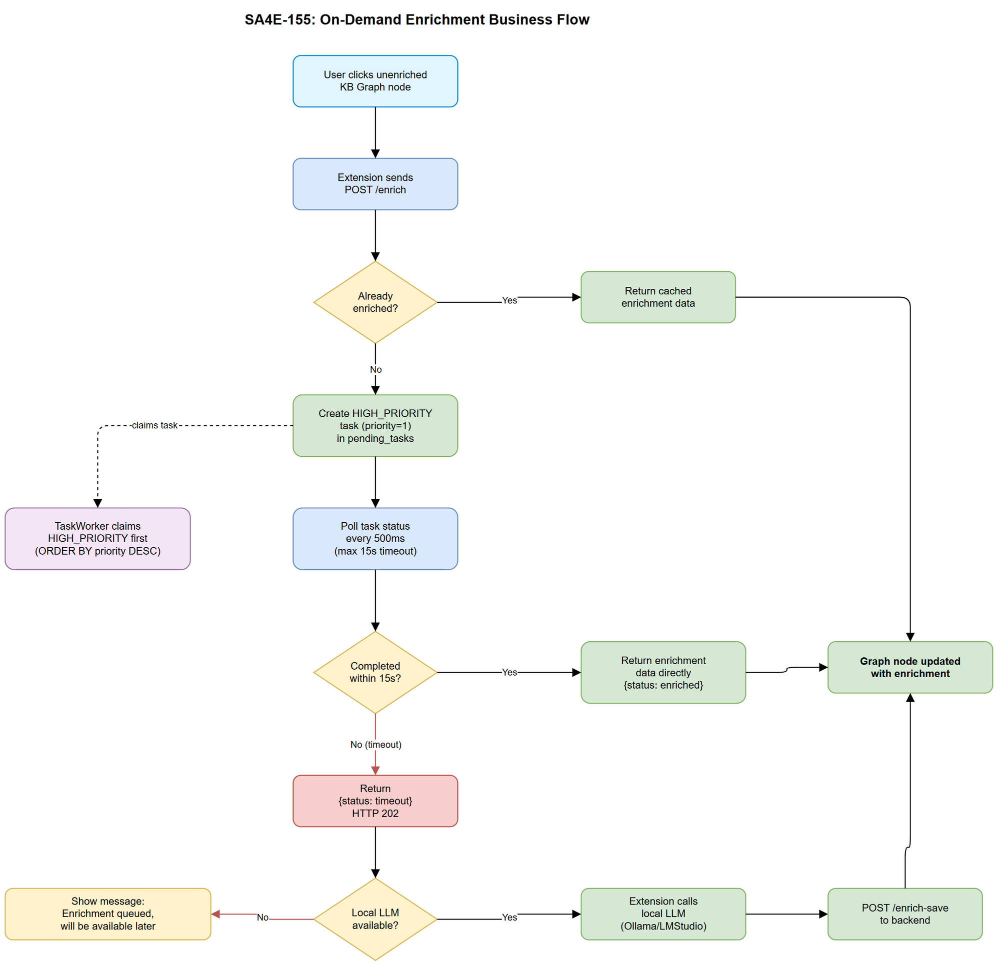
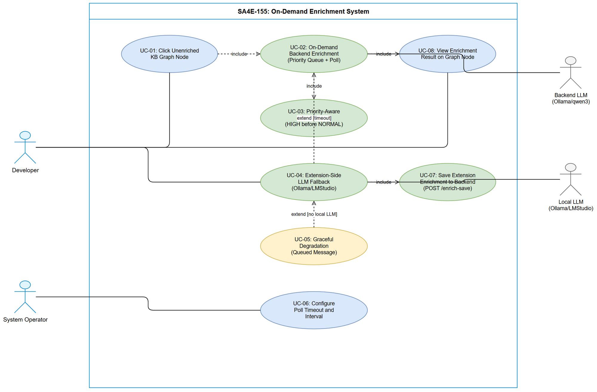

# Business Requirements Document (BRD)

## SA4E — SA4E-155: [Enrichment] On-demand KB entry enrichment with priority queue + timeout + extension LLM fallback

---

## Document Information

| Field | Value |
|-------|-------|
| Jira Ticket | SA4E-155 |
| Title | On-demand KB entry enrichment with priority queue + timeout + extension LLM fallback |
| Author | BA Agent |
| Version | 1.0 |
| Date | 2026-08-14 |
| Status | Draft |

---

## Author Tracking

| Role | Name - Position | Responsibility |
|------|-----------------|----------------|
| Author | BA Agent – Business Analyst | Create document |
| Peer Reviewer | TA Agent – Technical Architect | Review document |

---

## Revision History

| Version | Date | Author | Changes |
|---------|------|--------|---------|
| 1.0 | 2026-08-14 | BA Agent | Initiate document — auto-generated from Jira ticket SA4E-155 |

---

## Sign-Off

| Name | Signature and date |
|------|--------------------|
| | ☐ I agree and confirm all criteria on this BRD as expected requirements |
| | ☐ I agree and confirm all criteria on this BRD as expected requirements |

---

## 1. Introduction

### 1.1 Scope

This change request implements on-demand KB entry enrichment for the SA4E Knowledge Base Graph. When a user clicks a node on the KB Graph that has not yet been LLM-enriched (no summary/pseudo code), the system must enrich it immediately rather than placing it into the backlog queue (~18k+ tasks). The solution introduces a priority queue mechanism, polling with configurable timeout, and an extension-side LLM fallback for graceful degradation.

**Architecture Pattern: AI Agent System** — This feature involves prompt engineering for enrichment, context budget management (LLM token limits), tool interaction between extension and backend, agent coordination (backend TaskWorker vs extension LLM), and failure mode fallback behaviors.

### 1.2 Out of Scope

- Bulk enrichment optimization (batch processing improvements)
- LLM model selection UI in the extension
- TaskWorker horizontal scaling / multi-instance coordination
- Queue management admin UI for prioritization
- Automatic retry of timed-out on-demand enrichments
- Ollama/LMStudio installation or configuration guidance

### 1.3 Preliminary Requirement

- TaskWorker is running with concurrency=6, baseInterval=2s (already implemented SA4E-44/SA4E-47)
- Extension has `enrich_code_symbol` message type for client-side enrichment (already implemented SA4E-106)
- Backend endpoint `/api/admin/kb/entries/:id/enrich` exists (current implementation queues task)
- Backend endpoint `/api/admin/kb/entries/:id/enrich-save` exists for extension-side save
- LLM service (Ollama/qwen3 or LMStudio) configured in backend

---

## 2. Business Requirements

### 2.1 High Level Process Map

The on-demand enrichment flow provides instant LLM analysis when a user interacts with an unenriched KB Graph node. The system attempts backend enrichment with priority escalation and a 15-second timeout window. If the backend cannot complete in time, the extension attempts local LLM enrichment as a fallback. If no local LLM is available, the system gracefully degrades with a queued notification.

### 2.2 List of User Stories / Use Cases

| # | Story / Use Case / Epic | Priority | Source Ticket |
|---|-------------------------|----------|---------------|
| 1 | As a developer, I want to see enrichment data immediately when clicking an unenriched KB node, so that I don't have to wait for the 18k+ task backlog to process | MUST HAVE | SA4E-155 |
| 2 | As a system operator, I want high-priority tasks to be processed before normal tasks, so that on-demand requests get priority over background batch work | MUST HAVE | SA4E-155 |
| 3 | As a developer, I want the extension to use my local LLM when the backend times out, so that I still get enrichment without waiting for the server | MUST HAVE | SA4E-155 |
| 4 | As a developer, I want a clear message when enrichment is queued for later, so that I know it will eventually be processed | SHOULD HAVE | SA4E-155 |
| 5 | As a system operator, I want the timeout duration to be configurable, so that I can tune the UX vs server load tradeoff | SHOULD HAVE | SA4E-155 |

---

### 2.3 Details of User Stories

---

#### Business Flow

**Step 1:** User clicks an unenriched node on KB Graph in the extension webview

**Step 2:** Extension sends POST `/api/admin/kb/entries/:id/enrich` request to backend

**Step 3:** Backend checks if entry is already enriched — if yes, return cached data immediately

**Step 4:** Backend creates a HIGH_PRIORITY task in pending_tasks table (priority=1)

**Step 5:** Backend begins polling task status every 500ms for up to 15 seconds (configurable)

**Step 6:** TaskWorker claims next task using priority-aware ordering (priority DESC, created_at ASC)

**Step 7A (Happy Path):** TaskWorker completes LLM enrichment within 15s — Backend returns enrichment data to extension

**Step 7B (Timeout Path):** 15 seconds elapse without completion — Backend returns `{status: "timeout"}`

**Step 8:** Extension receives timeout — checks for local LLM availability (Ollama, LMStudio)

**Step 9A (Local LLM Available):** Extension calls local LLM — generates summary + pseudo_code — sends result to backend via POST `/enrich-save`

**Step 9B (No Local LLM):** Extension shows user message "Enrichment queued, will be available later"

> **Note:** The priority queue ensures on-demand requests jump ahead of the ~18k task backlog without starving normal tasks completely (normal tasks still process when no high-priority work exists).

---

#### STORY 1: On-Demand Priority Enrichment via Backend

> As a developer, I want to see enrichment data immediately when clicking an unenriched KB node, so that I don't have to wait for the 18k+ task backlog to process.

**Requirement Details:**

1. POST `/api/admin/kb/entries/:id/enrich` endpoint must create a HIGH_PRIORITY task (priority=1) instead of normal priority (priority=0)
2. After creating the task, the endpoint must poll the task status every 500ms
3. Polling continues for a maximum of 15 seconds (configurable via environment variable `ENRICH_POLL_TIMEOUT_MS`, default 15000)
4. If task reaches COMPLETED status within timeout — return enrichment data (summary, pseudo_code, llm_tags) directly in the response
5. If timeout expires — return `{status: "timeout"}` with HTTP 202 Accepted
6. If LLM service is unavailable — return `{status: "llm_unavailable"}` with HTTP 503

**Data Fields:**

| Field | Type | Required | Description | Example |
|-------|------|----------|-------------|---------|
| priority | INTEGER | Yes | Task priority level (0=normal, 1=high) | 1 |
| ENRICH_POLL_TIMEOUT_MS | ENV | No | Configurable timeout in ms | 15000 |
| ENRICH_POLL_INTERVAL_MS | ENV | No | Poll interval in ms | 500 |
| status | STRING | Yes | Response status field | "enriched" / "timeout" / "llm_unavailable" |

**Acceptance Criteria:**

1. Priority column (INTEGER, default 0) is added to pending_tasks table
2. On-demand enrich endpoint creates task with priority=1
3. Endpoint polls task completion with 500ms interval
4. If task completes within 15s — response contains enrichment data with HTTP 200
5. If timeout (15s) — response is `{status: "timeout"}` with HTTP 202
6. If backend LLM unavailable — response is `{status: "llm_unavailable"}` with HTTP 503
7. Existing background task creation (priority=0) continues to work unchanged

**Validation Rules:**

- Entry ID must be a valid code symbol ID (`code:` or `sym-` prefix) or KB entry ID (`kb-entry:` or `pega:` prefix)
- Entry must not already be enriched (enrichment_status != 'COMPLETED')
- Timeout must be positive integer > 0

**Error Handling:**

- Entry not found: HTTP 404 `{error: "Entry not found"}`
- Invalid entry type: HTTP 400 `{error: "Unsupported entry type for on-demand enrichment"}`
- Already enriched: HTTP 200 `{status: "already_enriched", enrichment: {...}}`
- LLM service down: HTTP 503 `{status: "llm_unavailable", message: "Backend LLM not available..."}`
- Internal error during polling: HTTP 500 `{error: "...", details: "..."}`

---

#### STORY 2: Priority-Aware Task Claiming

> As a system operator, I want high-priority tasks to be processed before normal tasks, so that on-demand requests get priority over background batch work.

**Requirement Details:**

1. Add `priority` column (INTEGER, NOT NULL, DEFAULT 0) to `pending_tasks` table
2. Modify `PendingTaskRepository.claimNext()` to ORDER BY priority DESC, created_at ASC
3. Modify `PendingTaskRepository.claimBatch(count)` to ORDER BY priority DESC, created_at ASC
4. Priority values: 0 = NORMAL (background batch), 1 = HIGH (on-demand user request)
5. TaskWorker must respect priority ordering without any code change beyond the repository query modification

**Data Fields:**

| Field | Type | Required | Description | Example |
|-------|------|----------|-------------|---------|
| priority | INTEGER | Yes | Column in pending_tasks table | 0 (normal), 1 (high) |

**Acceptance Criteria:**

1. `pending_tasks` table has `priority` column with DEFAULT 0
2. `claimNext()` returns highest priority task first, then oldest within same priority
3. `claimBatch(N)` returns N tasks ordered by priority DESC, created_at ASC
4. Existing tasks (18k+ backlog) have priority=0 by default
5. New on-demand tasks created with priority=1
6. No starvation: normal tasks still process when no high-priority tasks exist
7. Database migration is backward-compatible (column addition with default value)

**Validation Rules:**

- Priority must be 0 or 1 (extensible to higher values in future)
- Default priority for all existing task creation paths remains 0

**Error Handling:**

- Migration failure: log error, system continues with existing behavior (graceful degradation)

---

#### STORY 3: Extension-Side LLM Fallback

> As a developer, I want the extension to use my local LLM when the backend times out, so that I still get enrichment without waiting for the server.

**Requirement Details:**

1. When backend returns `{status: "timeout"}` or `{status: "llm_unavailable"}`, the extension initiates local LLM fallback
2. Extension checks local LLM availability: Ollama (default port 11434) or LMStudio (default port 1234)
3. If local LLM available — extension generates enrichment (summary + pseudo_code) using local LLM
4. Extension sends enrichment result to backend via POST `/api/admin/kb/entries/:id/enrich-save`
5. Extension updates the KB Graph node in the webview with the enrichment data
6. If no local LLM available — extension shows message "Enrichment queued, will be available later"

**Prompt Engineering Requirements (AI Agent Pattern):**

| Aspect | Specification |
|--------|---------------|
| System Prompt | Code analyst role: produce JSON with summary + pseudo_code |
| Temperature | 0.3 (deterministic, factual output) |
| Max Tokens | 800 (budget constraint for local LLM) |
| Output Format | JSON `{summary: string, pseudo_code: string}` |
| Context Budget | Source code content truncated to 4000 chars max |
| Fallback Model | Any available local model (Ollama/qwen3, LMStudio) |

**Context Budget Constraints:**

- Input: symbol source code (max 4000 chars to fit within local LLM context windows)
- Output: JSON with summary (1-3 sentences) + pseudo_code (numbered steps)
- Total token budget per enrichment: ~1000 tokens output

**Acceptance Criteria:**

1. Extension detects "timeout" or "llm_unavailable" status from backend response
2. Extension probes local Ollama (http://localhost:11434/api/tags) for availability
3. Extension probes local LMStudio (http://localhost:1234/v1/models) for availability
4. If local LLM found — enrichment generated within 30s timeout
5. Enrichment result saved to backend via `/enrich-save` endpoint
6. KB Graph node updated in webview immediately after enrichment
7. If no local LLM — user sees "Enrichment queued, will be available later" message
8. Extension-side enrichment does not block the main extension thread (async/non-blocking)

**Tool Interaction Specifications (AI Agent Pattern):**

| Tool/Endpoint | Direction | Payload |
|---------------|-----------|---------|
| POST `/enrich` | Extension to Backend | `{id}` |
| Response (timeout) | Backend to Extension | `{status: "timeout"}` |
| Local LLM call | Extension to Ollama/LMStudio | System prompt + code content |
| POST `/enrich-save` | Extension to Backend | `{summary, pseudoCode}` |
| Webview message | Extension to Webview | `{type: "enrich_code_symbol_result", ...}` |

**Agent Coordination Patterns:**

- Backend TaskWorker and Extension LLM are independent agents working on the same goal
- Race condition guard: if TaskWorker completes after extension already enriched — backend's `enrich-save` uses COALESCE to not overwrite existing data
- Deduplication: `EnrichmentDedup` class prevents concurrent enrichment of the same entry from extension side

**Failure Modes and Fallback Behaviors:**

| Failure Mode | Detection | Fallback |
|--------------|-----------|----------|
| Backend LLM down | HTTP 503 response | Extension local LLM |
| Backend timeout | 15s elapsed, HTTP 202 | Extension local LLM |
| Local LLM down | Connection refused to Ollama/LMStudio ports | Show "queued" message |
| Local LLM timeout | 30s without response | Show "queued" message |
| Local LLM parse error | JSON parse fails on response | Show "queued" message |
| Network error | Connection reset/timeout | Show error toast |

**Error Handling:**

- Local LLM connection refused: graceful fallback to "queued" message
- Local LLM response parse error: log warning, show "queued" message
- `/enrich-save` call failure: log error, enrichment data still shown locally in current session

---

#### STORY 4: Graceful Degradation UX

> As a developer, I want a clear message when enrichment is queued for later, so that I know it will eventually be processed.

**Requirement Details:**

1. When both backend and extension LLM are unavailable, show a non-blocking notification in the KB Graph webview
2. Message text: "Enrichment queued, will be available later"
3. The notification should auto-dismiss after 5 seconds or be closable by user
4. The node should show a visual indicator (e.g., clock icon) that enrichment is pending

**Acceptance Criteria:**

1. User sees informative message (not error) when enrichment cannot be completed immediately
2. Message is non-blocking — user can continue interacting with the graph
3. The underlying task remains in the queue and will be processed when TaskWorker catches up
4. No data loss — the HIGH_PRIORITY task stays in the queue regardless of extension fallback result

---

#### STORY 5: Configurable Timeout

> As a system operator, I want the timeout duration to be configurable, so that I can tune the UX vs server load tradeoff.

**Requirement Details:**

1. Timeout configurable via environment variable `ENRICH_POLL_TIMEOUT_MS` (default: 15000)
2. Poll interval configurable via environment variable `ENRICH_POLL_INTERVAL_MS` (default: 500)
3. Both values also configurable via Admin UI (persisted in admin config DB, same pattern as TaskWorker config)
4. Runtime config changes apply immediately (no restart required)

**Acceptance Criteria:**

1. Default timeout is 15000ms (15 seconds)
2. Default poll interval is 500ms
3. Environment variables override defaults
4. Admin UI config overrides environment variables
5. Config change takes effect on next enrich request (no restart)

---

## 3. Dependencies

| Dependency | Type | Related Ticket | Description |
|------------|------|----------------|-------------|
| TaskWorker (SA4E-44/SA4E-47) | System | SA4E-44 | Background task processing infrastructure must be running |
| Extension enrich_code_symbol (SA4E-106) | System | SA4E-106 | Client-side enrichment message type and handler must exist |
| LLM Service (Ollama/LMStudio) | External | N/A | At least one LLM must be available (backend or local) for enrichment |
| PendingTaskRepository | System | SA4E-44 | Repository CRUD operations for task queue |
| EnrichmentDedup (SA4E-79) | System | SA4E-79 | Prevents concurrent enrichment of same entry |
| KB Graph Webview | System | N/A | Frontend graph visualization that triggers on-demand enrichment |
| SQLite/PostgreSQL | Infrastructure | N/A | Database schema migration for priority column |

---

## 4. Stakeholders

| Role | Name / Team | Responsibility | Source |
|------|-------------|----------------|--------|
| Developer (End User) | Development Team | Uses KB Graph, triggers on-demand enrichment | Primary user |
| System Operator | DevOps Team | Configures timeout, monitors TaskWorker | Operational |
| Product Owner | Project Lead | Approves UX flow and degradation behavior | Decision maker |

---

## 5. Risks and Assumptions

### 5.1 Risks

| Risk | Impact | Likelihood | Mitigation |
|------|--------|------------|------------|
| High-priority tasks could starve normal tasks if many users click simultaneously | Medium | Low | Priority queue is FIFO within same priority; only on-demand creates HIGH; 6 concurrent workers handle throughput |
| Backend polling for 15s holds HTTP connection open (long polling) | Medium | Medium | Use server-side async polling loop, not blocking thread; connection timeout configurable |
| Local LLM (Ollama) may produce lower quality enrichment than backend LLM | Low | Medium | Acceptable tradeoff — local enrichment provides immediate value; backend can re-enrich later if needed |
| Race condition: TaskWorker and extension both complete enrichment | Low | Medium | COALESCE in SQL update prevents overwrite; first-write-wins semantics |
| 15s timeout may not be sufficient under heavy load | Medium | Low | Timeout is configurable; can be increased per deployment |

### 5.2 Assumptions

- TaskWorker continues running with concurrency=6 and baseInterval=2s
- At least one LLM (backend Ollama or local Ollama/LMStudio) is typically available
- Current backlog of ~18k tasks consists of normal-priority batch enrichment
- SQLite WAL mode or PostgreSQL allows concurrent reads during long-polling without blocking writes
- Extension has network access to localhost for local LLM probing
- Users interact with KB Graph nodes one at a time (not bulk-clicking dozens of nodes)

---

## 6. Non-Functional Requirements

| Category | Requirement | Details |
|----------|-------------|---------|
| Performance | On-demand enrichment response within 15s (configurable) | Backend attempts LLM within timeout window; extension fallback adds up to 30s more |
| Performance | Poll interval 500ms | Minimal overhead; ~30 polls maximum per request |
| Performance | Priority task claimed within 2s of creation | TaskWorker base interval is 2s; priority ensures immediate pickup on next poll cycle |
| Scalability | Priority queue handles 18k+ existing tasks without degradation | ORDER BY priority DESC, created_at ASC with proper index |
| Availability | Graceful degradation through 3-tier fallback | Backend LLM — Extension local LLM — Queued notification |
| Security | All enrichment endpoints require JWT authentication | Existing auth middleware applies |
| Reliability | No data loss on timeout | HIGH_PRIORITY task remains in queue regardless of timeout or fallback |
| Observability | Log enrichment source (backend_llm vs extension_llm) | Tracking which path produced each enrichment for quality analysis |

---

## 7. Related Tickets

| Ticket Key | Summary | Status | Type | Relationship |
|------------|---------|--------|------|--------------|
| SA4E-155 | On-demand KB entry enrichment with priority queue + timeout + extension LLM fallback | To Do | Story | Main ticket |
| SA4E-44 | TaskWorker background processing | Done | Story | Dependency (task queue infrastructure) |
| SA4E-47 | Enhanced Tag Enrichment | Done | Story | Dependency (enrichment logic) |
| SA4E-79 | Client-side KB entry enrichment | Done | Story | Dependency (extension enrichment, EnrichmentDedup) |
| SA4E-101 | TaskWorker progress polling | Done | Story | Related (progress status bar) |
| SA4E-106 | Extension-side code symbol enrichment fallback | Done | Story | Dependency (enrich_code_symbol message type) |
| SA4E-107 | Code enrichment task creation | Done | Story | Dependency (CodeEnrichmentTaskCreator) |

---

## 8. Appendix

### Glossary

| Term | Definition |
|------|------------|
| On-demand enrichment | User-triggered immediate LLM analysis of a KB entry, bypassing the normal task queue backlog |
| Priority Queue | pending_tasks table with priority column enabling HIGH_PRIORITY tasks to be claimed before NORMAL tasks |
| TaskWorker | Background polling worker that claims and processes pending tasks (concurrency=6) |
| Extension LLM Fallback | Extension-side mechanism using local Ollama/LMStudio when backend LLM is unavailable or times out |
| Enrichment | LLM-generated summary and pseudo_code for a code symbol or KB entry |
| HIGH_PRIORITY | priority=1 flag on a pending task, indicating on-demand user request |
| NORMAL | priority=0 flag on a pending task, indicating background batch processing |
| Graceful Degradation | System behavior that provides progressively reduced functionality rather than complete failure |

### Reference Documents

| Document | Link / Location |
|----------|-----------------|
| TaskWorker Implementation | backend/src/modules/memory/task-queue/TaskWorker.ts |
| PendingTaskRepository | backend/src/modules/memory/task-queue/PendingTaskRepository.ts |
| On-demand Enrich Endpoint | backend/src/server/routes/admin/kb-entries.ts |
| Extension GraphPanel Handler | extension/src/panels/graph-panel.ts |
| EnrichmentDedup | extension/src/langgraph/enrichment/EnrichmentDedup.ts |
| EnrichmentObserver | extension/src/langgraph/enrichment/EnrichmentObserver.ts |

### Use Case Diagram

### Diagram Index

| # | Diagram | Image | Source (editable) |
|---|---------|-------|-------------------|
| 1 | Business Flow | [business-flow.png](diagrams/business-flow.png) | [business-flow.drawio](diagrams/business-flow.drawio) |
| 2 | Use Case | [use-case.png](diagrams/use-case.png) | [use-case.drawio](diagrams/use-case.drawio) |
