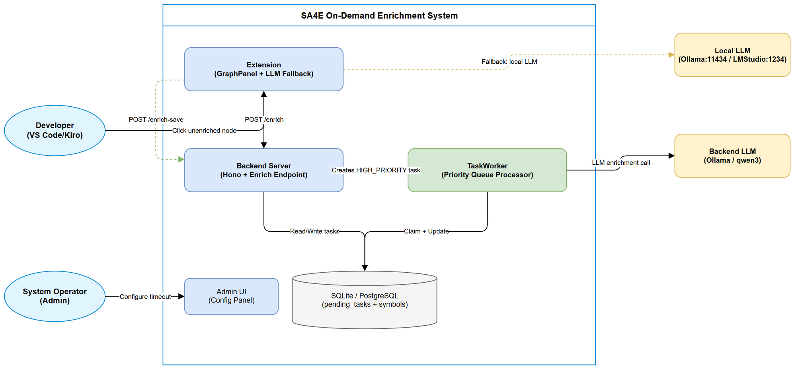
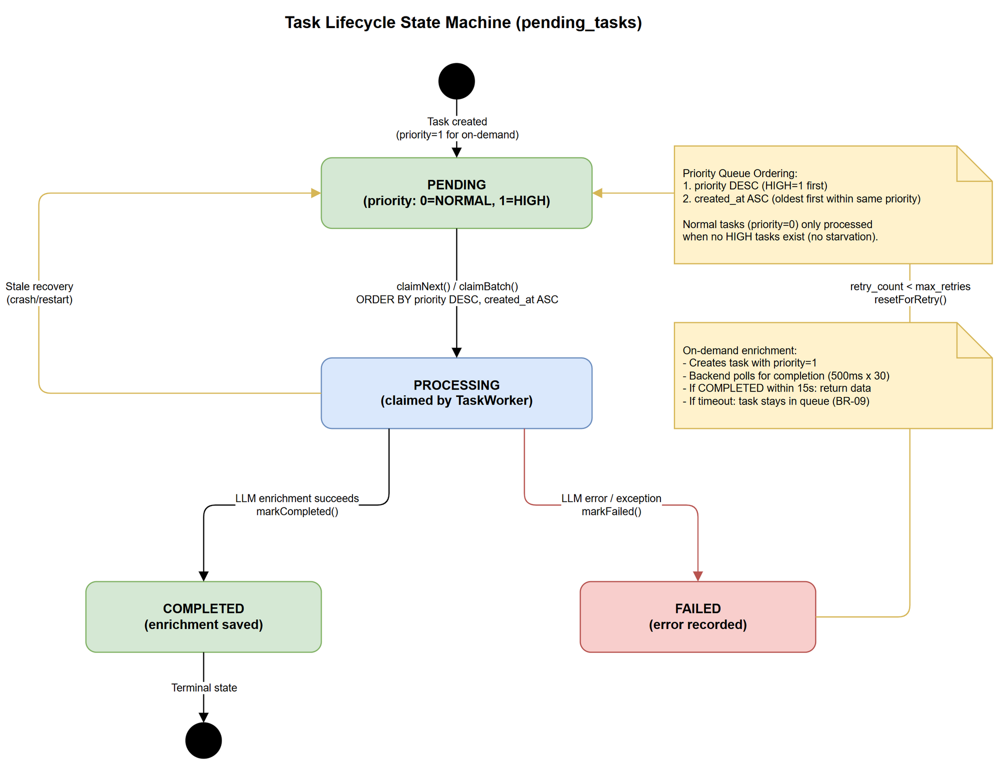
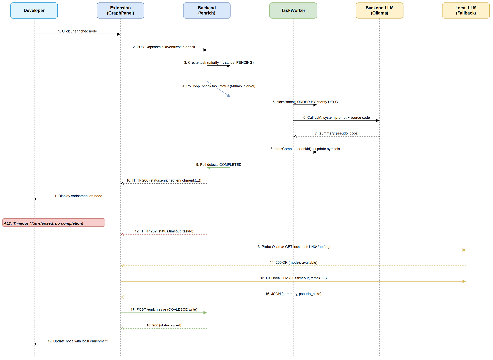

# Functional Specification Document (FSD)

## SA4E — SA4E-155: On-demand KB entry enrichment with priority queue + timeout + extension LLM fallback

---

## Document Information

| Field | Value |
|-------|-------|
| Jira Ticket | SA4E-155 |
| Title | On-demand KB entry enrichment with priority queue + timeout + extension LLM fallback |
| Author | BA Agent |
| Version | 1.1 |
| Date | 2026-08-14 |
| Status | Draft |
| Related BRD | BRD-v1-SA4E-155.docx |

---

## Revision History

| Version | Date | Author | Changes |
|---------|------|--------|---------|
| 1.0 | 2026-08-14 | BA Agent | Initiate document — auto-generated from BRD and Jira ticket SA4E-155 |
| 1.1 | 2026-08-14 | TA Agent | Technical enrichment: API contracts (Zod schemas, HTTP codes, rate limiting), Integration specs (Ollama/LMStudio), Pseudocode, Data model alignment, NFRs quantified, Open Issues, Security review |

---

## 1. Introduction

### 1.1 Purpose

This FSD translates the business requirements from the SA4E-155 BRD into functional specifications that the Solution Architect can use to create the Technical Design Document. It covers the on-demand KB entry enrichment feature with priority queue, configurable polling timeout, and extension-side LLM fallback.

### 1.2 Scope

The system modifications encompass:
- Backend: Priority-aware task queue (new `priority` column), polling endpoint with configurable timeout
- Extension: Local LLM fallback (Ollama/LMStudio), graceful degradation UX
- Configuration: Environment variables and Admin UI settings for timeout tuning

### 1.3 Definitions & Acronyms

| Term | Definition |
|------|------------|
| On-demand enrichment | User-triggered immediate LLM analysis of a KB entry, bypassing the normal task queue backlog |
| Priority Queue | pending_tasks table with priority column enabling HIGH_PRIORITY tasks to be claimed before NORMAL tasks |
| TaskWorker | Background polling worker that claims and processes pending tasks (concurrency=6, baseInterval=2s) |
| Extension LLM Fallback | Extension-side mechanism using local Ollama/LMStudio when backend LLM is unavailable or times out |
| Enrichment | LLM-generated summary and pseudo_code for a code symbol or KB entry |
| HIGH_PRIORITY | priority=1 flag on a pending task, indicating on-demand user request |
| NORMAL | priority=0 flag on a pending task, indicating background batch processing |
| Graceful Degradation | System behavior that provides progressively reduced functionality rather than complete failure |
| EnrichmentDedup | In-memory dedup class preventing concurrent enrichment of same entry from extension side |

### 1.4 References

| Document | Location |
|----------|----------|
| BRD | BRD-v1-SA4E-155.docx |
| TaskWorker Implementation | backend/src/modules/memory/task-queue/TaskWorker.ts |
| PendingTaskRepository | backend/src/modules/memory/task-queue/PendingTaskRepository.ts |
| KB Entries Routes | backend/src/server/routes/admin/kb-entries.ts |
| GraphPanel Handler | extension/src/panels/graph-panel.ts |
| EnrichmentDedup | extension/src/langgraph/enrichment/EnrichmentDedup.ts |

---

## 2. System Overview

### 2.1 System Context Diagram



The on-demand enrichment system involves four primary actors/systems:
- **Developer** (via VS Code/Kiro Extension) — triggers enrichment by clicking unenriched KB Graph nodes
- **Backend Server** (Hono + TaskWorker) — manages task queue, processes enrichment via LLM service
- **Backend LLM** (Ollama/LMStudio on server) — generates summary + pseudo_code for code symbols
- **Local LLM** (Ollama/LMStudio on developer machine) — fallback when backend LLM unavailable/timeout

### 2.2 System Architecture

The feature operates across two runtime contexts:

**Backend (Node.js + Hono):**
- `POST /api/admin/kb/entries/:id/enrich` — creates HIGH_PRIORITY task, polls for completion
- `PendingTaskRepository.claimNext()` — priority-aware task claiming (ORDER BY priority DESC, created_at ASC)
- `TaskWorker` — background worker processing tasks with concurrency=6
- `POST /api/admin/kb/entries/:id/enrich-save` — saves extension-side enrichment results

**Extension (VS Code/Kiro):**
- `GraphPanel.handleEnrichCodeSymbol()` — initiates backend enrichment call
- Local LLM probe — checks Ollama (port 11434) and LMStudio (port 1234) availability
- `EnrichmentDedup` — prevents concurrent enrichment of same entry

---

## 3. Functional Requirements

### 3.1 Feature: On-Demand Priority Enrichment

**Source:** BRD Story 1

#### 3.1.1 Description

When a developer clicks an unenriched node on the KB Graph, the system immediately creates a HIGH_PRIORITY task and polls for its completion within a configurable timeout window (default 15s). If completed in time, enrichment data is returned directly. Otherwise, a timeout status triggers the extension fallback chain.

#### 3.1.2 Use Cases

---

**Use Case ID:** UC-01
**Name:** Successful On-Demand Enrichment (Happy Path)
**Actor:** Developer
**Preconditions:**
- Developer is authenticated and has KB_WRITE permission
- KB Graph is loaded in extension webview
- Target node is unenriched (enrichment_status != 'COMPLETED')
- Backend LLM service is running and responsive

**Postconditions:**
- Node shows summary + pseudo_code in the graph detail panel
- symbols table updated with enrichment_status = 'COMPLETED'
- pending_tasks entry marked COMPLETED

**Main Flow:**

| Step | Actor | System | Description |
|------|-------|--------|-------------|
| 1 | Developer clicks unenriched node | | User interaction on KB Graph webview |
| 2 | | Extension sends POST `/api/admin/kb/entries/:id/enrich` | HTTP request with JWT auth header |
| 3 | | Backend validates entry exists, is unenriched | Check symbols table |
| 4 | | Backend creates HIGH_PRIORITY task (priority=1) | INSERT into pending_tasks |
| 5 | | Backend begins polling loop (500ms interval) | Check task status every ENRICH_POLL_INTERVAL_MS |
| 6 | | TaskWorker claims HIGH_PRIORITY task | claimNext() with priority-aware ordering |
| 7 | | TaskWorker calls LLM for enrichment | CodeEnrichmentHandler.enrichSymbol() |
| 8 | | TaskWorker marks task COMPLETED | Updates pending_tasks + symbols table |
| 9 | | Backend polling detects COMPLETED status | Returns enrichment data to extension |
| 10 | | Extension updates KB Graph node | Shows summary + pseudo_code in detail panel |

**Alternative Flows:**

| ID | Condition | Steps |
|----|-----------|-------|
| AF-01 | Entry already enriched | Step 3: Backend returns `{status: "already_enriched", enrichment: {...}}` with HTTP 200. Flow ends. |
| AF-02 | Entry is pega/kb-entry type | Step 3: Backend creates TAG_ENRICHMENT task instead of CODE_ENRICHMENT. Same polling logic applies. |

**Exception Flows:**

| ID | Condition | Steps |
|----|-----------|-------|
| EF-01 | Entry not found | Step 3: Return HTTP 404 `{error: "Entry not found"}`. Extension shows error toast. |
| EF-02 | Invalid entry type | Step 3: Return HTTP 400 `{error: "Unsupported entry type for on-demand enrichment"}`. |
| EF-03 | Internal error during polling | Step 5-9: Return HTTP 500 `{error: "...", details: "..."}`. Extension triggers fallback. |

---

**Use Case ID:** UC-02
**Name:** Backend Timeout with Extension Local LLM Fallback
**Actor:** Developer
**Preconditions:**
- Backend LLM is slow or overloaded (processing takes >15s)
- Local LLM (Ollama or LMStudio) is running on developer machine

**Postconditions:**
- Node shows enrichment data generated by local LLM
- Backend symbols table updated via `/enrich-save` endpoint
- Original HIGH_PRIORITY task remains in queue (may complete later — first-write-wins)

**Main Flow:**

| Step | Actor | System | Description |
|------|-------|--------|-------------|
| 1 | Developer clicks unenriched node | | Same as UC-01 Step 1 |
| 2 | | Extension sends POST `/enrich` | Same as UC-01 Step 2 |
| 3 | | Backend creates task, polls for 15s | Same as UC-01 Steps 3-5 |
| 4 | | Backend returns `{status: "timeout"}` HTTP 202 | Polling exhausted without completion |
| 5 | | Extension detects timeout response | Initiates local LLM fallback |
| 6 | | Extension probes Ollama (localhost:11434/api/tags) | HTTP GET with 3s timeout |
| 7 | | Extension calls local LLM with code content | System prompt + source code (max 4000 chars) |
| 8 | | Extension receives + parses JSON response | Extract summary + pseudo_code |
| 9 | | Extension sends POST `/enrich-save` to backend | Save enrichment result to DB |
| 10 | | Extension updates KB Graph node | Shows locally-generated enrichment |

**Alternative Flows:**

| ID | Condition | Steps |
|----|-----------|-------|
| AF-03 | Ollama not available, LMStudio available | Step 6: Probe LMStudio (localhost:1234/v1/models) instead. Continue from Step 7. |
| AF-04 | Backend returns `{status: "llm_unavailable"}` | Step 4: Extension skips waiting, immediately starts fallback at Step 5. |

**Exception Flows:**

| ID | Condition | Steps |
|----|-----------|-------|
| EF-04 | Local LLM response not valid JSON | Step 8: Log parse error, go to UC-03 (graceful degradation). |
| EF-05 | Local LLM timeout (>30s) | Step 7: Abort local call, go to UC-03. |
| EF-06 | `/enrich-save` fails | Step 9: Log error, enrichment still shown locally in current session but not persisted. |

---

**Use Case ID:** UC-03
**Name:** Graceful Degradation (No LLM Available)
**Actor:** Developer
**Preconditions:**
- Backend LLM unavailable or timed out
- No local LLM available (neither Ollama nor LMStudio running)

**Postconditions:**
- User sees non-blocking notification: "Enrichment queued, will be available later"
- HIGH_PRIORITY task remains in pending_tasks queue
- Node shows pending indicator (clock icon)

**Main Flow:**

| Step | Actor | System | Description |
|------|-------|--------|-------------|
| 1 | | Extension receives timeout/llm_unavailable | From backend response |
| 2 | | Extension probes Ollama — connection refused | localhost:11434 not reachable |
| 3 | | Extension probes LMStudio — connection refused | localhost:1234 not reachable |
| 4 | | Extension shows notification toast | "Enrichment queued, will be available later" |
| 5 | | Node displays pending indicator | Clock icon on the graph node |
| 6 | | Toast auto-dismisses after 5s | Or user clicks dismiss |

---

**Use Case ID:** UC-04
**Name:** Priority-Aware Task Claiming
**Actor:** System (TaskWorker)
**Preconditions:**
- TaskWorker is running (concurrency=6, baseInterval=2s)
- pending_tasks contains both NORMAL (priority=0) and HIGH (priority=1) tasks

**Postconditions:**
- HIGH_PRIORITY tasks processed before NORMAL tasks
- No starvation: NORMAL tasks process when no HIGH tasks exist

**Main Flow:**

| Step | Actor | System | Description |
|------|-------|--------|-------------|
| 1 | | TaskWorker poll cycle triggers | Every baseInterval (2s) |
| 2 | | TaskWorker calls claimBatch(concurrency) | Up to 6 tasks |
| 3 | | Repository queries: ORDER BY priority DESC, created_at ASC | HIGH tasks first, then oldest NORMAL |
| 4 | | TaskWorker processes claimed tasks | Concurrent execution up to 6 |
| 5 | | Next poll cycle | Repeat from Step 1 |

**Alternative Flows:**

| ID | Condition | Steps |
|----|-----------|-------|
| AF-05 | No HIGH_PRIORITY tasks exist | Step 3: Returns NORMAL tasks ordered by created_at ASC (FIFO). |
| AF-06 | Multiple HIGH_PRIORITY tasks | Step 3: Returns all HIGH first, ordered by created_at ASC within same priority. |

---

**Use Case ID:** UC-05
**Name:** Race Condition Resolution (Backend + Extension Both Enrich)
**Actor:** System
**Preconditions:**
- Backend LLM starts enrichment (task claimed by TaskWorker)
- Timeout occurs, extension also generates enrichment via local LLM
- Extension calls `/enrich-save` while TaskWorker is still processing

**Postconditions:**
- First-write-wins: whichever completes first persists
- No data corruption — COALESCE prevents overwrite of existing data

**Main Flow:**

| Step | Actor | System | Description |
|------|-------|--------|-------------|
| 1 | | Extension calls POST `/enrich-save` | With summary + pseudoCode from local LLM |
| 2 | | Backend uses COALESCE update | `SET summary = COALESCE(?, summary)` — only writes if field is NULL |
| 3 | | TaskWorker later completes enrichment | Tries to update same symbol |
| 4 | | CodeEnrichmentHandler update | Also uses COALESCE — won't overwrite extension's data |
| 5 | | Final state | First-write-wins semantics preserved |

---

**Use Case ID:** UC-06
**Name:** Configurable Timeout via Environment Variables
**Actor:** System Operator
**Preconditions:**
- Server is deployed with environment variables set

**Postconditions:**
- Polling uses configured timeout and interval values
- Changes apply on next request (no restart required for admin UI config)

**Main Flow:**

| Step | Actor | System | Description |
|------|-------|--------|-------------|
| 1 | Operator sets ENRICH_POLL_TIMEOUT_MS=20000 | | In environment or Admin UI |
| 2 | | Server reads config on startup | Env vars loaded into config |
| 3 | Developer triggers on-demand enrichment | | Clicks unenriched node |
| 4 | | Backend polls for 20s instead of default 15s | Uses configured timeout |

---

**Use Case ID:** UC-07
**Name:** Configurable Timeout via Admin UI
**Actor:** System Operator
**Preconditions:**
- Admin UI is accessible
- Operator has ADMIN role

**Postconditions:**
- Config persisted in admin config DB
- Next enrichment request uses new values (no restart)

**Main Flow:**

| Step | Actor | System | Description |
|------|-------|--------|-------------|
| 1 | Operator navigates to Admin > Configuration | | Admin panel |
| 2 | Operator changes Enrich Poll Timeout to 20000 | | Input field |
| 3 | Operator clicks Save | | Form submission |
| 4 | | Backend persists config to admin DB | Same pattern as TaskWorker config |
| 5 | | Next enrich request reads latest config | Runtime config override |

---

**Use Case ID:** UC-08
**Name:** Extension Deduplication Guard
**Actor:** System (Extension)
**Preconditions:**
- Developer rapidly clicks the same unenriched node multiple times
- EnrichmentDedup is active

**Postconditions:**
- Only one enrichment request processed at a time per entry
- Subsequent clicks are silently ignored until first completes or times out (60s stale timeout)

**Main Flow:**

| Step | Actor | System | Description |
|------|-------|--------|-------------|
| 1 | Developer clicks node (first time) | | Triggers enrichment |
| 2 | | EnrichmentDedup.canProcess(entryId) returns true | Not in-flight |
| 3 | | EnrichmentDedup.markInFlight(entryId) | Tracks active request |
| 4 | Developer clicks same node again | | Second click |
| 5 | | EnrichmentDedup.canProcess(entryId) returns false | Already in-flight |
| 6 | | Request silently ignored | No duplicate API call |
| 7 | | First enrichment completes | EnrichmentDedup.release(entryId) |

---

#### 3.1.3 Business Rules

| Rule ID | Rule | Source |
|---------|------|--------|
| BR-01 | On-demand enrichment creates tasks with priority=1 (HIGH). All other task creation paths use priority=0 (NORMAL). | BRD Story 1, AC 2 |
| BR-02 | Task claiming MUST order by priority DESC, then created_at ASC within same priority level. | BRD Story 2, AC 2-3 |
| BR-03 | Default polling timeout is 15000ms, configurable via ENRICH_POLL_TIMEOUT_MS env var or Admin UI. | BRD Story 5, AC 1 |
| BR-04 | Default polling interval is 500ms, configurable via ENRICH_POLL_INTERVAL_MS env var or Admin UI. | BRD Story 5, AC 2 |
| BR-05 | If entry already enriched (enrichment_status = 'COMPLETED'), return cached data immediately without creating a task. | BRD Story 1, Validation |
| BR-06 | Extension fallback probes Ollama first (port 11434), then LMStudio (port 1234). First available is used. | BRD Story 3, AC 2-3 |
| BR-07 | Extension-side enrichment has 30s timeout. If exceeded, graceful degradation (UC-03) applies. | BRD Story 3, AC 4 |
| BR-08 | COALESCE semantics on `/enrich-save`: only writes summary/pseudo_code if the field is currently NULL. First-write-wins. | BRD Story 3, Agent Coordination |
| BR-09 | HIGH_PRIORITY task MUST remain in queue regardless of timeout or fallback outcome. Never deleted on timeout. | BRD NFR: Reliability |
| BR-10 | Admin UI config overrides env vars. Env vars override defaults. Config hierarchy: Admin UI > ENV > Default. | BRD Story 5, AC 3-4 |
| BR-11 | Extension LLM fallback MUST NOT block the main extension thread. All operations are async/non-blocking. | BRD Story 3, AC 8 |
| BR-12 | Source code content sent to local LLM is truncated to 4000 chars max (context budget constraint). | BRD Story 3, Prompt Engineering |
| BR-13 | EnrichmentDedup prevents concurrent enrichment of same entry. Stale timeout is 60s. | Existing implementation (SA4E-79) |
| BR-14 | Priority values are extensible: currently 0 (NORMAL) and 1 (HIGH). Future values >1 are reserved. | BRD Story 2, Validation |

#### 3.1.4 Data Specifications

**Input Data — POST `/api/admin/kb/entries/:id/enrich`:**

| Field | Type | Required | Validation | Description |
|-------|------|----------|------------|-------------|
| id (path param) | string | Yes | Must start with `code:`, `sym-`, `pega:`, or `kb-entry:` prefix | KB entry or code symbol identifier |
| Authorization (header) | string | Yes | Valid JWT token | Bearer token for authentication |

**Output Data — Success (HTTP 200):**

| Field | Type | Description |
|-------|------|-------------|
| status | `"enriched"` | Enrichment completed within timeout |
| enrichment.summary | string or null | LLM-generated summary (1-3 sentences) |
| enrichment.pseudoCode | string or null | Structured pseudo code (numbered steps) |
| enrichment.llmTags | string[] or null | Auto-generated tags |
| enrichment.status | `"COMPLETED"` | Enrichment status |

**Output Data — Timeout (HTTP 202):**

| Field | Type | Description |
|-------|------|-------------|
| status | `"timeout"` | Polling exhausted without completion |
| message | string | Human-readable explanation |
| taskId | number | The pending task ID (for optional manual tracking) |

**Output Data — Already Enriched (HTTP 200):**

| Field | Type | Description |
|-------|------|-------------|
| status | `"already_enriched"` | Entry already has enrichment data |
| enrichment.summary | string | Cached summary |
| enrichment.pseudoCode | string or null | Cached pseudo code |
| enrichment.llmTags | string[] or null | Cached tags |

**Output Data — LLM Unavailable (HTTP 503):**

| Field | Type | Description |
|-------|------|-------------|
| status | `"llm_unavailable"` | Backend LLM not reachable |
| message | string | Explanation + fallback suggestion |
| error | string | Technical error detail |

**Input Data — POST `/api/admin/kb/entries/:id/enrich-save`:**

| Field | Type | Required | Validation | Description |
|-------|------|----------|------------|-------------|
| id (path param) | string | Yes | Must start with `code:` or `sym-` | Code symbol identifier |
| summary | string | No | Max 1000 chars | LLM-generated summary |
| pseudoCode | string | No | Max 5000 chars | Structured pseudo code |
| llmTags | string[] | No | Max 20 items, each max 50 chars | Auto-generated tags |

**Output Data — POST `/enrich-save` Success (HTTP 200):**

| Field | Type | Description |
|-------|------|-------------|
| status | `"saved"` | Enrichment data persisted |
| symbolId | number | Numeric symbol ID |

#### 3.1.5 API Contract (Functional View)

> **Note:** This section defines the functional API contract (what data flows in/out and business error scenarios). Technical details (headers, rate limits, JSON schema, retry policies) are specified in the TDD.

**Endpoint:** `POST /api/admin/kb/entries/:id/enrich`
**Purpose:** Trigger immediate LLM enrichment for a KB entry/code symbol with priority escalation and polling.

**Input Parameters:**

| Parameter | Type | Required | Business Rule | Description |
|-----------|------|----------|---------------|-------------|
| id | string (path) | Yes | BR-05: skip if already enriched | Entry identifier with type prefix |

**Output Data:**

| Field | Type | Description |
|-------|------|-------------|
| status | string | One of: `enriched`, `timeout`, `already_enriched`, `llm_unavailable`, `queued`, `error` |
| enrichment | object or null | Present when status=enriched or already_enriched |
| message | string or null | Human-readable message for non-success states |
| taskId | number or null | Task ID when status=timeout (for tracking) |

**Business Error Scenarios:**

| Scenario | User Message | Trigger Condition |
|----------|-------------|-------------------|
| Entry not found | "Entry not found" | ID doesn't match any symbol or KB entry (BR-05) |
| Invalid entry type | "Unsupported entry type for on-demand enrichment" | ID prefix not recognized |
| Already enriched | "Symbol already has enrichment data" | enrichment_status = 'COMPLETED' |
| Backend LLM down | "Backend LLM not available. Extension-side enrichment may be used as fallback." | LLM service connection refused or error |
| Timeout | "Enrichment task created but not completed within timeout. Task remains queued." | ENRICH_POLL_TIMEOUT_MS elapsed (BR-03) |

---

**Endpoint:** `POST /api/admin/kb/entries/:id/enrich-save`
**Purpose:** Persist enrichment data generated by extension-side local LLM (fallback path).

**Input Parameters:**

| Parameter | Type | Required | Business Rule | Description |
|-----------|------|----------|---------------|-------------|
| id | string (path) | Yes | BR-08: COALESCE write | Code symbol identifier |
| summary | string (body) | No | BR-12: max context budget | LLM-generated summary |
| pseudoCode | string (body) | No | — | Structured pseudo code |
| llmTags | string[] (body) | No | — | Auto-generated tags |

**Business Error Scenarios:**

| Scenario | User Message | Trigger Condition |
|----------|-------------|-------------------|
| Not a code symbol | "Only code symbols support enrichment save" | ID doesn't start with code: or sym- |
| Symbol not found | "Symbol not found" | Numeric ID doesn't exist in symbols table |
| Invalid body | "Missing summary or pseudoCode" | Neither summary nor pseudoCode provided |

---

## 4. Data Model

> **Note:** This section defines the logical data model. Physical implementation (DDL, indexes, migration) is specified in the TDD section 4.

### 4.1 Logical Entities

#### Entity: pending_tasks (Modified)

| Attribute | Type | Required | Business Rule | Description |
|-----------|------|----------|---------------|-------------|
| id | INTEGER (PK) | Yes | — | Auto-increment primary key |
| task_type | ENUM | Yes | — | TAG_ENRICHMENT, VECTOR_EMBEDDING, CODE_ENRICHMENT |
| entry_id | INTEGER | Yes | — | FK to target entry (symbol or KB entry) |
| status | ENUM | Yes | — | PENDING, PROCESSING, COMPLETED, FAILED |
| **priority** | **INTEGER** | **Yes** | **BR-01, BR-02, BR-14** | **NEW: 0=NORMAL, 1=HIGH. DEFAULT 0.** |
| payload | TEXT (JSON) | Yes | — | Task-specific parameters |
| error | TEXT | No | — | Error message on failure |
| retry_count | INTEGER | Yes | — | Current retry attempt |
| max_retries | INTEGER | Yes | — | Max allowed retries (default 3) |
| created_at | DATETIME | Yes | BR-02 | Timestamp for FIFO ordering within priority |
| started_at | DATETIME | No | — | When task claimed by worker |
| completed_at | DATETIME | No | — | When task finished (success or fail) |

#### Entity: symbols (Unchanged — reference)

| Attribute | Type | Required | Business Rule | Description |
|-----------|------|----------|---------------|-------------|
| id | INTEGER (PK) | Yes | — | Symbol identifier |
| enrichment_status | TEXT | No | BR-05 | NULL, 'PENDING', 'COMPLETED' |
| summary | TEXT | No | BR-08 | LLM-generated summary (COALESCE target) |
| pseudo_code | TEXT | No | BR-08 | LLM-generated pseudo code (COALESCE target) |
| enriched_at | DATETIME | No | — | Timestamp of enrichment |

#### Entity: admin_config (Extended)

| Attribute | Type | Required | Business Rule | Description |
|-----------|------|----------|---------------|-------------|
| key | TEXT (PK) | Yes | BR-10 | Config key |
| value | TEXT | Yes | — | Config value (JSON or scalar) |
| updated_at | DATETIME | Yes | — | Last modification timestamp |

**New config keys:**
- `enrich_poll_timeout_ms` — default 15000
- `enrich_poll_interval_ms` — default 500

**Relationships:**

| From Entity | To Entity | Cardinality | Description |
|-------------|-----------|-------------|-------------|
| pending_tasks | symbols | N:1 | Many tasks can reference one symbol (retries) |
| pending_tasks | knowledge_entries | N:1 | Many tasks can reference one KB entry |

---

## 5. Integration Specifications

> **Note:** This section defines what external systems are involved and what data is exchanged. Technical details (timeout, retry, circuit breaker) are in the TDD section 6.

### 5.1 External System: Local Ollama LLM

| Attribute | Value |
|-----------|-------|
| Purpose | Fallback enrichment when backend LLM unavailable or times out |
| Direction | Outbound (Extension to Ollama) |
| Data Format | JSON |
| Frequency | On-demand (per user click) |
| Default Endpoint | http://localhost:11434/api/generate |
| Health Check | GET http://localhost:11434/api/tags |

**Data Exchange:**

| Our Data | External Data | Direction | Business Rule |
|----------|--------------|-----------|---------------|
| System prompt + code content (max 4000 chars) | JSON `{summary, pseudo_code}` | Send/Receive | BR-06, BR-12 |

### 5.2 External System: Local LMStudio

| Attribute | Value |
|-----------|-------|
| Purpose | Secondary fallback (if Ollama not available) |
| Direction | Outbound (Extension to LMStudio) |
| Data Format | JSON (OpenAI-compatible API) |
| Frequency | On-demand |
| Default Endpoint | http://localhost:1234/v1/chat/completions |
| Health Check | GET http://localhost:1234/v1/models |

**Data Exchange:**

| Our Data | External Data | Direction | Business Rule |
|----------|--------------|-----------|---------------|
| OpenAI-format messages (system + user) | JSON `{choices[0].message.content}` | Send/Receive | BR-06 |

---

## 6. Processing Logic

### 6.1 On-Demand Enrichment Polling Loop

**Trigger:** POST `/api/admin/kb/entries/:id/enrich` request received
**Input:** Entry ID, authenticated user context
**Output:** Enrichment data or timeout/error status

**Processing Steps:**

| Step | Description | Error Handling |
|------|-------------|----------------|
| 1 | Validate entry ID format (prefix check) | Return 400 if invalid |
| 2 | Query entry existence and enrichment_status | Return 404 if not found |
| 3 | If already enriched: return cached data | Short-circuit with 200 |
| 4 | Create pending_task with priority=1 | Return 500 on DB error |
| 5 | Read config: timeout_ms, interval_ms | Use defaults if config unavailable |
| 6 | Start polling loop: while elapsed < timeout_ms | — |
| 7 | Sleep interval_ms | — |
| 8 | Query task status by task ID | Continue on transient error |
| 9 | If COMPLETED: fetch enrichment data, return 200 | — |
| 10 | If FAILED: return 500 with error detail | — |
| 11 | Loop exhausted: return 202 with timeout status | Task remains in queue (BR-09) |

### 6.2 Extension LLM Fallback Chain

**Trigger:** Backend returns `{status: "timeout"}` or `{status: "llm_unavailable"}`
**Input:** Symbol ID, source code content, symbol kind
**Output:** Enrichment data (local) or graceful degradation notification

**Processing Steps:**

| Step | Description | Error Handling |
|------|-------------|----------------|
| 1 | Check EnrichmentDedup.canProcess(entryId) | If false: silently skip (already in-flight) |
| 2 | Mark in-flight: EnrichmentDedup.markInFlight(entryId) | — |
| 3 | Probe Ollama: GET http://localhost:11434/api/tags (3s timeout) | If refused: Step 4 |
| 4 | If Ollama down: Probe LMStudio: GET http://localhost:1234/v1/models (3s timeout) | If refused: Step 9 |
| 5 | Build prompt: system prompt + truncated source (max 4000 chars) | — |
| 6 | Call available LLM (30s timeout) | Timeout: Step 9 |
| 7 | Parse JSON response: extract summary + pseudo_code | Parse error: Step 9 |
| 8 | POST `/enrich-save` to backend | Failure: log, show locally only |
| 9 | (Fallback) Show "Enrichment queued, will be available later" | Auto-dismiss 5s |
| 10 | Release: EnrichmentDedup.release(entryId) | Always (finally block) |

### 6.3 Task State Machine

**States:** PENDING, PROCESSING, COMPLETED, FAILED



**Transitions:**

| From | To | Trigger | Condition |
|------|----|---------|-----------|
| PENDING | PROCESSING | TaskWorker.claimNext() | Task is highest priority + oldest |
| PROCESSING | COMPLETED | TaskWorker.processTask() | LLM enrichment succeeds |
| PROCESSING | FAILED | TaskWorker.handleTaskError() | LLM error or unhandled exception |
| FAILED | PENDING | resetForRetry() | retry_count < max_retries |
| PROCESSING | PENDING | recoverStaleTasks() | Task stale > threshold (crash recovery) |

---

## 7. Security Requirements

> **Note:** Technical implementation details (JWT config, algorithms) in TDD section 7.

### 7.1 Authentication & Authorization

| Role | Permissions | Screens/Features |
|------|-------------|-------------------|
| Developer (authenticated) | KB_READ, KB_WRITE | Trigger on-demand enrichment, view enrichment results |
| System Operator (admin) | ADMIN, KB_WRITE | Configure timeout settings via Admin UI |
| TaskWorker (system) | Internal | Process tasks without user context |

### 7.2 Data Sensitivity Classification

| Data Type | Classification | Business Requirement |
|-----------|---------------|---------------------|
| Source code (sent to LLM) | Internal | Only sent to local/backend LLM, never to external cloud services without explicit config |
| Enrichment results | Internal | Generated summaries stored in DB, accessible to authenticated users only |
| JWT tokens | Confidential | Used for API authentication, never logged |

### 7.3 Audit Trail

| Event | Logged Fields | Retention | Business Reason |
|-------|--------------|-----------|-----------------|
| On-demand enrichment triggered | userId, entryId, timestamp | 90 days | Track usage patterns |
| Enrichment source | symbolId, source (backend_llm / extension_llm) | Permanent | Quality analysis |
| Config change | userId, key, oldValue, newValue | Permanent | Operational audit |

---

## 8. Non-Functional Requirements

> **Note:** Technical implementation details (caching, connection pooling) in TDD sections 8-9.

| Category | Business Requirement | Acceptance Criteria |
|----------|---------------------|---------------------|
| Performance | On-demand response within configurable timeout | Default 15s, TaskWorker claims within 2s of creation |
| Performance | Poll overhead minimal | 500ms interval = max 30 polls per request |
| Scalability | Priority queue handles 18k+ existing tasks | ORDER BY priority DESC with proper index, no full table scan |
| Availability | 3-tier fallback: Backend LLM then Local LLM then Queued notification | At least one path always succeeds |
| Reliability | No data loss on timeout | HIGH_PRIORITY task remains in queue |
| Observability | Log enrichment source | backend_llm vs extension_llm tracked per symbol |
| Configuration | Runtime config changes without restart | Admin UI config applies on next request |

---

## 9. Error Handling (User-Facing)

> **Note:** Technical logging details in TDD section 9.

### 9.1 Error Scenarios

| Scenario | Severity | User Message | Expected Behavior |
|----------|----------|-------------|-------------------|
| Backend enrichment succeeds | Info | (No message — data displayed inline) | Smooth UX, node updates |
| Backend timeout, local LLM succeeds | Info | (No message — data displayed inline) | Transparent fallback |
| Backend timeout, local LLM unavailable | Warning | "Enrichment queued, will be available later" | Non-blocking toast, 5s auto-dismiss |
| Backend LLM down, local LLM down | Warning | "Enrichment queued, will be available later" | Same as above |
| Entry not found | Error | "Entry not found" | Error toast |
| Network error (backend unreachable) | Error | "Cannot connect to server" | Error toast, retry button |
| Authentication expired | Error | "Session expired, please re-authenticate" | Redirect to login |

### 9.2 Notification Requirements

| Event | Who is Notified | Channel | Timing |
|-------|----------------|---------|--------|
| Enrichment complete (happy path) | Developer | In-app (graph node update) | Immediate |
| Enrichment queued (degradation) | Developer | In-app (toast notification) | Immediate, auto-dismiss 5s |
| LLM service down | System Operator | Server logs (Pino) | Immediate |
| Config changed | System Operator | Admin UI confirmation | Immediate |

---

## 10. Testing Considerations

### 10.1 Test Scenarios

| ID | Scenario | Input | Expected Output | Priority |
|----|----------|-------|-----------------|----------|
| TC-01 | Happy path: backend enriches within timeout | Click unenriched node, backend LLM fast | enrichment data returned, node updated | High |
| TC-02 | Timeout: backend slow, local LLM available | Backend >15s, Ollama running | Local LLM enriches, data saved via /enrich-save | High |
| TC-03 | Graceful degradation: no LLM available | Backend timeout, no local LLM | Toast "queued", task remains in queue | High |
| TC-04 | Already enriched: cached data returned | Click enriched node | Immediate return, no new task created | High |
| TC-05 | Priority ordering: HIGH before NORMAL | Create 1 HIGH + 5 NORMAL tasks | HIGH claimed first | High |
| TC-06 | Race condition: both backend + extension enrich | Backend slow but finishes, extension also finishes | First-write-wins, no corruption | Medium |
| TC-07 | Config override: custom timeout | Set ENRICH_POLL_TIMEOUT_MS=5000 | Timeout after 5s | Medium |
| TC-08 | Deduplication: rapid clicks | Click same node 3 times quickly | Only 1 API call made | Medium |
| TC-09 | LMStudio fallback when Ollama down | Ollama down, LMStudio running | LMStudio used for enrichment | Medium |
| TC-10 | Invalid entry type | POST /enrich with invalid prefix | HTTP 400 error | Low |
| TC-11 | Database migration backward compatibility | Add priority column | Existing 18k tasks get priority=0 | High |
| TC-12 | Admin UI config change | Change timeout in Admin UI | Next request uses new value | Medium |

---

## 11. Appendix

### Sequence Diagram — On-Demand Enrichment Flow



### State Diagram — Task Lifecycle


### Token Budget Analysis (AI Agent Pattern)

| Operation | Input Tokens | Output Tokens | Total | Budget |
|-----------|-------------|---------------|-------|--------|
| Backend LLM enrichment | ~2000 (source code) | ~400 (summary + pseudo_code) | ~2400 | Standard server quota |
| Extension local LLM | ~1500 (truncated to 4000 chars) | ~400 (JSON response) | ~1900 | Local model context |
| System prompt overhead | ~100 | — | ~100 | Fixed per call |

### Progressive Disclosure Pattern

| State | User Sees | Detail Level |
|-------|-----------|-------------|
| Not enriched | Empty node (no summary) | Minimal |
| Enrichment in progress | Loading spinner on node | Feedback |
| Enrichment complete | Summary + expand for pseudo_code | Full |
| Enrichment queued | Clock icon + toast message | Informational |

### Diagram Index

| # | Diagram | Image | Source (editable) |
|---|---------|-------|-------------------|
| 1 | System Context | [system-context.png](diagrams/system-context.png) | [system-context.drawio](diagrams/system-context.drawio) |
| 2 | Sequence — Enrich Flow | [sequence-enrich.png](diagrams/sequence-enrich.png) | [sequence-enrich.drawio](diagrams/sequence-enrich.drawio) |
| 3 | State — Task Lifecycle | [state-task.png](diagrams/state-task.png) | [state-task.drawio](diagrams/state-task.drawio) |

---

## TECHNICAL APPENDICES (TA Enrichment)

> Added by: Technical Architect (ta-agent)
> Purpose: Make FSD implementable by DEV agent with exact API contracts, pseudocode, and integration specs.

---

## Appendix A: API Contracts (Technical Detail)

### A.1 POST `/api/admin/kb/entries/:id/enrich` — Request/Response Schema

**Zod Schemas:**

```typescript
import { z } from 'zod';

// ── Request Validation ──

/** Path parameter schema — validates entry ID format */
export const EnrichEntryIdSchema = z.string().refine(
  (id) => /^(code:|sym-|pega:|kb-entry:)/.test(id),
  { message: 'ID must start with code:, sym-, pega:, or kb-entry: prefix' }
);

// ── Response Schemas ──

export const EnrichmentDataSchema = z.object({
  summary: z.string().nullable(),
  pseudoCode: z.string().nullable(),
  llmTags: z.array(z.string()).nullable(),
  status: z.literal('COMPLETED'),
});

export const EnrichResponseSchema = z.discriminatedUnion('status', [
  z.object({
    status: z.literal('enriched'),
    enrichment: EnrichmentDataSchema,
  }),
  z.object({
    status: z.literal('already_enriched'),
    enrichment: EnrichmentDataSchema,
  }),
  z.object({
    status: z.literal('timeout'),
    message: z.string(),
    taskId: z.number(),
  }),
  z.object({
    status: z.literal('llm_unavailable'),
    message: z.string(),
    error: z.string(),
  }),
  z.object({
    status: z.literal('queued'),
    message: z.string(),
    taskId: z.number(),
  }),
  z.object({
    status: z.literal('error'),
    error: z.string(),
    details: z.string().optional(),
  }),
]);
```

**HTTP Status Codes:**

| Status | Condition | Response Body |
|--------|-----------|---------------|
| 200 | Enrichment completed within timeout OR already enriched | `{status: "enriched", enrichment: {...}}` or `{status: "already_enriched", ...}` |
| 202 | Timeout — task created but not completed in time | `{status: "timeout", message: "...", taskId: N}` |
| 400 | Invalid entry ID format or unsupported type | `{error: "...", details: "..."}` |
| 401 | Missing/invalid JWT token | `{error: "Unauthorized"}` |
| 403 | User lacks KB_WRITE permission | `{error: "Forbidden"}` |
| 404 | Entry not found in symbols or KB entries table | `{error: "Entry not found"}` |
| 500 | Internal server error during polling or task creation | `{error: "...", details: "..."}` |
| 503 | Backend LLM service unreachable | `{status: "llm_unavailable", message: "...", error: "..."}` |

**Rate Limiting:**

| Aspect | Value | Rationale |
|--------|-------|-----------|
| Rate limit per user | 10 req/min | Prevent abuse of expensive LLM calls |
| Rate limit key | `userId + entryId` | Dedup per-entry per-user |
| Burst allowance | 3 concurrent | Allow rapid-fire on different nodes |
| Backend-side dedup | Skip if PENDING task exists for same entry_id | Avoid duplicate task creation |

**Request Headers:**

```
Authorization: Bearer <JWT>
Content-Type: application/json (no body for this endpoint)
X-Project-Id: <project_id> (optional, from JWT wid claim)
```

---

### A.2 POST `/api/admin/kb/entries/:id/enrich-save` — Request/Response Schema

**Zod Schemas:**

```typescript
export const EnrichSaveBodySchema = z.object({
  summary: z.string().max(1000).optional(),
  pseudoCode: z.string().max(5000).optional(),
  llmTags: z.array(z.string().max(50)).max(20).optional(),
}).refine(
  (data) => data.summary || data.pseudoCode,
  { message: 'At least one of summary or pseudoCode must be provided' }
);

export const EnrichSaveIdSchema = z.string().refine(
  (id) => /^(code:|sym-)/.test(id),
  { message: 'ID must start with code: or sym- prefix (code symbols only)' }
);

export const EnrichSaveResponseSchema = z.object({
  status: z.literal('saved'),
  symbolId: z.number(),
});
```

**HTTP Status Codes:**

| Status | Condition | Response Body |
|--------|-----------|---------------|
| 200 | Enrichment data saved successfully | `{status: "saved", symbolId: N}` |
| 400 | Invalid body (no summary/pseudoCode) or invalid ID prefix | `{error: "...", details: "..."}` |
| 401 | Missing/invalid JWT | `{error: "Unauthorized"}` |
| 403 | User lacks KB_WRITE permission | `{error: "Forbidden"}` |
| 404 | Symbol not found | `{error: "Symbol not found"}` |
| 500 | DB write error | `{error: "...", details: "..."}` |

**COALESCE Semantics (BR-08):**

```sql
-- Only write fields that are currently NULL (first-write-wins)
UPDATE symbols SET
  summary = COALESCE(summary, ?),
  pseudo_code = COALESCE(pseudo_code, ?),
  llm_tags = COALESCE(llm_tags, ?),
  enrichment_status = 'COMPLETED',
  enriched_at = <now>
WHERE id = ?
```

> **⚠️ Codebase Discrepancy Note:** Current `CodeEnrichmentHandler.storeResults()` uses `summary = ?` (overwrites) but `COALESCE(?, pseudo_code)`. For SA4E-155, both `/enrich-save` and TaskWorker MUST use `COALESCE(summary, ?)` pattern to ensure first-write-wins semantics consistently.

---

## Appendix B: Integration Contracts (External LLM APIs)

### B.1 Ollama API — POST `/api/generate`

**Health Check:**
```
GET http://localhost:11434/api/tags
Timeout: 3000ms
Success: HTTP 200 with JSON body containing "models" array
Failure: Connection refused / timeout → Ollama not running
```

**Request Schema:**

```typescript
export const OllamaGenerateRequestSchema = z.object({
  model: z.string().default('codellama:7b'),
  prompt: z.string(),
  system: z.string().optional(),
  stream: z.literal(false),
  format: z.literal('json').optional(),
  options: z.object({
    temperature: z.number().default(0.3),
    num_predict: z.number().default(800),
    top_p: z.number().default(0.9),
  }).optional(),
});
```

**Example Request:**
```json
{
  "model": "codellama:7b",
  "prompt": "Given this TypeScript function:\n```typescript\nasync function claimNext(): Promise<PendingTask | null> {\n  // ... source code (max 4000 chars)\n}\n```\n\nProduce JSON with summary and pseudo_code.",
  "system": "You are a code analyst. Given a code symbol's source code, produce a JSON response with:\n1. \"summary\": 1-3 sentence description\n2. \"pseudo_code\": Structured numbered steps (use \\n for newlines)\n\nRespond ONLY with valid JSON, no markdown.",
  "stream": false,
  "format": "json",
  "options": { "temperature": 0.3, "num_predict": 800 }
}
```

**Response Schema:**

```typescript
export const OllamaGenerateResponseSchema = z.object({
  model: z.string(),
  created_at: z.string(),
  response: z.string(), // JSON string to parse
  done: z.boolean(),
  total_duration: z.number().optional(),
  eval_count: z.number().optional(),
});

// Parsed from response field:
export const EnrichmentLLMOutputSchema = z.object({
  summary: z.string().min(1).max(500),
  pseudo_code: z.string().min(1).max(3000),
});
```

**Example Response:**
```json
{
  "model": "codellama:7b",
  "created_at": "2026-08-14T10:00:00Z",
  "response": "{\"summary\":\"Claims the next pending task from the queue using optimistic locking.\",\"pseudo_code\":\"1. Query oldest PENDING task\\n2. Attempt status update to PROCESSING\\n3. If update succeeds (changes > 0), return task\\n4. If no task or concurrent claim, return null\"}",
  "done": true,
  "total_duration": 4200000000
}
```

---

### B.2 LMStudio API — POST `/v1/chat/completions` (OpenAI-compatible)

**Health Check:**
```
GET http://localhost:1234/v1/models
Timeout: 3000ms
Success: HTTP 200 with JSON body containing "data" array
Failure: Connection refused / timeout → LMStudio not running
```

**Request Schema:**

```typescript
export const LMStudioChatRequestSchema = z.object({
  model: z.string().default('local-model'),
  messages: z.array(z.object({
    role: z.enum(['system', 'user', 'assistant']),
    content: z.string(),
  })),
  temperature: z.number().default(0.3),
  max_tokens: z.number().default(800),
  response_format: z.object({ type: z.literal('json_object') }).optional(),
  stream: z.literal(false),
});
```

**Example Request:**
```json
{
  "model": "local-model",
  "messages": [
    {
      "role": "system",
      "content": "You are a code analyst. Given a code symbol's source code, produce a JSON response with:\n1. \"summary\": 1-3 sentence description\n2. \"pseudo_code\": Structured numbered steps (use \\n for newlines)\n\nRespond ONLY with valid JSON, no markdown."
    },
    {
      "role": "user",
      "content": "Analyze this TypeScript function:\n```typescript\nasync function claimNext(): Promise<PendingTask | null> {\n  // ... source code (max 4000 chars)\n}\n```"
    }
  ],
  "temperature": 0.3,
  "max_tokens": 800,
  "response_format": { "type": "json_object" },
  "stream": false
}
```

**Response Schema:**

```typescript
export const LMStudioChatResponseSchema = z.object({
  id: z.string(),
  object: z.literal('chat.completion'),
  created: z.number(),
  model: z.string(),
  choices: z.array(z.object({
    index: z.number(),
    message: z.object({
      role: z.literal('assistant'),
      content: z.string(), // JSON string to parse
    }),
    finish_reason: z.enum(['stop', 'length']),
  })).min(1),
  usage: z.object({
    prompt_tokens: z.number(),
    completion_tokens: z.number(),
    total_tokens: z.number(),
  }).optional(),
});
```

**Example Response:**
```json
{
  "id": "chatcmpl-abc123",
  "object": "chat.completion",
  "created": 1723622400,
  "model": "codellama-7b-instruct",
  "choices": [{
    "index": 0,
    "message": {
      "role": "assistant",
      "content": "{\"summary\":\"Claims the next pending task from queue.\",\"pseudo_code\":\"1. Query oldest PENDING\\n2. Update status to PROCESSING\\n3. Return claimed task or null\"}"
    },
    "finish_reason": "stop"
  }],
  "usage": { "prompt_tokens": 450, "completion_tokens": 80, "total_tokens": 530 }
}
```

---

## Appendix C: Pseudocode (Complex Business Logic)

### C.1 Backend Polling Loop (`POST /enrich` handler)

```typescript
/**
 * On-demand enrichment with priority escalation + polling.
 * Called from: POST /api/admin/kb/entries/:id/enrich
 * 
 * @param entryId - validated entry ID (code:N, sym-N, pega:N, kb-entry:N)
 * @param projectId - from JWT wid claim
 * @returns EnrichResponse discriminated union
 */
async function handleOnDemandEnrich(entryId: string, projectId: string): Promise<EnrichResponse> {
  // Step 1: Parse entry ID and determine type
  const { numericId, entryType } = parseEntryId(entryId);
  // entryType: 'code_symbol' | 'pega_entry' | 'kb_entry'

  // Step 2: Check existence and current enrichment status
  const symbol = await symbolRepository.findById(numericId);
  if (!symbol) return { status: 'error', error: 'Entry not found' }; // → 404

  // Step 3: Short-circuit if already enriched (BR-05)
  if (symbol.enrichment_status === 'COMPLETED') {
    return {
      status: 'already_enriched',
      enrichment: {
        summary: symbol.summary,
        pseudoCode: symbol.pseudo_code,
        llmTags: symbol.llm_tags ? JSON.parse(symbol.llm_tags) : null,
        status: 'COMPLETED',
      },
    };
  }

  // Step 4: Check for existing PENDING/PROCESSING task (dedup at backend)
  const existingTask = await pendingTaskRepo.findPendingForEntry(numericId);
  let taskId: number;
  if (existingTask) {
    // Upgrade priority if existing task is NORMAL
    if (existingTask.priority === 0) {
      await pendingTaskRepo.upgradePriority(existingTask.id, 1);
    }
    taskId = existingTask.id;
  } else {
    // Step 5: Create HIGH_PRIORITY task (BR-01)
    const taskType = entryType === 'code_symbol' ? TaskType.CODE_ENRICHMENT : TaskType.TAG_ENRICHMENT;
    taskId = await pendingTaskRepo.create({
      task_type: taskType,
      entry_id: numericId,
      payload: { projectId, onDemand: true },
      max_retries: 3,
      priority: 1, // HIGH_PRIORITY (BR-01)
    });
  }

  // Step 6: Read config (BR-03, BR-04, BR-10)
  const timeoutMs = await configService.get('enrich_poll_timeout_ms', 15000);
  const intervalMs = await configService.get('enrich_poll_interval_ms', 500);

  // Step 7: Polling loop
  const startTime = Date.now();
  while (Date.now() - startTime < timeoutMs) {
    await sleep(intervalMs);

    const task = await pendingTaskRepo.findById(taskId);
    if (!task) break; // shouldn't happen

    if (task.status === TaskStatus.COMPLETED) {
      // Fetch fresh enrichment data
      const enriched = await symbolRepository.findById(numericId);
      return {
        status: 'enriched',
        enrichment: {
          summary: enriched.summary,
          pseudoCode: enriched.pseudo_code,
          llmTags: enriched.llm_tags ? JSON.parse(enriched.llm_tags) : null,
          status: 'COMPLETED',
        },
      };
    }

    if (task.status === TaskStatus.FAILED) {
      // Check if LLM is the cause
      if (task.error?.includes('llm_unavailable') || task.error?.includes('connection_refused')) {
        return { status: 'llm_unavailable', message: 'Backend LLM not available', error: task.error };
      }
      return { status: 'error', error: task.error ?? 'Task failed', details: 'Check server logs' };
    }
  }

  // Step 8: Timeout — task remains in queue (BR-09)
  return {
    status: 'timeout',
    message: 'Enrichment task created but not completed within timeout. Task remains queued.',
    taskId,
  };
}
```

---

### C.2 Priority-Aware `claimNext()` / `claimBatch()`

```typescript
/**
 * Priority-aware claim: HIGH_PRIORITY (1) first, then NORMAL (0) by created_at.
 * Requires: ALTER TABLE pending_tasks ADD COLUMN priority INTEGER NOT NULL DEFAULT 0
 * Requires: CREATE INDEX idx_pending_tasks_priority ON pending_tasks(status, priority DESC, created_at ASC)
 *
 * BR-02: ORDER BY priority DESC, created_at ASC
 */
async claimBatch(count: number): Promise<PendingTask[]> {
  const candidates = await this.db.allAsync<PendingTask>(
    `SELECT * FROM pending_tasks
     WHERE status = ?
     ORDER BY priority DESC, created_at ASC
     LIMIT ?`,
    [TaskStatus.PENDING, count],
  );

  const claimed: PendingTask[] = [];
  for (const task of candidates) {
    // Optimistic lock: only claim if still PENDING (handles concurrent workers)
    const updated = await this.db.runAsync(
      `UPDATE pending_tasks SET status = ?, started_at = ${this.dialect.now()}
       WHERE id = ? AND status = ?`,
      [TaskStatus.PROCESSING, task.id, TaskStatus.PENDING],
    );
    if (updated.changes > 0) {
      claimed.push({ ...task, status: TaskStatus.PROCESSING });
    }
  }
  return claimed;
}

/**
 * Single-task claim for backward compatibility.
 */
async claimNext(): Promise<PendingTask | null> {
  const batch = await this.claimBatch(1);
  return batch.length > 0 ? batch[0] : null;
}
```

---

### C.3 Extension LLM Fallback Chain

```typescript
/**
 * Extension-side fallback enrichment chain.
 * Triggered when backend returns {status: "timeout"} or {status: "llm_unavailable"}.
 * 
 * BR-06: Probe Ollama first (11434), then LMStudio (1234)
 * BR-07: 30s timeout for local LLM call
 * BR-11: All operations async/non-blocking
 * BR-12: Source code truncated to 4000 chars
 * BR-13: EnrichmentDedup prevents concurrent processing
 */
async function extensionFallbackEnrich(
  symbolId: string,
  sourceCode: string,
  symbolKind: string,
  dedup: EnrichmentDedup,
): Promise<void> {
  const numericId = parseInt(symbolId.replace(/^(code:|sym-)/, ''));

  // Step 1: Dedup guard (BR-13)
  if (!dedup.canProcess(numericId)) {
    return; // Silently skip — already in-flight
  }
  dedup.markInFlight(numericId);

  try {
    // Step 2: Probe Ollama (BR-06 — first priority)
    let llmProvider: 'ollama' | 'lmstudio' | null = null;
    let llmEndpoint: string = '';

    const ollamaAvailable = await probeEndpoint('http://localhost:11434/api/tags', 3000);
    if (ollamaAvailable) {
      llmProvider = 'ollama';
      llmEndpoint = 'http://localhost:11434/api/generate';
    } else {
      // Step 3: Probe LMStudio (BR-06 — second priority)
      const lmstudioAvailable = await probeEndpoint('http://localhost:1234/v1/models', 3000);
      if (lmstudioAvailable) {
        llmProvider = 'lmstudio';
        llmEndpoint = 'http://localhost:1234/v1/chat/completions';
      }
    }

    // Step 4: No LLM available → graceful degradation (UC-03)
    if (!llmProvider) {
      showNotification('Enrichment queued, will be available later', 5000);
      return;
    }

    // Step 5: Build prompt (BR-12 — max 4000 chars)
    const truncatedCode = sourceCode.slice(0, 4000);
    const systemPrompt = CODE_ENRICH_SYSTEM; // Shared prompt constant

    // Step 6: Call LLM (BR-07 — 30s timeout)
    let responseText: string;
    const controller = new AbortController();
    const timeout = setTimeout(() => controller.abort(), 30_000);

    try {
      if (llmProvider === 'ollama') {
        responseText = await callOllama(llmEndpoint, systemPrompt, truncatedCode, symbolKind, controller.signal);
      } else {
        responseText = await callLMStudio(llmEndpoint, systemPrompt, truncatedCode, symbolKind, controller.signal);
      }
    } catch (err) {
      if (err.name === 'AbortError') {
        // BR-07: 30s timeout exceeded → graceful degradation
        showNotification('Enrichment queued, will be available later', 5000);
        return;
      }
      throw err;
    } finally {
      clearTimeout(timeout);
    }

    // Step 7: Parse JSON response
    const jsonMatch = responseText.match(/\{[\s\S]*\}/);
    if (!jsonMatch) {
      console.warn('[Fallback] LLM response not valid JSON');
      showNotification('Enrichment queued, will be available later', 5000);
      return;
    }

    const parsed = EnrichmentLLMOutputSchema.safeParse(JSON.parse(jsonMatch[0]));
    if (!parsed.success) {
      console.warn('[Fallback] LLM output validation failed:', parsed.error);
      showNotification('Enrichment queued, will be available later', 5000);
      return;
    }

    const { summary, pseudo_code } = parsed.data;

    // Step 8: Save to backend (BR-08 — COALESCE / first-write-wins)
    try {
      await fetch(`${backendUrl}/api/admin/kb/entries/code:${numericId}/enrich-save`, {
        method: 'POST',
        headers: { 'Authorization': `Bearer ${token}`, 'Content-Type': 'application/json' },
        body: JSON.stringify({ summary, pseudoCode: pseudo_code }),
      });
    } catch (err) {
      // EF-06: Save fails — show locally but not persisted
      console.warn('[Fallback] /enrich-save failed:', err.message);
    }

    // Step 9: Update UI — show enrichment on graph node
    sendToWebview({
      type: 'enrich_code_symbol_result',
      symbolId,
      status: 'enriched',
      enrichment: { summary, pseudoCode: pseudo_code, status: 'COMPLETED' },
    });

  } finally {
    // Step 10: Always release dedup (BR-13)
    dedup.release(numericId);
  }
}

/**
 * Probe an HTTP endpoint with timeout.
 * @returns true if HTTP 200 received within timeout
 */
async function probeEndpoint(url: string, timeoutMs: number): Promise<boolean> {
  try {
    const controller = new AbortController();
    const timer = setTimeout(() => controller.abort(), timeoutMs);
    const res = await fetch(url, { signal: controller.signal });
    clearTimeout(timer);
    return res.ok;
  } catch {
    return false;
  }
}
```

---

### C.4 Ollama Call Helper

```typescript
async function callOllama(
  endpoint: string, systemPrompt: string, code: string, kind: string, signal: AbortSignal,
): Promise<string> {
  const body = {
    model: 'codellama:7b', // configurable via extension settings
    prompt: `Analyze this ${kind}:\n\`\`\`typescript\n${code}\n\`\`\``,
    system: systemPrompt,
    stream: false,
    format: 'json',
    options: { temperature: 0.3, num_predict: 800 },
  };

  const res = await fetch(endpoint, {
    method: 'POST',
    headers: { 'Content-Type': 'application/json' },
    body: JSON.stringify(body),
    signal,
  });

  if (!res.ok) throw new Error(`Ollama returned ${res.status}`);
  const data = await res.json();
  return data.response; // JSON string
}
```

### C.5 LMStudio Call Helper

```typescript
async function callLMStudio(
  endpoint: string, systemPrompt: string, code: string, kind: string, signal: AbortSignal,
): Promise<string> {
  const body = {
    model: 'local-model',
    messages: [
      { role: 'system', content: systemPrompt },
      { role: 'user', content: `Analyze this ${kind}:\n\`\`\`typescript\n${code}\n\`\`\`` },
    ],
    temperature: 0.3,
    max_tokens: 800,
    response_format: { type: 'json_object' },
    stream: false,
  };

  const res = await fetch(endpoint, {
    method: 'POST',
    headers: { 'Content-Type': 'application/json' },
    body: JSON.stringify(body),
    signal,
  });

  if (!res.ok) throw new Error(`LMStudio returned ${res.status}`);
  const data = await res.json();
  return data.choices[0].message.content; // JSON string
}
```

---

## Appendix D: Data Model — Codebase Alignment

### D.1 pending_tasks — Required Schema Changes

**Current schema (from `backend/src/modules/memory/migrations/003-pending-tasks.ts`):**

```sql
CREATE TABLE pending_tasks (
  id SERIAL PRIMARY KEY,
  task_type TEXT NOT NULL,
  entry_id INTEGER NOT NULL,
  status TEXT NOT NULL DEFAULT 'PENDING',
  payload TEXT NOT NULL,
  error TEXT,
  retry_count INTEGER NOT NULL DEFAULT 0,
  max_retries INTEGER NOT NULL DEFAULT 3,
  created_at TEXT NOT NULL DEFAULT current_timestamp,
  started_at TEXT,
  completed_at TEXT,
  FOREIGN KEY (entry_id) REFERENCES knowledge_entries(id)
);
-- Index: idx_pending_tasks_status_created ON pending_tasks(status, created_at)
-- Index: idx_pending_tasks_entry_id ON pending_tasks(entry_id)
```

**Required Migration (SA4E-155):**

```sql
-- Migration: Add priority column to pending_tasks
ALTER TABLE pending_tasks ADD COLUMN priority INTEGER NOT NULL DEFAULT 0;

-- New composite index for priority-aware claiming (BR-02)
CREATE INDEX idx_pending_tasks_priority_claim
  ON pending_tasks(status, priority DESC, created_at ASC);

-- Optional: Drop old index (redundant with new composite)
-- DROP INDEX IF EXISTS idx_pending_tasks_status_created;
```

**Updated CreateTaskInput interface:**

```typescript
export interface CreateTaskInput {
  task_type: TaskType;
  entry_id: number;
  payload: object;
  max_retries?: number;
  priority?: number; // NEW: 0=NORMAL (default), 1=HIGH
}
```

**New repository methods needed:**

```typescript
/** Find existing PENDING/PROCESSING task for an entry (dedup at backend). */
async findPendingForEntry(entryId: number): Promise<PendingTask | null>;

/** Upgrade task priority (e.g., NORMAL→HIGH when on-demand request comes in). */
async upgradePriority(taskId: number, priority: number): Promise<void>;
```

---

### D.2 symbols — Current Schema (from codebase)

**Base schema (`backend/src/engine/db/schema.ts`):**

```sql
CREATE TABLE IF NOT EXISTS symbols (
  id INTEGER PRIMARY KEY AUTOINCREMENT,
  project_id TEXT NOT NULL DEFAULT '',
  file_id INTEGER NOT NULL,
  name TEXT NOT NULL,
  kind TEXT NOT NULL,
  signature TEXT,
  start_line INTEGER NOT NULL,
  end_line INTEGER NOT NULL,
  parent_symbol TEXT,
  visibility TEXT,
  doc_comment TEXT,
  FOREIGN KEY (file_id) REFERENCES files(id) ON DELETE CASCADE
);
```

**Enrichment columns (added by SA4E-107 migration in `migrator.ts`):**

| Column | Type | Purpose |
|--------|------|---------|
| `summary` | TEXT | LLM-generated summary |
| `pseudo_code` | TEXT | Structured pseudo code |
| `llm_tags` | TEXT | JSON array of auto-generated tags |
| `enrichment_status` | TEXT | NULL / 'PENDING' / 'COMPLETED' / 'FAILED' |
| `enriched_at` | TEXT | ISO timestamp of enrichment |

**Indexes (from SA4E-107 migration):**
- `idx_symbols_enrichment_status ON symbols(enrichment_status)`
- `idx_symbols_project_enrichment ON symbols(project_id, enrichment_status)`

**No schema changes needed for symbols table** — enrichment columns already exist.

---

### D.3 admin_config — Required Entries

New config keys to be managed via Admin UI:

| Key | Default Value | Type | Description |
|-----|--------------|------|-------------|
| `enrich_poll_timeout_ms` | `15000` | integer | Max polling duration per request (BR-03) |
| `enrich_poll_interval_ms` | `500` | integer | Sleep between polls (BR-04) |

Config resolution order (BR-10): `Admin UI > ENV > Default`

```typescript
async function getEnrichConfig(key: string, defaultValue: number): Promise<number> {
  // 1. Check admin_config table
  const dbValue = await adminConfigRepo.get(key);
  if (dbValue !== null) return parseInt(dbValue, 10);

  // 2. Check environment variable (UPPER_SNAKE_CASE)
  const envKey = key.toUpperCase(); // e.g., ENRICH_POLL_TIMEOUT_MS
  const envValue = process.env[envKey];
  if (envValue !== undefined) return parseInt(envValue, 10);

  // 3. Return default
  return defaultValue;
}
```

---

## Appendix E: Non-Functional Requirements (Quantified)

| ID | Category | Requirement | Target | Measurement |
|----|----------|-------------|--------|-------------|
| NFR-01 | Latency | TaskWorker claims HIGH_PRIORITY task | ≤ 2s from creation | Time from INSERT to status=PROCESSING |
| NFR-02 | Latency | Backend polling overhead per request | ≤ 30 polls (15s / 500ms) | Count of SELECT queries per /enrich call |
| NFR-03 | Throughput | Priority query performance on 18k+ tasks | ≤ 50ms query time | EXPLAIN QUERY PLAN shows index scan |
| NFR-04 | Availability | At least one enrichment path always succeeds | 100% (backend → local → queued) | No user gets hard error without fallback |
| NFR-05 | Concurrency | TaskWorker processes up to 6 tasks simultaneously | 6 concurrent (configurable 1-8) | Promise.allSettled batch size |
| NFR-06 | Memory | EnrichmentDedup in-flight set | ≤ 1000 entries (auto-cleaned at 60s stale) | Map.size in extension process |
| NFR-07 | Config | Timeout changes apply without server restart | 0s propagation for Admin UI config | Next request reads latest value |
| NFR-08 | Data Integrity | COALESCE prevents enrichment overwrite | First-write-wins verified | Integration test with concurrent writes |
| NFR-09 | Resilience | HIGH_PRIORITY tasks never deleted on timeout | Task survives timeout + fallback | Verify task exists after /enrich returns 202 |
| NFR-10 | Observability | Enrichment source tracked per symbol | 100% symbols have source field | Query enriched_by or payload.source in logs |

---

## Appendix F: Open Issues & Technical Decisions

| ID | Issue | Options | Recommended | Status |
|----|-------|---------|-------------|--------|
| OI-01 | `CodeEnrichmentHandler.storeResults()` uses `summary = ?` (overwrite) but FSD requires COALESCE for first-write-wins | A) Change to COALESCE for all fields; B) Only COALESCE in `/enrich-save`, let TaskWorker overwrite | A — Both paths use COALESCE for consistency (BR-08) | **Pending SA review** |
| OI-02 | `GraphPanel.handleEnrichCodeSymbol` currently uses `kiroSdlc.llmChat` command (Kiro/Claude), not Ollama/LMStudio directly | A) Add Ollama/LMStudio direct calls alongside; B) Replace `kiroSdlc.llmChat` entirely; C) Use Ollama/LMStudio as fallback when `kiroSdlc.llmChat` unavailable | C — Keep existing mechanism, add Ollama/LMStudio as additional fallback tier | **Pending SA review** |
| OI-03 | FK constraint: `pending_tasks.entry_id REFERENCES knowledge_entries(id)` — but CODE_ENRICHMENT uses symbols table | A) Remove FK; B) Add conditional FK; C) Keep FK but catch integrity errors for code symbols | A — Remove FK constraint, validate at application layer | **Pending SA review** |
| OI-04 | Model selection for local LLM — what if user has different model name? | A) Hardcode `codellama:7b`; B) Extension setting `sa4e.enrichment.ollamaModel` | B — User-configurable via extension settings.json | **Decided** |
| OI-05 | Extension proxy considerations — `@vscode/proxy-agent` may intercept localhost calls | A) Bypass proxy for localhost; B) Add proxy-aware fetch option | A — Localhost calls should bypass proxy (standard behavior) | **Decided** |
| OI-06 | Rate limiting granularity for `/enrich` endpoint | A) Per-user global; B) Per-user per-entry; C) Token bucket per-user | B — Prevents spam on same node while allowing rapid exploration of different nodes | **Decided** |

---

## Appendix G: Configuration Reference

### Environment Variables

| Variable | Default | Unit | Description |
|----------|---------|------|-------------|
| `ENRICH_POLL_TIMEOUT_MS` | `15000` | ms | Max time backend polls for task completion |
| `ENRICH_POLL_INTERVAL_MS` | `500` | ms | Sleep between poll cycles |
| `ENRICH_LOCAL_LLM_TIMEOUT_MS` | `30000` | ms | Timeout for extension-side LLM call |
| `ENRICH_PROBE_TIMEOUT_MS` | `3000` | ms | Timeout for health-check probes |

### Extension Settings (VS Code `settings.json`)

| Setting | Default | Description |
|---------|---------|-------------|
| `sa4e.enrichment.ollamaModel` | `codellama:7b` | Model name for Ollama generate API |
| `sa4e.enrichment.ollamaUrl` | `http://localhost:11434` | Ollama base URL |
| `sa4e.enrichment.lmstudioUrl` | `http://localhost:1234` | LMStudio base URL |
| `sa4e.enrichment.localLlmTimeoutMs` | `30000` | Local LLM call timeout |
| `sa4e.enrichment.maxSourceCodeChars` | `4000` | Max source code chars sent to LLM |

---

## Appendix H: Security Review (TA)

| # | Concern | Risk | Mitigation |
|---|---------|------|------------|
| 1 | Source code sent to local LLM over HTTP (unencrypted localhost) | Low — localhost only, no network exposure | Verify connections are localhost-only (127.0.0.1), reject non-loopback |
| 2 | JWT token sent in Authorization header to backend | Medium — standard auth pattern | Token has expiry, use HTTPS in production |
| 3 | Rate limiting bypass via concurrent requests | Medium | Server-side dedup (check existing PENDING task) + rate limiter middleware |
| 4 | LLM injection via crafted source code | Low — LLM output is stored as text, not executed | Validate JSON response schema with zod safeParse; limit output length |
| 5 | Denial of Service via mass on-demand requests | Medium | Rate limit 10 req/min/user + backend task dedup prevents queue flooding |
| 6 | Stale HIGH_PRIORITY tasks accumulate in queue | Low | Existing `recoverStaleTasks()` mechanism handles cleanup |
| 7 | First-write-wins allows extension to overwrite slower-but-better backend enrichment | Low — acceptable tradeoff | COALESCE semantics are explicit; quality delta is minimal for code symbols |
