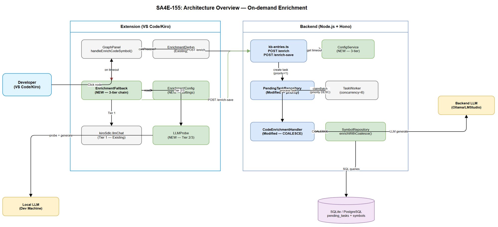
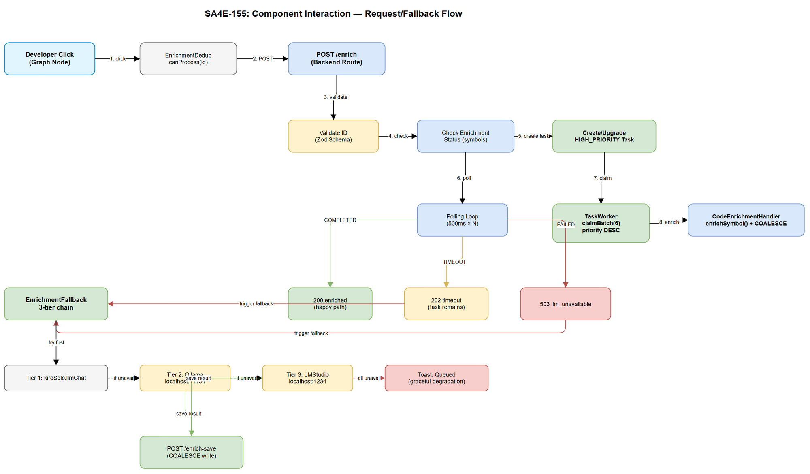

# Technical Design Document (TDD)

## SA4E — SA4E-155: On-demand KB entry enrichment with priority queue + timeout + extension LLM fallback

---

## Document Information

| Field | Value |
|-------|-------|
| Jira Ticket | SA4E-155 |
| Title | On-demand KB entry enrichment with priority queue + timeout + extension LLM fallback |
| Author | SA Agent |
| Version | 1.0 |
| Date | 2026-08-14 |
| Status | Draft |
| Related FSD | FSD-v1.1-SA4E-155.docx |
| Architecture Pattern | ai-agent (token optimization, prompt versioning, context assembly) |

---

## Revision History

| Version | Date | Author | Changes |
|---------|------|--------|---------|
| 1.0 | 2026-08-14 | SA Agent | Initial TDD — architecture, API design, DB migration, implementation checklist |

---

## Open Issues Resolution (SA Decisions)

| ID | Issue | SA Decision | Rationale |
|----|-------|-------------|-----------|
| OI-01 | COALESCE consistency — `storeResults()` uses `summary = ?` (overwrite) but `COALESCE(?, pseudo_code)` | **Option A: Both paths use COALESCE** | Ensures first-write-wins semantics consistently (BR-08). `storeResults()` updated to `summary = COALESCE(summary, ?)` pattern. Both `/enrich-save` and TaskWorker must be identical. |
| OI-02 | Extension LLM fallback strategy — `kiroSdlc.llmChat` vs Ollama/LMStudio | **Option C: Keep `kiroSdlc.llmChat` as primary, add Ollama/LMStudio as additional fallback** | Minimal disruption. Extension first tries existing `kiroSdlc.llmChat` (works with Kiro/Claude), then falls through to Ollama then LMStudio if that returns error or is unavailable. 3-tier fallback chain. |
| OI-03 | FK constraint `pending_tasks.entry_id → knowledge_entries` — CODE_ENRICHMENT uses symbols | **Option A: Remove FK, validate at application layer** | CODE_ENRICHMENT tasks reference `symbols.id`, not `knowledge_entries.id`. FK constraint causes integrity errors for code enrichment. App-layer validation in `PendingTaskRepository.create()` checks entry existence before INSERT. |

---

## 1. Architecture Overview

### 1.1 Module Structure



The system spans two runtime contexts with clear module boundaries:

**Backend (Node.js + Hono)**
- `server/routes/admin/kb-entries.ts` — HTTP route handlers (`/enrich`, `/enrich-save`)
- `modules/memory/task-queue/PendingTaskRepository.ts` — Priority-aware claiming
- `modules/memory/task-queue/TaskWorker.ts` — Background processor (concurrency=6)
- `engine/enrichment/CodeEnrichmentHandler.ts` — LLM enrichment + COALESCE store
- `services/ConfigService.ts` — Admin UI > ENV > Default config resolution

**Extension (VS Code/Kiro)**
- `panels/graph-panel.ts` — UI trigger + response handling
- `langgraph/enrichment/EnrichmentFallback.ts` — NEW: 3-tier LLM fallback chain
- `langgraph/enrichment/EnrichmentDedup.ts` — Existing dedup guard
- `langgraph/enrichment/LLMProbe.ts` — NEW: Health check for Ollama/LMStudio

### 1.2 Component Interactions



**Request Flow (Happy Path):**
1. Developer clicks unenriched node → `GraphPanel.handleEnrichCodeSymbol()`
2. Extension sends `POST /api/admin/kb/entries/:id/enrich` with JWT
3. Backend creates HIGH_PRIORITY task (priority=1), starts polling loop
4. TaskWorker claims task (ORDER BY priority DESC, created_at ASC)
5. CodeEnrichmentHandler calls LLM, stores result with COALESCE
6. Polling detects COMPLETED → returns enrichment data to extension
7. Extension updates graph node in webview

**Fallback Flow (Timeout/LLM Unavailable):**
1. Backend returns `{status: "timeout"}` or `{status: "llm_unavailable"}`
2. Extension tries `kiroSdlc.llmChat` command (existing mechanism)
3. If unavailable → probes Ollama (port 11434, 3s timeout)
4. If unavailable → probes LMStudio (port 1234, 3s timeout)
5. If available → calls local LLM, saves via `POST /enrich-save`
6. If all unavailable → shows toast "Enrichment queued, will be available later"

### 1.3 Data Flow

```
Developer Click
    → Extension (JWT auth)
    → POST /enrich
    → PendingTaskRepository.create(priority=1)
    → TaskWorker.claimBatch() [priority DESC]
    → CodeEnrichmentHandler.enrichSymbol()
    → LLM Service (Ollama/LMStudio on server)
    → storeResults() [COALESCE]
    → Polling returns enrichment
    → Extension updates UI
```

---

## 2. API Design

### 2.1 POST `/api/admin/kb/entries/:id/enrich`

**Route Handler:** `backend/src/server/routes/admin/kb-entries.ts`

**Middleware Stack:**
1. `jwtAuth()` — validates Bearer token, extracts userId + wid (workspaceId)
2. `rateLimiter({ key: 'userId+entryId', limit: 10, window: 60_000 })` — 10 req/min/user/entry
3. Route handler

**Validation (Zod):**

```typescript
import { z } from 'zod';

export const EnrichEntryIdSchema = z.string().refine(
  (id) => /^(code:|sym-|pega:|kb-entry:)/.test(id),
  { message: 'ID must start with code:, sym-, pega:, or kb-entry: prefix' }
);
```

**Handler Pseudocode:**

```typescript
app.post('/api/admin/kb/entries/:id/enrich', async (c) => {
  const entryId = c.req.param('id');
  // 1. Validate ID format
  const parsed = EnrichEntryIdSchema.safeParse(entryId);
  if (!parsed.success) return c.json({ error: parsed.error.message, details: 'Invalid ID format' }, 400);

  // 2. Parse numeric ID and determine type
  const { numericId, entryType } = parseEntryId(entryId);

  // 3. Check existence + enrichment status
  const symbol = await symbolRepository.findById(numericId);
  if (!symbol) return c.json({ error: 'Entry not found' }, 404);

  // 4. Short-circuit if already enriched (BR-05)
  if (symbol.enrichment_status === 'COMPLETED') {
    return c.json({ status: 'already_enriched', enrichment: { ... } }, 200);
  }

  // 5. Create or upgrade task (dedup at backend)
  const existing = await pendingTaskRepo.findPendingForEntry(numericId);
  let taskId: number;
  if (existing) {
    if (existing.priority === 0) await pendingTaskRepo.upgradePriority(existing.id, 1);
    taskId = existing.id;
  } else {
    taskId = await pendingTaskRepo.create({ ..., priority: 1 });
  }

  // 6. Polling loop (BR-03, BR-04)
  const timeoutMs = await configService.get('enrich_poll_timeout_ms', 15000);
  const intervalMs = await configService.get('enrich_poll_interval_ms', 500);
  const startTime = Date.now();

  while (Date.now() - startTime < timeoutMs) {
    await sleep(intervalMs);
    const task = await pendingTaskRepo.findById(taskId);
    if (task?.status === 'COMPLETED') return c.json({ status: 'enriched', enrichment: { ... } }, 200);
    if (task?.status === 'FAILED') {
      if (task.error?.includes('llm_unavailable')) {
        return c.json({ status: 'llm_unavailable', message: '...', error: task.error }, 503);
      }
      return c.json({ status: 'error', error: task.error ?? 'Task failed' }, 500);
    }
  }

  // 7. Timeout — task remains in queue (BR-09)
  return c.json({ status: 'timeout', message: '...', taskId }, 202);
});
```

**HTTP Response Codes:**

| Code | Condition |
|------|-----------|
| 200 | Enrichment completed or already enriched |
| 202 | Timeout — task remains queued |
| 400 | Invalid entry ID format |
| 401 | Missing/invalid JWT |
| 403 | Missing KB_WRITE permission |
| 404 | Entry not found |
| 500 | Internal error |
| 503 | Backend LLM unreachable |

---

### 2.2 POST `/api/admin/kb/entries/:id/enrich-save`

**Validation (Zod):**

```typescript
export const EnrichSaveIdSchema = z.string().refine(
  (id) => /^(code:|sym-)/.test(id),
  { message: 'ID must start with code: or sym- prefix' }
);

export const EnrichSaveBodySchema = z.object({
  summary: z.string().max(1000).optional(),
  pseudoCode: z.string().max(5000).optional(),
  llmTags: z.array(z.string().max(50)).max(20).optional(),
}).refine(
  (data) => data.summary || data.pseudoCode,
  { message: 'At least one of summary or pseudoCode must be provided' }
);
```

**Handler Pseudocode:**

```typescript
app.post('/api/admin/kb/entries/:id/enrich-save', async (c) => {
  const entryId = c.req.param('id');
  const parsed = EnrichSaveIdSchema.safeParse(entryId);
  if (!parsed.success) return c.json({ error: parsed.error.message }, 400);

  const body = EnrichSaveBodySchema.safeParse(await c.req.json());
  if (!body.success) return c.json({ error: body.error.message, details: 'Invalid body' }, 400);

  const numericId = parseInt(entryId.replace(/^(code:|sym-)/, ''));
  const symbol = await symbolRepository.findById(numericId);
  if (!symbol) return c.json({ error: 'Symbol not found' }, 404);

  // COALESCE write (BR-08 — first-write-wins)
  await symbolRepository.enrichWithCoalesce(numericId, body.data);
  return c.json({ status: 'saved', symbolId: numericId }, 200);
});
```

---

## 3. Class/Module Design

### 3.1 Backend Modules

#### 3.1.1 `PendingTaskRepository` (Modified)

**File:** `backend/src/modules/memory/task-queue/PendingTaskRepository.ts`

**New/Modified Methods:**

```typescript
export class PendingTaskRepository {
  // MODIFIED: create() now accepts priority
  async create(input: CreateTaskInput): Promise<number>;

  // MODIFIED: claimBatch() now uses priority-aware ORDER BY
  async claimBatch(count: number): Promise<PendingTask[]>;

  // NEW: Find existing PENDING/PROCESSING task for entry (backend dedup)
  async findPendingForEntry(entryId: number): Promise<PendingTask | null>;

  // NEW: Upgrade task priority (NORMAL → HIGH on demand)
  async upgradePriority(taskId: number, priority: number): Promise<void>;
}
```

**`claimBatch()` Implementation Change:**

```typescript
// BEFORE (current):
`SELECT * FROM pending_tasks WHERE status = ? ORDER BY created_at ASC LIMIT ?`

// AFTER (SA4E-155):
`SELECT * FROM pending_tasks WHERE status = ? ORDER BY priority DESC, created_at ASC LIMIT ?`
```

**New Method: `findPendingForEntry()`:**

```typescript
async findPendingForEntry(entryId: number): Promise<PendingTask | null> {
  return this.db.getAsync<PendingTask>(
    `SELECT * FROM pending_tasks
     WHERE entry_id = ? AND status IN (?, ?)
     ORDER BY priority DESC LIMIT 1`,
    [entryId, TaskStatus.PENDING, TaskStatus.PROCESSING],
  );
}
```

**New Method: `upgradePriority()`:**

```typescript
async upgradePriority(taskId: number, priority: number): Promise<void> {
  await this.db.runAsync(
    `UPDATE pending_tasks SET priority = ? WHERE id = ? AND priority < ?`,
    [priority, taskId, priority],
  );
}
```

#### 3.1.2 `CreateTaskInput` (Modified)

**File:** `backend/src/modules/memory/task-queue/models.ts`

```typescript
export interface CreateTaskInput {
  task_type: TaskType;
  entry_id: number;
  payload: object;
  max_retries?: number;
  priority?: number; // NEW: 0=NORMAL (default), 1=HIGH (BR-01, BR-14)
}
```

#### 3.1.3 `SymbolRepository` (New Methods)

**File:** `backend/src/engine/db/SymbolRepository.ts` (or existing symbol access module)

```typescript
export interface SymbolRepository {
  findById(id: number): Promise<Symbol | null>;

  /** COALESCE enrichment write — first-write-wins (BR-08) */
  enrichWithCoalesce(symbolId: number, data: {
    summary?: string;
    pseudoCode?: string;
    llmTags?: string[];
  }): Promise<void>;
}
```

**`enrichWithCoalesce()` SQL:**

```sql
UPDATE symbols SET
  summary = COALESCE(summary, ?),
  pseudo_code = COALESCE(pseudo_code, ?),
  llm_tags = COALESCE(llm_tags, ?),
  enrichment_status = 'COMPLETED',
  enriched_at = ?
WHERE id = ?
```

#### 3.1.4 `CodeEnrichmentHandler.storeResults()` (Modified — OI-01 Fix)

**File:** `backend/src/engine/enrichment/CodeEnrichmentHandler.ts`

**Current (BROKEN for first-write-wins):**
```typescript
await this.adapter.runAsync(
  `UPDATE symbols SET summary = ?, pseudo_code = COALESCE(?, pseudo_code),
   llm_tags = ?, enrichment_status = 'COMPLETED', enriched_at = ? WHERE id = ?`,
  [response.summary, pseudoCode, tagsJson, now, symbolId],
);
```

**New (COALESCE for ALL fields):**
```typescript
await this.adapter.runAsync(
  `UPDATE symbols SET
   summary = COALESCE(summary, ?),
   pseudo_code = COALESCE(pseudo_code, ?),
   llm_tags = COALESCE(llm_tags, ?),
   enrichment_status = 'COMPLETED',
   enriched_at = COALESCE(enriched_at, ?)
   WHERE id = ?`,
  [response.summary, pseudoCode, tagsJson, now, symbolId],
);
```

#### 3.1.5 `ConfigService` (New/Extended)

**File:** `backend/src/services/ConfigService.ts`

```typescript
/**
 * Configuration resolution with 3-tier hierarchy: Admin UI > ENV > Default (BR-10).
 */
export class ConfigService {
  constructor(private readonly db: DatabaseAdapter) {}

  async get(key: string, defaultValue: number): Promise<number> {
    // 1. Admin config table
    const row = await this.db.getAsync<{ value: string }>(
      'SELECT value FROM admin_config WHERE key = ?', [key]
    );
    if (row?.value) return parseInt(row.value, 10);

    // 2. Environment variable (UPPER_SNAKE_CASE)
    const envVal = process.env[key.toUpperCase()];
    if (envVal !== undefined) return parseInt(envVal, 10);

    // 3. Default
    return defaultValue;
  }
}
```

---

### 3.2 Extension Modules

#### 3.2.1 `EnrichmentFallback` (NEW)

**File:** `extension/src/langgraph/enrichment/EnrichmentFallback.ts`

```typescript
/**
 * SA4E-155: 3-tier LLM fallback chain for extension-side enrichment.
 * Tier 1: kiroSdlc.llmChat (existing Kiro/Claude mechanism)
 * Tier 2: Ollama (localhost:11434)
 * Tier 3: LMStudio (localhost:1234)
 *
 * BR-06: Probe order: kiroSdlc → Ollama → LMStudio
 * BR-07: 30s timeout for local LLM call
 * BR-11: All async/non-blocking
 * BR-12: Source code truncated to 4000 chars
 */
export class EnrichmentFallback {
  constructor(
    private readonly dedup: EnrichmentDedup,
    private readonly config: EnrichmentConfig,
  ) {}

  /** Execute fallback chain. Returns true if enrichment succeeded. */
  async execute(symbolId: string, sourceCode: string, symbolKind: string): Promise<boolean>;

  /** Probe LLM endpoint health. */
  private async probe(url: string, timeoutMs: number): Promise<boolean>;

  /** Call Ollama /api/generate. */
  private async callOllama(code: string, kind: string, signal: AbortSignal): Promise<string>;

  /** Call LMStudio /v1/chat/completions. */
  private async callLMStudio(code: string, kind: string, signal: AbortSignal): Promise<string>;

  /** Save enrichment result to backend via /enrich-save. */
  private async saveToBackend(symbolId: string, summary: string, pseudoCode: string): Promise<void>;
}
```

#### 3.2.2 `EnrichmentConfig` (NEW)

**File:** `extension/src/langgraph/enrichment/EnrichmentConfig.ts`

```typescript
/**
 * Extension settings for enrichment (from VS Code settings.json).
 */
export interface EnrichmentConfig {
  ollamaModel: string;       // default: 'codellama:7b'
  ollamaUrl: string;         // default: 'http://localhost:11434'
  lmstudioUrl: string;       // default: 'http://localhost:1234'
  localLlmTimeoutMs: number; // default: 30000
  maxSourceCodeChars: number; // default: 4000
  probeTimeoutMs: number;    // default: 3000
}
```

#### 3.2.3 `GraphPanel.handleEnrichCodeSymbol()` (Modified — OI-02)

**Modification:** After calling `POST /enrich` and receiving timeout/llm_unavailable, delegate to `EnrichmentFallback.execute()` instead of only using `kiroSdlc.llmChat`.

```typescript
// Existing: try kiroSdlc.llmChat first (Tier 1)
// NEW: if kiroSdlc.llmChat unavailable/fails → EnrichmentFallback.execute()
//      which tries Ollama → LMStudio → graceful degradation (Tier 2, 3)
```

---

## 4. Database Design

### 4.1 Migration: Add Priority Column

**File:** `backend/src/modules/memory/migrations/XXX-add-priority-to-pending-tasks.ts`

```sql
-- Migration: SA4E-155 — Add priority column for on-demand enrichment
ALTER TABLE pending_tasks ADD COLUMN priority INTEGER NOT NULL DEFAULT 0;

-- Composite index for priority-aware claiming (BR-02)
-- Enables: WHERE status='PENDING' ORDER BY priority DESC, created_at ASC
CREATE INDEX idx_pending_tasks_priority_claim
  ON pending_tasks(status, priority DESC, created_at ASC);
```

**Rollback:**

```sql
DROP INDEX IF EXISTS idx_pending_tasks_priority_claim;
ALTER TABLE pending_tasks DROP COLUMN priority;
```

**Impact:** Existing ~18k tasks get `priority=0` (NORMAL) automatically via DEFAULT. No data migration needed.

### 4.2 Migration: Remove FK Constraint (OI-03)

**File:** `backend/src/modules/memory/migrations/XXX-remove-pending-tasks-fk.ts`

```sql
-- Migration: SA4E-155 — Remove FK constraint on pending_tasks.entry_id
-- Reason: CODE_ENRICHMENT references symbols.id, not knowledge_entries.id

-- SQLite: Cannot drop constraint directly, must recreate table
CREATE TABLE pending_tasks_new (
  id INTEGER PRIMARY KEY AUTOINCREMENT,
  task_type TEXT NOT NULL,
  entry_id INTEGER NOT NULL,
  status TEXT NOT NULL DEFAULT 'PENDING',
  priority INTEGER NOT NULL DEFAULT 0,
  payload TEXT NOT NULL,
  error TEXT,
  retry_count INTEGER NOT NULL DEFAULT 0,
  max_retries INTEGER NOT NULL DEFAULT 3,
  created_at TEXT NOT NULL DEFAULT (datetime('now')),
  started_at TEXT,
  completed_at TEXT
);

INSERT INTO pending_tasks_new
  SELECT id, task_type, entry_id, status, 0, payload, error,
         retry_count, max_retries, created_at, started_at, completed_at
  FROM pending_tasks;

DROP TABLE pending_tasks;
ALTER TABLE pending_tasks_new RENAME TO pending_tasks;

-- Recreate indexes
CREATE INDEX idx_pending_tasks_priority_claim
  ON pending_tasks(status, priority DESC, created_at ASC);
CREATE INDEX idx_pending_tasks_entry_id ON pending_tasks(entry_id);
```

**PostgreSQL variant:**
```sql
ALTER TABLE pending_tasks DROP CONSTRAINT IF EXISTS pending_tasks_entry_id_fkey;
ALTER TABLE pending_tasks ADD COLUMN IF NOT EXISTS priority INTEGER NOT NULL DEFAULT 0;
CREATE INDEX IF NOT EXISTS idx_pending_tasks_priority_claim
  ON pending_tasks(status, priority DESC, created_at ASC);
```

### 4.3 Admin Config Entries

```sql
-- Default configuration values (inserted if not exist)
INSERT OR IGNORE INTO admin_config (key, value, updated_at)
VALUES ('enrich_poll_timeout_ms', '15000', datetime('now'));

INSERT OR IGNORE INTO admin_config (key, value, updated_at)
VALUES ('enrich_poll_interval_ms', '500', datetime('now'));
```

### 4.4 Index Analysis

| Index | Columns | Purpose | Query Plan |
|-------|---------|---------|------------|
| `idx_pending_tasks_priority_claim` | `(status, priority DESC, created_at ASC)` | Priority-aware claimBatch | Index scan covering WHERE + ORDER BY |
| `idx_pending_tasks_entry_id` | `(entry_id)` | findPendingForEntry dedup check | Index lookup |
| `idx_symbols_enrichment_status` | `(enrichment_status)` | Already-enriched check | Existing (SA4E-107) |

---

## 5. Implementation Checklist

### Phase 1: Database Migration (Backend)

| # | Task | File | Depends |
|---|------|------|---------|
| 1.1 | Create migration: add `priority` column + composite index | `migrations/XXX-add-priority.ts` | — |
| 1.2 | Create migration: remove FK constraint on `entry_id` | `migrations/XXX-remove-fk.ts` | — |
| 1.3 | Add admin_config seed entries | `migrations/XXX-admin-config-seeds.ts` | — |
| 1.4 | Update `CreateTaskInput` interface to include `priority` | `models.ts` | — |
| 1.5 | Run migration, verify existing 18k tasks get priority=0 | — | 1.1, 1.2 |

### Phase 2: Repository & Service Layer (Backend)

| # | Task | File | Depends |
|---|------|------|---------|
| 2.1 | Modify `PendingTaskRepository.create()` — insert priority | `PendingTaskRepository.ts` | 1.4 |
| 2.2 | Modify `claimBatch()` — ORDER BY priority DESC, created_at ASC | `PendingTaskRepository.ts` | 1.1 |
| 2.3 | Add `findPendingForEntry()` method | `PendingTaskRepository.ts` | 1.1 |
| 2.4 | Add `upgradePriority()` method | `PendingTaskRepository.ts` | 1.1 |
| 2.5 | Create `ConfigService` with 3-tier resolution | `services/ConfigService.ts` | 1.3 |
| 2.6 | Add `SymbolRepository.enrichWithCoalesce()` | `SymbolRepository.ts` | — |

### Phase 3: CodeEnrichmentHandler Fix (OI-01)

| # | Task | File | Depends |
|---|------|------|---------|
| 3.1 | Fix `storeResults()` — COALESCE all fields | `CodeEnrichmentHandler.ts` | — |
| 3.2 | Write unit test: concurrent write → first-write-wins | `CodeEnrichmentHandler.test.ts` | 3.1 |

### Phase 4: Route Handlers (Backend)

| # | Task | File | Depends |
|---|------|------|---------|
| 4.1 | Add `POST /enrich` handler with polling loop | `kb-entries.ts` | 2.1–2.5 |
| 4.2 | Add `POST /enrich-save` handler with COALESCE | `kb-entries.ts` | 2.6 |
| 4.3 | Add Zod validation schemas (EnrichEntryIdSchema, EnrichSaveBodySchema) | `kb-entries-schemas.ts` | — |
| 4.4 | Configure rate limiter (10 req/min, userId+entryId key) | `kb-entries.ts` | — |

### Phase 5: Extension — Fallback Chain (OI-02)

| # | Task | File | Depends |
|---|------|------|---------|
| 5.1 | Create `EnrichmentConfig` interface + settings reader | `EnrichmentConfig.ts` | — |
| 5.2 | Create `EnrichmentFallback` class (3-tier chain) | `EnrichmentFallback.ts` | 5.1 |
| 5.3 | Modify `GraphPanel.handleEnrichCodeSymbol()` — integrate fallback | `graph-panel.ts` | 5.2 |
| 5.4 | Add extension settings contributions (`package.json`) | `package.json` | — |

### Phase 6: Integration Testing

| # | Task | File | Depends |
|---|------|------|---------|
| 6.1 | IT: POST /enrich happy path (task completes within timeout) | `enrich.test.ts` | 4.1 |
| 6.2 | IT: POST /enrich timeout (returns 202) | `enrich.test.ts` | 4.1 |
| 6.3 | IT: POST /enrich-save COALESCE (concurrent writes) | `enrich-save.test.ts` | 4.2 |
| 6.4 | IT: Priority ordering (HIGH before NORMAL) | `priority.test.ts` | 2.2 |
| 6.5 | IT: findPendingForEntry dedup | `dedup.test.ts` | 2.3 |
| 6.6 | IT: ConfigService 3-tier resolution | `config-service.test.ts` | 2.5 |

---

## 6. Error Handling Strategy

### 6.1 Backend Error Classification

| Error Type | HTTP Code | Response Format | Logging |
|-----------|-----------|-----------------|---------|
| Validation error | 400 | `{error: "...", details: "..."}` | `logger.warn` |
| Auth error | 401/403 | `{error: "Unauthorized"}` | `logger.info` |
| Not found | 404 | `{error: "Entry not found"}` | `logger.debug` |
| LLM unavailable | 503 | `{status: "llm_unavailable", message: "...", error: "..."}` | `logger.error` |
| Internal error | 500 | `{error: "Internal error", details: "..."}` | `logger.error` + stack |
| Timeout (soft) | 202 | `{status: "timeout", message: "...", taskId: N}` | `logger.info` |

### 6.2 Extension Error Handling

| Scenario | Action | User Notification |
|----------|--------|-------------------|
| Backend returns 200 (enriched) | Update graph node | None (inline display) |
| Backend returns 202 (timeout) | Start fallback chain | None until chain completes |
| Fallback LLM call succeeds | Save via /enrich-save + update node | None (transparent) |
| All LLMs unavailable | Show toast, mark node pending | Toast: "Enrichment queued, will be available later" (5s auto-dismiss) |
| Network error (backend unreachable) | Show error toast | "Cannot connect to server" |
| Parse error (LLM response invalid) | Log + show queued toast | Toast with queue message |

### 6.3 Retry Policy

| Component | Retry Count | Backoff | Condition |
|-----------|-------------|---------|-----------|
| TaskWorker task retry | 3 (max_retries) | None (immediate re-queue) | Task FAILED, retry_count < max_retries |
| Extension LLM probe | 0 | — | Single attempt per tier, move to next |
| Backend polling | N/A (loop with sleep) | Fixed 500ms (configurable) | Loop until timeout |
| Stale task recovery | Automatic | — | `started_at` > threshold (120s default) |

---

## 7. Security Design

### 7.1 Authentication & Authorization

| Endpoint | Auth Required | Permission | Rate Limit |
|----------|---------------|------------|------------|
| POST `/enrich` | JWT Bearer | KB_WRITE | 10 req/min per user+entry |
| POST `/enrich-save` | JWT Bearer | KB_WRITE | 10 req/min per user+entry |

### 7.2 Input Validation

| Input | Validation | Sanitization |
|-------|-----------|--------------|
| Entry ID (path) | Zod regex: `^(code:\|sym-\|pega:\|kb-entry:)` | — |
| Summary (body) | Max 1000 chars | — |
| PseudoCode (body) | Max 5000 chars | — |
| LLM Tags (body) | Max 20 items, each max 50 chars | — |
| Source code (to LLM) | Truncated to 4000 chars (BR-12) | — |

### 7.3 Local LLM Security

| Concern | Mitigation |
|---------|-----------|
| Source code exposure | Only sent to localhost (127.0.0.1), never to external services |
| LLM injection via crafted code | Response validated with Zod `safeParse`; output stored as text, never executed |
| Proxy interception | Localhost calls bypass `@vscode/proxy-agent` (standard behavior) |
| Token in /enrich-save | Standard JWT auth; token has expiry |

### 7.4 Data Integrity

| Concern | Mitigation |
|---------|-----------|
| Race condition (concurrent writes) | COALESCE semantics — first-write-wins |
| Task dedup | Backend checks existing PENDING/PROCESSING task before create |
| Extension dedup | EnrichmentDedup in-memory guard (60s stale timeout) |
| Priority queue flooding | Rate limiter + backend dedup + priority upgrade (not re-create) |

---

## 8. Performance Considerations

### 8.1 Query Performance

| Query | Expected Time | Optimization |
|-------|--------------|-------------|
| claimBatch with priority | ≤50ms on 18k rows | `idx_pending_tasks_priority_claim` composite index |
| findPendingForEntry | ≤5ms | `idx_pending_tasks_entry_id` index |
| enrichWithCoalesce UPDATE | ≤10ms | Primary key lookup |
| Polling SELECT by ID | ≤2ms | Primary key lookup |

### 8.2 Concurrency

| Component | Concurrency | Mechanism |
|-----------|-------------|-----------|
| TaskWorker | 6 concurrent tasks | Promise.allSettled batch |
| Polling loop | 1 per request (sequential) | Single connection, sleep between polls |
| Extension dedup | 1 per entry (global) | EnrichmentDedup in-memory Map |

### 8.3 Token Budget (AI Agent Pattern)

| Operation | Input Tokens | Output Tokens | Total |
|-----------|-------------|---------------|-------|
| Backend LLM enrichment (per symbol) | ~2000 | ~400 | ~2400 |
| Extension local LLM (truncated 4000 chars) | ~1500 | ~400 | ~1900 |
| System prompt overhead | ~100 | — | ~100 |

---

## 9. Configuration Reference

### 9.1 Backend Configuration

| Config Key | ENV Variable | Default | Admin UI | Description |
|-----------|-------------|---------|----------|-------------|
| `enrich_poll_timeout_ms` | `ENRICH_POLL_TIMEOUT_MS` | 15000 | Yes | Max polling duration |
| `enrich_poll_interval_ms` | `ENRICH_POLL_INTERVAL_MS` | 500 | Yes | Sleep between polls |

Resolution order (BR-10): Admin UI table > ENV var > Default value.

### 9.2 Extension Configuration

| Setting Key | Default | Description |
|-------------|---------|-------------|
| `sa4e.enrichment.ollamaModel` | `codellama:7b` | Ollama model name |
| `sa4e.enrichment.ollamaUrl` | `http://localhost:11434` | Ollama base URL |
| `sa4e.enrichment.lmstudioUrl` | `http://localhost:1234` | LMStudio base URL |
| `sa4e.enrichment.localLlmTimeoutMs` | 30000 | Local LLM call timeout |
| `sa4e.enrichment.maxSourceCodeChars` | 4000 | Max chars sent to LLM |

---

## 10. Observability

### 10.1 Logging

| Event | Level | Fields |
|-------|-------|--------|
| On-demand enrichment triggered | info | `userId, entryId, taskId` |
| Task claimed (HIGH priority) | info | `taskId, priority, waitTime` |
| Enrichment completed (backend) | info | `taskId, symbolId, duration, source:'backend_llm'` |
| Enrichment completed (extension) | info | `symbolId, source:'extension_llm', provider:'ollama'\|'lmstudio'` |
| Polling timeout | warn | `taskId, entryId, timeoutMs` |
| LLM unavailable | error | `endpoint, error, fallbackTriggered` |
| Config changed | info | `key, oldValue, newValue, userId` |

### 10.2 Metrics (Future)

| Metric | Type | Description |
|--------|------|-------------|
| `enrich_request_total` | counter | Total /enrich requests |
| `enrich_duration_ms` | histogram | Time from request to response |
| `enrich_source` | counter (label: source) | Backend vs extension enrichment |
| `task_queue_depth` | gauge (label: priority) | Current pending tasks by priority |

---

## Appendix

### Diagram Index

| # | Diagram | Image | Source (editable) |
|---|---------|-------|-------------------|
| 1 | Architecture Overview | [architecture.png](diagrams/architecture.png) | [architecture.drawio](diagrams/architecture.drawio) |
| 2 | Component Interaction | [component.png](diagrams/component.png) | [component.drawio](diagrams/component.drawio) |
