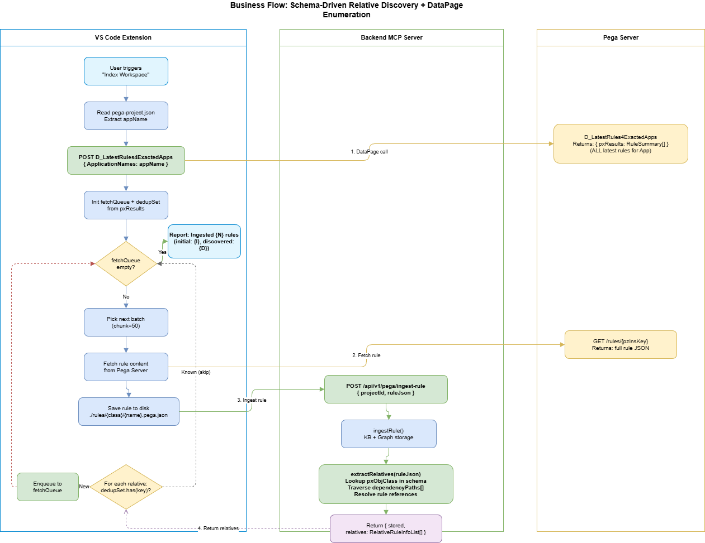

# Business Requirements Document (BRD)

## SA4E — SA4E-156: [Pega Indexing] Schema-Driven Relative Discovery + DataPage Enumeration

---

## Document Information

| Field | Value |
|-------|-------|
| Jira Ticket | SA4E-156 |
| Title | [Pega Indexing] Schema-Driven Relative Discovery + DataPage Enumeration |
| Author | BA Agent |
| Version | 1.0 |
| Date | 2026-08-15 |
| Status | Draft |

---

## Author Tracking

| Role | Name - Position | Responsibility |
|------|-----------------|----------------|
| Author | BA Agent – Business Analyst | Create document |
| Peer Reviewer | TA Agent – Technical Architect | Review document |

---

## Revision History

| Version | Date | Author | Changes |
|---------|------|--------|---------|
| 1.0 | 2026-08-15 | BA Agent | Initiate document — auto-generated from Jira ticket SA4E-156 |

---

## Sign-Off

| Name | Signature and date |
|------|--------------------|
| | ☐ I agree and confirm all criteria on this BRD as expected requirements |
| | ☐ I agree and confirm all criteria on this BRD as expected requirements |

---

## 1. Introduction

### 1.1 Scope

Replace the current per-RuleSet enumeration and blind 9-type class expansion in the Pega Indexing pipeline with:

1. **DataPage-based enumeration** — A single Pega DataPage call (`D_LatestRules4ExactedApps`) replaces multiple per-RuleSet pagination API calls, returning all latest rules for an Application in one request.
2. **Schema-driven relative discovery** — The backend uses `dependencyPaths` from `pega-core-schemas.json` to extract referenced rules from each ingested rule, replacing the hardcoded 9-type blind expansion.
3. **Recursive BFS queue** — The extension maintains a dedup queue, fetching only rules that are actually referenced, terminating when the queue is empty.

### 1.2 Out of Scope

- Changes to the Pega Server DataPage definition itself (assumed pre-existing)
- Modifications to the `pega-core-schemas.json` schema definitions (consumed as-is)
- Migration of existing indexed data (new indexing replaces old results)
- UI changes to the VS Code extension (progress reporting remains unchanged)
- Authentication/authorization changes for Pega API access

### 1.3 Preliminary Requirement

- DataPage `D_LatestRules4ExactedApps` must exist and be accessible on the target Pega server
- Backend module `pega-core-schemas.json` must contain `dependencyPaths` for all rule types to be discovered
- Extension must have connectivity to both Pega server and backend MCP server

---

## 2. Business Requirements

### 2.1 High Level Process Map

The Pega Index Workspace process transitions from a **two-phase enumeration + blind-expand** model to a **single-enumeration + targeted-discovery** model:

1. Extension calls DataPage → receives complete rule list for the Application
2. Extension fetches rules in parallel batches (chunk=50)
3. Each fetched rule is sent to Backend for ingestion
4. Backend extracts referenced rules using schema-defined dependency paths
5. Extension enqueues newly discovered references
6. Process repeats until no more undiscovered rules exist

### 2.2 List of User Stories / Use Cases

| # | Story / Use Case / Epic | Priority | Source Ticket |
|---|-------------------------|----------|---------------|
| 1 | As a developer, I want Pega workspace indexing to use a single DataPage call so that the enumeration phase is faster and simpler | MUST HAVE | SA4E-156 |
| 2 | As a developer, I want the backend to discover related rules using schema definitions so that only referenced rules are fetched | MUST HAVE | SA4E-156 |
| 3 | As a developer, I want a recursive BFS discovery mechanism so that transitive rule dependencies are automatically resolved | MUST HAVE | SA4E-156 |
| 4 | As a developer, I want deduplication to prevent re-fetching rules already in the index set | MUST HAVE | SA4E-156 |
| 5 | As a developer, I want the total number of Pega API calls reduced compared to the current approach | SHOULD HAVE | SA4E-156 |
| 6 | As a developer, I want existing test coverage (unit + integration) to remain passing after the change | MUST HAVE | SA4E-156 |

---

### 2.3 Details of User Stories

---

#### Business Flow

**Current Process (Being Replaced):**

**Step 1:** Extension resolves hierarchy (App → AccessGroup → RuleSets)  
**Step 2:** Extension enumerates each RuleSet via paginated API (multiple calls per RuleSet)  
**Step 3:** Extension fetches each enumerated rule in parallel  
**Step 4:** When a Rule-Obj-Class is encountered, Extension blindly fetches ALL 9 sub-rule types (Property, Activity, Flow, Model, Section, DeclarativeExpr, FieldValue, ReportDef, Service-REST) — regardless of whether they are referenced  
**Step 5:** All fetched rules are batch-ingested via NDJSON stream to backend  

**Target Process (New):**

**Step 1:** Extension reads `pega-project.json`, extracts appName  
**Step 2:** Extension calls DataPage `D_LatestRules4ExactedApps` with appName — single API call returns all latest rules  
**Step 3:** Extension initializes dedupSet + fetchQueue from DataPage results  
**Step 4:** Extension fetches rules in batches (chunk=50), saves to disk  
**Step 5:** Each rule is sent to Backend via `POST /api/v1/pega/ingest-rule`  
**Step 6:** Backend ingests rule into KB + Graph, then extracts references using `dependencyPaths` from schema  
**Step 7:** Backend returns `{ stored, relatives: RelativeRuleInfoList[] }`  
**Step 8:** Extension checks each relative against dedupSet — new ones are enqueued  
**Step 9:** Repeat Steps 4-8 until fetchQueue is empty  
**Step 10:** Finalize — report statistics  

> **Note:** The dedup key is `"{pxObjClass}!{pyClassName}!{pyRuleName}"` — checked BEFORE fetch to save bandwidth.

---

#### STORY 1: DataPage-Based Enumeration

> As a developer, I want Pega workspace indexing to use a single DataPage call so that the enumeration phase is faster and simpler.

**Requirement Details:**

1. Extension shall call DataPage `D_LatestRules4ExactedApps` via POST request with body `{ "ApplicationNames": "{appName}" }`
2. The DataPage returns `{ pxResults: RuleSummary[] }` containing all latest rules belonging to the application stack
3. This replaces the current hierarchy resolution + per-RuleSet paginated enumeration (which requires N API calls per RuleSet)
4. No need to resolve AccessGroup → RuleSets hierarchy prior to enumeration

**Acceptance Criteria:**

1. Extension calls `D_LatestRules4ExactedApps` with the application name extracted from `pega-project.json`
2. A single API call returns the complete initial rule set
3. The response is parsed into a `RuleSummaryList` and used to seed the fetchQueue
4. The hierarchy resolution step (`resolveDeterministicPegaHierarchy`) is no longer required for indexing
5. Error handling: if DataPage call fails, the indexing aborts with a clear error message

---

#### STORY 2: Schema-Driven Relative Discovery (Backend)

> As a developer, I want the backend to discover related rules using schema definitions so that only referenced rules are fetched.

**Requirement Details:**

1. Backend exposes endpoint `POST /api/v1/pega/ingest-rule` accepting `{ projectId, ruleJson }`
2. Upon ingestion, backend performs:
   a. Lookup `pxObjClass` from ruleJson in `pega-core-schemas.json`
   b. Retrieve `schema.dependencyPaths[]` for that rule type
   c. Traverse each dependency path in the ruleJson object tree
   d. Extract referenced rule identifiers from matched path values
   e. Resolve each reference to `{ pxObjClass, pyClassName, pyRuleName, insKey }`
3. Backend returns `{ stored: boolean, relatives: RelativeRuleInfoList[] }`
4. This replaces the blind 9-type expansion: `Rule-Obj-Property, Rule-Obj-Activity, Rule-Obj-Flow, Rule-Obj-Model, Rule-HTML-Section, Rule-Declare-Expressions, Rule-Obj-FieldValue, Rule-Obj-Report-Definition, Rule-Service-REST`

**Data Fields:**

| Field | Type | Required | Description | Example |
|-------|------|----------|-------------|---------|
| projectId | string | Yes | SHA256-based project identifier | `"a1b2c3d4e5f6"` |
| ruleJson | object | Yes | Full Pega rule JSON content | `{ pxObjClass: "Rule-Obj-Activity", ... }` |
| stored | boolean | Yes | Whether the rule was stored (or deduped) | `true` |
| relatives | RelativeRuleInfo[] | Yes | List of discovered dependent rules | `[{ pxObjClass, pyClassName, pyRuleName, insKey }]` |

**Acceptance Criteria:**

1. Backend parses `pxObjClass` from the rule and looks up the matching schema in `pega-core-schemas.json`
2. All `dependencyPaths` for the rule type are traversed (supports array notation `[]` in paths)
3. Values extracted from dependency paths are resolved to rule references
4. Response includes the complete list of discovered relatives
5. If schema has no entry for the given `pxObjClass`, return `{ stored: true, relatives: [] }` (no expansion)
6. Backend DOES NOT hardcode rule types — all discovery is schema-driven

---

#### STORY 3: Recursive BFS Queue (Extension)

> As a developer, I want a recursive BFS discovery mechanism so that transitive rule dependencies are automatically resolved.

**Requirement Details:**

1. Extension maintains a `fetchQueue` (FIFO) and `dedupSet` (Set<string>)
2. Initial seed: all rules from DataPage response are added to both queue and dedupSet
3. After each rule is ingested via backend, the returned `relatives` are checked against dedupSet
4. New relatives (not in dedupSet) are added to both dedupSet and fetchQueue
5. Processing continues in batches (chunk=50) until `fetchQueue.isEmpty()`
6. Termination guarantee: each rule can only be enqueued once (dedupSet prevents cycles)

**Acceptance Criteria:**

1. Extension initializes queue from DataPage results
2. After each ingest-rule response, new relatives are enqueued
3. Dedup key format: `"{pxObjClass}!{pyClassName}!{pyRuleName}"`
4. Queue processing terminates when empty (no infinite loops)
5. Progress reporting shows both initial count and discovered count: `"Ingested {N} rules (initial: {I}, discovered: {D})"`
6. Concurrency calibration (`calibrateFetchConcurrency`) still applies to fetches

---

#### STORY 4: Deduplication and Bandwidth Optimization

> As a developer, I want deduplication to prevent re-fetching rules already in the index set.

**Requirement Details:**

1. dedupSet is checked BEFORE fetching a rule from Pega server
2. Key is constructed from rule metadata (not insKey alone, since insKey may differ across versions)
3. This eliminates redundant Pega API calls for rules already fetched or known

**Acceptance Criteria:**

1. A rule is never fetched twice from Pega server within a single index run
2. DedupSet persists for the duration of the indexing session
3. Total rules fetched is ≤ (initial DataPage count + discovered relatives count)

---

#### STORY 5: Reduced API Call Volume

> As a developer, I want the total number of Pega API calls reduced compared to the current approach.

**Requirement Details:**

1. Current approach:
   - 1 hierarchy call + N per-RuleSet pagination calls + M rule fetch calls + (9 × C) class expansion calls (where C = number of Rule-Obj-Class rules)
2. New approach:
   - 1 DataPage call + M rule fetch calls (only for referenced rules, no blind expansion)
3. Expected reduction: elimination of per-RuleSet pagination and 9-type blind expansion

**Acceptance Criteria:**

1. No per-RuleSet enumeration API calls are made
2. No blind 9-type expansion calls are made
3. Only rules that are either in the DataPage result or discovered via schema dependencies are fetched
4. Logging shows reduction in total Pega API calls compared to baseline

---

#### STORY 6: Test Coverage Preservation

> As a developer, I want existing test coverage (unit + integration) to remain passing after the change.

**Requirement Details:**

1. All existing unit tests in `extension/src/**/__tests__/` must pass
2. All existing integration tests in `backend/src/**/__tests__/` must pass
3. New unit tests must be added for:
   - `extractRelatives()` function in backend
   - DataPage call integration in extension
   - BFS queue logic in extension

**Acceptance Criteria:**

1. `npm test` passes in both `extension/` and `backend/` directories
2. New tests cover the schema-driven extraction logic
3. New tests cover the BFS queue termination guarantee
4. No existing test is deleted or disabled

---

## 3. Dependencies

| Dependency | Type | Related Ticket | Description |
|------------|------|----------------|-------------|
| Pega DataPage `D_LatestRules4ExactedApps` | External | N/A | Must exist on target Pega server, accessible via Pega API |
| `pega-core-schemas.json` | Internal | SA4E-94 | Schema file with `dependencyPaths` for each rule type — already exists |
| Backend MCP server | Infrastructure | N/A | Must be running and accessible from extension |
| `pega-project.json` | Internal | SA4E-94 | Workspace file containing appName — already exists |

---

## 4. Stakeholders

| Role | Name / Team | Responsibility | Source |
|------|-------------|----------------|--------|
| Developer | Dev Team | Implement extension + backend changes | Assignee |
| Architect | SA Agent | Design TDD for new architecture | Reviewer |
| QA | QA Team | Verify reduced API calls + correctness | Tester |

---

## 5. Risks and Assumptions

### 5.1 Risks

| Risk | Impact | Likelihood | Mitigation |
|------|--------|------------|------------|
| DataPage `D_LatestRules4ExactedApps` returns incomplete results for multi-app stacks | High | Low | Validate against known app with full rule set; fallback to per-RuleSet if DataPage unavailable |
| Schema `dependencyPaths` may not cover all rule types (missing entries) | Medium | Medium | Rules without schema entries return empty relatives — still ingested but without discovery |
| Circular references in rule dependencies cause infinite queue growth | High | Low | dedupSet guarantees each rule is enqueued only once — no cycles possible |
| Backend `extractRelatives` parsing errors for complex array paths | Medium | Medium | Comprehensive unit tests for path traversal with nested arrays |
| DataPage API performance for large applications (10K+ rules) | Medium | Low | Single call still faster than N per-RuleSet calls; pagination support can be added later |

### 5.2 Assumptions

- DataPage `D_LatestRules4ExactedApps` exists and returns `{ pxResults: RuleSummary[] }` format
- All rule types relevant to the application are included in the DataPage response
- `pega-core-schemas.json` `dependencyPaths` are correct and sufficient for dependency extraction
- Backend can resolve dependency path values to valid rule references (pxObjClass, pyClassName, pyRuleName)
- Network latency between Extension and Backend is negligible (localhost)

---

## 6. Non-Functional Requirements

| Category | Requirement | Details |
|----------|-------------|---------|
| Performance | Single DataPage call instead of N per-RuleSet calls | Reduce enumeration phase from multiple paginated calls to 1 API call |
| Performance | Reduced total Pega API calls | Only fetch rules that are referenced (not blind 9-type expansion) |
| Reliability | Dedup guarantee | No rule fetched twice within a single index session |
| Reliability | Termination guarantee | BFS queue terminates when empty; dedupSet prevents cycles |
| Maintainability | Schema-driven (no hardcoded types) | Adding new rule types only requires updating `pega-core-schemas.json`, not code |
| Compatibility | Existing tests pass | Zero regressions on existing unit + integration tests |

---

## 7. Related Tickets

| Ticket Key | Summary | Status | Type | Relationship |
|------------|---------|--------|------|--------------|
| SA4E-156 | [Pega Indexing] Schema-Driven Relative Discovery + DataPage Enumeration | In Progress | Story | Main ticket |
| SA4E-94 | Pega Indexing — NDJSON Ingest + RuleSet Enumeration | Done | Story | Predecessor (current implementation) |
| SA4E-155 | Duplicate Version Report | Done | Story | Related (version dedup) |

---

## 8. Appendix

### Glossary

| Term | Definition |
|------|------------|
| DataPage | A Pega platform mechanism for caching and retrieving data (read-only or read-write). `D_LatestRules4ExactedApps` returns latest rules for an application. |
| dependencyPaths | JSON paths defined in `pega-core-schemas.json` that point to fields containing references to other rules (e.g., `steps[].pyMethodParameters` in an Activity references another Activity). |
| RelativeRuleInfo | A data structure representing a discovered dependent rule: `{ pxObjClass, pyClassName, pyRuleName, insKey }`. |
| dedupSet | A Set maintaining composite keys of all known rules to prevent duplicate fetches. Key format: `"{pxObjClass}!{pyClassName}!{pyRuleName}"`. |
| fetchQueue | A FIFO queue of rules to be fetched from Pega server. Seeded by DataPage, grown by discovered relatives. |
| BFS (Breadth-First Search) | The traversal strategy: process all rules at current depth before moving to discovered relatives. |
| Blind expansion | The current (deprecated) approach: when encountering a Rule-Obj-Class, fetch ALL 9 sub-rule types regardless of whether they are referenced. |

### Reference Documents

| Document | Link / Location |
|----------|-----------------|
| Target Design Diagram | `documents/PegaIndexWorkspaceProcess-SchemaDiscovery.puml` |
| Current Design Diagram | `documents/PegaIndexWorkspaceProcess.puml` |
| Pega Core Schemas | `backend/src/modules/pega/schemas/pega-core-schemas.json` |
| Current Extension Code | `extension/src/services/PegaProjectIndexer.ts` |
| Current Backend Routes | `backend/src/server/routes/pega-stream.ts` |

### Diagram Index

| # | Diagram | Image | Source (editable) |
|---|---------|-------|-------------------|
| 1 | Use Case Diagram | [use-case.png](diagrams/use-case.png) | [use-case.drawio](diagrams/use-case.drawio) |
| 2 | Business Flow Diagram | [business-flow.png](diagrams/business-flow.png) | [business-flow.drawio](diagrams/business-flow.drawio) |
