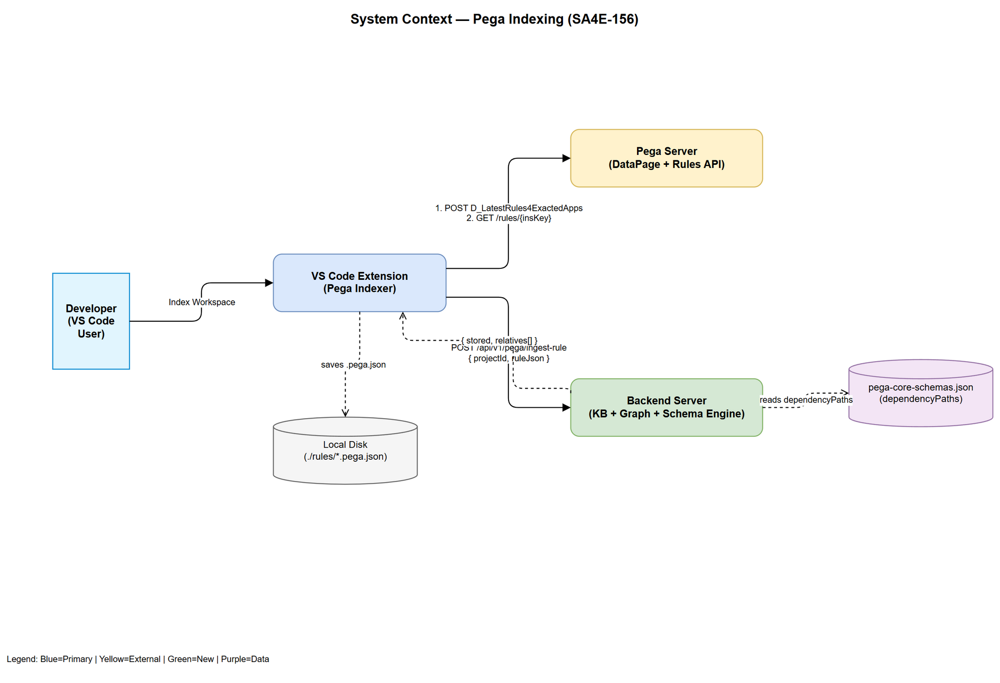
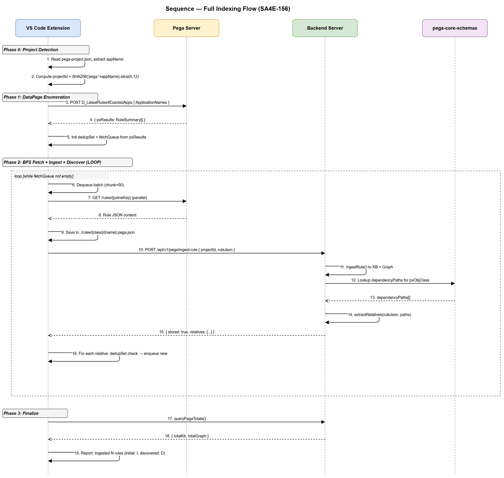
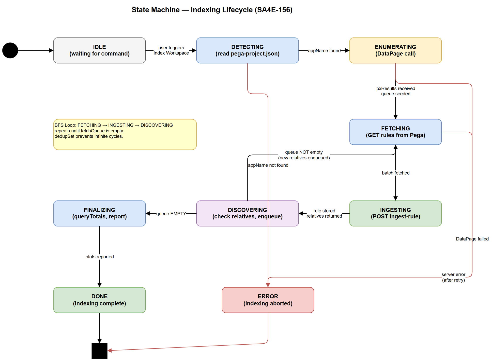

# Functional Specification Document (FSD)

## SA4E — SA4E-156: [Pega Indexing] Schema-Driven Relative Discovery + DataPage Enumeration

---

## Document Information

| Field | Value |
|-------|-------|
| Jira Ticket | SA4E-156 |
| Title | [Pega Indexing] Schema-Driven Relative Discovery + DataPage Enumeration |
| Author | BA Agent |
| Version | 1.0 |
| Date | 2026-08-15 |
| Status | Draft |
| Related BRD | documents/SA4E-156/BRD.md |

---

## Author Tracking

| Role | Name - Position | Responsibility |
|------|-----------------|----------------|
| Author | BA Agent – Business Analyst | Create document |
| Peer Reviewer | TA Agent – Technical Architect | Review and enrich |

---

## Revision History

| Version | Date | Author | Changes |
|---------|------|--------|---------|
| 1.0 | 2026-08-15 | BA Agent | Initiate document — translated from BRD SA4E-156 |
| 1.1 | 2026-08-15 | TA Agent | Technical enrichment — API contracts, pseudocode, NFR targets, open issues |

---

## 1. Introduction

### 1.1 Purpose

This FSD specifies the functional behavior of the redesigned Pega Indexing pipeline for SA4E-156. It translates the BRD requirements into implementable use cases, business rules, data models, and API contracts for:

1. DataPage-based initial rule enumeration (replacing per-RuleSet pagination)
2. Schema-driven relative discovery (replacing blind 9-type class expansion)
3. Recursive BFS queue with deduplication (ensuring complete transitive discovery)

### 1.2 Scope

**In Scope:**
- Extension: DataPage call, fetchQueue, dedupSet, BFS loop, progress reporting
- Backend: `POST /api/v1/pega/ingest-rule` endpoint — ingest + extractRelatives
- Integration: Extension ↔ Pega Server ↔ Backend Server data flow

**Out of Scope:**
- Pega Server DataPage definition changes
- `pega-core-schemas.json` schema modifications
- UI/Webview changes in the VS Code extension
- Authentication changes

### 1.3 Definitions & Acronyms

| Term | Definition |
|------|------------|
| DataPage | Pega platform caching mechanism. `D_LatestRules4ExactedApps` returns latest rules for an Application stack. |
| dependencyPaths | JSON paths in `pega-core-schemas.json` pointing to fields that reference other rules. |
| RelativeRuleInfo | Discovered dependent rule reference: `{ pxObjClass, pyClassName, pyRuleName, insKey }` |
| dedupSet | In-memory Set of composite keys preventing duplicate fetches. Key: `"{pxObjClass}!{pyClassName}!{pyRuleName}"` |
| fetchQueue | FIFO queue of rules to fetch. Seeded by DataPage, grown by discovered relatives. |
| BFS | Breadth-First Search — process all rules at current depth before discovered relatives. |
| RuleSummary | Lightweight rule metadata from DataPage (no full content). |
| insKey | Pega instance key (`pzInsKey`) — unique DB identifier for a rule version. |

### 1.4 References

| Document | Location |
|----------|----------|
| BRD | documents/SA4E-156/BRD.md |
| Target Design (PlantUML) | documents/PegaIndexWorkspaceProcess-SchemaDiscovery.puml |
| Current Extension Code | extension/src/services/PegaProjectIndexer.ts |
| Pega Core Schemas | backend/src/modules/pega/schemas/pega-core-schemas.json |
| Backend Routes | backend/src/server/routes/pega-stream.ts |

---

## 2. System Overview

### 2.1 System Context Diagram



The system consists of three actors:

| Actor | Role |
|-------|------|
| VS Code Extension | Orchestrates indexing: calls DataPage, fetches rules, sends to backend, manages queue |
| Pega Server | Serves DataPage API and individual rule content via REST |
| Backend Server | Ingests rules into KB + Graph, extracts relatives via schema-driven logic |

### 2.2 System Architecture (Functional View)

The pipeline is a **producer-consumer loop**:

1. **Producer** (DataPage) seeds initial rules into the queue
2. **Consumer** (Extension) fetches rules, sends to Backend
3. **Discoverer** (Backend) extracts relatives, returns to Extension
4. **Extension** enqueues new relatives → loop until queue empty

---

## 3. Functional Requirements

### 3.1 Feature: DataPage-Based Enumeration

**Source:** BRD Story 1

#### 3.1.1 Description

Replace per-RuleSet paginated enumeration with a single DataPage call that returns all latest rules for an Application stack. The Extension reads `pega-project.json` to extract `appName`, calls `D_LatestRules4ExactedApps`, and uses the response to seed the fetch queue.

#### 3.1.2 Use Case

**Use Case ID:** UC-01
**Use Case Name:** Enumerate Rules via DataPage
**Actor:** Extension (automated, triggered by user "Index Workspace" command)
**Preconditions:**
- `pega-project.json` exists in workspace root with valid `applicationName`
- Pega Server is accessible with valid credentials
- DataPage `D_LatestRules4ExactedApps` is deployed on target server

**Postconditions:**
- fetchQueue is populated with all initial rules
- dedupSet contains keys for all initial rules
- projectId is computed and set

**Main Flow:**

| Step | Actor | System | Description |
|------|-------|--------|-------------|
| 1 | User | | Triggers "Index Workspace" command |
| 2 | | Extension | Reads `pega-project.json`, extracts `applicationName` and `operatorId` |
| 3 | | Extension | Computes `projectId = SHA256("pega:" + appName).slice(0, 12)` |
| 4 | | Extension | Calls `setProjectId(projectId)` |
| 5 | | Extension → Pega | POST DataPage `D_LatestRules4ExactedApps` with body `{ "ApplicationNames": "{appName}" }` |
| 6 | | Pega → Extension | Returns `{ pxResults: RuleSummary[] }` |
| 7 | | Extension | Creates `dedupSet = new Set<string>()` |
| 8 | | Extension | Creates `fetchQueue` from pxResults |
| 9 | | Extension | Adds all items to dedupSet using key `"{pxObjClass}!{pyClassName}!{pyRuleName}"` |
| 10 | | Extension | Reports: "Enumerated {N} rules from DataPage" |

**Alternative Flows:**

| ID | Condition | Steps |
|----|-----------|-------|
| AF-01.1 | `pega-project.json` missing `applicationName` | Extension aborts with error: "Application name not found in pega-project.json" |
| AF-01.2 | DataPage returns empty `pxResults` | Extension logs warning, reports "0 rules enumerated", terminates indexing gracefully |

**Exception Flows:**

| ID | Condition | Steps |
|----|-----------|-------|
| EF-01.1 | Pega Server unreachable (network error / timeout) | Extension shows error: "Cannot connect to Pega Server: {error}". Indexing aborts. |
| EF-01.2 | DataPage returns HTTP 4xx/5xx | Extension shows error: "DataPage call failed: {status} {message}". Indexing aborts. |
| EF-01.3 | DataPage response malformed (no `pxResults` array) | Extension shows error: "Invalid DataPage response format". Indexing aborts. |
| EF-01.4 | DataPage call times out (Pega server slow, > 30s) | Extension retries once with doubled timeout (60s). If still fails, abort: "DataPage timeout". |
| EF-01.5 | DataPage returns extremely large result (> 50K rules) | Extension logs warning "Large app: {N} rules". Proceed but monitor dedupSet growth. |

---

### 3.2 Feature: Schema-Driven Relative Discovery

**Source:** BRD Story 2

#### 3.2.1 Description

The Backend exposes a new endpoint `POST /api/v1/pega/ingest-rule` that accepts a single rule JSON, ingests it into the knowledge base and graph, then uses `pega-core-schemas.json` `dependencyPaths` to extract referenced rules. The response includes the list of discovered relatives.

#### 3.2.2 Use Case

**Use Case ID:** UC-02
**Use Case Name:** Ingest Rule and Discover Relatives
**Actor:** Extension (calling Backend)
**Preconditions:**
- Backend Server is running and accessible
- `pega-core-schemas.json` is loaded in Backend memory
- Rule JSON content has been fetched from Pega Server

**Postconditions:**
- Rule is stored in KB + Graph (or de-duplicated if already exists)
- Relatives list is returned to caller

**Main Flow:**

| Step | Actor | System | Description |
|------|-------|--------|-------------|
| 1 | | Extension → Backend | POST `/api/v1/pega/ingest-rule` with body `{ projectId, ruleJson }` |
| 2 | | Backend | Validates request (projectId present, ruleJson is object with `pxObjClass`) |
| 3 | | Backend | Ingests rule into KB (knowledge base entry) |
| 4 | | Backend | Ingests rule into Graph (node + edges) |
| 5 | | Backend | Reads `pxObjClass` from ruleJson |
| 6 | | Backend | Looks up matching schema in `pega-core-schemas.json` by `targetClass` |
| 7 | | Backend | Retrieves `schema.dependencyPaths[]` |
| 8 | | Backend | For each dependency path, traverses ruleJson object tree |
| 9 | | Backend | Extracts referenced values, resolves to `{ pxObjClass, pyClassName, pyRuleName, insKey }` |
| 10 | | Backend → Extension | Returns `{ stored: true, relatives: RelativeRuleInfo[] }` |

**Alternative Flows:**

| ID | Condition | Steps |
|----|-----------|-------|
| AF-02.1 | Schema not found for `pxObjClass` | Backend returns `{ stored: true, relatives: [] }` — rule is ingested but no discovery |
| AF-02.2 | `dependencyPaths` is empty array | Backend returns `{ stored: true, relatives: [] }` |
| AF-02.3 | Dependency path points to null/undefined value in ruleJson | Skip that path, continue with remaining paths |
| AF-02.4 | Rule already exists in KB (duplicate checksum) | Backend returns `{ stored: false, relatives: [] }` — no re-extraction |

**Exception Flows:**

| ID | Condition | Steps |
|----|-----------|-------|
| EF-02.1 | `projectId` missing or empty | Backend returns HTTP 400: `{ error: "projectId is required" }` |
| EF-02.2 | `ruleJson` missing or not an object | Backend returns HTTP 400: `{ error: "ruleJson must be a non-null object" }` |
| EF-02.3 | `ruleJson.pxObjClass` missing | Backend returns HTTP 400: `{ error: "ruleJson.pxObjClass is required" }` |
| EF-02.4 | Internal server error during ingestion | Backend returns HTTP 500: `{ error: "Ingestion failed", details: "{message}" }` |

---

### 3.3 Feature: Recursive BFS Queue

**Source:** BRD Story 3

#### 3.3.1 Description

The Extension maintains a FIFO fetchQueue and a dedupSet. After each rule is ingested, returned relatives are checked against dedupSet. New relatives are enqueued. Processing continues in batches (chunk=50) until the queue is empty.

#### 3.3.2 Use Case

**Use Case ID:** UC-03
**Use Case Name:** Process Fetch Queue (BFS Loop)
**Actor:** Extension (automated)
**Preconditions:**
- fetchQueue is seeded from DataPage results (UC-01 completed)
- dedupSet is initialized with initial rule keys
- Backend Server is accessible

**Postconditions:**
- All rules in queue (initial + discovered) have been fetched and ingested
- fetchQueue is empty
- Statistics are reported

**Main Flow:**

| Step | Actor | System | Description |
|------|-------|--------|-------------|
| 1 | | Extension | Calls `calibrateFetchConcurrency()` to determine optimal parallelism |
| 2 | | Extension | Takes next batch (up to 50 items) from fetchQueue |
| 3 | | Extension → Pega | Fetches rule content in parallel via `GET /rules/{pzInsKey}` |
| 4 | | Extension | For each fetched rule: saves to disk at `./rules/{appliedClass}/{pyRuleName}.pega.json` |
| 5 | | Extension → Backend | For each fetched rule: POST `/api/v1/pega/ingest-rule` with `{ projectId, ruleJson }` |
| 6 | | Backend → Extension | Returns `{ stored, relatives[] }` |
| 7 | | Extension | For each relative in response: check `dedupSet.has("{pxObjClass}!{pyClassName}!{pyRuleName}")` |
| 8 | | Extension | If NOT in dedupSet: add key to dedupSet AND enqueue relative to fetchQueue |
| 9 | | Extension | If IN dedupSet: skip (already known) |
| 10 | | Extension | Reports progress: "Fetching ({processed}/{total})..." |
| 11 | | Extension | If fetchQueue NOT empty → go to Step 2 |
| 12 | | Extension | Queue empty → proceed to finalization |
| 13 | | Extension | Reports: "🏛️ Pega: Ingested {N} rules (initial: {I}, discovered: {D})" |

**Alternative Flows:**

| ID | Condition | Steps |
|----|-----------|-------|
| AF-03.1 | A rule fetch returns 404 (rule deleted from Pega) | Log warning, skip rule, continue with remaining batch |
| AF-03.2 | Backend returns `stored: false` (already ingested) | Do NOT re-extract relatives, continue |
| AF-03.3 | All relatives in response are already in dedupSet | No new items enqueued, queue shrinks naturally |

**Exception Flows:**

| ID | Condition | Steps |
|----|-----------|-------|
| EF-03.1 | Pega Server returns 5xx on rule fetch | Retry once after 2s delay. If still fails, skip rule and log error. |
| EF-03.2 | Backend Server unavailable mid-loop | Pause 5s, retry 3 times. If still unavailable, abort indexing with partial results. |
| EF-03.3 | Extension memory pressure (dedupSet too large) | Not expected for typical apps (<50K rules). If >100K keys, log warning. |
| EF-03.4 | fetchQueue grows unboundedly (discovery explosion) | dedupSet prevents cycles. If queue > 100K items, log warning. Bounded by total unique rules. |
| EF-03.5 | Backend restart mid-indexing (connection reset) | Extension detects ECONNREFUSED, waits 10s, retries. Max 3 reconnect attempts before abort. |
| EF-03.6 | Individual rule fetch timeout (Pega slow, > 30s) | Skip rule, log as TIMEOUT:{insKey}, continue batch. |

---

### 3.4 Feature: Deduplication and Bandwidth Optimization

**Source:** BRD Story 4

#### 3.4.1 Description

The dedupSet ensures no rule is fetched from Pega Server more than once per indexing session. The key is checked BEFORE issuing the HTTP request to Pega, saving network bandwidth.

#### 3.4.2 Use Case

**Use Case ID:** UC-04
**Use Case Name:** Deduplicate Rule Fetches
**Actor:** Extension (automated)
**Preconditions:**
- dedupSet is populated with at least the initial DataPage keys
- A new relative has been discovered by Backend

**Postconditions:**
- Rule is either enqueued (new) or skipped (duplicate)

**Main Flow:**

| Step | Actor | System | Description |
|------|-------|--------|-------------|
| 1 | | Extension | Receives relative `{ pxObjClass, pyClassName, pyRuleName, insKey }` |
| 2 | | Extension | Constructs key: `"{pxObjClass}!{pyClassName}!{pyRuleName}"` |
| 3 | | Extension | Checks `dedupSet.has(key)` |
| 4a | | Extension | If `true`: skip — rule already known, no fetch needed |
| 4b | | Extension | If `false`: `dedupSet.add(key)`, `fetchQueue.enqueue(relative)` |

**Business Rule:** Dedup key uses `pxObjClass + pyClassName + pyRuleName` (NOT insKey alone), because the same logical rule may have different insKeys across versions.

---

### 3.5 Feature: Reduced API Call Volume

**Source:** BRD Story 5

#### 3.5.1 Use Case

**Use Case ID:** UC-05
**Use Case Name:** Verify Reduced API Calls
**Actor:** Extension (automated — observable via logging)
**Preconditions:** Full indexing run completed

**Main Flow:**

| Step | Actor | System | Description |
|------|-------|--------|-------------|
| 1 | | Extension | Logs total Pega API calls made during session |
| 2 | | Extension | No per-RuleSet enumeration calls present in log |
| 3 | | Extension | No blind 9-type expansion calls present in log |
| 4 | | Extension | Total calls = 1 (DataPage) + N (rule fetches for queue items only) |

---

### 3.6 Feature: Test Coverage Preservation

**Source:** BRD Story 6

#### 3.6.1 Use Case

**Use Case ID:** UC-06
**Use Case Name:** Maintain Test Compatibility
**Actor:** Developer
**Preconditions:** Existing test suites in `extension/src/**/__tests__/` and `backend/src/**/__tests__/`

**Main Flow:**

| Step | Actor | System | Description |
|------|-------|--------|-------------|
| 1 | Developer | | Runs `npm test` in `extension/` → all tests pass |
| 2 | Developer | | Runs `npm test` in `backend/` → all tests pass |
| 3 | Developer | | New tests added for: `extractRelatives()`, DataPage call, BFS queue |
| 4 | Developer | | No existing tests deleted or `skip`-ped |

---

## 4. Business Rules

| Rule ID | Rule | Source | Enforcement |
|---------|------|--------|-------------|
| BR-01 | Dedup key format is `"{pxObjClass}!{pyClassName}!{pyRuleName}"` | BRD Story 3, 4 | Extension code |
| BR-02 | Dedup check MUST occur BEFORE Pega fetch (not after) | BRD Story 4 | Extension code |
| BR-03 | fetchQueue terminates when empty — dedupSet prevents re-enqueue | BRD Story 3 | Extension code |
| BR-04 | Batch size for parallel fetches is 50 rules per chunk | BRD Story 3 | Extension config |
| BR-05 | Schema lookup uses `pxObjClass` field to match `targetClass` in `pega-core-schemas.json` | BRD Story 2 | Backend code |
| BR-06 | If schema not found for a rule type, return empty relatives (no error) | BRD Story 2 AF | Backend code |
| BR-07 | dependencyPaths support array notation `[]` for traversing arrays | BRD Story 2 | Backend code |
| BR-08 | projectId is computed as `SHA256("pega:" + appName).slice(0, 12)` | BRD Business Flow | Extension code |
| BR-09 | Progress reports must show both initial and discovered counts | BRD Story 3 AC | Extension code |
| BR-10 | No per-RuleSet enumeration calls are made | BRD Story 5 | Extension code |
| BR-11 | No blind 9-type expansion calls are made | BRD Story 5 | Extension code |
| BR-12 | A rule already stored in backend returns `stored: false, relatives: []` | BRD Story 2 AF | Backend code |
| BR-13 | `calibrateFetchConcurrency()` determines parallelism before BFS loop | BRD Story 3 | Extension code |
| BR-14 | DataPage call uses POST method with `{ "ApplicationNames": "{appName}" }` body | BRD Story 1 | Extension code |

---

## 5. Data Model

### 5.1 Logical Entities

#### Entity: RuleSummary

**Description:** Lightweight rule metadata returned by DataPage (no full content).

| Attribute | Type | Required | Business Rule | Description |
|-----------|------|----------|---------------|-------------|
| pzInsKey | string | Yes | — | Pega instance key (used to fetch full content) |
| pxObjClass | string | Yes | BR-01 | Rule type class (e.g., "Rule-Obj-Activity") |
| pyClassName | string | Yes | BR-01 | Applies-to class |
| pyRuleName | string | Yes | BR-01 | Rule name |
| pyRuleSet | string | No | — | RuleSet name (informational) |
| pyRuleSetVersion | string | No | — | RuleSet version (informational) |

#### Entity: RelativeRuleInfo

**Description:** A discovered dependent rule reference returned by backend extraction.

| Attribute | Type | Required | Business Rule | Description |
|-----------|------|----------|---------------|-------------|
| pxObjClass | string | Yes | BR-01 | Rule type of the relative |
| pyClassName | string | Yes | BR-01 | Applies-to class of the relative |
| pyRuleName | string | Yes | BR-01 | Rule name of the relative |
| insKey | string | No | — | Instance key if resolvable (for direct fetch) |

#### Entity: IngestRuleRequest

**Description:** Request body for `POST /api/v1/pega/ingest-rule`.

| Attribute | Type | Required | Business Rule | Description |
|-----------|------|----------|---------------|-------------|
| projectId | string | Yes | BR-08 | SHA256-based project identifier (12 chars) |
| ruleJson | object | Yes | BR-05 | Full Pega rule JSON content |

#### Entity: IngestRuleResponse

**Description:** Response from `POST /api/v1/pega/ingest-rule`.

| Attribute | Type | Required | Business Rule | Description |
|-----------|------|----------|---------------|-------------|
| stored | boolean | Yes | BR-12 | Whether rule was stored (false = already existed) |
| relatives | RelativeRuleInfo[] | Yes | BR-06 | Discovered dependent rules (empty if schema not found) |

#### Entity: DedupSet Key

**Description:** Composite key format for the in-memory deduplication set.

| Format | Example |
|--------|---------|
| `"{pxObjClass}!{pyClassName}!{pyRuleName}"` | `"Rule-Obj-Activity!Work-Cover-.CaseType!CreateWorkObject"` |

**Rationale:** Using pxObjClass + pyClassName + pyRuleName (not insKey) because:
- Same logical rule may have different insKeys across versions
- DataPage returns latest version only → one insKey per logical rule
- Discovery may reference same rule from multiple parents → dedup by logical identity

### 5.2 Relationships

| From Entity | To Entity | Cardinality | Description |
|-------------|-----------|-------------|-------------|
| RuleSummary | DedupSet Key | 1:1 | Each summary generates exactly one dedup key |
| RelativeRuleInfo | DedupSet Key | 1:1 | Each relative generates exactly one dedup key for checking |
| IngestRuleRequest | IngestRuleResponse | 1:1 | One request produces one response |
| IngestRuleResponse | RelativeRuleInfo | 1:N | One response may contain 0..N relatives |

---

## 6. API Specifications

### 6.1 Pega DataPage: D_LatestRules4ExactedApps

**Endpoint:** `POST /prweb/api/v1/data/D_LatestRules4ExactedApps`
**Purpose:** Enumerate all latest rules belonging to an Application stack in a single call.

**Input Parameters:**

| Parameter | Type | Required | Business Rule | Description |
|-----------|------|----------|---------------|-------------|
| ApplicationNames | string | Yes | BR-14 | Application name from `pega-project.json` |

**Request Body:**
```json
{
  "ApplicationNames": "TGB:08-01"
}
```

**Output Data:**

| Field | Type | Description |
|-------|------|-------------|
| pxResults | RuleSummary[] | Array of all latest rules in the application stack |
| pxResultCount | number | Total count of results |

**Response Example:**
```json
{
  "pxResults": [
    {
      "pzInsKey": "RULE-OBJ-ACTIVITY WORK-COVER-.CASETYPE CREATEWORKOBJECT #20240101T120000.000 GMT",
      "pxObjClass": "Rule-Obj-Activity",
      "pyClassName": "Work-Cover-.CaseType",
      "pyRuleName": "CreateWorkObject",
      "pyRuleSet": "TGB",
      "pyRuleSetVersion": "08-01-01"
    }
  ],
  "pxResultCount": 1543
}
```

**Business Error Scenarios:**

| Scenario | HTTP Status | Trigger Condition |
|----------|-------------|-------------------|
| Application not found | 404 | ApplicationNames does not match any deployed app |
| Unauthorized | 401 | Invalid/expired credentials |
| Server error | 500 | Pega internal error |
| DataPage not deployed | 404 | `D_LatestRules4ExactedApps` not available on server |

---

### 6.2 Backend: POST /api/v1/pega/ingest-rule

**Endpoint:** `POST /api/v1/pega/ingest-rule`
**Purpose:** Ingest a single rule into KB + Graph, then extract referenced rules using schema-driven dependency paths.

**Input Parameters:**

| Parameter | Type | Required | Business Rule | Description |
|-----------|------|----------|---------------|-------------|
| projectId | string | Yes | BR-08 | 12-char SHA256-based identifier |
| ruleJson | object | Yes | BR-05 | Complete Pega rule JSON |

**Request Body:**
```json
{
  "projectId": "a1b2c3d4e5f6",
  "ruleJson": {
    "pxObjClass": "Rule-Obj-Activity",
    "pyClassName": "Work-Cover-.CaseType",
    "pyActivityName": "CreateWorkObject",
    "pyRuleset": "TGB",
    "pyRulesetVersion": "08-01-01",
    "steps": [
      {
        "pyStepId": "ROW-1",
        "pyMethod": "Call",
        "pyMethodParameters": "Work-Cover-.CaseType.ValidateInput"
      }
    ]
  }
}
```

**Output Data:**

| Field | Type | Description |
|-------|------|-------------|
| stored | boolean | true if rule was newly stored, false if already existed |
| relatives | RelativeRuleInfo[] | Discovered dependent rules from schema-driven extraction |

**Response Example:**
```json
{
  "stored": true,
  "relatives": [
    {
      "pxObjClass": "Rule-Obj-Activity",
      "pyClassName": "Work-Cover-.CaseType",
      "pyRuleName": "ValidateInput",
      "insKey": null
    }
  ]
}
```

**Business Error Scenarios:**

| Scenario | HTTP Status | Error Response | Trigger Condition |
|----------|-------------|----------------|-------------------|
| Missing projectId | 400 | `{ "error": "projectId is required" }` | Body lacks projectId field |
| Missing ruleJson | 400 | `{ "error": "ruleJson must be a non-null object" }` | Body lacks ruleJson or it's null |
| Missing pxObjClass | 400 | `{ "error": "ruleJson.pxObjClass is required" }` | ruleJson has no pxObjClass |
| Ingestion failure | 500 | `{ "error": "Ingestion failed", "details": "{msg}" }` | DB/internal error |

---

## 7. Processing Logic

### 7.1 extractRelatives Algorithm

**Trigger:** Called internally by Backend after rule ingestion
**Input:** `ruleJson` (full Pega rule object)
**Output:** `RelativeRuleInfo[]`

**Processing Steps:**

| Step | Description | Error Handling |
|------|-------------|----------------|
| 1 | Read `pxObjClass` from ruleJson | If missing → return [] |
| 2 | Find schema entry where `targetClass === pxObjClass` in pega-core-schemas.json | If not found → return [] (BR-06) |
| 3 | Read `schema.dependencyPaths[]` | If empty/missing → return [] |
| 4 | For each path in dependencyPaths: | — |
| 4a | Parse path into segments (split by `.`) | — |
| 4b | Handle array notation `[]` — iterate all items in arrays | — |
| 4c | Navigate ruleJson following segments | If path resolves to null → skip |
| 4d | Collect all non-null string values at terminal nodes | — |
| 5 | For each collected value: resolve to RelativeRuleInfo | If cannot resolve → skip with warning log |
| 6 | Deduplicate results (same rule referenced from multiple paths) | — |
| 7 | Return deduplicated RelativeRuleInfo[] | — |

**Path Traversal Examples:**

| dependencyPath | ruleJson structure | Extracted values |
|----------------|--------------------|------------------|
| `steps[].pyMethodParameters` | `{ steps: [{pyMethodParameters: "A.B"}, {pyMethodParameters: "C.D"}] }` | `["A.B", "C.D"]` |
| `pyActions[].pyTransformName` | `{ pyActions: [{pyTransformName: "MyDT"}, {pyTransformName: null}] }` | `["MyDT"]` |
| `pyPropertyEvaluated` | `{ pyPropertyEvaluated: ".Status" }` | `[".Status"]` |
| `steps[].pyParamArray[].pyParamValue` | `{ steps: [{pyParamArray: [{pyParamValue: "X"}, {pyParamValue: "Y"}]}] }` | `["X", "Y"]` |

**Value-to-RelativeRuleInfo Resolution:**

| Value format | Resolution strategy | Example |
|--------------|---------------------|---------|
| `"ClassName.RuleName"` | Split at last `.` → `{ pyClassName, pyRuleName }`. Infer pxObjClass from context. | `"Work-.Case.Validate"` → className=`Work-.Case`, ruleName=`Validate` |
| `".PropertyName"` | Property reference → `Rule-Obj-Property` with current rule's pyClassName | `".Status"` → pxObjClass=`Rule-Obj-Property`, pyClassName=current |
| `"RuleName"` (no dot, no space) | Use current rule's pyClassName + same pxObjClass | `"DoAction"` → same class/type |
| `"RULE-OBJ-xxx ..."` (insKey format) | Parse insKey components directly | insKey-based resolution |
| Empty string / whitespace | Skip — not a valid reference | — |

### 7.2 BFS Queue Processing Loop

**Trigger:** After DataPage enumeration completes (UC-01)
**Input:** Populated fetchQueue + dedupSet
**Output:** All rules fetched, ingested, relatives discovered

**Sequence Diagram:**



**State Machine:**



---

## 8. Integration Specifications

### 8.1 External System: Pega Server

| Attribute | Value |
|-----------|-------|
| Purpose | Source of rule content — provides DataPage enumeration and individual rule fetch |
| Direction | Outbound (Extension → Pega) |
| Data Format | JSON |
| Frequency | On-demand (triggered by "Index Workspace" command) |
| Authentication | Basic Auth / OAuth (stored in VS Code SecretStorage) |

**Data Exchange:**

| Our Data | External Data | Direction | Business Rule |
|----------|--------------|-----------|---------------|
| ApplicationNames | D_LatestRules4ExactedApps.pxResults | Send/Receive | BR-14 |
| pzInsKey | Full rule JSON content | Send/Receive | — |

### 8.2 External System: Backend Server (MCP)

| Attribute | Value |
|-----------|-------|
| Purpose | Ingests rules, extracts relatives using schema-driven logic |
| Direction | Bidirectional (Extension ↔ Backend) |
| Data Format | JSON |
| Frequency | Per-rule (during indexing loop) |
| Authentication | None (localhost) |

**Data Exchange:**

| Our Data | External Data | Direction | Business Rule |
|----------|--------------|-----------|---------------|
| projectId + ruleJson | stored + relatives[] | Send/Receive | BR-05, BR-06, BR-12 |

---

## 9. Error Handling (User-Facing)

### 9.1 Error Scenarios

| Scenario | Severity | User Message | Expected Behavior |
|----------|----------|-------------|-------------------|
| Pega Server unreachable | Critical | "Cannot connect to Pega Server: {error}" | Indexing aborts immediately |
| DataPage call failed | Critical | "DataPage D_LatestRules4ExactedApps failed: {status}" | Indexing aborts |
| DataPage returns 0 rules | Warning | "DataPage returned 0 rules for application '{appName}'" | Indexing terminates gracefully |
| Backend unavailable | Critical | "Backend server unavailable. Indexing paused." | Retry 3×, then abort with partial results |
| Single rule fetch fails (404) | Info | (logged, not shown to user) | Skip rule, continue |
| Single rule fetch fails (5xx) | Warning | (logged) | Retry once, skip if still fails |
| Schema not found for rule type | Info | (logged as debug) | Return empty relatives, continue |
| extractRelatives parse error | Warning | (logged) | Return partial relatives, continue |

### 9.2 Notification Requirements

| Event | Who is Notified | Channel | Timing |
|-------|----------------|---------|--------|
| Indexing started | Developer | VS Code Progress notification | Immediate |
| Indexing progress | Developer | VS Code Progress notification | Per-batch (every 50 rules) |
| Indexing completed | Developer | VS Code Information notification | On completion |
| Indexing failed | Developer | VS Code Error notification | On failure |

---

## 10. Non-Functional Requirements

| Category | Business Requirement | Acceptance Criteria |
|----------|---------------------|---------------------|
| Performance | Single DataPage call replaces N per-RuleSet calls | Enumeration phase completes in 1 API call |
| Performance | Reduced total Pega API calls | Total calls = 1 (DataPage) + M (rule fetches) — no blind expansion |
| Reliability | No rule fetched twice per session | dedupSet guarantees uniqueness |
| Reliability | BFS terminates | Queue empties because dedupSet prevents cycles |
| Scalability | Handles applications with 10K+ rules | DataPage single call, chunked fetching (50/batch) |
| Maintainability | Schema-driven (no hardcoded types) | Adding new rule types requires only schema update |

---

## 11. Security Requirements

### 11.1 Authentication & Authorization

| Role | Permissions | Context |
|------|-------------|---------|
| Extension (user credentials) | Read rules from Pega Server | Pega Basic Auth / OAuth in SecretStorage |
| Extension → Backend | Full access to ingest-rule endpoint | Localhost, no auth required |

### 11.2 Data Sensitivity

| Data Type | Classification | Business Requirement |
|-----------|---------------|---------------------|
| Pega rule content | Internal | Rule JSON stored locally + in KB. No transmission to external services. |
| Credentials (Pega auth) | Restricted | Stored in VS Code SecretStorage, never logged or transmitted to Backend |

---

## 12. Testing Considerations

### 12.1 Key Test Scenarios

| ID | Scenario | Input | Expected Output | Priority |
|----|----------|-------|-----------------|----------|
| TC-01 | DataPage returns normal list | AppName = "TGB:08-01" | fetchQueue populated, dedupSet seeded | High |
| TC-02 | DataPage returns empty | AppName = "NonExistent" | Graceful termination, 0 rules | High |
| TC-03 | extractRelatives with Activity (has steps[].pyMethodParameters) | Activity ruleJson | Non-empty relatives list | High |
| TC-04 | extractRelatives with unknown pxObjClass | ruleJson with pxObjClass not in schema | Empty relatives | High |
| TC-05 | BFS terminates with circular references | Rule A→B→C→A | Queue empties (dedup prevents cycle) | High |
| TC-06 | Dedup prevents duplicate fetch | Same rule referenced by 3 parents | Only fetched once | High |
| TC-07 | Backend unavailable mid-loop | Kill backend during indexing | Retry 3×, abort with partial | Medium |
| TC-08 | Large application (5000+ initial rules) | Real Pega app | Completes within reasonable time | Medium |
| TC-09 | dependencyPath with nested arrays | `steps[].pyParamArray[].pyParamValue` | All nested values extracted | High |
| TC-10 | Existing tests still pass | Run full test suite | 0 failures | High |

---

## 13. Appendix

### Diagram Index

| # | Diagram | Image | Source (editable) |
|---|---------|-------|-------------------|
| 1 | System Context | [system-context.png](diagrams/system-context.png) | [system-context.drawio](diagrams/system-context.drawio) |
| 2 | Sequence — Index Flow | [sequence-index-flow.png](diagrams/sequence-index-flow.png) | [sequence-index-flow.drawio](diagrams/sequence-index-flow.drawio) |
| 3 | State — Indexing | [state-indexing.png](diagrams/state-indexing.png) | [state-indexing.drawio](diagrams/state-indexing.drawio) |

### Change Log from BRD

| Change | Reason |
|--------|--------|
| Added extractRelatives algorithm detail (Section 7.1) | Developer implementability |
| Added value resolution strategies for dependency paths | Technical clarity for SA/TDD |
| Specified HTTP error codes for ingest-rule endpoint | API contract completeness |
| Added state machine diagram for indexing lifecycle | Visual clarity of states |

---

## TECHNICAL APPENDIX A — API Contract Details (TA Enrichment)

### A.1 Zod Validation Schemas

The following zod schemas MUST be used for request/response validation on both sides:

```typescript
// backend/src/modules/pega/schemas/ingest-rule.schema.ts
import { z } from 'zod';

/** Request body for POST /api/v1/pega/ingest-rule */
export const IngestRuleRequestSchema = z.object({
  projectId: z.string().min(1, "projectId is required").max(12),
  ruleJson: z.record(z.unknown()).refine(
    (obj) => typeof obj.pxObjClass === 'string' && obj.pxObjClass.length > 0,
    { message: "ruleJson.pxObjClass is required" }
  ),
  checksum: z.string().optional(),
  version: z.string().optional(),
});

/** UnresolvedDependency — a discovered rule reference */
export const UnresolvedDependencySchema = z.object({
  insKey: z.string().optional(),
  ruleType: z.string(),
  className: z.string(),
  ruleName: z.string(),
});

/** Response from POST /api/v1/pega/ingest-rule */
export const IngestRuleResponseSchema = z.object({
  status: z.enum(['success', 'error']),
  ruleId: z.number().optional(),
  unresolvedDependencies: z.array(UnresolvedDependencySchema).optional(),
  reason: z.string().optional(),
});

/** API envelope (actual wire format) */
export const IngestRuleApiResponseSchema = z.object({
  data: IngestRuleResponseSchema.nullable(),
  error: z.object({
    code: z.string(),
    message: z.string(),
  }).nullable(),
});
```

### A.2 Actual Response Envelope (Codebase Alignment)

> **IMPORTANT:** The current backend wraps ALL responses in `{ data, error }` envelope.
> FSD Section 6.2 shows simplified responses. Actual wire format:

**Success (HTTP 201):**
```json
{
  "data": {
    "status": "success",
    "ruleId": 42,
    "unresolvedDependencies": [
      { "ruleType": "Rule-Obj-Activity", "className": "Work-Cover-.CaseType", "ruleName": "ValidateInput" }
    ]
  },
  "error": null
}
```

**Validation Error (HTTP 400 — NOT currently implemented, uses 500):**
```json
{
  "data": null,
  "error": { "code": "VALIDATION_ERROR", "message": "projectId is required" }
}
```

**Backend Not Ready (HTTP 503):**
```json
{
  "error": { "code": "NOT_READY", "message": "Memory module not ready" }
}
```

### A.3 Data Model Alignment with Codebase

> **FSD-to-Code Mapping — terms differ between FSD and actual implementation:**

| FSD Term | Code Term | Location |
|----------|-----------|----------|
| `RuleSummary` | `RuleSetRuleSummary` | `extension/src/models/PegaCrawlModels.ts` |
| `RelativeRuleInfo` | `UnresolvedDependency` | `backend/src/modules/pega/models.ts` |
| `IngestRuleRequest` | `PegaIngestRuleRequest` | `backend/src/modules/pega/models.ts` |
| `IngestRuleResponse` | `PegaIngestRuleResponse` | `backend/src/modules/pega/models.ts` |
| `stored: boolean` | `status: 'success'\|'error'` + `ruleId: number` | `ruleId === -1` means "skipped/deduped" |
| `relatives[]` | `unresolvedDependencies[]` | Same semantic, different name |
| `pyRuleName` (in relative) | `ruleName` | UnresolvedDependency uses `ruleName` |
| `pxObjClass` (in relative) | `ruleType` | UnresolvedDependency uses `ruleType` |

**Actual `PegaIngestRuleRequest` (from code):**
```typescript
interface PegaIngestRuleRequest {
  projectId: string;
  ruleJson: Record<string, unknown>;
  rulesetStack?: RulesetVersion[];  // optional, not in FSD
  checksum?: string;                // optional, for change detection
  version?: string;                 // optional, for versioning
}
```

**Actual `PegaIngestRuleResponse` (from code):**
```typescript
interface PegaIngestRuleResponse {
  status: 'success' | 'error';
  ruleId?: number;                    // -1 = skipped/deduped, >0 = stored
  unresolvedDependencies?: UnresolvedDependency[];
  reason?: string;                    // e.g. "parser_skip: Rule-Obj-Unknown"
}
```

**Actual `UnresolvedDependency` (from code):**
```typescript
interface UnresolvedDependency {
  insKey?: string;       // null if unresolvable
  ruleType: string;      // "Unknown" when cannot infer pxObjClass
  className: string;     // "@baseclass" when cannot resolve class
  ruleName: string;      // extracted value from dependency path
}
```

### A.4 Rate Limiting Considerations for Pega API

| Concern | Strategy |
|---------|----------|
| Pega Server rate limits (concurrent connections) | `calibrateFetchConcurrency()` probes server before BFS starts |
| Concurrent fetches per batch | Default: 5 parallel fetches. Calibration may adjust 2-10. |
| Backpressure signal | If >50% of batch returns 429 or 503, reduce concurrency by half and wait 5s |
| DataPage call | Single call, no rate limit concern. But timeout may indicate server load. |
| ingest-rule calls to backend | Localhost, no rate limit. But sequential per-rule to avoid overloading SQLite WAL. |

### A.5 Retry Logic Specification

| Call Type | Timeout | Retries | Backoff | On Final Failure |
|-----------|---------|---------|---------|------------------|
| DataPage `D_LatestRules4ExactedApps` | 30s | 1 retry (timeout doubled to 60s) | None (immediate) | Abort indexing |
| Rule fetch `GET /rules/{pzInsKey}` | 30s | 1 retry after 2s | Linear (2s) | Skip rule, log warning |
| Backend `POST /api/v1/pega/ingest-rule` | 10s | 3 retries | Exponential (1s, 2s, 4s) | Skip rule, log error |
| Backend reconnect (ECONNREFUSED) | N/A | 3 attempts | Linear (10s wait) | Abort indexing with partial |

---

## TECHNICAL APPENDIX B — Integration Error Handling (TA Enrichment)

### B.1 Extension to Backend Communication Errors

| Error Type | Detection | Recovery |
|------------|-----------|----------|
| ECONNREFUSED | Backend not started or crashed | Wait 10s, retry. After 3 attempts -> abort with message "Backend server unavailable" |
| ETIMEDOUT | Backend overloaded or deadlocked | Timeout after 10s. Retry with exponential backoff (1s, 2s, 4s). |
| HTTP 503 (NOT_READY) | Backend started but schemas not loaded yet | Wait 5s, retry. This means PegaService is not initialized. |
| HTTP 500 (INTERNAL_ERROR) | Bug or DB corruption in backend | Log full error. Skip this rule, continue with next. |
| Connection reset (ECONNRESET) | Backend restarted mid-request | Retry current request once. If fails again -> abort batch. |
| JSON parse error in response | Backend returned invalid JSON | Log raw response. Skip rule, continue. |

### B.2 Backend Startup Dependencies

**Backend MUST complete these steps before accepting `/api/v1/pega/ingest-rule` requests:**

1. SQLite/PostgreSQL adapter initialized
2. Database schema migrated (knowledge_entries, graph_nodes tables exist)
3. `pega-core-schemas.json` loaded into `KbDrivenPegaParserStrategy` schema map
4. `PegaService` instantiated and registered in DI container

**If any dependency is not ready:**
- Route returns HTTP 503 `{ error: { code: "NOT_READY", message: "Memory module not ready" } }`
- Extension interprets 503 as "backend starting" and retries with backoff

### B.3 Graceful Degradation — Backend Restart Mid-Indexing

| Phase | Impact | Recovery |
|-------|--------|----------|
| During DataPage call | No impact (Extension to Pega only) | N/A |
| During rule fetch | No impact (Extension to Pega only) | N/A |
| During ingest-rule call | Current rule ingestion lost | Retry current rule. Backend is stateless per-request. |
| Between batches | No in-flight data lost | Detect ECONNREFUSED on next call, wait for restart. |
| After restart, same rule re-ingested | Backend checks checksum -> returns `ruleId: -1` (deduped) | No duplicate entries. |

**Extension state is preserved across backend restarts:**
- `fetchQueue` lives in Extension memory (not backend)
- `dedupSet` lives in Extension memory (not backend)
- Only the current in-flight `ingest-rule` call is lost — retried automatically

---

## TECHNICAL APPENDIX C — extractRelatives Pseudocode (TA Enrichment)

### C.1 Path Traversal Algorithm (Supporting Nested Arrays)

> **CURRENT LIMITATION:** The existing `KbDrivenPegaParserStrategy.extractByPath()` and `PegaGenericRule.extractDependencies()` only support **one level** of array nesting (`array[].prop`). Paths like `steps[].pyParamArray[].pyParamValue` are NOT traversed correctly — they split at the first `[].` and treat the remainder as a single property name.

**Required Algorithm (recursive traversal):**

```typescript
/**
 * extractRelatives — Schema-driven dependency extraction with nested array support.
 * @param ruleJson - Full Pega rule JSON
 * @param dependencyPaths - Array of dot-separated paths from pega-core-schemas.json
 * @returns UnresolvedDependency[] - Deduplicated list of discovered references
 *
 * Path syntax:
 *   "propName"                       -> direct property access
 *   "array[].propName"               -> iterate array, read propName from each item
 *   "array[].nested[].propName"      -> iterate array, iterate nested array, read propName
 *   "obj.nested.prop"                -> navigate dot-separated object path (no arrays)
 */
function extractRelatives(
  ruleJson: Record<string, unknown>,
  dependencyPaths: string[]
): UnresolvedDependency[] {
  const deps: UnresolvedDependency[] = [];
  const seen = new Set<string>();  // dedup by "ruleType:className:ruleName"

  for (const pathStr of dependencyPaths) {
    const values = traversePath(ruleJson, pathStr);
    for (const value of values) {
      const resolved = resolveValue(value, ruleJson);
      if (resolved && !seen.has(dedupKey(resolved))) {
        seen.add(dedupKey(resolved));
        deps.push(resolved);
      }
    }
  }
  return deps;
}

/**
 * traversePath — Recursively resolve a dependency path against a JSON object.
 * Handles nested arrays by splitting at each "[]." boundary.
 */
function traversePath(obj: unknown, pathStr: string): string[] {
  if (obj === null || obj === undefined) return [];

  // Case 1: Path contains "[]." — split at FIRST occurrence
  const arrayMarkerIdx = pathStr.indexOf('[].');
  if (arrayMarkerIdx !== -1) {
    const arrayProp = pathStr.substring(0, arrayMarkerIdx);  // e.g. "steps"
    const remainder = pathStr.substring(arrayMarkerIdx + 3); // e.g. "pyParamArray[].pyParamValue"

    // Navigate to the array property (may have dots before the array)
    const arrayObj = navigateToProperty(obj, arrayProp);
    if (!Array.isArray(arrayObj)) return [];

    // Recurse into each array item with the remainder path
    const results: string[] = [];
    for (const item of arrayObj) {
      if (item !== null && typeof item === 'object') {
        results.push(...traversePath(item, remainder));
      }
    }
    return results;
  }

  // Case 2: No array marker — simple property access (may contain dots)
  const value = navigateToProperty(obj, pathStr);
  if (typeof value === 'string' && value.trim().length > 0) {
    return [value.trim()];
  }
  return [];
}

/**
 * navigateToProperty — Walk dot-separated path (no array markers).
 * "pyPreCondition.pyWhenName" -> obj.pyPreCondition.pyWhenName
 */
function navigateToProperty(obj: unknown, path: string): unknown {
  const segments = path.split('.');
  let current: unknown = obj;
  for (const seg of segments) {
    if (current === null || current === undefined || typeof current !== 'object') return undefined;
    current = (current as Record<string, unknown>)[seg];
  }
  return current;
}
```

### C.2 Value Resolution Algorithm

```typescript
/**
 * resolveValue — Convert extracted string to UnresolvedDependency.
 *
 * Patterns handled:
 *   "ClassName.RuleName"         -> split at LAST dot
 *   ".PropertyName"              -> property reference
 *   "RuleName" (no dot/space)   -> use current class
 *   "RULE-OBJ-xxx ..." (insKey) -> parse insKey components
 *   empty / whitespace / "="    -> skip
 */
function resolveValue(
  value: string,
  ruleJson: Record<string, unknown>
): UnresolvedDependency | null {
  // Skip empty, whitespace-only, operators, page references, literals
  if (!value || value.trim().length === 0) return null;
  if (/^[=<>!]+$/.test(value)) return null;           // operators
  if (/^".*"$/.test(value)) return null;              // string literals
  if (/^\d+$/.test(value)) return null;               // numeric literals
  if (value.startsWith('Param.')) return null;        // parameter page references
  if (value.startsWith('Primary.') || value.startsWith('pyWorkPage.')) return null;

  const currentClassName = (ruleJson.pyClassName as string) || '@baseclass';

  // Pattern 1: insKey format "RULE-OBJ-ACTIVITY CLASSNAME RULENAME ..."
  if (value.startsWith('RULE-') || value.startsWith('Rule-') || value.startsWith('DATA-')) {
    const parts = value.split(/\s+/);
    if (parts.length >= 3) {
      return { insKey: value, ruleType: parts[0], className: parts[1], ruleName: parts[2] };
    }
  }

  // Pattern 2: ".PropertyName" — property reference on current class
  if (value.startsWith('.')) {
    const propName = value.substring(1);
    if (propName.length === 0) return null;
    return { ruleType: 'Rule-Obj-Property', className: currentClassName, ruleName: propName };
  }

  // Pattern 3: "ClassName.RuleName" — split at LAST dot
  const lastDotIdx = value.lastIndexOf('.');
  if (lastDotIdx > 0 && lastDotIdx < value.length - 1) {
    const className = value.substring(0, lastDotIdx);
    const ruleName = value.substring(lastDotIdx + 1);
    if (className.includes('-') || /^[A-Z]/.test(className)) {
      return { ruleType: 'Unknown', className, ruleName };
    }
  }

  // Pattern 4: Simple name (no dot, no space) — use current class context
  if (!value.includes(' ') && !value.includes('.')) {
    return { ruleType: 'Unknown', className: currentClassName, ruleName: value };
  }

  // Pattern 5: Unresolvable — return with minimal info
  return { ruleType: 'Unknown', className: '@baseclass', ruleName: value };
}

function dedupKey(dep: UnresolvedDependency): string {
  return `${dep.ruleType}:${dep.className}:${dep.ruleName}`;
}
```

### C.3 Edge Cases

| Edge Case | Input Value | Expected Output | Handling |
|-----------|-------------|-----------------|----------|
| Empty string | `""` | null (skip) | Filter at resolveValue entry |
| Whitespace only | `"   "` | null (skip) | `.trim().length === 0` check |
| Null in array | `steps: [{pyMethodParameters: null}]` | [] (skip item) | `typeof value === 'string'` check |
| Missing intermediate array | `steps: undefined` | [] | `!Array.isArray(arrayObj)` guard |
| Nested array (2 levels) | `steps[].pyParamArray[].pyParamValue` | All nested values extracted | Recursive traversePath |
| Operator values | `"="`, `">="` | null (skip) | Regex filter in resolveValue |
| Page references | `"Primary.pyID"`, `"Param.Status"` | null (skip) | Prefix filter |
| Numeric literals | `"100"`, `"0"` | null (skip) | Regex filter |
| String literals | `""Active""` (quoted) | null (skip) | Regex filter |
| Class name with dots | `"Work-Cover-.CaseType.Validate"` | className=`Work-Cover-.CaseType`, ruleName=`Validate` | lastIndexOf('.') |
| insKey with version | `"RULE-OBJ-ACTIVITY WORK-COVER-.CASETYPE VALIDATE #2024..."` | Parsed by space split | Pattern 1 |
| Property reference | `".Status"` | pxObjClass=`Rule-Obj-Property` | Pattern 2 |

### C.4 Path Traversal Examples (Verified Against pega-core-schemas.json)

| dependencyPath (from schema) | Example ruleJson | traversePath result |
|------------------------------|-----------------|---------------------|
| `steps[].pyMethodParameters` | `{steps:[{pyMethodParameters:"A.B"},{pyMethodParameters:"C.D"}]}` | `["A.B","C.D"]` |
| `steps[].pyPreCondition.pyWhenName` | `{steps:[{pyPreCondition:{pyWhenName:"IsActive"}}]}` | `["IsActive"]` |
| `steps[].pyParamArray[].pyParamValue` | `{steps:[{pyParamArray:[{pyParamValue:"X"},{pyParamValue:"Y"}]}]}` | `["X","Y"]` |
| `pyActions[].pyTransformName` | `{pyActions:[{pyTransformName:"SetDefaults"},{pyTransformName:null}]}` | `["SetDefaults"]` |
| `pyTableRows[].pyConditions[].pyWhenName` | `{pyTableRows:[{pyConditions:[{pyWhenName:"IsValid"}]}]}` | `["IsValid"]` |
| `pyPropertyEvaluated` | `{pyPropertyEvaluated:".Amount"}` | `[".Amount"]` |
| `pyDataSources[].pyDataSource` | `{pyDataSources:[{pyDataSource:"D_CustomerList"}]}` | `["D_CustomerList"]` |
| `pyShapes[].pyFlowName` | `{pyShapes:[{pyFlowName:"SubProcess1"},{pyFlowName:""}]}` | `["SubProcess1"]` |

---

## TECHNICAL APPENDIX D — Non-Functional Requirements (Quantified Targets)

### D.1 Performance Targets

| Metric | Target | Measurement Point | Rationale |
|--------|--------|-------------------|-----------|
| Enumeration phase latency | < 10s for apps with < 5000 rules | From DataPage POST to fetchQueue fully seeded | Single API call + JSON parse |
| BFS processing rate | > 20 rules/second (fetch + ingest) | Total rules / total BFS time | With concurrency=5, Pega fetch is bottleneck |
| Backend ingest-rule latency | < 100ms per rule (p95) | Request received to response sent | SQLite WAL write + schema lookup + extraction |
| dedupSet memory | < 50MB for 50K rules | Measured at end of indexing | ~200B per entry x 50K = ~10MB actual |
| fetchQueue peak size | < 200K items | Maximum queue length during BFS | Bounded by total unique rules |
| Total indexing time | < 10 min for 5000-rule app | End-to-end command to completion | DataPage(10s) + BFS(250s) + overhead |

### D.2 Memory Budget

| Component | Budget | Calculation |
|-----------|--------|-------------|
| dedupSet (Set of string) | 3-5 MB for 50K rules | Avg key ~130B + JS overhead = ~200B x 50K |
| fetchQueue (Array) | 10-20 MB for 50K items | CrawlPlanItem ~200B x 50K |
| In-flight rule JSONs (batch) | 5-25 MB per batch | 50 rules x 100KB-500KB avg |
| Total Extension overhead | < 100 MB peak | All components combined |

### D.3 Scalability Bounds

| Dimension | Expected Range | Limit | Behaviour at Limit |
|-----------|---------------|-------|-------------------|
| Initial rules (DataPage) | 500 - 10,000 | 100,000 | Log warning, proceed. May take 30+ min. |
| Discovered relatives | 0.5x - 3x initial count | N/A (bounded by dedup) | Natural termination via dedupSet |
| Total unique rules | 1,000 - 50,000 | 200,000 | Memory warning at 100K |
| Dependency paths per schema | 3 - 8 | 50 | Performance regression if >50 |
| Nesting depth in paths | 1 - 3 `[]` markers | 5 | Recursive traversal handles any depth |

---

## TECHNICAL APPENDIX E — Open Issues and Technical Decisions

### E.1 Unresolved Issues

| ID | Issue | Options | Recommendation |
|----|-------|---------|----------------|
| OI-01 | Should `extractRelatives` return `insKey` for discovered rules? | A) Always null (current). B) Lookup via class+name. | **Option A** for v1 — insKey resolution needs extra Pega API call. |
| OI-02 | Should backend batch multiple ingest-rule calls? | A) Keep per-rule POST. B) Accept array in single POST. | **Option A** for v1 — per-rule is simpler for relative discovery loop. |
| OI-03 | What if `pega-core-schemas.json` is outdated (missing rule types)? | A) Return empty relatives (current). B) Log coverage report. | **Option B** — log `schema_miss:{pxObjClass}` counter + post-indexing report. |
| OI-04 | Current `extractByPath` doesn't support nested arrays | A) Fix to recursive. B) Flatten paths in schema. | **Option A** — implement recursive traversePath. This is a BUG. |
| OI-05 | FSD terminology vs Code terminology misalignment | A) Rename code. B) Document mapping. | **Option B** — Appendix A.3 documents mapping. |
| OI-06 | Extension must map `UnresolvedDependency` to `CrawlPlanItem` | Simple mapper function needed | Add `dependencyToCrawlItem()` in Extension. |

### E.2 Assumptions Requiring Validation

| ID | Assumption | Validation Method | Risk if Wrong |
|----|-----------|-------------------|---------------|
| VA-01 | DataPage returns ALL rule types (not just core) | Compare with per-RuleSet enumeration | Incomplete initial set |
| VA-02 | DataPage response includes `pyRuleName` field | Inspect actual response | Cannot construct dedup key |
| VA-03 | Single DataPage handles 10K+ rules without pagination | Test with large app | May need pagination |
| VA-04 | Backend localhost latency < 5ms per call | Measure in real run | If > 50ms, batching needed |
| VA-05 | Pega allows 5 concurrent REST connections | Test with calibration | May need lower concurrency |

---

## TECHNICAL APPENDIX F — Security Review (TA)

### F.1 Threat Assessment

| Threat | Vector | Severity | Mitigation |
|--------|--------|----------|------------|
| Pega credentials exposure | Credentials in memory | Medium | SecretStorage only; never passed to backend |
| Rule content injection | Malicious rule JSON to backend | Low | Backend parses JSON, does not execute. `safeParse` validates. |
| Denial of Service | Extremely large rule JSON (>10MB) | Low | Add body size limit (10MB) on Hono middleware |
| Path traversal in saveRuleFile | Rule name with `../` | Medium | Sanitize pyRuleName with `path.basename()` |
| SQL injection | Rule content in queries | Low | Parameterized queries ($1, $2) — verified in code |
| Memory exhaustion | dedupSet for 200K+ rules | Low | Warning at 100K. VS Code has ~2GB heap. |

### F.2 Security Recommendations

| Priority | Recommendation | Implementation |
|----------|---------------|----------------|
| High | Add `Content-Length` limit on ingest-rule | Hono middleware: `bodyLimit({ maxSize: 10*1024*1024 })` |
| High | Sanitize file paths in `saveRuleFile` | `path.basename(pyRuleName).replace(/[<>:"/\\|?*]/g, '_')` |
| Medium | Validate `projectId` format (12-char hex) | Zod: `z.string().regex(/^[a-f0-9]{12}$/)` |
| Low | Rate limit ingest-rule | Not needed for localhost |

---

## TECHNICAL APPENDIX G — Implementation Checklist (For SA/DEV Reference)

### G.1 Extension Changes

- [ ] Replace `enumerateAllRuleSets()` with DataPage call
- [ ] Implement DataPage POST to `D_LatestRules4ExactedApps`
- [ ] Add timeout handling (30s initial, 60s retry)
- [ ] Initialize `dedupSet` (Set of string) from DataPage results
- [ ] Initialize `fetchQueue` (Array of CrawlPlanItem) from DataPage results
- [ ] Modify BFS loop: map `unresolvedDependencies` to CrawlPlanItem after each ingest
- [ ] Add dedup check before enqueueing discovered dependencies
- [ ] Add reconnect logic for ECONNREFUSED (10s wait, 3 attempts)
- [ ] Add memory warning at dedupSet.size > 100K
- [ ] Remove `fetchRuleTypesInParallel` calls (blind 9-type expansion)
- [ ] Remove `resolveDeterministicPegaHierarchy` dependency for indexing
- [ ] Update progress reporting: initial vs discovered counts
- [ ] Add `dependencyToCrawlItem()` mapper function

### G.2 Backend Changes

- [ ] Implement recursive `traversePath` in `KbDrivenPegaParserStrategy` (fix nested array bug)
- [ ] Add `resolveValue` logic with pattern matching
- [ ] Add value filtering (skip operators, page refs, literals)
- [ ] Add deduplication within single rule's extracted dependencies
- [ ] Add request body size limit (10MB) on pega routes
- [ ] Add schema miss logging (`schema_miss:{pxObjClass}` counter)
- [ ] Add input validation with zod schema for ingest-rule

### G.3 Testing Requirements

- [ ] Unit test: `traversePath` with 1-level array
- [ ] Unit test: `traversePath` with 2-level nested array
- [ ] Unit test: `traversePath` with object navigation
- [ ] Unit test: `resolveValue` — all 5 patterns + edge cases
- [ ] Unit test: `resolveValue` — filter operators, page refs, literals
- [ ] Integration test: DataPage call mock -> queue seeding
- [ ] Integration test: BFS loop with mock backend returning relatives
- [ ] Integration test: dedup prevents infinite loop
- [ ] E2E test: Full indexing with small app (< 100 rules)
- [ ] Regression: All existing tests pass
