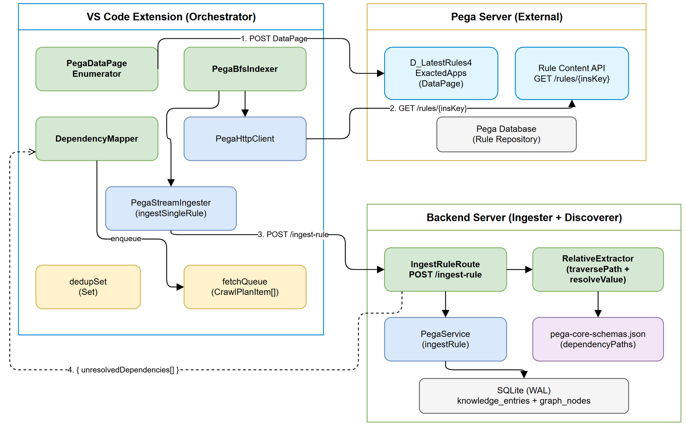
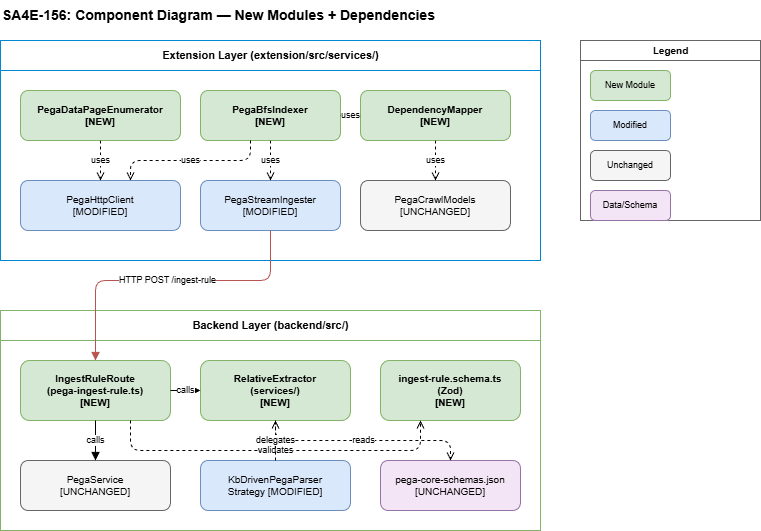

# Technical Design Document (TDD)

## SA4E — SA4E-156: [Pega Indexing] Schema-Driven Relative Discovery + DataPage Enumeration

---

## Document Information

| Field | Value |
|-------|-------|
| Jira Ticket | SA4E-156 |
| Title | [Pega Indexing] Schema-Driven Relative Discovery + DataPage Enumeration |
| Author | SA Agent |
| Version | 1.0 |
| Date | 2025-01-27 |
| Status | Draft |
| Related BRD | BRD-v1-SA4E-156.docx |
| Related FSD | FSD-v1-SA4E-156.docx |

---

## Author Tracking

| Role | Name - Position | Responsibility |
|------|-----------------|----------------|
| Author | SA Agent – Solution Architect | Create document |
| Peer Reviewer | BA Agent – Business Analyst | Review for completeness against BRD/FSD |

---

## Revision History

| Version | Date | Author | Changes |
|---------|------|--------|---------|
| 1.0 | 2025-01-27 | SA Agent | Initiate document — designed from BRD + FSD SA4E-156 |

---

## 1. Introduction

### 1.1 Purpose

This TDD specifies the technical architecture and implementation design for replacing the current per-RuleSet enumeration + blind 9-type class expansion with a DataPage-based enumeration + schema-driven relative discovery pipeline. It defines the new modules, their interfaces, data flow, and integration patterns.

### 1.2 Scope

| In Scope | Out of Scope |
|----------|--------------|
| Extension: PegaDataPageEnumerator, PegaBfsIndexer, DependencyMapper | Pega Server DataPage definition changes |
| Backend: IngestRuleRoute (new Hono route), RelativeExtractor (new service) | pega-core-schemas.json modifications |
| Recursive traversePath algorithm (fixes nested array bug OI-04) | UI/Webview changes |
| BFS loop with fetchQueue + dedupSet | Authentication changes |
| Integration tests for new components | Migration of existing indexed data |

### 1.3 Technology Stack

| Layer | Technology | Version |
|-------|-----------|---------|
| Language | TypeScript | 5.x |
| Extension Framework | VS Code Extension API | 1.85+ |
| Backend Framework | Hono | 4.x |
| Database | SQLite (better-sqlite3, WAL mode) | 9.x |
| Validation | Zod | 3.x |
| Build Tool | tsx (backend), esbuild (extension) | latest |
| Test Framework | Vitest | 1.x |

### 1.4 Design Principles

- Schema-driven: Rule dependency discovery configured via pega-core-schemas.json, not hardcoded logic
- Bounded BFS: dedupSet guarantees termination — no cycles possible
- Graceful degradation: Unknown rule types ingested but return empty relatives
- Single Responsibility: Each module has exactly one reason to change
- Fail-fast validation: Zod schemas validate at route boundary

### 1.5 Constraints

- Backend SQLite WAL — sequential per-rule ingest (no parallel writes)
- Pega Server concurrency — calibrated 2-10 parallel fetches
- Extension memory — dedupSet + fetchQueue must stay below 100MB total
- Backward compatibility — existing /pega/ingest-stream route unchanged

### 1.6 References

| Document | Location |
|----------|----------|
| BRD | BRD-v1-SA4E-156.docx |
| FSD | FSD-v1-SA4E-156.docx |
| Current Indexer | extension/src/services/PegaProjectIndexer.ts |
| Current Parser | backend/src/modules/pega/strategies/KbDrivenPegaParserStrategy.ts |
| Pega Core Schemas | backend/src/modules/pega/schemas/pega-core-schemas.json |

---

## 2. System Architecture

### 2.1 Architecture Overview

The system follows a three-tier producer-consumer architecture:

1. Extension (Orchestrator) — Calls Pega DataPage, manages BFS queue, coordinates fetching
2. Pega Server (Source) — Serves DataPage enumeration and individual rule content
3. Backend Server (Ingester + Discoverer) — Ingests rules into KB/Graph, extracts relatives via schema



Data Flow Per BFS Iteration:

```
Extension                     Pega Server              Backend Server
    |                              |                        |
    |---- DataPage POST ---------->|                        |
    |<--- pxResults[] -------------|                        |
    |                              |                        |
    |---- GET /rules/{insKey} ---->|                        |
    |<--- Full Rule JSON ----------|                        |
    |                              |                        |
    |---- POST /ingest-rule -------------------------------->|
    |<--- { stored, relatives[] } --------------------------|
    |                              |                        |
    | [enqueue new relatives]      |                        |
    | [loop until queue empty]     |                        |
```

### 2.2 Component Diagram



| Component | Responsibility | Location |
|-----------|---------------|----------|
| PegaDataPageEnumerator | Call DataPage, seed fetchQueue + dedupSet | Extension (new) |
| PegaBfsIndexer | BFS loop: fetch, ingest, enqueue relatives | Extension (new, replaces PegaProjectIndexer) |
| DependencyMapper | Map UnresolvedDependency to CrawlPlanItem | Extension (new) |
| IngestRuleRoute | Hono route: validate, ingest, extract, respond | Backend (new) |
| RelativeExtractor | traversePath + resolveValue algorithms | Backend (new) |
| KbDrivenPegaParserStrategy | Schema map, parseSymbol, extractDependencies | Backend (modified) |
| PegaService | Existing ingestion orchestrator (KB + Graph) | Backend (unchanged) |
| PegaHttpClient | HTTP client for Pega Server APIs | Extension (extended) |

### 2.3 Communication Patterns

| From | To | Protocol | Pattern | Description |
|------|----|----------|---------|-------------|
| Extension | Pega Server | REST/HTTPS | Sync, parallel (2-10) | DataPage POST + rule fetch GET |
| Extension | Backend | REST/HTTP (localhost) | Sync, sequential | POST /api/v1/pega/ingest-rule per rule |
| Backend | SQLite | In-process | Sync | WAL-mode writes for KB + Graph |

---

## 3. API Design

### 3.1 API Overview

| # | Endpoint | Method | Description | Source |
|---|----------|--------|-------------|--------|
| 1 | /api/v1/pega/ingest-rule | POST | Ingest one rule + extract relatives | UC-02 |
| 2 | /api/v1/pega/ingest-stream | POST | Existing NDJSON batch (unchanged) | SA4E-94 |

### 3.2 API: POST /api/v1/pega/ingest-rule

Implements: UC-02, BR-05, BR-06, BR-12

| Attribute | Value |
|-----------|-------|
| Method | POST |
| Path | /api/v1/pega/ingest-rule |
| Auth | None (localhost only) |
| Body Limit | 10 MB |
| Rate Limit | None (localhost) |

Request Body (Zod Schema):

```typescript
// backend/src/modules/pega/schemas/ingest-rule.schema.ts
import { z } from 'zod';

export const IngestRuleRequestSchema = z.object({
  projectId: z.string().min(1).max(12).regex(/^[a-f0-9]{12}$/),
  ruleJson: z.record(z.unknown()).refine(
    (obj) => typeof obj.pxObjClass === 'string' && obj.pxObjClass.length > 0,
    { message: "ruleJson.pxObjClass is required" }
  ),
  checksum: z.string().optional(),
  version: z.string().optional(),
});

export type IngestRuleRequest = z.infer<typeof IngestRuleRequestSchema>;
```

Response (Zod Schema):

```typescript
export const UnresolvedDependencySchema = z.object({
  insKey: z.string().nullable().optional(),
  ruleType: z.string(),
  className: z.string(),
  ruleName: z.string(),
});

export const IngestRuleResponseSchema = z.object({
  data: z.object({
    status: z.enum(['success', 'error']),
    ruleId: z.number().optional(),
    unresolvedDependencies: z.array(UnresolvedDependencySchema).default([]),
    reason: z.string().optional(),
  }).nullable(),
  error: z.object({
    code: z.string(),
    message: z.string(),
  }).nullable(),
});
```

Success Response (HTTP 201):

```json
{
  "data": {
    "status": "success",
    "ruleId": 42,
    "unresolvedDependencies": [
      { "ruleType": "Rule-Obj-Activity", "className": "Work-Cover-.CaseType", "ruleName": "ValidateInput", "insKey": null }
    ]
  },
  "error": null
}
```

Error Responses:

| Status | Code | Message | Condition |
|--------|------|---------|-----------|
| 400 | VALIDATION_ERROR | projectId is required | Missing/invalid projectId |
| 400 | VALIDATION_ERROR | ruleJson.pxObjClass is required | Missing pxObjClass in ruleJson |
| 503 | NOT_READY | Memory module not ready | Backend not fully initialized |
| 500 | INTERNAL_ERROR | Ingestion failed: {msg} | DB or parser error |

### 3.3 Pega DataPage Integration

Endpoint: POST /prweb/api/v1/data/D_LatestRules4ExactedApps

Called by PegaDataPageEnumerator in the Extension:

```json
// Request
{ "ApplicationNames": "TGB:08-01" }

// Response
{
  "pxResults": [
    { "pzInsKey": "RULE-OBJ-ACTIVITY ...", "pxObjClass": "Rule-Obj-Activity",
      "pyClassName": "Work-Cover-.CaseType", "pyRuleName": "CreateWorkObject",
      "pyRuleSet": "TGB", "pyRuleSetVersion": "08-01-01" }
  ],
  "pxResultCount": 1543
}
```

| Parameter | Value | Note |
|-----------|-------|------|
| Timeout | 30s (retry with 60s) | EF-01.4 |
| Retries | 1 | Double timeout on retry |
| Auth | Basic/OAuth from SecretStorage | Existing PegaHttpClient pattern |

---

## 4. Data Flow

### 4.1 End-to-End BFS Iteration Flow

```
Phase 1: Enumeration (PegaDataPageEnumerator)

  pega-project.json -> appName -> POST DataPage -> pxResults[]
  -> seed fetchQueue (CrawlPlanItem[])
  -> seed dedupSet (Set<string> of "{pxObjClass}!{pyClassName}!{pyRuleName}")

Phase 2: BFS Loop (PegaBfsIndexer)

  while (fetchQueue.length > 0) {
    batch = fetchQueue.splice(0, 50)      // take next 50
    rules[] = fetchRulesInParallel(batch)  // GET from Pega

    for (rule of rules) {
      response = POST /api/v1/pega/ingest-rule(projectId, rule)

      for (dep of response.unresolvedDependencies) {
        key = DependencyMapper.dedupKey(dep)
        if (!dedupSet.has(key)) {
          dedupSet.add(key)
          fetchQueue.push(DependencyMapper.toCrawlPlanItem(dep))
        }
      }
    }
    reportProgress(processed, fetchQueue.length + processed)
  }
```

### 4.2 Backend Ingestion Flow (per rule)

```
IngestRuleRoute.handle(req)
  |
  +-- 1. Validate with IngestRuleRequestSchema.safeParse(body)
  |       -> 400 on failure
  |
  +-- 2. PegaService.ingestRule({ projectId, ruleJson, checksum, version })
  |       +-- parseSymbol(ruleJson) -> ExtractedPegaSymbol
  |       +-- checkRuleWithChecksum() -> skip if exists + same checksum
  |       +-- insert into knowledge_entries (KB)
  |       +-- projectRuleToGraphNode() (Graph)
  |       +-- createDependencyEdges()
  |
  +-- 3. RelativeExtractor.extract(ruleJson)
  |       +-- lookup schema by pxObjClass
  |       +-- traversePath() for each dependencyPath (recursive)
  |       +-- resolveValue() for each extracted string
  |       +-- deduplicate results
  |
  +-- 4. Return { data: { status, ruleId, unresolvedDependencies }, error: null }
```

---

## 5. Module Design

### 5.1 Package Structure

Extension (new/modified files):

```
extension/src/
  services/
    PegaBfsIndexer.ts          # NEW - replaces PegaProjectIndexer
    PegaDataPageEnumerator.ts  # NEW - DataPage call + queue seeding
    DependencyMapper.ts        # NEW - UnresolvedDependency -> CrawlPlanItem
    PegaProjectIndexer.ts      # DEPRECATED (kept for rollback)
    PegaHttpClient.ts          # MODIFIED - add callDataPage()
    PegaCrawlHelper.ts         # UNCHANGED
    PegaStreamIngester.ts      # MODIFIED - add ingestSingleRule()
  models/
    PegaCrawlModels.ts         # UNCHANGED (CrawlPlanItem reused)
```

Backend (new/modified files):

```
backend/src/
  server/routes/
    pega-ingest-rule.ts        # NEW - Hono route for POST /ingest-rule
    pega-stream.ts             # UNCHANGED
  modules/pega/
    services/
      RelativeExtractor.ts     # NEW - traversePath + resolveValue
    schemas/
      pega-core-schemas.json   # UNCHANGED
      ingest-rule.schema.ts    # NEW - Zod validation schemas
    strategies/
      KbDrivenPegaParserStrategy.ts  # MODIFIED - delegate to RelativeExtractor
    PegaService.ts             # UNCHANGED (ingestRule already returns deps)
    models.ts                  # UNCHANGED (UnresolvedDependency defined)
```

### 5.2 Key Interfaces

#### Extension: PegaDataPageEnumerator

```typescript
/**
 * PegaDataPageEnumerator - Calls Pega DataPage to enumerate all rules for an Application.
 * Replaces enumerateAllRuleSets() from PegaRuleSetEnumerator.
 */
export interface DataPageEnumerationResult {
  fetchQueue: CrawlPlanItem[];
  dedupSet: Set<string>;
  ruleCount: number;
}

export class PegaDataPageEnumerator {
  constructor(private readonly pegaClient: PegaHttpClient) {}

  /**
   * Call D_LatestRules4ExactedApps and seed queue + dedup set.
   * @param appName - Application name from pega-project.json
   * @returns Seeded queue and dedup set ready for BFS
   * @throws Error if DataPage unreachable or returns invalid format
   */
  async enumerate(appName: string): Promise<DataPageEnumerationResult>;
}
```

#### Extension: PegaBfsIndexer

```typescript
/**
 * PegaBfsIndexer - BFS loop: fetch rules -> ingest -> enqueue discovered relatives.
 * Replaces PegaProjectIndexer.run() method.
 */
export interface BfsIndexResult {
  totalIngested: number;
  initialCount: number;
  discoveredCount: number;
  skippedCount: number;
  errorCount: number;
}

export class PegaBfsIndexer {
  constructor(
    private readonly pegaClient: PegaHttpClient,
    private readonly httpClient: IndexerHttpClient,
    private readonly outputChannel: vscode.OutputChannel | undefined,
    private readonly log: (msg: string) => void,
  ) {}

  /**
   * Run BFS indexing loop until queue is empty.
   * @param projectId - 12-char hex project identifier
   * @param fetchQueue - Mutable array (FIFO) of rules to fetch
   * @param dedupSet - Mutable set of seen dedup keys
   * @param report - VS Code progress reporter
   * @param root - Workspace root for saving rule files
   * @returns Summary with counts
   */
  async run(
    projectId: string,
    fetchQueue: CrawlPlanItem[],
    dedupSet: Set<string>,
    report: ProgressReporter,
    root: string,
  ): Promise<BfsIndexResult>;
}
```

#### Extension: DependencyMapper

```typescript
/**
 * DependencyMapper - Maps backend UnresolvedDependency to Extension CrawlPlanItem.
 * Handles terminology translation (FSD Appendix A.3).
 */
export class DependencyMapper {
  /**
   * Convert UnresolvedDependency to CrawlPlanItem for fetchQueue.
   * insKey is constructed synthetically if not provided by backend.
   */
  static toCrawlPlanItem(dep: UnresolvedDependency): CrawlPlanItem {
    const insKey = dep.insKey || `${dep.ruleType} ${dep.className} ${dep.ruleName}`;
    return {
      insKey,
      pxObjClass: dep.ruleType,
      pyClassName: dep.className,
      pyRuleName: dep.ruleName,
    };
  }

  /**
   * Construct dedup key from UnresolvedDependency.
   * Format: "{ruleType}!{className}!{ruleName}" (BR-01 compatible)
   */
  static dedupKey(dep: UnresolvedDependency): string {
    return `${dep.ruleType}!${dep.className}!${dep.ruleName}`;
  }

  /**
   * Construct dedup key from CrawlPlanItem (same format).
   */
  static dedupKeyFromItem(item: CrawlPlanItem): string {
    return `${item.pxObjClass}!${item.pyClassName}!${item.pyRuleName}`;
  }
}
```

#### Backend: RelativeExtractor

```typescript
/**
 * RelativeExtractor - Schema-driven dependency extraction with recursive nested array support.
 * Implements FSD Appendix C pseudocode (traversePath + resolveValue).
 */
export class RelativeExtractor {
  private schemaMissCounter = new Map<string, number>();

  constructor(private readonly schemaMap: Map<string, PegaRuleKbSchema>) {}

  /**
   * Extract relatives from a rule JSON using its schema's dependencyPaths.
   * @param ruleJson - Full Pega rule JSON
   * @returns Deduplicated list of discovered dependencies
   */
  extract(ruleJson: Record<string, unknown>): UnresolvedDependency[] {
    const pxObjClass = (ruleJson.pxObjClass as string) || '';
    const schema = this.schemaMap.get(pxObjClass);
    if (!schema) {
      // OI-03: Log schema miss
      this.schemaMissCounter.set(pxObjClass,
        (this.schemaMissCounter.get(pxObjClass) || 0) + 1);
      return [];
    }
    const paths = schema.dependencyPaths || [];
    if (paths.length === 0) return [];

    const deps: UnresolvedDependency[] = [];
    const seen = new Set<string>();

    for (const pathStr of paths) {
      const values = this.traversePath(ruleJson, pathStr);
      for (const value of values) {
        const resolved = this.resolveValue(value, ruleJson);
        if (resolved) {
          const key = `${resolved.ruleType}:${resolved.className}:${resolved.ruleName}`;
          if (!seen.has(key)) {
            seen.add(key);
            deps.push(resolved);
          }
        }
      }
    }
    return deps;
  }

  /**
   * Traverse a dependency path supporting nested arrays.
   * Path syntax: "array[].nested[].prop" - recursive at each "[]." boundary.
   */
  traversePath(obj: unknown, pathStr: string): string[] {
    if (obj === null || obj === undefined) return [];

    const arrayMarkerIdx = pathStr.indexOf('[].');
    if (arrayMarkerIdx !== -1) {
      const arrayProp = pathStr.substring(0, arrayMarkerIdx);
      const remainder = pathStr.substring(arrayMarkerIdx + 3);
      const arrayObj = this.navigateToProperty(obj, arrayProp);
      if (!Array.isArray(arrayObj)) return [];

      const results: string[] = [];
      for (const item of arrayObj) {
        if (item !== null && typeof item === 'object') {
          results.push(...this.traversePath(item, remainder));
        }
      }
      return results;
    }

    // No array marker - simple property access
    const value = this.navigateToProperty(obj, pathStr);
    if (typeof value === 'string' && value.trim().length > 0) {
      return [value.trim()];
    }
    return [];
  }

  /**
   * Resolve an extracted string value to an UnresolvedDependency.
   * Handles 5 patterns: insKey, .Property, ClassName.RuleName, simple name, unresolvable.
   */
  resolveValue(value: string, ruleJson: Record<string, unknown>): UnresolvedDependency | null {
    if (!value || value.trim().length === 0) return null;
    if (/^[=<>!]+$/.test(value)) return null;
    if (/^".*"$/.test(value)) return null;
    if (/^\d+$/.test(value)) return null;
    if (value.startsWith('Param.')) return null;
    if (value.startsWith('Primary.') || value.startsWith('pyWorkPage.')) return null;

    const currentClassName = (ruleJson.pyClassName as string) || '@baseclass';

    // Pattern 1: insKey format
    if (value.startsWith('RULE-') || value.startsWith('Rule-') || value.startsWith('DATA-')) {
      const parts = value.split(/\s+/);
      if (parts.length >= 3) {
        return { insKey: value, ruleType: parts[0], className: parts[1], ruleName: parts[2] };
      }
    }

    // Pattern 2: ".PropertyName"
    if (value.startsWith('.')) {
      const propName = value.substring(1);
      if (propName.length === 0) return null;
      return { ruleType: 'Rule-Obj-Property', className: currentClassName, ruleName: propName };
    }

    // Pattern 3: "ClassName.RuleName" - split at LAST dot
    const lastDotIdx = value.lastIndexOf('.');
    if (lastDotIdx > 0 && lastDotIdx < value.length - 1) {
      const className = value.substring(0, lastDotIdx);
      const ruleName = value.substring(lastDotIdx + 1);
      if (className.includes('-') || /^[A-Z]/.test(className)) {
        return { ruleType: 'Unknown', className, ruleName };
      }
    }

    // Pattern 4: Simple name (no dot, no space)
    if (!value.includes(' ') && !value.includes('.')) {
      return { ruleType: 'Unknown', className: currentClassName, ruleName: value };
    }

    // Pattern 5: Unresolvable
    return { ruleType: 'Unknown', className: '@baseclass', ruleName: value };
  }

  /** Navigate dot-separated path (no array markers). */
  private navigateToProperty(obj: unknown, path: string): unknown {
    const segments = path.split('.');
    let current: unknown = obj;
    for (const seg of segments) {
      if (current === null || current === undefined || typeof current !== 'object') return undefined;
      current = (current as Record<string, unknown>)[seg];
    }
    return current;
  }

  /** Get schema miss report for post-indexing logging. */
  getSchemaMissReport(): Map<string, number> {
    return new Map(this.schemaMissCounter);
  }
}
```

#### Backend: IngestRuleRoute

```typescript
/**
 * IngestRuleRoute - Hono route handler for POST /api/v1/pega/ingest-rule.
 * Validates request, delegates to PegaService + RelativeExtractor.
 */
import { Hono } from 'hono';
import { bodyLimit } from 'hono/body-limit';
import type { Logger } from 'pino';
import type { ModuleRegistry } from '../../modules/ModuleRegistry.js';
import { IngestRuleRequestSchema } from '../../modules/pega/schemas/ingest-rule.schema.js';
import { RelativeExtractor } from '../../modules/pega/services/RelativeExtractor.js';
import { PegaService } from '../../modules/pega/PegaService.js';

export function createIngestRuleRoute(registry: ModuleRegistry, logger: Logger): Hono {
  const app = new Hono();

  app.use('*', bodyLimit({ maxSize: 10 * 1024 * 1024 })); // 10MB limit

  app.post('/', async (c) => {
    // 1. Resolve service
    const memModule = registry.getModule('memory') as any;
    if (!memModule || memModule.status !== 'ready') {
      return c.json({ data: null, error: { code: 'NOT_READY', message: 'Memory module not ready' } }, 503);
    }
    const service = new PegaService(memModule.getEngine());

    // 2. Validate request
    const body = await c.req.json();
    const parsed = IngestRuleRequestSchema.safeParse(body);
    if (!parsed.success) {
      const msg = parsed.error.errors[0]?.message || 'Invalid request';
      return c.json({ data: null, error: { code: 'VALIDATION_ERROR', message: msg } }, 400);
    }

    // 3. Ingest rule
    const { projectId, ruleJson, checksum, version } = parsed.data;
    const result = await service.ingestRule({ projectId, ruleJson, checksum, version });

    // 4. Extract relatives (using RelativeExtractor for recursive support)
    const extractor = new RelativeExtractor(/* schemaMap from service */);
    const relatives = extractor.extract(ruleJson as Record<string, unknown>);

    // 5. Return combined response
    return c.json({
      data: {
        status: result.status,
        ruleId: result.ruleId,
        unresolvedDependencies: relatives.length > 0 ? relatives : (result.unresolvedDependencies || []),
        reason: result.reason,
      },
      error: null,
    }, result.ruleId === -1 ? 200 : 201);
  });

  return app;
}
```

### 5.3 Design Patterns

| Pattern | Where Used | Rationale |
|---------|-----------|-----------|
| Strategy | KbDrivenPegaParserStrategy + RelativeExtractor | Schema-driven behavior without conditionals |
| Facade | PegaBfsIndexer | Simplifies complex BFS + fetch + ingest orchestration |
| Mapper | DependencyMapper | Clean translation between backend/extension terminology |
| Factory | createIngestRuleRoute() | Hono route factory pattern consistent with existing routes |
| Iterator | traversePath recursion | Handles arbitrary nesting depth in dependency paths |

### 5.4 Error Handling

| Exception | HTTP Status | Error Code | When Thrown |
|-----------|-------------|------------|------------|
| Zod validation failure | 400 | VALIDATION_ERROR | Invalid request body |
| PegaService not ready | 503 | NOT_READY | Memory module not initialized |
| ingestRule internal error | 500 | INTERNAL_ERROR | DB write failure |
| Parser skip (unknown type) | 201 | - | ruleId: -1, reason: parser_skip |

---

## 6. Database Impact

### 6.1 Tables Affected

No schema changes. The new endpoint writes to the same tables as the existing NDJSON stream:

| Table | Operation | Change from Current |
|-------|-----------|---------------------|
| knowledge_entries | INSERT (per rule) | Same - was per-line in NDJSON, now per-HTTP-call |
| graph_nodes | INSERT (per rule) | Same |
| graph_edges | INSERT (per dependency) | Same |
| pending_tasks | INSERT (enrichment task) | Same |
| project_registry | UPSERT (once at end) | Called by Extension after BFS completes |

### 6.2 Write Pattern Comparison

| Aspect | Before (NDJSON stream) | After (per-rule POST) |
|--------|----------------------|----------------------|
| Transaction scope | 1 request = N rules | 1 request = 1 rule |
| Failure isolation | Batch failure loses context | Per-rule failure: skip and continue |
| Dependency response | None (fire-and-forget) | Immediate per-rule (enables BFS) |
| DB load | Burst write | Steady sequential writes |

### 6.3 Query Patterns

| Operation | Query | Expected Performance |
|-----------|-------|---------------------|
| Checksum dedup check | SELECT id FROM knowledge_entries WHERE source = $1 AND project_id = $2 | < 1ms (indexed) |
| Rule insert | INSERT INTO knowledge_entries ... | < 5ms (WAL) |
| Graph node upsert | INSERT OR REPLACE INTO graph_nodes ... | < 5ms |
| Edge creation | INSERT INTO graph_edges ... (per dep) | < 2ms x N deps |

---

## 7. Security Design

### 7.1 Input Validation

| Field | Validation | Sanitization |
|-------|-----------|--------------|
| projectId | Zod: z.string().regex(/^[a-f0-9]{12}$/) | Reject non-hex |
| ruleJson | Zod: z.record(z.unknown()) + pxObjClass check | No sanitization (stored as-is) |
| ruleJson body size | Hono middleware: bodyLimit({ maxSize: 10*1024*1024 }) | Reject > 10MB |

### 7.2 Credential Handling

| Credential | Storage | Access |
|-----------|---------|--------|
| Pega Basic Auth / OAuth token | VS Code SecretStorage | Extension only - never sent to Backend |
| Backend URL | VS Code settings | Extension reads at runtime |

Security Rule: Pega credentials never leave the Extension process. Backend receives only rule JSON content (no auth headers forwarded).

### 7.3 Path Traversal Prevention

saveRuleFile() in Extension must sanitize file paths:

```typescript
// BR-Security: Prevent path traversal via malicious pyRuleName
const safeName = path.basename(pyRuleName).replace(/[<>:"/\\|?*]/g, '_');
const filePath = path.join(root, 'rules', pxObjClass, `${safeName}.pega.json`);
```

### 7.4 Denial of Service Protection

| Threat | Mitigation |
|--------|------------|
| Extremely large rule JSON (> 10MB) | Hono bodyLimit middleware |
| Memory exhaustion from dedupSet | Warning at 100K entries (Extension) |
| Infinite BFS loop | dedupSet prevents cycles; bounded by unique rules |
| Backend overload | Sequential per-rule calls (no batched writes) |

---

## 8. Error Handling and Retry Strategy

### 8.1 Retry Matrix

| Call Type | Timeout | Retries | Backoff | On Final Failure |
|-----------|---------|---------|---------|------------------|
| DataPage POST | 30s | 1 (timeout to 60s) | None | Abort indexing |
| Rule fetch GET | 30s | 1 after 2s | Linear | Skip rule, log |
| ingest-rule POST | 10s | 3 | Exponential (1s, 2s, 4s) | Skip rule, log |
| Backend reconnect (ECONNREFUSED) | - | 3 attempts | Linear (10s wait) | Abort with partial |

### 8.2 Circuit Breaker for Pega Server

```typescript
// Backpressure detection in PegaBfsIndexer
if (batchErrorRate > 0.5) { // >50% of batch returns 429 or 503
  concurrency = Math.max(2, Math.floor(concurrency / 2));
  await sleep(5000);  // 5s cooldown
  log(`[BFS] Backpressure detected. Reducing concurrency to ${concurrency}`);
}
```

### 8.3 Graceful Degradation

| Failure Mode | Behavior |
|-------------|----------|
| Backend restart mid-indexing | Detect ECONNREFUSED, wait 10s, retry 3x, abort partial |
| Schema not found for pxObjClass | Ingest rule (KB+Graph) but return relatives: [] |
| Single rule parse error | Skip rule (ruleId: -1), continue BFS |
| Memory pressure (dedupSet > 100K) | Log warning, continue (VS Code has ~2GB heap) |

---

## 9. Performance and Scalability

### 9.1 Performance Targets

| Metric | Target | Measurement |
|--------|--------|-------------|
| Enumeration (DataPage call) | < 10s for < 5000 rules | Single POST response time |
| BFS throughput | > 20 rules/second | Total rules / BFS duration |
| Backend ingest-rule p95 | < 100ms per rule | Request-to-response |
| Total indexing (5000-rule app) | < 10 minutes | End-to-end |

### 9.2 Memory Budget

| Component | Budget | Calculation |
|-----------|--------|-------------|
| dedupSet | 3-5 MB (50K rules) | ~200 bytes/key x 50K |
| fetchQueue | 10-20 MB peak | ~200 bytes/item x 50K |
| In-flight rules (batch) | 5-25 MB | 50 rules x 100-500KB |
| Total Extension overhead | < 100 MB peak | All combined |

### 9.3 Concurrency Calibration

```typescript
// Existing calibrateFetchConcurrency() determines optimal parallel fetches
// Default: 5 parallel. Range: 2-10 based on server response time probe.
// Probe: Fetch 3 rules sequentially, measure avg latency.
//   < 200ms -> concurrency = 10
//   200-500ms -> concurrency = 5
//   > 500ms -> concurrency = 2
```

---

## 10. Open Issue Decisions

Per FSD Appendix E, the following technical decisions are made:

| ID | Issue | Decision | Rationale |
|----|-------|----------|-----------|
| OI-01 | Should extractRelatives return insKey? | No (null) for v1 | insKey resolution requires extra Pega API call per relative. Extension constructs synthetic fetch keys from class+name. |
| OI-02 | Should backend batch multiple ingest-rule calls? | No - keep per-rule POST | Per-rule is simpler for BFS loop. Latency < 100ms on localhost. Batching adds complexity without significant gain. |
| OI-03 | What if pega-core-schemas.json is outdated? | Log schema_miss counter + post-indexing summary | Add counter to RelativeExtractor. PegaBfsIndexer logs schema coverage report at end. |
| OI-04 | Current extractByPath doesn't support nested arrays | Implement recursive traversePath | This is a bug. FSD Appendix C provides the algorithm. Replace KbDrivenPegaParserStrategy.extractByPath(). |
| OI-05 | FSD terminology vs Code terminology | Document mapping, don't rename | DependencyMapper handles translation. Appendix A.3 is the authoritative reference. |
| OI-06 | Extension must map UnresolvedDependency to CrawlPlanItem | Create DependencyMapper utility class | Static methods: toCrawlPlanItem(), dedupKey(). Clean separation of concern. |

---

## 11. Implementation Checklist

Ordered tasks for DEV agent. Dependencies indicated.

### Phase 1: Backend - RelativeExtractor (no external dependencies)

| # | Task | File | Depends On |
|---|------|------|------------|
| 1.1 | Create RelativeExtractor class with traversePath() (recursive) | backend/src/modules/pega/services/RelativeExtractor.ts | - |
| 1.2 | Implement resolveValue() with 5 patterns + filters | Same file | 1.1 |
| 1.3 | Implement extract() - schema lookup + traverse + resolve + dedup | Same file | 1.2 |
| 1.4 | Unit tests: traversePath (1-level, 2-level nested, object nav, null) | __tests__/RelativeExtractor.test.ts | 1.1 |
| 1.5 | Unit tests: resolveValue (all 5 patterns + edge cases from FSD C.3) | Same file | 1.2 |
| 1.6 | Unit tests: extract() full flow with real schema entries | Same file | 1.3 |

### Phase 2: Backend - IngestRuleRoute

| # | Task | File | Depends On |
|---|------|------|------------|
| 2.1 | Create Zod schemas (request + response) | backend/src/modules/pega/schemas/ingest-rule.schema.ts | - |
| 2.2 | Create Hono route createIngestRuleRoute() | backend/src/server/routes/pega-ingest-rule.ts | 2.1, 1.3 |
| 2.3 | Wire RelativeExtractor into route (PegaService.ingestRule + RelativeExtractor.extract) | 2.2 | 1.3 |
| 2.4 | Add bodyLimit(10MB) middleware to route | 2.2 | - |
| 2.5 | Mount route in HttpServer.ts at /api/v1/pega/ingest-rule | backend/src/server/HttpServer.ts | 2.2 |
| 2.6 | Add schema miss counter logging to RelativeExtractor | RelativeExtractor.ts | 1.3 |
| 2.7 | Integration test: valid request -> 201 + unresolvedDependencies | __tests__/pega-ingest-rule.test.ts | 2.5 |
| 2.8 | Integration test: invalid request -> 400 | Same file | 2.5 |
| 2.9 | Integration test: unknown pxObjClass -> 201 + empty deps | Same file | 2.5 |

### Phase 3: Extension - DataPage Enumerator

| # | Task | File | Depends On |
|---|------|------|------------|
| 3.1 | Add callDataPage(appName) method to PegaHttpClient | extension/src/services/PegaHttpClient.ts | - |
| 3.2 | Create PegaDataPageEnumerator class | extension/src/services/PegaDataPageEnumerator.ts | 3.1 |
| 3.3 | Implement timeout + retry (30s to 60s) | 3.2 | - |
| 3.4 | Unit test: DataPage -> queue seeded correctly | __tests__/PegaDataPageEnumerator.test.ts | 3.2 |
| 3.5 | Unit test: Empty response -> graceful termination | Same file | 3.2 |

### Phase 4: Extension - DependencyMapper

| # | Task | File | Depends On |
|---|------|------|------------|
| 4.1 | Create DependencyMapper class (static methods) | extension/src/services/DependencyMapper.ts | - |
| 4.2 | Unit test: toCrawlPlanItem (with and without insKey) | __tests__/DependencyMapper.test.ts | 4.1 |
| 4.3 | Unit test: dedupKey format matches BR-01 | Same file | 4.1 |

### Phase 5: Extension - PegaBfsIndexer

| # | Task | File | Depends On |
|---|------|------|------------|
| 5.1 | Create PegaBfsIndexer class | extension/src/services/PegaBfsIndexer.ts | 4.1 |
| 5.2 | Add ingestSingleRule(projectId, ruleJson) to PegaStreamIngester | extension/src/services/PegaStreamIngester.ts | 2.5 |
| 5.3 | Implement BFS loop: batch fetch, ingest, enqueue relatives | 5.1 | 5.2, 4.1 |
| 5.4 | Implement backpressure detection + concurrency reduction | 5.1 | - |
| 5.5 | Implement reconnect logic (ECONNREFUSED, 3 attempts) | 5.1 | - |
| 5.6 | Implement progress reporting (initial vs discovered counts) | 5.1 | - |
| 5.7 | Integration test: BFS with mock backend returning relatives | __tests__/PegaBfsIndexer.test.ts | 5.3 |
| 5.8 | Integration test: dedup prevents infinite loop (A->B->C->A) | Same file | 5.3 |

### Phase 6: Extension - Wire Up (Entry Point)

| # | Task | File | Depends On |
|---|------|------|------------|
| 6.1 | Replace PegaProjectIndexer.run() call site with new pipeline | Caller site (extension.ts or command) | 3.2, 5.1 |
| 6.2 | Remove enumerateAllRuleSets import + fetchRuleTypesInParallel calls | Old imports | 6.1 |
| 6.3 | Remove resolveDeterministicPegaHierarchy dependency for indexing | Old code | 6.1 |
| 6.4 | Keep PegaProjectIndexer.ts as deprecated (feature flag rollback) | - | - |

### Phase 7: Regression and Cleanup

| # | Task | File | Depends On |
|---|------|------|------------|
| 7.1 | Run npm test in backend/ - all existing tests pass | - | All backend |
| 7.2 | Run npm test in extension/ - all existing tests pass | - | All extension |
| 7.3 | E2E test: Full indexing with mock Pega (< 100 rules) | New E2E file | 6.1 |
| 7.4 | Post-indexing summary log: schema coverage report | PegaBfsIndexer | 5.3, 2.6 |

---

## 12. Monitoring and Observability

### 12.1 Logging

| Log Event | Level | Component | Fields |
|-----------|-------|-----------|--------|
| DataPage call result | INFO | Extension | appName, ruleCount, durationMs |
| BFS batch complete | DEBUG | Extension | processed, queueSize, discovered |
| BFS complete | INFO | Extension | total, initial, discovered, skipped, errors, durationMs |
| Rule ingested | DEBUG | Backend | fqn, ruleId, depsCount |
| Schema miss | WARN | Backend | pxObjClass, ruleCount |
| Backpressure detected | WARN | Extension | errorRate, newConcurrency |
| Backend reconnect | WARN | Extension | attempt, maxAttempts |

### 12.2 Schema Coverage Report (Post-Indexing)

```
[Pega Indexer] Schema Coverage Report:
  Rule types with schema: 8/12 (66%)
  Rules without schema (no relatives extracted): 142
  Missing schemas: Rule-Connect-SOAP, Rule-Queue-Standard, Rule-Utility-Function, Rule-Obj-CaseType
```

---

## 13. Appendix

### 13.1 Terminology Mapping (FSD A.3 to Code)

| FSD Term | Code Term | Location |
|----------|-----------|----------|
| RuleSummary | RuleSetRuleSummary | extension/src/models/PegaCrawlModels.ts |
| RelativeRuleInfo | UnresolvedDependency | backend/src/modules/pega/models.ts |
| stored: boolean | status + ruleId | ruleId === -1 means skipped |
| relatives[] | unresolvedDependencies[] | Same semantic |
| pyRuleName (in relative) | ruleName | UnresolvedDependency field |
| pxObjClass (in relative) | ruleType | UnresolvedDependency field |
| pyClassName (in relative) | className | UnresolvedDependency field |

### 13.2 Dedup Key Format

Extension side: "{pxObjClass}!{pyClassName}!{pyRuleName}" (BR-01)

Mapping from UnresolvedDependency:
```typescript
static dedupKey(dep: UnresolvedDependency): string {
  return `${dep.ruleType}!${dep.className}!${dep.ruleName}`;
}
```

### 13.3 Glossary

| Term | Definition |
|------|------------|
| DataPage | Pega platform caching mechanism. D_LatestRules4ExactedApps returns latest rules for an Application stack. |
| dependencyPaths | JSON paths in pega-core-schemas.json pointing to fields that reference other rules. |
| dedupSet | In-memory Set of string preventing duplicate fetches. Key: "{pxObjClass}!{pyClassName}!{pyRuleName}" |
| fetchQueue | FIFO array (CrawlPlanItem[]) of rules to fetch. Seeded by DataPage, grown by relatives. |
| BFS | Breadth-First Search — process all rules at current depth before discovered relatives. |
| insKey | Pega instance key (pzInsKey) — unique DB identifier for a rule version. |
| RelativeExtractor | New backend service implementing recursive path traversal + value resolution. |

### Diagram Index

| # | Diagram | Image | Source (editable) |
|---|---------|-------|-------------------|
| 1 | Architecture Overview | [architecture.png](diagrams/architecture.png) | [architecture.drawio](diagrams/architecture.drawio) |
| 2 | Component Diagram | [component.png](diagrams/component.png) | [component.drawio](diagrams/component.drawio) |
