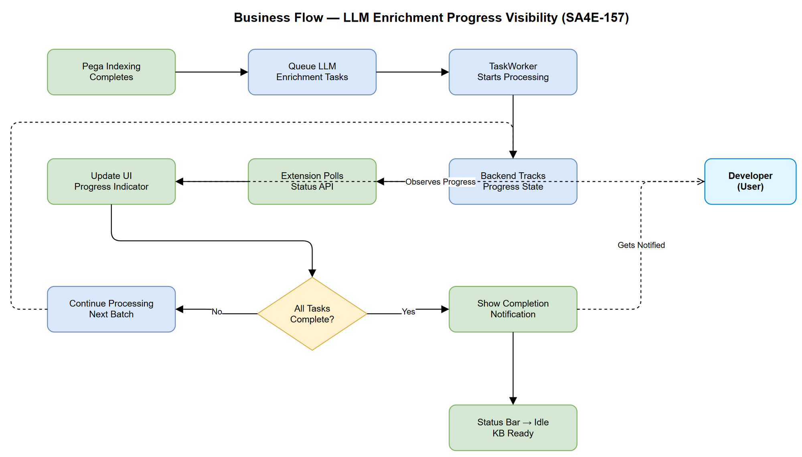
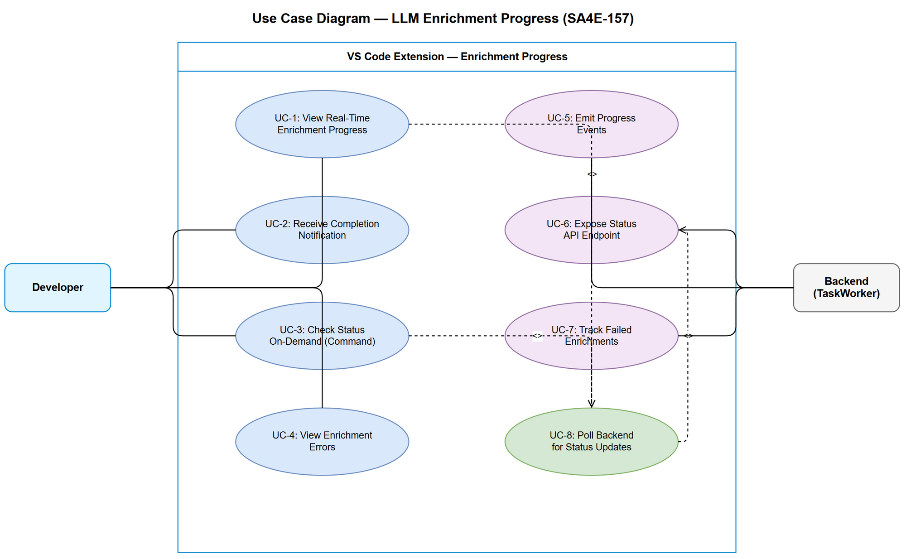

# Business Requirements Document (BRD)

## SDLC-Agents-4-Enterprise — SA4E-157: [Bug] LLM Enrichment Progress Not Visible to User After Indexing Completes

---

## Document Information

| Field | Value |
|-------|-------|
| Jira Ticket | SA4E-157 |
| Title | [Bug] LLM enrichment progress not visible to user after indexing completes |
| Author | BA Agent |
| Version | 1.0 |
| Date | 2025-07-27 |
| Status | Draft |

---

## Author Tracking

| Role | Name - Position | Responsibility |
|------|-----------------|----------------|
| Author | BA Agent – Business Analyst | Create document |
| Peer Reviewer | TA Agent – Technical Architect | Review document |

---

## Revision History

| Version | Date | Author | Changes |
|---------|------|--------|---------|
| 1.0 | 2025-07-27 | BA Agent | Initiate document — auto-generated from Jira ticket SA4E-157 |

---

## Sign-Off

| Name | Signature and date |
|------|--------------------|
| | ☐ I agree and confirm all criteria on this BRD as expected requirements |
| | ☐ I agree and confirm all criteria on this BRD as expected requirements |

---

## 1. Introduction

### 1.1 Scope

This BRD addresses the user experience gap where LLM enrichment (summary + pseudocode generation) runs silently in the background after Pega indexing completes. The user currently has no visibility into enrichment progress, completion status, or remaining work. This change will add real-time progress reporting from the backend TaskWorker queue to the VS Code extension UI.

### 1.2 Out of Scope

- Changes to the LLM enrichment logic itself (prompt engineering, model selection)
- Changes to the Pega indexing process
- Enrichment performance optimization (batch sizes, parallelism)
- Historical enrichment analytics or dashboards
- Backend queue infrastructure changes (TaskWorker replacement)

### 1.3 Preliminary Requirement

- Pega indexing feature fully functional (rules stored in KB)
- TaskWorker queue processing LLM enrichment tasks
- Backend REST API (Hono) accessible from extension
- VS Code Extension API available (vscode.window.withProgress, StatusBarItem)

---

## 2. Business Requirements

### 2.1 High Level Process Map

After Pega indexing completes (e.g., "Job complete: 24082 rules stored"), the system queues LLM enrichment tasks for each rule (generating summaries and pseudocode). Currently this runs in total silence. The user cannot distinguish between "system idle" and "system enriching 24,000 rules."

This change introduces a progress reporting pipeline: Backend TaskWorker emits progress events → Backend exposes enrichment status via REST API → Extension polls/subscribes and renders progress in the UI.

### 2.2 List of User Stories / Use Cases

| # | Story / Use Case / Epic | Priority | Source Ticket |
|---|-------------------------|----------|---------------|
| 1 | As a developer, I want to see real-time progress of LLM enrichment so that I know when KB-powered features will be ready | MUST HAVE | SA4E-157 |
| 2 | As a developer, I want to be notified when enrichment completes so that I can start using KB search/chat with confidence | MUST HAVE | SA4E-157 |
| 3 | As a developer, I want to check enrichment status at any time via command or status bar so that I'm never guessing about system state | MUST HAVE | SA4E-157 |
| 4 | As a developer, I want to see enrichment errors/failures so that I know if something went wrong | SHOULD HAVE | SA4E-157 |

---

### 2.3 Details of User Stories

---

#### Business Flow

**Step 1:** Pega indexing completes — "Job complete: N rules stored" message shown to user.

**Step 2:** System automatically queues LLM enrichment tasks for all indexed rules that lack summary/pseudocode.

**Step 3:** TaskWorker begins processing enrichment queue. Backend tracks: total tasks, completed tasks, failed tasks, current task.

**Step 4:** Extension UI displays progress indicator showing enrichment status (e.g., "Enriching: 150/2999 rules (5%)").

**Step 5:** User can interact with other features while enrichment runs in background. Progress updates continuously.

**Step 6:** When enrichment completes (all tasks done or max retries exhausted), extension shows completion notification.

**Step 7:** Status bar returns to idle state. User can verify final status via command at any time.

> **Note:** Enrichment is a long-running background process (potentially hours for large rule sets). Progress must not block the user from other work.

---

#### STORY 1: Real-Time Enrichment Progress Display

> As a developer, I want to see real-time progress of LLM enrichment so that I know when KB-powered features will be ready.

**Requirement Details:**

1. After indexing completes and enrichment starts, a progress indicator MUST appear in the VS Code UI
2. Progress MUST show: completed count / total count and percentage (e.g., "Enriching: 150/2999 rules (5%)")
3. Progress MUST update at a reasonable interval (every 5-10 seconds or per batch completion)
4. Progress indicator MUST NOT block user interaction with the editor
5. Progress MUST be visible without requiring user action (auto-displayed)

**Acceptance Criteria:**

1. GIVEN indexing completes with N rules stored, WHEN enrichment starts, THEN a progress indicator appears within 5 seconds showing "Enriching: 0/N rules (0%)"
2. GIVEN enrichment is running, WHEN a batch of rules is enriched, THEN the progress indicator updates to reflect new completed count and percentage
3. GIVEN enrichment is running, WHEN user is editing code or using other features, THEN the progress indicator does NOT interfere with their workflow
4. GIVEN enrichment is running, WHEN user closes and reopens VS Code, THEN the progress indicator resumes showing current state (not starting from 0)

---

#### STORY 2: Enrichment Completion Notification

> As a developer, I want to be notified when enrichment completes so that I can start using KB search/chat with confidence.

**Requirement Details:**

1. When all enrichment tasks complete successfully, a notification MUST be shown to the user
2. Notification MUST indicate success and the total number of rules enriched
3. If enrichment completes with some failures, notification MUST indicate partial completion with failure count
4. Notification MUST be non-blocking (information message, not modal dialog)

**Acceptance Criteria:**

1. GIVEN enrichment is running with N total rules, WHEN all N rules are enriched successfully, THEN user sees notification: "✅ Enrichment complete: N rules enriched. KB is ready."
2. GIVEN enrichment is running, WHEN enrichment finishes with F failures out of N total, THEN user sees notification: "⚠️ Enrichment complete: (N-F)/N rules enriched. F rules failed."
3. GIVEN user has VS Code focused, WHEN enrichment completes, THEN notification appears within 5 seconds of last task completing

---

#### STORY 3: On-Demand Enrichment Status Check

> As a developer, I want to check enrichment status at any time via command or status bar so that I'm never guessing about system state.

**Requirement Details:**

1. A persistent status bar item MUST show current enrichment state at all times
2. A VS Code command (e.g., "SA4E: Show Enrichment Status") MUST be available to display detailed status
3. Status bar states: Idle (no enrichment), Running (with progress), Complete, Error
4. Clicking the status bar item SHOULD show detailed information (total, completed, failed, estimated time remaining)

**Data Fields:**

| Field | Type | Required | Description | Example |
|-------|------|----------|-------------|---------|
| state | enum | Yes | Current enrichment state | `idle`, `running`, `complete`, `error` |
| totalRules | number | Yes | Total rules queued for enrichment | 2999 |
| completedRules | number | Yes | Rules successfully enriched | 150 |
| failedRules | number | Yes | Rules that failed enrichment | 3 |
| currentBatch | number | No | Current batch being processed | 8 |
| startedAt | ISO datetime | Yes | When enrichment started | 2025-07-27T10:30:00Z |
| estimatedCompletion | ISO datetime | No | Estimated completion time | 2025-07-27T12:45:00Z |

**Acceptance Criteria:**

1. GIVEN enrichment is idle, WHEN user looks at status bar, THEN they see a neutral icon (no enrichment indicator or "KB: Ready")
2. GIVEN enrichment is running, WHEN user looks at status bar, THEN they see: "$(sync~spin) Enriching: 150/2999 (5%)"
3. GIVEN enrichment is running, WHEN user executes "SA4E: Show Enrichment Status" command, THEN a detailed panel/notification shows: total, completed, failed, start time, and estimated remaining time
4. GIVEN enrichment completed, WHEN user looks at status bar, THEN they see "KB: Ready" or equivalent idle state
5. GIVEN enrichment errored, WHEN user looks at status bar, THEN they see an error indicator with action to view details

---

#### STORY 4: Enrichment Error Visibility

> As a developer, I want to see enrichment errors/failures so that I know if something went wrong.

**Requirement Details:**

1. Individual rule enrichment failures SHOULD NOT stop the entire enrichment process
2. Failed rules MUST be tracked and reported in the final status
3. User SHOULD be able to view which rules failed and why (at a summary level)
4. Errors SHOULD be logged to the extension output channel for debugging

**Acceptance Criteria:**

1. GIVEN a rule fails LLM enrichment (API error, timeout, etc.), WHEN the failure occurs, THEN the failure is recorded and enrichment continues with next rule
2. GIVEN enrichment has failures, WHEN user checks detailed status, THEN they can see the count of failed rules
3. GIVEN enrichment completes with failures, WHEN user views output channel, THEN failed rule details are logged

---

## 3. Dependencies

| Dependency | Type | Related Ticket | Description |
|------------|------|----------------|-------------|
| Backend REST API (Hono) | System | N/A | Must expose enrichment status endpoint |
| TaskWorker Queue | System | N/A | Must emit progress events or maintain queryable state |
| VS Code Extension API | System | N/A | vscode.window.withProgress, StatusBarItem, commands |
| Pega Indexing | System | N/A | Must be functional — enrichment starts after indexing |
| LLM Provider (Anthropic/OpenAI) | External | N/A | Must be configured for enrichment to run |

---

## 4. Stakeholders

| Role | Name / Team | Responsibility | Source |
|------|-------------|----------------|--------|
| Developer (End User) | Extension Users | Primary user — needs visibility into enrichment state | SA4E-157 reporter |
| Backend Developer | Dev Team | Implement status tracking + API endpoint | Implementor |
| Extension Developer | Dev Team | Implement UI progress components | Implementor |

---

## 5. Risks and Assumptions

### 5.1 Risks

| Risk | Impact | Likelihood | Mitigation |
|------|--------|------------|------------|
| Frequent polling overloads backend during large enrichment jobs | Medium | Medium | Use reasonable poll interval (5-10s), not per-rule updates |
| Progress state lost on backend restart | Medium | Low | Persist progress in DB; resume from last known state |
| LLM API rate limits cause prolonged enrichment | High | Medium | Show estimated time; handle gracefully in UI |
| Status bar clutter if multiple enrichment jobs overlap | Low | Low | Show aggregated status; queue jobs sequentially |

### 5.2 Assumptions

- TaskWorker processes enrichment tasks sequentially or in controlled batches (not unbounded parallelism)
- Backend has access to enrichment queue state (total pending, completed, failed counts)
- Extension maintains persistent connection to backend during VS Code session
- LLM enrichment tasks are idempotent (can be retried safely)
- One enrichment job runs at a time per workspace (not concurrent multiple indexing jobs)

---

## 6. Non-Functional Requirements

| Category | Requirement | Details |
|----------|-------------|---------|
| Performance | Progress updates must not degrade editor performance | Poll interval ≥5s; status bar updates lightweight |
| Performance | API status endpoint response time < 200ms | Simple DB query for counts |
| Reliability | Progress must survive VS Code restart | Backend is source of truth; extension re-fetches on activation |
| Usability | Progress visible without user action | Auto-display on enrichment start |
| Usability | No modal dialogs or blocking UI | All indicators non-intrusive |
| Scalability | Handle 24,000+ rules without UI issues | Percentage-based display; no per-rule UI elements |

---

## 7. Related Tickets

| Ticket Key | Summary | Status | Type | Relationship |
|------------|---------|--------|------|--------------|
| SA4E-157 | [Bug] LLM enrichment progress not visible to user after indexing completes | Open | Bug | Main ticket |

---

## 8. Appendix

### Use Case Diagram

### Glossary

| Term | Definition |
|------|------------|
| LLM Enrichment | Process of generating AI summaries and pseudocode for indexed Pega rules using a large language model |
| TaskWorker | Backend queue processor that executes enrichment tasks asynchronously |
| KB (Knowledge Base) | The indexed + enriched database of Pega rules used for search and AI features |
| Pega Indexing | Initial process of fetching and storing Pega rules into the local database |
| StatusBarItem | VS Code API component for showing persistent information in the editor's bottom status bar |

### Reference Documents

| Document | Link / Location |
|----------|-----------------|
| VS Code Extension API — Progress | https://code.visualstudio.com/api/references/vscode-api#ProgressLocation |
| VS Code Extension API — StatusBarItem | https://code.visualstudio.com/api/references/vscode-api#StatusBarItem |
| Hono REST Framework | https://hono.dev/ |

### Diagram Index

| # | Diagram | Image | Source (editable) |
|---|---------|-------|-------------------|
| 1 | Business Flow | [business-flow.png](diagrams/business-flow.png) | [business-flow.drawio](diagrams/business-flow.drawio) |
| 2 | Use Case Diagram | [use-case.png](diagrams/use-case.png) | [use-case.drawio](diagrams/use-case.drawio) |
