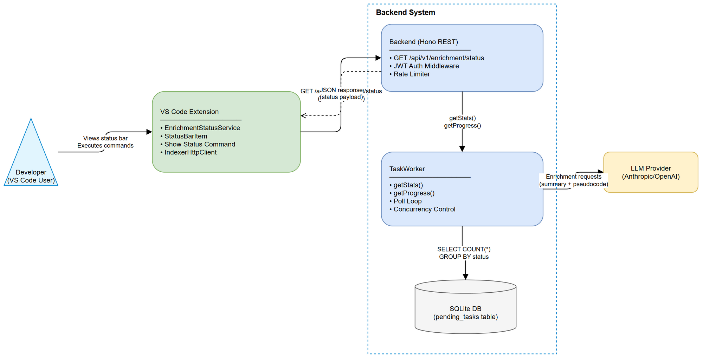
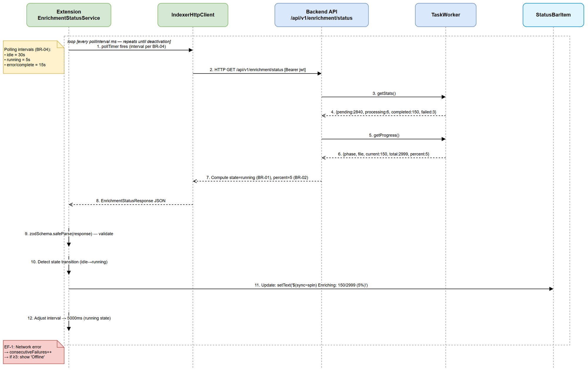
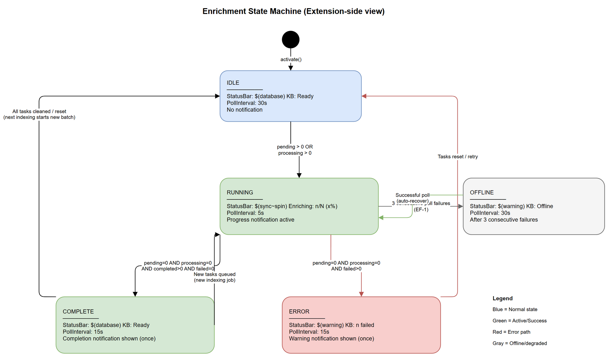

# Functional Specification Document (FSD)

## SDLC-Agents-4-Enterprise — SA4E-157: [Bug] LLM Enrichment Progress Not Visible to User

---

## Document Information

| Field | Value |
|-------|-------|
| Jira Ticket | SA4E-157 |
| Title | [Bug] LLM enrichment progress not visible to user after indexing completes |
| Author | BA Agent |
| Version | 1.0 |
| Date | 2025-07-27 |
| Status | Draft |
| Related BRD | documents/SA4E-157/BRD.md |

---

## Revision History

| Version | Date | Author | Changes |
|---------|------|--------|---------|
| 1.0 | 2025-07-27 | BA Agent | Initial FSD — translated from BRD v1.0 |

---

## 1. Introduction

### 1.1 Purpose

This FSD specifies the functional behavior of the enrichment progress visibility feature. It defines the new REST API endpoint, VS Code extension UI components (StatusBarItem + notification), polling mechanism, and state transitions required to give users real-time visibility into LLM enrichment progress.

### 1.2 Scope

- New public API endpoint `GET /api/v1/enrichment/status` (read-only, no admin permission)
- Extension-side polling service that queries enrichment status at configurable intervals
- VS Code StatusBarItem displaying enrichment state (idle/running/complete/error)
- VS Code progress notification for active enrichment
- Completion/error notification messages
- Command `SA4E: Show Enrichment Status` for on-demand detailed view

### 1.3 Definitions & Acronyms

| Term | Definition |
|------|------------|
| LLM Enrichment | Background process generating AI summaries/pseudocode for indexed KB entries via TAG_ENRICHMENT tasks |
| TaskWorker | Backend queue processor (`backend/src/modules/memory/task-queue/TaskWorker.ts`) executing enrichment tasks |
| StatusBarItem | VS Code API component for persistent info in the editor bottom bar |
| Polling | Periodic HTTP GET requests from extension to backend to fetch current status |
| IndexerHttpClient | Extension HTTP client for backend communication (`extension/src/services/IndexerHttpClient.ts`) |

### 1.4 References

| Document | Location |
|----------|----------|
| BRD | documents/SA4E-157/BRD.md |
| Backend Structure | .kiro/steering/backend-structure.md |
| VS Code StatusBarItem API | https://code.visualstudio.com/api/references/vscode-api#StatusBarItem |
| Existing admin progress endpoint | `GET /api/admin/taskworker/progress` (admin/config.ts) |

---

## 2. System Overview

### 2.1 System Context Diagram



The system involves three primary components:

1. **VS Code Extension** — User-facing UI (StatusBarItem, notifications, commands)
2. **Backend Hono REST API** — Exposes `GET /api/v1/enrichment/status` endpoint
3. **TaskWorker** — Processes enrichment queue, maintains progress state in `pending_tasks` table

The extension polls the backend at regular intervals. The backend queries `PendingTaskRepository.getStats()` and `TaskWorker.getProgress()` to compute enrichment status in real-time.

### 2.2 Current State (Bug Context)

Currently, `TaskWorker.getProgress()` and `TaskWorker.getStats()` exist but are only exposed via:
- `GET /api/admin/taskworker/progress` — requires admin auth (`requireAuth` + `requirePermission`)
- `GET /api/admin/taskworker/status` — requires admin + CONFIG_EDIT permission

The extension has no way to query enrichment status without admin credentials. After indexing completes with "Job complete: 24082 rules stored", the user sees no further feedback while enrichment runs for potentially hours.

---

## 3. Functional Requirements

### 3.1 Feature: Enrichment Status API

**Source:** BRD Story 3 — On-Demand Enrichment Status Check

#### 3.1.1 Use Case: UC-1 — Poll Enrichment Status (Auto)

**Use Case ID:** UC-1
**Actor:** VS Code Extension (automated)
**Preconditions:** Extension activated, backend reachable, enrichment may or may not be active
**Postconditions:** Extension has current enrichment state for UI rendering

**Main Flow:**

| Step | Actor | System | Description |
|------|-------|--------|-------------|
| 1 | Extension | | Timer fires (every N seconds per BR-04) |
| 2 | Extension | | Send `GET /api/v1/enrichment/status` to backend |
| 3 | | Backend | Query `PendingTaskRepository.getStats()` for task counts |
| 4 | | Backend | Query `TaskWorker.getProgress()` for current task info |
| 5 | | Backend | Compute state enum (idle/running/complete/error) per BR-01 |
| 6 | | Backend | Return JSON response with enrichment status payload |
| 7 | Extension | | Parse response, update internal state model |
| 8 | Extension | | Update StatusBarItem text/icon per BR-05 |

**Alternative Flows:**

| ID | Condition | Steps |
|----|-----------|-------|
| AF-1 | Enrichment state transitions from `running` → `complete` | Extension shows completion notification (UC-3), stops high-frequency polling, reverts to idle polling interval |
| AF-2 | Enrichment state transitions from `idle` → `running` | Extension increases polling frequency (BR-04), shows StatusBarItem spinner |
| AF-3 | Extension reopens (VS Code restart) | On activation, immediately poll once to get current state; resume polling loop |

**Exception Flows:**

| ID | Condition | Steps |
|----|-----------|-------|
| EF-1 | Backend unreachable (network error/timeout) | Extension keeps last known state, retries on next interval. After 3 consecutive failures, show "Backend unreachable" in StatusBarItem |
| EF-2 | Backend returns 5xx error | Log to output channel, keep last known state, retry next interval |
| EF-3 | Response payload fails zod validation | Log parse error to output channel, discard response, keep last state |

---

#### 3.1.2 Use Case: UC-2 — Display Real-Time Progress

**Use Case ID:** UC-2
**Actor:** Developer (passive observer)
**Preconditions:** Enrichment is in `running` state
**Postconditions:** User sees current progress in StatusBarItem

**Main Flow:**

| Step | Actor | System | Description |
|------|-------|--------|-------------|
| 1 | | Extension | Receives enrichment status with `state=running` |
| 2 | | Extension | Format StatusBarItem: `$(sync~spin) Enriching: {completed}/{total} ({percent}%)` |
| 3 | | Extension | Update tooltip with details: start time, estimated completion |
| 4 | Developer | | Glances at status bar, sees progress |
| 5 | | Extension | On next poll, update counts and percentage |

**Alternative Flows:**

| ID | Condition | Steps |
|----|-----------|-------|
| AF-1 | First poll after enrichment starts (completed=0) | Show "Enriching: 0/{total} (0%)" — confirm enrichment has begun |
| AF-2 | `failedRules > 0` while running | Append warning indicator to StatusBarItem tooltip |

**Exception Flows:**

| ID | Condition | Steps |
|----|-----------|-------|
| EF-1 | total=0 (no tasks queued) | Treat as `idle` state — do not show progress bar |

---

#### 3.1.3 Use Case: UC-3 — Enrichment Completion Notification

**Use Case ID:** UC-3
**Actor:** Developer (notification recipient)
**Preconditions:** Enrichment was in `running` state, now transitions to `complete`
**Postconditions:** User informed of completion; StatusBarItem shows idle/ready state

**Main Flow:**

| Step | Actor | System | Description |
|------|-------|--------|-------------|
| 1 | | Extension | Poll detects state transition: `running` → `complete` |
| 2 | | Extension | Check `failedRules` count from response |
| 3 | | Extension | If `failedRules == 0`: show info notification "✅ Enrichment complete: {total} rules enriched. KB is ready." |
| 4 | | Extension | Update StatusBarItem to idle state: `$(database) KB: Ready` |
| 5 | | Extension | Reduce polling frequency to idle interval (BR-04) |

**Alternative Flows:**

| ID | Condition | Steps |
|----|-----------|-------|
| AF-1 | `failedRules > 0` | Show warning notification: "⚠️ Enrichment complete: {completed}/{total} rules enriched. {failed} rules failed." with "Show Details" button |
| AF-2 | User clicks "Show Details" | Open output channel showing failed rule summary |

**Exception Flows:**

| ID | Condition | Steps |
|----|-----------|-------|
| EF-1 | VS Code in background/minimized | Notification queued by VS Code API; shown when window focuses |

---

#### 3.1.4 Use Case: UC-4 — On-Demand Status Command

**Use Case ID:** UC-4
**Actor:** Developer (manual trigger)
**Preconditions:** Extension activated
**Postconditions:** User sees detailed enrichment status in quick-pick or notification

**Main Flow:**

| Step | Actor | System | Description |
|------|-------|--------|-------------|
| 1 | Developer | | Execute command "SA4E: Show Enrichment Status" via Command Palette |
| 2 | | Extension | Immediately poll `GET /api/v1/enrichment/status` (bypass timer) |
| 3 | | Extension | Format detailed status message |
| 4 | | Extension | Show information message with: state, total, completed, failed, startedAt, estimatedCompletion |

**Alternative Flows:**

| ID | Condition | Steps |
|----|-----------|-------|
| AF-1 | State is `idle` | Show: "KB enrichment is idle. No active enrichment job." |
| AF-2 | State is `error` | Show: "⚠️ Enrichment encountered errors. {failed} rules failed. Check Output for details." |

**Exception Flows:**

| ID | Condition | Steps |
|----|-----------|-------|
| EF-1 | Backend unreachable | Show error message: "Cannot reach backend. Verify server is running." |

---

### 3.2 Business Rules

| Rule ID | Rule | Source |
|---------|------|--------|
| BR-01 | Enrichment state is derived: `idle` if pending=0 AND processing=0 AND completed=0; `running` if pending>0 OR processing>0; `complete` if pending=0 AND processing=0 AND completed>0; `error` if failed>0 AND pending=0 AND processing=0 | BRD Story 3, Data Fields |
| BR-02 | Progress percentage = `Math.round((completed / (pending + processing + completed + failed)) * 100)` — uses total = sum of all task counts | BRD Story 1, AC2 |
| BR-03 | Enrichment state `complete` transitions to `idle` after the next indexing job resets the task queue (new tasks queued → state becomes `running` again) | BRD §2.1 Business Flow |
| BR-04 | Polling intervals: idle state = 30s; running state = 5s; error/complete = 15s. Extension adjusts interval on state change. | BRD Story 1, AC3 + NFR Performance |
| BR-05 | StatusBarItem format: idle = `$(database) KB: Ready`; running = `$(sync~spin) Enriching: {completed}/{total} ({percent}%)`; complete = `$(database) KB: Ready`; error = `$(warning) KB: {failed} failed` | BRD Story 3, AC2/AC4/AC5 |
| BR-06 | Completion notification shown ONCE per enrichment cycle — tracked by `lastNotifiedState` in extension memory. Do not re-notify on subsequent polls returning `complete`. | BRD Story 2 |
| BR-07 | StatusBarItem click action: if `running` or `error`, trigger UC-4 (show detailed status). If `idle`, no action. | BRD Story 3 |
| BR-08 | Estimated completion time = `startedAt + (elapsedTime / completedRules) * totalRules`. Only provided when `completedRules >= 10` (need minimum sample for meaningful estimate). | BRD Story 3, Data Fields |
| BR-09 | Backend response time for status endpoint MUST be < 200ms (simple aggregate query on `pending_tasks` table). | BRD NFR |
| BR-10 | Extension MUST NOT block user interaction during polling. All HTTP calls are async fire-and-forget with respect to UI thread. | BRD NFR |
| BR-11 | On extension deactivation, polling timer MUST be cleared (no orphan intervals). | Plugin lifecycle |
| BR-12 | `startedAt` is the `created_at` timestamp of the earliest PENDING or PROCESSING task in the current batch. If no active tasks, `startedAt` is null. | Derived from TaskWorker behavior |

---

### 3.3 API Specification

#### Endpoint: `GET /api/v1/enrichment/status`

**Purpose:** Provide current enrichment progress to the extension for UI display. Lightweight read-only endpoint without admin permission requirement.

**Authentication:** JWT auth required (workspace-scoped, same as existing `/api/v1/*` endpoints). No additional permission check — read-only status data.

**Input Parameters:**

| Parameter | Type | Required | Business Rule | Description |
|-----------|------|----------|---------------|-------------|
| (none) | — | — | — | No query params needed; status is workspace-global |

**Output Data (Success — 200 OK):**

| Field | Type | Nullable | Description | Example |
|-------|------|----------|-------------|---------|
| state | `"idle" \| "running" \| "complete" \| "error"` | No | Current enrichment state per BR-01 | `"running"` |
| totalRules | number | No | Total tasks in current batch (pending + processing + completed + failed) | 2999 |
| completedRules | number | No | Tasks with status=COMPLETED | 150 |
| failedRules | number | No | Tasks with status=FAILED | 3 |
| pendingRules | number | No | Tasks with status=PENDING | 2840 |
| processingRules | number | No | Tasks currently being processed | 6 |
| percent | number | No | Completion percentage per BR-02 | 5 |
| isRunning | boolean | No | Whether TaskWorker is actively running | true |
| startedAt | string (ISO 8601) | Yes | Earliest active task timestamp per BR-12. Null if idle. | `"2025-07-27T10:30:00Z"` |
| estimatedCompletion | string (ISO 8601) | Yes | Estimated completion per BR-08. Null if insufficient data. | `"2025-07-27T12:45:00Z"` |
| currentFile | string | Yes | File/entry currently being processed. Null if idle. | `"Rule-Obj-Activity:MyClass:DoWork"` |
| lastPollAt | string (ISO 8601) | Yes | Last time TaskWorker polled for tasks | `"2025-07-27T10:35:12Z"` |

**Response Example (running):**

```json
{
  "state": "running",
  "totalRules": 2999,
  "completedRules": 150,
  "failedRules": 3,
  "pendingRules": 2840,
  "processingRules": 6,
  "percent": 5,
  "isRunning": true,
  "startedAt": "2025-07-27T10:30:00Z",
  "estimatedCompletion": "2025-07-27T12:45:00Z",
  "currentFile": "Rule-Obj-Activity:MyClass:DoWork",
  "lastPollAt": "2025-07-27T10:35:12Z"
}
```

**Response Example (idle):**

```json
{
  "state": "idle",
  "totalRules": 0,
  "completedRules": 0,
  "failedRules": 0,
  "pendingRules": 0,
  "processingRules": 0,
  "percent": 0,
  "isRunning": true,
  "startedAt": null,
  "estimatedCompletion": null,
  "currentFile": null,
  "lastPollAt": "2025-07-27T10:35:12Z"
}
```

**Business Error Scenarios:**

| Scenario | HTTP Status | Response Body | Trigger Condition |
|----------|-------------|---------------|-------------------|
| Unauthorized | 401 | `{"error": "Authentication required"}` | Missing/invalid JWT |
| TaskWorker not initialized | 503 | `{"error": "Enrichment service unavailable", "details": "TaskWorker not initialized"}` | Backend memory module not loaded |
| Internal error | 500 | `{"error": "Failed to retrieve enrichment status", "details": "{message}"}` | DB query failure |

---

### 3.4 UI Specifications

#### 3.4.1 StatusBarItem

**Registration:** Created on extension activation. Priority: 100 (left-aligned, near other status indicators). Alignment: `StatusBarAlignment.Left`.

| State | Icon + Text | Tooltip | Color | Click Action |
|-------|-------------|---------|-------|--------------|
| idle | `$(database) KB: Ready` | "Knowledge Base enrichment is idle" | Default (no color) | None |
| running | `$(sync~spin) Enriching: {completed}/{total} ({percent}%)` | "LLM Enrichment in progress\nStarted: {startedAt}\nEstimated: {estimatedCompletion}\nFailed: {failed}" | Default | Open detailed status (UC-4) |
| complete | `$(database) KB: Ready` | "Enrichment complete — {total} rules enriched" | Default | None |
| error | `$(warning) KB: {failed} failed` | "Enrichment completed with errors\n{failed} rules failed\nClick for details" | `statusBarItem.warningForeground` | Open detailed status (UC-4) |

#### 3.4.2 Progress Notification

**When:** State transitions from non-running → `running` (first detection of active enrichment)
**Type:** `vscode.window.withProgress` with `ProgressLocation.Notification`
**Cancellable:** No (enrichment cannot be cancelled from extension)
**Message format:** `"LLM Enrichment: {completed}/{total} ({percent}%)"` — updated on each poll

#### 3.4.3 Completion Notification

**When:** State transitions from `running` → `complete` or `error` (per BR-06, shown once)
**Type:** `vscode.window.showInformationMessage` (success) or `vscode.window.showWarningMessage` (partial)

| Condition | Message | Buttons |
|-----------|---------|---------|
| All success (`failed == 0`) | `"✅ Enrichment complete: {total} rules enriched. KB is ready."` | None |
| Partial failure (`failed > 0`) | `"⚠️ Enrichment complete: {completed}/{total} rules enriched. {failed} rules failed."` | `"Show Details"` |

#### 3.4.4 Command: SA4E: Show Enrichment Status

**Command ID:** `sa4e.showEnrichmentStatus`
**Title:** `SA4E: Show Enrichment Status`
**When:** Always available (registered on activation)
**Output:** Information message with formatted multi-line status:

```
Enrichment Status
─────────────────
State: Running
Progress: 150/2999 (5%)
Failed: 3 rules
Started: 10:30 AM
Estimated completion: 12:45 PM
Current: Rule-Obj-Activity:MyClass:DoWork
```

---

## 4. Data Model

### 4.1 Existing Entities (No Schema Changes)

This feature requires NO new database tables or columns. It reuses existing `pending_tasks` table data via `PendingTaskRepository.getStats()`.

#### Entity: pending_tasks (existing)

| Attribute | Type | Description |
|-----------|------|-------------|
| id | INTEGER PK | Auto-increment task ID |
| task_type | TEXT | `TAG_ENRICHMENT`, `VECTOR_EMBEDDING`, `CODE_ENRICHMENT` |
| entry_id | TEXT | Reference to knowledge_entries.id |
| status | TEXT | `PENDING`, `PROCESSING`, `COMPLETED`, `FAILED` |
| payload | TEXT (JSON) | Task-specific payload |
| retry_count | INTEGER | Number of retries attempted |
| max_retries | INTEGER | Maximum retry limit (default 3) |
| error | TEXT | Error message if failed |
| created_at | TEXT (ISO) | Task creation timestamp |
| started_at | TEXT (ISO) | When processing started |
| completed_at | TEXT (ISO) | When completed/failed |

### 4.2 Extension State Model (In-Memory)

| Attribute | Type | Description |
|-----------|------|-------------|
| currentState | EnrichmentState enum | Last known state from backend |
| previousState | EnrichmentState enum | State before last transition (for notification logic) |
| lastNotifiedState | EnrichmentState enum | Last state for which notification was shown (BR-06) |
| lastSuccessfulPoll | Date | Timestamp of last successful poll |
| consecutiveFailures | number | Count of consecutive poll failures (for EF-1 handling) |
| pollingInterval | number | Current polling interval in ms (adjusts per BR-04) |

---

## 5. Integration Specifications

### 5.1 External System: Backend Hono REST API

| Attribute | Value |
|-----------|-------|
| Purpose | Provide enrichment progress data from TaskWorker queue |
| Direction | Extension → Backend (polling) |
| Data Format | JSON |
| Frequency | Periodic polling (5-30s depending on state) |
| Protocol | HTTP GET with JWT Bearer token |

**Data Exchange:**

| Extension Needs | Backend Provides | Direction | Business Rule |
|----------------|-----------------|-----------|---------------|
| Enrichment state | Computed from task counts | Receive | BR-01 |
| Progress counts | `pending_tasks` GROUP BY status | Receive | BR-02 |
| Current file | `TaskWorker.currentTaskInfo` | Receive | N/A |
| Start time | MIN(created_at) of active tasks | Receive | BR-12 |

### 5.2 Internal: IndexerHttpClient Enhancement

The existing `IndexerHttpClient` class will be extended with a new method:

```typescript
async getEnrichmentStatus(): Promise<EnrichmentStatusResponse>
```

This follows the existing pattern of `httpPostJson`/`httpGetJson` used in the client, adding a GET request for the new endpoint.

---

## 6. Processing Logic

### 6.1 Backend: Compute Enrichment Status

**Trigger:** Incoming `GET /api/v1/enrichment/status` request
**Input:** JWT-authenticated request (workspace ID from token)
**Output:** EnrichmentStatusResponse JSON

**Processing Steps:**

| Step | Description | Error Handling |
|------|-------------|----------------|
| 1 | Validate JWT, extract workspace context | Return 401 if invalid |
| 2 | Get TaskWorker instance from memory module registry | Return 503 if not initialized |
| 3 | Call `TaskWorker.getStats()` → {pending, processing, completed, failed} | Return 500 if DB error |
| 4 | Call `TaskWorker.getProgress()` → current task info or null | Return 500 if DB error |
| 5 | Compute `state` enum per BR-01 | — |
| 6 | Compute `totalRules` = pending + processing + completed + failed | — |
| 7 | Compute `percent` per BR-02 | — |
| 8 | Compute `startedAt` from earliest active task (or null) | — |
| 9 | Compute `estimatedCompletion` per BR-08 (null if completedRules < 10) | — |
| 10 | Return response JSON | — |

### 6.2 Extension: Polling Service Lifecycle

**Trigger:** Extension activation
**Schedule:** Repeating interval per BR-04 (adjusts dynamically)

**Processing Steps:**

| Step | Description | Error Handling |
|------|-------------|----------------|
| 1 | On extension activate: create StatusBarItem, start polling timer at idle interval (30s) | — |
| 2 | On timer fire: call `IndexerHttpClient.getEnrichmentStatus()` | Catch errors → increment consecutiveFailures |
| 3 | On successful response: reset consecutiveFailures, parse with zod schema | If parse fails → log, keep last state |
| 4 | Compare `currentState` vs `previousState` for transition events | — |
| 5 | If state changed: emit transition event → handle notification logic | — |
| 6 | Adjust polling interval based on new state (BR-04) | — |
| 7 | Update StatusBarItem text/tooltip/color (BR-05) | — |
| 8 | On extension deactivate: clear timer, dispose StatusBarItem (BR-11) | — |

### 6.3 Sequence Diagram — Polling Flow



### 6.4 State Diagram — Enrichment Lifecycle



---

## 7. Security Requirements

### 7.1 Authentication & Authorization

| Role | Permissions | Endpoint |
|------|-------------|----------|
| Any authenticated user | Read enrichment status | `GET /api/v1/enrichment/status` |
| Admin | Full TaskWorker control (existing) | `GET /api/admin/taskworker/*` |

The new endpoint requires JWT authentication (same as all `/api/v1/*` routes) but does NOT require admin permissions. Enrichment status is workspace-scoped and read-only — no sensitive data exposure.

### 7.2 Data Sensitivity

| Data Type | Classification | Rationale |
|-----------|---------------|-----------|
| Task counts (pending/completed/failed) | Internal | Operational metric, not PII |
| Current file name | Internal | Rule FQN, not sensitive |
| Timestamps | Internal | Operational |

### 7.3 Rate Limiting

The endpoint inherits existing Hono rate-limiter middleware. No additional rate limiting needed beyond the polling interval constraint (minimum 5s, enforced client-side per BR-04).

---

## 8. Non-Functional Requirements

| Category | Business Requirement | Acceptance Criteria |
|----------|---------------------|---------------------|
| Performance | Status endpoint responds quickly without impacting enrichment throughput | Response time < 200ms (BR-09); single SQL aggregate query |
| Performance | Polling must not degrade editor responsiveness | Async HTTP, no UI thread blocking (BR-10) |
| Reliability | Progress survives VS Code restart | Backend is source of truth; extension re-fetches on activation (AF-3) |
| Reliability | Graceful degradation when backend unreachable | Show last known state; retry on next interval (EF-1) |
| Usability | Progress visible without user action | Auto-display on enrichment start; StatusBarItem always visible |
| Usability | No modal dialogs or blocking UI | Information notifications only, no modal |
| Scalability | Handle 24,000+ rule enrichment jobs | Percentage-based display; aggregate counts only |

---

## 9. Error Handling (User-Facing)

### 9.1 Error Scenarios

| Scenario | Severity | User Message | Expected Behavior |
|----------|----------|-------------|-------------------|
| Backend unreachable | Warning | StatusBarItem: `$(warning) KB: Offline` | Retry on next poll interval; auto-recover when connection restored |
| 3+ consecutive poll failures | Warning | StatusBarItem tooltip: "Cannot reach backend" | Increase retry interval to 30s |
| Enrichment tasks failing | Info | StatusBarItem: `$(warning) KB: {n} failed` | User can click for details; log to output channel |
| TaskWorker not initialized | Info | No StatusBarItem change (stay idle) | Log to output channel |
| Response parse error | Info | No UI change | Log error to output channel; retry next poll |

### 9.2 Notification Requirements

| Event | Who is Notified | Channel | Timing |
|-------|----------------|---------|--------|
| Enrichment starts | Developer | StatusBarItem change (idle→running) | Within 5s of first running poll |
| Enrichment completes (success) | Developer | VS Code information notification | Within 5s of completion detection |
| Enrichment completes (partial) | Developer | VS Code warning notification | Within 5s of completion detection |
| Backend connection lost | Developer | StatusBarItem only (no popup) | After 3 consecutive failures |

---

## 10. Testing Considerations

### 10.1 Test Scenarios

| ID | Scenario | Input | Expected Output | Priority |
|----|----------|-------|-----------------|----------|
| TC-1 | API returns running state with progress | Tasks: 100 pending, 6 processing, 50 completed, 2 failed | `state="running", percent=32, total=158` | High |
| TC-2 | API returns idle state (no tasks) | All counts = 0 | `state="idle", percent=0, startedAt=null` | High |
| TC-3 | API returns complete state | 0 pending, 0 processing, 2999 completed, 0 failed | `state="complete", percent=100` | High |
| TC-4 | API returns error state | 0 pending, 0 processing, 2900 completed, 99 failed | `state="error", percent=97, failed=99` | High |
| TC-5 | Extension handles backend unreachable | Network timeout | Keep last state, increment failure counter | High |
| TC-6 | State transition running→complete triggers notification | Previous=running, current=complete | showInformationMessage called once | High |
| TC-7 | Notification shown only once per cycle | Multiple polls with state=complete | showInformationMessage called exactly 1 time | Medium |
| TC-8 | Polling interval adjusts on state change | idle→running transition | Interval changes from 30000 to 5000 | Medium |
| TC-9 | VS Code restart resumes progress display | Backend has active enrichment | StatusBarItem shows running state after activation | Medium |
| TC-10 | Estimated completion calculated correctly | 100 completed in 60s, 900 remaining | estimatedCompletion ≈ now + 540s | Low |
| TC-11 | StatusBarItem click opens detailed status | User clicks running StatusBarItem | UC-4 command triggered | Medium |
| TC-12 | Zod validation rejects malformed response | Missing `state` field | Log error, keep last known state | Medium |

---

## 11. Appendix

### Diagram Index

| # | Diagram | Image | Source (editable) |
|---|---------|-------|-------------------|
| 1 | System Context | [system-context.png](diagrams/system-context.png) | [system-context.drawio](diagrams/system-context.drawio) |
| 2 | Sequence — Polling Flow | [sequence-polling.png](diagrams/sequence-polling.png) | [sequence-polling.drawio](diagrams/sequence-polling.drawio) |
| 3 | State — Enrichment Lifecycle | [state-enrichment.png](diagrams/state-enrichment.png) | [state-enrichment.drawio](diagrams/state-enrichment.drawio) |

### Change Log from BRD

| BRD Section | FSD Clarification |
|-------------|-------------------|
| Story 3: "clicking status bar SHOULD show detailed info" | Specified as UC-4 command + click handler on StatusBarItem (BR-07) |
| Story 1: "update every 5-10 seconds" | Specified adaptive polling: 5s when running, 30s when idle (BR-04) |
| NFR: "API < 200ms" | Achieved by reusing existing `PendingTaskRepository.getStats()` (single SQL GROUP BY) |
| Story 3: "estimatedCompletion" | Only provided when completedRules >= 10 (BR-08) — avoids wild extrapolation |
| New: Backend unreachable handling | Added EF-1 with 3-failure threshold before UI degradation (not in BRD) |
| New: Zod validation on response | Added EF-3 — defense-in-depth for protocol communication per code-standards.md |

### Open Issues

| # | Issue | Impact | Proposed Resolution |
|---|-------|--------|---------------------|
| 1 | Should failed tasks be included in `totalRules` denominator? | Affects percent calculation | Yes — included per BR-02 (total = all statuses). User needs to see "97% done, 3% failed" not "100% done" |
| 2 | How to distinguish "enrichment never ran" vs "enrichment complete and cleaned up"? | State ambiguity | TaskWorker never cleans up completed tasks (they accumulate). If all counts=0, it means no enrichment has been queued — state=idle. |
| 3 | Multiple concurrent enrichment jobs (e.g., two indexing jobs overlap)? | BRD assumes single job | Per BRD assumption: one enrichment job at a time. API returns aggregate counts regardless. |
