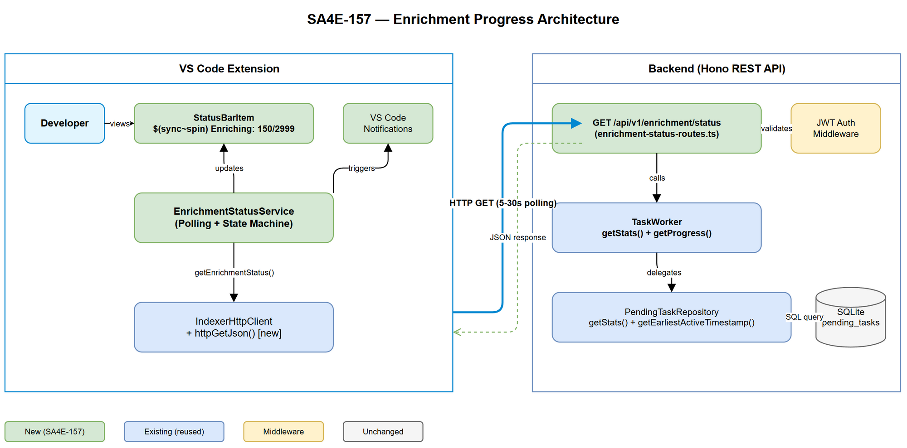
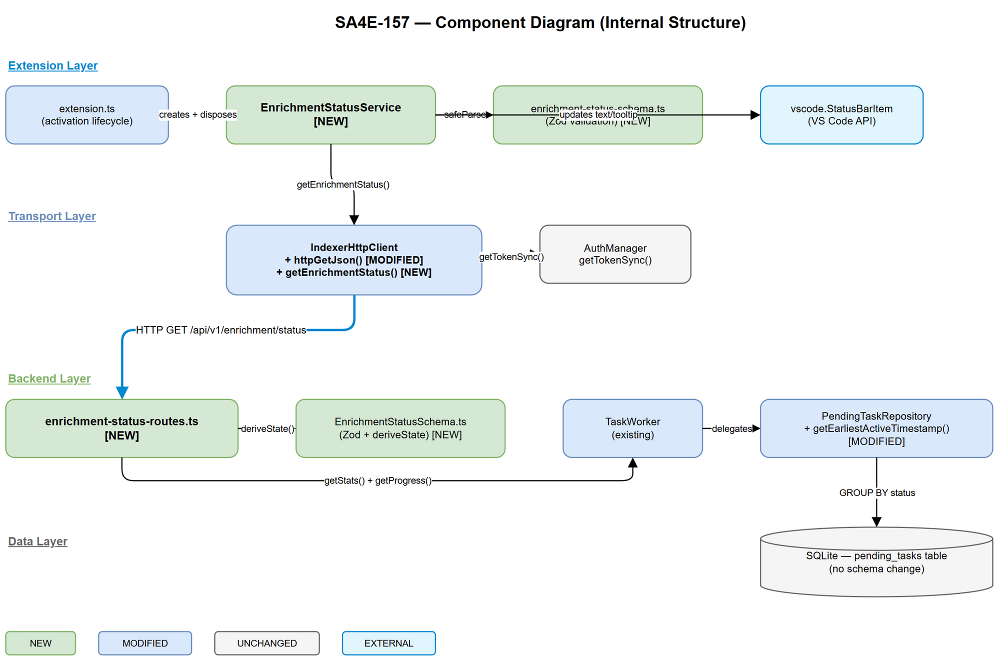

# Technical Design Document (TDD)

## SDLC-Agents-4-Enterprise — SA4E-157: [Bug] LLM Enrichment Progress Not Visible to User

---

## Document Information

| Field | Value |
|-------|-------|
| Jira Ticket | SA4E-157 |
| Title | [Bug] LLM enrichment progress not visible to user after indexing completes |
| Author | SA Agent |
| Version | 1.0 |
| Date | 2025-07-27 |
| Status | Draft |
| Related BRD | BRD-v1-SA4E-157.docx |
| Related FSD | FSD-v1-SA4E-157.docx |

---

## Author Tracking

| Role | Name - Position | Responsibility |
|------|-----------------|----------------|
| Author | SA Agent – Solution Architect | Create document |
| Peer Reviewer | BA Agent – Business Analyst | Review for completeness against BRD/FSD |

---

## Revision History

| Version | Date | Author | Changes |
|---------|------|--------|---------|
| 1.0 | 2025-07-27 | SA Agent | Initiate document — designed from FSD v1.0 + code intelligence analysis |

---

## Sign-Off

| Name | Signature and date |
|------|--------------------|
| | ☐ I agree and confirm the technical design in this TDD |
| | ☐ I agree and confirm the technical design in this TDD |

---

## 1. Introduction

> **Scope Boundary:** This TDD specifies HOW to implement the enrichment progress visibility feature. It does NOT repeat functional requirements, business rules, use cases, or UI specifications — refer to the FSD for those. This document focuses on: technology choices, architecture decisions, implementation patterns, and integration concerns.

### 1.1 Purpose

This TDD designs the technical solution for exposing LLM enrichment progress from the backend TaskWorker queue to the VS Code extension UI. The fix involves: a new public REST endpoint, a new extension-side polling service with state machine, and StatusBarItem integration.

### 1.2 Scope

- New backend route: `GET /api/v1/enrichment/status` (Hono, reuses existing TaskWorker)
- New Zod response schema: `EnrichmentStatusResponseSchema`
- New extension service: `EnrichmentStatusService` (polling, state transitions, UI updates)
- StatusBarItem registration and lifecycle management
- Integration with existing `IndexerHttpClient` (new `httpGetJson` method)
- VS Code command: `sa4e.showEnrichmentStatus`

### 1.3 Technology Stack

| Layer | Technology | Version |
|-------|-----------|---------|
| Language | TypeScript | 5.x |
| Backend Framework | Hono | 4.x |
| Extension API | VS Code Extension API | ^1.85 |
| Validation | Zod | 3.x |
| Database | SQLite (better-sqlite3) | existing |
| HTTP | Node.js `http` module | existing (via IndexerHttpClient) |

### 1.4 Design Principles

- **Reuse over reinvent** — leverage existing `TaskWorker.getStats()` + `getProgress()`; extend `IndexerHttpClient` rather than creating a new HTTP client
- **SRP** — separate concerns: route handler (backend), HTTP transport (client), polling logic (service), UI rendering (StatusBarItem)
- **Defensive communication** — Zod `safeParse` on all API responses crossing protocol boundary
- **Non-blocking** — all polling is async, no UI thread blocking
- **Graceful degradation** — extension tolerates backend unavailability without crashing

### 1.5 Constraints

- Backend enrichment status is computed from existing `pending_tasks` table — no schema migration
- Extension must not import backend types directly — Zod schema duplicated in extension with independent validation
- Polling interval minimum 5s to avoid overloading backend during large jobs (24K+ rules)
- StatusBarItem API does not support custom animations — use built-in `$(sync~spin)` codicon

### 1.6 References

| Document | Location |
|----------|----------|
| BRD | BRD-v1-SA4E-157.docx |
| FSD | FSD-v1-SA4E-157.docx |
| TaskWorker source | `backend/src/modules/memory/task-queue/TaskWorker.ts` |
| PendingTaskRepository | `backend/src/modules/memory/task-queue/PendingTaskRepository.ts` |
| IndexerHttpClient | `extension/src/services/IndexerHttpClient.ts` |
| Existing admin endpoint | `backend/src/server/routes/admin/config.ts` (line 327) |

---

## 2. System Architecture

### 2.1 Architecture Overview

The solution adds a thin read-only API layer on the backend (reusing existing TaskWorker infrastructure) and a new polling service in the extension that drives the StatusBarItem UI.



**Key architectural decisions:**

1. **Polling over WebSocket** — simpler implementation, no persistent connection management, acceptable latency at 5s intervals. The extension already uses HTTP polling for indexing progress (`GET /api/index/progress`).
2. **Public v1 route** — placed at `/api/v1/enrichment/status` (not admin) since enrichment progress is non-sensitive, read-only workspace state. JWT auth still required for workspace scoping.
3. **Compute-on-read** — status is computed from DB counts on each request (no cached state). This ensures consistency without needing event propagation.

### 2.2 Component Diagram



| Component | Responsibility | Technology |
|-----------|---------------|------------|
| `enrichment-status-routes.ts` | HTTP handler: query TaskWorker, compute state, return JSON | Hono route |
| `EnrichmentStatusSchema.ts` | Zod schema defining response shape + state derivation logic | Zod |
| `EnrichmentStatusService.ts` | Polling timer, state machine, notification triggers | TypeScript class |
| `IndexerHttpClient` (extended) | HTTP GET transport for enrichment status endpoint | Node `http` module |
| `StatusBarItem` | VS Code UI rendering of enrichment state | VS Code API |

### 2.3 Communication Patterns

| From | To | Protocol | Pattern | Description |
|------|----|----------|---------|-------------|
| Extension (EnrichmentStatusService) | Backend (enrichment-status route) | HTTP GET | Polling (5-30s adaptive) | Fetch current enrichment state |
| Backend route handler | TaskWorker | In-process method call | Sync | `getStats()` + `getProgress()` |
| Backend route handler | PendingTaskRepository | In-process → SQLite | Async query | `GROUP BY status` aggregate |
| EnrichmentStatusService | VS Code StatusBarItem | In-process | Observer | Update text/tooltip on state change |
| EnrichmentStatusService | VS Code notifications | In-process | Event-driven | Show notification on state transition |

---

## 3. API Design

> **Prerequisite:** Functional API contract defined in FSD §3.3. This section specifies technical implementation details.

### 3.1 API Overview

| # | Endpoint | Method | Description | Source |
|---|----------|--------|-------------|--------|
| 1 | `/api/v1/enrichment/status` | GET | Return current enrichment progress | UC-1, UC-4 |

### 3.2 API: Enrichment Status

**Implements:** UC-1 (auto-poll), UC-4 (on-demand), BR-01 through BR-09

| Attribute | Value |
|-----------|-------|
| Method | GET |
| Path | `/api/v1/enrichment/status` |
| Auth | Bearer JWT (workspace-scoped, same as all `/api/v1/*` routes) |
| Rate Limit | Inherited from Hono rate-limiter middleware |
| Permission | None (read-only status, no admin check) |

**Request Headers:**

| Header | Required | Description |
|--------|----------|-------------|
| Authorization | Yes | Bearer {JWT token} — provides workspace context |
| X-Project-Id | Yes | Project scoping (sent automatically by IndexerHttpClient) |

**Response — 200 OK:**

```json
{
  "state": "running",
  "totalRules": 2999,
  "completedRules": 150,
  "failedRules": 3,
  "pendingRules": 2840,
  "processingRules": 6,
  "percent": 5,
  "isRunning": true,
  "startedAt": "2025-07-27T10:30:00Z",
  "estimatedCompletion": "2025-07-27T12:45:00Z",
  "currentFile": "Rule-Obj-Activity:MyClass:DoWork",
  "lastPollAt": "2025-07-27T10:35:12Z"
}
```

**Zod Schema (shared between backend response construction and extension validation):**

```typescript
import { z } from 'zod';

export const EnrichmentStateEnum = z.enum(['idle', 'running', 'complete', 'error']);

export const EnrichmentStatusResponseSchema = z.object({
  state: EnrichmentStateEnum,
  totalRules: z.number().int().min(0),
  completedRules: z.number().int().min(0),
  failedRules: z.number().int().min(0),
  pendingRules: z.number().int().min(0),
  processingRules: z.number().int().min(0),
  percent: z.number().int().min(0).max(100),
  isRunning: z.boolean(),
  startedAt: z.string().nullable(),
  estimatedCompletion: z.string().nullable(),
  currentFile: z.string().nullable(),
  lastPollAt: z.string().nullable(),
});

export type EnrichmentStatusResponse = z.infer<typeof EnrichmentStatusResponseSchema>;
export type EnrichmentState = z.infer<typeof EnrichmentStateEnum>;
```

**State Derivation Logic (BR-01):**

```typescript
function deriveState(stats: TaskWorkerStats): EnrichmentState {
  const { pending, processing, completed, failed } = stats;
  if (pending === 0 && processing === 0 && completed === 0 && failed === 0) return 'idle';
  if (pending > 0 || processing > 0) return 'running';
  if (failed > 0 && pending === 0 && processing === 0) return 'error';
  return 'complete'; // pending=0, processing=0, completed>0, failed=0
}
```

**Error Responses:**

| Status | Code | Message | Condition |
|--------|------|---------|-----------|
| 401 | — | `{"error": "Authentication required"}` | Missing/invalid JWT |
| 503 | — | `{"error": "Enrichment service unavailable", "details": "TaskWorker not initialized"}` | Memory module not loaded |
| 500 | — | `{"error": "Failed to retrieve enrichment status", "details": "{message}"}` | DB query failure |

**Performance:** Single SQL `GROUP BY` query on indexed `status` column → < 50ms even with 24K rows.

---

## 4. Database Design

> **No schema changes required.** This feature reads from the existing `pending_tasks` table.

### 4.1 Existing Table: `pending_tasks`

```sql
-- Already exists — no migration needed
CREATE TABLE pending_tasks (
    id INTEGER PRIMARY KEY AUTOINCREMENT,
    task_type TEXT NOT NULL,
    entry_id TEXT,
    status TEXT NOT NULL DEFAULT 'PENDING',
    payload TEXT,
    retry_count INTEGER DEFAULT 0,
    max_retries INTEGER DEFAULT 3,
    error TEXT,
    created_at TEXT,
    started_at TEXT,
    completed_at TEXT
);
```

### 4.2 Query Pattern

| Operation | Query | Expected Performance |
|-----------|-------|---------------------|
| Get stats | `SELECT status, COUNT(*) as cnt FROM pending_tasks GROUP BY status` | < 10ms (indexed) |
| Get earliest active task | `SELECT MIN(created_at) FROM pending_tasks WHERE status IN ('PENDING','PROCESSING')` | < 5ms |

### 4.3 Additional Query: Earliest Task Timestamp (BR-12)

```sql
SELECT MIN(created_at) as started_at
FROM pending_tasks
WHERE status IN ('PENDING', 'PROCESSING')
```

This query is needed for the `startedAt` response field. It will be added to `PendingTaskRepository` as `getEarliestActiveTimestamp()`.

---

## 5. Class / Module Design

### 5.1 Package Structure

**Backend (new files):**

```
backend/src/server/routes/
└── enrichment-status-routes.ts    # Hono route handler (< 80 lines)

backend/src/shared/schemas/
└── EnrichmentStatusSchema.ts      # Zod schema + type exports (< 40 lines)
```

**Extension (new files):**

```
extension/src/services/
├── EnrichmentStatusService.ts     # Polling service + state machine (< 150 lines)
└── enrichment-status-schema.ts    # Zod schema (duplicated for extension-side validation)
```

**Extension (modified files):**

```
extension/src/services/
└── IndexerHttpClient.ts           # Add httpGetJson() method + getEnrichmentStatus()

extension/src/extension.ts         # Instantiate EnrichmentStatusService on activation
```

### 5.2 Key Interfaces

```typescript
/** Backend: enrichment status route handler context */
interface EnrichmentRouteContext {
  registry: ModuleRegistry;
  requireAuth: (c: Context) => Promise<AuthUser | Response>;
  logger: Logger;
}

/** Extension: enrichment status service configuration */
interface EnrichmentPollingConfig {
  idleInterval: number;      // 30000ms
  runningInterval: number;   // 5000ms
  errorInterval: number;     // 15000ms
  maxConsecutiveFailures: number; // 3
}

/** Extension: internal state model */
interface EnrichmentInternalState {
  currentState: EnrichmentState;
  previousState: EnrichmentState;
  lastNotifiedState: EnrichmentState | null;
  lastSuccessfulPoll: Date | null;
  consecutiveFailures: number;
  pollingInterval: number;
}
```

### 5.3 Class Design: EnrichmentStatusService

```typescript
/**
 * SA4E-157 — Enrichment progress polling service.
 * Polls backend for enrichment status, manages state transitions,
 * drives StatusBarItem + notifications.
 */
export class EnrichmentStatusService implements vscode.Disposable {
  private timer: NodeJS.Timeout | null = null;
  private statusBarItem: vscode.StatusBarItem;
  private state: EnrichmentInternalState;
  private readonly config: EnrichmentPollingConfig;
  private readonly outputChannel: vscode.OutputChannel;

  constructor(
    private readonly httpClient: IndexerHttpClient,
    private readonly authTokenProvider: () => string | undefined,
    outputChannel: vscode.OutputChannel,
    config?: Partial<EnrichmentPollingConfig>,
  ) { /* ... */ }

  /** Start polling (called on extension activation). */
  start(): void { /* ... */ }

  /** Stop polling + dispose StatusBarItem (called on deactivation). */
  dispose(): void { /* ... */ }

  /** Force immediate poll (UC-4 command handler). */
  async pollNow(): Promise<EnrichmentStatusResponse | null> { /* ... */ }

  /** Internal: scheduled poll execution. */
  private async executePoll(): Promise<void> { /* ... */ }

  /** Internal: handle state transition events (notifications). */
  private handleStateTransition(
    prev: EnrichmentState,
    curr: EnrichmentState,
    response: EnrichmentStatusResponse
  ): void { /* ... */ }

  /** Internal: update StatusBarItem text/tooltip/color. */
  private updateStatusBar(response: EnrichmentStatusResponse): void { /* ... */ }

  /** Internal: adjust polling interval based on current state (BR-04). */
  private adjustInterval(state: EnrichmentState): void { /* ... */ }
}
```

### 5.4 Design Patterns

| Pattern | Where Used | Rationale |
|---------|-----------|-----------|
| Observer | EnrichmentStatusService → StatusBarItem | Decouples polling logic from UI rendering |
| State Machine | EnrichmentInternalState transitions | Clean handling of idle→running→complete→error, prevents duplicate notifications (BR-06) |
| Strategy (interval) | `adjustInterval()` per state | Different polling frequencies without complex conditionals |
| Facade | `IndexerHttpClient.getEnrichmentStatus()` | Hides HTTP transport details from service |

### 5.5 Error Handling

| Error Scenario | Handling | User Impact |
|----------------|----------|-------------|
| Network timeout (backend unreachable) | Increment `consecutiveFailures`, keep last state | StatusBarItem unchanged; after 3 failures show "KB: Offline" |
| HTTP 401 (token expired) | Log to output channel, keep polling (token may refresh) | No UI change |
| HTTP 503 (TaskWorker not ready) | Treat as `idle` state | StatusBarItem shows "KB: Ready" |
| Zod validation failure | Log parse error, discard response, keep last state | No UI change |
| HTTP 500 (internal error) | Log error, keep last state, retry next interval | No UI change |

---

## 6. Integration Design

### 6.1 Integration: IndexerHttpClient Enhancement

| Attribute | Value |
|-----------|-------|
| Protocol | HTTP GET |
| Endpoint | `{backendUrl}/api/v1/enrichment/status` |
| Authentication | Bearer JWT (from `authTokenProvider`) |
| Timeout | 10 seconds (shorter than default 30s — status endpoint is lightweight) |
| Retry Policy | No retry — next poll interval handles it |

**New method added to `IndexerHttpClient`:**

```typescript
/**
 * GET enrichment status from backend. Returns raw JSON string or null on failure.
 * SA4E-157: Lightweight polling — 10s timeout, no retry.
 */
async getEnrichmentStatus(token?: string): Promise<{ ok: boolean; body: string }> {
  const url = `${this.backendUrl}/api/v1/enrichment/status`;
  return this.httpGetJson(url, token);
}

/**
 * Generic HTTP GET with JSON response. Reusable for future GET endpoints.
 */
private async httpGetJson(
  url: string,
  token: string | undefined,
): Promise<{ ok: boolean; body: string }> {
  const headers = await this.buildHeaders(token);
  const parsedUrl = new URL(url);
  const http = await import("http");
  return new Promise((resolve) => {
    const req = http.default.request(
      {
        hostname: parsedUrl.hostname,
        port: parsedUrl.port || undefined,
        path: parsedUrl.pathname + parsedUrl.search,
        method: "GET",
        headers,
      },
      (res) => {
        let data = "";
        res.on("data", (chunk: any) => { data += chunk; });
        res.on("end", () => resolve({
          ok: res.statusCode === 200,
          body: data,
        }));
      }
    );
    req.on("error", () => resolve({ ok: false, body: "" }));
    req.setTimeout(10000, () => {
      req.destroy();
      resolve({ ok: false, body: '{"error":"timeout"}' });
    });
    req.end();
  });
}
```

### 6.2 Integration: Extension Lifecycle

**Activation (extension.ts `initializeWorkspace`):**

```typescript
// After IndexerHttpClient and authManager are initialized:
const enrichmentService = new EnrichmentStatusService(
  indexerHttpClient,
  () => authManager?.getTokenSync(),
  outputChannel,
);
enrichmentService.start();
context.subscriptions.push(enrichmentService);
```

**Deactivation:** Handled via `vscode.Disposable` — timer cleared, StatusBarItem disposed.

**Command registration:**

```typescript
context.subscriptions.push(
  vscode.commands.registerCommand('sa4e.showEnrichmentStatus', async () => {
    const status = await enrichmentService.pollNow();
    if (!status) {
      vscode.window.showErrorMessage(
        'Cannot reach backend. Verify server is running.'
      );
      return;
    }
    vscode.window.showInformationMessage(formatDetailedStatus(status));
  })
);
```

### 6.3 Integration: Backend Route Registration

**In `HttpServer.ts` or route configuration:**

```typescript
import { enrichmentStatusRoutes } from './routes/enrichment-status-routes.js';
// Mount alongside existing /api/v1/* routes
app.route('/api/v1', enrichmentStatusRoutes(ctx));
```

---

## 7. Security Design

### 7.1 Authentication

The endpoint uses the existing JWT authentication middleware applied to all `/api/v1/*` routes. The JWT `wid` claim provides workspace scoping — users can only see enrichment status for their own workspace.

### 7.2 Authorization

| Role | Endpoints | Permissions |
|------|-----------|-------------|
| Any authenticated user | `GET /api/v1/enrichment/status` | READ (implicit — no permission check) |
| Admin | `GET /api/admin/taskworker/*` | CONFIG_VIEW / CONFIG_EDIT |

No additional RBAC check needed — enrichment progress is non-sensitive operational data.

### 7.3 Data Protection

| Data Type | Classification | At Rest | In Transit | In Logs |
|-----------|---------------|---------|------------|---------|
| Task counts | Internal/Operational | Plain (SQLite) | HTTP (localhost) | Allowed |
| Current file name | Internal/Operational | Plain | HTTP (localhost) | Allowed |
| Timestamps | Internal/Operational | Plain | HTTP (localhost) | Allowed |

### 7.4 Input Validation

| Field | Validation | Notes |
|-------|-----------|-------|
| JWT token | Standard JWT verification | Existing middleware handles |
| Response (extension side) | Zod `safeParse` | Prevents malformed data from corrupting UI state |

No user input is accepted by this endpoint (GET with no params), minimizing attack surface.

---

## 8. Performance & Scalability

### 8.1 Performance Targets

| Operation | Target | Measurement |
|-----------|--------|-------------|
| `GET /api/v1/enrichment/status` response | < 50ms p95 | Single aggregate SQL query |
| Extension polling overhead | < 1ms CPU per poll cycle | Async HTTP, no blocking |
| StatusBarItem update | < 1ms | String assignment only |

### 8.2 Scalability Analysis

| Scenario | Impact | Mitigation |
|----------|--------|------------|
| 24,000 rows in pending_tasks | GROUP BY on indexed `status` column — O(n) scan but fast | Acceptable; < 50ms even with large tables |
| Multiple VS Code windows polling same backend | Each polls independently (5s interval) | Rate limiter protects backend; lightweight query |
| Rapid state transitions (many completions) | Poll interval acts as natural debounce | 5s minimum prevents UI flicker |

### 8.3 Connection Pooling

Not applicable — SQLite is in-process, no connection pool needed. HTTP requests from extension are short-lived (10s timeout, one at a time).

---

## 9. Monitoring & Observability

### 9.1 Logging

| Log Event | Level | Component | Fields |
|-----------|-------|-----------|--------|
| Poll success | DEBUG | EnrichmentStatusService | `state`, `percent`, `total` |
| Poll failure | WARN | EnrichmentStatusService | `error`, `consecutiveFailures` |
| State transition | INFO | EnrichmentStatusService | `from`, `to`, `totalRules` |
| Backend status request | DEBUG | enrichment-status-routes | `state`, `responseTime` |
| Backend error | ERROR | enrichment-status-routes | `error`, `stack` |

### 9.2 Extension Output Channel

All enrichment polling logs go to the existing "Kiro MCP Server" output channel, prefixed with `[Enrichment]`:

```
[Enrichment] State: running → complete (2999 rules enriched, 3 failed)
[Enrichment] Poll failed: Network timeout (attempt 2/3)
[Enrichment] Backend unreachable — showing offline indicator
```

---

## 10. Deployment Considerations

### 10.1 Backward Compatibility

- Backend: New route added — no existing routes modified. Old extension versions ignore the new endpoint.
- Extension: New service added — graceful degradation if backend doesn't have the route (404 → treat as idle).
- No database migration required.

### 10.2 Feature Flags

| Flag | Default | Description |
|------|---------|-------------|
| `kiroSdlc.enrichment.pollingEnabled` | `true` | VS Code setting to disable enrichment polling entirely |

### 10.3 Rollback Strategy

- Backend: Remove route file, remove import from HttpServer — no data to clean up.
- Extension: Remove EnrichmentStatusService instantiation, remove command registration — StatusBarItem disappears.
- Zero-downtime rollback: No persistent state created by this feature.

---

## 11. Implementation Checklist

| # | Task | File(s) | Estimated Size | Priority |
|---|------|---------|---------------|----------|
| 1 | Create Zod schema (backend) | `backend/src/shared/schemas/EnrichmentStatusSchema.ts` | ~40 lines | High |
| 2 | Create enrichment status route | `backend/src/server/routes/enrichment-status-routes.ts` | ~80 lines | High |
| 3 | Add `getEarliestActiveTimestamp()` to PendingTaskRepository | `backend/src/modules/memory/task-queue/PendingTaskRepository.ts` | ~10 lines | High |
| 4 | Mount route in HttpServer | `backend/src/server/HttpServer.ts` | ~3 lines | High |
| 5 | Add `httpGetJson()` + `getEnrichmentStatus()` to IndexerHttpClient | `extension/src/services/IndexerHttpClient.ts` | ~40 lines | High |
| 6 | Create Zod schema (extension) | `extension/src/services/enrichment-status-schema.ts` | ~30 lines | High |
| 7 | Create EnrichmentStatusService | `extension/src/services/EnrichmentStatusService.ts` | ~150 lines | High |
| 8 | Register service + command in extension.ts | `extension/src/extension.ts` | ~20 lines | High |
| 9 | Add VS Code setting `kiroSdlc.enrichment.pollingEnabled` | `extension/package.json` | ~5 lines | Medium |
| 10 | Unit tests: route handler | `backend/src/server/routes/__tests__/enrichment-status.test.ts` | ~80 lines | High |
| 11 | Unit tests: EnrichmentStatusService | `extension/src/services/__tests__/EnrichmentStatusService.test.ts` | ~120 lines | High |

---

## 12. Appendix

### Glossary

| Term | Definition |
|------|------------|
| TaskWorker | Backend background queue processor for LLM enrichment tasks |
| PendingTaskRepository | Data access layer for `pending_tasks` table |
| EnrichmentStatusService | New extension-side polling service that drives progress UI |
| StatusBarItem | VS Code API component for persistent info in the editor bottom bar |
| Adaptive polling | Pattern where poll interval changes based on current state (5s running, 30s idle) |

### Open Questions

| # | Question | Status | Answer |
|---|----------|--------|--------|
| 1 | Should failed tasks accumulate indefinitely or be cleaned after N days? | Open | Out of scope for SA4E-157; current behavior preserved |
| 2 | Should enrichment polling auto-start or wait for first indexing event? | Resolved | Auto-start on activation — idle state is lightweight to maintain |
| 3 | Multiple extension windows — should they coordinate polling? | Resolved | No coordination needed — each polls independently; backend query is cheap |

### Diagram Index

| # | Diagram | Image | Source (editable) |
|---|---------|-------|-------------------|
| 1 | Architecture Overview | [architecture.png](diagrams/architecture.png) | [architecture.drawio](diagrams/architecture.drawio) |
| 2 | Component Diagram | [component.png](diagrams/component.png) | [component.drawio](diagrams/component.drawio) |
