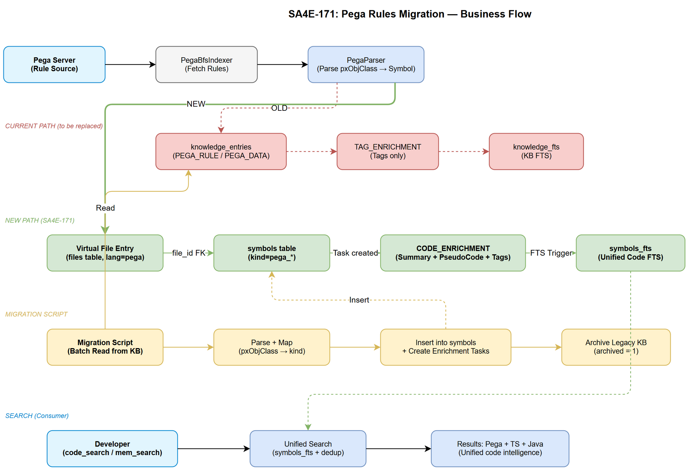
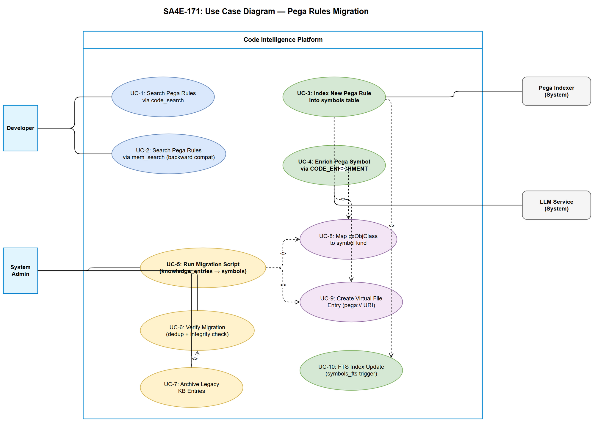

# Business Requirements Document (BRD)

## Code Intelligence Platform — SA4E-171: Migrate Pega Rules from knowledge_entries to symbols table

---

## Document Information

| Field | Value |
|-------|-------|
| Jira Ticket | SA4E-171 |
| Title | Migrate Pega Rules from knowledge_entries to symbols table |
| Author | BA Agent |
| Version | 1.0 |
| Date | 2025-07-27 |
| Status | Draft |

---

## Author Tracking

| Role | Name - Position | Responsibility |
|------|-----------------|----------------|
| Author | BA Agent – Business Analyst | Create document |
| Peer Reviewer | TA Agent – Technical Architect | Review document |

---

## Revision History

| Version | Date | Author | Changes |
|---------|------|--------|---------|
| 1.0 | 2025-07-27 | BA Agent | Initiate document — auto-generated from Jira ticket SA4E-171 |

---

## Sign-Off

| Name | Signature and date |
|------|--------------------|
| | ☐ I agree and confirm all criteria on this BRD as expected requirements |
| | ☐ I agree and confirm all criteria on this BRD as expected requirements |

---

## 1. Introduction

### 1.1 Scope

Migrate Pega rules (Activity, Flow, Data Transform, Decision Table, Section, Harness, etc.) from `knowledge_entries` table to `symbols` table. This migration aligns Pega rules with the existing code symbol model, enabling CODE_ENRICHMENT pipeline processing, FTS indexing via `symbols_fts`, and consistent code intelligence queries across all supported languages (TypeScript, Java, Pega).

Currently, Pega rules are stored as KB entries (`type: PEGA_RULE/PEGA_DATA/PEGA_INDEX/PEGA_AST`) in `knowledge_entries` and processed via `TAG_ENRICHMENT`. This is architecturally incorrect because:
- Pega rules ARE code — they have structure, dependencies, and logic equivalent to TypeScript/Java
- The `symbols` table has a schema better suited for code (kind, file_path, parent_symbol, enrichment_status)
- FTS indexing on `symbols_fts` is already mature and optimized for code search
- The CODE_ENRICHMENT pipeline produces richer output (summary, pseudo_code, llm_tags) than TAG_ENRICHMENT

### 1.2 Out of Scope

- Changes to the Pega rule fetching/crawling mechanism (PegaBfsIndexer, PegaCrawlHelper)
- Changes to the Pega HTTP client (PegaHttpClient, PegaRuleFetcherService)
- Changes to the extension-side indexing UI (IndexingService)
- Pega schema inference system (PegaSchemaInferrer, PegaSchemaKBService)
- Graph projection logic (PegaGraphProjector) — will remain as-is, reading from new location

### 1.3 Preliminary Requirement

- Existing CODE_ENRICHMENT pipeline (SA4E-107) must be stable
- `symbols` table must support additional columns for Pega metadata (enrichment_status, summary, pseudo_code, llm_tags already exist from SA4E-107)
- FTS triggers on `symbols_fts` must handle new Pega symbol kinds

---

## 2. Business Requirements

### 2.1 High Level Process Map

The migration consists of three core concerns:
1. **Schema mapping** — Define how Pega `pxObjClass` values map to symbol `kind` values in the `symbols` table
2. **Pipeline integration** — Route Pega rules through CODE_ENRICHMENT instead of TAG_ENRICHMENT
3. **Data migration** — Move existing Pega rules from `knowledge_entries` to `symbols` with full metadata preservation

### 2.2 List of User Stories / Use Cases

| # | Story / Use Case / Epic | Priority | Source Ticket |
|---|-------------------------|----------|---------------|
| 1 | As a developer, I want Pega rules stored in the symbols table so that code search returns Pega rules alongside TypeScript/Java symbols | MUST HAVE | SA4E-171 |
| 2 | As a developer, I want Pega rules enriched via CODE_ENRICHMENT pipeline so that each rule gets an LLM-generated summary and pseudo_code | MUST HAVE | SA4E-171 |
| 3 | As a developer, I want existing KB search to continue finding Pega rules during and after migration so that no functionality is lost | MUST HAVE | SA4E-171 |
| 4 | As a system administrator, I want a migration script that completes in under 5 minutes for 10k rules so that the transition is practical | MUST HAVE | SA4E-171 |
| 5 | As a developer, I want FTS search on Pega symbols to use the same `symbols_fts` index as other code so that search is unified and fast | SHOULD HAVE | SA4E-171 |

---

### 2.3 Details of User Stories

---

#### Business Flow

**Step 1:** System defines mapping from Pega `pxObjClass` (e.g., Rule-Obj-Activity) to symbol `kind` (e.g., pega_activity)

**Step 2:** New Pega rule ingest pipeline writes to `symbols` table (via "virtual file" per rule) instead of `knowledge_entries`

**Step 3:** CODE_ENRICHMENT tasks are created for new Pega symbols (with `workspaceType: 'pega'`)

**Step 4:** LLM enrichment produces summary + pseudo_code + tags, stored directly in `symbols` table columns

**Step 5:** FTS triggers auto-index Pega symbols into `symbols_fts`

**Step 6:** Migration script reads existing `knowledge_entries` (PEGA_RULE, PEGA_DATA, PEGA_INDEX) and inserts equivalent rows into `symbols` table

**Step 7:** After verification, legacy KB entries are archived (not deleted) for backward compatibility

> **Note:** During migration, both old (knowledge_entries) and new (symbols) paths must be queryable to ensure zero downtime.

---

#### STORY 1: Symbols Table Mapping for Pega Rules

> As a developer, I want Pega rules stored in the symbols table so that code search returns Pega rules alongside TypeScript/Java symbols

**Requirement Details:**

1. Define a mapping from Pega `pxObjClass` to symbol `kind` for all supported rule types
2. Each Pega rule becomes a row in `symbols` with a virtual file reference in `files` table
3. The virtual file path follows convention: `pega://{className}/{ruleType}/{ruleName}` (e.g., `pega://Work-HR/Activity/ApproveLeave`)
4. Symbol `name` = Pega `pyRuleName`, symbol `kind` = mapped pxObjClass, symbol `signature` = FQN string

**Data Fields:**

| Field | Type | Required | Description | Example |
|-------|------|----------|-------------|---------|
| pxObjClass | TEXT | Yes | Pega rule class | Rule-Obj-Activity |
| kind (mapped) | TEXT | Yes | Symbol kind in symbols table | pega_activity |
| name | TEXT | Yes | Rule name (pyRuleName) | ApproveLeave |
| file_id | INTEGER | Yes | FK to virtual file in files table | 42 |
| signature | TEXT | No | FQN string | Work-HR.Activity.ApproveLeave |
| parent_symbol | TEXT | No | AppliesTo class (pyClassName) | Work-HR |
| doc_comment | TEXT | No | Logic summary / structured pseudo code | Step 1: Validate request... |

**Mapping Table (pxObjClass → symbol kind):**

| pxObjClass | Symbol Kind | Category |
|------------|-------------|----------|
| Rule-Obj-Activity | pega_activity | Logic |
| Rule-Obj-Flow | pega_flow | Logic |
| Rule-Obj-DataTransform | pega_data_transform | Logic |
| Rule-Obj-DecisionTable | pega_decision_table | Logic |
| Rule-Obj-DecisionTree | pega_decision_tree | Logic |
| Rule-Obj-Section | pega_section | UI |
| Rule-Obj-Harness | pega_harness | UI |
| Rule-Obj-Report-Definition | pega_report | Data |
| Rule-Obj-MapValue | pega_map_value | Data |
| Rule-Obj-When | pega_when | Logic |
| Rule-Declare-Expressions | pega_declare_expression | Logic |
| Rule-Declare-Pages | pega_declare_page | Data |
| Rule-Obj-Validate | pega_validate | Logic |
| Rule-Connect-* | pega_connector | Integration |
| Rule-Obj-ListVw | pega_list_view | UI |
| Rule-Obj-Property | pega_property | Data |

**Acceptance Criteria:**

1. All supported Pega rule types have a defined mapping to a symbol kind
2. `symbols.kind` column accepts new Pega-prefixed values without schema change
3. Virtual file entries in `files` table use language = 'pega' and module = class name (pyClassName)
4. FTS triggers correctly index Pega symbols (name, signature, doc_comment, kind)

---

#### STORY 2: CODE_ENRICHMENT Pipeline for Pega Rules

> As a developer, I want Pega rules enriched via CODE_ENRICHMENT pipeline so that each rule gets an LLM-generated summary and pseudo_code

**Requirement Details:**

1. After a Pega rule is stored in `symbols` table, a CODE_ENRICHMENT task is created
2. The `CodeEnrichmentTaskCreator` already supports Pega kinds (`pega_activity`, `pega_data_transform`, `pega_flow`) — extend to all Pega kinds
3. The `CodeEnrichmentHandler` selects `PEGA_SUMMARY` strategy for all Pega symbol kinds
4. `SymbolContext` for Pega symbols populates `bodyText` from the stored rule JSON, and `existingPseudoCode` from AST-generated pseudo code
5. Enrichment results (summary, pseudo_code, llm_tags) are stored directly in `symbols` table columns

**Acceptance Criteria:**

1. CODE_ENRICHMENT tasks are created for all newly indexed Pega symbols
2. `CodeEnrichmentHandler.selectStrategy()` returns `PEGA_SUMMARY` for all `pega_*` kinds
3. `CodeEnrichmentHandler.loadContext()` correctly loads Pega rule body from the stored content
4. Enrichment results are stored in `symbols.summary`, `symbols.pseudo_code`, `symbols.llm_tags`
5. TAG_ENRICHMENT tasks are NO LONGER created for Pega rules

---

#### STORY 3: Migration Script (knowledge_entries → symbols)

> As a system administrator, I want a migration script that completes in under 5 minutes for 10k rules so that the transition is practical

**Requirement Details:**

1. Migration script reads all entries from `knowledge_entries` where `type IN ('PEGA_RULE', 'PEGA_DATA', 'PEGA_INDEX')`
2. For each entry: parse rule JSON, extract symbol fields, create virtual file entry, insert into `symbols`
3. Batch processing with configurable batch size (default 100) for transaction safety
4. Idempotent — can be run multiple times without duplicating data (checksum-based dedup)
5. Progress reporting (log every N rules processed)
6. Rollback capability — mark migrated entries, allow reversal if issues found

**Acceptance Criteria:**

1. Migration script processes 10,000 rules in under 5 minutes
2. All metadata is preserved: FQN (source), pxObjClass (kind), content (body), summary, tags
3. Script is idempotent — running twice produces same result
4. Script provides progress output: `Migrated {N}/{total} rules ({percent}%)`
5. Script creates enrichment tasks for migrated symbols that lack enrichment
6. After migration, `symbols` table contains all previously indexed Pega rules

---

#### STORY 4: Backward Compatible KB Search

> As a developer, I want existing KB search to continue finding Pega rules during and after migration so that no functionality is lost

**Requirement Details:**

1. Existing `mem_search` tool must return Pega rules from `symbols` table (post-migration)
2. During migration period, search checks both `knowledge_entries` (legacy) and `symbols` (new)
3. After migration completes and is verified, legacy entries are archived (`archived = 1`)
4. `code_search` tool naturally finds Pega rules via `symbols_fts` after migration

**Acceptance Criteria:**

1. `mem_search("pega Activity ApproveLeave")` returns results both before and after migration
2. `code_search` queries include Pega symbols in results after migration
3. No duplicate results returned (legacy KB entry + new symbol for same rule)
4. Search performance does not degrade (existing indexes handle new data volume)

---

#### STORY 5: FTS Indexing for Pega Symbols

> As a developer, I want FTS search on Pega symbols to use the same symbols_fts index as other code so that search is unified and fast

**Requirement Details:**

1. Pega symbols inserted into `symbols` table automatically get FTS-indexed via existing triggers
2. FTS content includes: name (pyRuleName), signature (FQN), doc_comment (logic summary), kind
3. Porter stemming + unicode61 tokenizer handles Pega naming conventions (PascalCase rule names)
4. Search queries like `symbols_fts MATCH 'approve leave'` return relevant Pega activities

**Acceptance Criteria:**

1. After inserting a Pega symbol, `SELECT * FROM symbols_fts WHERE symbols_fts MATCH 'ruleName'` returns it
2. FTS search performance: < 50ms for typical queries on 10k+ Pega symbols
3. Existing code symbol FTS queries are not affected by addition of Pega symbols
4. FTS rebuild (`INSERT INTO symbols_fts(symbols_fts) VALUES('rebuild')`) includes all Pega symbols

---

## 3. Dependencies

| Dependency | Type | Related Ticket | Description |
|------------|------|----------------|-------------|
| CODE_ENRICHMENT pipeline | System | SA4E-107 | Must be stable — Pega rules will flow through this pipeline |
| symbols table enrichment columns | System | SA4E-107 | Columns summary, pseudo_code, llm_tags, enrichment_status must exist |
| PegaParser | System | SA4E-158 | Must correctly parse pxObjClass → FQN for symbol insertion |
| PegaRuleAstParser | System | SA4E-158 | Provides AST + promptContext for enrichment body text |
| FTS triggers (symbols_fts) | System | SA4E-41 | Must handle new Pega kinds without modification |
| MemoryEngine | System | - | Current KB search must be extended to also search symbols |

---

## 4. Stakeholders

| Role | Name / Team | Responsibility | Source |
|------|-------------|----------------|--------|
| Developer | AI Engineering Team | Implement migration and pipeline changes | Ticket assignee |
| Architect | SA Agent | Design symbol mapping and enrichment integration | Pipeline review |
| QA | QA Agent | Verify backward compatibility and performance | Test planning |

---

## 5. Risks and Assumptions

### 5.1 Risks

| Risk | Impact | Likelihood | Mitigation |
|------|--------|------------|------------|
| Large data volume causes migration timeout | Medium | Low | Batch processing with configurable size, parallel execution |
| FTS index bloat from Pega symbols degrades search | Medium | Low | Monitor index size, FTS rebuild if needed |
| Breaking existing KB search during migration | High | Medium | Dual-read strategy during transition, archival only after verification |
| Pega rule JSON too large for symbols table columns | Low | Low | Store body in body_embeddings or separate content column |
| Enrichment LLM costs increase significantly | Medium | Medium | Rate limiting, priority queue, skip already-enriched via checksum |

### 5.2 Assumptions

- The `symbols` table schema (including enrichment columns from SA4E-107) is already deployed
- PegaParser and PegaRuleAstParser are stable and handle all supported rule types
- Virtual file paths (`pega://`) do not conflict with real filesystem paths
- The existing FTS triggers handle additional symbol kinds without schema changes
- LLM enrichment service has capacity for batch enrichment of migrated rules

---

## 6. Non-Functional Requirements

| Category | Requirement | Details |
|----------|-------------|---------|
| Performance | Migration completes in < 5 min for 10k rules | Batch size 100, transaction per batch |
| Performance | FTS search < 50ms for typical queries | Existing porter tokenizer + indexes sufficient |
| Performance | CODE_ENRICHMENT task processing < 30s per symbol | Existing LLM timeout (BR-02) applies |
| Scalability | Support up to 50k Pega symbols per project | Virtual file + symbol count within SQLite limits |
| Availability | Zero downtime during migration | Dual-read strategy, no table drops |
| Data Integrity | No data loss during migration | Checksum verification, archive (not delete) legacy entries |
| Backward Compat | Existing mem_search returns same results | Add symbols fallback in search, dedup logic |
| Observability | Migration progress logged | Pino logger with batch progress + error details |

---

## 7. Related Tickets

| Ticket Key | Summary | Status | Type | Relationship |
|------------|---------|--------|------|--------------|
| SA4E-171 | Migrate Pega Rules from knowledge_entries to symbols table | In Progress | Story | Main ticket |
| SA4E-107 | CODE_ENRICHMENT pipeline for symbols | Done | Story | Prerequisite — provides enrichment columns + handler |
| SA4E-158 | Separated Pega ingest pipeline (Index + Sync) | Done | Story | Prerequisite — provides PegaIndexer + PegaKbSync |
| SA4E-41 | Multi-tenant project_id scoping | Done | Story | Prerequisite — symbols table has project_id |

---

## 8. Appendix

### Glossary

| Term | Definition |
|------|------------|
| pxObjClass | Pega rule class identifier (e.g., Rule-Obj-Activity) — determines rule type |
| FQN | Fully Qualified Name — unique identifier for a Pega rule: `{className}.{ruleType}.{ruleName}` |
| CODE_ENRICHMENT | LLM pipeline that generates summary, pseudo_code, and tags for code symbols |
| TAG_ENRICHMENT | Legacy LLM pipeline for knowledge_entries — generates tags only |
| symbols_fts | FTS5 virtual table providing full-text search on symbols (name, signature, doc_comment, kind) |
| Virtual file | A synthetic entry in the `files` table representing a Pega rule's location (pega:// URI) |

### Use Case Diagram

### Diagram Index

| # | Diagram | Image | Source (editable) |
|---|---------|-------|-------------------|
| 1 | Business Flow | [business-flow.png](diagrams/business-flow.png) | [business-flow.drawio](diagrams/business-flow.drawio) |
| 2 | Use Case Diagram | [use-case.png](diagrams/use-case.png) | [use-case.drawio](diagrams/use-case.drawio) |
