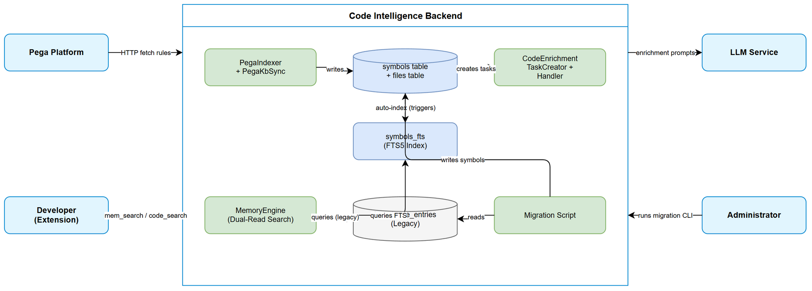
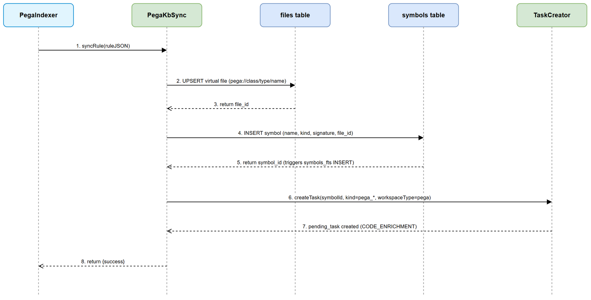
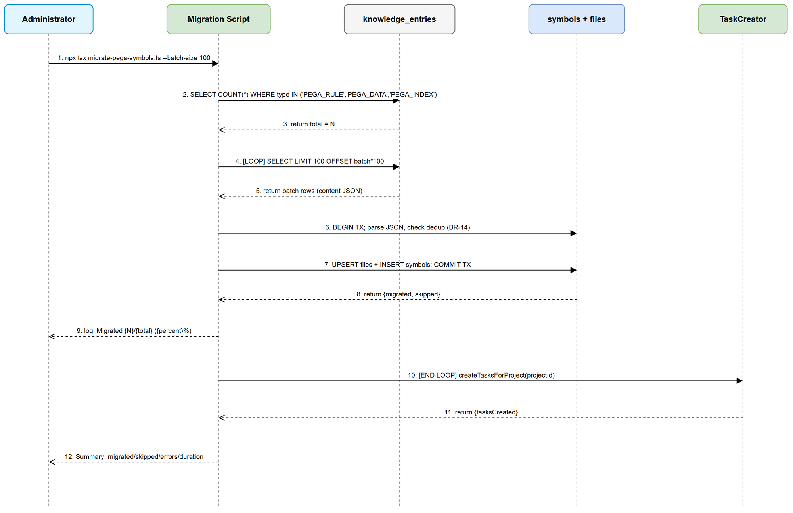
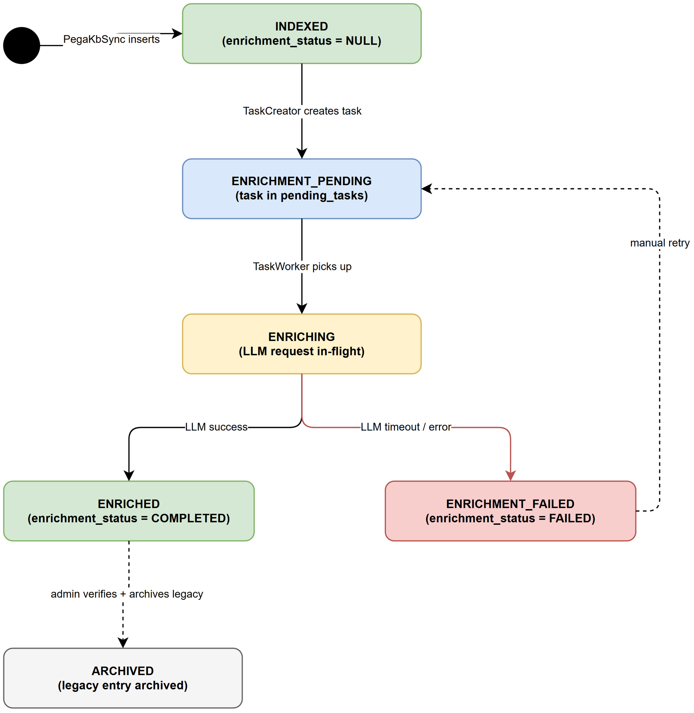

# Functional Specification Document (FSD)

## Code Intelligence Platform — SA4E-171: Migrate Pega Rules from knowledge_entries to symbols table

---

## Document Information

| Field | Value |
|-------|-------|
| Jira Ticket | SA4E-171 |
| Title | Migrate Pega Rules from knowledge_entries to symbols table |
| Author | BA Agent |
| Version | 1.1 |
| Date | 2025-07-27 |
| Status | TA Enriched |
| Related BRD | documents/SA4E-171/BRD.md |

---

## Revision History

| Version | Date | Author | Changes |
|---------|------|--------|---------|
| 1.0 | 2025-07-27 | BA Agent | Initiate document — auto-generated from BRD SA4E-171 |
| 1.1 | 2025-07-27 | TA Agent | Technical enrichment — API contracts, pseudocode, codebase gap analysis, NFR targets, open issues, security review |

---

## 1. Introduction

### 1.1 Purpose

This FSD specifies the functional behavior for migrating Pega rules from the `knowledge_entries` table to the `symbols` table, integrating them with the CODE_ENRICHMENT pipeline, and providing unified FTS indexing. It translates the BRD's 5 user stories into implementable use cases, business rules, and API specifications.

### 1.2 Scope

- Map Pega `pxObjClass` values to symbol `kind` values in the `symbols` table
- Route new Pega rules through CODE_ENRICHMENT instead of TAG_ENRICHMENT
- Migrate existing Pega rules from `knowledge_entries` to `symbols` (batch, idempotent)
- Maintain backward-compatible search during and after transition (dual-read)
- Unify FTS indexing for Pega symbols via existing `symbols_fts` triggers

### 1.3 Definitions & Acronyms

| Term | Definition |
|------|------------|
| pxObjClass | Pega rule class identifier (e.g., Rule-Obj-Activity) |
| FQN | Fully Qualified Name: `{pxObjClass}:{className}:{ruleName}` |
| CODE_ENRICHMENT | LLM pipeline producing summary, pseudo_code, llm_tags for symbols |
| TAG_ENRICHMENT | Legacy LLM pipeline for knowledge_entries (tags only) |
| symbols_fts | FTS5 virtual table for full-text search on symbols |
| Virtual file | Synthetic entry in `files` table representing a Pega rule location |
| PEGA_SUMMARY | Enrichment strategy for Pega symbols in CodeEnrichmentHandler |

### 1.4 References

| Document | Location |
|----------|----------|
| BRD | documents/SA4E-171/BRD.md |
| SA4E-107 (CODE_ENRICHMENT) | Prerequisite — enrichment columns + handler |
| SA4E-158 (Pega Ingest) | Prerequisite — PegaIndexer + PegaKbSync |
| SA4E-41 (Multi-tenant) | Prerequisite — project_id scoping |

---

## 2. System Overview

### 2.1 System Context Diagram



The system boundary encompasses the Code Intelligence Backend. External actors:
- **Pega Platform** — source of rules via HTTP API (crawled by PegaHttpClient)
- **LLM Service** — processes enrichment tasks (summary, pseudo_code, tags)
- **Developer (via Extension)** — searches for Pega rules via `mem_search` and `code_search`
- **Administrator** — triggers migration script

### 2.2 System Architecture

The migration affects three backend layers:
1. **Ingest Layer** — `PegaIndexer` + `PegaKbSync` modified to write to `symbols` + `files` tables
2. **Enrichment Layer** — `CodeEnrichmentTaskCreator` + `CodeEnrichmentHandler` extended for all Pega kinds
3. **Query Layer** — `MemoryEngine` search extended with dual-read; `code_search` naturally includes Pega via `symbols_fts`

---

## 3. Functional Requirements

### 3.1 Feature: Pega Rule to Symbol Mapping

**Source:** BRD Story 1

#### 3.1.1 Description

Each Pega rule ingested into the system must be stored as a row in the `symbols` table with a corresponding virtual file entry in the `files` table. The `pxObjClass` value determines the symbol `kind`.

#### 3.1.2 Use Case

**Use Case ID:** UC-01
**Use Case Name:** Store Pega Rule as Symbol
**Actor:** System (PegaKbSync pipeline)
**Preconditions:** Pega rule JSON fetched and parsed; project_id available
**Postconditions:** Symbol row exists in `symbols`; virtual file exists in `files`; FTS index updated

**Main Flow:**

| Step | Actor | System | Description |
|------|-------|--------|-------------|
| 1 | PegaIndexer | | Fetches rule JSON from Pega Platform |
| 2 | | PegaKbSync | Extracts pxObjClass, pyClassName, pyRuleName from JSON |
| 3 | | PegaKbSync | Maps pxObjClass to symbol kind via BR-01 mapping table |
| 4 | | PegaKbSync | Constructs virtual file path: `pega://{className}/{ruleType}/{ruleName}` |
| 5 | | PegaKbSync | INSERT OR REPLACE into `files` (language='pega', module=className) |
| 6 | | PegaKbSync | INSERT OR REPLACE into `symbols` with mapped kind, name, signature (FQN) |
| 7 | | FTS Trigger | Auto-inserts into `symbols_fts` (name, signature, doc_comment, kind) |

**Alternative Flows:**

| ID | Condition | Steps |
|----|-----------|-------|
| AF-01 | pxObjClass not in mapping table | Use kind = `pega_unknown`; log warning; continue |
| AF-02 | Virtual file already exists (same path + project_id) | Update existing file entry (content_hash); update symbol |

**Exception Flows:**

| ID | Condition | Steps |
|----|-----------|-------|
| EF-01 | Rule JSON missing required fields (pxObjClass, pyClassName, pyRuleName) | Log error; skip rule; increment error counter |
| EF-02 | Database constraint violation (unique conflict) | Retry with UPSERT semantics; if still fails, log and skip |

---

#### 3.1.3 Business Rules

| Rule ID | Rule | Source |
|---------|------|--------|
| BR-01 | pxObjClass to symbol kind mapping (see Mapping Table in 3.1.4) | BRD Story 1 |
| BR-02 | Virtual file path format: `pega://{pyClassName}/{ruleType}/{pyRuleName}` where ruleType = kind without `pega_` prefix | BRD Story 1 |
| BR-03 | Symbol name = pyRuleName; symbol signature = FQN (`{pxObjClass}:{pyClassName}:{pyRuleName}`) | BRD Story 1 |
| BR-04 | parent_symbol = pyClassName (AppliesTo class) | BRD Story 1 |
| BR-05 | Virtual file language = 'pega'; module = pyClassName | BRD Story 1 |
| BR-06 | content_hash = SHA-256 of rule JSON (for dedup + incremental updates) | BRD Story 3 |

#### 3.1.4 Data Specifications — Mapping Table

| pxObjClass | Symbol Kind | Category |
|------------|-------------|----------|
| Rule-Obj-Activity | pega_activity | Logic |
| Rule-Obj-Flow | pega_flow | Logic |
| Rule-Obj-DataTransform | pega_data_transform | Logic |
| Rule-Obj-DecisionTable | pega_decision_table | Logic |
| Rule-Obj-DecisionTree | pega_decision_tree | Logic |
| Rule-Obj-Section | pega_section | UI |
| Rule-Obj-Harness | pega_harness | UI |
| Rule-Obj-Report-Definition | pega_report | Data |
| Rule-Obj-MapValue | pega_map_value | Data |
| Rule-Obj-When | pega_when | Logic |
| Rule-Declare-Expressions | pega_declare_expression | Logic |
| Rule-Declare-Pages | pega_declare_page | Data |
| Rule-Obj-Validate | pega_validate | Logic |
| Rule-Connect-* | pega_connector | Integration |
| Rule-Obj-ListVw | pega_list_view | UI |
| Rule-Obj-Property | pega_property | Data |

**Unmapped classes:** Any pxObjClass not in this table uses kind = `pega_unknown`

#### 3.1.5 Data Model — Symbol Row

**Input Data (from Pega Rule JSON):**

| Field | Type | Required | Validation | Description |
|-------|------|----------|------------|-------------|
| pxObjClass | TEXT | Yes | Must be non-empty string | Pega rule class |
| pyClassName | TEXT | Yes | Must be non-empty string | AppliesTo class |
| pyRuleName | TEXT | Yes | Must be non-empty string | Rule name |
| Rule JSON body | TEXT | Yes | Valid JSON | Full rule content |

**Output Data (symbols table row):**

| Field | Type | Description |
|-------|------|-------------|
| id | INTEGER | Auto-generated PK |
| project_id | TEXT | Tenant project ID |
| file_id | INTEGER | FK to virtual file in files table |
| name | TEXT | pyRuleName |
| kind | TEXT | Mapped from pxObjClass via BR-01 |
| signature | TEXT | FQN string |
| start_line | INTEGER | 1 (virtual) |
| end_line | INTEGER | 1 (virtual) |
| parent_symbol | TEXT | pyClassName |
| visibility | TEXT | 'public' |
| doc_comment | TEXT | Rule summary or first 500 chars of promptContext |
| enrichment_status | TEXT | NULL (pending) or COMPLETED or FAILED |
| summary | TEXT | LLM-generated summary (after enrichment) |
| pseudo_code | TEXT | LLM-generated pseudo code (after enrichment) |
| llm_tags | TEXT | LLM-generated tags (after enrichment) |

---

### 3.2 Feature: CODE_ENRICHMENT Pipeline Integration

**Source:** BRD Story 2

#### 3.2.1 Description

After a Pega rule is stored as a symbol, a CODE_ENRICHMENT task is created. The handler uses PEGA_SUMMARY strategy to generate summary + pseudo_code + tags via LLM.

#### 3.2.2 Use Case

**Use Case ID:** UC-02
**Use Case Name:** Enrich Pega Symbol via CODE_ENRICHMENT
**Actor:** System (TaskWorker background process)
**Preconditions:** Pega symbol exists in `symbols` with enrichment_status = NULL or 'FAILED'
**Postconditions:** Symbol has summary, pseudo_code, llm_tags populated; enrichment_status = 'COMPLETED'

**Main Flow:**

| Step | Actor | System | Description |
|------|-------|--------|-------------|
| 1 | | CodeEnrichmentTaskCreator | Detects unenriched Pega symbol (kind starts with `pega_`) |
| 2 | | CodeEnrichmentTaskCreator | Creates pending_task (type=CODE_ENRICHMENT, payload includes symbolId) |
| 3 | | TaskWorker | Picks up task from pending_tasks queue |
| 4 | | CodeEnrichmentHandler | Calls selectStrategy() — returns PEGA_SUMMARY for pega_* kinds |
| 5 | | CodeEnrichmentHandler | Calls loadContext() — builds SymbolContext with bodyText from rule JSON |
| 6 | | CodeEnrichmentHandler | Sends prompt to LLM service |
| 7 | | LLM Service | Returns summary + pseudo_code + tags |
| 8 | | CodeEnrichmentHandler | Updates symbols row: summary, pseudo_code, llm_tags, enrichment_status='COMPLETED' |

**Alternative Flows:**

| ID | Condition | Steps |
|----|-----------|-------|
| AF-03 | Symbol already enriched (enrichment_status = 'COMPLETED') | Skip — no task created (BR-07) |
| AF-04 | Cross-scope dedup: same content_hash enriched elsewhere | Skip task creation (existing behavior) |

**Exception Flows:**

| ID | Condition | Steps |
|----|-----------|-------|
| EF-03 | LLM timeout (> 30s) | Mark enrichment_status = 'FAILED'; increment retry count |
| EF-04 | LLM returns invalid response | Mark FAILED; log error; retry up to max_retries=3 |
| EF-05 | Rule JSON body too large for LLM context | Truncate to first 8000 tokens; proceed with partial context |

#### 3.2.3 Business Rules

| Rule ID | Rule | Source |
|---------|------|--------|
| BR-07 | Skip enrichment for already-COMPLETED symbols (idempotent) | BRD Story 2 AC-1 |
| BR-08 | All pega_* kinds are ENRICHABLE (extend ENRICHABLE_KINDS set) | BRD Story 2 AC-2 |
| BR-09 | selectStrategy() returns PEGA_SUMMARY for all pega_* kinds | BRD Story 2 AC-3 |
| BR-10 | loadContext() populates bodyText from stored rule JSON content | BRD Story 2 AC-4 |
| BR-11 | TAG_ENRICHMENT tasks must NOT be created for Pega rules (stop legacy path) | BRD Story 2 AC-5 |
| BR-12 | workspaceType in task payload = 'pega' for all Pega enrichment tasks | BRD Story 2 |
| BR-13 | LLM timeout = 30s per enrichment task (from existing CODE_ENRICHMENT config) | BRD NFR |

---

### 3.3 Feature: Migration Script

**Source:** BRD Story 3

#### 3.3.1 Description

A one-time migration script reads existing Pega rules from `knowledge_entries` (types: PEGA_RULE, PEGA_DATA, PEGA_INDEX) and inserts equivalent rows into the `symbols` table. The script is idempotent, batched, and reports progress.

#### 3.3.2 Use Case

**Use Case ID:** UC-03
**Use Case Name:** Migrate Existing Pega Rules to Symbols Table
**Actor:** System Administrator
**Preconditions:** Database accessible; `symbols` table has enrichment columns; `knowledge_entries` contains Pega rules
**Postconditions:** All Pega rules exist in `symbols`; enrichment tasks created for unenriched; progress logged

**Main Flow:**

| Step | Actor | System | Description |
|------|-------|--------|-------------|
| 1 | Admin | | Triggers migration via CLI: `npx tsx scripts/migrate-pega-symbols.ts` |
| 2 | | Script | Counts total rules: `SELECT COUNT(*) FROM knowledge_entries WHERE type IN (...)` |
| 3 | | Script | Processes in batches of 100 (configurable via --batch-size) |
| 4 | | Script | For each batch: BEGIN TRANSACTION |
| 5 | | Script | For each rule: parse JSON, extract fields, compute content_hash |
| 6 | | Script | Check dedup: skip if symbols row with same signature+project_id exists |
| 7 | | Script | Create virtual file entry (UPSERT by path+project_id) |
| 8 | | Script | Create symbol entry (UPSERT by file_id+name+kind) |
| 9 | | Script | COMMIT TRANSACTION |
| 10 | | Script | Log progress: `Migrated {N}/{total} rules ({percent}%)` |
| 11 | | Script | After all batches: create enrichment tasks for unenriched symbols |
| 12 | | Script | Report summary: total migrated, skipped, errors, duration |

**Alternative Flows:**

| ID | Condition | Steps |
|----|-----------|-------|
| AF-05 | Rule already exists in symbols (dedup check) | Skip; increment "skipped" counter |
| AF-06 | --dry-run flag provided | Execute read + log only; no writes |
| AF-07 | --project-id flag provided | Only migrate rules for specified project |

**Exception Flows:**

| ID | Condition | Steps |
|----|-----------|-------|
| EF-06 | Batch transaction fails | ROLLBACK; log error with batch range; continue to next batch |
| EF-07 | Invalid rule JSON (parse error) | Log warning; skip rule; increment error counter |
| EF-08 | Database connection lost | Retry connection 3 times; abort with progress report if unrecoverable |

#### 3.3.3 Business Rules

| Rule ID | Rule | Source |
|---------|------|--------|
| BR-14 | Idempotent: running script twice produces same result (checksum-based dedup) | BRD Story 3 AC-3 |
| BR-15 | Batch size default = 100, configurable via CLI arg | BRD Story 3 AC-2 |
| BR-16 | Performance: < 5 min for 10,000 rules | BRD Story 3 AC-1 |
| BR-17 | Progress logging every batch: `Migrated {N}/{total} ({percent}%)` | BRD Story 3 AC-4 |
| BR-18 | Dedup key: signature (FQN) + project_id combination | BRD Story 3 |
| BR-19 | After migration, create CODE_ENRICHMENT tasks for unenriched symbols | BRD Story 3 AC-5 |
| BR-20 | Legacy entries archived (archived=1) only after manual verification, NOT automatically | BRD Story 4 |

---

### 3.4 Feature: Backward Compatible KB Search

**Source:** BRD Story 4

#### 3.4.1 Description

During and after migration, existing search tools (`mem_search`, `code_search`) must continue to find Pega rules. A dual-read strategy queries both legacy (`knowledge_entries`) and new (`symbols`) sources, with deduplication.

#### 3.4.2 Use Case

**Use Case ID:** UC-04
**Use Case Name:** Search Pega Rules (Dual-Read)
**Actor:** Developer (via Extension)
**Preconditions:** User issues search query via `mem_search` or `code_search`
**Postconditions:** Results include relevant Pega rules regardless of storage location

**Main Flow (mem_search):**

| Step | Actor | System | Description |
|------|-------|--------|-------------|
| 1 | Developer | | Calls `mem_search(query: "Activity ApproveLeave")` |
| 2 | | MemoryEngine | Searches `knowledge_fts` (legacy path) |
| 3 | | MemoryEngine | Searches `symbols_fts` WHERE kind LIKE 'pega_%' (new path) |
| 4 | | MemoryEngine | Merges results; deduplicates by FQN (signature/source match) |
| 5 | | MemoryEngine | Returns unified result set ordered by relevance score |

**Main Flow (code_search):**

| Step | Actor | System | Description |
|------|-------|--------|-------------|
| 1 | Developer | | Calls `code_search(query: "ApproveLeave", kinds: ["pega_activity"])` |
| 2 | | QueryEngine | Searches `symbols_fts` with kind filter |
| 3 | | QueryEngine | Returns Pega symbols alongside TypeScript/Java results |

**Alternative Flows:**

| ID | Condition | Steps |
|----|-----------|-------|
| AF-08 | Migration complete, all rules in symbols | symbols_fts returns results; knowledge_fts returns empty (archived) |
| AF-09 | Query matches both legacy and new entry for same rule | Prefer symbols result (newer, richer metadata); discard legacy duplicate |

**Exception Flows:**

| ID | Condition | Steps |
|----|-----------|-------|
| EF-09 | symbols_fts query fails (table not yet migrated) | Fall back to knowledge_fts only; log warning |

#### 3.4.3 Business Rules

| Rule ID | Rule | Source |
|---------|------|--------|
| BR-21 | During transition: search both knowledge_fts AND symbols_fts for Pega rules | BRD Story 4 AC-1 |
| BR-22 | Dedup by FQN: if same rule appears in both, prefer symbols result | BRD Story 4 AC-3 |
| BR-23 | After migration verified: legacy entries archived (archived=1), excluded from search | BRD Story 4 |
| BR-24 | Search performance must not degrade (< 50ms for typical queries) | BRD NFR |
| BR-25 | code_search naturally returns Pega symbols (no code change needed) | BRD Story 4 AC-2 |

---

### 3.5 Feature: Unified FTS Indexing

**Source:** BRD Story 5

#### 3.5.1 Description

Pega symbols in the `symbols` table are automatically indexed into `symbols_fts` via existing INSERT/UPDATE/DELETE triggers. No new trigger creation needed.

#### 3.5.2 Use Case

**Use Case ID:** UC-05
**Use Case Name:** FTS Auto-Index Pega Symbol
**Actor:** System (SQLite triggers)
**Preconditions:** Pega symbol inserted/updated in `symbols` table
**Postconditions:** `symbols_fts` contains searchable entry for the Pega symbol

**Main Flow:**

| Step | Actor | System | Description |
|------|-------|--------|-------------|
| 1 | | PegaKbSync | Inserts row into `symbols` (name, signature, doc_comment, kind) |
| 2 | | SQLite trigger (symbols_ai) | Auto-inserts into symbols_fts(rowid, name, signature, doc_comment, kind) |
| 3 | Developer | | Queries: `SELECT * FROM symbols_fts WHERE symbols_fts MATCH 'approve leave'` |
| 4 | | SQLite FTS5 | Returns matching Pega symbol rows |

**Alternative Flows:**

| ID | Condition | Steps |
|----|-----------|-------|
| AF-10 | Symbol updated (e.g., enrichment adds summary) | Trigger symbols_au fires: deletes old FTS entry, inserts new |
| AF-11 | Symbol deleted (file removed) | Trigger symbols_ad fires: removes from FTS |

**Exception Flows:**

| ID | Condition | Steps |
|----|-----------|-------|
| EF-10 | FTS index corrupted | Run `INSERT INTO symbols_fts(symbols_fts) VALUES('rebuild')` to rebuild |

#### 3.5.3 Business Rules

| Rule ID | Rule | Source |
|---------|------|--------|
| BR-26 | Existing FTS triggers handle Pega kinds without modification | BRD Story 5 AC-1 |
| BR-27 | FTS content includes: name, signature, doc_comment, kind | BRD Story 5 |
| BR-28 | Porter stemmer + unicode61 tokenizer handles PascalCase Pega naming | BRD Story 5 AC-3 |
| BR-29 | FTS search performance: < 50ms for typical queries on 10k+ Pega symbols | BRD Story 5 AC-2 |
| BR-30 | FTS rebuild includes all Pega symbols | BRD Story 5 AC-4 |

---

## 4. Data Model

### 4.1 Logical Entities

#### Entity: Virtual File (Pega)

| Attribute | Type | Required | Business Rule | Description |
|-----------|------|----------|---------------|-------------|
| id | INTEGER | Yes | Auto PK | File identifier |
| project_id | TEXT | Yes | BR-05 | Tenant project isolation |
| path | TEXT | Yes | BR-02 | `pega://{className}/{ruleType}/{ruleName}` |
| relative_path | TEXT | Yes | BR-02 | Same as path (virtual) |
| language | TEXT | Yes | BR-05 | Always 'pega' |
| module | TEXT | Yes | BR-05 | pyClassName |
| content_hash | TEXT | Yes | BR-06 | SHA-256 of rule JSON |
| size_bytes | INTEGER | Yes | — | Length of rule JSON |
| line_count | INTEGER | Yes | — | 1 (virtual file) |

#### Entity: Pega Symbol

| Attribute | Type | Required | Business Rule | Description |
|-----------|------|----------|---------------|-------------|
| id | INTEGER | Yes | Auto PK | Symbol identifier |
| project_id | TEXT | Yes | — | Tenant project isolation |
| file_id | INTEGER | Yes | FK to files | Virtual file reference |
| name | TEXT | Yes | BR-03 | pyRuleName |
| kind | TEXT | Yes | BR-01 | Mapped from pxObjClass |
| signature | TEXT | No | BR-03 | FQN string |
| start_line | INTEGER | Yes | — | 1 (virtual) |
| end_line | INTEGER | Yes | — | 1 (virtual) |
| parent_symbol | TEXT | No | BR-04 | pyClassName |
| visibility | TEXT | No | — | 'public' |
| doc_comment | TEXT | No | — | Rule summary or first 500 chars |
| enrichment_status | TEXT | No | BR-07 | NULL, COMPLETED, or FAILED |
| summary | TEXT | No | — | LLM-generated summary |
| pseudo_code | TEXT | No | — | LLM-generated pseudo code |
| llm_tags | TEXT | No | — | LLM-generated tags |

**Relationships:**

| From Entity | To Entity | Cardinality | Description |
|-------------|-----------|-------------|-------------|
| Virtual File | Pega Symbol | 1:1 | Each virtual file holds exactly one Pega rule |
| Pega Symbol | CODE_ENRICHMENT Task | 1:0..1 | Symbol may have one pending enrichment task |
| Pega Symbol | symbols_fts | 1:1 | Auto-indexed via trigger |

---

## 5. Integration Specifications

### 5.1 External System: LLM Service (CODE_ENRICHMENT)

| Attribute | Value |
|-----------|-------|
| Purpose | Generate summary, pseudo_code, tags for Pega symbols |
| Direction | Outbound (system to LLM) |
| Data Format | JSON prompt to JSON response |
| Frequency | On-demand per symbol (batch after migration) |

**Data Exchange:**

| Our Data | External Data | Direction | Business Rule |
|----------|--------------|-----------|---------------|
| Rule JSON body + promptContext | summary (TEXT) | Send/Receive | BR-10 |
| Symbol kind + name | pseudo_code (TEXT) | Send/Receive | BR-09 |
| Existing pseudo code (from AST) | llm_tags (TEXT) | Send/Receive | — |

### 5.2 Internal Integration: MemoryEngine (Dual-Read)

| Attribute | Value |
|-----------|-------|
| Purpose | Provide backward-compatible search results |
| Direction | Internal bidirectional |
| Data Format | SQL queries |
| Frequency | Real-time per search request |

---

## 6. Processing Logic

### 6.1 Pega Rule Indexing (New Path)

**Trigger:** PegaIndexer fetches new/updated rules from Pega Platform
**Input:** Rule JSON from Pega HTTP API
**Output:** Symbol row + virtual file + enrichment task

**Processing Steps:**

| Step | Description | Error Handling |
|------|-------------|----------------|
| 1 | Parse rule JSON, extract pxObjClass/pyClassName/pyRuleName | Skip rule if missing fields (EF-01) |
| 2 | Compute content_hash (SHA-256 of JSON) | — |
| 3 | Map pxObjClass to kind via BR-01 | Use 'pega_unknown' if unmapped (AF-01) |
| 4 | UPSERT virtual file (files table) | Retry on constraint violation |
| 5 | UPSERT symbol (symbols table) | Retry on constraint violation |
| 6 | Generate promptContext via PegaRuleUnderstandingService | Non-blocking; store partial if fails |
| 7 | Create CODE_ENRICHMENT task if not already enriched | Skip if COMPLETED (BR-07) |

**Sequence Diagram:**



### 6.2 Migration Script Execution

**Trigger:** Administrator runs CLI command
**Schedule:** One-time execution (re-runnable due to idempotency)
**Input:** knowledge_entries rows (PEGA_RULE, PEGA_DATA, PEGA_INDEX)
**Output:** Equivalent symbols rows + enrichment tasks

**Processing Steps:**

| Step | Description | Error Handling |
|------|-------------|----------------|
| 1 | Count total eligible rows | Abort if 0 rules found |
| 2 | Open batch cursor (LIMIT batch_size OFFSET n) | — |
| 3 | BEGIN TRANSACTION | — |
| 4 | For each row: parse content JSON | Skip invalid JSON (EF-07) |
| 5 | Check dedup (signature + project_id in symbols) | Skip if exists (BR-14) |
| 6 | Create virtual file + symbol | — |
| 7 | COMMIT TRANSACTION | ROLLBACK on failure (EF-06) |
| 8 | Log progress (BR-17) | — |
| 9 | Repeat 2-8 until all rows processed | — |
| 10 | Create enrichment tasks batch | — |
| 11 | Print summary report | — |

**Sequence Diagram:**



---

## 7. Security Requirements

### 7.1 Authentication & Authorization

| Role | Permissions | Screens/Features |
|------|-------------|-------------------|
| Developer | Read (search) | mem_search, code_search |
| System | Write (index, enrich) | PegaKbSync, TaskWorker |
| Administrator | Execute (migration) | CLI migration script |

### 7.2 Data Sensitivity Classification

| Data Type | Classification | Business Requirement |
|-----------|---------------|---------------------|
| Rule JSON content | Internal | Contains business logic — treat as source code |
| LLM-generated summary | Internal | Derived content — same classification as source |
| FQN / rule names | Internal | Identifiers — not sensitive but internal |

---

## 8. Non-Functional Requirements

| Category | Business Requirement | Acceptance Criteria |
|----------|---------------------|---------------------|
| Performance | Migration completes quickly | < 5 min for 10,000 rules (BR-16) |
| Performance | Search remains fast | < 50ms for typical FTS queries (BR-24, BR-29) |
| Performance | Enrichment per symbol | < 30s LLM timeout (BR-13) |
| Scalability | Support large Pega projects | Up to 50,000 Pega symbols per project |
| Availability | Zero downtime during migration | Dual-read strategy (BR-21) |
| Data Integrity | No data loss | Checksum verification + archive (not delete) legacy |
| Idempotency | Re-runnable migration | Checksum-based dedup (BR-14) |
| Observability | Progress tracking | Pino logger with batch progress (BR-17) |

---

## 9. Error Handling (User-Facing)

### 9.1 Error Scenarios

| Scenario | Severity | User Message | Expected Behavior |
|----------|----------|-------------|-------------------|
| Migration batch fails | Warning | `Batch {N} failed: {reason}. Continuing with next batch.` | Log error; continue; report in summary |
| Rule JSON parse error | Info | `Skipped rule at row {id}: invalid JSON` | Skip rule; log; continue |
| LLM enrichment timeout | Warning | `Enrichment failed for {ruleName}: timeout. Will retry.` | Mark FAILED; retry up to 3 times |
| FTS index corrupted | Critical | `FTS index corruption detected. Rebuilding...` | Auto-rebuild FTS; log incident |
| Search returns no results | Info | `No results found for "{query}"` | Return empty result set |
| Database connection lost | Critical | `Database connection lost. Migrated {N}/{total} so far.` | Report progress; exit with non-zero code |

### 9.2 Error Codes

| Code | Description | HTTP Status | Recovery |
|------|-------------|-------------|----------|
| PEGA_MIGRATION_BATCH_FAIL | Transaction failed for batch | N/A (CLI) | Auto-continues to next batch |
| PEGA_MIGRATION_PARSE_ERROR | Invalid rule JSON | N/A (CLI) | Skipped; logged |
| PEGA_ENRICHMENT_TIMEOUT | LLM did not respond in time | N/A (background) | Auto-retry (max 3) |
| PEGA_ENRICHMENT_INVALID | LLM returned unparseable response | N/A (background) | Logged; marked FAILED |
| PEGA_MAPPING_UNKNOWN | pxObjClass not in mapping table | N/A (background) | Uses pega_unknown; warns |

---

## 10. API Specifications

### 10.1 Migration CLI Interface

```
npx tsx scripts/migrate-pega-symbols.ts [options]

Options:
  --batch-size <N>     Number of rules per transaction (default: 100)
  --project-id <ID>    Only migrate rules for this project
  --dry-run            Read-only mode — log what would be migrated
  --verbose            Extra logging (per-rule details)
```

**Output:**
```
[migrate] Starting Pega rules migration...
[migrate] Found 8,432 rules to process
[migrate] Migrated 100/8432 (1.2%)
[migrate] Migrated 200/8432 (2.4%)
...
[migrate] Migration complete
  - Total rules: 8,432
  - Migrated: 8,200
  - Skipped (dedup): 230
  - Errors: 2
  - Duration: 3m 12s
  - Enrichment tasks created: 7,500
```

### 10.2 Search API (Extended Behavior)

**Endpoint:** `POST /api/v1/memory/search` (existing — behavior extended)

**Input Parameters:**

| Parameter | Type | Required | Business Rule | Description |
|-----------|------|----------|---------------|-------------|
| query | TEXT | Yes | — | Search query string |
| limit | INTEGER | No | Default 10 | Max results |
| types | TEXT[] | No | — | Filter by entry type |

**Output Data (enhanced):**

| Field | Type | Description |
|-------|------|-------------|
| id | INTEGER | Entry/symbol ID |
| content | TEXT | Rule content or symbol doc_comment |
| summary | TEXT | LLM summary (from symbols.summary if available) |
| type | TEXT | 'PEGA_RULE' (legacy) or 'PEGA_SYMBOL' (new) |
| source | TEXT | FQN or source identifier |
| score | FLOAT | Relevance score |
| tags | TEXT | Comma-separated tags |
| kind | TEXT | Symbol kind (pega_activity, etc.) — new field |

**Business Error Scenarios:**

| Scenario | User Message | Trigger Condition |
|----------|-------------|-------------------|
| No results | Empty array returned | Query matches nothing |
| FTS error | Fallback to knowledge_fts only | symbols_fts query fails |

### 10.3 Code Search (Existing — No Change Needed)

**Endpoint:** MCP tool `code_search` (existing behavior)

Pega symbols are automatically searchable via `symbols_fts` after insertion. No API change required — symbols with `pega_*` kinds are included in existing queries.

---

## 11. State Diagram — Pega Symbol Lifecycle



**States:**

| State | Description |
|-------|-------------|
| INDEXED | Symbol created from PegaIndexer (enrichment_status = NULL) |
| ENRICHMENT_PENDING | CODE_ENRICHMENT task created in pending_tasks queue |
| ENRICHING | Task picked up by TaskWorker, LLM request in-flight |
| ENRICHED | LLM results stored (enrichment_status = 'COMPLETED') |
| ENRICHMENT_FAILED | LLM failed after max retries (enrichment_status = 'FAILED') |
| ARCHIVED | Legacy entry archived, symbol is authoritative source |

**Transitions:**

| From | To | Trigger |
|------|-----|---------|
| — | INDEXED | PegaKbSync inserts symbol |
| INDEXED | ENRICHMENT_PENDING | CodeEnrichmentTaskCreator creates task |
| ENRICHMENT_PENDING | ENRICHING | TaskWorker picks up task |
| ENRICHING | ENRICHED | LLM returns valid result |
| ENRICHING | ENRICHMENT_FAILED | LLM timeout/error after max_retries |
| ENRICHMENT_FAILED | ENRICHMENT_PENDING | Manual retry or scheduled re-enrichment |
| INDEXED/ENRICHED | ARCHIVED | Admin archives legacy entry after verification |

---

## 12. Testing Considerations

### 12.1 Test Scenarios

| ID | Scenario | Input | Expected Output | Priority |
|----|----------|-------|-----------------|----------|
| TC-01 | Map known pxObjClass to symbol kind | Rule-Obj-Activity JSON | symbols.kind = 'pega_activity' | High |
| TC-02 | Map unknown pxObjClass | Rule-Obj-Custom JSON | symbols.kind = 'pega_unknown' + warning | High |
| TC-03 | Virtual file creation | Activity rule | files row with language='pega', path='pega://...' | High |
| TC-04 | FTS auto-index after insert | Insert pega_activity symbol | symbols_fts MATCH 'ruleName' returns row | High |
| TC-05 | Enrichment task created | Insert + run task creator | pending_tasks has CODE_ENRICHMENT task | High |
| TC-06 | Enrichment skips COMPLETED | Symbol with status='COMPLETED' | No new task created | Medium |
| TC-07 | Migration idempotency | Run script twice | Second run: 0 migrated, N skipped | High |
| TC-08 | Migration batch failure recovery | Corrupt JSON in batch | Batch ROLLBACK; other batches succeed | High |
| TC-09 | Dual-read returns from symbols | Rule in symbols only | mem_search returns it | High |
| TC-10 | Dual-read dedup | Same rule in both tables | One result only (prefer symbols) | High |
| TC-11 | Migration performance | 10,000 rules | Completes in < 5 min | High |
| TC-12 | FTS performance | 10k symbols, MATCH query | < 50ms response | Medium |
| TC-13 | PEGA_SUMMARY strategy | pega_data_transform kind | selectStrategy() = PEGA_SUMMARY | Medium |
| TC-14 | All 16 pxObjClass mappings | Each class value | Correct kind returned | High |

---

## 13. Appendix

### Diagram Index

| # | Diagram | Image | Source (editable) |
|---|---------|-------|-------------------|
| 1 | System Context | [system-context.png](diagrams/system-context.png) | [system-context.drawio](diagrams/system-context.drawio) |
| 2 | Sequence — Indexing Flow | [sequence-indexing.png](diagrams/sequence-indexing.png) | [sequence-indexing.drawio](diagrams/sequence-indexing.drawio) |
| 3 | Sequence — Migration Flow | [sequence-migration.png](diagrams/sequence-migration.png) | [sequence-migration.drawio](diagrams/sequence-migration.drawio) |
| 4 | State — Pega Symbol Lifecycle | [state-pega-symbol.png](diagrams/state-pega-symbol.png) | [state-pega-symbol.drawio](diagrams/state-pega-symbol.drawio) |

### Change Log from BRD

- BR-02: Clarified virtual file path format with ruleType derived from kind (without `pega_` prefix)
- BR-18: Specified dedup key as signature + project_id (more specific than BRD's "checksum-based")
- BR-20: Clarified that archival is manual (not automatic) after migration
- UC-04: Added dedup logic detail for dual-read (prefer symbols over knowledge_entries)
- Added `pega_unknown` fallback kind for unmapped pxObjClass values (not in BRD)

---

## TECHNICAL APPENDIX A — API Contracts (TA Enrichment)

### A.1 LLM Enrichment Request/Response Schema

**LLM Service Integration — CODE_ENRICHMENT with PEGA_SUMMARY strategy**

The `CodeEnrichmentHandler` calls `LLMService.complete()` with structured messages. The prompt is built by `CodeEnrichmentPromptBuilder.build(strategy, context)`.

**Request — SymbolContext (built by loadContext):**

```typescript
interface SymbolContext {
  name: string;              // pyRuleName (from symbols.name)
  kind: string;              // e.g. "pega_activity" (from symbols.kind)
  signature: string | null;  // FQN string (from symbols.signature)
  docComment: string | null; // First 500 chars promptContext
  bodyText: string | null;   // Rule JSON body (truncated to 4000 tokens)
  childMembers: string[] | null; // Not applicable for Pega — null
  existingPseudoCode: string | null; // Existing pseudo from AST/parser
  pegaClass?: string;        // pxObjClass value (NEW — for SA4E-171)
  pegaRuleset?: string;      // Ruleset context (NEW — for SA4E-171)
}
```

**LLM Response — CodeEnrichmentLLMResponse:**

```typescript
interface CodeEnrichmentLLMResponse {
  summary: string;           // 1-3 sentence description of rule behavior
  pseudo_code?: string;      // Simplified logic representation (max 2000 chars)
  tags?: string[];           // e.g. ["domain:hr", "responsibility:approval", "complexity:medium"]
}
```

**Tags must conform to VALID_TAG_CATEGORIES:**
- `design-pattern` — e.g. "design-pattern:state-machine"
- `responsibility` — e.g. "responsibility:approval-workflow"
- `domain` — e.g. "domain:human-resources"
- `complexity` — e.g. "complexity:high"
- `dependency` — e.g. "dependency:external-service"

**LLM Call Configuration:**

| Parameter | Value | Source |
|-----------|-------|--------|
| Timeout | 30,000ms | `LLM_TIMEOUT_MS` constant |
| Max pseudo_code length | 2,000 chars | `MAX_PSEUDO_CODE_LENGTH` constant |
| Retry on failure | up to 3 | `pending_tasks.max_retries` |
| Response format | JSON (with markdown fence fallback) | `parseResponse()` |

### A.2 Migration CLI — Full Contract

**Command:**
```bash
npx tsx scripts/migrate-pega-symbols.ts [options]
```

**Arguments Schema:**

| Argument | Type | Default | Validation |
|----------|------|---------|------------|
| `--batch-size` | integer | 100 | 1 ≤ N ≤ 1000 |
| `--project-id` | string | (all projects) | Non-empty if provided |
| `--dry-run` | boolean flag | false | — |
| `--verbose` | boolean flag | false | — |

**Exit Codes:**

| Code | Meaning |
|------|---------|
| 0 | Success — all rules migrated (or dry-run complete) |
| 1 | Partial failure — some batches failed but script continued |
| 2 | Fatal — unrecoverable error (DB connection lost, abort) |

**Stdout JSON Summary (on completion):**
```json
{
  "status": "completed",
  "total": 8432,
  "migrated": 8200,
  "skipped": 230,
  "errors": 2,
  "durationMs": 192000,
  "enrichmentTasksCreated": 7500,
  "errorDetails": [
    { "rowId": 4521, "reason": "invalid_json", "source": "Rule-Obj-Activity:HRProcess:InvalidRule" }
  ]
}
```

### A.3 Search API — Enhanced Response Schema

**Endpoint:** `POST /api/v1/memory/search` (existing, behavior extended)

**Request Body:**
```json
{
  "query": "Activity ApproveLeave",
  "limit": 10,
  "tier": "SEMANTIC",
  "type": "PEGA_RULE"
}
```

**Response — Dual-Read Unified Result:**
```json
{
  "results": [
    {
      "id": 1234,
      "content": "{rule JSON or summary}",
      "summary": "Approves leave requests by validating balance and manager hierarchy",
      "type": "PEGA_RULE",
      "source": "Rule-Obj-Activity:HRProcess:ApproveLeave",
      "score": 0.92,
      "tags": "pega,rule,domain:hr,responsibility:approval",
      "kind": "pega_activity",
      "matchSource": "symbols_fts",
      "enrichmentStatus": "COMPLETED"
    }
  ],
  "meta": {
    "query": "Activity ApproveLeave",
    "totalResults": 1,
    "sources": ["symbols_fts", "knowledge_fts"],
    "deduplicated": 0
  }
}
```

**New fields in response (backward-compatible additions):**

| Field | Type | Description | When present |
|-------|------|-------------|--------------|
| `kind` | string | Symbol kind (pega_activity, etc.) | When result from symbols |
| `matchSource` | string | `"symbols_fts"` or `"knowledge_fts"` | Always |
| `enrichmentStatus` | string | `"COMPLETED"`, `"FAILED"`, or `null` | When result from symbols |
| `meta.sources` | string[] | Which FTS tables were queried | Always |
| `meta.deduplicated` | number | Count of results removed by dedup | Always |

### A.4 CODE_ENRICHMENT Task Payload Schema (Zod)

```typescript
// From: backend/src/engine/enrichment/types.ts
export const CodeEnrichmentPayloadSchema = z.object({
  symbolId: z.number(),
  symbolName: z.string(),
  symbolKind: z.string(),
  projectId: z.string(),
  filePath: z.string(),
  workspaceType: z.enum(['pega', 'standard']).default('standard'),
});
```

**For Pega symbols, workspaceType MUST be `'pega'`** to trigger PEGA_SUMMARY strategy.

---

## TECHNICAL APPENDIX B — Pseudocode for Complex Logic (TA Enrichment)

### B.1 Migration Batch Processing

```pseudocode
FUNCTION migratePegaRules(options: MigrationOptions):
  // Phase 1: Count and validate
  totalRules = SELECT COUNT(*) FROM knowledge_entries
               WHERE type IN ('PEGA_RULE', 'PEGA_DATA', 'PEGA_INDEX')
               AND (options.projectId IS NULL OR project_id = options.projectId)

  IF totalRules = 0 THEN
    LOG "No rules to migrate"
    EXIT 0
  END IF

  LOG "Found {totalRules} rules to process"

  // Phase 2: Batch iteration
  migrated = 0, skipped = 0, errors = 0
  offset = 0

  WHILE offset < totalRules DO
    batch = SELECT id, content, source, project_id, type
            FROM knowledge_entries
            WHERE type IN ('PEGA_RULE', 'PEGA_DATA', 'PEGA_INDEX')
            AND (options.projectId IS NULL OR project_id = options.projectId)
            LIMIT options.batchSize OFFSET offset

    IF options.dryRun THEN
      LOG "Would migrate {batch.length} rules"
      offset += options.batchSize
      CONTINUE
    END IF

    TRY
      BEGIN TRANSACTION
      FOR EACH row IN batch DO
        TRY
          ruleJson = JSON.parse(row.content)
          pxObjClass = ruleJson.pxObjClass
          pyClassName = ruleJson.pyClassName OR ruleJson['pxInsName split'][0]
          pyRuleName = ruleJson.pyRuleName OR ruleJson.pxInsName

          IF NOT (pxObjClass AND pyClassName AND pyRuleName) THEN
            errors++; CONTINUE  // Skip invalid (EF-07)
          END IF

          kind = MAPPING_TABLE[pxObjClass] OR 'pega_unknown'
          fqn = "{pxObjClass}:{pyClassName}:{pyRuleName}"
          virtualPath = "pega://{pyClassName}/{kind.replace('pega_','')}/{pyRuleName}"
          contentHash = SHA256(row.content)

          // Dedup check (BR-14)
          existing = SELECT id FROM symbols
                     WHERE signature = fqn AND project_id = row.project_id
          IF existing THEN
            skipped++; CONTINUE
          END IF

          // Create virtual file (UPSERT)
          fileId = INSERT INTO files (project_id, path, relative_path, language, module, content_hash, size_bytes, line_count)
                   VALUES (row.project_id, virtualPath, virtualPath, 'pega', pyClassName, contentHash, LENGTH(row.content), 1)
                   ON CONFLICT(project_id, path) DO UPDATE SET content_hash = contentHash
                   RETURNING id

          // Create symbol
          INSERT INTO symbols (project_id, file_id, name, kind, signature, start_line, end_line, parent_symbol, visibility, doc_comment)
          VALUES (row.project_id, fileId, pyRuleName, kind, fqn, 1, 1, pyClassName, 'public', SUBSTRING(row.summary, 1, 500))

          migrated++
        CATCH parseError
          errors++
          LOG WARN "Row {row.id}: {parseError.message}"
        END TRY
      END FOR
      COMMIT TRANSACTION
    CATCH txError
      ROLLBACK TRANSACTION  // EF-06
      errors += batch.length
      LOG ERROR "Batch at offset {offset} failed: {txError.message}"
    END TRY

    offset += options.batchSize
    LOG "Migrated {migrated}/{totalRules} ({ROUND(migrated*100/totalRules)}%)"  // BR-17
  END WHILE

  // Phase 3: Create enrichment tasks for unenriched symbols
  unenriched = SELECT s.id, s.name, s.kind, f.relative_path
               FROM symbols s JOIN files f ON s.file_id = f.id
               WHERE s.kind LIKE 'pega_%'
               AND (s.enrichment_status IS NULL OR s.enrichment_status = 'FAILED')
  
  enrichmentTasksCreated = 0
  FOR EACH sym IN unenriched DO
    INSERT INTO pending_tasks (task_type, entry_id, status, payload, max_retries)
    VALUES ('CODE_ENRICHMENT', sym.id, 'PENDING',
            JSON({ symbolId: sym.id, symbolName: sym.name, symbolKind: sym.kind,
                   projectId: sym.project_id, filePath: sym.relative_path,
                   workspaceType: 'pega' }),
            3)
    enrichmentTasksCreated++
  END FOR

  // Phase 4: Report
  RETURN { total: totalRules, migrated, skipped, errors, enrichmentTasksCreated,
           durationMs: NOW - startTime }
END FUNCTION
```

### B.2 Dual-Read Search Logic

```pseudocode
FUNCTION searchWithDualRead(query: string, limit: number, scopeCtx: ScopeContext):
  // Path 1: Search knowledge_fts (legacy — existing behavior)
  ftsQuery = sanitizeFtsQuery(query)
  legacyResults = SELECT ke.*, f.rank
                  FROM knowledge_fts f
                  JOIN knowledge_entries ke ON f.rowid = ke.id
                  WHERE knowledge_fts MATCH ftsQuery
                  AND ke.archived = 0
                  AND ke.type IN ('PEGA_RULE', 'PEGA_DATA')
                  AND {scopeFilter}
                  ORDER BY f.rank
                  LIMIT limit

  // Path 2: Search symbols_fts (new — Pega symbols)
  symbolsResults = SELECT s.id, s.name, s.kind, s.signature, s.doc_comment,
                          s.summary, s.enrichment_status, f.rank AS score
                   FROM symbols_fts f
                   JOIN symbols s ON f.rowid = s.id
                   WHERE symbols_fts MATCH ftsQuery
                   AND s.kind LIKE 'pega_%'
                   AND s.project_id = scopeCtx.projectId
                   ORDER BY f.rank
                   LIMIT limit

  // Merge and deduplicate (BR-22)
  seenFQNs = new Set()
  mergedResults = []

  // Prefer symbols results (newer, richer metadata)
  FOR EACH sr IN symbolsResults DO
    fqn = sr.signature  // FQN is stored as signature
    seenFQNs.add(fqn)
    mergedResults.push({
      id: sr.id,
      content: sr.doc_comment,
      summary: sr.summary,
      type: 'PEGA_SYMBOL',
      source: fqn,
      score: sr.score,
      kind: sr.kind,
      matchSource: 'symbols_fts',
      enrichmentStatus: sr.enrichment_status
    })
  END FOR

  // Add legacy results not already in symbols
  FOR EACH lr IN legacyResults DO
    fqn = lr.source  // Legacy entries use source = FQN
    IF NOT seenFQNs.has(fqn) THEN
      mergedResults.push({
        id: lr.id,
        content: lr.content,
        summary: lr.summary,
        type: lr.type,
        source: fqn,
        score: lr.rank,
        kind: null,
        matchSource: 'knowledge_fts',
        enrichmentStatus: null
      })
    END IF
  END FOR

  // Sort by score (relevance), return up to limit
  mergedResults.sort(BY score DESC)
  RETURN mergedResults.slice(0, limit)
END FUNCTION
```

### B.3 Enrichment Strategy Selection (Extended)

```pseudocode
FUNCTION selectStrategy(kind: string, workspaceType: string): EnrichmentStrategy
  // SA4E-171: All pega_* kinds use PEGA_SUMMARY strategy
  IF workspaceType = 'pega' AND kind.startsWith('pega_') THEN
    RETURN 'PEGA_SUMMARY'
  END IF

  IF kind IN ['function', 'method', 'arrow_function', 'generator'] THEN
    RETURN 'FUNCTION_SUMMARY'
  END IF

  IF kind IN ['class', 'interface', 'enum'] THEN
    RETURN 'CLASS_SUMMARY'
  END IF

  RETURN 'CLASS_SUMMARY'  // Fallback
END FUNCTION
```

**IMPORTANT:** Current codebase has `PEGA_KINDS = new Set(['pega_activity', 'pega_data_transform', 'pega_flow'])` which only covers 3 of 16 mapped kinds. SA4E-171 MUST change this to use `kind.startsWith('pega_')` pattern matching instead of a static set, to avoid needing code changes every time a new mapping is added.

---

## TECHNICAL APPENDIX C — Codebase Gaps & Required Changes (TA Enrichment)

### C.1 Files Requiring Modification

| # | File | Change Required | Rationale |
|---|------|-----------------|-----------|
| 1 | `backend/src/engine/enrichment/CodeEnrichmentHandler.ts` | Change `PEGA_KINDS` set to `kind.startsWith('pega_')` check | Only 3 of 16 kinds currently supported |
| 2 | `backend/src/engine/enrichment/CodeEnrichmentTaskCreator.ts` | Extend `ENRICHABLE_KINDS` with all pega_* kinds OR use startsWith check | Only 3 of 16 kinds in set |
| 3 | `backend/src/modules/pega/PegaKbSync.ts` | Add new path writing to `symbols` + `files` tables (keep existing knowledge_entries path during transition) | Currently writes only to knowledge_entries |
| 4 | `backend/src/modules/memory/engine/core.ts` | Add symbols_fts search for Pega kinds in `search()` method + merge/dedup logic | Currently only searches knowledge_fts |
| 5 | `backend/src/modules/memory/task-queue/models.ts` | Verify `TaskType.CODE_ENRICHMENT` exists | Used for Pega enrichment tasks |
| 6 | `backend/src/engine/enrichment/CodeEnrichmentTaskCreator.ts` | Set `workspaceType: 'pega'` for Pega symbol tasks | Currently hardcodes `'standard'` |
| 7 | NEW: `backend/scripts/migrate-pega-symbols.ts` | Migration CLI script | Does not exist yet |

### C.2 Schema Compatibility Notes

**`pending_tasks` table FK issue:**
- Current definition: `FOREIGN KEY (entry_id) REFERENCES knowledge_entries(id)`
- Problem: For CODE_ENRICHMENT tasks targeting symbols, `entry_id` stores `symbol_id` (not a knowledge_entries.id)
- Current behavior: `CodeEnrichmentTaskCreator.insertTask()` already stores `symbolId` in `entry_id` field — FK is not enforced at runtime in SQLite
- Resolution: No schema change needed (FK not enforced); but **PostgreSQL deployments must add** `ON DELETE SET NULL` or remove FK constraint for CODE_ENRICHMENT tasks
- Alternative: Add `symbol_id` column to `pending_tasks` (non-breaking migration)

**`symbols` table additional columns confirmed present:**
- `summary TEXT` ✅ (from SA4E-107 migration)
- `pseudo_code TEXT` ✅
- `llm_tags TEXT` ✅
- `enrichment_status TEXT` ✅
- `enriched_at TEXT` ✅
- `parent_symbol_id INTEGER` ✅ (from graph migration)

**`files` table UNIQUE constraint:**
- `UNIQUE(project_id, path)` ✅ — supports UPSERT for virtual files

### C.3 Current `PegaKbSync.createEnrichmentTask()` — Must Be Updated

Current behavior (lines from codebase):
```typescript
// Creates TAG_ENRICHMENT task (legacy path)
await taskRepo.create({
  task_type: TaskType.TAG_ENRICHMENT,  // ← WRONG for SA4E-171
  entry_id: entryId,                   // ← references knowledge_entries.id
  payload: { entry_id: entryId, content, existing_tags: existingTags,
    options: { threshold: 0.6, autoApply: true } },
});
```

Required new behavior for SA4E-171:
```typescript
// Creates CODE_ENRICHMENT task (new path)
await taskRepo.create({
  task_type: TaskType.CODE_ENRICHMENT,  // ← CODE_ENRICHMENT
  entry_id: symbolId,                    // ← references symbols.id
  payload: JSON.stringify({
    symbolId, symbolName, symbolKind: kind,
    projectId, filePath: virtualPath,
    workspaceType: 'pega',              // ← triggers PEGA_SUMMARY strategy
  }),
});
```

---

## TECHNICAL APPENDIX D — Non-Functional Requirements (Quantified) (TA Enrichment)

| Category | Metric | Target | Measurement Method |
|----------|--------|--------|-------------------|
| Migration Throughput | Rules processed per second | ≥ 33 rules/sec (10k in 5 min) | Time from script start to completion |
| Migration Memory | Peak RAM usage | ≤ 512 MB | Batch processing prevents loading all rules |
| Search Latency (p50) | FTS query time (dual-read) | ≤ 30ms | Instrumentation on search handler |
| Search Latency (p99) | FTS query time (dual-read) | ≤ 100ms | Under 10k Pega symbols per project |
| Enrichment Throughput | Symbols enriched per minute | ≥ 2 symbols/min | Rate-limited by LLM (30s timeout each) |
| FTS Index Size | Storage overhead per symbol | ≤ 500 bytes/symbol in FTS | Expected: name + signature + doc_comment + kind |
| Dual-Read Overhead | Additional latency vs single-read | ≤ 15ms | Second FTS query + merge time |
| Idempotency | Re-run produces zero new writes | 0 new inserts on re-run | Verify with `migrated = 0` in summary |
| Transaction Batch Size | Optimal commit size | 100 (default), tunable 10-1000 | Balances WAL pressure vs progress granularity |
| Concurrent Enrichment | TaskWorker parallelism | 1 (sequential) | Single worker processes queue serially |

---

## TECHNICAL APPENDIX E — Open Issues & Technical Decisions (TA Enrichment)

### E.1 Open Issues

| # | Issue | Options | Recommendation | Impact |
|---|-------|---------|----------------|--------|
| OI-01 | `pending_tasks.entry_id` FK references `knowledge_entries(id)` but CODE_ENRICHMENT tasks store `symbols.id` | A) Add `symbol_id` column; B) Keep using `entry_id` (FK not enforced in SQLite); C) Remove FK | **B** for now — SQLite doesn't enforce; add migration note for PostgreSQL | Low risk for SQLite; Medium for PG |
| OI-02 | Should `PegaKbSync` write to BOTH `knowledge_entries` AND `symbols` during transition? | A) Dual-write (safe rollback); B) Write only to symbols (clean break) | **A** — Dual-write during transition, controlled by feature flag `PEGA_DUAL_WRITE=true` | Affects rollback strategy |
| OI-03 | When to archive legacy `knowledge_entries` Pega rows? | A) Auto-archive after migration script; B) Manual verification then archive; C) Never archive (ignore via dual-read dedup) | **B** — Manual verification (BR-20) | Affects storage but not correctness |
| OI-04 | How to handle `body_embeddings` table for Pega symbols? (used by `loadBodyText`) | A) Store rule JSON in body_embeddings; B) Store in separate `pega_rule_content` table; C) Load from knowledge_entries.content during transition | **A** — Reuse existing mechanism (store rule JSON as chunk_index=0) | Needed for loadContext() |
| OI-05 | `PegaRuleUnderstandingService.toPromptContext()` output vs `doc_comment` field size (500 char limit) | A) Store full promptContext in doc_comment (no limit); B) Keep 500 char limit, store full in separate field; C) Store truncated in doc_comment, full in body_embeddings | **C** — Consistent with existing pattern | Affects FTS relevance |

### E.2 Resolved Decisions

| # | Decision | Rationale |
|---|----------|-----------|
| RD-01 | Use `kind.startsWith('pega_')` instead of static PEGA_KINDS set | Future-proof — new mappings don't require code changes |
| RD-02 | Virtual file path format: `pega://{className}/{ruleType}/{ruleName}` | Consistent with existing `symbols`→`files` relationship; human-readable |
| RD-03 | Migration script as standalone CLI (not API endpoint) | One-time operation; admin access only; long-running |
| RD-04 | FTS rebuild not needed — triggers handle inserts automatically | Confirmed in codebase: `symbols_ai`, `symbols_au`, `symbols_ad` triggers exist |
| RD-05 | `code_search` MCP tool already queries `symbols_fts` — no change needed | Confirmed in `backend/src/engine/query/query-layer.ts` |

---

## TECHNICAL APPENDIX F — Security Review (TA) (TA Enrichment)

### F.1 Security Considerations

| # | Concern | Risk | Mitigation |
|---|---------|------|-----------|
| SEC-01 | Migration script has direct DB write access | Medium | CLI-only execution; requires admin access; no HTTP exposure |
| SEC-02 | Rule JSON content stored as-is in symbols/files | Low | Same classification as existing knowledge_entries; no new exposure |
| SEC-03 | LLM receives rule JSON content (may contain business logic) | Medium | Already happens via TAG_ENRICHMENT; same trust boundary |
| SEC-04 | Dual-read search may expose rules from wrong project_id | High | Enforce `project_id` scope in BOTH queries (symbols_fts AND knowledge_fts) |
| SEC-05 | Migration --project-id flag injection | Low | Validate as non-empty string, no SQL injection (parameterized queries) |
| SEC-06 | Large rule JSON (> 10MB) could OOM during migration | Medium | Read in streaming/batch mode; skip rules > 5MB with warning |

### F.2 Data Access Control

- Migration script: runs with DB admin credentials (direct SQLite/PG access)
- Search API: inherits existing `project_id` scoping from `MemoryEngine.scopeFilter()`
- Enrichment tasks: processed by `TaskWorker` in same security context as existing enrichment
- No new network endpoints exposed
- No new authentication/authorization requirements

### F.3 Rollback Safety

- **Dual-write (OI-02)**: knowledge_entries preserved as backup during transition
- **Archive flag**: `archived = 1` is a soft-delete (reversible)
- **Migration idempotency**: re-running never corrupts; dedup prevents duplicates
- **Feature flag**: `PEGA_DUAL_WRITE` controls new vs old path; disable to revert
