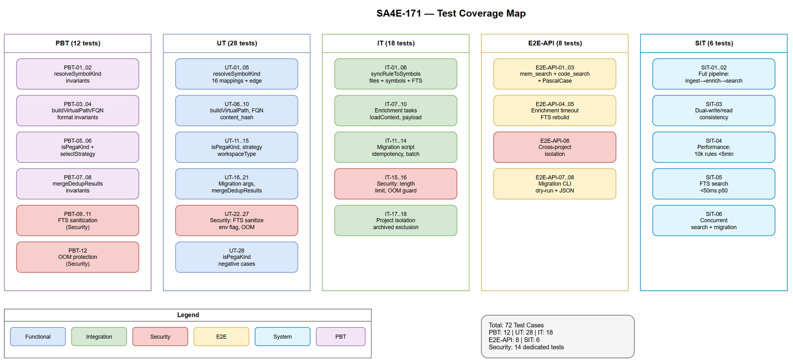
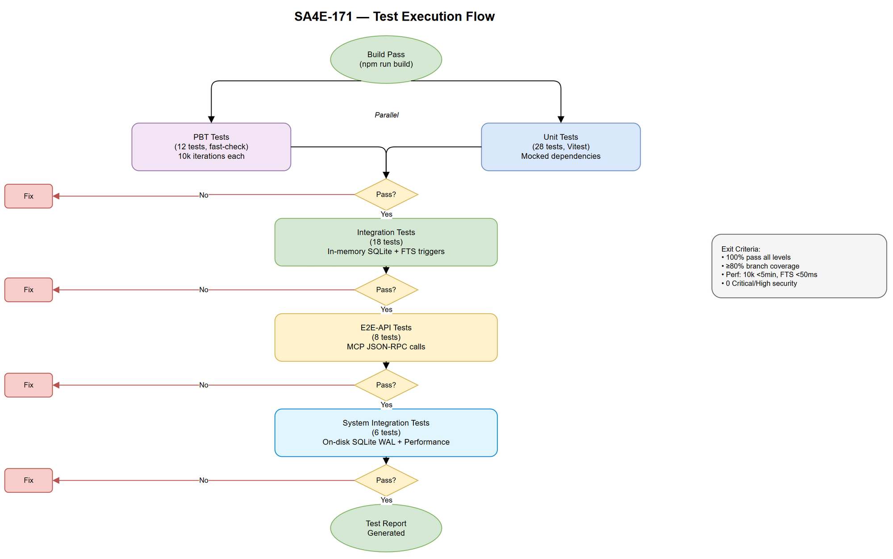

# System Test Plan (STP)

## Code Intelligence Platform — SA4E-171: Migrate Pega Rules from knowledge_entries to symbols table

---

## Document Information

| Field | Value |
|-------|-------|
| Jira Ticket | SA4E-171 |
| Title | Migrate Pega Rules from knowledge_entries to symbols table |
| Author | QA Agent |
| Version | 1.0 |
| Date | 2025-07-27 |
| Status | Draft |
| Related BRD | BRD-v1-SA4E-171.docx |
| Related FSD | FSD-v1-SA4E-171.docx |
| Related TDD | TDD-v1-SA4E-171.docx |

---

## Revision History

| Version | Date | Author | Changes |
|---------|------|--------|---------|
| 1.0 | 2025-07-27 | QA Agent | Initial STP — test strategy, 6 levels, RTM, diagrams |

---

## 1. Introduction

### 1.1 Purpose

This System Test Plan defines the testing strategy, scope, approach, and resource requirements for validating the migration of Pega rules from `knowledge_entries` to the `symbols` table (SA4E-171). It covers all 7 implementation phases from the TDD.

### 1.2 Scope

**In Scope:**
- pega-mapping.ts — 16 mappings + unknown + wildcard
- CodeEnrichmentHandler — isPegaKind() check, PEGA_SUMMARY strategy
- CodeEnrichmentTaskCreator — workspaceType='pega' for pega_* kinds
- PegaKbSync.syncRuleToSymbols() — virtual file + symbol + body_embeddings + task
- MemoryEngine dual-read — symbols_fts query + merge + dedup (FQN-based)
- Migration script — batch processing, idempotency, performance (<5 min for 10k)
- FTS indexing — triggers auto-index, FTS MATCH queries
- Security findings: FTS sanitization (Finding #1), query length limit (Finding #2)

**Out of Scope:**
- Pega rule fetching/crawling mechanism (PegaBfsIndexer, PegaCrawlHelper)
- Pega HTTP client (PegaHttpClient)
- Extension-side indexing UI
- Graph projection logic

### 1.3 Test Framework

| Tool | Purpose |
|------|---------|
| Vitest | Unit testing, integration testing, E2E API testing |
| fast-check | Property-Based Testing (PBT) |
| better-sqlite3 (in-memory) | Integration test database |

### 1.4 References

| Document | Location |
|----------|----------|
| BRD | documents/SA4E-171/BRD.md |
| FSD | documents/SA4E-171/FSD.md |
| TDD | documents/SA4E-171/TDD.md |
| Security Review | documents/SA4E-171/SECURITY-REVIEW.md |

---

## 2. Test Strategy

### 2.1 Test Levels Overview

| Level | Abbreviation | Purpose | Framework | Test Count |
|-------|--------------|---------|-----------|------------|
| Property-Based Testing | PBT | Verify invariants across random inputs | fast-check + Vitest | 12 |
| Unit Testing | UT | Validate individual functions in isolation | Vitest | 28 |
| Integration Testing | IT | Validate module interactions with real DB | Vitest + SQLite in-memory | 18 |
| End-to-End API Testing | E2E-API | Validate full MCP tool flows | Vitest + HTTP/MCP client | 8 |
| End-to-End UI Testing | E2E-UI | N/A (no UI changes in this ticket) | — | 0 |
| System Integration Testing | SIT | Validate full pipeline: ingest → enrich → search | Vitest + real DB | 6 |
| **Total** | | | | **72** |

### 2.2 Test Approach by Level

#### PBT (Property-Based Testing) — 12 Tests

**Strategy:** Use `fast-check` to generate random inputs and verify invariants hold for all generated values (minimum 10,000 iterations per property).

**Key invariants:**
- `resolveSymbolKind()` always returns a non-empty string starting with 'pega_'
- `buildVirtualPath()` always produces valid pega:// URI format
- `buildFqn()` is deterministic (same input → same output)
- `isPegaKind()` returns true IFF string starts with 'pega_'
- FTS sanitization never produces empty string (falls back to '*')
- Dedup merge always produces ≤ sum of inputs

#### UT (Unit Testing) — 28 Tests

**Strategy:** Test each function in isolation with mocked dependencies. Cover positive, negative, and boundary cases.

**Focus areas:**
- `resolveSymbolKind()` — all 16 mappings + unknown + connector wildcard
- `isPegaKind()` — pega_ prefix vs other prefixes
- `buildVirtualPath()` — correct format construction
- `buildFqn()` — correct FQN construction
- `CodeEnrichmentHandler.selectStrategy()` — PEGA_SUMMARY for pega_* kinds
- `CodeEnrichmentTaskCreator` — workspaceType determination
- `MemoryEngine.mergeDedupResults()` — dedup logic
- FTS query sanitization — special characters, length limits
- Feature flag parsing — boolean env var parsing
- OOM size guard — 5MB limit

#### IT (Integration Testing) — 18 Tests

**Strategy:** Use in-memory SQLite database with full schema (FTS triggers included). Test module interactions with real SQL operations.

**Focus areas:**
- PegaKbSync.syncRuleToSymbols() — files + symbols + body_embeddings creation
- FTS trigger activation — symbols_fts populated after INSERT
- Migration script batch processing — UPSERT, dedup, transactions
- Dual-read search — results from both sources, correct merge
- Enrichment task creation — pending_tasks row with correct payload
- Security: project_id isolation in queries

#### E2E-API (End-to-End API Testing) — 8 Tests

**Strategy:** Test MCP tools (`mem_search`, `code_search`) via JSON-RPC calls against running server instance.

**Focus areas:**
- `mem_search` returns Pega results from symbols_fts
- `code_search` includes pega_* kinds
- Migration CLI exit codes and output format
- FTS MATCH with PascalCase Pega names
- FTS rebuild includes Pega symbols
- Cross-project isolation

#### E2E-UI — 0 Tests

No UI changes in SA4E-171.

#### SIT (System Integration Testing) — 6 Tests

**Strategy:** Full end-to-end pipeline validation with real on-disk SQLite database (WAL mode).

**Focus areas:**
- Full ingest → symbol → FTS → search flow
- Migration → enrichment tasks → enrichment → search
- Dual-write + dual-read consistency
- Performance: 10k rules migration in <5 min
- Performance: FTS search <50ms p50
- Concurrent search during migration

### 2.3 Security Test Coverage

| Finding # | Title | Severity | Test Cases | Level |
|-----------|-------|----------|------------|-------|
| #1 | FTS sanitization allows injection chars | Medium | PBT-09, PBT-10, UT-22, UT-23 | PBT, UT |
| #2 | No query length limit | Medium | PBT-11, UT-24, IT-15 | PBT, UT, IT |
| #3 | Boolean env parsing inconsistency | Low | UT-25, UT-26 | UT |
| #4 | OOM protection (5MB) missing in live path | Low | PBT-12, UT-27, IT-16 | PBT, UT, IT |
| SEC-04 | Project isolation (project_id scoping) | High | IT-17, IT-18, E2E-API-06 | IT, E2E-API |

---

## 3. Test Coverage Diagram



---

## 4. Test Execution Flow



---

## 5. Requirements Traceability Matrix (RTM)

### 5.1 Business Rules → Test Cases

| BR ID | Business Rule Description | Test Cases | Level |
|-------|---------------------------|------------|-------|
| BR-01 | pxObjClass to symbol kind mapping (16 mappings) | PBT-01, PBT-02, UT-01, UT-02, UT-03, UT-04, UT-05 | PBT, UT |
| BR-02 | Virtual file path format: pega://{className}/{ruleType}/{ruleName} | PBT-03, UT-06, UT-07 | PBT, UT |
| BR-03 | Symbol name = pyRuleName; signature = FQN | PBT-04, UT-08, UT-09 | PBT, UT |
| BR-04 | parent_symbol = pyClassName | IT-01, IT-02 | IT |
| BR-05 | Virtual file language='pega'; module=pyClassName | IT-01, IT-03 | IT |
| BR-06 | content_hash = SHA-256 of rule JSON | UT-10, IT-04 | UT, IT |
| BR-07 | Skip enrichment for COMPLETED symbols | UT-14, IT-07 | UT, IT |
| BR-08 | All pega_* kinds are ENRICHABLE | PBT-05, UT-11 | PBT, UT |
| BR-09 | selectStrategy() returns PEGA_SUMMARY for pega_* | PBT-06, UT-12, UT-13 | PBT, UT |
| BR-10 | loadContext() populates bodyText from rule JSON | IT-08 | IT |
| BR-11 | TAG_ENRICHMENT tasks NOT created for Pega rules | IT-09 | IT |
| BR-12 | workspaceType='pega' for Pega enrichment tasks | UT-15, IT-10 | UT, IT |
| BR-13 | LLM timeout = 30s per enrichment task | E2E-API-04 | E2E-API |
| BR-14 | Idempotent migration (checksum-based dedup) | IT-11, IT-12, SIT-03 | IT, SIT |
| BR-15 | Batch size default=100, configurable | UT-16, IT-13 | UT, IT |
| BR-16 | Performance: <5 min for 10,000 rules | SIT-04 | SIT |
| BR-17 | Progress logging every batch | IT-14 | IT |
| BR-18 | Dedup key: signature (FQN) + project_id | UT-17, IT-11 | UT, IT |
| BR-19 | Create enrichment tasks for unenriched after migration | IT-12 | IT |
| BR-20 | Legacy entries archived manually only | IT-15 | IT |
| BR-21 | Dual-read: search both knowledge_fts AND symbols_fts | PBT-07, IT-16, E2E-API-01 | PBT, IT, E2E-API |
| BR-22 | Dedup by FQN: prefer symbols result | PBT-08, UT-18, IT-17 | PBT, UT, IT |
| BR-23 | After verification: archived entries excluded | IT-18 | IT |
| BR-24 | Search performance ≤50ms | SIT-05 | SIT |
| BR-25 | code_search returns Pega symbols (no change needed) | E2E-API-02 | E2E-API |
| BR-26 | FTS triggers handle Pega kinds without modification | IT-05 | IT |
| BR-27 | FTS content includes: name, signature, doc_comment, kind | IT-05, IT-06 | IT |
| BR-28 | Porter stemmer handles PascalCase | E2E-API-03 | E2E-API |
| BR-29 | FTS performance: <50ms for 10k+ symbols | SIT-05 | SIT |
| BR-30 | FTS rebuild includes all Pega symbols | E2E-API-05 | E2E-API |

### 5.2 Use Cases → Test Cases

| UC ID | Use Case Name | Test Cases | Level |
|-------|---------------|------------|-------|
| UC-01 | Store Pega Rule as Symbol | PBT-01..04, UT-01..10, IT-01..06 | PBT, UT, IT |
| UC-02 | Enrich Pega Symbol via CODE_ENRICHMENT | PBT-05..06, UT-11..15, IT-07..10 | PBT, UT, IT |
| UC-03 | Migrate Existing Pega Rules to Symbols | UT-16..17, IT-11..15, SIT-03..04 | UT, IT, SIT |
| UC-04 | Search Pega Rules (Dual-Read) | PBT-07..08, UT-18..21, IT-16..18, E2E-API-01..03 | PBT, UT, IT, E2E-API |
| UC-05 | FTS Auto-Index Pega Symbol | IT-05..06, E2E-API-02..03, E2E-API-05 | IT, E2E-API |

### 5.3 Security Findings → Test Cases

| Finding | Title | Test Cases | Level |
|---------|-------|------------|-------|
| SEC-F1 | FTS sanitization | PBT-09, PBT-10, UT-22, UT-23 | PBT, UT |
| SEC-F2 | Query length limit | PBT-11, UT-24, IT-15 | PBT, UT, IT |
| SEC-F3 | Boolean env parsing | UT-25, UT-26 | UT |
| SEC-F4 | OOM protection (5MB) | PBT-12, UT-27, IT-16 | PBT, UT, IT |
| SEC-04 | Project isolation | IT-17, IT-18, E2E-API-06 | IT, E2E-API |

---

## 6. Test Environment

### 6.1 Hardware/Software Requirements

| Component | Specification |
|-----------|---------------|
| OS | Windows 11 / Linux (CI) |
| Node.js | 20.x LTS |
| Database (UT/IT) | SQLite in-memory (`:memory:`) |
| Database (SIT) | SQLite on-disk (WAL mode) |
| RAM | ≥ 4GB for performance tests (10k rules) |

### 6.2 Test Data Strategy

| Data Set | Format | Rows | Purpose |
|----------|--------|------|---------|
| pega-mapping-inputs.csv | CSV | 20 | All pxObjClass values + edge cases |
| pega-rules-small.csv | CSV | 50 | Functional test data (all rule types) |
| pega-rules-migration.csv | CSV | 100 | Migration batch/idempotency testing |
| pega-search-queries.csv | CSV | 30 | FTS query + expected results |
| pega-security-inputs.csv | CSV | 25 | Security-focused test inputs (injection, overflow) |

### 6.3 Test Data Location

```
documents/SA4E-171/test-data/
├── pega-mapping-inputs.csv
├── pega-rules-small.csv
├── pega-rules-migration.csv
├── pega-search-queries.csv
└── pega-security-inputs.csv
```

---

## 7. Entry / Exit Criteria

### 7.1 Entry Criteria

| # | Criterion |
|---|-----------|
| 1 | TDD.md exists and is approved |
| 2 | Source code for all 7 phases implemented |
| 3 | Build passes (`npm run build`) |
| 4 | Test database schema matches TDD section 4 |
| 5 | Test data CSVs populated |

### 7.2 Exit Criteria

| # | Criterion | Threshold |
|---|-----------|-----------|
| 1 | All PBT tests pass (≥10,000 iterations each) | 100% |
| 2 | All UT tests pass | 100% |
| 3 | All IT tests pass | 100% |
| 4 | All E2E-API tests pass | 100% |
| 5 | All SIT tests pass | 100% |
| 6 | Code coverage (branches) for modified files | ≥ 80% |
| 7 | Performance: migration 10k rules | < 5 min |
| 8 | Performance: FTS search | < 50ms p50, < 100ms p99 |
| 9 | No Critical/High security findings open | 0 |
| 10 | RTM coverage | 100% (all BRs have ≥1 test) |

---

## 8. Risk Assessment

| Risk | Impact | Likelihood | Mitigation |
|------|--------|------------|------------|
| FTS5 behavior differs between SQLite versions | Medium | Low | Pin SQLite version in tests |
| Performance tests flaky on CI | Medium | Medium | Warmup + multiple iterations + tolerance margin |
| LLM mock doesn't match real behavior | Low | Low | Use response fixtures from real calls |
| PostgreSQL tests need PG instance | Medium | Medium | Docker PG in CI, skip in local |
| Large test data generation slow | Low | Low | Pre-generate CSV, cache in repo |

---

## 9. Appendix

### 9.1 Test Case Summary by Level

| Level | Count | Test Files |
|-------|-------|------------|
| PBT | 12 | `pega-mapping.pbt.test.ts`, `search-dedup.pbt.test.ts`, `security.pbt.test.ts` |
| UT | 28 | `pega-mapping.test.ts`, `enrichment-handler.test.ts`, `enrichment-creator.test.ts`, `memory-engine.test.ts`, `security.test.ts` |
| IT | 18 | `pega-kb-sync.it.test.ts`, `migration-script.it.test.ts`, `dual-read.it.test.ts` |
| E2E-API | 8 | `pega-search.e2e.test.ts`, `migration-cli.e2e.test.ts` |
| E2E-UI | 0 | — |
| SIT | 6 | `pega-pipeline.sit.test.ts` |

### 9.2 Diagram Index

| # | Diagram | Image | Source (editable) |
|---|---------|-------|-------------------|
| 1 | Test Coverage | [test-coverage.png](diagrams/test-coverage.png) | [test-coverage.drawio](diagrams/test-coverage.drawio) |
| 2 | Test Execution Flow | [test-execution-flow.png](diagrams/test-execution-flow.png) | [test-execution-flow.drawio](diagrams/test-execution-flow.drawio) |
