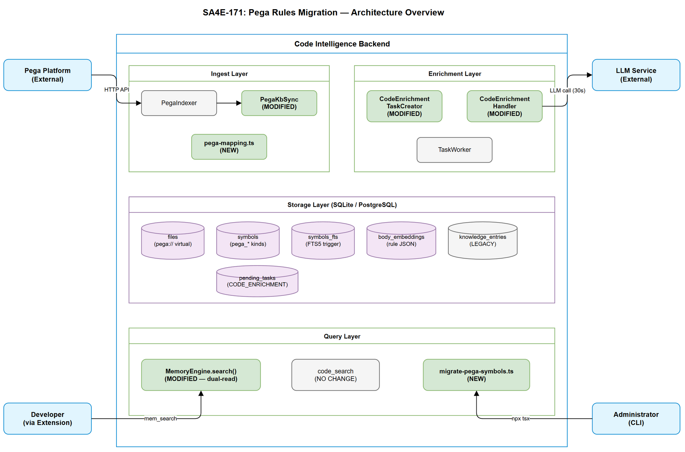
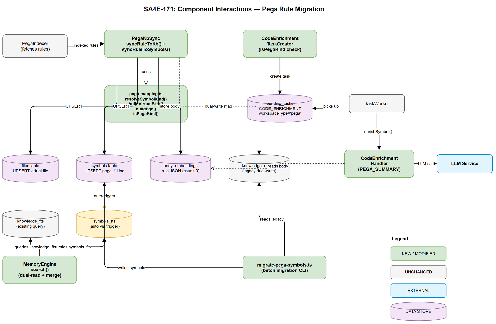

# Technical Design Document (TDD)

## Code Intelligence Platform — SA4E-171: Migrate Pega Rules from knowledge_entries to symbols table

---

## Document Information

| Field | Value |
|-------|-------|
| Jira Ticket | SA4E-171 |
| Title | Migrate Pega Rules from knowledge_entries to symbols table |
| Author | SA Agent |
| Version | 1.0 |
| Date | 2025-07-27 |
| Status | Draft |
| Related BRD | BRD-v1-SA4E-171.docx |
| Related FSD | FSD-v1-SA4E-171.docx |

---

## Revision History

| Version | Date | Author | Changes |
|---------|------|--------|---------|
| 1.0 | 2025-07-27 | SA Agent | Initial TDD — architecture, module design, implementation plan |

---

## 1. Introduction

### 1.1 Purpose

This TDD specifies HOW to implement the migration of Pega rules from `knowledge_entries` to `symbols` table, integrating them with the CODE_ENRICHMENT pipeline and providing unified FTS search. It translates the 5 FSD use cases (UC-01 to UC-05) into concrete implementation patterns, module changes, and database operations.

### 1.2 Scope

- Modify `PegaKbSync` to dual-write to both `knowledge_entries` (existing) and `symbols`+`files` (new)
- Extend `CodeEnrichmentHandler` and `CodeEnrichmentTaskCreator` to support all 16 Pega kinds via `startsWith('pega_')` pattern
- Extend `MemoryEngine.search()` with dual-read logic (query both `knowledge_fts` and `symbols_fts`)
- Create migration CLI script at `backend/scripts/migrate-pega-symbols.ts`
- Enforce `project_id` scoping in all new queries (SEC-04)

### 1.3 Technology Stack

| Layer | Technology | Version |
|-------|-----------|---------|
| Language | TypeScript | 5.x |
| Runtime | Node.js | 20.x LTS |
| Framework | Hono | 4.x |
| Database (local) | SQLite (better-sqlite3) | 11.x |
| Database (cloud) | PostgreSQL (pg) | 8.x |
| Validation | Zod | 3.x |
| Logging | Pino | 8.x |
| Build | tsx (dev) / tsc (build) | — |
| Test | Vitest + fast-check | — |

### 1.4 Design Principles

- **Idempotency** — All writes use UPSERT semantics; migration script re-runnable
- **Backward Compatibility** — Dual-read + dual-write during transition; no breaking changes
- **Single Source of Truth** — After migration verified, `symbols` becomes authoritative for Pega rules
- **Minimal Blast Radius** — Feature-flagged dual-write; each module change is independently testable
- **Project Isolation** — Every query includes `project_id` scope (SEC-04)

### 1.5 Constraints

- SQLite does not enforce FK constraints at runtime — `pending_tasks.entry_id` stores `symbolId` without schema change
- PostgreSQL FK on `pending_tasks.entry_id` to `knowledge_entries.id` IS enforced — must handle (see OI-01 resolution)
- `symbols_fts` is FTS5 external-content table — insertions happen via triggers, not direct writes
- LLM timeout is 30s per enrichment task — batch enrichment is rate-limited

### 1.6 References

| Document | Location |
|----------|----------|
| BRD | documents/SA4E-171/BRD.md |
| FSD | documents/SA4E-171/FSD.md |
| CodeEnrichmentHandler | backend/src/engine/enrichment/CodeEnrichmentHandler.ts |
| CodeEnrichmentTaskCreator | backend/src/engine/enrichment/CodeEnrichmentTaskCreator.ts |
| PegaKbSync | backend/src/modules/pega/PegaKbSync.ts |
| MemoryEngine | backend/src/modules/memory/engine/core.ts |
| Schema DDL | backend/src/engine/db/schema.ts |
| Graph Migrator | backend/src/engine/graph/migrator.ts |

---

## 2. System Architecture

### 2.1 Architecture Overview

The migration introduces a new data path for Pega rules: instead of flowing exclusively through `knowledge_entries` then `TAG_ENRICHMENT`, rules now flow through `symbols` then `CODE_ENRICHMENT` while maintaining backward-compatible dual-read search.



**Key architectural decisions:**

| # | Decision | Rationale |
|---|----------|-----------|
| AD-01 | Dual-write during transition (feature flag `PEGA_DUAL_WRITE`) | Safe rollback; no data loss |
| AD-02 | `startsWith('pega_')` instead of static `PEGA_KINDS` set | Future-proof; 16 kinds + new ones |
| AD-03 | Virtual files with `pega://` URI scheme | Avoids collision with real filesystem paths |
| AD-04 | Store rule body in `body_embeddings` (chunk_index=0) | Reuses existing `loadBodyText()` mechanism |
| AD-05 | Migration as standalone CLI script (not API endpoint) | Long-running; admin-only; one-time |

### 2.2 Component Diagram



| Component | Responsibility | Technology |
|-----------|---------------|------------|
| PegaKbSync | Sync indexed rules to symbols + knowledge_entries (dual-write) | TypeScript module |
| CodeEnrichmentTaskCreator | Create CODE_ENRICHMENT tasks for pega_* symbols | TypeScript class |
| CodeEnrichmentHandler | Execute enrichment via LLM (PEGA_SUMMARY strategy) | TypeScript class |
| MemoryEngine (extended) | Dual-read search across knowledge_fts + symbols_fts | TypeScript class |
| migrate-pega-symbols.ts | One-time batch migration script | CLI (tsx) |
| SQLite/PG triggers | Auto-index symbols into symbols_fts | Database triggers |

### 2.3 Data Flow — New Ingest Path

```
PegaIndexer -> PegaKbSync
  |-- files table (virtual file: pega://className/ruleType/ruleName)
  |-- symbols table (kind=pega_*, enrichment_status=NULL)
  |-- body_embeddings (rule JSON body, chunk_index=0)
  |-- [TRIGGER] symbols_fts (auto-indexed)
  |-- pending_tasks (CODE_ENRICHMENT, workspaceType='pega')
  +-- knowledge_entries (dual-write, controlled by PEGA_DUAL_WRITE flag)
```

### 2.4 Communication Patterns

| From | To | Protocol | Pattern | Description |
|------|----|----------|---------|-------------|
| PegaKbSync | SQLite/PG | SQL | Sync | UPSERT files + symbols + body_embeddings |
| CodeEnrichmentTaskCreator | pending_tasks | SQL | Sync | INSERT task row |
| TaskWorker | CodeEnrichmentHandler | In-process | Sync | Handler.enrichSymbol(task) |
| CodeEnrichmentHandler | LLM Service | HTTP/JSON | Async (timeout 30s) | Generate summary + pseudo_code |
| MemoryEngine.search() | symbols_fts + knowledge_fts | SQL/FTS5 | Sync | Dual-read + merge |

---

## 3. API Design

### 3.1 API Overview

No new HTTP endpoints are introduced. The migration affects internal behavior of existing tools:

| # | Tool/Endpoint | Change | Source |
|---|---------------|--------|--------|
| 1 | `mem_search` MCP tool | Dual-read: also queries symbols_fts for pega_* | UC-04 |
| 2 | `code_search` MCP tool | No change needed — already queries symbols_fts | UC-05, BR-25 |
| 3 | Migration CLI | New standalone script | UC-03 |

### 3.2 Search API — Enhanced Behavior (mem_search)

**Implements:** UC-04, BR-21, BR-22, BR-24

The existing `MemoryEngine.search()` method is extended with a secondary query path:

**Current behavior:** Query `knowledge_fts` only

**New behavior (SA4E-171):**
1. Query `knowledge_fts` (existing path, unchanged)
2. Query `symbols_fts WHERE kind LIKE 'pega_%' AND project_id = ?` (new path)
3. Merge results, deduplicate by FQN (prefer symbols result)
4. Return unified sorted results

**Response enhancement (backward-compatible additions):**

| New Field | Type | Description |
|-----------|------|-------------|
| `kind` | string or null | Symbol kind (pega_activity, etc.) — present when from symbols |
| `matchSource` | string | `"symbols_fts"` or `"knowledge_fts"` |
| `enrichmentStatus` | string or null | `"COMPLETED"`, `"FAILED"`, or null |

### 3.3 Migration CLI Interface

**Implements:** UC-03, BR-14, BR-15, BR-16, BR-17

```
npx tsx backend/scripts/migrate-pega-symbols.ts [options]

Options:
  --batch-size <N>     Batch size per transaction (default: 100, range: 1-1000)
  --project-id <ID>    Scope to specific project (default: all)
  --dry-run            Read-only mode
  --verbose            Per-rule logging
```

**Exit codes:** 0 (success), 1 (partial failure), 2 (fatal error)

---

## 4. Database Design

### 4.1 Schema Overview

No new tables created. Existing tables are reused with Pega-specific data:

| Table | Role in SA4E-171 | Existing? |
|-------|------------------|-----------|
| `files` | Virtual file entries (pega:// URIs) | Yes |
| `symbols` | Pega rule symbols (kind=pega_*) | Yes |
| `symbols_fts` | Auto-indexed via triggers | Yes |
| `body_embeddings` | Rule JSON body storage | Yes |
| `pending_tasks` | CODE_ENRICHMENT task queue | Yes |
| `knowledge_entries` | Legacy path (dual-write) | Yes |

### 4.2 Virtual File Entry (files table)

```sql
-- UPSERT pattern for virtual Pega files (BR-02, BR-05)
INSERT INTO files (project_id, path, relative_path, language, module, content_hash, size_bytes, line_count)
VALUES ($projectId, $virtualPath, $virtualPath, 'pega', $pyClassName, $contentHash, $sizeBytes, 1)
ON CONFLICT(project_id, path) DO UPDATE SET
  content_hash = excluded.content_hash,
  size_bytes = excluded.size_bytes,
  last_indexed = datetime('now')
RETURNING id;
```

**Virtual path format (BR-02):** `pega://{pyClassName}/{ruleType}/{pyRuleName}`
- `ruleType` = symbol kind without `pega_` prefix (e.g., `activity`, `flow`)

### 4.3 Pega Symbol Entry (symbols table)

```sql
-- UPSERT pattern for Pega symbols (BR-01, BR-03, BR-04)
-- Uses file_id as dedup anchor (1:1 relationship with virtual file)
INSERT INTO symbols (project_id, file_id, name, kind, signature, start_line, end_line,
                     parent_symbol, visibility, doc_comment)
VALUES ($projectId, $fileId, $pyRuleName, $kind, $fqn, 1, 1, $pyClassName, 'public', $docComment)
ON CONFLICT DO UPDATE SET
  signature = excluded.signature,
  parent_symbol = excluded.parent_symbol,
  doc_comment = excluded.doc_comment,
  enrichment_status = CASE WHEN symbols.enrichment_status = 'COMPLETED'
                           THEN symbols.enrichment_status ELSE NULL END;
```

**Note:** Since `symbols` has no composite UNIQUE constraint on `(file_id, name, kind)` in base DDL, the dedup relies on the virtual file's 1:1 relationship. Each virtual file maps to exactly one Pega rule. The UPSERT on `files` (UNIQUE on `project_id, path`) ensures no duplicates.

**Implementation approach:** Use `DELETE + INSERT` within transaction if ON CONFLICT is not available for the needed columns. The file's UNIQUE constraint handles dedup at the file level.

### 4.4 Body Storage (body_embeddings table)

```sql
-- Store rule JSON body for loadBodyText() in CodeEnrichmentHandler (OI-04 resolution)
INSERT INTO body_embeddings (project_id, symbol_id, chunk_index, embedding, token_count)
VALUES ($projectId, $symbolId, 0, $ruleJsonBuffer, $tokenCount)
ON CONFLICT(project_id, symbol_id, chunk_index) DO UPDATE SET
  embedding = excluded.embedding,
  token_count = excluded.token_count;
```

### 4.5 Enrichment Task Entry (pending_tasks table)

```sql
INSERT INTO pending_tasks (task_type, entry_id, status, payload, max_retries, created_at)
VALUES ('CODE_ENRICHMENT', $symbolId, 'PENDING', $payloadJson, 3, datetime('now'));
```

**Payload structure (Zod-validated by `CodeEnrichmentPayloadSchema`):**
```json
{
  "symbolId": 123,
  "symbolName": "ApproveLeave",
  "symbolKind": "pega_activity",
  "projectId": "proj_abc",
  "filePath": "pega://Work-HR/activity/ApproveLeave",
  "workspaceType": "pega"
}
```

### 4.6 Query Patterns

| Operation | Query Pattern | Expected Performance |
|-----------|--------------|---------------------|
| Symbol dedup check | `SELECT id FROM symbols WHERE signature = ? AND project_id = ?` | < 1ms (indexed) |
| FTS search (symbols) | `SELECT ... FROM symbols_fts MATCH ? JOIN symbols ON ... AND project_id = ?` | < 30ms |
| FTS search (knowledge) | `SELECT ... FROM knowledge_fts MATCH ? JOIN knowledge_entries ON ... AND project_id = ?` | < 30ms |
| Dual-read merge | Combined FTS + application-level dedup | < 50ms total |
| Migration batch | 100 UPSERTs within transaction | < 3s per batch |

### 4.7 PostgreSQL-Specific Handling (OI-01 Resolution)

**Decision: Option B** — Continue using `entry_id` field to store `symbolId`. FK is not enforced in SQLite. For PostgreSQL:

```sql
-- Add to pg-schema-ensure.ts: relax FK on pending_tasks
ALTER TABLE pending_tasks DROP CONSTRAINT IF EXISTS pending_tasks_entry_id_fkey;
```

This aligns with current behavior (confirmed: `CodeEnrichmentTaskCreator.insertTask()` already stores `symbolId` in `entry_id`).

### 4.8 Indexes (existing, no changes needed)

| Index | Table | Columns | Purpose |
|-------|-------|---------|---------|
| `idx_symbols_kind` | symbols | kind | Filter by pega_* kinds |
| `idx_symbols_enrichment_status` | symbols | enrichment_status | Find unenriched symbols |
| `idx_symbols_project_enrichment` | symbols | project_id, enrichment_status | Scoped enrichment queries |
| `idx_files_path` | files | relative_path | Virtual file lookup |
| UNIQUE | files | project_id, path | UPSERT dedup |

---

## 5. Class / Module Design

### 5.1 Package Structure (Changes Only)

```
backend/src/
├── modules/pega/
│   ├── PegaKbSync.ts              # MODIFIED — add symbols+files write path
│   ├── models.ts                  # EXISTING — PegaSymbol types
│   └── pega-mapping.ts            # NEW — pxObjClass->kind mapping table
├── engine/enrichment/
│   ├── CodeEnrichmentHandler.ts   # MODIFIED — startsWith('pega_') check
│   ├── CodeEnrichmentTaskCreator.ts # MODIFIED — startsWith('pega_') + workspaceType
│   └── types.ts                   # EXISTING — no change
├── modules/memory/engine/
│   └── core.ts                    # MODIFIED — add dual-read search for Pega
└── scripts/                       # (backend/scripts/)
    └── migrate-pega-symbols.ts    # NEW — migration CLI script
```

### 5.2 New Module: pega-mapping.ts

**Location:** `backend/src/modules/pega/pega-mapping.ts`

```typescript
/**
 * SA4E-171: Pega pxObjClass -> symbol kind mapping.
 * Central mapping table used by PegaKbSync and migration script.
 */

/** Map of pxObjClass values to symbol kind values (BR-01). */
export const PEGA_OBJ_CLASS_TO_KIND: ReadonlyMap<string, string> = new Map([
  ['Rule-Obj-Activity', 'pega_activity'],
  ['Rule-Obj-Flow', 'pega_flow'],
  ['Rule-Obj-DataTransform', 'pega_data_transform'],
  ['Rule-Obj-DecisionTable', 'pega_decision_table'],
  ['Rule-Obj-DecisionTree', 'pega_decision_tree'],
  ['Rule-Obj-Section', 'pega_section'],
  ['Rule-Obj-Harness', 'pega_harness'],
  ['Rule-Obj-Report-Definition', 'pega_report'],
  ['Rule-Obj-MapValue', 'pega_map_value'],
  ['Rule-Obj-When', 'pega_when'],
  ['Rule-Declare-Expressions', 'pega_declare_expression'],
  ['Rule-Declare-Pages', 'pega_declare_page'],
  ['Rule-Obj-Validate', 'pega_validate'],
  ['Rule-Obj-ListVw', 'pega_list_view'],
  ['Rule-Obj-Property', 'pega_property'],
]);

const CONNECTOR_PREFIX = 'Rule-Connect-';

/**
 * Resolve pxObjClass to symbol kind.
 * @returns Mapped kind, or 'pega_unknown' for unrecognized classes (AF-01).
 */
export function resolveSymbolKind(pxObjClass: string): string {
  const exact = PEGA_OBJ_CLASS_TO_KIND.get(pxObjClass);
  if (exact) return exact;
  if (pxObjClass.startsWith(CONNECTOR_PREFIX)) return 'pega_connector';
  return 'pega_unknown';
}

/** Check if a kind is a Pega symbol kind (RD-01). */
export function isPegaKind(kind: string): boolean {
  return kind.startsWith('pega_');
}

/**
 * Build virtual file path from rule metadata (BR-02).
 * Format: pega://{pyClassName}/{ruleType}/{pyRuleName}
 */
export function buildVirtualPath(pyClassName: string, kind: string, pyRuleName: string): string {
  const ruleType = kind.replace('pega_', '');
  return `pega://${pyClassName}/${ruleType}/${pyRuleName}`;
}

/**
 * Build FQN signature string (BR-03).
 * Format: {pxObjClass}:{pyClassName}:{pyRuleName}
 */
export function buildFqn(pxObjClass: string, pyClassName: string, pyRuleName: string): string {
  return `${pxObjClass}:${pyClassName}:${pyRuleName}`;
}
```

### 5.3 Modified: CodeEnrichmentHandler.ts

**Change:** Replace static `PEGA_KINDS` set with `isPegaKind()` check.

```typescript
// BEFORE (current code — line 30):
const PEGA_KINDS = new Set(['pega_activity', 'pega_data_transform', 'pega_flow']);

// AFTER (SA4E-171):
import { isPegaKind } from '../../modules/pega/pega-mapping.js';
// Remove PEGA_KINDS constant entirely

// In selectStrategy():
private selectStrategy(kind: string, workspaceType: string): EnrichmentStrategy {
  if (workspaceType === 'pega' && isPegaKind(kind)) return 'PEGA_SUMMARY';
  if (FUNCTION_KINDS.has(kind)) return 'FUNCTION_SUMMARY';
  if (CLASS_KINDS.has(kind)) return 'CLASS_SUMMARY';
  return 'CLASS_SUMMARY';
}

// In storeResults() — also store pseudo_code for PEGA_SUMMARY:
if ((strategy === 'FUNCTION_SUMMARY' || strategy === 'PEGA_SUMMARY') && response.pseudo_code) {
  pseudoCode = response.pseudo_code.length > MAX_PSEUDO_CODE_LENGTH
    ? response.pseudo_code.slice(0, MAX_PSEUDO_CODE_LENGTH) + '...'
    : response.pseudo_code;
}
```

### 5.4 Modified: CodeEnrichmentTaskCreator.ts

**Changes:**
1. Replace static `ENRICHABLE_KINDS` membership check with `isPegaKind()` fallback
2. Set `workspaceType: 'pega'` dynamically for Pega symbols

```typescript
import { isPegaKind } from '../../modules/pega/pega-mapping.js';

// Remove pega entries from static set:
const ENRICHABLE_KINDS = new Set([
  'class', 'interface', 'enum',
  'function', 'method', 'arrow_function', 'generator',
]);

// In createTasks() / createTasksForProject() filter:
if (!ENRICHABLE_KINDS.has(sym.kind) && !isPegaKind(sym.kind)) continue;

// In insertTask() — dynamic workspaceType:
private async insertTask(
  symbolId: number, symbolName: string, kind: string,
  filePath: string, projectId: string,
): Promise<void> {
  const payload = JSON.stringify({
    symbolId, symbolName, symbolKind: kind,
    projectId, filePath,
    workspaceType: isPegaKind(kind) ? 'pega' : 'standard',
  });
  // ... rest unchanged
}
```

### 5.5 Modified: PegaKbSync.ts

**Changes:** Add `syncRuleToSymbols()` function alongside existing `syncRuleToKb()`.

```typescript
import { resolveSymbolKind, buildVirtualPath, buildFqn, isPegaKind } from './pega-mapping.js';
import { createHash } from 'crypto';

/** Feature flag: write to both knowledge_entries AND symbols (OI-02 resolution). */
const PEGA_DUAL_WRITE = process.env.PEGA_DUAL_WRITE !== 'false';

/**
 * SA4E-171: Sync a Pega rule into the symbols table (new path).
 * Creates: virtual file -> symbol -> body_embeddings -> CODE_ENRICHMENT task.
 * @returns symbolId and fileId, or null if validation fails.
 */
export async function syncRuleToSymbols(
  adapter: DatabaseAdapter,
  ruleJson: Record<string, unknown>,
  projectId: string,
  promptContext: string,
): Promise<{ symbolId: number; fileId: number } | null> {
  const pxObjClass = String((ruleJson as any)?.pxObjClass || '');
  const pyClassName = String((ruleJson as any)?.pyClassName || '');
  const pyRuleName = String((ruleJson as any)?.pyRuleName || '');

  if (!pxObjClass || !pyClassName || !pyRuleName) {
    logger.warn({ pxObjClass, pyClassName, pyRuleName }, 'Missing required fields');
    return null;
  }

  const kind = resolveSymbolKind(pxObjClass);
  const fqn = buildFqn(pxObjClass, pyClassName, pyRuleName);
  const virtualPath = buildVirtualPath(pyClassName, kind, pyRuleName);
  const ruleJsonStr = JSON.stringify(ruleJson);
  const contentHash = createHash('sha256').update(ruleJsonStr).digest('hex');
  const docComment = (promptContext || `${kind}: ${fqn}`).slice(0, 500);

  // Step 1: UPSERT virtual file (BR-02, BR-05, BR-06)
  // Step 2: INSERT/UPDATE symbol (BR-01, BR-03, BR-04)
  // Step 3: Store body in body_embeddings (OI-04)
  // Step 4: Create CODE_ENRICHMENT task if not COMPLETED (BR-07, BR-11)
  // ... (full implementation per Section 4.2-4.5 SQL patterns)

  return { symbolId, fileId };
}
```

**Integration point:** In existing `syncRuleToKb()`, after KB write succeeds:

```typescript
// At end of syncRuleToKb(), after successful KB insert:
if (PEGA_DUAL_WRITE) {
  try {
    await syncRuleToSymbols(adapter, ruleJson, projectId, promptCtx);
  } catch (err) {
    logger.warn({ err, fqn }, 'Failed to sync to symbols (non-fatal during transition)');
  }
}
```

### 5.6 Modified: MemoryEngine.search() — Dual-Read

**Location:** `backend/src/modules/memory/engine/core.ts`

```typescript
async search(query: string, limit = 10, tier?: string, type?: string, scopeCtx?: ScopeContext): Promise<SearchResult[]> {
  // Existing knowledge_fts query (unchanged)
  const legacyResults = await this.searchKnowledgeFts(query, limit, tier, type, scopeCtx);

  // SA4E-171: Also search symbols_fts for Pega symbols (BR-21)
  const pegaResults = await this.searchPegaSymbols(query, limit, scopeCtx);

  // Merge and deduplicate (BR-22: prefer symbols over knowledge_entries)
  return this.mergeDedupResults(legacyResults, pegaResults, limit);
}

/**
 * SA4E-171: Search symbols_fts for Pega kinds.
 * Enforces project_id scoping (SEC-04).
 */
private async searchPegaSymbols(query: string, limit: number, scopeCtx?: ScopeContext): Promise<SearchResult[]> {
  if (!scopeCtx?.projectId) return [];
  const ftsQuery = query.replace(/[^\w\s*":.]/g, ' ').trim() || '*';

  const engine = this.adapter.getEngine();
  if (engine === 'sqlite') {
    const sql = `SELECT s.id, s.name, s.kind, s.signature, s.doc_comment,
                        s.summary, s.enrichment_status, f.rank AS score
                 FROM symbols_fts f
                 JOIN symbols s ON f.rowid = s.id
                 WHERE symbols_fts MATCH ?
                   AND s.kind LIKE 'pega_%'
                   AND s.project_id = ?
                 ORDER BY f.rank LIMIT ?`;
    try {
      const rows = await this.adapter.allAsync(sql, [ftsQuery, scopeCtx.projectId, limit]);
      return rows.map(r => this.mapSymbolToSearchResult(r));
    } catch { return []; }
  }
  return [];
}

/**
 * Merge legacy + symbol results, deduplicate by FQN (BR-22).
 * Prefer symbols result when FQN matches.
 */
private mergeDedupResults(legacy: SearchResult[], symbols: SearchResult[], limit: number): SearchResult[] {
  const seenFqns = new Set<string>();
  const merged: SearchResult[] = [];

  // Symbols first (preferred)
  for (const sr of symbols) {
    const fqn = sr.source || sr.signature || '';
    if (fqn) seenFqns.add(fqn);
    merged.push(sr);
  }

  // Legacy results — skip if FQN already seen
  for (const lr of legacy) {
    const fqn = lr.source || '';
    if (fqn && seenFqns.has(fqn)) continue;
    merged.push(lr);
  }

  return merged.sort((a, b) => (b.score ?? 0) - (a.score ?? 0)).slice(0, limit);
}
```

### 5.7 New: migrate-pega-symbols.ts

**Location:** `backend/scripts/migrate-pega-symbols.ts`

Key design decisions:
- Uses `parseArgs()` from `node:util` for CLI argument parsing
- Connects to database via existing `DatabaseAdapter` factory
- Processes in configurable batches within transactions
- Idempotent via signature+project_id dedup check (BR-14)
- Reports JSON summary on completion

See FSD Appendix B.1 for full pseudocode. Implementation follows that logic exactly.

### 5.8 Design Patterns Used

| Pattern | Where Used | Rationale |
|---------|-----------|-----------|
| Strategy | CodeEnrichmentHandler.selectStrategy() | Select enrichment approach per kind |
| UPSERT/Idempotent Write | PegaKbSync, migration script | Re-runnable without duplicates |
| Feature Flag | PEGA_DUAL_WRITE env var | Safe rollback during transition |
| Dual-Read + Merge | MemoryEngine.search() | Backward compatibility during migration |
| Batch Processing | Migration script | Transaction safety + progress reporting |
| Factory Function | resolveSymbolKind() | Centralized mapping, single source of truth |

---

## 6. Integration Design

### 6.1 External System: LLM Service (CODE_ENRICHMENT)

| Attribute | Value |
|-----------|-------|
| Protocol | HTTP/JSON (via LLMService abstraction) |
| Timeout | 30,000ms (LLM_TIMEOUT_MS constant) |
| Retry Policy | max_retries=3 (stored in pending_tasks) |
| Circuit Breaker | None (TaskWorker sequential processing) |
| Rate Limit | 1 task at a time (sequential worker) |

**Data flow for Pega enrichment:**
1. TaskWorker picks up CODE_ENRICHMENT task from `pending_tasks`
2. CodeEnrichmentHandler.enrichSymbol() is called
3. `loadContext()` reads symbol metadata + `body_embeddings` (rule JSON)
4. `selectStrategy()` returns `PEGA_SUMMARY` (via `isPegaKind()`)
5. PromptBuilder builds LLM messages with Pega-specific prompt
6. LLM returns summary + pseudo_code + tags
7. Results stored in `symbols` table columns

### 6.2 Internal Integration: MemoryEngine (Dual-Read)

| Attribute | Value |
|-----------|-------|
| Purpose | Backward-compatible search during transition |
| Pattern | Sequential queries + merge + dedup |
| Performance budget | 15ms additional latency max (BR-24) |
| Dedup strategy | FQN-based (signature in symbols = source in knowledge_entries) |

---

## 7. Security Design

### 7.1 Project Isolation (SEC-04 — HIGH)

**Critical:** All new queries MUST include `project_id` scope to prevent cross-tenant data leakage.

| Query Location | Scope Enforcement |
|----------------|-------------------|
| `symbols_fts` search (dual-read) | `AND s.project_id = ?` — parameterized |
| `knowledge_fts` search (existing) | Existing `buildScopeClause()` applies |
| Migration script reads | `WHERE project_id = ?` if --project-id flag |
| Migration script writes | Carries `project_id` from source row |
| Virtual file UPSERT | `project_id` in UNIQUE constraint |
| Symbol UPSERT | `project_id` stored in symbol row |

### 7.2 Input Validation

| Input | Validation | Sanitization |
|-------|-----------|--------------|
| FTS query (search) | `query.replace(/[^\w\s*":.]/g, ' ')` | Strip special chars for FTS safety |
| --batch-size CLI arg | `1 <= N <= 1000` (parseInt, clamp) | Reject non-numeric |
| --project-id CLI arg | Non-empty string, parameterized query | No SQL injection risk |
| Rule JSON content | `JSON.parse()` in try/catch | Skip on parse failure |
| pxObjClass value | Matched against mapping table | Falls back to `pega_unknown` |

### 7.3 Data Protection

| Data Type | At Rest | In Transit | In Logs |
|-----------|---------|------------|---------|
| Rule JSON body | Plain (SQLite/PG) | N/A (local) | Truncated (first 200 chars) |
| LLM summary | Plain (symbols.summary) | TLS to LLM API | Full (not sensitive) |
| project_id | Plain | N/A (local) | Full (identifier only) |
| FQN/signatures | Plain | N/A (local) | Full (not sensitive) |

### 7.4 Migration Script Security

- CLI-only execution (no HTTP endpoint exposed)
- Requires direct database access (admin credentials via env)
- No secrets embedded in script — reads from environment/config
- Progress output does not include rule content (only counts + FQN on error)
- Large rule JSON (> 5MB) skipped with warning (SEC-06)

---

## 8. Performance and Scalability

### 8.1 Migration Performance (BR-16)

**Target:** 10,000 rules in < 5 minutes (>= 33 rules/sec)

**Strategy:**
- Batch size: 100 (default) — one transaction per batch
- SQLite WAL mode handles concurrent reads during migration
- No FTS index rebuilding needed (triggers handle it automatically)
- Estimated: ~3s per batch of 100 = ~5 min for 10,000 rules

**Memory management:**
- Peak RAM <= 512MB (batch processing, not loading all rules)
- Rule JSON parsed per-row (not accumulated in memory)

### 8.2 Search Performance (BR-24, BR-29)

**Target:** < 50ms for typical FTS queries (dual-read)

| Component | Budget |
|-----------|--------|
| knowledge_fts query | <= 25ms |
| symbols_fts query (new) | <= 15ms |
| Merge + dedup (application) | <= 5ms |
| Network/serialization | <= 5ms |
| **Total** | **<= 50ms** |

**Optimization:** Both FTS queries can be parallelized with `Promise.all()` since they hit independent tables.

### 8.3 Enrichment Throughput

- Sequential processing: 1 symbol per 30s max (LLM timeout)
- >= 2 symbols/minute under normal LLM latency (~10-15s per call)
- Batch of 10,000 unenriched symbols: ~83 hours if all need LLM
- Mitigation: Cross-scope dedup skips already-enriched content hashes

---

## 9. Monitoring and Observability

### 9.1 Logging

| Log Event | Level | Fields | Source |
|-----------|-------|--------|--------|
| Rule synced to symbols | DEBUG | `{ fqn, symbolId, fileId, kind }` | PegaKbSync |
| Migration batch complete | INFO | `{ offset, batchSize, migrated, skipped, errors }` | migrate-pega-symbols |
| Migration summary | INFO | Full MigrationSummary JSON | migrate-pega-symbols |
| Enrichment task created (Pega) | DEBUG | `{ symbolId, kind, workspaceType }` | CodeEnrichmentTaskCreator |
| PEGA_SUMMARY strategy selected | DEBUG | `{ symbolId, kind }` | CodeEnrichmentHandler |
| Dual-read merge | DEBUG | `{ legacyCount, symbolsCount, deduplicated }` | MemoryEngine |
| Rule parse error (migration) | WARN | `{ rowId, reason }` | migrate-pega-symbols |
| Batch transaction failure | ERROR | `{ offset, error }` | migrate-pega-symbols |

### 9.2 Health Checks

| Check | Method | Expected |
|-------|--------|----------|
| symbols_fts accessible | `SELECT COUNT(*) FROM symbols_fts LIMIT 1` | No error |
| Pega symbols exist | `SELECT COUNT(*) FROM symbols WHERE kind LIKE 'pega_%'` | > 0 post-migration |
| Pending enrichment tasks | `SELECT COUNT(*) FROM pending_tasks WHERE task_type = 'CODE_ENRICHMENT' AND status = 'PENDING'` | Decreasing over time |

---

## 10. Deployment Considerations

### 10.1 Feature Flags

| Flag | Default | Description |
|------|---------|-------------|
| `PEGA_DUAL_WRITE` | `true` (env var, string) | Write to both knowledge_entries AND symbols during transition |

**Lifecycle:**
1. Deploy with `PEGA_DUAL_WRITE=true` (default) — new ingests go to both tables
2. Run migration script — existing rules copied to symbols
3. Verify search returns correct results from symbols
4. Set `PEGA_DUAL_WRITE=false` — stop writing to knowledge_entries for Pega
5. Archive legacy entries: `UPDATE knowledge_entries SET archived=1 WHERE type IN ('PEGA_RULE','PEGA_DATA','PEGA_INDEX')`

### 10.2 Rollback Strategy

**If issues found after deployment:**
1. Set `PEGA_DUAL_WRITE=false` — stops new symbol writes
2. Search continues working (falls back to knowledge_fts only via dual-read)
3. No data loss — knowledge_entries still has all rules
4. Symbols written during dual-write can be cleaned: `DELETE FROM symbols WHERE kind LIKE 'pega_%'`
5. Revert code changes (feature branch revert)

### 10.3 Migration Execution Plan

| Step | Command | Verify |
|------|---------|--------|
| 1 | Deploy code changes (PR merge) | CI tests pass |
| 2 | `npx tsx backend/scripts/migrate-pega-symbols.ts --dry-run` | Check counts match expected |
| 3 | `npx tsx backend/scripts/migrate-pega-symbols.ts` | Summary shows expected counts |
| 4 | `SELECT COUNT(*) FROM symbols WHERE kind LIKE 'pega_%'` | Matches migration count |
| 5 | Test: `mem_search("Activity ApproveLeave")` | Returns result from symbols_fts |
| 6 | Monitor enrichment task processing | Tasks completing via TaskWorker |

---

## 11. Open Issues Resolution

| # | Issue | Resolution | Implementation Detail |
|---|-------|------------|----------------------|
| OI-01 | `pending_tasks.entry_id` FK references `knowledge_entries(id)` | **Option B**: Keep entry_id. SQLite ignores FK. PG: drop FK. | Add `safeExec(adapter, 'ALTER TABLE pending_tasks DROP CONSTRAINT IF EXISTS pending_tasks_entry_id_fkey')` in pg-schema-ensure.ts |
| OI-02 | Dual-write during transition? | **Option A**: Dual-write controlled by `PEGA_DUAL_WRITE` env var (default true) | PegaKbSync calls syncRuleToSymbols() after syncRuleToKb() |
| OI-03 | When to archive legacy entries? | **Option B**: Manual verification then archive (BR-20) | Admin runs UPDATE after verifying migration correctness |
| OI-04 | body_embeddings for Pega rule JSON? | **Option A**: Store in body_embeddings (chunk_index=0) | Reuses existing CodeEnrichmentHandler.loadBodyText() |
| OI-05 | promptContext vs doc_comment size | **Option C**: Truncated (500 chars) in doc_comment, full in body_embeddings | `docComment = promptContext.slice(0, 500)`; full body in body_embeddings |

---

## 12. Implementation Checklist

### Phase 1: Foundation

- [ ] Create `backend/src/modules/pega/pega-mapping.ts` with mapping table + utility functions
- [ ] Unit tests for `resolveSymbolKind()`, `buildVirtualPath()`, `buildFqn()`, `isPegaKind()`
- [ ] Test all 16 pxObjClass mappings + unknown fallback + Rule-Connect-* wildcard

### Phase 2: Enrichment Pipeline Extension

- [ ] Modify `CodeEnrichmentHandler.ts`: replace `PEGA_KINDS.has(kind)` with `isPegaKind(kind)`
- [ ] Modify `CodeEnrichmentHandler.ts`: store pseudo_code for PEGA_SUMMARY strategy
- [ ] Modify `CodeEnrichmentTaskCreator.ts`: replace static ENRICHABLE_KINDS check with `isPegaKind()` fallback
- [ ] Modify `CodeEnrichmentTaskCreator.ts`: set `workspaceType: isPegaKind(kind) ? 'pega' : 'standard'`
- [ ] Unit tests: verify all 16 pxObjClass kinds get PEGA_SUMMARY strategy
- [ ] Unit tests: verify task creation with correct workspaceType for Pega kinds

### Phase 3: PegaKbSync Extension (Dual-Write)

- [ ] Add `syncRuleToSymbols()` function to PegaKbSync.ts
- [ ] Integrate into existing `syncRuleToKb()` flow (controlled by PEGA_DUAL_WRITE)
- [ ] Store rule body in body_embeddings (chunk_index=0)
- [ ] Create CODE_ENRICHMENT task (not TAG_ENRICHMENT) for new symbols
- [ ] Integration test: files + symbols + body_embeddings rows created correctly
- [ ] Integration test: FTS trigger fires (symbols_fts populated after insert)

### Phase 4: Dual-Read Search

- [ ] Add `searchPegaSymbols()` private method to MemoryEngine
- [ ] Add `mergeDedupResults()` private method (FQN-based dedup, prefer symbols)
- [ ] Modify `search()` to call dual-read when scope context has projectId
- [ ] Enforce project_id in symbols_fts query (SEC-04)
- [ ] Unit test: dedup logic (same FQN in both tables produces one result from symbols)
- [ ] Integration test: search returns Pega results from symbols_fts
- [ ] Performance test: dual-read < 50ms for typical queries

### Phase 5: Migration Script

- [ ] Create `backend/scripts/migrate-pega-symbols.ts`
- [ ] Implement batch processing with transactions (BR-15)
- [ ] Implement dedup check: signature + project_id (BR-14, BR-18)
- [ ] Implement progress logging every batch (BR-17)
- [ ] Implement --dry-run, --project-id, --batch-size, --verbose flags
- [ ] Implement enrichment task creation for unenriched symbols (BR-19)
- [ ] Implement JSON summary output on completion
- [ ] Integration test: idempotency (run twice, second run has 0 migrated)
- [ ] Integration test: batch failure recovery (corrupt JSON in batch, other batches succeed)
- [ ] Performance test: 10k rules < 5 minutes

### Phase 6: PostgreSQL Compatibility

- [ ] Add FK constraint drop in pg-schema-ensure.ts (OI-01)
- [ ] Verify UPSERT syntax works on PostgreSQL (ON CONFLICT clauses)
- [ ] Test migration script against PostgreSQL database

### Phase 7: Verification and Cleanup

- [ ] End-to-end test: full Pega ingest -> enrichment -> search cycle
- [ ] Verify `code_search` returns Pega symbols without code changes (BR-25)
- [ ] Document rollback procedure in deployment notes
- [ ] Remove PEGA_DUAL_WRITE flag after migration verified (future ticket)

---

## 13. Error Handling

### 13.1 Error Classification

| Category | Error | Handling | Recovery |
|----------|-------|----------|----------|
| Parse | Invalid rule JSON | Log WARN, skip rule, increment error counter | Continue processing |
| DB | Unique constraint violation | Retry with UPSERT semantics | Auto-resolved |
| DB | Transaction failure (batch) | ROLLBACK, log ERROR, continue next batch | Partial progress preserved |
| DB | Connection lost | Retry 3 times, abort with progress report | Manual re-run from where it stopped |
| LLM | Timeout (30s) | Mark enrichment_status=FAILED | Auto-retry up to 3 via task queue |
| LLM | Invalid response | Mark FAILED, log error | Auto-retry up to 3 |
| FTS | Index corruption | `INSERT INTO symbols_fts(symbols_fts) VALUES('rebuild')` | Manual intervention |
| Search | symbols_fts query fails | Fall back to knowledge_fts only, log WARN | Graceful degradation |

### 13.2 Error Codes

| Code | Severity | Context | Recovery |
|------|----------|---------|----------|
| PEGA_MIGRATION_BATCH_FAIL | WARN | Migration script | Auto-continue next batch |
| PEGA_MIGRATION_PARSE_ERROR | INFO | Migration script | Skip rule, log |
| PEGA_ENRICHMENT_TIMEOUT | WARN | TaskWorker | Auto-retry (max 3) |
| PEGA_ENRICHMENT_INVALID | WARN | TaskWorker | Mark FAILED |
| PEGA_MAPPING_UNKNOWN | INFO | PegaKbSync | Use pega_unknown, warn |
| PEGA_SEARCH_FALLBACK | WARN | MemoryEngine | Dual-read degraded |

---

## 14. Appendix

### 14.1 Glossary

| Term | Definition |
|------|------------|
| pxObjClass | Pega rule class identifier (e.g., Rule-Obj-Activity) |
| FQN | Fully Qualified Name: `{pxObjClass}:{pyClassName}:{pyRuleName}` |
| Virtual file | Synthetic `files` table entry with `pega://` URI scheme |
| Dual-write | Writing to both knowledge_entries and symbols simultaneously |
| Dual-read | Querying both knowledge_fts and symbols_fts, merging results |
| PEGA_SUMMARY | Enrichment strategy for Pega kinds in CodeEnrichmentHandler |
| isPegaKind() | Pattern check: `kind.startsWith('pega_')` |

### 14.2 Diagram Index

| # | Diagram | Image | Source (editable) |
|---|---------|-------|-------------------|
| 1 | Architecture Overview | [architecture.png](diagrams/architecture.png) | [architecture.drawio](diagrams/architecture.drawio) |
| 2 | Component Diagram | [component.png](diagrams/component.png) | [component.drawio](diagrams/component.drawio) |
