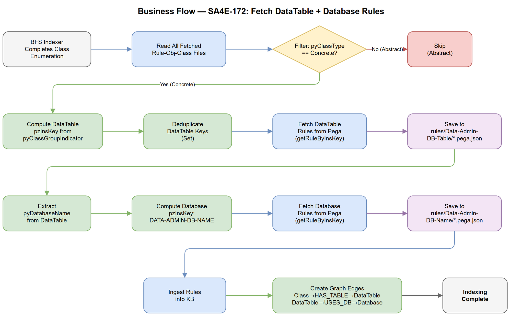
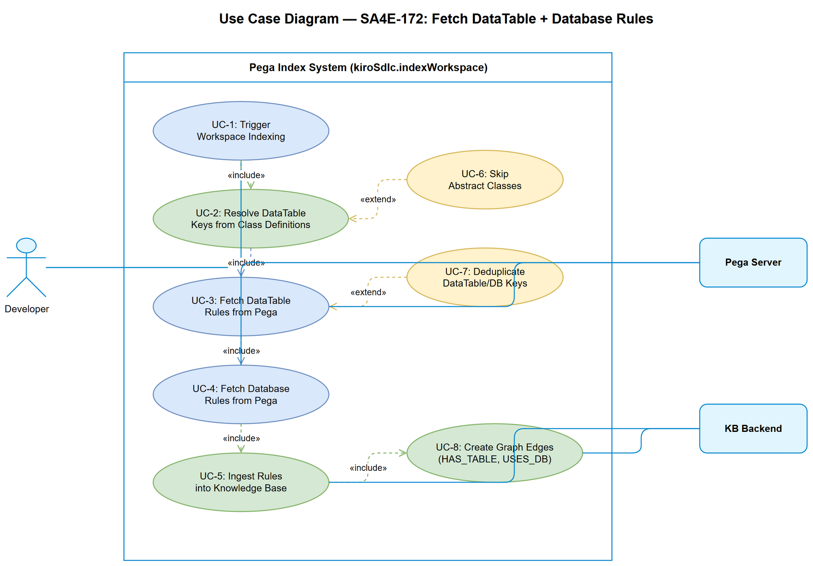

# Business Requirements Document (BRD)

## Pega Index — SA4E-172: Fetch DataTable + Database Rules During Workspace Indexing

---

## Document Information

| Field | Value |
|-------|-------|
| Jira Ticket | SA4E-172 |
| Title | Fetch DataTable + Database rules during workspace indexing |
| Author | BA Agent |
| Version | 1.0 |
| Date | 2025-07-27 |
| Status | Draft |
| Architecture Pattern | Plugin (VS Code/Kiro Extension) |

---

## Revision History

| Version | Date | Author | Changes |
|---------|------|--------|---------|
| 1.0 | 2025-07-27 | BA Agent | Initiate document — auto-generated from Jira ticket SA4E-172 |

---

## 1. Introduction

### 1.1 Scope

Mở rộng Pega index source code command (`kiroSdlc.indexWorkspace`) để tự động fetch và lưu **DataTable rules** (mapping class→DB table) và **Database connection rules** (connection info) trong quá trình crawl workspace. Hiện tại BFS indexer chỉ crawl rule content theo dependency graph mà chưa resolve được 2 loại rule quan trọng này.

### 1.2 Out of Scope

- Không thay đổi logic BFS traversal cốt lõi (dependency discovery)
- Không fetch/ingest các loại Data-Admin khác (Operator, AccessGroup — đã có PegaHierarchyResolver)
- Không UI changes (no webview modifications)
- Không thay đổi Pega API endpoints

### 1.3 Preliminary Requirements

- PegaBfsIndexer (SA4E-156) phải hoàn thành và hoạt động ổn định
- PegaHttpClient.getRuleByInsKey() hoạt động cho DATA-ADMIN-DB-TABLE và DATA-ADMIN-DB-NAME rules
- PegaStreamIngester.ingestSingleRule() hỗ trợ ingest DataTable/Database rule types
- KB graph schema hỗ trợ edge types: HAS_TABLE, USES_DB

---

## 2. Business Requirements

### 2.1 High Level Process Map

Khi user trigger `kiroSdlc.indexWorkspace`, sau khi BFS indexer enumerate các classes (Rule-Obj-Class), hệ thống cần:
1. Xác định DataTable rule key từ class definition metadata
2. Deduplicate (nhiều class cùng class group → cùng 1 DataTable)
3. Fetch DataTable rules từ Pega server
4. Từ DataTable, xác định Database rule key
5. Fetch Database rules từ Pega server
6. Save tất cả fetched rules to disk (.pega.json)
7. Ingest vào Knowledge Base với graph edges

### 2.2 List of User Stories / Use Cases

| # | Story / Use Case | Priority | Source Ticket |
|---|-----------------|----------|---------------|
| 1 | As a developer, I want DataTable rules fetched automatically during workspace indexing so that I can see class-to-table mappings in the KB | MUST HAVE | SA4E-172 |
| 2 | As a developer, I want Database connection rules fetched automatically so that I understand which DB each class persists to | MUST HAVE | SA4E-172 |
| 3 | As a developer, I want abstract classes skipped during DataTable resolution so that unnecessary API calls are avoided | MUST HAVE | SA4E-172 |
| 4 | As a developer, I want class group deduplication so that the same DataTable is not fetched multiple times | SHOULD HAVE | SA4E-172 |
| 5 | As a developer, I want graph edges (Class→HAS_TABLE→DataTable→USES_DB→Database) so that I can navigate the data persistence topology in KB | MUST HAVE | SA4E-172 |

---

### 2.3 Details of User Stories

---

#### Business Flow



**Step 1:** BFS Indexer completes class enumeration (Rule-Obj-Class rules fetched and saved)

**Step 2:** Post-processing step reads all fetched class definitions from disk

**Step 3:** For each class, check `pyClassType`:
- If `Abstract` → skip (no DataTable)
- If `Concrete` → proceed to Step 4

**Step 4:** Determine DataTable pzInsKey based on `pyClassGroupIndicator`:

| pyClassGroupIndicator | DataTable pzInsKey Formula |
|----------------------|---------------------------|
| ISCLASSGROUP | `DATA-ADMIN-DB-TABLE {UPPERCASE(pyClassName)}` |
| HASCLASSGROUP | `DATA-ADMIN-DB-TABLE {UPPERCASE(pyClassGroup)}` |
| NOCLASSGROUP | `DATA-ADMIN-DB-TABLE {UPPERCASE(pyClassName)}` |

**Step 5:** Deduplicate computed DataTable keys (multiple classes with same class group resolve to same DataTable)

**Step 6:** Fetch each unique DataTable rule via `PegaHttpClient.getRuleByInsKey()`

**Step 7:** Save DataTable rule JSON to `rules/Data-Admin-DB-Table/{className}.pega.json`

**Step 8:** From each DataTable rule, extract `pyDatabaseName` field

**Step 9:** Compute Database rule pzInsKey: `DATA-ADMIN-DB-NAME PEGADATA {UPPERCASE(pyDatabaseName)}`

**Step 10:** Deduplicate Database keys (multiple DataTables may reference same Database)

**Step 11:** Fetch each unique Database rule via `PegaHttpClient.getRuleByInsKey()`

**Step 12:** Save Database rule JSON to `rules/Data-Admin-DB-Name/{databaseName}.pega.json`

**Step 13:** Ingest all DataTable and Database rules into KB

**Step 14:** Create graph edges: Class → HAS_TABLE → DataTable → USES_DB → Database

> **Note:** Steps 6-14 run as a post-processing batch after BFS loop completes, not interleaved with BFS.

---

#### STORY 1: Auto-fetch DataTable Rules During Indexing

> As a developer, I want DataTable rules fetched automatically during workspace indexing so that I can see class-to-table mappings in the KB.

**Requirement Details:**

1. After BFS indexer finishes class enumeration, system MUST identify all concrete classes
2. For each concrete class, compute DataTable pzInsKey using the class group indicator logic table
3. Deduplicate DataTable keys (set-based)
4. Fetch each unique DataTable rule from Pega server using existing `PegaHttpClient.getRuleByInsKey()`
5. Save fetched rule JSON to `rules/Data-Admin-DB-Table/{className}.pega.json`

**Data Fields:**

| Field | Type | Source | Description |
|-------|------|--------|-------------|
| pyClassName | string | Rule-Obj-Class JSON | Class name (e.g., TGB-HRApps-Work) |
| pyClassType | string | Rule-Obj-Class JSON | "Abstract" or "Concrete" |
| pyClassGroupIndicator | string | Rule-Obj-Class JSON | ISCLASSGROUP / HASCLASSGROUP / NOCLASSGROUP |
| pyClassGroup | string | Rule-Obj-Class JSON | Class group name (only when HASCLASSGROUP) |

**Acceptance Criteria:**

1. Given concrete class TGB-HRApps-Work (ISCLASSGROUP), when indexed, DataTable rule `DATA-ADMIN-DB-TABLE TGB-HRAPPS-WORK` is fetched and saved
2. Given concrete class TGB-HRApps-Work-Onboarding (HASCLASSGROUP, pyClassGroup=TGB-HRApps-Work), it references DataTable `DATA-ADMIN-DB-TABLE TGB-HRAPPS-WORK`
3. Given abstract class (pyClassType=Abstract), it is skipped — no DataTable fetch attempted
4. Given 3 classes sharing same class group, only 1 DataTable fetch occurs (deduplication)
5. Fetched DataTable rules saved as `.pega.json` in correct directory

**Error Handling:**

- DataTable rule not found (404): Log warning, continue with remaining classes — do not abort
- Network timeout: Retry once (reuse existing `fetchWithRetry` pattern), then skip with warning
- Auth error (401): Propagate error — abort DataTable resolution (same as BFS behavior)

---

#### STORY 2: Auto-fetch Database Connection Rules

> As a developer, I want Database connection rules fetched automatically so that I understand which DB each class persists to.

**Requirement Details:**

1. After DataTable rules are fetched, extract `pyDatabaseName` field from each DataTable rule JSON
2. Compute Database rule pzInsKey: `DATA-ADMIN-DB-NAME PEGADATA {UPPERCASE(pyDatabaseName)}`
3. Deduplicate Database keys
4. Fetch each unique Database rule from Pega server
5. Save fetched rule JSON to `rules/Data-Admin-DB-Name/{databaseName}.pega.json`

**Data Fields:**

| Field | Type | Source | Description |
|-------|------|--------|-------------|
| pyDatabaseName | string | DataTable rule JSON | DB connection name (e.g., "PegaDATA") |

**Acceptance Criteria:**

1. Given DataTable rule with `pyDatabaseName="PegaDATA"`, Database rule `DATA-ADMIN-DB-NAME PEGADATA PEGADATA` is fetched
2. Given 5 DataTables all referencing same `pyDatabaseName`, only 1 Database fetch occurs
3. Fetched Database rules saved as `.pega.json` in correct directory
4. If `pyDatabaseName` is empty/null in a DataTable → skip Database resolution for that table (log warning)

**Error Handling:**

- Database rule not found (404): Log warning, continue — do not abort
- Empty `pyDatabaseName`: Skip gracefully with debug log

---

#### STORY 3: Skip Abstract Classes

> As a developer, I want abstract classes skipped during DataTable resolution so that unnecessary API calls are avoided.

**Requirement Details:**

1. During class enumeration post-processing, check `pyClassType` field
2. If `pyClassType === "Abstract"` → skip entirely (no DataTable computation)
3. Only proceed with DataTable resolution for concrete classes

**Acceptance Criteria:**

1. Given an abstract class definition, no DataTable API call is made
2. Given a mix of 5 abstract and 10 concrete classes, exactly ≤10 DataTable computations occur (after dedup may be fewer)
3. Skip is logged at debug level for traceability

---

#### STORY 4: Deduplication of DataTable Lookups

> As a developer, I want class group deduplication so that the same DataTable is not fetched multiple times.

**Requirement Details:**

1. Multiple concrete classes with `HASCLASSGROUP` pointing to same `pyClassGroup` resolve to same DataTable pzInsKey
2. System MUST use a Set to track computed DataTable keys before fetching
3. Only unique keys trigger HTTP fetch

**Acceptance Criteria:**

1. Given classes A (ISCLASSGROUP), B (HASCLASSGROUP→A), C (HASCLASSGROUP→A), only 1 fetch for `DATA-ADMIN-DB-TABLE A`
2. Deduplication counter logged: "Resolved N unique DataTables from M concrete classes"
3. Same deduplication applies to Database rules (multiple DataTables may reference same DB)

---

#### STORY 5: KB Ingestion with Graph Edges

> As a developer, I want graph edges (Class→HAS_TABLE→DataTable→USES_DB→Database) so that I can navigate the data persistence topology in KB.

**Requirement Details:**

1. After fetching, ingest DataTable rules into KB (using existing `PegaStreamIngester.ingestSingleRule()`)
2. After fetching, ingest Database rules into KB
3. Create graph edges:
   - Each concrete class → `HAS_TABLE` → its DataTable rule
   - Each DataTable → `USES_DB` → its Database rule
4. Graph edges enable KB queries like "which DB does class X persist to?"

**Acceptance Criteria:**

1. After indexing, KB contains DataTable rule nodes
2. After indexing, KB contains Database rule nodes
3. Graph query "Class TGB-HRApps-Work → HAS_TABLE" returns DataTable node
4. Graph query "DataTable TGB-HRAPPS-WORK → USES_DB" returns Database node
5. Transitive query "Class → HAS_TABLE → USES_DB" resolves end-to-end

---

## 3. Dependencies

| Dependency | Type | Related Ticket | Description |
|------------|------|----------------|-------------|
| PegaBfsIndexer | System | SA4E-156 | BFS loop must complete class enumeration before DataTable resolution starts |
| PegaHttpClient.getRuleByInsKey() | System | Existing | Used to fetch DATA-ADMIN-DB-TABLE and DATA-ADMIN-DB-NAME rules |
| PegaStreamIngester.ingestSingleRule() | System | SA4E-156 | Used to ingest fetched rules into KB |
| KB Graph Schema | System | Existing | Must support HAS_TABLE and USES_DB edge types |
| Pega REST API | External | N/A | CodeIntelligence or PRRestService endpoint must serve DataTable/Database rules |
| Class definition files | Data | BFS output | Rule-Obj-Class/*.pega.json files must exist on disk before post-processing |

---

## 4. Stakeholders

| Role | Name / Team | Responsibility |
|------|-------------|----------------|
| Developer | Engineering Team | Implement and unit test the feature |
| Solution Architect | SA Agent | Design technical approach (TDD) |
| QA | QA Agent | Validate acceptance criteria |
| End User | Developers using Kiro/VS Code with Pega projects | Benefit from enriched KB |

---

## 5. Risks and Assumptions

### 5.1 Risks

| Risk | Impact | Likelihood | Mitigation |
|------|--------|------------|------------|
| DataTable/Database rules not accessible via existing REST API | High | Low | Verify with Pega server that DATA-ADMIN-DB-TABLE and DATA-ADMIN-DB-NAME classes are queryable via getRuleByInsKey |
| Large number of classes (>1000) causes slow post-processing | Medium | Medium | Batch fetching with concurrency control (reuse calibrateFetchConcurrency) |
| pyClassGroupIndicator values may differ across Pega versions | Medium | Low | Validate against multiple Pega environments; handle unknown values gracefully |
| KB graph schema doesn't support new edge types | Medium | Low | Extend schema migration to add HAS_TABLE and USES_DB relationships |

### 5.2 Assumptions

- Pega server returns Rule-Obj-Class JSON with `pyClassType`, `pyClassGroupIndicator`, and `pyClassGroup` fields populated
- `DATA-ADMIN-DB-TABLE` and `DATA-ADMIN-DB-NAME` rules are accessible via the same REST endpoints as other rules
- The `pyDatabaseName` field in DataTable rules contains the exact name needed to construct Database pzInsKey
- `pyDerivesFrom` is the parent class field (NOT `pyParentClass`) — relevant for class hierarchy but not directly used in DataTable resolution
- DataTable/Database rules are relatively few (<100 unique per workspace) — performance impact minimal

---

## 6. Non-Functional Requirements

| Category | Requirement | Details |
|----------|-------------|---------|
| Performance | DataTable/Database resolution should add <30s to indexing time | Batch fetch with configurable concurrency (reuse calibrateFetchConcurrency from PegaCrawlHelper) |
| Performance | Zero impact on BFS loop performance | Post-processing runs AFTER BFS completes, not interleaved |
| Reliability | Graceful degradation on fetch failures | Individual failures (404, timeout) logged but don't abort entire indexing |
| Scalability | Support up to 500 unique DataTables per workspace | Deduplication ensures actual API calls stay manageable |
| Security | Reuse existing auth mechanism | Same PegaHttpClient auth (Basic/OAuth) — no new credentials |
| Observability | Progress reporting via VS Code progress bar | Show "Resolving DataTables: N/M" in existing progress reporter |
| Data Integrity | No duplicate rules in KB | Checksum-based dedup (same as BFS pattern) |

---

## 7. Use Case Diagram



---

## 8. Appendix

### Glossary

| Term | Definition |
|------|------------|
| DataTable rule | Pega DATA-ADMIN-DB-TABLE rule that maps a class to a database table |
| Database rule | Pega DATA-ADMIN-DB-NAME rule that defines a database connection |
| pyClassGroupIndicator | Pega field indicating how a class relates to its class group (ISCLASSGROUP, HASCLASSGROUP, NOCLASSGROUP) |
| pzInsKey | Pega instance key — unique identifier for any Pega rule instance |
| BFS Indexer | Breadth-First Search indexer that crawls Pega rules by following dependency graph |
| KB | Knowledge Base — backend storage with graph nodes and edges |
| HAS_TABLE | Graph edge type: Class → DataTable |
| USES_DB | Graph edge type: DataTable → Database |

### DataTable Key Computation Reference

```
Input: Rule-Obj-Class JSON
├── pyClassType == "Abstract" → SKIP (no DataTable)
├── pyClassType == "Concrete"
│   ├── pyClassGroupIndicator == "ISCLASSGROUP"
│   │   └── key = "DATA-ADMIN-DB-TABLE " + UPPERCASE(pyClassName)
│   ├── pyClassGroupIndicator == "HASCLASSGROUP"
│   │   └── key = "DATA-ADMIN-DB-TABLE " + UPPERCASE(pyClassGroup)
│   └── pyClassGroupIndicator == "NOCLASSGROUP"
│       └── key = "DATA-ADMIN-DB-TABLE " + UPPERCASE(pyClassName)
```

### Database Key Computation Reference

```
Input: DataTable rule JSON
├── pyDatabaseName is empty/null → SKIP
└── pyDatabaseName has value
    └── key = "DATA-ADMIN-DB-NAME PEGADATA " + UPPERCASE(pyDatabaseName)
```

### Diagram Index

| # | Diagram | Image | Source (editable) |
|---|---------|-------|-------------------|
| 1 | Business Flow | [business-flow.png](diagrams/business-flow.png) | [business-flow.drawio](diagrams/business-flow.drawio) |
| 2 | Use Case | [use-case.png](diagrams/use-case.png) | [use-case.drawio](diagrams/use-case.drawio) |
