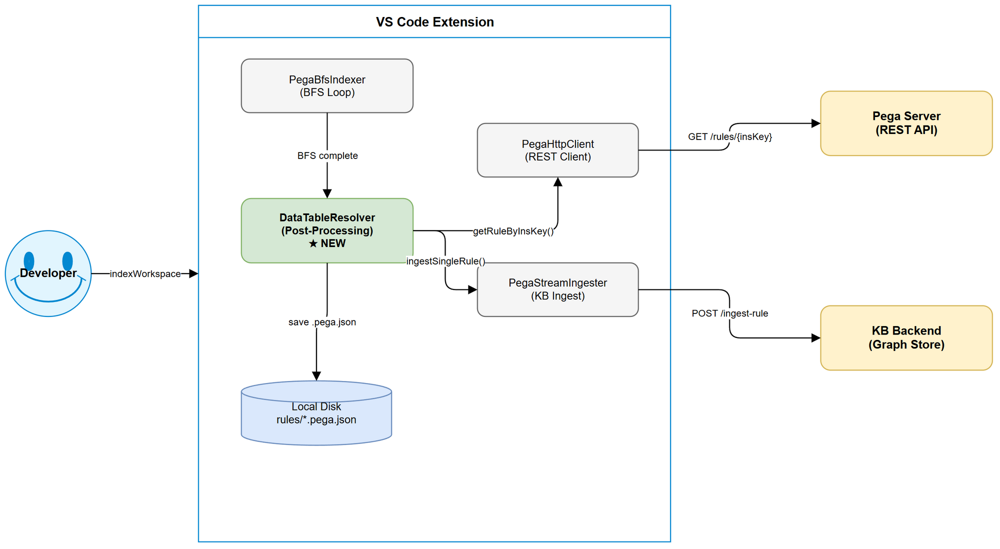
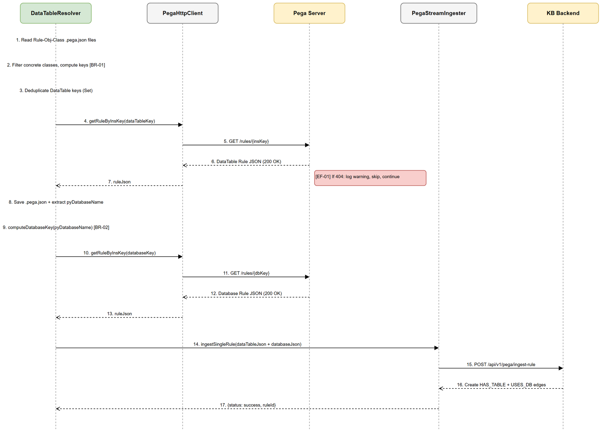
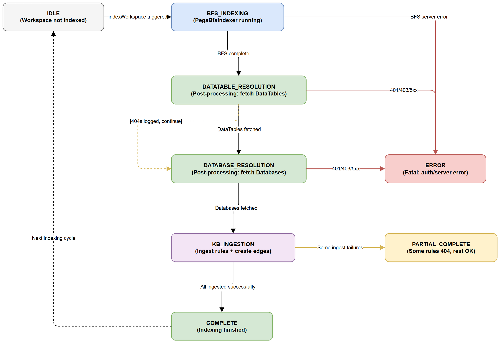

# Functional Specification Document (FSD)

## Pega Index — SA4E-172: Fetch DataTable + Database Rules During Workspace Indexing

---

## Document Information

| Field | Value |
|-------|-------|
| Jira Ticket | SA4E-172 |
| Title | Fetch DataTable + Database rules during workspace indexing |
| Author | BA Agent |
| Version | 1.0 |
| Date | 2025-07-27 |
| Status | Draft |
| Related BRD | documents/SA4E-172/BRD.md |
| Architecture Pattern | Plugin (VS Code/Kiro Extension) |

---

## Revision History

| Version | Date | Author | Changes |
|---------|------|--------|---------|
| 1.0 | 2025-07-27 | BA Agent | Initiate document — auto-generated from BRD |

---

## 1. Introduction

### 1.1 Purpose

Đặc tả chức năng mở rộng workspace indexing command (`kiroSdlc.indexWorkspace`) để tự động fetch, lưu, và ingest **DataTable rules** (DATA-ADMIN-DB-TABLE) và **Database connection rules** (DATA-ADMIN-DB-NAME) sau khi BFS indexer hoàn thành phase class enumeration.

### 1.2 Scope

- Thêm post-processing step vào indexing pipeline
- Resolve DataTable key từ class metadata (pyClassGroupIndicator, pyClassGroup, pyClassName)
- Resolve Database key từ DataTable metadata (pyDatabaseName)
- Fetch, save, ingest vào Knowledge Base với graph edges (HAS_TABLE, USES_DB)

### 1.3 Definitions & Acronyms

| Term | Definition |
|------|------------|
| DataTable rule | Pega DATA-ADMIN-DB-TABLE instance — maps class → database table |
| Database rule | Pega DATA-ADMIN-DB-NAME instance — defines database connection |
| pzInsKey | Pega instance key — unique identifier for any rule instance |
| pyDerivesFrom | Parent class field in Pega class definition (NOT pyParentClass) |
| pyClassGroupIndicator | Field indicating class-group relationship: ISCLASSGROUP, HASCLASSGROUP, NOCLASSGROUP |
| BFS Indexer | PegaBfsIndexer — breadth-first crawl of rules by dependency graph |
| KB | Knowledge Base backend (SQLite/PostgreSQL graph store) |
| HAS_TABLE | Graph edge: Class → DataTable |
| USES_DB | Graph edge: DataTable → Database |

### 1.4 References

| Document | Location |
|----------|----------|
| BRD | documents/SA4E-172/BRD.md |
| PegaBfsIndexer | extension/src/services/PegaBfsIndexer.ts |
| PegaStreamIngester | extension/src/services/PegaStreamIngester.ts |
| PegaHttpClient | extension/src/services/PegaHttpClient.ts |

---

## 2. System Overview

### 2.1 System Context Diagram



Hệ thống bao gồm 3 thành phần chính:
- **VS Code Extension** — orchestrates indexing, runs post-processing
- **Pega Server** — source of truth for DataTable/Database rules (accessed via REST)
- **KB Backend** — stores ingested rules as graph nodes with edges

### 2.2 System Architecture

Post-processing step chạy SAU khi `PegaBfsIndexer.run()` hoàn thành. Nó đọc class definitions đã saved trên disk, compute keys, fetch rules mới từ Pega server, save to disk, rồi ingest vào KB backend.

---

## 3. Functional Requirements

### 3.1 Feature: DataTable Rule Resolution

**Source:** BRD Story 1, Story 3, Story 4

#### 3.1.1 Description

Sau khi BFS indexer hoàn thành, hệ thống scan tất cả Rule-Obj-Class files đã saved, xác định concrete classes, compute DataTable pzInsKey, deduplicate, và fetch từ Pega server.

#### 3.1.2 Use Case: UC-01 — Resolve DataTable Rules from Class Definitions

**Use Case ID:** UC-01
**Actor:** Developer (triggers indexing command)
**Preconditions:**
- BFS indexer đã hoàn thành class enumeration
- Rule-Obj-Class .pega.json files tồn tại trên disk
- Pega server accessible & authenticated

**Postconditions:**
- DataTable rules fetched and saved to `rules/Data-Admin-DB-Table/`
- DataTable rules ingested into KB
- Graph edges Class → HAS_TABLE → DataTable created

**Main Flow:**

| Step | Actor | System | Description |
|------|-------|--------|-------------|
| 1 | Developer | | Triggers `kiroSdlc.indexWorkspace` |
| 2 | | PegaBfsIndexer | Runs BFS loop, fetches & saves Rule-Obj-Class rules |
| 3 | | DataTableResolver | Reads all Rule-Obj-Class .pega.json files from disk |
| 4 | | DataTableResolver | Filters: skip abstract classes (pyClassType === "Abstract") |
| 5 | | DataTableResolver | Computes DataTable pzInsKey per class using BR-01 key formula |
| 6 | | DataTableResolver | Deduplicates computed keys (Set-based) |
| 7 | | PegaHttpClient | Fetches each unique DataTable rule via getRuleByInsKey() |
| 8 | | DataTableResolver | Saves fetched rules to `rules/Data-Admin-DB-Table/{name}.pega.json` |
| 9 | | PegaStreamIngester | Ingests DataTable rules into KB |
| 10 | | KB Backend | Creates graph edges: Class → HAS_TABLE → DataTable |

**Alternative Flows:**

| ID | Condition | Steps |
|----|-----------|-------|
| AF-01 | DataTable rule already exists on disk (previously fetched) | Skip fetch, proceed to ingest |
| AF-02 | Class has pyClassGroupIndicator = NOCLASSGROUP | Use pyClassName for key (same as ISCLASSGROUP) |
| AF-03 | Multiple classes share same class group | Only one fetch occurs due to deduplication |

**Exception Flows:**

| ID | Condition | Steps |
|----|-----------|-------|
| EF-01 | DataTable rule not found (404 / "Rule not found") | Log warning, skip this class, continue with remaining |
| EF-02 | Network timeout | Retry once (existing fetchWithRetry pattern), then skip with warning |
| EF-03 | Auth error (401/403) | Abort entire DataTable resolution, propagate error |
| EF-04 | Server error (500/502/503/504) | Abort entire DataTable resolution, propagate error |
| EF-05 | pyClassGroupIndicator has unknown value | Log warning, skip class, continue |

---

#### 3.1.3 Use Case: UC-02 — Resolve Database Rules from DataTable Definitions

**Use Case ID:** UC-02
**Actor:** System (triggered automatically after UC-01)
**Preconditions:**
- UC-01 completed (DataTable rules fetched)
- At least one DataTable rule has non-empty pyDatabaseName

**Postconditions:**
- Database rules fetched and saved to `rules/Data-Admin-DB-Name/`
- Database rules ingested into KB
- Graph edges DataTable → USES_DB → Database created

**Main Flow:**

| Step | Actor | System | Description |
|------|-------|--------|-------------|
| 1 | | DataTableResolver | Iterates fetched DataTable rules |
| 2 | | DataTableResolver | Extracts pyDatabaseName from each DataTable JSON |
| 3 | | DataTableResolver | Computes Database pzInsKey using BR-02 formula |
| 4 | | DataTableResolver | Deduplicates Database keys (Set-based) |
| 5 | | PegaHttpClient | Fetches each unique Database rule via getRuleByInsKey() |
| 6 | | DataTableResolver | Saves to `rules/Data-Admin-DB-Name/{name}.pega.json` |
| 7 | | PegaStreamIngester | Ingests Database rules into KB |
| 8 | | KB Backend | Creates edge: DataTable → USES_DB → Database node |

**Alternative Flows:**

| ID | Condition | Steps |
|----|-----------|-------|
| AF-04 | pyDatabaseName is empty/null in DataTable | Skip Database resolution for this DataTable, log debug |
| AF-05 | Multiple DataTables reference same Database | Only one fetch due to deduplication |

**Exception Flows:**

| ID | Condition | Steps |
|----|-----------|-------|
| EF-06 | Database rule not found (404) | Log warning, continue with remaining |
| EF-07 | Auth/Server error | Abort Database resolution |

---

#### 3.1.4 Use Case: UC-03 — Skip Abstract Classes

**Use Case ID:** UC-03
**Actor:** System (automatic filter)
**Preconditions:** Rule-Obj-Class JSON loaded from disk
**Postconditions:** Abstract classes excluded from DataTable resolution

**Main Flow:**

| Step | Actor | System | Description |
|------|-------|--------|-------------|
| 1 | | DataTableResolver | Reads pyClassType from class JSON |
| 2 | | DataTableResolver | If pyClassType === "Abstract" → skip (no DataTable computation) |
| 3 | | DataTableResolver | Logs skip at debug level |

---

#### 3.1.5 Use Case: UC-04 — Class Group Deduplication

**Use Case ID:** UC-04
**Actor:** System (automatic optimization)
**Preconditions:** Multiple classes computed DataTable keys
**Postconditions:** Only unique DataTable keys trigger API fetch

**Main Flow:**

| Step | Actor | System | Description |
|------|-------|--------|-------------|
| 1 | | DataTableResolver | Maintains dedupSet: Set<string> |
| 2 | | DataTableResolver | For each computed key, check dedupSet.has(key) |
| 3 | | DataTableResolver | If not in set → add to set, add to fetchQueue |
| 4 | | DataTableResolver | If already in set → skip fetch, map class to existing DataTable |
| 5 | | DataTableResolver | Logs: "Resolved N unique DataTables from M concrete classes" |

---

#### 3.1.6 Use Case: UC-05 — KB Ingestion with Graph Edges

**Use Case ID:** UC-05
**Actor:** System (automatic post-fetch)
**Preconditions:** DataTable and/or Database rules fetched and saved to disk
**Postconditions:** KB contains rule nodes and graph edges

**Main Flow:**

| Step | Actor | System | Description |
|------|-------|--------|-------------|
| 1 | | PegaStreamIngester | Calls ingestSingleRule() for each DataTable rule |
| 2 | | KB Backend | Stores DataTable as graph node |
| 3 | | KB Backend | Creates edge: source class → HAS_TABLE → DataTable node |
| 4 | | PegaStreamIngester | Calls ingestSingleRule() for each Database rule |
| 5 | | KB Backend | Stores Database as graph node |
| 6 | | KB Backend | Creates edge: DataTable → USES_DB → Database node |

**Alternative Flows:**

| ID | Condition | Steps |
|----|-----------|-------|
| AF-06 | Rule already ingested (checksum match) | Skip ingest, status = "duplicate" |

---

### 3.2 Business Rules

| Rule ID | Rule | Source |
|---------|------|--------|
| BR-01 | DataTable key computation: ISCLASSGROUP → `DATA-ADMIN-DB-TABLE {UPPERCASE(pyClassName)}`; HASCLASSGROUP → `DATA-ADMIN-DB-TABLE {UPPERCASE(pyClassGroup)}`; NOCLASSGROUP → `DATA-ADMIN-DB-TABLE {UPPERCASE(pyClassName)}` | BRD §2.3 Step 4 |
| BR-02 | Database key computation: `DATA-ADMIN-DB-NAME PEGADATA {UPPERCASE(pyDatabaseName)}` | BRD §2.3 Step 9 |
| BR-03 | Abstract classes (pyClassType === "Abstract") MUST be skipped — no DataTable resolution | BRD Story 3 |
| BR-04 | Deduplication: multiple classes resolving to same DataTable key → only ONE fetch | BRD Story 4 |
| BR-05 | Post-processing runs AFTER BFS loop completes — never interleaved with BFS | BRD §2.3 Note |
| BR-06 | Individual fetch failures (404) must NOT abort entire resolution — graceful degradation | BRD Story 1 Error Handling |
| BR-07 | Auth errors (401/403) and server errors (5xx) MUST abort resolution immediately | BRD Story 1 Error Handling |
| BR-08 | pyDerivesFrom is the parent class field (NOT pyParentClass) — relevant for class hierarchy | BRD §5.2 |
| BR-09 | Progress reporting: show "Resolving DataTables: N/M" via VS Code progress reporter | BRD §6 |
| BR-10 | Checksum-based dedup for KB ingestion (same pattern as BFS) | BRD §6 |

---

### 3.3 Sequence Diagram: DataTable Fetch Flow



---

### 3.4 State Diagram: Indexing Lifecycle



---

## 4. Data Model

### 4.1 Input Data: Rule-Obj-Class JSON

| Field | Type | Required | Validation | Description |
|-------|------|----------|------------|-------------|
| pyClassName | string | Y | Non-empty | Class name (e.g., TGB-HRApps-Work) |
| pyClassType | string | Y | "Abstract" or "Concrete" | Determines if DataTable resolution applies |
| pyClassGroupIndicator | string | Y | ISCLASSGROUP / HASCLASSGROUP / NOCLASSGROUP | Determines key computation formula |
| pyClassGroup | string | Conditional | Required when HASCLASSGROUP | Class group name |
| pyDerivesFrom | string | N | — | Parent class (NOT pyParentClass) |
| pzInsKey | string | Y | Non-empty | Instance key for the class rule |

### 4.2 Input Data: DataTable Rule JSON (DATA-ADMIN-DB-TABLE)

| Field | Type | Required | Validation | Description |
|-------|------|----------|------------|-------------|
| pzInsKey | string | Y | Non-empty | Instance key (e.g., DATA-ADMIN-DB-TABLE TGB-HRAPPS-WORK) |
| pyDatabaseName | string | N | — | Database connection name (e.g., "PegaDATA") |
| pxObjClass | string | Y | "Data-Admin-DB-Table" | Pega class of this rule |
| pyClassName | string | Y | Non-empty | Class this DataTable maps to |

### 4.3 Input Data: Database Rule JSON (DATA-ADMIN-DB-NAME)

| Field | Type | Required | Validation | Description |
|-------|------|----------|------------|-------------|
| pzInsKey | string | Y | Non-empty | Instance key (e.g., DATA-ADMIN-DB-NAME PEGADATA PEGADATA) |
| pyDatabaseName | string | Y | Non-empty | Database name |
| pxObjClass | string | Y | "Data-Admin-DB-Name" | Pega class of this rule |

### 4.4 Output Data: Graph Edges

| Edge Type | Source Node | Target Node | Description |
|-----------|-------------|-------------|-------------|
| HAS_TABLE | Rule-Obj-Class rule (by pzInsKey) | DATA-ADMIN-DB-TABLE rule | Class persists to this table |
| USES_DB | DATA-ADMIN-DB-TABLE rule | DATA-ADMIN-DB-NAME rule | Table stored in this database |

---

## 5. Integration Specifications

### 5.1 External System: Pega Server (REST API)

| Attribute | Value |
|-----------|-------|
| Purpose | Source of truth for DataTable and Database rules |
| Direction | Outbound (Extension → Pega) |
| Data Format | JSON |
| Frequency | On-demand (during workspace indexing) |
| Auth | Basic Auth (existing PegaHttpClient pattern) |

**API Used:**

| Method | Endpoint | Purpose |
|--------|----------|---------|
| GET | `{prefix}/rules/{encodeURIComponent(insKey)}` | Fetch single rule by pzInsKey |

**Data Exchange:**

| Our Data | Pega Data | Direction | Rule |
|----------|-----------|-----------|------|
| Computed pzInsKey | Rule JSON response | Request → Response | BR-01, BR-02 |

### 5.2 External System: KB Backend

| Attribute | Value |
|-----------|-------|
| Purpose | Graph storage for rules, nodes, edges |
| Direction | Outbound (Extension → Backend) |
| Data Format | JSON |
| Frequency | Real-time during post-processing |
| Auth | None (localhost) |

**API Used:**

| Method | Endpoint | Purpose |
|--------|----------|---------|
| POST | `/api/v1/pega/ingest-rule` | Ingest single rule into KB |

---

## 6. Processing Logic

### 6.1 DataTable Resolution Process

**Trigger:** BFS indexer `run()` completes successfully
**Input:** Rule-Obj-Class .pega.json files on disk
**Output:** DataTable .pega.json files + KB nodes + HAS_TABLE edges

**Processing Steps:**

| Step | Description | Error Handling |
|------|-------------|----------------|
| 1 | Scan `rules/Rule-Obj-Class/` directory for .pega.json files | If directory empty → skip (no classes indexed) |
| 2 | Parse each file, extract pyClassType, pyClassGroupIndicator, pyClassName, pyClassGroup | JSON parse error → log, skip file |
| 3 | Filter: keep only pyClassType !== "Abstract" | — |
| 4 | Compute DataTable pzInsKey per BR-01 | Unknown indicator → log warning, skip |
| 5 | Deduplicate keys into Set | — |
| 6 | Report progress: "Resolving DataTables: 0/N" | — |
| 7 | For each unique key: fetch via PegaHttpClient.getRuleByInsKey() | 404 → log, skip; 401/5xx → abort |
| 8 | Save to `rules/Data-Admin-DB-Table/{name}.pega.json` | Disk write error → log, continue |
| 9 | Ingest into KB via PegaStreamIngester.ingestSingleRule() | Ingest error → log, continue |
| 10 | Create HAS_TABLE edges for all classes mapping to this DataTable | — |

### 6.2 Database Resolution Process

**Trigger:** DataTable resolution completes (at least 1 DataTable fetched)
**Input:** Fetched DataTable rule JSONs
**Output:** Database .pega.json files + KB nodes + USES_DB edges

**Processing Steps:**

| Step | Description | Error Handling |
|------|-------------|----------------|
| 1 | Iterate fetched DataTable rules | — |
| 2 | Extract pyDatabaseName from each | Empty/null → log debug, skip |
| 3 | Compute Database pzInsKey per BR-02 | — |
| 4 | Deduplicate keys into Set | — |
| 5 | For each unique key: fetch via PegaHttpClient.getRuleByInsKey() | 404 → log, skip; 401/5xx → abort |
| 6 | Save to `rules/Data-Admin-DB-Name/{name}.pega.json` | Disk write error → log, continue |
| 7 | Ingest into KB via PegaStreamIngester.ingestSingleRule() | Ingest error → log, continue |
| 8 | Create USES_DB edges for DataTable → Database | — |

### 6.3 Key Computation Pseudocode

```typescript
function computeDataTableKey(classJson: ClassRule): string | null {
  if (classJson.pyClassType === "Abstract") return null;

  switch (classJson.pyClassGroupIndicator) {
    case "ISCLASSGROUP":
      return `DATA-ADMIN-DB-TABLE ${classJson.pyClassName.toUpperCase()}`;
    case "HASCLASSGROUP":
      return `DATA-ADMIN-DB-TABLE ${classJson.pyClassGroup.toUpperCase()}`;
    case "NOCLASSGROUP":
      return `DATA-ADMIN-DB-TABLE ${classJson.pyClassName.toUpperCase()}`;
    default:
      log(`Unknown pyClassGroupIndicator: ${classJson.pyClassGroupIndicator}`);
      return null;
  }
}

function computeDatabaseKey(dataTableJson: DataTableRule): string | null {
  const dbName = dataTableJson.pyDatabaseName;
  if (!dbName || dbName.trim() === "") return null;
  return `DATA-ADMIN-DB-NAME PEGADATA ${dbName.toUpperCase()}`;
}
```

---

## 7. Security Requirements

### 7.1 Authentication & Authorization

| Aspect | Requirement |
|--------|------------|
| Auth mechanism | Reuse existing PegaHttpClient Basic Auth (username/password from VS Code SecretStorage) |
| No new credentials | Feature uses same auth as BFS indexer |
| Secret handling | Passwords never logged or stored in plain text |

### 7.2 Data Sensitivity

| Data Type | Classification | Requirement |
|-----------|---------------|-------------|
| Pega rule JSON | Internal | Stored locally on developer machine only |
| Database connection names | Internal | Names only — no connection strings or passwords fetched |
| Auth credentials | Confidential | Managed via VS Code SecretStorage (existing pattern) |

---

## 8. Non-Functional Requirements

| Category | Requirement | Acceptance Criteria |
|----------|-------------|---------------------|
| Performance | DataTable/Database resolution < 30s total | Measured end-to-end for typical workspace (≤100 unique DataTables) |
| Performance | Zero impact on BFS loop | Post-processing starts ONLY after BFS completes |
| Reliability | Graceful degradation | Individual 404s logged but don't abort; overall indexing still succeeds |
| Scalability | Support ≤ 500 unique DataTables | Deduplication + batch fetching keeps API calls manageable |
| Observability | Progress via VS Code progress bar | "Resolving DataTables: N/M" and "Resolving Databases: N/M" |
| Data Integrity | No duplicate rules in KB | Checksum-based dedup (SHA-256, same as BFS pattern) |

---

## 9. Error Handling

### 9.1 Error Scenarios

| Scenario | Severity | User Message (Output Channel) | Expected Behavior |
|----------|----------|-------------------------------|-------------------|
| DataTable not found (404) | Warning | `[DataTableResolver] ⚠️ DataTable not found: {key}. Skipping.` | Continue with remaining classes |
| Database not found (404) | Warning | `[DataTableResolver] ⚠️ Database not found: {key}. Skipping.` | Continue with remaining |
| Auth error (401/403) | Critical | `[DataTableResolver] ⛔ Authentication failed. Aborting DataTable resolution.` | Abort post-processing, BFS results preserved |
| Server error (5xx) | Critical | `[DataTableResolver] ⛔ Server error ({code}). Aborting DataTable resolution.` | Abort post-processing |
| Network timeout | Warning | `[DataTableResolver] ⏳ Timeout fetching {key}. Retry 1/1...` | Retry once via fetchWithRetry, then skip |
| Empty pyDatabaseName | Debug | `[DataTableResolver] 🔍 DataTable {key} has no pyDatabaseName. Skipping DB resolution.` | Skip gracefully |
| Unknown pyClassGroupIndicator | Warning | `[DataTableResolver] ⚠️ Unknown indicator: {value} for class {name}. Skipping.` | Skip class |
| JSON parse error (disk file) | Warning | `[DataTableResolver] ⚠️ Failed to parse {file}. Skipping.` | Skip file, continue |
| Disk write error | Warning | `[DataTableResolver] ⚠️ Failed to save {path}: {error}` | Continue (fetch succeeded, save failed) |
| KB ingest error | Warning | `[DataTableResolver] ⚠️ Ingest failed for {key}: {error}` | Continue (rule saved on disk) |

### 9.2 Error Codes

| Code | Meaning | Recovery |
|------|---------|----------|
| ERR_DATATABLE_NOT_FOUND | Pega returns 404 for computed DataTable key | Class may not have a dedicated table — normal for some patterns |
| ERR_DATABASE_NOT_FOUND | Pega returns 404 for computed Database key | Database may use default connection |
| ERR_AUTH_FAILED | 401/403 from Pega server | Check credentials configuration |
| ERR_SERVER_ERROR | 5xx from Pega server | Server may be overloaded, retry later |
| ERR_UNKNOWN_INDICATOR | pyClassGroupIndicator not in known set | Pega version may have new values |

---

## 10. Testing Considerations

### 10.1 Test Scenarios

| ID | Scenario | Input | Expected Output | Priority |
|----|----------|-------|-----------------|----------|
| TC-01 | Concrete class with ISCLASSGROUP | pyClassName="TGB-HRApps-Work", indicator="ISCLASSGROUP" | Key = "DATA-ADMIN-DB-TABLE TGB-HRAPPS-WORK" | High |
| TC-02 | Concrete class with HASCLASSGROUP | pyClassGroup="TGB-HRApps-Work", indicator="HASCLASSGROUP" | Key = "DATA-ADMIN-DB-TABLE TGB-HRAPPS-WORK" | High |
| TC-03 | Concrete class with NOCLASSGROUP | pyClassName="TGB-Util-Helper", indicator="NOCLASSGROUP" | Key = "DATA-ADMIN-DB-TABLE TGB-UTIL-HELPER" | High |
| TC-04 | Abstract class skipped | pyClassType="Abstract" | No DataTable computation, no fetch | High |
| TC-05 | Deduplication — 3 classes same group | 3 classes with HASCLASSGROUP→same group | Only 1 fetch occurs | High |
| TC-06 | Database key from DataTable | pyDatabaseName="PegaDATA" | Key = "DATA-ADMIN-DB-NAME PEGADATA PEGADATA" | High |
| TC-07 | Empty pyDatabaseName | pyDatabaseName="" | Skip DB resolution, log debug | Medium |
| TC-08 | DataTable 404 — graceful skip | Server returns "Rule not found" | Log warning, continue remaining | High |
| TC-09 | Auth error aborts | Server returns 401 | Abort resolution, throw error | High |
| TC-10 | Graph edges created | 1 class → 1 DataTable → 1 Database | HAS_TABLE + USES_DB edges in KB | High |

---

## 11. Appendix

### Diagram Index

| # | Diagram | Image | Source (editable) |
|---|---------|-------|-------------------|
| 1 | System Context | [system-context.png](diagrams/system-context.png) | [system-context.drawio](diagrams/system-context.drawio) |
| 2 | Sequence — DataTable Fetch | [sequence-datatable-fetch.png](diagrams/sequence-datatable-fetch.png) | [sequence-datatable-fetch.drawio](diagrams/sequence-datatable-fetch.drawio) |
| 3 | State — Indexing Lifecycle | [state-indexing.png](diagrams/state-indexing.png) | [state-indexing.drawio](diagrams/state-indexing.drawio) |

### Key Computation Reference

```
Input: Rule-Obj-Class JSON
├── pyClassType == "Abstract" → SKIP (no DataTable)
├── pyClassType == "Concrete"
│   ├── pyClassGroupIndicator == "ISCLASSGROUP"
│   │   └── key = "DATA-ADMIN-DB-TABLE " + UPPERCASE(pyClassName)
│   ├── pyClassGroupIndicator == "HASCLASSGROUP"
│   │   └── key = "DATA-ADMIN-DB-TABLE " + UPPERCASE(pyClassGroup)
│   └── pyClassGroupIndicator == "NOCLASSGROUP"
│       └── key = "DATA-ADMIN-DB-TABLE " + UPPERCASE(pyClassName)

Input: DataTable rule JSON
├── pyDatabaseName is empty/null → SKIP
└── pyDatabaseName has value
    └── key = "DATA-ADMIN-DB-NAME PEGADATA " + UPPERCASE(pyDatabaseName)
```

### Change Log from BRD

- No deviations from BRD. All 5 user stories mapped to use cases UC-01 through UC-05.
- Added explicit error codes and recovery guidance not present in BRD.
- Added processing pseudocode for developer clarity.
