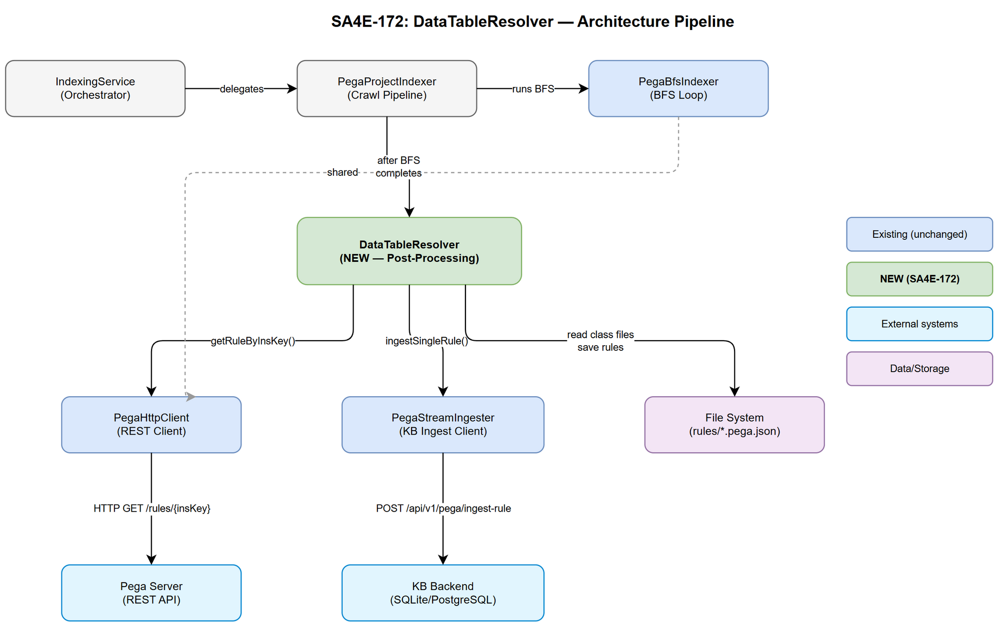
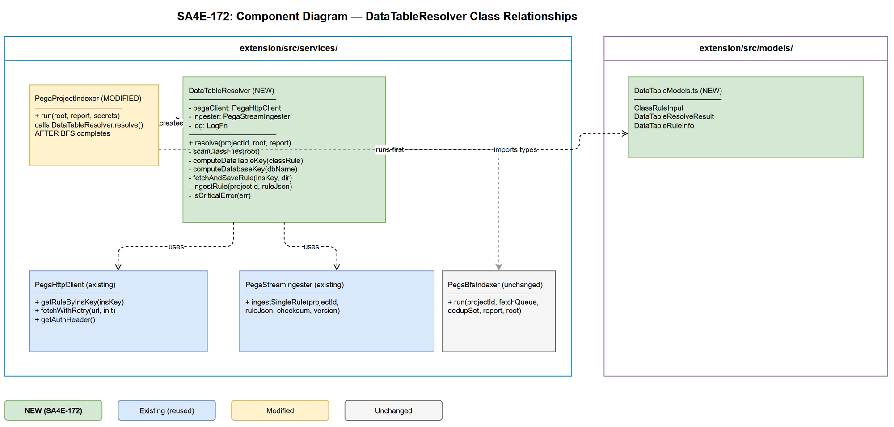

# Technical Design Document (TDD)

## SA4E-172: Fetch DataTable + Database Rules During Workspace Indexing

---

## Document Information

| Field | Value |
|-------|-------|
| Jira Ticket | SA4E-172 |
| Title | Fetch DataTable + Database rules during workspace indexing |
| Author | SA Agent |
| Version | 1.0 |
| Date | 2025-07-27 |
| Status | Draft |
| Related FSD | documents/SA4E-172/FSD.md |
| Architecture Pattern | Plugin (VS Code/Kiro Extension) |

---

## Revision History

| Version | Date | Author | Changes |
|---------|------|--------|---------|
| 1.0 | 2025-07-27 | SA Agent | Initial TDD — DataTableResolver design |

---

## 1. Architecture Overview

### 1.1 Design Decision

A new class `DataTableResolver` is introduced as a **post-processing step** that runs AFTER `PegaBfsIndexer.run()` completes. This follows the Single Responsibility Principle — BFS handles dependency-graph crawling, while DataTableResolver handles class-to-table resolution (a domain-specific computation not suited for generic BFS traversal).

### 1.2 Integration Point

DataTableResolver is called from `PegaProjectIndexer.run()` after BFS/fetch completes. It reuses existing infrastructure:

- **PegaHttpClient** — fetches DataTable/Database rules via `getRuleByInsKey()`
- **PegaStreamIngester** — ingests fetched rules into KB via `ingestSingleRule()`
- **File system** — reads saved Rule-Obj-Class `.pega.json` files, saves new rules

### 1.3 Data Flow

```
BFS completes → PegaProjectIndexer calls DataTableResolver.resolve()
  → Scan disk for Rule-Obj-Class files
  → Filter: skip abstract classes (BR-03)
  → Compute DataTable pzInsKey (BR-01)
  → Deduplicate keys (BR-04)
  → Fetch each unique DataTable from Pega (PegaHttpClient)
  → Save to disk + Ingest into KB (PegaStreamIngester)
  → Extract pyDatabaseName from fetched DataTables
  → Compute Database pzInsKey (BR-02)
  → Deduplicate + Fetch + Save + Ingest Database rules
  → Return summary
```



---

## 2. Module/Class Design

### 2.1 New File: `extension/src/services/DataTableResolver.ts`

**Responsibility:** Resolve DataTable and Database rules from indexed class definitions.

**Constraints:** ≤200 lines, ≤20 lines per function.

```typescript
/**
 * DataTableResolver — Post-processing step: resolve DataTable + Database rules
 * from indexed Rule-Obj-Class definitions.
 * SA4E-172: Runs AFTER PegaBfsIndexer.run() in IndexingService.
 * Pattern: Facade — orchestrates key computation, fetch, save, ingest.
 */
export class DataTableResolver {
  constructor(
    private readonly pegaClient: PegaHttpClient,
    private readonly ingester: PegaStreamIngester,
    private readonly log: LogFn,
  ) {}

  async resolve(
    projectId: string,
    root: string,
    report: ProgressReporter,
  ): Promise<DataTableResolveResult> { ... }
}
```

### 2.2 New File: `extension/src/models/DataTableModels.ts`

**Responsibility:** Type definitions for DataTable resolution (DTOs only — no logic).

```typescript
/** Input: parsed Rule-Obj-Class JSON from disk */
export interface ClassRuleInput {
  pzInsKey: string;
  pyClassName: string;
  pyClassType: string;
  pyClassGroupIndicator: string;
  pyClassGroup?: string;
  pyDerivesFrom?: string;
}

/** Output: resolution summary */
export interface DataTableResolveResult {
  dataTablesResolved: number;
  databasesResolved: number;
  skippedAbstract: number;
  skippedNotFound: number;
  errors: number;
}

/** Fetched DataTable rule with DB reference */
export interface DataTableRuleInfo {
  pzInsKey: string;
  pyDatabaseName?: string;
  ruleJson: Record<string, unknown>;
  sourceClasses: string[];
}
```

### 2.3 Modified File: `extension/src/services/PegaProjectIndexer.ts`

**Change:** After BFS/fetch completes, call `DataTableResolver.resolve()`.

```typescript
// After fetchAllRules() and ingestRules():
const { DataTableResolver } = await import("./DataTableResolver");
const resolver = new DataTableResolver(pegaClient, ingester, this.log);
const dtResult = await resolver.resolve(projectId, root, report);
this.log(`[Pega Indexer] 📊 DataTable resolution: ${dtResult.dataTablesResolved} tables, ${dtResult.databasesResolved} databases`);
```

### 2.4 Modified File: `extension/src/models/index.ts`

**Change:** Export new model types.

```typescript
export type { ClassRuleInput, DataTableResolveResult, DataTableRuleInfo } from "./DataTableModels";
```

---

## 3. API Design (Internal Interfaces)

### 3.1 DataTableResolver Public API

| Method | Signature | Description |
|--------|-----------|-------------|
| `resolve` | `(projectId: string, root: string, report: ProgressReporter) => Promise<DataTableResolveResult>` | Main entry — orchestrates full resolution |

### 3.2 Internal Helper Functions (private)

| Function | Signature | Responsibility |
|----------|-----------|----------------|
| `scanClassFiles` | `(root: string) => ClassRuleInput[]` | Read Rule-Obj-Class .pega.json files from disk |
| `computeDataTableKey` | `(classRule: ClassRuleInput) => string \| null` | BR-01: compute pzInsKey for DataTable |
| `computeDatabaseKey` | `(pyDatabaseName: string) => string \| null` | BR-02: compute pzInsKey for Database |
| `fetchAndSaveRule` | `(insKey: string, saveDir: string) => Promise<Record<string, unknown> \| null>` | Fetch via PegaHttpClient + save to disk |
| `ingestRule` | `(projectId: string, ruleJson: Record<string, unknown>) => Promise<boolean>` | Ingest via PegaStreamIngester |

### 3.3 Key Computation (BR-01, BR-02)

```typescript
// BR-01: DataTable key
function computeDataTableKey(classRule: ClassRuleInput): string | null {
  if (classRule.pyClassType === "Abstract") return null; // BR-03

  switch (classRule.pyClassGroupIndicator) {
    case "ISCLASSGROUP":
    case "NOCLASSGROUP":
      return `DATA-ADMIN-DB-TABLE ${classRule.pyClassName.toUpperCase()}`;
    case "HASCLASSGROUP":
      if (!classRule.pyClassGroup) return null;
      return `DATA-ADMIN-DB-TABLE ${classRule.pyClassGroup.toUpperCase()}`;
    default:
      return null; // Unknown indicator — skip
  }
}

// BR-02: Database key
function computeDatabaseKey(pyDatabaseName: string): string | null {
  if (!pyDatabaseName || pyDatabaseName.trim() === "") return null;
  return `DATA-ADMIN-DB-NAME PEGADATA ${pyDatabaseName.toUpperCase()}`;
}
```

### 3.4 Reused Interfaces

| Class | Method Used | Purpose |
|-------|------------|---------|
| `PegaHttpClient` | `getRuleByInsKey(insKey)` | Fetch DataTable/Database rules from Pega server |
| `PegaStreamIngester` | `ingestSingleRule(projectId, ruleJson, checksum)` | Ingest into KB backend |

---

## 4. Sequence Diagram



### 4.1 Main Resolution Flow

```
IndexingService → PegaProjectIndexer.run()
  → PegaBfsIndexer.run() → [BFS completes]
  → DataTableResolver.resolve()
    → scanClassFiles(root)
    → for each class: computeDataTableKey()
    → deduplicate keys
    → for each unique key:
      → PegaHttpClient.getRuleByInsKey(key)
      → saveRuleFile()
      → PegaStreamIngester.ingestSingleRule()
    → for each fetched DataTable: computeDatabaseKey()
    → deduplicate DB keys
    → for each unique DB key:
      → PegaHttpClient.getRuleByInsKey(key)
      → saveRuleFile()
      → PegaStreamIngester.ingestSingleRule()
    → return DataTableResolveResult
```

---

## 5. Implementation Checklist

| # | Task | File | Estimated Lines |
|---|------|------|-----------------|
| 1 | Create `DataTableModels.ts` | `extension/src/models/DataTableModels.ts` | ~35 |
| 2 | Export from models index | `extension/src/models/index.ts` | +1 line |
| 3 | Create `DataTableResolver.ts` | `extension/src/services/DataTableResolver.ts` | ~180 |
| 4 | Integrate in PegaProjectIndexer | `extension/src/services/PegaProjectIndexer.ts` | +15 lines |
| 5 | Unit tests | `extension/src/services/__tests__/DataTableResolver.test.ts` | ~150 |

### 5.1 Implementation Order

1. **Models first** — create DTOs (no dependencies)
2. **DataTableResolver** — implement class with helpers
3. **Integration** — wire into PegaProjectIndexer after BFS step
4. **Tests** — unit tests with mocked PegaHttpClient and PegaStreamIngester

---

## 6. Error Handling

### 6.1 Error Classification

| Error Type | HTTP Code | Severity | Action |
|------------|-----------|----------|--------|
| Rule not found | 404 / "Rule not found" | Warning | Log + skip, continue with remaining |
| Auth error | 401 / 403 | Critical | Abort entire resolution, propagate error |
| Server error | 500 / 502 / 503 / 504 | Critical | Abort entire resolution, propagate error |
| Network timeout | — | Warning | Retry once (existing fetchWithRetry), then skip |
| JSON parse error (disk file) | — | Warning | Log + skip file, continue |
| Disk write error | — | Warning | Log + continue (fetch succeeded) |
| KB ingest error | — | Warning | Log + continue (rule saved on disk) |
| Unknown pyClassGroupIndicator | — | Warning | Log + skip class, continue |

### 6.2 Error Handling Strategy

```typescript
// Pattern: Fail-fast for critical errors, graceful degradation for individual failures
private async fetchAndSaveRule(insKey: string, saveDir: string): Promise<Record<string, unknown> | null> {
  try {
    const ruleJson = await this.pegaClient.getRuleByInsKey(insKey);
    // Save to disk...
    return ruleJson;
  } catch (err: any) {
    // Critical errors — abort immediately (propagate up)
    if (this.isCriticalError(err)) throw err;
    // Non-critical (404, timeout after retry) — skip
    this.log(`[DataTableResolver] ⚠️ ${err.message}. Skipping.`);
    return null;
  }
}

private isCriticalError(err: any): boolean {
  return err.message.includes("HTTP 401") ||
         err.message.includes("HTTP 403") ||
         err.message.includes("HTTP 500") ||
         err.message.includes("HTTP 502") ||
         err.message.includes("HTTP 503") ||
         err.message.includes("HTTP 504");
}
```

### 6.3 Logging Format

| Level | Format | Example |
|-------|--------|---------|
| Info | `[DataTableResolver] ✅ {message}` | `✅ Resolved 12 unique DataTables from 45 concrete classes` |
| Warning | `[DataTableResolver] ⚠️ {message}` | `⚠️ DataTable not found: DATA-ADMIN-DB-TABLE TGB-HRAPPS-WORK. Skipping.` |
| Debug | `[DataTableResolver] 🔍 {message}` | `🔍 DataTable DATA-ADMIN-DB-TABLE X has no pyDatabaseName. Skipping DB.` |
| Critical | `[DataTableResolver] ⛔ {message}` | `⛔ Authentication failed. Aborting DataTable resolution.` |

---

## 7. Security Design

### 7.1 Authentication

- **No new credentials** — reuses existing PegaHttpClient which uses Basic Auth from VS Code SecretStorage
- **No credential exposure** — passwords never logged, only passed via Authorization header
- **Error propagation** — 401/403 immediately abort (no retry with same credentials)

### 7.2 Data Handling

| Data | Classification | Storage | Risk Mitigation |
|------|---------------|---------|-----------------|
| DataTable rule JSON | Internal | Local disk (`rules/Data-Admin-DB-Table/`) | Developer machine only |
| Database rule JSON | Internal | Local disk (`rules/Data-Admin-DB-Name/`) | Contains names, NOT connection strings |
| Auth credentials | Confidential | VS Code SecretStorage (OS keychain) | Never stored in files |
| Rule file paths | Internal | Local disk | No path traversal risk (uppercased names, no user input in path) |

### 7.3 Input Validation

| Input | Validation | CWE Mitigation |
|-------|-----------|----------------|
| `pyClassGroupIndicator` | Must be one of 3 known values | CWE-20: Unknown values → skip with warning |
| `pyClassName` / `pyClassGroup` | Must be non-empty string | CWE-20: Empty → skip |
| Computed pzInsKey | String composition only (toUpperCase) | No injection risk — used as URL path param via encodeURIComponent |
| Fetched rule JSON | Validated by PegaHttpClient (existing pattern) | CWE-502: No deserialization of executable code |

### 7.4 Resource Limits (CWE-400 Mitigation)

| Limit | Value | Rationale |
|-------|-------|-----------|
| Max unique DataTable keys | Bounded by class count from BFS | BFS already limited to MAX_BFS_ITERATIONS (10,000) |
| Max unique Database keys | Bounded by DataTable count | Practically ≤ number of DataTables |
| File system writes | One file per unique rule | Bounded by deduplication |

---

## 8. Design Decisions

| # | Decision | Rationale | Alternative Rejected |
|---|----------|-----------|---------------------|
| 1 | Separate class (not BFS extension) | DataTables are computed from class metadata, not discovered via dependency graph. BFS discovers relatives from ingestion response — DataTables require post-hoc key computation. | Extending BFS enqueue logic — would violate SRP and complicate BFS loop |
| 2 | Post-processing (not interleaved) | Guarantees all class definitions are available on disk before resolution starts. Avoids partial results if BFS fails midway. | Interleaved during BFS — race conditions, incomplete class set |
| 3 | Reuse PegaHttpClient.getRuleByInsKey() | Existing method handles auth, prefix discovery, retry, and error classification. No new REST endpoints needed. | Direct fetch calls — would duplicate auth/retry logic |
| 4 | Reuse PegaStreamIngester.ingestSingleRule() | Existing method handles checksum, graph edges, and KB storage. Backend already creates HAS_TABLE/USES_DB edges based on rule type. | Custom ingest call — would bypass existing graph logic |
| 5 | pyDerivesFrom (not pyParentClass) | Pega uses pyDerivesFrom for class hierarchy. pyParentClass is a different concept. FSD BR-08 explicitly states this. | Using pyParentClass — incorrect field |
| 6 | Scan disk (not in-memory) | BFS saves rules to disk. Reading from disk means DataTableResolver is independent of BFS's in-memory state and can run even if BFS memory was GC'd. | Keep in-memory array — coupling to BFS lifecycle |

---

## 9. Non-Functional Requirements

| Category | Requirement | Implementation |
|----------|-------------|----------------|
| Performance | < 30s total for ≤100 DataTables | Sequential fetch with existing fetchWithRetry (retry backoff already optimized) |
| Performance | Zero BFS impact | Post-processing only starts after BFS `run()` returns |
| Reliability | Graceful degradation | Individual 404s logged but don't abort |
| Observability | Progress reporting | VS Code progress: "Resolving DataTables: N/M", "Resolving Databases: N/M" |
| Data Integrity | No duplicate KB entries | SHA-256 checksum passed to ingestSingleRule (existing dedup pattern) |
| Maintainability | ≤200 lines per file | DataTableResolver.ts stays under limit |

---

## 10. Testing Strategy

### 10.1 Unit Tests

| Test | Input | Expected | BR |
|------|-------|----------|-----|
| ISCLASSGROUP key computation | `{ pyClassName: "TGB-HRApps-Work", pyClassGroupIndicator: "ISCLASSGROUP" }` | `"DATA-ADMIN-DB-TABLE TGB-HRAPPS-WORK"` | BR-01 |
| HASCLASSGROUP key computation | `{ pyClassGroup: "TGB-HRApps-Work", pyClassGroupIndicator: "HASCLASSGROUP" }` | `"DATA-ADMIN-DB-TABLE TGB-HRAPPS-WORK"` | BR-01 |
| NOCLASSGROUP key computation | `{ pyClassName: "TGB-Util-Helper", pyClassGroupIndicator: "NOCLASSGROUP" }` | `"DATA-ADMIN-DB-TABLE TGB-UTIL-HELPER"` | BR-01 |
| Abstract class returns null | `{ pyClassType: "Abstract" }` | `null` | BR-03 |
| Database key computation | `pyDatabaseName = "PegaDATA"` | `"DATA-ADMIN-DB-NAME PEGADATA PEGADATA"` | BR-02 |
| Empty pyDatabaseName returns null | `pyDatabaseName = ""` | `null` | BR-02 |
| Deduplication | 3 classes → same group key | Only 1 fetch call | BR-04 |
| 404 skips gracefully | getRuleByInsKey throws "Rule not found" | Warning logged, continues | BR-06 |
| 401 aborts immediately | getRuleByInsKey throws "HTTP 401" | Error propagated | BR-07 |

### 10.2 Integration Test

- Mock PegaHttpClient + PegaStreamIngester
- Create temp directory with sample Rule-Obj-Class `.pega.json` files
- Call `DataTableResolver.resolve()`
- Assert correct number of fetch calls, save operations, and ingest calls

---

## 11. Appendix

### Diagram Index

| # | Diagram | Image | Source (editable) |
|---|---------|-------|-------------------|
| 1 | Architecture — Component Pipeline | [architecture.png](diagrams/architecture.png) | [architecture.drawio](diagrams/architecture.drawio) |
| 2 | Component — Class Relationships | [component.png](diagrams/component.png) | [component.drawio](diagrams/component.drawio) |

### File Structure After Implementation

```
extension/src/
├── models/
│   ├── DataTableModels.ts          ← NEW (DTOs)
│   └── index.ts                    ← MODIFIED (export new types)
├── services/
│   ├── DataTableResolver.ts        ← NEW (main class)
│   ├── PegaProjectIndexer.ts       ← MODIFIED (integration point)
│   ├── PegaBfsIndexer.ts           ← UNCHANGED
│   ├── PegaHttpClient.ts           ← UNCHANGED (reused)
│   ├── PegaStreamIngester.ts       ← UNCHANGED (reused)
│   └── __tests__/
│       └── DataTableResolver.test.ts ← NEW (unit tests)
```
