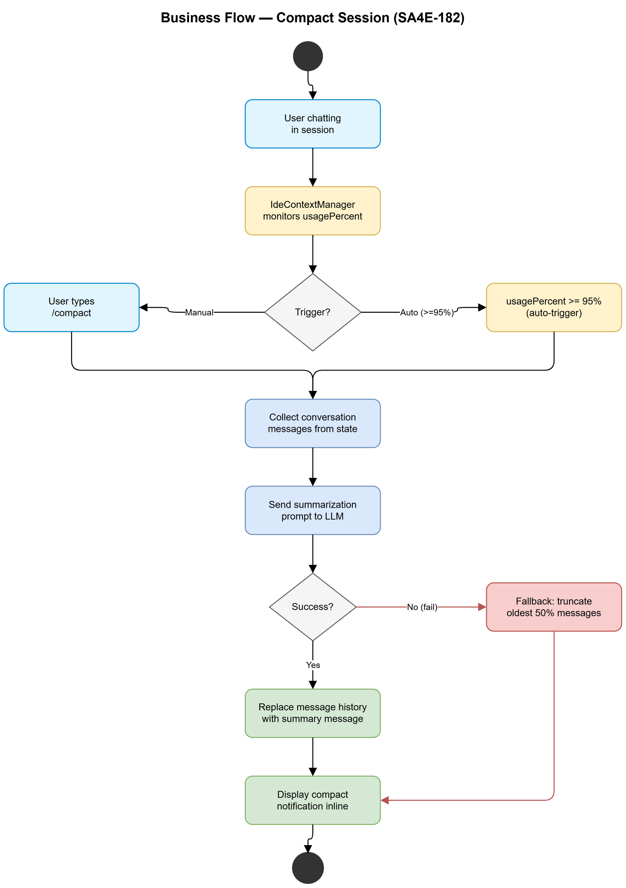
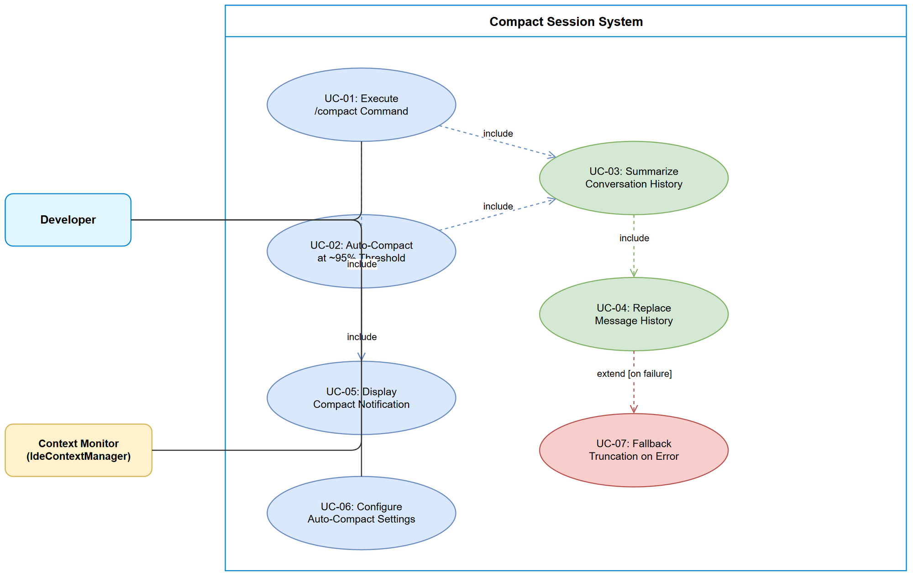

# Business Requirements Document (BRD)

## SDLC-Agents-4-Enterprise — SA4E-182: Compact Session

---

## Document Information

| Field | Value |
|-------|-------|
| Jira Ticket | SA4E-182 |
| Title | Compact Session — Giảm Context Trong Cùng Chat Session |
| Author | BA Agent |
| Version | 1.0 |
| Date | 2026-08-19 |
| Status | Draft |

---

## Author Tracking

| Role | Name - Position | Responsibility |
|------|-----------------|----------------|
| Author | BA Agent – Business Analyst | Create document |
| Peer Reviewer | TA Agent – Technical Architect | Review document |

---

## Revision History

| Version | Date | Author | Changes |
|---------|------|--------|---------|
| 1.0 | 2026-08-19 | BA Agent | Initiate document — auto-generated from Jira ticket SA4E-182 and CHAT-MODULE-PARITY-DISCUSSION.md (Gap F1) |

---

## Sign-Off

| Name | Signature and date |
|------|--------------------|
| | ☐ I agree and confirm all criteria on this BRD as expected requirements |
| | ☐ I agree and confirm all criteria on this BRD as expected requirements |

---

## 1. Introduction

### 1.1 Scope

Feature "Compact Session" cho phép giảm context usage trong cùng một chat session bằng cách summarize toàn bộ conversation history thành summary ngắn gọn, replace message history cũ, và tiếp tục chat trên cùng session. Feature bao gồm 2 mode:

1. **Manual compact** — User gõ `/compact` command
2. **Auto-compact** — Tự động trigger khi context usage đạt ~95% capacity

Feature này đảm bảo conversation không bị interrupted do context window overflow, đồng thời giữ lại knowledge quan trọng từ cuộc hội thoại trước đó.

### 1.2 Out of Scope

- Tạo session mới (đã có `SessionManager`)
- Context file pruning (đã có `pruningAlgorithm.ts`)
- Cross-session memory (đã có KB-backed persistence)
- Token budget management cho SDLC pipeline (đã có trong SM steering)
- Thay đổi context window size của LLM model

### 1.3 Preliminary Requirement

| # | Prerequisite | Status |
|---|-------------|--------|
| 1 | `IdeContextManager` tracks token usage + usagePercent | ✅ Đã có |
| 2 | `pruningAlgorithm.ts` có suggest prune logic | ✅ Đã có |
| 3 | `SessionManager` quản lý KB-backed threads | ✅ Đã có |
| 4 | LangGraph `buildChatSubgraph` compiles graph 1 lần per session | ✅ Đã có |
| 5 | `SlashMenuController` hỗ trợ slash commands | ✅ Đã có |

---

## 2. Business Requirements

### 2.1 High Level Process Map

Compact Session là cơ chế quản lý context window lifecycle trong một chat session đang chạy. Khi context đầy hoặc user chủ động yêu cầu, hệ thống sẽ:

1. Thu thập toàn bộ conversation history hiện tại
2. Gửi tới LLM để summarize thành summary ngắn gọn
3. Replace message history cũ bằng summary message
4. Tiếp tục session với context đã được giảm tải

Hai trigger paths:
- **Manual:** User → `/compact` → Summarize → Replace → Continue
- **Auto:** Context monitor → Detect 95% → Auto-summarize → Replace → Continue

### 2.2 List of User Stories / Use Cases

| # | Story / Use Case | Priority | Source |
|---|------------------|----------|--------|
| 1 | As a developer, I want to manually compact my chat session so that I can continue a long conversation without losing context | MUST HAVE | SA4E-182 / Gap F1(a) |
| 2 | As a developer, I want the system to auto-compact when context is nearly full so that my session doesn't crash or truncate | MUST HAVE | SA4E-182 / Gap F1(b) |
| 3 | As a developer, I want to see a notification when auto-compact occurs so that I know my context was summarized | SHOULD HAVE | SA4E-182 |
| 4 | As a developer, I want to configure auto-compact behavior (enable/disable, threshold) so that I have control over when it triggers | SHOULD HAVE | SA4E-182 |
| 5 | As a developer, I want the compact summary to preserve key decisions and code changes so that the LLM can continue effectively | MUST HAVE | SA4E-182 |

---

### 2.3 Details of User Stories

---

#### Business Flow

**Step 1:** User đang chat trong session — messages tích lũy, context usage tăng dần

**Step 2a (Manual):** User gõ `/compact` → system trigger compact process
**Step 2b (Auto):** `IdeContextManager` detect usagePercent >= 95% → system auto-trigger compact

**Step 3:** System thu thập toàn bộ conversation messages từ current session state

**Step 4:** System gửi summarization prompt tới LLM kèm conversation history

**Step 5:** LLM trả về summary ngắn gọn (giữ key decisions, code changes, file paths, open tasks)

**Step 6:** System replace message history cũ bằng 1 system message chứa summary

**Step 7:** Context usage giảm xuống < 50% capacity

**Step 8:** User tiếp tục chat trên cùng session, LLM có đầy đủ context từ summary

> **Note:** Auto-compact KHÔNG hỏi user confirmation — thực hiện tự động để tránh context overflow. User được thông báo sau khi compact xong.

---

#### STORY 1: Manual Compact via `/compact` Command

> As a developer, I want to manually compact my chat session so that I can continue a long conversation without losing context.

**Requirement Details:**

1. Đăng ký `/compact` slash command trong `SlashMenuController`
2. Khi user gõ `/compact` và submit, system summarize toàn bộ conversation history
3. Summary được LLM generate dựa trên structured prompt (giữ key info)
4. Message history trong LangGraph state được replace bằng summary
5. Session thread_id KHÔNG đổi — user vẫn ở cùng session
6. Context usage sau compact phải < 50% max capacity

**Acceptance Criteria:**

1. GIVEN session có >= 3 messages, WHEN user gõ `/compact`, THEN conversation được summarize thành 1 system message
2. GIVEN compact thành công, THEN context usagePercent giảm >= 50% so với trước compact
3. GIVEN compact thành công, THEN user thấy notification "Session compacted — {X}% → {Y}% context usage"
4. GIVEN compact thành công, THEN session thread_id không đổi, user tiếp tục chat bình thường
5. GIVEN session chỉ có 1-2 messages, WHEN user gõ `/compact`, THEN hiển thị message "Not enough context to compact"
6. GIVEN compact đang chạy, THEN hiển thị loading indicator "Compacting session..."

---

#### STORY 2: Auto-Compact at ~95% Context Capacity

> As a developer, I want the system to auto-compact when context is nearly full so that my session doesn't crash or truncate.

**Requirement Details:**

1. `IdeContextManager` (hoặc LangGraph node) monitor usagePercent liên tục
2. Khi usagePercent >= 95% (configurable threshold), tự động trigger compact
3. Auto-compact sử dụng cùng summarization logic với manual compact
4. User được thông báo sau khi auto-compact xong (không hỏi trước)
5. Auto-compact chỉ trigger 1 lần per threshold crossing (không loop)
6. Nếu auto-compact fail → graceful degradation: truncate oldest messages

**Acceptance Criteria:**

1. GIVEN context usagePercent vượt 95%, THEN system tự động trigger compact process
2. GIVEN auto-compact trigger, THEN user thấy notification "Auto-compacted: context was at {X}%, now at {Y}%"
3. GIVEN auto-compact đang chạy, THEN không trigger thêm auto-compact lần nữa (debounce)
4. GIVEN auto-compact fail (LLM error), THEN fallback truncate oldest 50% messages + notify user
5. GIVEN user đã disable `autoCompact` config, THEN system KHÔNG auto-compact dù context >= 95%
6. GIVEN auto-compact thành công, THEN session_id không đổi, conversation tiếp tục seamless

---

#### STORY 3: Compact Notification UI

> As a developer, I want to see a notification when auto-compact occurs so that I know my context was summarized.

**Requirement Details:**

1. Hiển thị inline notification trong chat panel (không phải VS Code toast)
2. Notification format: `🗜️ Session compacted — {before}% → {after}% context usage`
3. Notification xuất hiện giữa messages (system message type)
4. Compact summary có thể expand/collapse để user xem chi tiết

**Acceptance Criteria:**

1. GIVEN compact thành công (manual hoặc auto), THEN hiển thị compact notification inline
2. GIVEN notification hiển thị, THEN user có thể click expand để xem full summary
3. GIVEN notification hiển thị, WHEN user scroll lên, THEN notification vẫn visible trong history

---

#### STORY 4: Configuration for Auto-Compact

> As a developer, I want to configure auto-compact behavior so that I have control over when it triggers.

**Requirement Details:**

1. Setting `sa4e.chat.autoCompact` — boolean, default: `true`
2. Setting `sa4e.chat.autoCompactThreshold` — number (0-100), default: `95`
3. Settings phải reactive — thay đổi có hiệu lực ngay, không cần restart
4. Settings accessible qua VS Code Settings UI và `settings.json`

**Data Fields:**

| Field | Type | Required | Description | Default |
|-------|------|----------|-------------|---------|
| `sa4e.chat.autoCompact` | boolean | No | Enable/disable auto-compact | `true` |
| `sa4e.chat.autoCompactThreshold` | number | No | % threshold to trigger auto-compact (80-99) | `95` |

**Acceptance Criteria:**

1. GIVEN `autoCompact = false`, WHEN context >= 95%, THEN system does NOT auto-compact
2. GIVEN `autoCompactThreshold = 90`, WHEN context reaches 90%, THEN auto-compact triggers
3. GIVEN user changes setting, THEN new value takes effect immediately without session restart

---

#### STORY 5: Summary Quality — Preserve Key Information

> As a developer, I want the compact summary to preserve key decisions and code changes so that the LLM can continue effectively.

**Requirement Details:**

1. Summary PHẢI giữ lại: file paths đã thay đổi, key decisions, code snippets quan trọng, error patterns đã debug, open tasks/next steps
2. Summary PHẢI structured (không phải free-form paragraph)
3. Summary sử dụng summarization prompt template tuned cho code conversations
4. Summary size target: ~10-15% of original conversation tokens

**Acceptance Criteria:**

1. GIVEN conversation có file edits, THEN summary liệt kê tất cả file paths đã sửa
2. GIVEN conversation có decisions/conclusions, THEN summary capture chúng dưới dạng bullet points
3. GIVEN conversation có errors đã debug, THEN summary ghi nhận root cause + fix
4. GIVEN summary generated, THEN LLM có thể trả lời "bạn đã sửa gì?" chính xác từ summary
5. GIVEN summary size, THEN summary <= 15% tokens so với original conversation

---

## 3. Dependencies

| Dependency | Type | Related Ticket | Description |
|------------|------|----------------|-------------|
| IdeContextManager | System (existing) | SA4E-85 | Cung cấp usagePercent, token tracking, state change events |
| pruningAlgorithm | System (existing) | SA4E-85 | Cung cấp logic tính toán threshold, có thể reuse cho compact |
| SessionManager | System (existing) | SA4E-85 | Quản lý KB-backed threads, cần persist compact event |
| LangGraph Chat Subgraph | System (existing) | SA4E-85 | Graph state chứa messages[], cần hook vào state mutation |
| SlashMenuController | System (existing) | SA4E-85 | Đăng ký `/compact` slash command |
| Anthropic LLM API | External | N/A | Gọi summarization (qua existing LlmProvider) |
| StreamHandler | System (existing) | SA4E-85 | Stream compact progress tới UI |

---

## 4. Stakeholders

| Role | Name / Team | Responsibility | Source |
|------|-------------|----------------|--------|
| Product Owner | User | Define acceptance criteria, approve feature | Ticket creator |
| Technical Architect | TA Agent | Review FSD technical feasibility | Pipeline |
| Solution Architect | SA Agent | Design TDD architecture | Pipeline |
| Developer | DEV Agent | Implement feature | Pipeline |
| QA | QA Agent | Test feature | Pipeline |

---

## 5. Risks and Assumptions

### 5.1 Risks

| Risk | Impact | Likelihood | Mitigation |
|------|--------|------------|------------|
| Summary mất thông tin quan trọng | High | Medium | Structured summarization prompt + user có thể xem full summary |
| Auto-compact trigger quá sớm (threshold quá thấp) | Medium | Low | Configurable threshold, default 95% — high enough |
| LLM summarization call timeout/fail | High | Low | Fallback: truncate oldest messages, notify user |
| Context usage calculation bị sai do token estimation | Medium | Medium | Dùng tiktoken hoặc actual model tokenizer |
| LangGraph state mutation gây inconsistency | High | Low | Atomic state update, test thoroughly |
| Auto-compact race condition (trigger twice) | Medium | Medium | Debounce flag + threshold crossing detection |

### 5.2 Assumptions

- LLM model hỗ trợ summarization tốt (Claude, GPT-4 level)
- Context window max tokens đã được track chính xác bởi `IdeContextManager`
- LangGraph state cho phép modify messages array mid-session
- User chấp nhận compact là irreversible (không undo)
- Summary ~10-15% original size là đủ cho LLM tiếp tục hiệu quả

---

## 6. Non-Functional Requirements

| Category | Requirement | Details |
|----------|-------------|---------|
| Performance | Compact phải hoàn thành < 10 giây | Summarization call + state replacement |
| Performance | Auto-compact detection latency < 500ms | Từ lúc vượt threshold tới trigger |
| Reliability | Fallback khi summarization fail | Truncate oldest 50% messages thay vì crash |
| UX | Compact notification inline | Không block user workflow, informational only |
| Security | Summary không expose sensitive data | Không include secrets/tokens trong summary |
| Scalability | Hoạt động với conversation lên tới 200K tokens | Full context window of Claude 3.5 |
| Observability | Log compact events (before/after token count) | Telemetry integration |

---

## 7. Related Tickets

| Ticket Key | Summary | Status | Type | Relationship |
|------------|---------|--------|------|--------------|
| SA4E-182 | Compact Session | To Do | Story | Main ticket |
| SA4E-85 | Chat Module — Context Management | Done | Epic | Parent (provides IdeContextManager, SessionManager) |

---

## 8. Appendix

### Use Case Diagram

### Glossary

| Term | Definition |
|------|------------|
| Compact | Quá trình summarize conversation history để giảm context usage |
| Context Window | Giới hạn token mà LLM model có thể xử lý trong 1 request |
| Auto-compact | Cơ chế tự động trigger compact khi context usage vượt threshold |
| Summary | Bản tóm tắt ngắn gọn giữ lại key information từ conversation |
| Session | Một phiên chat liên tục, identified bởi thread_id trong KB |
| usagePercent | Tỷ lệ % context đang sử dụng so với max capacity |

### Reference Documents

| Document | Link / Location |
|----------|-----------------|
| CHAT-MODULE-PARITY-DISCUSSION.md | documents/CHAT-MODULE-PARITY-DISCUSSION.md |
| OpenCode autoCompact reference | https://github.com/opencode-ai/opencode |
| Claude Code auto-compaction | https://docs.anthropic.com/claude-code |
| IdeContextManager source | extension/src/chat/context/IdeContextManager.ts |
| pruningAlgorithm source | extension/src/chat/context/pruningAlgorithm.ts |
| SessionManager source | extension/src/chat/engine/SessionManager.ts |

### Diagram Index

| # | Diagram | Image | Source (editable) |
|---|---------|-------|-------------------|
| 1 | Business Flow | [business-flow.png](diagrams/business-flow.png) | [business-flow.drawio](diagrams/business-flow.drawio) |
| 2 | Use Case | [use-case.png](diagrams/use-case.png) | [use-case.drawio](diagrams/use-case.drawio) |
