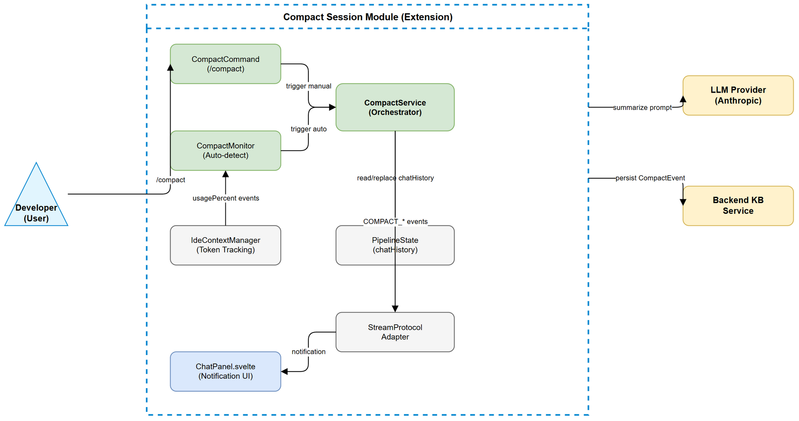
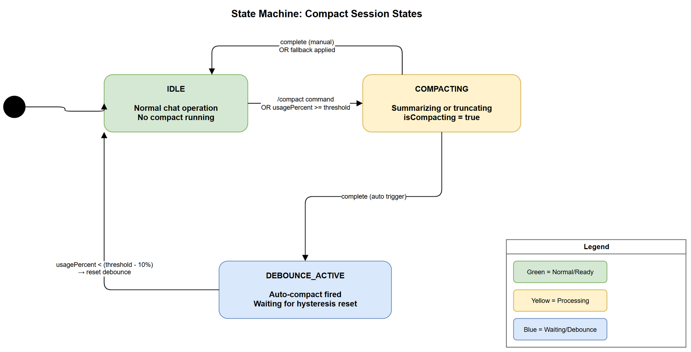
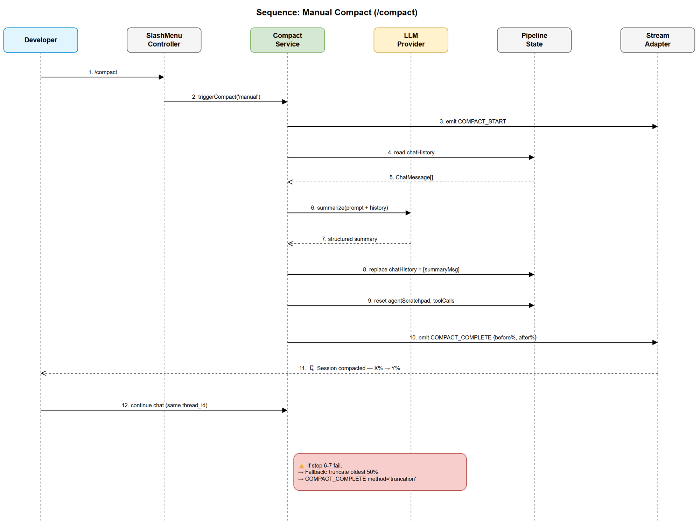
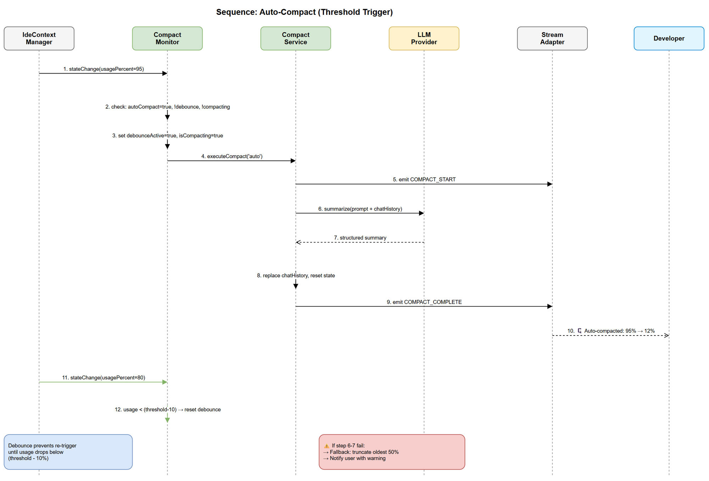

# Functional Specification Document (FSD)

## SDLC-Agents-4-Enterprise — SA4E-182: Compact Session

---

## Document Information

| Field | Value |
|-------|-------|
| Jira Ticket | SA4E-182 |
| Title | Compact Session — Giảm Context Trong Cùng Chat Session |
| Author | BA Agent |
| Version | 1.0 |
| Date | 2026-08-19 |
| Status | Draft |
| Related BRD | documents/SA4E-182/BRD.md |

---

## Author Tracking

| Role | Name - Position | Responsibility |
|------|-----------------|----------------|
| Author | BA Agent – Business Analyst | Create document |
| Peer Reviewer | TA Agent – Technical Architect | Review and enrich document |

---

## Revision History

| Version | Date | Author | Changes |
|---------|------|--------|---------|
| 1.0 | 2026-08-19 | BA Agent | Initiate document — translated from BRD SA4E-182 |

---

## 1. Introduction

### 1.1 Purpose

FSD này mô tả chi tiết functional behavior của feature Compact Session — cho phép giảm context usage trong cùng một chat session bằng cách summarize conversation history thành summary ngắn gọn, replace message history, và tiếp tục chat seamlessly.

### 1.2 Scope

- Manual compact via `/compact` slash command
- Auto-compact khi context usage đạt configurable threshold (default 95%)
- Summarization logic (structured summary preserving key information)
- State replacement trong LangGraph pipeline state
- Inline notification UI trong chat panel
- Configuration settings cho auto-compact behavior
- Fallback truncation khi summarization fail

### 1.3 Definitions & Acronyms

| Term | Definition |
|------|------------|
| Compact | Quá trình summarize conversation history để giảm context usage |
| Context Window | Giới hạn token mà LLM model xử lý trong 1 request |
| Auto-compact | Cơ chế tự động trigger compact khi usage vượt threshold |
| usagePercent | Tỷ lệ % context đang sử dụng vs max capacity (`IdeContextManager.getState().usagePercent`) |
| chatHistory | LangGraph `PipelineState.chatHistory` channel — chứa `ChatMessage[]` |
| Summary | Bản tóm tắt structured giữ key information từ conversation |
| thread_id | Unique identifier cho KB-backed session thread |

### 1.4 References

| Document | Location |
|----------|----------|
| BRD | documents/SA4E-182/BRD.md |
| Project Structure | .analysis/code-intelligence/project-structure.md |
| Extension Knowledge | .analysis/code-intelligence/modules/extension-knowledge.md |
| IdeContextManager | extension/src/chat/context/IdeContextManager.ts |
| pruningAlgorithm | extension/src/chat/context/pruningAlgorithm.ts |
| SessionManager | extension/src/chat/engine/SessionManager.ts |
| LangGraph State | extension/src/langgraph/core/state.ts |
| SlashMenuController | extension/src/webview/slash-menu/SlashMenuController.ts |

---

## 2. System Overview

### 2.1 System Context Diagram



**Actors:**
- **Developer (User):** Gõ `/compact` command hoặc nhận auto-compact notification
- **LLM Provider (Anthropic):** Nhận summarization prompt, trả về structured summary
- **Backend KB Service:** Persist compact events vào thread history

**System Boundary — Compact Session Module:**
- CompactService: orchestrate summarization + state replacement
- CompactMonitor: theo dõi context usage, trigger auto-compact
- CompactCommand: handle `/compact` slash command registration

### 2.2 System Architecture (Functional View)

Compact Session tích hợp vào existing extension architecture:

| Layer | Component | Integration Point |
|-------|-----------|-------------------|
| UI | ChatPanel.svelte | Hiển thị compact notification + expand/collapse summary |
| Command | SlashMenuController | Đăng ký `/compact` command item |
| Engine | CompactService (new) | Orchestrate summarize + replace flow |
| Monitor | CompactMonitor (new) | Subscribe `IdeContextManager` state changes |
| State | PipelineState.chatHistory | Message array bị replace bởi summary |
| Persist | SessionManager + KB | Persist compact event vào thread |
| LLM | LlmProvider | Gọi summarization via existing provider |

---

## 3. Functional Requirements

### 3.1 Feature: Manual Compact Command

**Source:** BRD Story 1

#### 3.1.1 Description

User gõ `/compact` trong chat input. System summarize toàn bộ `chatHistory` thành 1 structured summary message, replace message array trong PipelineState, và tiếp tục session trên cùng thread_id.

#### 3.1.2 Use Case UC-01: Manual Compact via `/compact`

**Use Case ID:** UC-01
**Actor:** Developer
**Preconditions:**
- Session đang active (thread_id resolved)
- chatHistory có >= 3 messages
- Không có compact đang chạy (no concurrent compact)

**Postconditions:**
- chatHistory chỉ còn 1 system message (summary)
- usagePercent giảm >= 50% so với trước compact
- thread_id không đổi
- Compact notification hiển thị inline

**Main Flow:**

| Step | Actor | System | Description |
|------|-------|--------|-------------|
| 1 | Gõ `/compact` và submit | | User triggers compact command |
| 2 | | Validate preconditions | Check >= 3 messages, no concurrent compact |
| 3 | | Show loading indicator | "Compacting session..." inline trong chat |
| 4 | | Collect chatHistory | Thu thập toàn bộ messages từ PipelineState |
| 5 | | Build summarization prompt | Kết hợp system prompt + conversation messages |
| 6 | | Call LLM summarize | Gọi LlmProvider với summarization prompt |
| 7 | | Parse summary response | Extract structured summary từ LLM response |
| 8 | | Replace chatHistory | Atomic replace messages bằng 1 summary ChatMessage |
| 9 | | Persist compact event | Lưu compact metadata vào KB thread |
| 10 | | Show notification | "🗜️ Session compacted — {before}% → {after}% context usage" |
| 11 | Tiếp tục chat | | User gửi message mới, LLM có đủ context từ summary |

**Alternative Flows:**

| ID | Condition | Steps |
|----|-----------|-------|
| AF-01 | chatHistory < 3 messages | Step 2 → Show "Not enough context to compact" → End |
| AF-02 | Compact đang chạy (concurrent request) | Step 2 → Show "Compact already in progress" → End |

**Exception Flows:**

| ID | Condition | Steps |
|----|-----------|-------|
| EF-01 | LLM summarization timeout (>10s) | Step 6 → Execute fallback truncation (UC-07) → Show warning notification |
| EF-02 | LLM returns malformed response | Step 7 → Execute fallback truncation (UC-07) → Show warning notification |
| EF-03 | KB persist failure | Step 9 → Log error, continue (non-blocking) — compact still succeeds locally |

---

### 3.2 Feature: Auto-Compact at Threshold

**Source:** BRD Story 2

#### 3.2.1 Use Case UC-02: Auto-Compact at Threshold

**Use Case ID:** UC-02
**Actor:** System (CompactMonitor)
**Preconditions:**
- `sa4e.chat.autoCompact` = true
- usagePercent >= `sa4e.chat.autoCompactThreshold` (default 95)
- Không có compact đang chạy
- Auto-compact chưa trigger trong lần threshold crossing này (debounce)

**Postconditions:**
- chatHistory replaced bằng summary
- usagePercent giảm < 50%
- User thấy auto-compact notification
- Debounce flag set (reset khi usage drops below threshold - 10%)

**Main Flow:**

| Step | Actor | System | Description |
|------|-------|--------|-------------|
| 1 | | CompactMonitor detects threshold | Subscribe IdeContextManager state changes |
| 2 | | Check debounce flag | Nếu already triggered cho lần crossing này → skip |
| 3 | | Set compacting flag | Prevent concurrent triggers |
| 4 | | Execute compact (same as UC-01 steps 4-9) | Reuse CompactService |
| 5 | | Show auto-compact notification | "🗜️ Auto-compacted: context was at {X}%, now at {Y}%" |
| 6 | | Set debounce flag | Prevent re-trigger until usage drops below threshold - 10% |

**Alternative Flows:**

| ID | Condition | Steps |
|----|-----------|-------|
| AF-01 | autoCompact config = false | Step 1 → No monitoring → End |
| AF-02 | chatHistory < 3 messages tại threshold | Step 2 → Skip auto-compact, log warning → End |

**Exception Flows:**

| ID | Condition | Steps |
|----|-----------|-------|
| EF-01 | LLM summarization fails | Step 4 → Execute fallback truncation (UC-07) → Show warning |

---

### 3.3 Feature: Summarize Conversation History

**Source:** BRD Story 5

#### 3.3.1 Use Case UC-03: Summarize Conversation History

**Use Case ID:** UC-03
**Actor:** System (CompactService)
**Preconditions:**
- chatHistory có >= 3 messages
- LlmProvider available

**Postconditions:**
- Summary generated, structured format
- Summary size <= 15% of original conversation tokens

**Main Flow:**

| Step | Actor | System | Description |
|------|-------|--------|-------------|
| 1 | | Build summarization prompt | Template + full chatHistory serialized |
| 2 | | Call LlmProvider | Send prompt, receive response |
| 3 | | Parse response | Extract structured summary sections |
| 4 | | Validate summary | Check has required sections, size <= 15% original |
| 5 | | Return summary | CompactSummary object |

**Summarization Prompt Template (Business Logic):**

```
You are a conversation summarizer for a code assistant. Summarize the conversation below into a structured format.

PRESERVE:
- All file paths that were created, edited, or discussed
- Key technical decisions and their rationale
- Error patterns debugged and their root causes + fixes
- Open tasks and next steps
- Code snippets critical for continuing work
- Architecture decisions

DO NOT INCLUDE:
- Secrets, API keys, tokens, passwords
- Redundant greetings or acknowledgments
- Duplicate information

FORMAT:
## Summary
### Files Modified
- {path}: {what changed}

### Key Decisions
- {decision}: {rationale}

### Errors Resolved
- {error}: {root cause} → {fix}

### Open Tasks
- {task description}

### Critical Context
- {any other important info for continuation}

CONVERSATION:
{serialized chatHistory}
```

---

### 3.4 Feature: Replace Message History with Summary

**Source:** BRD Story 1 (core mechanism)

#### 3.4.1 Use Case UC-04: Replace Message History with Summary

**Use Case ID:** UC-04
**Actor:** System (CompactService)
**Preconditions:**
- Summary generated successfully (from UC-03)
- Current PipelineState accessible

**Postconditions:**
- chatHistory = [summaryMessage] (1 system message)
- agentScratchpad reset to []
- toolCalls reset to null
- toolResults reset to []

**Main Flow:**

| Step | Actor | System | Description |
|------|-------|--------|-------------|
| 1 | | Create summary ChatMessage | role: 'system', content: summary, metadata: { type: 'compact_summary', beforeTokens, afterTokens, timestamp } |
| 2 | | Atomic state update | Replace chatHistory channel with [summaryMessage] |
| 3 | | Reset agent scratchpad | Clear agentScratchpad, toolCalls, toolResults |
| 4 | | Update context metrics | Recalculate usagePercent after replacement |
| 5 | | Emit state change event | Notify UI of new chatHistory |

---

### 3.5 Feature: Compact Notification UI

**Source:** BRD Story 3

#### 3.5.1 Use Case UC-05: Display Compact Notification

**Use Case ID:** UC-05
**Actor:** System (ChatPanel UI)
**Preconditions:**
- Compact completed (success or fallback)

**Postconditions:**
- Inline notification visible in chat history
- Summary expandable/collapsible

**Main Flow:**

| Step | Actor | System | Description |
|------|-------|--------|-------------|
| 1 | | Receive compact event via stream | COMPACT_COMPLETE event with before/after metrics |
| 2 | | Render inline notification | "🗜️ Session compacted — {before}% → {after}% context usage" |
| 3 | | Render expandable summary | Collapsed by default, click to expand full summary text |
| 4 | User clicks expand | | User wants to see summary details |
| 5 | | Show full summary | Expand section reveals structured summary content |

---

### 3.6 Feature: Configure Auto-Compact Settings

**Source:** BRD Story 4

#### 3.6.1 Use Case UC-06: Configure Auto-Compact Settings

**Use Case ID:** UC-06
**Actor:** Developer
**Preconditions:**
- VS Code Settings UI or settings.json accessible

**Postconditions:**
- Settings persisted
- Changes take effect immediately (no restart required)

**Main Flow:**

| Step | Actor | System | Description |
|------|-------|--------|-------------|
| 1 | Open VS Code Settings | | User navigates to settings |
| 2 | Search "sa4e.chat" | | Filter compact-related settings |
| 3 | Modify autoCompact or threshold | | User changes value |
| 4 | | Detect config change | `workspace.onDidChangeConfiguration` event |
| 5 | | Update CompactMonitor | Apply new threshold / enable/disable monitoring |

---

### 3.7 Feature: Fallback Truncation on Error

**Source:** BRD Story 2 AC-4

#### 3.7.1 Use Case UC-07: Fallback Truncation on Error

**Use Case ID:** UC-07
**Actor:** System (CompactService)
**Preconditions:**
- Summarization failed (LLM error, timeout, malformed response)
- chatHistory has messages to truncate

**Postconditions:**
- Oldest 50% messages removed
- usagePercent reduced
- User notified of fallback behavior

**Main Flow:**

| Step | Actor | System | Description |
|------|-------|--------|-------------|
| 1 | | Detect summarization failure | LLM timeout/error/malformed |
| 2 | | Calculate truncation point | Remove oldest 50% of messages |
| 3 | | Truncate chatHistory | Keep newest 50% messages |
| 4 | | Insert truncation notice | System message: "⚠️ Summarization failed. Oldest messages truncated to free context." |
| 5 | | Persist truncation event | Log to KB thread |
| 6 | | Show warning notification | "⚠️ Could not summarize — truncated oldest messages" |

---

### 3.8 Business Rules

| Rule ID | Rule | Source | Enforcement |
|---------|------|--------|-------------|
| BR-01 | Compact requires >= 3 messages in chatHistory | BRD Story 1 AC-5 | CompactService validates before execution |
| BR-02 | Post-compact usagePercent MUST be < 50% of pre-compact value | BRD Story 1 AC-2 | CompactService validates summary size |
| BR-03 | thread_id MUST NOT change after compact | BRD Story 1 AC-4 | CompactService preserves thread identity |
| BR-04 | Auto-compact threshold default = 95%, configurable 80-99 | BRD Story 2, Story 4 | VS Code settings validation |
| BR-05 | Auto-compact triggers ONCE per threshold crossing (debounce) | BRD Story 2 AC-3 | CompactMonitor flag management |
| BR-06 | Auto-compact does NOT ask user confirmation | BRD Story 2 | CompactMonitor auto-executes |
| BR-07 | Fallback truncation removes oldest 50% messages on error | BRD Story 2 AC-4 | CompactService error handler |
| BR-08 | Summary MUST preserve: file paths, decisions, errors, open tasks | BRD Story 5 | Summarization prompt template |
| BR-09 | Summary size target <= 15% of original conversation tokens | BRD Story 5 AC-5 | CompactService validates |
| BR-10 | Compact notification is inline (not VS Code toast) | BRD Story 3 | Stream event → ChatPanel render |
| BR-11 | Settings changes take effect immediately (no restart) | BRD Story 4 AC-3 | onDidChangeConfiguration reactive |
| BR-12 | Compact MUST complete < 10 seconds | BRD NFR | Timeout on LLM call |
| BR-13 | Auto-compact detection latency < 500ms | BRD NFR | CompactMonitor subscription efficient |
| BR-14 | Summary must NOT include secrets/tokens | BRD NFR Security | Summarization prompt instruction |
| BR-15 | Debounce resets when usage drops below (threshold - 10%) | Design decision | Prevent oscillation |

---

## 4. Data Model

### 4.1 Logical Entities

#### Entity: CompactEvent

Represents a compact operation persisted to KB thread.

| Attribute | Type | Required | Business Rule | Description |
|-----------|------|----------|---------------|-------------|
| id | UUID v4 | Y | — | Unique compact event ID |
| threadId | UUID v4 | Y | BR-03 | KB thread ID (unchanged) |
| trigger | enum('manual','auto') | Y | — | How compact was triggered |
| method | enum('summary','truncation') | Y | BR-07 | Which compaction method used |
| beforeTokens | number | Y | — | Token count before compact |
| afterTokens | number | Y | BR-02 | Token count after compact |
| beforeMessageCount | number | Y | — | Messages before compact |
| summary | string | Conditional | BR-08 | Summary content (if method=summary) |
| createdAt | ISO datetime | Y | — | Timestamp of compact event |

**Relationships:**

| From Entity | To Entity | Cardinality | Description |
|-------------|-----------|-------------|-------------|
| CompactEvent | Thread (KB) | N:1 | Many compact events per thread over session lifetime |

#### Entity: CompactMonitorState (In-memory)

| Attribute | Type | Required | Description |
|-----------|------|----------|-------------|
| isCompacting | boolean | Y | Mutex flag — prevents concurrent compacts |
| lastThresholdCrossing | number or null | Y | Timestamp of last threshold crossing (debounce) |
| debounceActive | boolean | Y | Whether debounce is preventing re-trigger |

---

### 4.2 Data Specifications

#### Input Data — Compact Request

| Field | Type | Required | Validation | Description |
|-------|------|----------|------------|-------------|
| trigger | 'manual' or 'auto' | Y | Enum | How compact was initiated |
| chatHistory | ChatMessage[] | Y | length >= 3 | Current conversation messages |
| maxTokens | number | Y | > 0 | Max context window tokens |
| currentTokens | number | Y | >= 0 | Current token usage |

#### Output Data — Compact Result

| Field | Type | Description |
|-------|------|-------------|
| success | boolean | Whether compact (or fallback) succeeded |
| method | 'summary' or 'truncation' | Which method was used |
| summary | string | Generated summary text (for expand view) |
| beforeUsagePercent | number | Usage % before compact |
| afterUsagePercent | number | Usage % after compact |
| beforeTokens | number | Token count before |
| afterTokens | number | Token count after |
| messagesRemoved | number | How many messages were replaced/removed |
| timestamp | string (ISO) | When compact completed |

#### Configuration Data

| Field | Type | Required | Validation | Default |
|-------|------|----------|------------|---------|
| sa4e.chat.autoCompact | boolean | No | boolean | true |
| sa4e.chat.autoCompactThreshold | number | No | 80 <= x <= 99 | 95 |

---

## 5. Integration Specifications

### 5.1 Integration: IdeContextManager

| Attribute | Value |
|-----------|-------|
| Purpose | Token usage tracking — provides usagePercent and maxTokens |
| Direction | Inbound (read state + subscribe events) |
| Data Format | `ContextState { tokenCount, maxTokens, usagePercent, files, pruneSuggestions }` |
| Frequency | Real-time (subscribe to state changes via event emitter) |

**Data Exchange:**

| Our Data | External Data | Direction | Business Rule |
|----------|--------------|-----------|---------------|
| — | usagePercent | Receive | BR-04: Compare against threshold |
| — | tokenCount | Receive | BR-02: Calculate reduction ratio |
| — | maxTokens | Receive | BR-02: Determine capacity |

### 5.2 Integration: PipelineState (LangGraph)

| Attribute | Value |
|-----------|-------|
| Purpose | Access and mutate chatHistory messages array |
| Direction | Bidirectional |
| Data Format | `PipelineState.chatHistory: ChatMessage[]` (reducer: append + slice -200) |
| Frequency | On-demand (during compact execution) |

**Data Exchange:**

| Our Data | External Data | Direction | Business Rule |
|----------|--------------|-----------|---------------|
| Read chatHistory | ChatMessage[] | Receive | UC-03: Input for summarization |
| Write [summaryMessage] | ChatMessage[] | Send | UC-04: Replace with summary |
| Reset agentScratchpad | LlmMessage[] | Send | UC-04: Clear stale tool context |
| Reset toolCalls | LlmToolCall[] or null | Send | UC-04: Clear pending calls |
| Reset toolResults | Array | Send | UC-04: Clear tool results |

**Note:** `chatHistory` reducer is `(existing, update) => [...existing, ...update].slice(-200)`. For compact, state replacement must bypass the append-reducer to set absolute value.

### 5.3 Integration: LlmProvider

| Attribute | Value |
|-----------|-------|
| Purpose | Generate structured summary from conversation |
| Direction | Outbound (request/response) |
| Data Format | Prompt string → Summary string |
| Frequency | On-demand (per compact execution, max 1 concurrent) |

### 5.4 Integration: SessionManager + KB

| Attribute | Value |
|-----------|-------|
| Purpose | Persist compact event to thread history in KB |
| Direction | Outbound |
| Data Format | CompactEvent JSON → POST /api/v1/threads/{threadId}/messages |
| Frequency | On-demand (after each compact, best-effort) |

### 5.5 Integration: SlashMenuController

| Attribute | Value |
|-----------|-------|
| Purpose | Register `/compact` command in slash menu |
| Direction | Registration (one-time setup) |
| Data Format | Add item to `SLASH_AGENTS` or equivalent items array: `{ label: 'compact', description: 'Summarize and reduce context', icon: '🗜️', itemType: 'agent' }` |
| Frequency | Once at module initialization |

### 5.6 Integration: StreamProtocolAdapter

| Attribute | Value |
|-----------|-------|
| Purpose | Stream COMPACT_START/COMPLETE/ERROR events to webview ChatPanel |
| Direction | Outbound |
| Data Format | Typed stream events (same pattern as STREAM_START/TOKEN/ERROR) |
| Frequency | 2-3 events per compact execution |

---

## 6. Processing Logic

### 6.1 Process: Execute Compact

**Trigger:** `/compact` command OR auto-compact threshold crossing
**Input:** trigger type, current PipelineState
**Output:** CompactResult

**Processing Steps:**

| Step | Description | Error Handling |
|------|-------------|----------------|
| 1 | Acquire compact mutex (isCompacting = true) | If already true → reject with "already compacting" |
| 2 | Validate chatHistory.length >= 3 | If < 3 → reject with "not enough context" |
| 3 | Emit COMPACT_START stream event | N/A |
| 4 | Serialize chatHistory to text | Format each ChatMessage: `[{role}]: {content}` |
| 5 | Build summarization prompt (template + messages) | N/A |
| 6 | Call LlmProvider with 10s timeout | On timeout/error → goto fallback (step 10) |
| 7 | Parse and validate summary response | On malformed → goto fallback (step 10) |
| 8 | Validate summary size <= 15% original tokens | If too large → trim to 15% (best-effort) |
| 9 | Execute state replacement (UC-04) | On state error → goto fallback (step 10) |
| 10 | (Fallback) Truncate oldest 50% messages | Always succeeds — pure array operation |
| 11 | Recalculate usagePercent | N/A |
| 12 | Persist CompactEvent to KB | On KB error → log, continue (non-blocking) |
| 13 | Emit COMPACT_COMPLETE stream event | N/A |
| 14 | Release compact mutex (isCompacting = false) | Always in finally block |

**Pseudocode:**

```typescript
async function executeCompact(trigger: 'manual' | 'auto', state: PipelineState): Promise<CompactResult> {
  if (monitor.isCompacting) throw new CompactAlreadyRunningError();
  if (state.chatHistory.length < 3) throw new InsufficientMessagesError();

  monitor.isCompacting = true;
  try {
    emitStreamEvent({ type: 'COMPACT_START', trigger, currentUsagePercent });
    const beforeTokens = contextManager.getState().tokenCount;
    const serialized = serializeChatHistory(state.chatHistory);
    const prompt = buildSummarizationPrompt(serialized);

    let method: 'summary' | 'truncation';
    let newHistory: ChatMessage[];

    try {
      const summary = await llmProvider.call(prompt, { timeout: 10_000 });
      validateSummarySize(summary, beforeTokens);
      newHistory = [createSummaryMessage(summary, beforeTokens)];
      method = 'summary';
    } catch {
      // Fallback: truncate oldest 50%
      const midpoint = Math.ceil(state.chatHistory.length / 2);
      newHistory = state.chatHistory.slice(midpoint);
      newHistory.unshift(createTruncationNotice());
      method = 'truncation';
    }

    // Atomic state replacement
    await replaceState({ chatHistory: newHistory, agentScratchpad: [], toolCalls: null, toolResults: [] });

    const afterTokens = contextManager.getState().tokenCount;
    await persistCompactEvent({ trigger, method, beforeTokens, afterTokens, threadId: state.threadId });

    emitStreamEvent({ type: 'COMPACT_COMPLETE', method, beforeUsagePercent, afterUsagePercent, summary });
    return { success: true, method, beforeUsagePercent, afterUsagePercent, ... };
  } finally {
    monitor.isCompacting = false;
  }
}
```

### 6.2 Process: Auto-Compact Monitoring

**Trigger:** IdeContextManager state change event
**Schedule:** Reactive (event-driven, not polling)
**Input:** New ContextState
**Output:** Trigger compact execution OR no-op

**Processing Steps:**

| Step | Description | Error Handling |
|------|-------------|----------------|
| 1 | Receive state change event with new usagePercent | N/A |
| 2 | Check `sa4e.chat.autoCompact` setting | If disabled → return |
| 3 | Check usagePercent >= threshold | If below → check debounce reset (step 6) |
| 4 | Check debounce flag | If active → return |
| 5 | Trigger compact execution (trigger='auto') | On failure → fallback handles it |
| 6 | If usagePercent < (threshold - 10) AND debounce active → reset debounce | Hysteresis prevents oscillation |

**Pseudocode:**

```typescript
function onContextStateChange(newState: ContextState): void {
  const config = getAutoCompactConfig();
  if (!config.autoCompact) return;
  if (monitor.isCompacting) return;

  if (newState.usagePercent >= config.threshold) {
    if (!monitor.debounceActive) {
      monitor.debounceActive = true;
      executeCompact('auto', getCurrentPipelineState());
    }
  } else if (newState.usagePercent < (config.threshold - 10)) {
    // Hysteresis: reset debounce when usage drops significantly
    monitor.debounceActive = false;
  }
}
```

---

## 7. Security Requirements

### 7.1 Authentication & Authorization

| Role | Permissions | Notes |
|------|-------------|-------|
| Developer (all users) | Full access to compact | No role restriction — feature available to all chat users |

### 7.2 Data Sensitivity Classification

| Data Type | Classification | Business Requirement |
|-----------|---------------|---------------------|
| Chat messages (input) | Internal | May contain code, credentials in examples |
| Summary output | Internal | BR-14: MUST NOT include detected secrets/tokens |
| Compact metrics | Internal | Token counts, timestamps — low sensitivity |

### 7.3 Security Measures

| Measure | Description |
|---------|-------------|
| Secret filtering | Summarization prompt instructs LLM to exclude secrets, API keys, tokens from summary |
| No external transmission | Summary stays within extension + KB (same security boundary as existing messages) |
| Prompt injection resistance | Summary stored as system message — prevents prompt injection via summary content |

---

## 8. Non-Functional Requirements

| Category | Business Requirement | Acceptance Criteria |
|----------|---------------------|---------------------|
| Performance | Compact completes quickly | Total compact time < 10 seconds (LLM call + state replacement) |
| Performance | Auto-compact detection is responsive | Detection latency < 500ms from threshold crossing to trigger |
| Reliability | Always reduces context | If summarization fails, fallback truncation ALWAYS succeeds |
| Scalability | Works with large conversations | Handle chatHistory up to 200K tokens (full Claude 3.5 context window) |
| UX | Non-disruptive | Inline notification only — no modal, no blocking dialog |
| UX | Informative | User always knows compact happened and can inspect result (expand) |
| Observability | Auditable | CompactEvent persisted to KB with before/after metrics |

---

## 9. Error Handling (User-Facing)

### 9.1 Error Scenarios

| Scenario | Severity | User Message | Expected Behavior |
|----------|----------|-------------|-------------------|
| Not enough messages | Info | "Not enough context to compact" | Informational — user continues normally |
| Compact already running | Info | "Compact already in progress" | User waits for current compact to finish |
| LLM timeout | Warning | "⚠️ Could not summarize — truncated oldest messages" | Fallback applied, user can continue |
| LLM error | Warning | "⚠️ Summarization failed, context reduced via truncation" | Fallback applied, user can continue |
| KB persist failure | Info | (No user message — silent) | Compact succeeds locally, KB persistence best-effort |
| Config invalid | Warning | VS Code settings validation error | Standard VS Code settings UI validation |

### 9.2 Notification Requirements

| Event | Who is Notified | Channel | Timing |
|-------|----------------|---------|--------|
| Manual compact complete | User | Inline chat notification | Immediate |
| Auto-compact complete | User | Inline chat notification | Immediate |
| Compact failed (fallback used) | User | Inline chat warning | Immediate |

---

## 10. State Machine — Compact Session States

### 10.1 State Diagram



### 10.2 States

| State | Description | Allowed Transitions |
|-------|-------------|---------------------|
| IDLE | Normal chat operation, no compact running | → COMPACTING (on trigger) |
| COMPACTING | Compact in progress (summarizing or truncating) | → IDLE (on complete/error handled) |
| DEBOUNCE_ACTIVE | Auto-compact fired for this threshold crossing, waiting for hysteresis reset | → IDLE (when usage drops below threshold - 10%) |

### 10.3 Transitions

| From | To | Trigger | Guard |
|------|-----|---------|-------|
| IDLE | COMPACTING | `/compact` command | chatHistory.length >= 3 |
| IDLE | COMPACTING | usagePercent >= threshold | autoCompact=true AND !debounceActive |
| COMPACTING | IDLE | Compact succeeds (manual) | trigger was 'manual' |
| COMPACTING | DEBOUNCE_ACTIVE | Compact succeeds (auto) | trigger was 'auto' |
| COMPACTING | IDLE | Compact fails + fallback applied | Always transitions back |
| DEBOUNCE_ACTIVE | IDLE | usagePercent < (threshold - 10) | Hysteresis reset |

---

## 11. Sequence Diagrams

### 11.1 Manual Compact Flow



### 11.2 Auto-Compact Flow



---

## 12. UI Specifications

### 12.1 Compact Notification Component

| No. | Element | Type | Required | Behavior | Validation |
|-----|---------|------|----------|----------|------------|
| 1 | Notification banner | div.compact-notification | Y | Inline between messages, icon 🗜️ | N/A |
| 2 | Usage change text | span | Y | "{before}% → {after}% context usage" | Numbers valid |
| 3 | Expand/collapse button | button | Y | Toggle summary visibility, aria-expanded attribute | N/A |
| 4 | Summary content | div.compact-summary-content | Y | Hidden by default, shows on expand | N/A |
| 5 | Loading indicator | div.compact-loading | Y | "Compacting session..." during process | Auto-hide on complete |
| 6 | Warning variant | div.compact-warning | Conditional | Yellow tint for fallback truncation | Only on error path |

### 12.2 Slash Command — `/compact` Item

| No. | Element | Type | Required | Behavior | Validation |
|-----|---------|------|----------|----------|------------|
| 1 | Menu item | SlashMenuItem | Y | Label: "compact", description: "Summarize and reduce context" | N/A |
| 2 | Icon | span.icon | Y | 🗜️ compress icon | N/A |

---

## 13. API Contract (Internal Events)

> **Note:** Compact Session operates entirely within the extension — no new REST endpoints needed. Communication uses stream events (extension → webview).

### 13.1 Stream Event: COMPACT_START

| Field | Type | Required | Description |
|-------|------|----------|-------------|
| type | 'COMPACT_START' | Y | Event type identifier |
| trigger | 'manual' or 'auto' | Y | How compact was initiated |
| currentUsagePercent | number | Y | Usage at time of trigger |

### 13.2 Stream Event: COMPACT_COMPLETE

| Field | Type | Required | Description |
|-------|------|----------|-------------|
| type | 'COMPACT_COMPLETE' | Y | Event type identifier |
| method | 'summary' or 'truncation' | Y | Method used |
| beforeUsagePercent | number | Y | Usage before compact |
| afterUsagePercent | number | Y | Usage after compact |
| summary | string | Y | Summary text (for expand view) |

### 13.3 Stream Event: COMPACT_ERROR

| Field | Type | Required | Description |
|-------|------|----------|-------------|
| type | 'COMPACT_ERROR' | Y | Event type identifier |
| error | string | Y | Error message |
| fallbackApplied | boolean | Y | Whether truncation fallback was applied |

---

## 14. Testing Considerations

### 14.1 Test Scenarios

| ID | Scenario | Input | Expected Output | Priority |
|----|----------|-------|-----------------|----------|
| TC-01 | Manual compact with sufficient messages | 10 messages, `/compact` | Summary replaces history, usage < 50% before | High |
| TC-02 | Manual compact with < 3 messages | 2 messages, `/compact` | "Not enough context" message | High |
| TC-03 | Auto-compact at 95% | usagePercent = 95 | Auto-trigger, notification shown | High |
| TC-04 | Auto-compact disabled | autoCompact=false, usage=95% | No compact triggered | High |
| TC-05 | Auto-compact debounce | Rapid usage fluctuation around threshold | Only 1 compact per crossing | High |
| TC-06 | Fallback truncation on LLM error | LLM returns error | Oldest 50% removed, warning shown | High |
| TC-07 | Summary preserves file paths | Conversation with file edits | Summary lists all edited files | Medium |
| TC-08 | Summary size <= 15% | Long conversation (100+ messages) | Summary tokens <= 15% original | Medium |
| TC-09 | Concurrent compact prevention | Two `/compact` requests | Second rejected | Medium |
| TC-10 | Config change reactive | Change threshold from 95 to 90 | New threshold active immediately | Medium |
| TC-11 | KB persist failure non-blocking | KB service down | Compact succeeds, error logged | Low |
| TC-12 | Thread_id unchanged after compact | Before/after compact | Same thread_id | High |
| TC-13 | Hysteresis debounce reset | Usage drops from 95% to 80% | Debounce flag resets | Medium |
| TC-14 | Summary excludes secrets | Conversation with API key mentioned | Summary does not contain the key value | High |

---

## 15. Appendix

### Diagram Index

| # | Diagram | Image | Source (editable) |
|---|---------|-------|-------------------|
| 1 | System Context | [system-context.png](diagrams/system-context.png) | [system-context.drawio](diagrams/system-context.drawio) |
| 2 | Sequence — Manual Compact | [sequence-manual-compact.png](diagrams/sequence-manual-compact.png) | [sequence-manual-compact.drawio](diagrams/sequence-manual-compact.drawio) |
| 3 | Sequence — Auto Compact | [sequence-auto-compact.png](diagrams/sequence-auto-compact.png) | [sequence-auto-compact.drawio](diagrams/sequence-auto-compact.drawio) |
| 4 | State — Compact States | [state-compact.png](diagrams/state-compact.png) | [state-compact.drawio](diagrams/state-compact.drawio) |

### Change Log from BRD

- UC-03 (Summarize) and UC-04 (Replace) separated into distinct use cases for clarity — BRD combined them
- Added debounce hysteresis logic (BR-15) — BRD mentioned "trigger once per crossing" without reset mechanism
- Added CompactMonitorState entity — needed for implementation, not explicit in BRD
- Added concurrent compact prevention (AF-02) — implied by BRD AC-3 but not explicitly stated as separate flow
- Clarified stream event types (COMPACT_START/COMPLETE/ERROR) for UI integration — BRD mentioned "notification" generically
- Added `agentScratchpad`, `toolCalls`, `toolResults` reset in UC-04 — necessary for clean state after compact
- Specified chatHistory reducer bypass requirement — existing append-reducer must be overridden for atomic replacement
