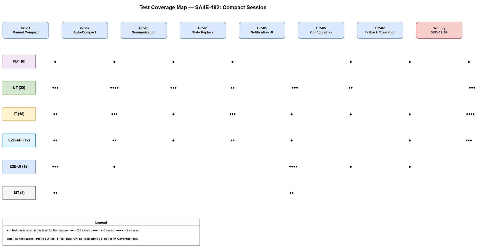
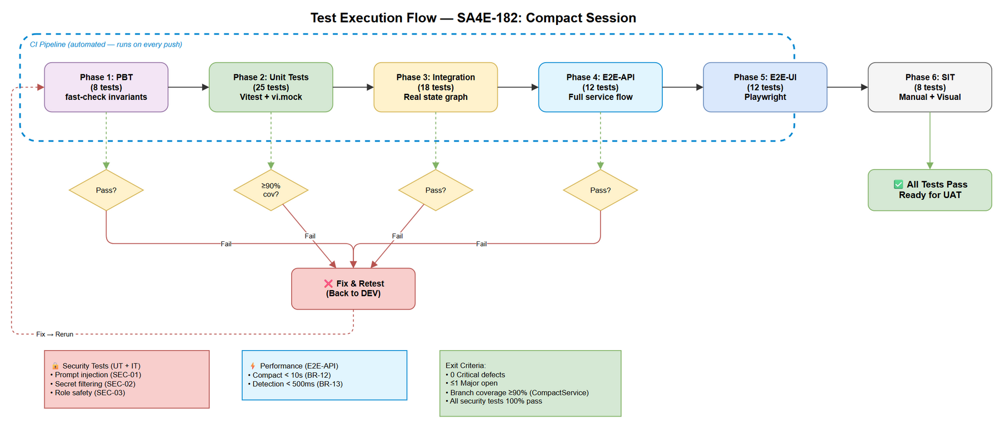

# Software Test Plan (STP)

## SDLC-Agents-4-Enterprise — SA4E-182: Compact Session

---

## Document Information

| Field | Value |
|-------|-------|
| Jira Ticket | SA4E-182 |
| Title | Compact Session — Giảm Context Trong Cùng Chat Session |
| Author | QA Agent |
| Version | 1.0 |
| Date | 2026-08-19 |
| Status | Draft |
| Related BRD | BRD-v1-SA4E-182.docx |
| Related FSD | FSD-v1-SA4E-182.docx |
| Related TDD | TDD-v1-SA4E-182.docx |

---

## Author Tracking

| Role | Name - Position | Responsibility |
|------|-----------------|----------------|
| Author | QA Agent – QA Engineer | Create document |
| Peer Reviewer | SA Agent – Solution Architect | Review document |

---

## Revision History

| Version | Date | Author | Changes |
|---------|------|--------|---------|
| 1.0 | 2026-08-19 | QA Agent | Initiate document — auto-generated from BRD, FSD, TDD, and SECURITY-REVIEW |

---

## Sign-Off

| Name | Signature and date |
|------|--------------------|
| | ☐ I agree and confirm the test plan in this STP |
| | ☐ I agree and confirm the test plan in this STP |

---

## 1. Introduction

### 1.1 Purpose

This test plan defines the testing strategy, scope, resources, and schedule for SA4E-182 (Compact Session). The feature enables context reduction within a chat session via manual `/compact` command or automatic threshold-based triggering. Testing must verify summarization quality, state replacement atomicity, concurrency safety, UI notifications, configuration reactivity, fallback behavior, and security controls (prompt injection resistance, secret filtering).

### 1.2 Test Objectives

- Verify all 7 use cases (UC-01..UC-07) from FSD are implemented correctly
- Validate all 15 business rules (BR-01..BR-15) are enforced
- Ensure 9 security findings (SEC-01..SEC-09) mitigations are effective
- Verify non-functional requirements: < 10s compact time, < 500ms detection latency
- Validate concurrency safety (mutex prevents double-compact)
- Confirm thread_id integrity after compact
- Verify fallback truncation works when LLM fails
- Test configuration reactivity (settings changes apply immediately)

### 1.3 References

| Document | Location |
|----------|----------|
| BRD | BRD-v1-SA4E-182.docx |
| FSD | FSD-v1-SA4E-182.docx |
| TDD | TDD-v1-SA4E-182.docx |
| Security Review | documents/SA4E-182/SECURITY-REVIEW.md |

---

## 2. Test Strategy

### 2.1 Test Levels (6 Levels)

| Level | ID | Scope | Responsibility | Tools |
|-------|-----|-------|---------------|-------|
| Property-Based Testing | PBT | Invariant verification on CompactService algorithms | Developer | fast-check |
| Unit Testing | UT | Individual classes: CompactService, CompactMonitor, CompactConfig, CompactCommand | Developer | Vitest + vi.mock |
| Integration Testing | IT | Component interactions: Service↔Monitor↔Config, State replacement via LangGraph updateState | Developer + QA | Vitest + real state graph |
| E2E API Testing | E2E-API | Full compact flow through service layer with real dependencies | QA | Vitest + real LlmProvider mock at network layer |
| E2E UI Testing | E2E-UI | Webview rendering: notifications, expand/collapse, slash menu | QA | Playwright (VS Code extension testing) |
| System Integration Testing | SIT | Visual/UX verification, accessibility, cross-platform behavior | QA | Manual + Playwright screenshots |

### 2.2 Test Types

| Type | Description | Applicable |
|------|-------------|------------|
| Functional Testing | Verify UC-01..UC-07 per FSD flows | Yes |
| Business Rule Testing | Validate BR-01..BR-15 enforcement | Yes |
| Security Testing | Prompt injection, secret filtering, role safety (SEC-01..SEC-09) | Yes |
| Performance Testing | Compact < 10s, detection < 500ms | Yes |
| Concurrency Testing | Mutex prevents parallel compacts | Yes |
| State Integrity Testing | thread_id unchanged, atomic replacement | Yes |
| Regression Testing | Existing chat, slash menu, context manager unaffected | Yes |
| Configuration Testing | Reactive settings, boundary values | Yes |
| Fallback Testing | LLM failures → truncation path | Yes |
| UI/UX Testing | Inline notifications, expand/collapse, loading states | Yes |

### 2.3 Test Approach

**Risk-based prioritization:** Security (SEC-01, SEC-02) and data integrity (thread_id, state replacement) are highest priority. Functional happy-paths next, then edge cases.

**Automation first:** PBT, UT, IT, E2E-API are fully automated in CI. E2E-UI automated via Playwright extension tests. SIT includes manual visual verification for subjective UX quality.

**Property-based testing** for algorithmic correctness: serialization, truncation midpoint, token ratio validation.

### 2.4 Entry Criteria

| Level | Entry Criteria |
|-------|---------------|
| UT/PBT | Code compiles, compact module files created |
| IT | Unit tests pass ≥ 95%, dependencies injectable |
| E2E-API | Integration tests pass, full service wired |
| E2E-UI | API layer stable, webview component rendered |
| SIT | All automated tests pass, extension packaged |

### 2.5 Exit Criteria

| Level | Exit Criteria |
|-------|--------------|
| UT/PBT | 100% test cases pass, ≥ 90% branch coverage on CompactService |
| IT | All integration scenarios pass, state replacement verified |
| E2E-API | Full compact flow succeeds/fallbacks correctly |
| E2E-UI | All UI interactions work, notifications render |
| SIT | 0 Critical defects, ≤ 1 Major, visual acceptance approved |

---

## 3. Test Scope

### 3.1 Features In Scope

| # | Feature / Story | Priority | FSD Reference | Test Levels |
|---|----------------|----------|---------------|-------------|
| 1 | Manual compact via `/compact` | High | UC-01, BR-01, BR-02, BR-03, BR-12 | PBT, UT, IT, E2E-API, E2E-UI |
| 2 | Auto-compact at threshold | High | UC-02, BR-04, BR-05, BR-06, BR-13, BR-15 | PBT, UT, IT, E2E-API |
| 3 | Summarization quality | High | UC-03, BR-08, BR-09, BR-14 | PBT, UT, IT |
| 4 | State replacement | High | UC-04, BR-03 | UT, IT, E2E-API |
| 5 | Notification UI | Medium | UC-05, BR-10 | E2E-UI, SIT |
| 6 | Configuration settings | Medium | UC-06, BR-04, BR-11 | UT, IT, E2E-UI |
| 7 | Fallback truncation | High | UC-07, BR-07 | PBT, UT, IT, E2E-API |
| 8 | Security: prompt injection | High | SEC-01, SEC-03 | UT, IT |
| 9 | Security: secret filtering | High | SEC-02, SEC-08 | UT, IT |
| 10 | Concurrency (mutex) | High | FSD AF-02, TDD §7.3 | UT, IT |
| 11 | Thread integrity | High | BR-03 | IT, E2E-API |

### 3.2 Features Out of Scope

| # | Feature | Reason |
|---|---------|--------|
| 1 | Context file pruning | Existing feature (pruningAlgorithm.ts), tested separately |
| 2 | Session creation/switching | Existing SessionManager, tested in SA4E-85 |
| 3 | LLM model quality tuning | External dependency; we test contract, not model quality |
| 4 | Cross-session memory | KB persistence tested separately |

---

## 4. Test Environment

### 4.1 Environment Requirements

| Environment | Setup | Purpose |
|-------------|-------|---------|
| Unit/IT | Vitest in-memory, mocked deps | Automated testing |
| E2E-API | Extension host with mocked LLM network responses | Full flow testing |
| E2E-UI | VS Code Extension Development Host + Playwright | UI testing |
| SIT | Packaged VSIX on Windows + macOS | Cross-platform visual testing |

### 4.2 Platform Requirements

| Platform | Version | Required |
|----------|---------|----------|
| VS Code | 1.85+ | Yes |
| Node.js | 20 LTS | Yes |
| Windows | 10/11 | Yes |
| macOS | 13+ | Yes |

### 4.3 Test Data Requirements

| Data Type | Description | Source | Preparation |
|-----------|-------------|--------|-------------|
| Chat messages (small) | 3-5 messages, < 5K tokens | Fixture JSON | Static test data files |
| Chat messages (medium) | 50 messages, ~50K tokens | Generated | Script generates realistic messages |
| Chat messages (large) | 200 messages, ~150K tokens | Generated | Script generates max-context scenario |
| Messages with secrets | Messages containing API keys, PEM blocks | Fixture JSON | Manually crafted sensitive patterns |
| Messages with injection | Adversarial prompt injection attempts | Fixture JSON | SEC-01 test payloads |
| Tool result messages | Messages with file contents, DB results | Fixture JSON | Simulated tool outputs |

### 4.4 External Dependencies

| System | Dependency | Mock Strategy |
|--------|-----------|---------------|
| LLM Provider (Anthropic) | Summarization call | Network-level mock returning structured summary |
| KB Service | Thread persist | In-memory KnowledgeClient mock |
| IdeContextManager | Token usage state | Controllable mock emitting state changes |
| LangGraph CompiledStateGraph | updateState() | Spy on real graph or mock interface |

---

## 5. Test Schedule

| Phase | Start Date | End Date | Duration | Milestone |
|-------|-----------|----------|----------|-----------|
| Test Planning | 2026-08-19 | 2026-08-19 | 1 day | STP + STC approved |
| Test Data Preparation | 2026-08-20 | 2026-08-20 | 1 day | Fixtures + generators ready |
| PBT + UT Development | 2026-08-21 | 2026-08-22 | 2 days | Unit coverage ≥ 90% |
| IT Development | 2026-08-23 | 2026-08-24 | 2 days | Integration scenarios pass |
| E2E-API Execution | 2026-08-25 | 2026-08-25 | 1 day | Full flow verified |
| E2E-UI Development | 2026-08-26 | 2026-08-27 | 2 days | UI automation complete |
| SIT Execution | 2026-08-28 | 2026-08-28 | 1 day | Visual/UX sign-off |
| Defect Fix & Retest | 2026-08-29 | 2026-08-30 | 2 days | All Critical/Major fixed |

---

## 6. Resources & Responsibilities

| Role | Name | Responsibility |
|------|------|---------------|
| Test Lead | QA Agent | Test planning, coordination, reporting |
| QA Engineer | QA Agent | Test case design, execution, defect reporting |
| Developer | DEV Agent | Unit tests, bug fixing, PBT implementation |
| SA | SA Agent | Architecture clarification for IT scenarios |
| DevOps | DevOps Agent | CI pipeline for automated tests |

---

## 7. Risk & Mitigation

| # | Risk | Impact | Likelihood | Mitigation |
|---|------|--------|------------|------------|
| 1 | LLM mock doesn't reflect real summarization behavior | Medium | Medium | Use recorded real responses as fixtures |
| 2 | LangGraph updateState behavior differs between versions | High | Low | Pin LangGraph version, test with exact version |
| 3 | Prompt injection attacks bypass deterministic filters | High | Medium | Multiple payload patterns, regression suite |
| 4 | Race condition in isCompacting flag under high concurrency | High | Low | Stress test with concurrent triggers |
| 5 | Context token estimation inaccuracy affects threshold tests | Medium | Medium | Use exact tokenizer in test assertions |
| 6 | E2E-UI flakiness in Playwright VS Code tests | Medium | High | Retry logic, stable selectors, wait strategies |

---

## 8. Defect Management

### 8.1 Severity Levels

| Severity | Definition | Example |
|----------|-----------|---------|
| Critical | Data loss, security breach, session corruption | Secret leaked in summary, thread_id changes, state corrupt |
| Major | Feature not working, no workaround | Compact doesn't reduce usage, auto-compact never triggers |
| Minor | Feature works with workaround | Notification doesn't expand, cosmetic issue |
| Trivial | Typo, minor alignment | Notification text formatting |

### 8.2 Priority Levels

| Priority | Definition | SLA (Fix Time) |
|----------|-----------|----------------|
| P1 | Security or data integrity issue | 4 hours |
| P2 | Core feature broken | 1 business day |
| P3 | Enhancement/minor | 3 business days |
| P4 | Cosmetic | Next release |

### 8.3 Defect Lifecycle

```
New → Open → In Progress → Fixed → Ready for Retest → Verified → Closed
                                                     → Reopened → In Progress
```

---

## 9. Test Metrics & Reporting

### 9.1 Metrics

| Metric | Formula | Target |
|--------|---------|--------|
| Test Execution Rate | Executed / Total × 100% | 100% |
| Pass Rate | Passed / Executed × 100% | ≥ 95% |
| Defect Density | Defects / Test Cases | ≤ 0.05 |
| Critical Defect Count | Count of Critical severity | 0 |
| Security Test Pass Rate | Sec tests passed / Total sec tests × 100% | 100% |
| Code Coverage (CompactService) | Branch coverage | ≥ 90% |

### 9.2 Reporting Schedule

| Report | Frequency | Audience |
|--------|-----------|----------|
| Daily Test Status | Daily during execution | Project team |
| Defect Summary | Daily | Dev team |
| Test Completion Report | End of each level | All stakeholders |
| Security Test Report | End of IT phase | Security + Arch team |

---

## 10. Test Coverage Diagram



---

## 11. Test Execution Flow



---

## 12. Appendix

### Glossary

| Term | Definition |
|------|------------|
| PBT | Property-Based Testing — generates random inputs to verify invariants |
| UT | Unit Testing — isolated class/function tests with mocked dependencies |
| IT | Integration Testing — real component interactions, partial mocking |
| E2E-API | End-to-End API Testing — full service flow, mocked at network boundary |
| E2E-UI | End-to-End UI Testing — Playwright-driven webview interaction |
| SIT | System Integration Testing — full packaged extension, visual/UX review |
| Hysteresis | Debounce pattern where reset requires crossing a lower threshold |

### Assumptions

- LLM summarization quality is not tested (external model) — only contract compliance
- VS Code extension testing host is stable for E2E-UI
- Token counting uses same algorithm in test and production
- KB persist is best-effort; failure does not block compact

### Diagram Index

| # | Diagram | Image | Source (editable) |
|---|---------|-------|-------------------|
| 1 | Test Coverage | [test-coverage.png](diagrams/test-coverage.png) | [test-coverage.drawio](diagrams/test-coverage.drawio) |
| 2 | Test Execution Flow | [test-execution-flow.png](diagrams/test-execution-flow.png) | [test-execution-flow.drawio](diagrams/test-execution-flow.drawio) |
