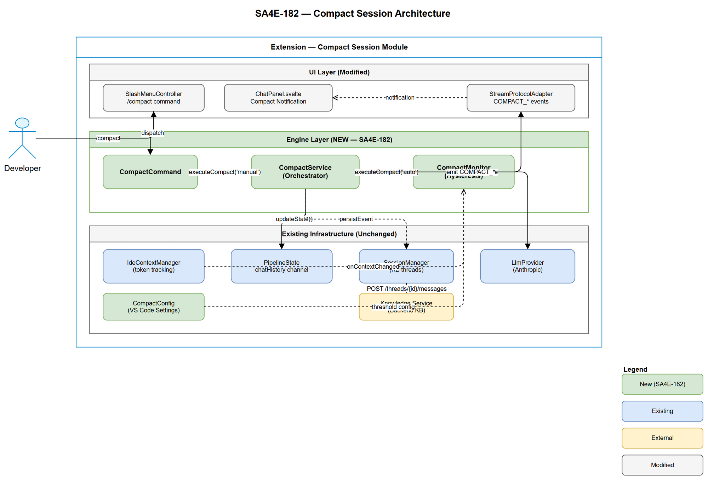
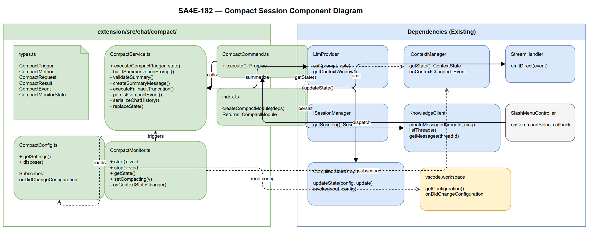

# Technical Design Document (TDD)

## SDLC-Agents-4-Enterprise — SA4E-182: Compact Session

---

## Document Information

| Field | Value |
|-------|-------|
| Jira Ticket | SA4E-182 |
| Title | Compact Session — Technical Design |
| Author | SA Agent |
| Version | 1.0 |
| Date | 2026-08-19 |
| Status | Draft |
| Related FSD | FSD-v1-SA4E-182.docx |
| Related BRD | BRD-v1-SA4E-182.docx |

---

## Author Tracking

| Role | Name - Position | Responsibility |
|------|-----------------|----------------|
| Author | SA Agent – Solution Architect | Create document |
| Peer Reviewer | BA Agent – Business Analyst | Review completeness against FSD |

---

## Revision History

| Version | Date | Author | Changes |
|---------|------|--------|---------|
| 1.0 | 2026-08-19 | SA Agent | Initial design from FSD v1 |

---

## 1. Architecture Overview

### 1.1 Design Philosophy

Compact Session follows the **Plugin pattern** — integrating into the existing chat engine as a self-contained module that hooks into existing extension points (events, state channels, stream protocol). No modifications to existing graph nodes; compact operates as a **side-effect orchestrator** triggered outside the normal LangGraph execution cycle.

### 1.2 Key Architectural Decisions

| # | Decision | Rationale | Alternatives Considered |
|---|----------|-----------|------------------------|
| AD-01 | Compact runs OUTSIDE LangGraph graph execution | chatHistory reducer appends — bypassing it requires direct state injection, not a graph node | Add compact_node to graph (rejected: would require re-compile graph) |
| AD-02 | CompactService is a standalone class, not a graph node | Avoids coupling to graph lifecycle; can be called from command or monitor | Embed in agent_step (rejected: violates SRP) |
| AD-03 | State replacement via `updateState()` with full channel override | LangGraph `updateState` with channel override bypasses reducer | Direct state mutation (rejected: breaks checkpoint consistency) |
| AD-04 | CompactMonitor subscribes to `IdeContextManager.onContextChanged` | Reuse existing event emitter, no polling needed | Polling interval (rejected: latency >500ms, wasteful) |
| AD-05 | Stream events for UI notification (no direct webview postMessage) | Consistent with existing STREAM_* protocol pattern | postMessage directly (rejected: inconsistent, bypasses adapter) |
| AD-06 | `/compact` registered as `itemType: 'command'` (new type) in SlashMenu | Separates command actions from agent invocations | Add as agent (rejected: compact is not an agent, has no streaming LLM response) |

### 1.3 Architecture Diagram



### 1.4 Component Diagram



---

## 2. Module Design

### 2.1 New Modules

| Module | Location | Responsibility |
|--------|----------|----------------|
| CompactService | `extension/src/chat/compact/CompactService.ts` | Orchestrate summarize + state replacement |
| CompactMonitor | `extension/src/chat/compact/CompactMonitor.ts` | Watch context usage, trigger auto-compact |
| CompactCommand | `extension/src/chat/compact/CompactCommand.ts` | Register slash command, handle user trigger |
| CompactTypes | `extension/src/chat/compact/types.ts` | Interfaces, DTOs, enums |
| CompactConfig | `extension/src/chat/compact/CompactConfig.ts` | Configuration reader with reactive updates |

### 2.2 Modified Modules

| Module | Change | Impact |
|--------|--------|--------|
| `SlashMenuItems.ts` | Add `compact` command item to items array | Low — additive |
| `SlashMenuController.ts` | Handle `itemType: 'command'` selection dispatch to command handler | Low — new branch in `selectItem()` |
| `StreamProtocolAdapter.ts` | Add COMPACT_START/COMPLETE/ERROR event types to `ExtensionMessage` union | Low — additive type extension |
| `state-types.ts` | Add `compact_summary` metadata type to ChatMessage | Low — metadata is `Record<string, unknown>` already |
| `chat/types.ts` | Add compact stream event types to `ExtensionMessage` union | Low — additive |

---

## 3. Detailed Class Design

### 3.1 CompactTypes (`types.ts`)

```typescript
/** Trigger source for compact operation */
export type CompactTrigger = 'manual' | 'auto';

/** Method used for context reduction */
export type CompactMethod = 'summary' | 'truncation';

/** Input to CompactService.executeCompact() */
export interface CompactRequest {
  trigger: CompactTrigger;
  chatHistory: ChatMessage[];
  maxTokens: number;
  currentTokens: number;
  threadId: string;
}

/** Result of compact operation */
export interface CompactResult {
  success: boolean;
  method: CompactMethod;
  summary: string;
  beforeUsagePercent: number;
  afterUsagePercent: number;
  beforeTokens: number;
  afterTokens: number;
  messagesRemoved: number;
  timestamp: string;
}

/** Compact event persisted to KB thread */
export interface CompactEvent {
  id: string;
  threadId: string;
  trigger: CompactTrigger;
  method: CompactMethod;
  beforeTokens: number;
  afterTokens: number;
  beforeMessageCount: number;
  summary: string;
  createdAt: string;
}

/** Stream events emitted during compact */
export interface CompactStartEvent {
  type: 'COMPACT_START';
  trigger: CompactTrigger;
  currentUsagePercent: number;
}

export interface CompactCompleteEvent {
  type: 'COMPACT_COMPLETE';
  method: CompactMethod;
  beforeUsagePercent: number;
  afterUsagePercent: number;
  summary: string;
}

export interface CompactErrorEvent {
  type: 'COMPACT_ERROR';
  error: string;
  fallbackApplied: boolean;
}

/** In-memory monitor state */
export interface CompactMonitorState {
  isCompacting: boolean;
  debounceActive: boolean;
  lastThresholdCrossing: number | null;
}
```

### 3.2 CompactConfig (`CompactConfig.ts`)

```typescript
/**
 * SA4E-182 — CompactConfig.
 * Reactive configuration reader for auto-compact settings.
 * Subscribes to workspace.onDidChangeConfiguration for live updates (BR-11).
 */

export interface CompactSettings {
  autoCompact: boolean;
  autoCompactThreshold: number;
}

export class CompactConfig {
  private settings: CompactSettings;
  private disposable: vscode.Disposable;

  constructor(private workspace: typeof vscode.workspace) {
    this.settings = this.readSettings();
    this.disposable = workspace.onDidChangeConfiguration(e => {
      if (e.affectsConfiguration('sa4e.chat')) {
        this.settings = this.readSettings();
      }
    });
  }

  getSettings(): CompactSettings { return this.settings; }

  dispose(): void { this.disposable.dispose(); }

  private readSettings(): CompactSettings {
    const config = this.workspace.getConfiguration('sa4e.chat');
    return {
      autoCompact: config.get<boolean>('autoCompact', true),
      autoCompactThreshold: Math.max(80, Math.min(99,
        config.get<number>('autoCompactThreshold', 95)
      )),
    };
  }
}
```

### 3.3 CompactService (`CompactService.ts`)

```typescript
/**
 * SA4E-182 — CompactService (Orchestrator).
 * Executes compact: summarize OR truncate, then atomic state replacement.
 * Business Rules: BR-01..BR-09, BR-12, BR-14.
 */

export class CompactService {
  constructor(
    private readonly llmProvider: LlmProvider,
    private readonly contextManager: IContextManager,
    private readonly streamHandler: StreamHandler,
    private readonly sessionManager: ISessionManager,
    private readonly monitor: CompactMonitorState
  ) {}

  /**
   * Execute compact operation.
   * @param trigger - 'manual' | 'auto'
   * @param state - Current PipelineState (read-only snapshot)
   * @returns CompactResult with metrics
   * @throws CompactAlreadyRunningError if concurrent
   * @throws InsufficientMessagesError if < 3 messages
   */
  async executeCompact(
    trigger: CompactTrigger,
    state: PipelineState
  ): Promise<CompactResult> { /* see Section 6 */ }
}
```

**Key methods:**

| Method | Responsibility | BR |
|--------|---------------|-----|
| `executeCompact(trigger, state)` | Orchestrate full compact flow | BR-01, BR-02, BR-03 |
| `buildSummarizationPrompt(messages)` | Construct LLM prompt from template + history | BR-08, BR-14 |
| `validateSummary(summary, originalTokens)` | Check size <= 15% of original | BR-09 |
| `createSummaryMessage(summary, beforeTokens)` | Build ChatMessage with metadata | — |
| `executeFallbackTruncation(history)` | Remove oldest 50% messages | BR-07 |
| `persistCompactEvent(event)` | Best-effort KB persist | — |

### 3.4 CompactMonitor (`CompactMonitor.ts`)

```typescript
/**
 * SA4E-182 — CompactMonitor.
 * Subscribes to IdeContextManager state changes.
 * Implements hysteresis debounce logic (BR-05, BR-15).
 */

export class CompactMonitor {
  private state: CompactMonitorState = {
    isCompacting: false,
    debounceActive: false,
    lastThresholdCrossing: null,
  };

  constructor(
    private readonly contextManager: IContextManager,
    private readonly config: CompactConfig,
    private readonly onTrigger: (trigger: CompactTrigger) => Promise<void>
  ) {}

  /** Start monitoring. Subscribe to context state changes. */
  start(): void { /* subscribe onContextChanged */ }

  /** Stop monitoring. Unsubscribe. */
  stop(): void { /* dispose subscription */ }

  /** Get current monitor state (for concurrency check) */
  getState(): CompactMonitorState { return this.state; }

  /** Set compacting flag (called by CompactService) */
  setCompacting(value: boolean): void { this.state.isCompacting = value; }

  /** Handle context state change event (BR-04, BR-05, BR-15) */
  private onContextStateChange(newState: ContextState): void {
    // Hysteresis logic — see Section 6.2
  }
}
```

### 3.5 CompactCommand (`CompactCommand.ts`)

```typescript
/**
 * SA4E-182 — CompactCommand.
 * Handles /compact slash command registration and execution dispatch.
 */

export class CompactCommand {
  constructor(
    private readonly compactService: CompactService,
    private readonly stateProvider: () => PipelineState
  ) {}

  /** SlashMenu command handler — called when user selects /compact */
  async execute(): Promise<void> {
    const state = this.stateProvider();
    await this.compactService.executeCompact('manual', state);
  }
}
```

---

## 4. Integration Design

### 4.1 State Replacement Strategy (AD-03)

The `chatHistory` channel uses an **append-reducer**: `(existing, update) => [...existing, ...update].slice(-200)`. For compact, we need **absolute replacement** (not append).

**Solution:** Use LangGraph's `updateState()` API with channel-level override:

```typescript
// LangGraph CompiledGraph exposes updateState for channel manipulation
async function replaceCompactState(
  graph: CompiledStateGraph,
  threadConfig: RunnableConfig,
  newHistory: ChatMessage[]
): Promise<void> {
  // updateState allows setting channel to absolute value
  // This bypasses the append-reducer for this single update
  await graph.updateState(threadConfig, {
    chatHistory: newHistory,        // Replaces entire array
    agentScratchpad: [],            // Reset stale tool context
    toolCalls: null,                // Clear pending calls
    toolResults: [],                // Clear tool results
    agentIterations: 0,            // Reset iteration counter
  });
}
```

**Why `updateState`:** LangGraph's `updateState` writes directly to the checkpoint store, setting the channel value absolutely. The reducer is only applied during graph invocation — `updateState` bypasses it.

**Thread config:** The `threadConfig` contains `{ configurable: { thread_id } }` — preserving thread identity (BR-03).

### 4.2 IdeContextManager Integration

```
+--------------------+     onContextChanged     +------------------+
| IdeContextManager  |------------------------->|  CompactMonitor  |
|                    |  ContextState { usage% }  |                  |
+--------------------+                          +--------+---------+
                                                         | threshold crossed
                                                         v
                                                +------------------+
                                                |  CompactService  |
                                                +------------------+
```

**Note:** `IdeContextManager.onContextChanged` already fires on every state mutation. CompactMonitor simply subscribes — no modifications to IdeContextManager needed.

### 4.3 SlashMenu Integration

**New item type:** Add `'command'` to `SlashMenuItem.itemType` union.

**Registration in `SlashMenuItems.ts`:**

```typescript
// Add to SLASH_AGENTS array (rename to SLASH_ITEMS in future refactor)
{ id: 'compact', icon: '🗜️', label: 'compact',
  agentName: 'compact', description: 'Summarize and reduce context',
  itemType: 'command' }
```

**Handler in `SlashMenuController.selectItem()`:**

```typescript
private selectItem(item: SlashMenuItem): void {
  if (item.itemType === 'agent') { /* existing */ }
  else if (item.itemType === 'command') {
    this.transition('AGENT_SELECTED'); // Reuse same transition
    this.view.destroy();
    this.options.onCommandSelect(item.id); // New callback
  }
  // ...
}
```

### 4.4 StreamProtocolAdapter Integration

**New event types added to `ExtensionMessage` union:**

```typescript
// In chat/types.ts — ExtensionMessage discriminated union
| { type: 'COMPACT_START'; trigger: CompactTrigger; currentUsagePercent: number }
| { type: 'COMPACT_COMPLETE'; method: CompactMethod; beforeUsagePercent: number;
    afterUsagePercent: number; summary: string }
| { type: 'COMPACT_ERROR'; error: string; fallbackApplied: boolean }
```

**Emission via StreamHandler:** CompactService emits these directly through `streamHandler.emitDirect()` — same pattern used by steering rule injection in `buildChatSubgraph`.

### 4.5 SessionManager Integration (KB Persist)

```typescript
// Persist compact event as a system message in KB thread
async function persistCompactEvent(
  client: KnowledgeClient,
  event: CompactEvent
): Promise<void> {
  try {
    await client.createMessage(event.threadId, {
      role: 'system',
      content: JSON.stringify({
        type: 'compact_event',
        trigger: event.trigger,
        method: event.method,
        beforeTokens: event.beforeTokens,
        afterTokens: event.afterTokens,
        summary: event.summary,
      }),
      agent_id: 'compact-service',
    });
  } catch (err) {
    // BR: KB persist failure is non-blocking (EF-03)
    console.warn('[compact] KB persist failed (non-blocking):', err);
  }
}
```

---

## 5. Configuration Design

### 5.1 VS Code Settings Schema

```json
{
  "sa4e.chat.autoCompact": {
    "type": "boolean",
    "default": true,
    "description": "Automatically compact session when context usage exceeds threshold"
  },
  "sa4e.chat.autoCompactThreshold": {
    "type": "number",
    "default": 95,
    "minimum": 80,
    "maximum": 99,
    "description": "Context usage percentage to trigger auto-compact (80-99)"
  }
}
```

### 5.2 Configuration contributes (package.json)

```json
{
  "contributes": {
    "configuration": {
      "title": "SA4E Chat",
      "properties": {
        "sa4e.chat.autoCompact": { "type": "boolean", "default": true, "description": "..." },
        "sa4e.chat.autoCompactThreshold": { "type": "number", "default": 95, "minimum": 80, "maximum": 99, "description": "..." }
      }
    }
  }
}
```

---

## 6. Processing Logic (Algorithms)

### 6.1 Execute Compact — Main Flow

```typescript
async executeCompact(trigger: CompactTrigger, state: PipelineState): Promise<CompactResult> {
  // Step 1: Acquire mutex
  if (this.monitor.isCompacting) {
    throw new CompactAlreadyRunningError();
  }
  if (state.chatHistory.length < 3) {
    throw new InsufficientMessagesError();
  }

  this.monitor.isCompacting = true;
  const beforeTokens = this.contextManager.getState().tokenCount;
  const beforeUsagePercent = this.contextManager.getState().usagePercent;

  try {
    // Step 2: Emit start event
    this.streamHandler.emitDirect({
      type: 'COMPACT_START', trigger, currentUsagePercent: beforeUsagePercent
    });

    // Step 3: Attempt summarization
    let method: CompactMethod;
    let newHistory: ChatMessage[];
    let summaryText = '';

    try {
      const serialized = this.serializeChatHistory(state.chatHistory);
      const prompt = this.buildSummarizationPrompt(serialized);
      const summary = await this.llmProvider.call(prompt, { timeout: 10_000 });
      this.validateSummary(summary, beforeTokens);
      summaryText = summary;
      newHistory = [this.createSummaryMessage(summary, beforeTokens)];
      method = 'summary';
    } catch (err) {
      // Step 4: Fallback truncation (BR-07)
      const result = this.executeFallbackTruncation(state.chatHistory);
      newHistory = result.messages;
      summaryText = result.notice;
      method = 'truncation';
    }

    // Step 5: Atomic state replacement (AD-03)
    await this.replaceState(state.threadId, {
      chatHistory: newHistory,
      agentScratchpad: [],
      toolCalls: null,
      toolResults: [],
      agentIterations: 0,
    });

    // Step 6: Calculate after metrics
    const afterTokens = this.contextManager.getState().tokenCount;
    const afterUsagePercent = this.contextManager.getState().usagePercent;

    // Step 7: Persist to KB (non-blocking)
    this.persistCompactEvent({
      id: crypto.randomUUID(),
      threadId: state.threadId,
      trigger, method, beforeTokens, afterTokens,
      beforeMessageCount: state.chatHistory.length,
      summary: summaryText,
      createdAt: new Date().toISOString(),
    }).catch(() => {}); // Non-blocking

    // Step 8: Emit complete
    this.streamHandler.emitDirect({
      type: 'COMPACT_COMPLETE', method,
      beforeUsagePercent, afterUsagePercent, summary: summaryText
    });

    return {
      success: true, method, summary: summaryText,
      beforeUsagePercent, afterUsagePercent,
      beforeTokens, afterTokens,
      messagesRemoved: state.chatHistory.length - newHistory.length,
      timestamp: new Date().toISOString(),
    };
  } catch (outerErr) {
    this.streamHandler.emitDirect({
      type: 'COMPACT_ERROR',
      error: (outerErr as Error).message,
      fallbackApplied: false,
    });
    throw outerErr;
  } finally {
    // Step 9: Always release mutex
    this.monitor.isCompacting = false;
  }
}
```

### 6.2 Auto-Compact Monitoring — Hysteresis Logic

```typescript
private onContextStateChange(newState: ContextState): void {
  const { autoCompact, autoCompactThreshold } = this.config.getSettings();

  // Guard: disabled or already compacting
  if (!autoCompact) return;
  if (this.state.isCompacting) return;

  if (newState.usagePercent >= autoCompactThreshold) {
    // Threshold crossed upward — trigger if not debounced
    if (!this.state.debounceActive) {
      this.state.debounceActive = true;
      this.state.lastThresholdCrossing = Date.now();
      // Fire-and-forget: CompactService handles errors internally
      this.onTrigger('auto').catch(err => {
        console.error('[compact-monitor] Auto-compact failed:', err);
      });
    }
  } else if (newState.usagePercent < (autoCompactThreshold - 10)) {
    // Hysteresis reset (BR-15): usage dropped significantly below threshold
    if (this.state.debounceActive) {
      this.state.debounceActive = false;
      this.state.lastThresholdCrossing = null;
    }
  }
}
```

**Hysteresis Explanation:**
- Threshold = 95%: auto-compact fires at 95%
- After compact, usage drops to ~40%
- Debounce flag stays active until usage drops below 85% (threshold - 10)
- Prevents oscillation if usage hovers near threshold

### 6.3 Summarization Prompt Template

```typescript
private buildSummarizationPrompt(serializedHistory: string): string {
  return `You are a conversation summarizer for a code assistant. Summarize the conversation below into a structured format.

PRESERVE:
- All file paths that were created, edited, or discussed
- Key technical decisions and their rationale
- Error patterns debugged and their root causes + fixes
- Open tasks and next steps
- Code snippets critical for continuing work
- Architecture decisions

DO NOT INCLUDE:
- Secrets, API keys, tokens, passwords
- Redundant greetings or acknowledgments
- Duplicate information

FORMAT:
## Summary
### Files Modified
- {path}: {what changed}

### Key Decisions
- {decision}: {rationale}

### Errors Resolved
- {error}: {root cause} -> {fix}

### Open Tasks
- {task description}

### Critical Context
- {any other important info for continuation}

CONVERSATION:
${serializedHistory}`;
}
```

### 6.4 Fallback Truncation

```typescript
private executeFallbackTruncation(
  history: ChatMessage[]
): { messages: ChatMessage[]; notice: string } {
  const midpoint = Math.ceil(history.length / 2);
  const kept = history.slice(midpoint);

  const notice = 'Summarization failed. Oldest messages truncated to free context.';
  const truncationMessage: ChatMessage = {
    id: crypto.randomUUID(),
    role: 'system',
    content: notice,
    timestamp: new Date().toISOString(),
  };

  return {
    messages: [truncationMessage, ...kept],
    notice,
  };
}
```

### 6.5 Chat History Serialization

```typescript
private serializeChatHistory(messages: ChatMessage[]): string {
  return messages.map(m => `[${m.role}]: ${m.content}`).join('\n\n');
}
```

---

## 7. Error Handling

### 7.1 Error Classes

| Error Class | When Thrown | User Message | HTTP-like Code |
|-------------|-----------|--------------|----------------|
| `CompactAlreadyRunningError` | Concurrent compact attempt | "Compact already in progress" | 409 Conflict |
| `InsufficientMessagesError` | chatHistory < 3 messages | "Not enough context to compact" | 400 Bad Request |
| `SummarizationTimeoutError` | LLM call > 10s | (triggers fallback) | 504 Timeout |
| `SummarizationError` | LLM returns malformed response | (triggers fallback) | 502 Bad Gateway |

### 7.2 Error Flow

```
executeCompact()
  |-- CompactAlreadyRunningError -> emit nothing, throw to caller
  |-- InsufficientMessagesError -> emit nothing, throw to caller
  +-- try LLM summarize
       |-- success -> state replace -> COMPACT_COMPLETE
       +-- failure (timeout/malformed/error)
            +-- fallback truncation -> state replace -> COMPACT_COMPLETE (method='truncation')
```

### 7.3 Concurrency Protection

- **Mutex:** `CompactMonitorState.isCompacting` boolean flag
- **Set:** At start of `executeCompact()`, immediately after validation
- **Release:** In `finally` block — guaranteed release even on unexpected errors
- **Check:** Both manual (`CompactCommand.execute()`) and auto (monitor) check before calling

---

## 8. Security Design

### 8.1 Threat Model

| Threat | Vector | Mitigation |
|--------|--------|------------|
| Secret leakage in summary | LLM includes API keys from conversation in summary | Prompt explicitly instructs "DO NOT INCLUDE: Secrets, API keys, tokens, passwords" (BR-14) |
| Prompt injection via summary | Malicious content in summary message could influence future LLM behavior | Summary stored as `role: 'system'` with `metadata.type: 'compact_summary'` — LLM treats as context, not instruction |
| DoS via rapid /compact spam | User triggers many manual compacts | Mutex prevents concurrent execution; only 1 at a time |
| Data loss | Summary misses critical information | Structured prompt with explicit PRESERVE list; user can expand to verify |

### 8.2 Data Classification

| Data | Classification | Handling |
|------|---------------|----------|
| chatHistory (input) | Internal — may contain code, credentials | Processed in-memory, not logged |
| Summary (output) | Internal — filtered | Prompt instructs exclusion of secrets |
| CompactEvent (persist) | Internal | Stored in same KB as existing messages (same security boundary) |
| Compact metrics | Low sensitivity | Token counts, timestamps only |

### 8.3 Security Controls

1. **No new network boundaries:** Compact uses existing LlmProvider and KnowledgeClient — no new external connections
2. **No new auth:** Operates within existing extension security context
3. **No new storage:** Persists to existing KB thread (same SQLite DB, same access controls)
4. **Secret filtering:** Relies on LLM instruction + structured prompt format

---

## 9. Performance Design

### 9.1 Performance Budget

| Operation | Budget | Strategy |
|-----------|--------|----------|
| LLM summarization call | < 10s | Timeout on LlmProvider.call(); fallback on exceed |
| State replacement | < 100ms | Single updateState call — O(1) |
| Monitor detection latency | < 500ms | Event-driven (no polling); handler is sync check |
| KB persist | < 2s | Non-blocking; fire-and-forget with catch |
| Total compact time | < 10s | LLM is bottleneck; rest is < 200ms combined |

### 9.2 Memory Considerations

- CompactMonitor holds ~50 bytes of state (3 primitive fields)
- Summary message replaces N messages — net memory savings
- No caching of previous summaries (not needed)
- Serialization creates temporary string — GC'd after LLM call resolves

### 9.3 Scalability

| Scenario | Tokens | Messages | Strategy |
|----------|--------|----------|----------|
| Small session | < 50K | < 50 | Summary works well, small prompt |
| Medium session | 50-100K | 50-150 | Summary within LLM context, single call |
| Large session | 100-200K | 150-200 | Summary may approach LLM input limit — truncate input if needed |

For large sessions (> 150K tokens), the serialized history itself may exceed the summarization model's context. **Mitigation:** If serialized history > 100K tokens, only send last 100K tokens for summarization (keep most recent context).

---

## 10. State Machine Design

### 10.1 States

| State | Description |
|-------|-------------|
| `IDLE` | Normal chat operation, no compact running |
| `COMPACTING` | Compact in progress (summarizing or truncating) |
| `DEBOUNCE_ACTIVE` | Auto-compact fired; waiting for hysteresis reset |

### 10.2 Transitions

| From | To | Trigger | Guard |
|------|-----|---------|-------|
| IDLE | COMPACTING | `/compact` command | chatHistory.length >= 3 AND !isCompacting |
| IDLE | COMPACTING | usagePercent >= threshold | autoCompact=true AND !debounceActive AND !isCompacting |
| COMPACTING | IDLE | Compact success (manual) | trigger === 'manual' |
| COMPACTING | DEBOUNCE_ACTIVE | Compact success (auto) | trigger === 'auto' |
| COMPACTING | IDLE | Compact failure + fallback | Always transitions back |
| DEBOUNCE_ACTIVE | IDLE | usagePercent < (threshold - 10) | Hysteresis reset |

---

## 11. Dependency Graph

```
CompactCommand
    |
    v calls
CompactService
    |
    |-->  LlmProvider (summarization)
    |-->  IContextManager (read token metrics)
    |-->  StreamHandler (emit events)
    |-->  KnowledgeClient (persist, non-blocking)
    |-->  CompactMonitorState (mutex)
    +-->  CompiledStateGraph.updateState() (state replacement)

CompactMonitor
    |
    |-->  IContextManager.onContextChanged (subscribe)
    |-->  CompactConfig (read threshold)
    +-->  CompactService.executeCompact() (trigger)

CompactConfig
    |
    +-->  vscode.workspace.getConfiguration() (read)
         vscode.workspace.onDidChangeConfiguration() (subscribe)
```

---

## 12. File Structure

```
extension/src/chat/compact/
├── types.ts              — Interfaces, DTOs, enums
├── CompactConfig.ts      — Configuration reader
├── CompactService.ts     — Orchestrator (main logic)
├── CompactMonitor.ts     — Context usage watcher
├── CompactCommand.ts     — Slash command handler
└── index.ts              — Module barrel export + factory
```

**Factory in `index.ts`:**

```typescript
/**
 * SA4E-182 — Compact module factory.
 * Creates and wires all compact components. Called during extension activation.
 */
export function createCompactModule(deps: {
  llmProvider: LlmProvider;
  contextManager: IContextManager;
  streamHandler: StreamHandler;
  sessionManager: ISessionManager;
  graph: CompiledStateGraph;
  workspace: typeof vscode.workspace;
}): CompactModule {
  const config = new CompactConfig(deps.workspace);
  const monitorState: CompactMonitorState = {
    isCompacting: false,
    debounceActive: false,
    lastThresholdCrossing: null,
  };

  const service = new CompactService(
    deps.llmProvider, deps.contextManager,
    deps.streamHandler, deps.sessionManager, monitorState
  );

  const monitor = new CompactMonitor(
    deps.contextManager, config,
    (trigger) => service.executeCompact(trigger, /* get current state */)
  );

  const command = new CompactCommand(service, () => /* get pipeline state */);

  monitor.start();

  return {
    service, monitor, command,
    dispose: () => { monitor.stop(); config.dispose(); },
  };
}
```

---

## 13. Implementation Checklist

| # | Task | Module | Priority | Estimated LOC |
|---|------|--------|----------|---------------|
| 1 | Create `types.ts` — all interfaces and DTOs | compact/types.ts | P0 | ~60 |
| 2 | Create `CompactConfig.ts` — reactive settings | compact/CompactConfig.ts | P0 | ~40 |
| 3 | Create `CompactService.ts` — orchestrator | compact/CompactService.ts | P0 | ~150 |
| 4 | Create `CompactMonitor.ts` — hysteresis watcher | compact/CompactMonitor.ts | P0 | ~80 |
| 5 | Create `CompactCommand.ts` — slash command handler | compact/CompactCommand.ts | P0 | ~30 |
| 6 | Create `index.ts` — factory + barrel exports | compact/index.ts | P0 | ~50 |
| 7 | Modify `SlashMenuItems.ts` — add compact item | webview/slash-menu | P0 | ~5 |
| 8 | Modify `SlashMenuController.ts` — handle command type | webview/slash-menu | P0 | ~15 |
| 9 | Modify `chat/types.ts` — add COMPACT_* event types | chat/types.ts | P0 | ~15 |
| 10 | Modify `package.json` — add settings contributes | extension/package.json | P1 | ~15 |
| 11 | Wire compact module in extension activate | extension entry | P1 | ~20 |
| 12 | Add ChatPanel compact notification rendering | webview/ChatPanel.svelte | P1 | ~50 |

---

## 14. Testing Strategy

### 14.1 Unit Tests

| Test File | Target | Key Scenarios |
|-----------|--------|---------------|
| `CompactService.test.ts` | CompactService | Happy path, fallback, mutex, < 3 msgs |
| `CompactMonitor.test.ts` | CompactMonitor | Threshold crossing, debounce, hysteresis reset |
| `CompactConfig.test.ts` | CompactConfig | Read settings, reactive update |
| `CompactCommand.test.ts` | CompactCommand | Delegates to service correctly |

### 14.2 Integration Tests

| Scenario | What's Real | What's Mocked |
|----------|-------------|---------------|
| Compact with real state | PipelineState, chatHistory | LlmProvider, KnowledgeClient |
| Monitor triggers service | IdeContextManager events | LlmProvider |
| SlashMenu to CompactCommand flow | SlashMenuController | CompactService |

### 14.3 Key Test Cases (from FSD TC-01..TC-14)

| TC | Description | Level |
|----|-------------|-------|
| TC-01 | Manual compact with 10 messages — summary replaces | UT + IT |
| TC-02 | Manual compact with < 3 messages — error | UT |
| TC-03 | Auto-compact at threshold — triggers | UT |
| TC-04 | autoCompact=false — no trigger | UT |
| TC-05 | Debounce prevents double trigger | UT |
| TC-06 | LLM error — fallback truncation | UT + IT |
| TC-09 | Concurrent request rejected | UT |
| TC-12 | thread_id unchanged | IT |
| TC-13 | Hysteresis reset below threshold-10 | UT |

---

## 15. Appendix

### Diagram Index

| # | Diagram | Image | Source (editable) |
|---|---------|-------|-------------------|
| 1 | Architecture | [architecture.png](diagrams/architecture.png) | [architecture.drawio](diagrams/architecture.drawio) |
| 2 | Component | [component.png](diagrams/component.png) | [component.drawio](diagrams/component.drawio) |
